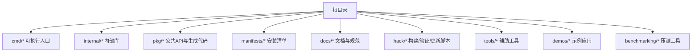
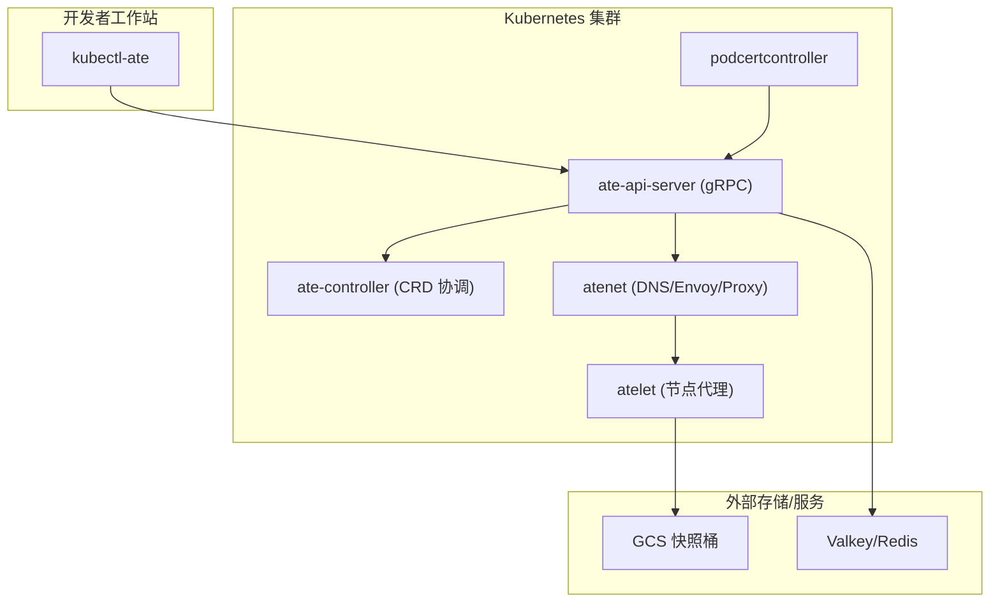
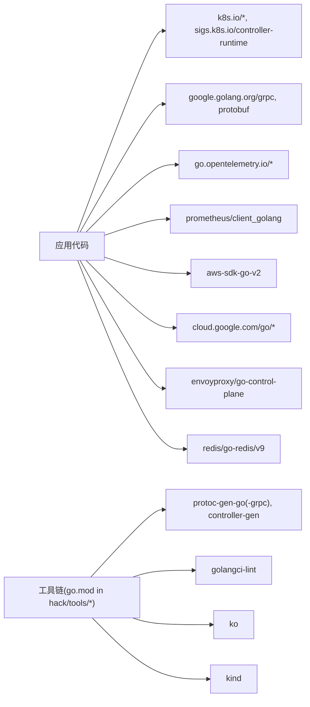

# 开发指南

<cite>
**本文引用的文件**   
- [README.md](file://README.md)
- [CONTRIBUTING.md](file://CONTRIBUTING.md)
- [COLLABORATING.md](file://COLLABORATING.md)
- [Makefile](file://Makefile)
- [go.mod](file://go.mod)
- [hack/update-all.sh](file://hack/update-all.sh)
- [hack/verify-all.sh](file://hack/verify-all.sh)
- [hack/tools/AGENTS.md](file://hack/tools/AGENTS.md)
- [docs/code-style-guide.md](file://docs/code-style-guide.md)
- [docs/api-style-guide.md](file://docs/api-style-guide.md)
- [internal/e2e/README.md](file://internal/e2e/README.md)
- [tools/setup-gcp/README.md](file://tools/setup-gcp/README.md)
- [tools/setup-gcp/main.go](file://tools/setup-gcp/main.go)
- [cmd/ateapi/internal/debugapi/debug_clear.go](file://cmd/ateapi/internal/debugapi/debug_clear.go)
- [pkg/proto/ateapipb/ateapi_grpc.pb.go](file://pkg/proto/ateapipb/ateapi_grpc.pb.go)
</cite>

## 目录
1. [简介](#简介)
2. [项目结构](#项目结构)
3. [核心组件](#核心组件)
4. [架构总览](#架构总览)
5. [详细组件分析](#详细组件分析)
6. [依赖分析](#依赖分析)
7. [性能考虑](#性能考虑)
8. [故障排除指南](#故障排除指南)
9. [结论](#结论)
10. [附录](#附录)

## 简介
本指南面向希望在 Agent Substrate 上进行开发与贡献的工程师，覆盖本地开发环境搭建、代码规范与风格、测试策略与实践、代码生成与工具链、调试与排障、持续集成与部署、以及贡献流程等关键主题。仓库采用 Go 语言与 Kubernetes 生态构建，提供多组件协同（控制面、网络、节点代理、CLI 等）以支撑高并发、低延迟的“Agent”工作负载调度与生命周期管理。

## 项目结构
仓库采用按功能域与命令入口划分的组织方式：
- cmd/*：各可执行程序入口（API Server、控制器、网络组件、节点代理、CLI 等）
- internal/*：内部共享库（认证、拦截器、错误处理、E2E 框架、版本信息等）
- pkg/*：对外暴露的 API 定义与生成的客户端/Informer/Listers
- manifests/*：Kubernetes 安装清单与 Kustomize 配置
- docs/*：文档与规范（代码风格、API 风格、架构、可观测性等）
- hack/*：构建、验证、更新脚本与工具链管理
- tools/*：辅助工具（如 GCP 资源引导）
- demos/*：示例应用与演示
- benchmarking/*：基准测试与压测工具

章节来源
- [README.md:89-125](file://README.md#L89-L125)
- [README.md:211-225](file://README.md#L211-L225)

## 核心组件
- ate-api-server：核心控制面 gRPC API，负责 Actor/WorkerPool 等资源的生命周期管理与路由协调
- ate-controller：Kubernetes Controller，协调 WorkerPool 与 ActorTemplate 自定义资源
- atenet：网络控制器，整合 DNS、Envoy 路由与代理 Sidecar
- atelet：节点级守护进程，管理物理 Worker Pod、快照与状态迁移
- kubectl-ate：管理 CLI，用于创建/查询/操作 Atespace 与 Actor 等
- podcertcontroller：Pod 证书签发控制器（过渡性实现）
- setup-gcp：GCP 资源引导工具，自动化创建 GKE/GCS/IAM/Dashboard 等

章节来源
- [README.md:211-225](file://README.md#L211-L225)
- [tools/setup-gcp/README.md:1-175](file://tools/setup-gcp/README.md#L1-L175)

## 架构总览
下图展示了主要组件及其交互关系：CLI 通过 API Server 管理资源；控制器监听并协调 CRD；网络组件提供 DNS 与路由；节点代理在宿主机侧管理 Worker 与快照。

图表来源
- [README.md:211-225](file://README.md#L211-L225)
- [tools/setup-gcp/README.md:1-175](file://tools/setup-gcp/README.md#L1-L175)

## 详细组件分析

### 开发环境与工具链
- Go 版本要求：参见 go.mod 中声明的版本
- 依赖管理：使用 Go Modules；工具链子模块位于 hack/tools/*，统一通过脚本更新
- 构建与打包：Makefile 封装了镜像构建（ko）、二进制构建（Go build）、格式化与校验
- 快速开始：参考 README 中的 Quickstart 步骤，包含 kind 本地集群与 GKE 两种路径

章节来源
- [go.mod:1-10](file://go.mod#L1-L10)
- [Makefile:38-94](file://Makefile#L38-L94)
- [hack/tools/AGENTS.md:1-7](file://hack/tools/AGENTS.md#L1-L7)
- [README.md:97-125](file://README.md#L97-L125)

### 代码规范与风格指南
- Go 代码风格：遵循 Effective Go、Google Go 风格与 gofmt；本项目对 proto 字段访问、测试实践、TODO 记录有额外约定
- API 风格：gRPC API 设计遵循 Google AIP，结合 Substrate 的两字段身份模型（atespace + name），并对标准方法、枚举命名、字段存在性、乐观并发等进行明确约定
- 版权头：所有源码需包含版权与许可信息

章节来源
- [docs/code-style-guide.md:1-47](file://docs/code-style-guide.md#L1-L47)
- [docs/api-style-guide.md:1-511](file://docs/api-style-guide.md#L1-L511)
- [CONTRIBUTING.md:59-68](file://CONTRIBUTING.md#L59-L68)

### 测试策略与实践
- 单元测试：仅使用标准库 testing，推荐表格驱动测试与 t.Run 子测试；优先使用真实 fake（如 miniredis、envtest），并在 t.Cleanup 中释放资源
- 端到端测试：位于 internal/e2e/suites，通过 --e2e 标志启用；每个套件实现 TestMain 并使用 e2e.RunTestMain() 管理生命周期
- 运行方式：单元测试 go test ./...；E2E 需先安装系统，再按说明运行

章节来源
- [docs/code-style-guide.md:36-47](file://docs/code-style-guide.md#L36-L47)
- [internal/e2e/README.md:1-42](file://internal/e2e/README.md#L1-L42)

### 代码生成与工具链
- 工具更新：通过 hack/update-tool.sh 更新工具子模块，禁止直接编辑子模块 go.mod
- 批量更新/验证：hack/update-all.sh 与 hack/verify-all.sh 分别遍历对应目录下的脚本执行
- 常用生成：Protocol Buffers、Kubernetes 客户端/Informer/Listers、许可证检查、golangci-lint、kind 等由独立子模块管理

章节来源
- [hack/tools/AGENTS.md:1-7](file://hack/tools/AGENTS.md#L1-L7)
- [hack/update-all.sh:1-29](file://hack/update-all.sh#L1-L29)
- [hack/verify-all.sh:1-29](file://hack/verify-all.sh#L1-L29)

### 调试与故障排除
- 调试接口：DebugClear RPC 用于清理持久化数据（开发阶段使用）
- 日志与可观测性：参考 observability 文档进行日志、指标与分布式追踪配置
- 常见问题：确认环境变量与凭据（如 GCP ADC、BUCKET_NAME、ANTHROPIC_API_KEY 等）正确设置；确保集群已安装系统组件

章节来源
- [cmd/ateapi/internal/debugapi/debug_clear.go:1-36](file://cmd/ateapi/internal/debugapi/debug_clear.go#L1-L36)
- [pkg/proto/ateapipb/ateapi_grpc.pb.go:658-688](file://pkg/proto/ateapipb/ateapi_grpc.pb.go#L658-L688)
- [tools/setup-gcp/README.md:1-175](file://tools/setup-gcp/README.md#L1-L175)

### 持续集成与持续部署
- 本地 CI 等价流程：make verify 会运行测试与全部验证脚本；lint、fmt、boilerplate、licenses、proto-fmt 等均可通过 hack/verify/*.sh 单独触发
- 镜像构建：ko 构建镜像并推送到 KO_DOCKER_REPO；Makefile 注入版本号 ldflags
- 发布流程：建议基于 tag 构建镜像，配合 manifests/kustomization 与安装脚本完成部署

章节来源
- [Makefile:86-94](file://Makefile#L86-L94)
- [Makefile:29-52](file://Makefile#L29-L52)
- [hack/verify-all.sh:1-29](file://hack/verify-all.sh#L1-L29)

### 贡献流程与规范
- 提交前准备：签署 CLA；遵循社区行为准则；小步提交、聚焦单一问题或特性
- PR 流程：必须通过 Pull Request；所有变更需附带测试；合并由审查者执行
- AI 辅助：允许使用 AI 辅助编写，但作者需对变更负责并披露；不允许大型 AI 生成 PR 或提交消息；回复审查意见不得依赖 AI
- 工作时间：工作日美西时间 8am-8pm 内合并，避免非工作时间合并紧急修复除外

章节来源
- [CONTRIBUTING.md:28-68](file://CONTRIBUTING.md#L28-L68)
- [COLLABORATING.md:38-106](file://COLLABORATING.md#L38-L106)

## 依赖分析
- 运行时依赖：Kubernetes 生态（client-go、controller-runtime、apiextensions）、gRPC/protobuf、OpenTelemetry、Prometheus、AWS SDK v2、Google Cloud SDK、Envoy 控制面、Redis/Valkey 客户端等
- 工具链依赖：protoc-gen-go、protoc-gen-go-grpc、controller-gen、golangci-lint、ko、kind、setup-envtest 等，均通过 hack/tools 下独立 go.mod 管理

图表来源
- [go.mod:1-193](file://go.mod#L1-L193)
- [hack/tools/AGENTS.md:1-7](file://hack/tools/AGENTS.md#L1-L7)

章节来源
- [go.mod:1-193](file://go.mod#L1-L193)

## 性能考虑
- 控制面旁路：Substrate 将控制面移出关键路径，利用 Worker 池复用与状态快照提升吞吐与降低延迟
- 资源复用：Actor 在 Worker 间迁移时保持内存与文件系统状态，减少冷启动开销
- 可观测性：通过 OpenTelemetry 与 Prometheus 采集指标与链路追踪，定位瓶颈
- 网络层：atenet 提供高效路由与 DNS，结合 Envoy 扩展能力优化转发路径

[本节为通用指导，不直接分析具体文件]

## 故障排除指南
- 本地环境
  - 确认 Go 版本与依赖下载正常；必要时清理缓存后重试
  - kind 集群无法启动时，检查 Docker/容器运行时与端口占用
- 组件安装
  - 使用 install-ate-kind.sh 或 install-ate.sh 的参数逐步安装，定位失败环节
  - GCP 环境：使用 setup-gcp bootstrap 或分步命令，核对 PROJECT_ID、BUCKET_NAME 等环境变量
- 调试接口
  - 开发阶段可通过 DebugClear 清理状态，便于复现问题
- 日志与追踪
  - 开启组件日志与 OTLP 导出，结合 Prometheus 面板排查异常

章节来源
- [README.md:97-125](file://README.md#L97-L125)
- [tools/setup-gcp/README.md:1-175](file://tools/setup-gcp/README.md#L1-L175)
- [cmd/ateapi/internal/debugapi/debug_clear.go:1-36](file://cmd/ateapi/internal/debugapi/debug_clear.go#L1-L36)

## 结论
本指南汇总了从环境搭建到贡献流程的全链路要点。建议在开发过程中严格遵循代码与 API 风格规范，完善单测与 E2E 用例，合理使用工具链与生成代码，并通过可观测性与调试接口提升排障效率。对于大规模部署，结合 ko 与 manifests/Kustomize 形成稳定的构建与发布流水线。

[本节为总结性内容，不直接分析具体文件]

## 附录

### 常用命令速查
- 构建与打包
  - make build：构建镜像与 kubectl-ate
  - make build-images：仅构建镜像
  - make build-atectl：仅构建 CLI
- 测试与验证
  - make test：运行全部单元测试
  - make verify：运行测试与全部验证脚本
  - make lint / make fmt / make verify-fmt：代码质量相关
- E2E 测试
  - 参考 internal/e2e/README.md 的步骤，先安装系统，再运行套件

章节来源
- [Makefile:38-94](file://Makefile#L38-L94)
- [internal/e2e/README.md:1-42](file://internal/e2e/README.md#L1-L42)
