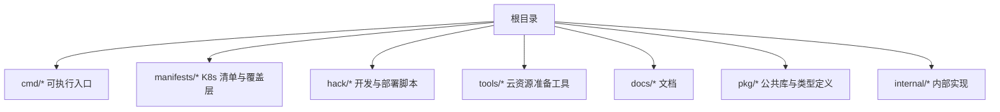
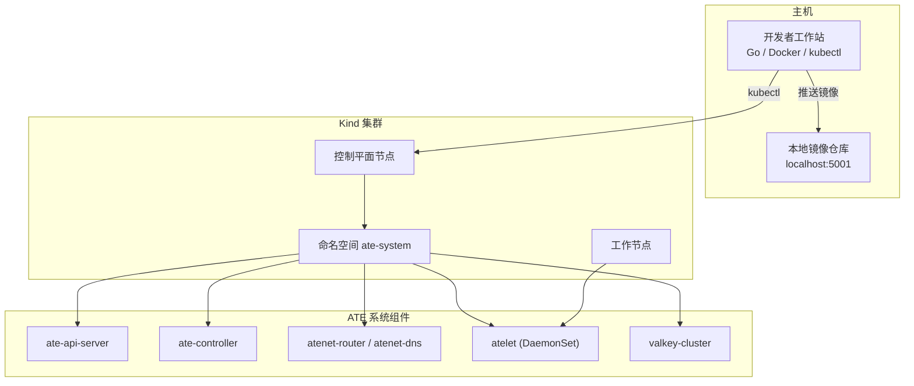
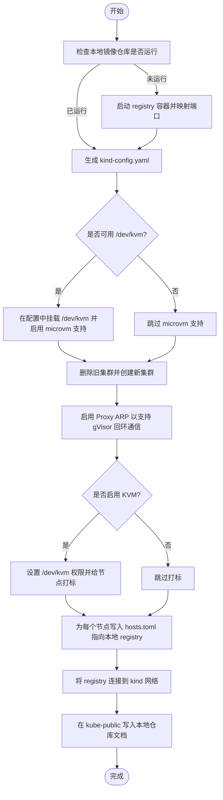
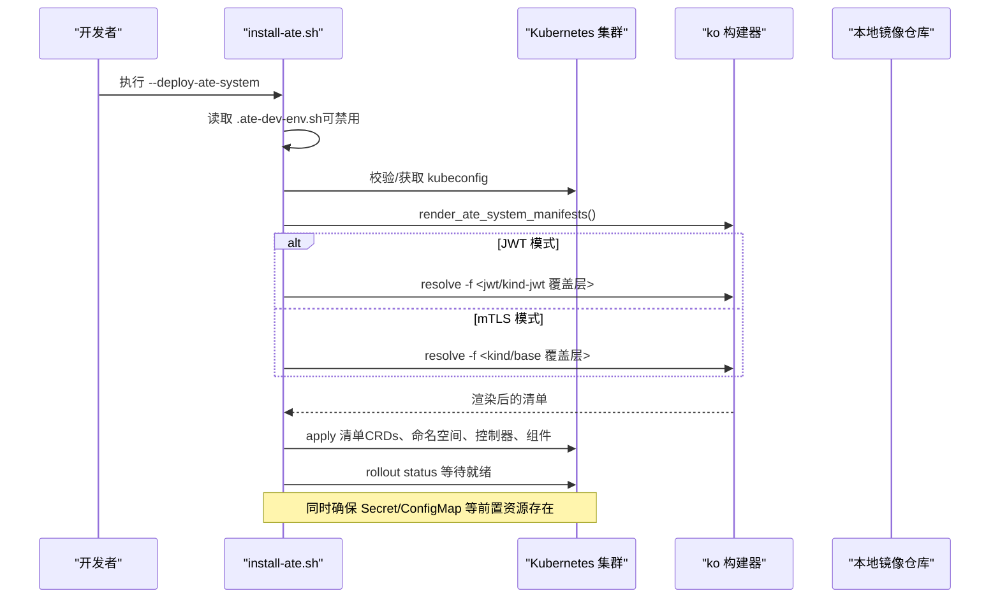
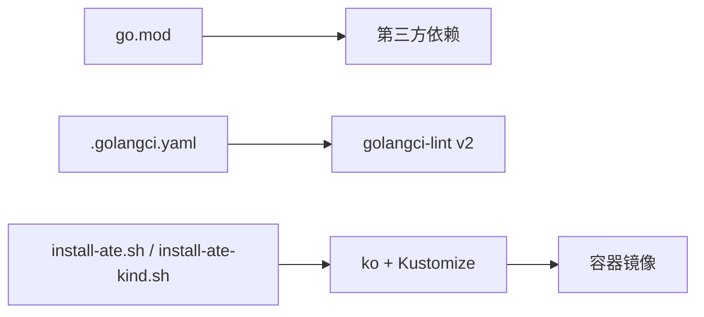

# 开发环境搭建

<cite>
**本文引用的文件**   
- [README.md](file://README.md)
- [go.mod](file://go.mod)
- [.golangci.yaml](file://.golangci.yaml)
- [hack/create-kind-cluster.sh](file://hack/create-kind-cluster.sh)
- [hack/kind.sh](file://hack/kind.sh)
- [hack/install-ate-kind.sh](file://hack/install-ate-kind.sh)
- [hack/install-ate.sh](file://hack/install-ate.sh)
- [hack/ate-dev-env.sh.example](file://hack/ate-dev-env.sh.example)
- [tools/setup-gcp/main.go](file://tools/setup-gcp/main.go)
- [tools/setup-gcp/README.md](file://tools/setup-gcp/README.md)
</cite>

## 目录
1. [简介](#简介)
2. [项目结构](#项目结构)
3. [核心组件](#核心组件)
4. [架构总览](#架构总览)
5. [详细组件分析](#详细组件分析)
6. [依赖分析](#依赖分析)
7. [性能考虑](#性能考虑)
8. [故障排查指南](#故障排查指南)
9. [结论](#结论)
10. [附录](#附录)

## 简介
本指南面向首次接触 Agent Substrate 的开发者，提供从零开始的本地开发环境搭建说明。内容涵盖：
- Go 语言版本要求与依赖安装（Go、Docker、kubectl）
- 本地 Kubernetes 集群创建与配置（基于 Kind）
- 项目依赖管理与构建（go mod、ko）
- IDE 配置建议（VS Code、GoLand）
- 环境变量与配置文件模板
- 常见问题排查与解决方案

## 项目结构
仓库采用“命令入口 + 模块包 + 清单 + 脚本”的组织方式：
- cmd：各可执行程序入口（API Server、控制器、网络组件等）
- manifests：Kubernetes 部署清单与 Kustomize 覆盖层
- hack：开发与部署辅助脚本（Kind 集群、安装、演示等）
- tools：云资源准备工具（如 GCP setup）
- docs：文档与最佳实践

[本节为概念性概述，不直接分析具体文件]

## 核心组件
- 本地开发快速开始
  - 前置工具：Go、kubectl、Docker
  - 一键脚本：创建 Kind 集群、安装系统组件、部署示例
- 安装与卸载
  - 通过统一安装脚本管理核心系统与演示应用
  - 支持按组件粒度部署或清理
- 环境变量与配置
  - 使用 .ate-dev-env.sh 集中管理环境与默认值
  - 支持在 Kind 与云端（GKE）之间切换

章节来源
- [README.md:97-128](file://README.md#L97-L128)
- [hack/install-ate.sh:52-98](file://hack/install-ate.sh#L52-L98)
- [hack/install-ate.sh:253-310](file://hack/install-ate.sh#L253-L310)
- [hack/install-ate.sh:473-482](file://hack/install-ate.sh#L473-L482)
- [hack/ate-dev-env.sh.example:15-42](file://hack/ate-dev-env.sh.example#L15-L42)

## 架构总览
下图展示了本地开发时，从主机到 Kind 集群及 ATE 系统组件的交互关系。

图表来源
- [hack/create-kind-cluster.sh:60-92](file://hack/create-kind-cluster.sh#L60-L92)
- [hack/install-ate.sh:267-310](file://hack/install-ate.sh#L267-L310)

章节来源
- [hack/create-kind-cluster.sh:60-92](file://hack/create-kind-cluster.sh#L60-L92)
- [hack/install-ate.sh:267-310](file://hack/install-ate.sh#L267-L310)

## 详细组件分析

### 本地 Kubernetes 集群（Kind）
- 功能要点
  - 自动启动本地镜像仓库（端口映射至 5001）
  - 生成 Kind 配置并启用必要特性门控
  - 可选启用 KVM 以支持 microvm 运行时
  - 将本地仓库注册信息注入容器d配置与集群 ConfigMap
- 关键流程
  - 检测/创建本地 registry
  - 生成 kind-config.yaml（含 featureGates/runtimeConfig）
  - 删除旧集群并创建新集群
  - 启用 Proxy ARP（gVisor 回环互通）
  - 若检测到 KVM，则赋予节点权限并打标签
  - 为每个节点写入 hosts.toml 指向本地 registry
  - 连接 registry 到 kind 网络并记录到 kube-public

图表来源
- [hack/create-kind-cluster.sh:26-43](file://hack/create-kind-cluster.sh#L26-L43)
- [hack/create-kind-cluster.sh:60-86](file://hack/create-kind-cluster.sh#L60-L86)
- [hack/create-kind-cluster.sh:88-92](file://hack/create-kind-cluster.sh#L88-L92)
- [hack/create-kind-cluster.sh:94-108](file://hack/create-kind-cluster.sh#L94-L108)
- [hack/create-kind-cluster.sh:110-124](file://hack/create-kind-cluster.sh#L110-L124)
- [hack/create-kind-cluster.sh:126-138](file://hack/create-kind-cluster.sh#L126-L138)

章节来源
- [hack/create-kind-cluster.sh:26-43](file://hack/create-kind-cluster.sh#L26-L43)
- [hack/create-kind-cluster.sh:60-86](file://hack/create-kind-cluster.sh#L60-L86)
- [hack/create-kind-cluster.sh:88-92](file://hack/create-kind-cluster.sh#L88-L92)
- [hack/create-kind-cluster.sh:94-108](file://hack/create-kind-cluster.sh#L94-L108)
- [hack/create-kind-cluster.sh:110-124](file://hack/create-kind-cluster.sh#L110-L124)
- [hack/create-kind-cluster.sh:126-138](file://hack/create-kind-cluster.sh#L126-L138)

### 安装与部署（install-ate.sh）
- 能力概览
  - 解析并加载 .ate-dev-env.sh（可通过 NO_DEV_ENV 禁用）
  - 根据上下文或 PROJECT_ID 自动获取 kubeconfig
  - 渲染并应用 CRDs、SandboxConfig、命名空间、证书控制器、系统组件
  - 支持按组件维度部署/删除（apiserver、controller、atenet、atelet）
  - 支持演示应用与基准测试的部署/删除
- 认证模式
  - 支持 mtls 与 jwt 两种认证模式，通过 --auth-mode 指定
- Kind 适配
  - 当 ATE_INSTALL_KIND=true 时，使用 Kustomize 覆盖层与本地仓库地址

图表来源
- [hack/install-ate.sh:22-35](file://hack/install-ate.sh#L22-L35)
- [hack/install-ate.sh:147-167](file://hack/install-ate.sh#L147-L167)
- [hack/install-ate.sh:267-310](file://hack/install-ate.sh#L267-L310)
- [hack/install-ate.sh:312-325](file://hack/install-ate.sh#L312-L325)

章节来源
- [hack/install-ate.sh:22-35](file://hack/install-ate.sh#L22-L35)
- [hack/install-ate.sh:147-167](file://hack/install-ate.sh#L147-L167)
- [hack/install-ate.sh:267-310](file://hack/install-ate.sh#L267-L310)
- [hack/install-ate.sh:312-325](file://hack/install-ate.sh#L312-L325)

### Kind 安装桥接（install-ate-kind.sh）
- 作用
  - 设置 KO_DOCKER_REPO 指向本地 registry
  - 设置构建平台为宿主机架构
  - 启用 ATE_INSTALL_KIND 以选择 Kind 覆盖层
  - 调用通用安装脚本完成部署
- 典型用法
  - 在 README 的快速开始中作为安装步骤的一部分

章节来源
- [hack/install-ate-kind.sh:22-38](file://hack/install-ate-kind.sh#L22-L38)
- [README.md:104-123](file://README.md#L104-L123)

### Kind 工具封装（kind.sh）
- 作用
  - 通过 run-tool.sh 统一下载/缓存 kind 二进制并转发参数
- 意义
  - 保证团队一致的工具版本，避免手动安装差异

章节来源
- [hack/kind.sh:17-21](file://hack/kind.sh#L17-L21)

### 云资源准备工具（setup-gcp）
- 目标
  - 自动化创建/配置 GKE 集群、GCS 存储桶、IAM 绑定、监控仪表盘
- 前置条件
  - Go（与项目 go.mod 兼容）、gcloud、ADC 认证、具备足够权限的项目
- 常用命令
  - bootstrap：按顺序执行所有步骤
  - enable apis / create cluster / create bucket / create iam / create dashboards
- 配置
  - 支持通过环境变量覆盖 CLI 参数，推荐复制示例文件并 source

章节来源
- [tools/setup-gcp/README.md:19-39](file://tools/setup-gcp/README.md#L19-L39)
- [tools/setup-gcp/README.md:41-148](file://tools/setup-gcp/README.md#L41-L148)
- [tools/setup-gcp/main.go:24-29](file://tools/setup-gcp/main.go#L24-L29)

## 依赖分析
- Go 版本
  - 根 go.mod 声明了所需的 Go 版本；请确保本地 Go 版本满足要求
- 第三方依赖
  - 通过 go.mod 管理，推荐使用 go mod tidy 同步依赖
- 代码质量
  - 使用 golangci-lint v2，配置文件位于 .golangci.yaml
- 构建与打包
  - 使用 ko 进行镜像构建与解析，结合 Kustomize 覆盖层适配不同环境

图表来源
- [go.mod:1-60](file://go.mod#L1-L60)
- [.golangci.yaml:15-27](file://.golangci.yaml#L15-L27)
- [hack/install-ate.sh:112-133](file://hack/install-ate.sh#L112-L133)

章节来源
- [go.mod:1-60](file://go.mod#L1-L60)
- [.golangci.yaml:15-27](file://.golangci.yaml#L15-L27)
- [hack/install-ate.sh:112-133](file://hack/install-ate.sh#L112-L133)

## 性能考虑
- 本地开发优先使用 Kind 与本地镜像仓库，减少镜像拉取时间
- 合理设置 KO_DEFAULTPLATFORMS 匹配宿主机架构，避免跨架构构建
- 在具备 KVM 的机器上启用 microvm 支持可获得更好的隔离与性能

[本节为通用指导，不直接分析具体文件]

## 故障排查指南
- 无法访问本地镜像仓库
  - 确认本地 registry 容器正在运行且端口映射正确
  - 确认 Kind 节点已写入 hosts.toml 并将 registry 加入 kind 网络
  - 参考脚本中的日志输出定位问题
- 集群特性门控未生效
  - 确认 kind-config.yaml 中启用了 ClusterTrustBundle、PodCertificateRequest 等特性
- 认证模式错误
  - 使用 --auth-mode=mtls|jwt 指定合法值，否则安装脚本会报错退出
- 缺少 jq 导致演示清理失败
  - 安装 jq 后再执行删除操作
- 需要重建 Kind 集群
  - 使用提供的删除脚本清理后重新创建

章节来源
- [hack/create-kind-cluster.sh:26-43](file://hack/create-kind-cluster.sh#L26-L43)
- [hack/create-kind-cluster.sh:110-124](file://hack/create-kind-cluster.sh#L110-L124)
- [hack/create-kind-cluster.sh:60-86](file://hack/create-kind-cluster.sh#L60-L86)
- [hack/install-ate.sh:135-145](file://hack/install-ate.sh#L135-L145)
- [hack/install-ate.sh:431-445](file://hack/install-ate.sh#L431-L445)

## 结论
通过本指南，你可以在本地快速搭建 Kind 集群并完成 Agent Substrate 的开发环境初始化。借助统一的安装脚本与环境变量模板，你可以灵活地在 Kind 与云端环境间切换，并以最小成本迭代与调试。

[本节为总结性内容，不直接分析具体文件]

## 附录

### 必备工具与版本
- Go：请参考根 go.mod 中声明的版本
- Docker：用于本地镜像仓库与容器化构建
- kubectl：用于与 Kubernetes 集群交互
- kind：由脚本统一管理，无需手动安装

章节来源
- [README.md:97-101](file://README.md#L97-L101)
- [go.mod:1-6](file://go.mod#L1-L6)

### 环境变量与配置模板
- 示例模板路径：hack/ate-dev-env.sh.example
- 常见变量
  - PROJECT_ID、PROJECT_NUMBER、GCE_REGION、CLUSTER_LOCATION
  - NETWORK、SUBNETWORK、CLUSTER_NAME、CLUSTER_VERSION
  - NODE_POOL_NAME、NODE_POOL_VERSION、GVISOR_NODE_MACHINE_TYPE
  - KUBECTL_CONTEXT、BUCKET_NAME、KO_DOCKER_REPO、KO_DEFAULTPLATFORMS
- 使用方式
  - 复制到 .ate-dev-env.sh 并编辑，然后在终端 source 生效
  - 安装脚本会自动加载该文件（可通过 NO_DEV_ENV 禁用）

章节来源
- [hack/ate-dev-env.sh.example:15-42](file://hack/ate-dev-env.sh.example#L15-L42)
- [hack/install-ate.sh:22-27](file://hack/install-ate.sh#L22-L27)

### IDE 配置建议
- VS Code
  - 推荐插件：Go、Kubernetes、YAML、GitLens
  - 建议开启 gofmt/gopls 相关设置，配合 .golangci.yaml 保持一致的代码风格
- GoLand
  - 启用内置 Go 支持，配置 golangci-lint 集成，保持与 CI 一致的规则

[本节为通用建议，不直接分析具体文件]

### 快速开始（本地 Kind）
- 前置：安装 Go、kubectl、Docker
- 步骤
  - 创建 Kind 集群与本地镜像仓库
  - 安装 ATE 系统组件
  - 安装演示应用
  - 安装 kubectl-ate 插件
  - 创建 atespace 与 actor，并通过 port-forward 访问路由服务

章节来源
- [README.md:97-128](file://README.md#L97-L128)
