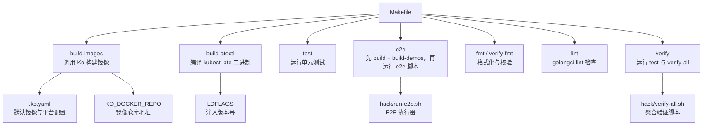
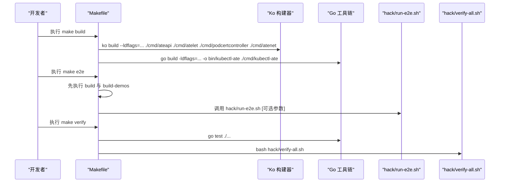
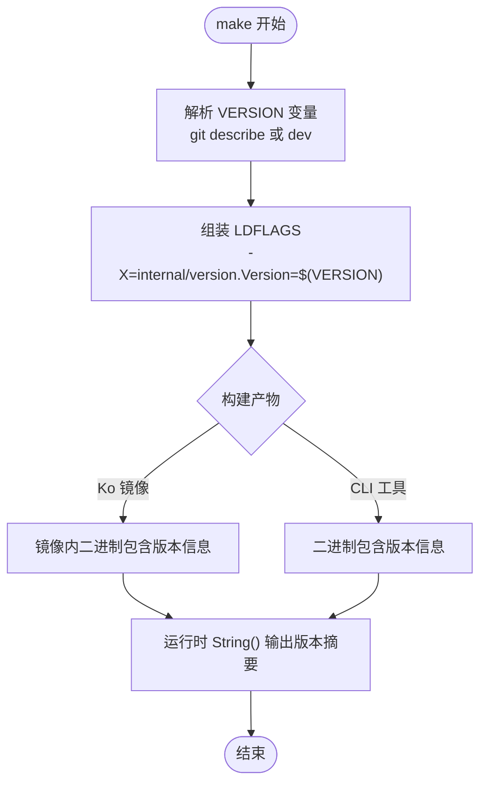
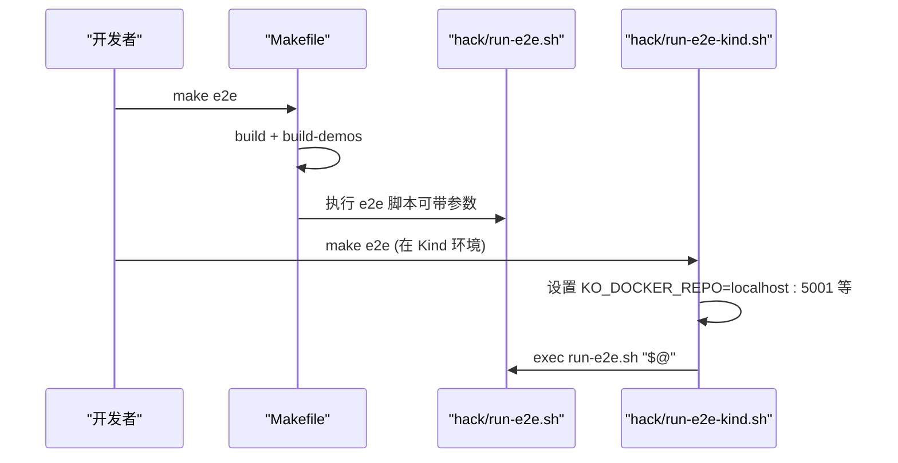
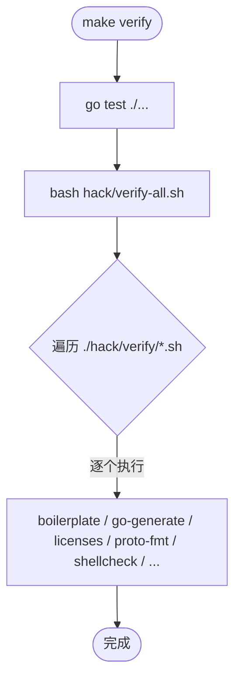
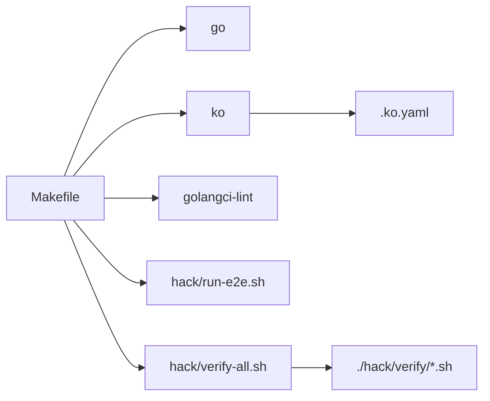

# Makefile构建指南

<cite>
**本文引用的文件**   
- [Makefile](file://Makefile)
- [.ko.yaml](file://.ko.yaml)
- [internal/version/version.go](file://internal/version/version.go)
- [hack/run-e2e.sh](file://hack/run-e2e.sh)
- [hack/verify-all.sh](file://hack/verify-all.sh)
- [hack/verify/golangci-lint.sh](file://hack/verify/golangci-lint.sh)
</cite>

## 目录
1. [简介](#简介)
2. [项目结构](#项目结构)
3. [核心组件](#核心组件)
4. [架构总览](#架构总览)
5. [详细组件分析](#详细组件分析)
6. [依赖关系分析](#依赖关系分析)
7. [性能与效率建议](#性能与效率建议)
8. [故障排查指南](#故障排查指南)
9. [结论](#结论)
10. [附录：常用命令速查](#附录常用命令速查)

## 简介
本指南面向使用仓库根目录 Makefile 进行构建、测试、镜像打包与质量检查的开发者。内容覆盖所有主要目标（build、test、e2e、fmt、lint、verify 等）的用途与参数，解释版本管理机制（VERSION 变量与 LDFLAGS），说明镜像构建配置（KO_DOCKER_REPO 与多组件构建流程），并提供常见场景的命令示例，帮助你在本地快速完成开发、测试与发布准备。

## 项目结构
与构建系统直接相关的顶层文件与脚本如下：
- Makefile：定义所有构建目标、环境变量与默认行为
- .ko.yaml：Ko 镜像构建默认配置（基础镜像、平台、特定组件镜像替换）
- internal/version/version.go：二进制运行时版本信息注入与回退逻辑
- hack/run-e2e.sh：端到端测试执行封装
- hack/verify-all.sh：统一触发 verify 子脚本
- hack/verify/golangci-lint.sh：静态检查入口



图表来源
- [Makefile:35-99](file://Makefile#L35-L99)
- [.ko.yaml:15-28](file://.ko.yaml#L15-L28)
- [hack/run-e2e.sh:1-108](file://hack/run-e2e.sh#L1-L108)
- [hack/verify-all.sh:1-29](file://hack/verify-all.sh#L1-L29)

章节来源
- [Makefile:15-99](file://Makefile#L15-L99)
- [.ko.yaml:15-28](file://.ko.yaml#L15-L28)

## 核心组件
本节聚焦 Makefile 中定义的构建目标及其行为。

- all：默认目标，等价于 build
- build：组合目标，依次执行 build-images 与 build-atectl
- build-images：通过 Ko 构建多个服务镜像（ateapi、atelet、podcertcontroller、atenet）
- build-atectl：编译 kubectl-ate 命令行工具到 bin/kubectl-ate
- build-atenet：编译 atenet 二进制到 bin/atenet
- build-demos：构建 demo 镜像（如 demos/counter）
- test：运行全部单元测试
- e2e：先执行 build 与 build-demos，再调用 hack/run-e2e.sh 运行端到端测试
- fmt：格式化 Go 代码（内部调用 hack/update/gofmt.sh）
- verify-fmt：校验 Go 代码格式（内部调用 hack/verify/gofmt.sh）
- lint：运行 golangci-lint（内部调用 hack/verify/golangci-lint.sh）
- verify：先运行 test，再执行 hack/verify-all.sh 聚合验证
- clean：清理 bin 目录
- ldflags：打印当前 LDFLAGS（便于调试版本注入）

章节来源
- [Makefile:35-99](file://Makefile#L35-L99)

## 架构总览
下图展示了从 make 目标到具体工具的调用链，以及关键环境变量的作用点。



图表来源
- [Makefile:39-68](file://Makefile#L39-L68)
- [hack/run-e2e.sh:1-108](file://hack/run-e2e.sh#L1-L108)
- [hack/verify-all.sh:1-29](file://hack/verify-all.sh#L1-L29)

## 详细组件分析

### 构建目标详解
- build
  - 作用：一键构建所有镜像与 CLI 工具
  - 依赖：build-images、build-atectl
- build-images
  - 作用：使用 Ko 将四个核心组件打包为容器镜像
  - 关键参数：--ldflags 注入版本信息；组件路径固定为 cmd/ateapi、cmd/atelet、cmd/podcertcontroller、cmd/atenet
- build-atectl
  - 作用：生成 kubectl-ate 可执行文件至 bin/kubectl-ate
- build-atenet
  - 作用：生成 atenet 可执行文件至 bin/atenet
- build-demos
  - 作用：构建 demo 镜像（例如 demos/counter）
- test
  - 作用：运行全部单元测试
- e2e
  - 作用：在构建产物就绪后，运行端到端测试
  - 注意：会先执行 build 与 build-demos，确保镜像与演示程序可用
- fmt / verify-fmt
  - 作用：格式化代码与校验格式一致性
- lint
  - 作用：运行 golangci-lint 进行静态检查
- verify
  - 作用：先跑单元测试，再执行所有 verify 脚本（boilerplate、go-generate、licenses、proto-fmt、shellcheck 等）
- clean
  - 作用：删除 bin 目录

章节来源
- [Makefile:35-99](file://Makefile#L35-L99)

### 版本管理与 LDFLAGS
- VERSION 变量
  - 默认值：尝试通过 git describe 获取标签或提交哈希，失败则回退为 dev
  - 支持在 make 命令行覆盖，用于固定版本（例如 make VERSION=v0.5.0 build）
- LDFLAGS
  - 通过 -X 将版本号注入到 internal/version.Version 包变量
  - 提供 ldflags 目标以打印最终使用的 LDFLAGS，便于排障
- 运行时回退
  - 若未通过 LDFLAGS 注入 Commit/BuildDate，则在 init() 中读取构建信息作为回退



图表来源
- [Makefile:29-34](file://Makefile#L29-L34)
- [internal/version/version.go:27-61](file://internal/version/version.go#L27-L61)

章节来源
- [Makefile:29-34](file://Makefile#L29-L34)
- [internal/version/version.go:15-61](file://internal/version/version.go#L15-L61)

### 镜像构建配置（Ko）
- 仓库地址
  - KO_DOCKER_REPO 由 Makefile 导出，默认基于 PROJECT_ID 构造 gcr.io/<PROJECT_ID>/ate-images
  - 可在 make 命令行覆盖，或在 CI/CD 环境中设置
- 基础镜像与平台
  - .ko.yaml 指定默认基础镜像为 distroless static-debian13
  - 默认构建平台为 linux/amd64 与 linux/arm64
  - 针对特定组件可覆盖基础镜像（例如 ateom-microvm 需要 debian:stable-slim）
- 多组件构建
  - build-images 一次性传入多个组件路径，Ko 会为每个组件生成独立镜像

```mermaid
classDiagram
class KoConfig {
+defaultBaseImage : "gcr.io/distroless/static-debian13"
+defaultPlatforms : ["linux/amd64","linux/arm64"]
+baseImageOverrides : {
"demos/sandbox" : "alpine",
"demos/agent-secret" : "alpine",
"cmd/ateom-microvm" : "debian : stable-slim"
}
}
class Makefile {
+export KO_DOCKER_REPO
+build-images(target...)
}
KoConfig <.. Makefile : "Ko 读取 .ko.yaml"
```

图表来源
- [.ko.yaml:15-28](file://.ko.yaml#L15-L28)
- [Makefile:18-20](file://Makefile#L18-L20)
- [Makefile:42-48](file://Makefile#L42-L48)

章节来源
- [Makefile:15-20](file://Makefile#L15-L20)
- [.ko.yaml:15-28](file://.ko.yaml#L15-L28)

### 端到端测试（e2e）
- 入口
  - make e2e 会先执行 build 与 build-demos，再调用 hack/run-e2e.sh
- 参数传递
  - 支持在 make e2e 之后追加 go test 参数与 -args 后的 e2e 框架参数
  - 可通过环境变量 KUBECTL_CONTEXT 自动注入 --kube-context
- 辅助脚本
  - hack/run-e2e-kind.sh 为 Kind 环境预设 KO_DOCKER_REPO、BUCKET_NAME、KUBECTL_CONTEXT 等，并转发参数给 run-e2e.sh



图表来源
- [Makefile:66-68](file://Makefile#L66-L68)
- [hack/run-e2e.sh:1-108](file://hack/run-e2e.sh#L1-L108)

章节来源
- [Makefile:66-68](file://Makefile#L66-L68)
- [hack/run-e2e.sh:1-108](file://hack/run-e2e.sh#L1-L108)

### 代码格式化与质量检查
- fmt
  - 调用 hack/update/gofmt.sh 对全项目进行格式化
- verify-fmt
  - 调用 hack/verify/gofmt.sh 校验格式一致性
- lint
  - 调用 hack/verify/golangci-lint.sh，强制 GOOS=linux 以保证跨平台类型检查一致
- verify
  - 先执行 test，再执行 hack/verify-all.sh，后者遍历 hack/verify 下所有 *.sh 并逐一执行



图表来源
- [Makefile:92-94](file://Makefile#L92-L94)
- [hack/verify-all.sh:1-29](file://hack/verify-all.sh#L1-L29)
- [hack/verify/golangci-lint.sh:1-30](file://hack/verify/golangci-lint.sh#L1-L30)

章节来源
- [Makefile:78-94](file://Makefile#L78-L94)
- [hack/verify-all.sh:1-29](file://hack/verify-all.sh#L1-L29)
- [hack/verify/golangci-lint.sh:1-30](file://hack/verify/golangci-lint.sh#L1-L30)

## 依赖关系分析
- 外部工具
  - go：Go 工具链
  - ko：镜像构建工具（通过 hack/run-tool.sh 管理）
  - golangci-lint：静态检查（通过 hack/run-tool.sh 管理）
- 内部脚本
  - hack/run-e2e.sh：E2E 测试执行器
  - hack/verify-all.sh：聚合验证脚本
  - hack/verify/golangci-lint.sh：lint 入口
- 配置文件
  - .ko.yaml：Ko 默认镜像与平台策略
  - Makefile：构建目标与环境变量



图表来源
- [Makefile:21-24](file://Makefile#L21-L24)
- [.ko.yaml:15-28](file://.ko.yaml#L15-L28)
- [hack/verify-all.sh:1-29](file://hack/verify-all.sh#L1-L29)

章节来源
- [Makefile:21-24](file://Makefile#L21-L24)
- [.ko.yaml:15-28](file://.ko.yaml#L15-L28)
- [hack/verify-all.sh:1-29](file://hack/verify-all.sh#L1-L29)

## 性能与效率建议
- 增量构建
  - 使用 make build 仅重新构建变更的目标；必要时单独调用 build-images 或 build-atectl
- 并行测试
  - 在 test 目标基础上，可通过 go test 的 -p 与 -race 等参数提升速度与健壮性（按需启用）
- 镜像缓存
  - 合理设置 KO_DOCKER_REPO 指向本地或共享镜像仓库，减少重复推送与拉取
- 平台选择
  - 仅在需要时构建多平台镜像；默认已配置 linux/amd64 与 linux/arm64

[本节为通用建议，不直接分析具体文件]

## 故障排查指南
- 版本未注入
  - 现象：二进制版本显示为 dev 或 unknown
  - 排查：使用 make ldflags 查看实际 LDFLAGS；确认 git 标签存在且可被 git describe 解析
- 镜像仓库不可写
  - 现象：ko build 报错无法推送镜像
  - 排查：检查 KO_DOCKER_REPO 是否正确；确认认证与网络可达
- E2E 连接集群失败
  - 现象：e2e 测试报 kubeconfig/context 错误
  - 排查：确认 KUBECTL_CONTEXT 是否设置；在 Kind 环境下优先使用 hack/run-e2e-kind.sh
- 静态检查失败
  - 现象：lint 或 verify 失败
  - 排查：按提示修复问题；macOS 上 golangci-lint 已通过 GOOS=linux 规避平台差异导致的类型检查失败

章节来源
- [Makefile:29-34](file://Makefile#L29-L34)
- [Makefile:18-20](file://Makefile#L18-L20)
- [hack/run-e2e.sh:1-108](file://hack/run-e2e.sh#L1-L108)
- [hack/verify/golangci-lint.sh:1-30](file://hack/verify/golangci-lint.sh#L1-L30)

## 结论
本指南梳理了 Makefile 构建系统的目标、版本注入机制、镜像构建配置与质量保障流程。借助这些目标与脚本，你可以在本地高效完成构建、测试、格式化与验证，并为后续 CI/CD 集成打下坚实基础。

[本节为总结性内容，不直接分析具体文件]

## 附录：常用命令速查
- 构建
  - make build：构建所有镜像与 CLI 工具
  - make build-images：仅构建镜像
  - make build-atectl：仅构建 kubectl-ate
  - make build-atenet：仅构建 atenet
  - make build-demos：构建 demo 镜像
- 测试
  - make test：运行单元测试
  - make e2e：构建并运行端到端测试
  - make e2e -run TestExample：运行指定套件
  - make e2e -args --kube-context my-context：指定上下文
- 格式化与检查
  - make fmt：格式化代码
  - make verify-fmt：校验格式
  - make lint：静态检查
  - make verify：运行测试与所有验证脚本
- 其他
  - make clean：清理 bin 目录
  - make ldflags：打印 LDFLAGS

章节来源
- [Makefile:35-99](file://Makefile#L35-L99)
