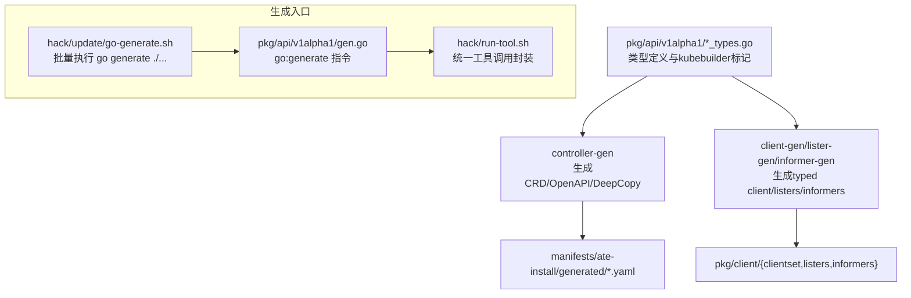
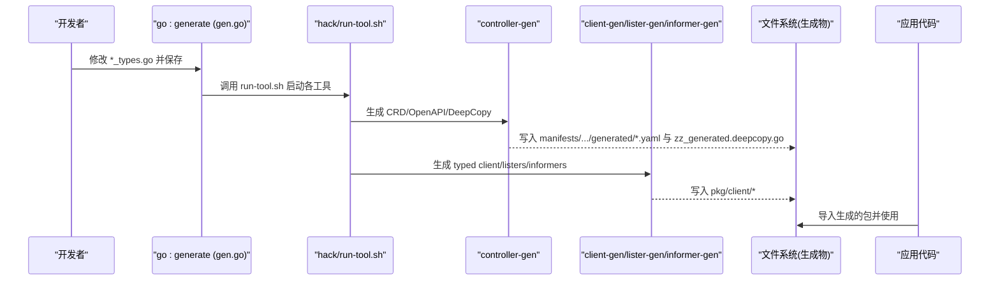
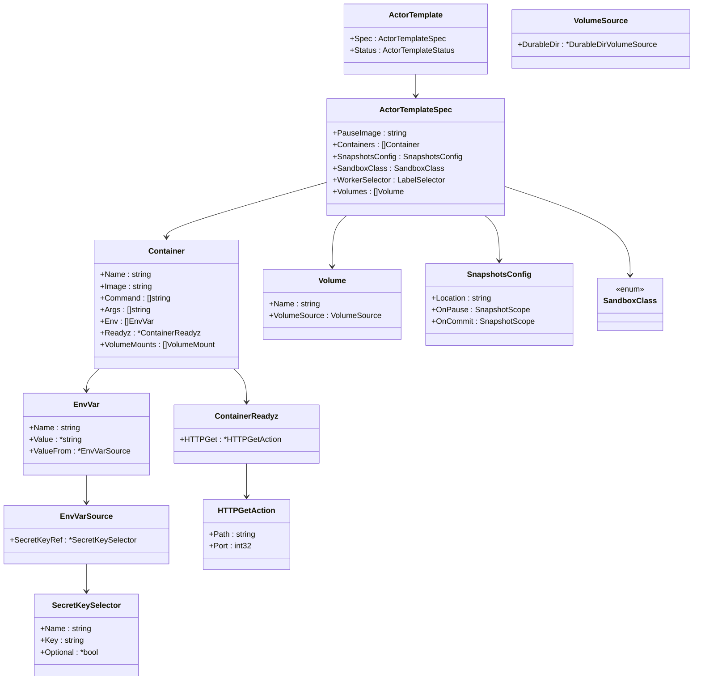
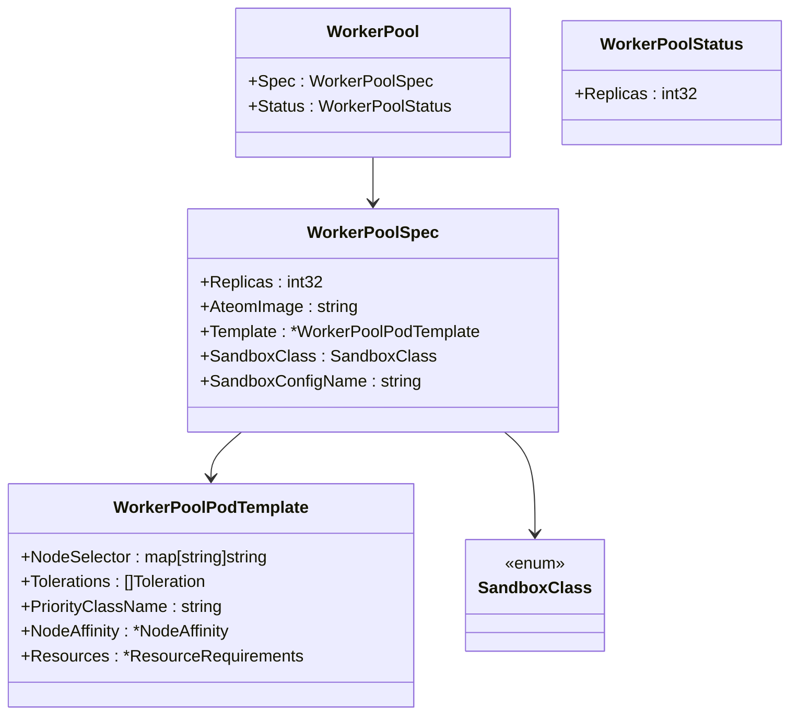
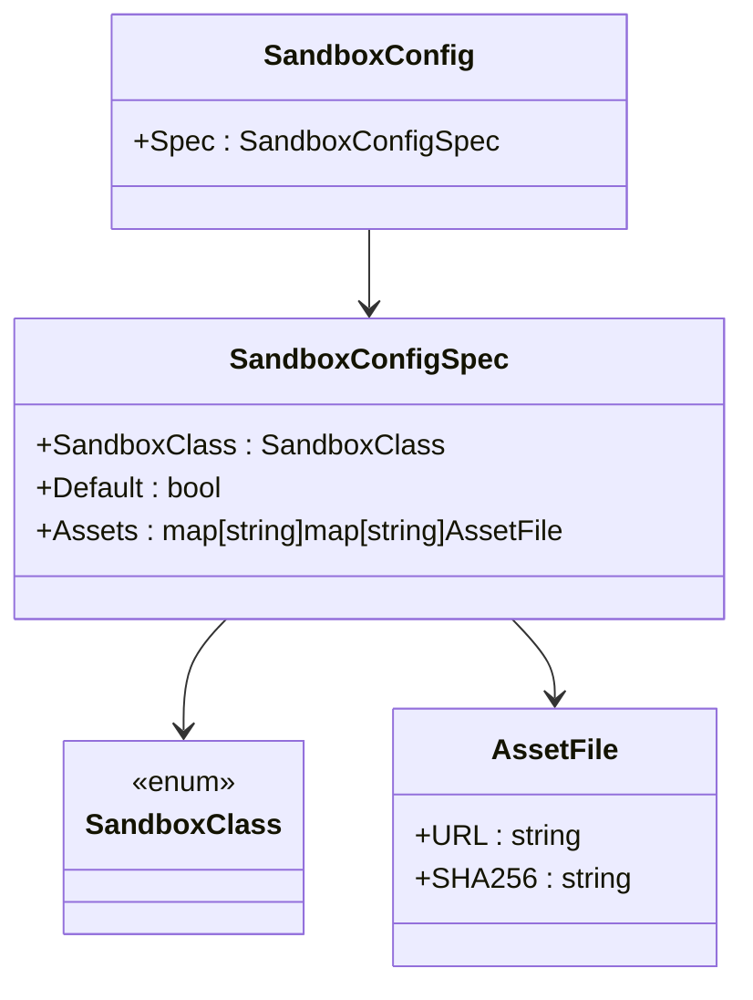
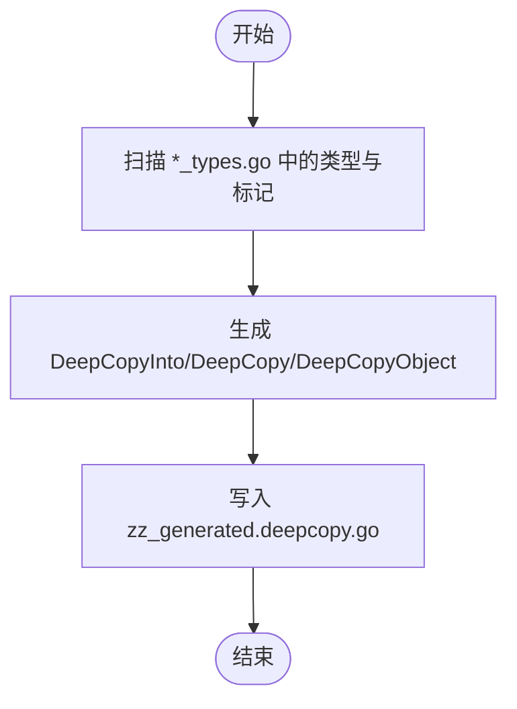
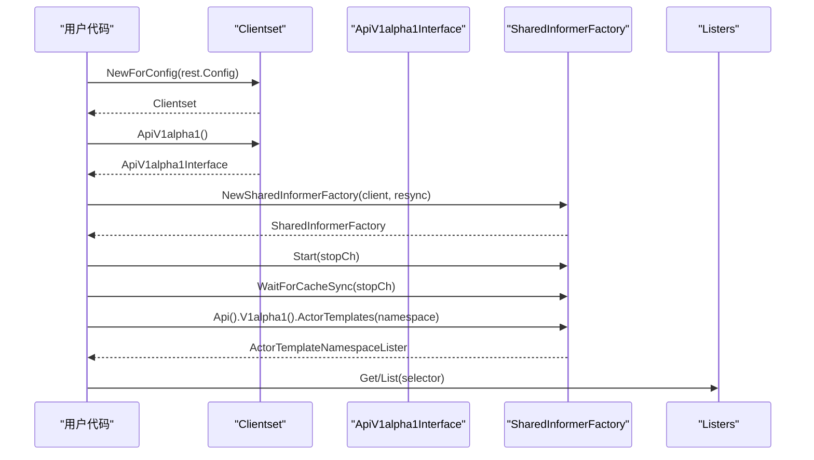
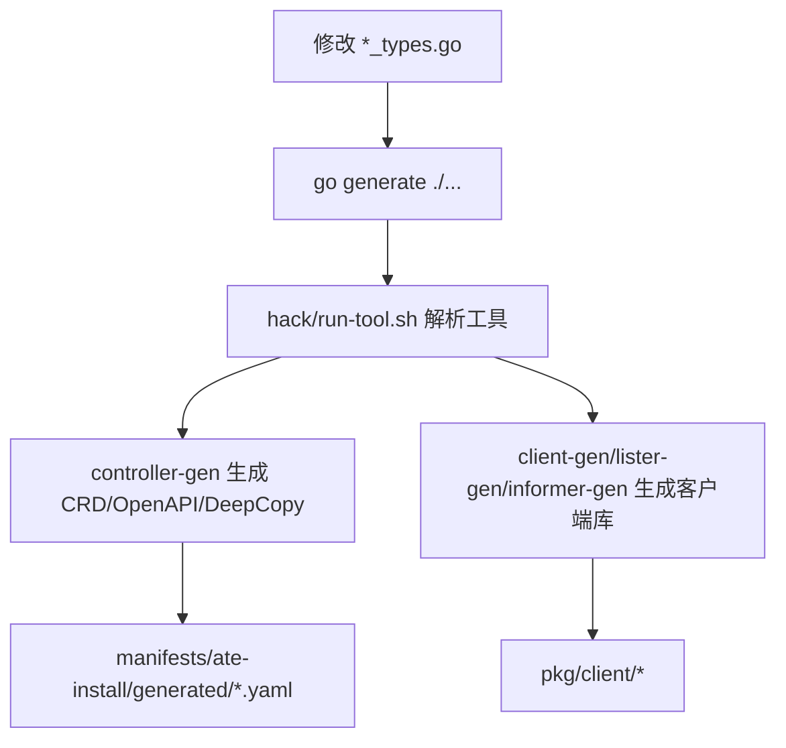
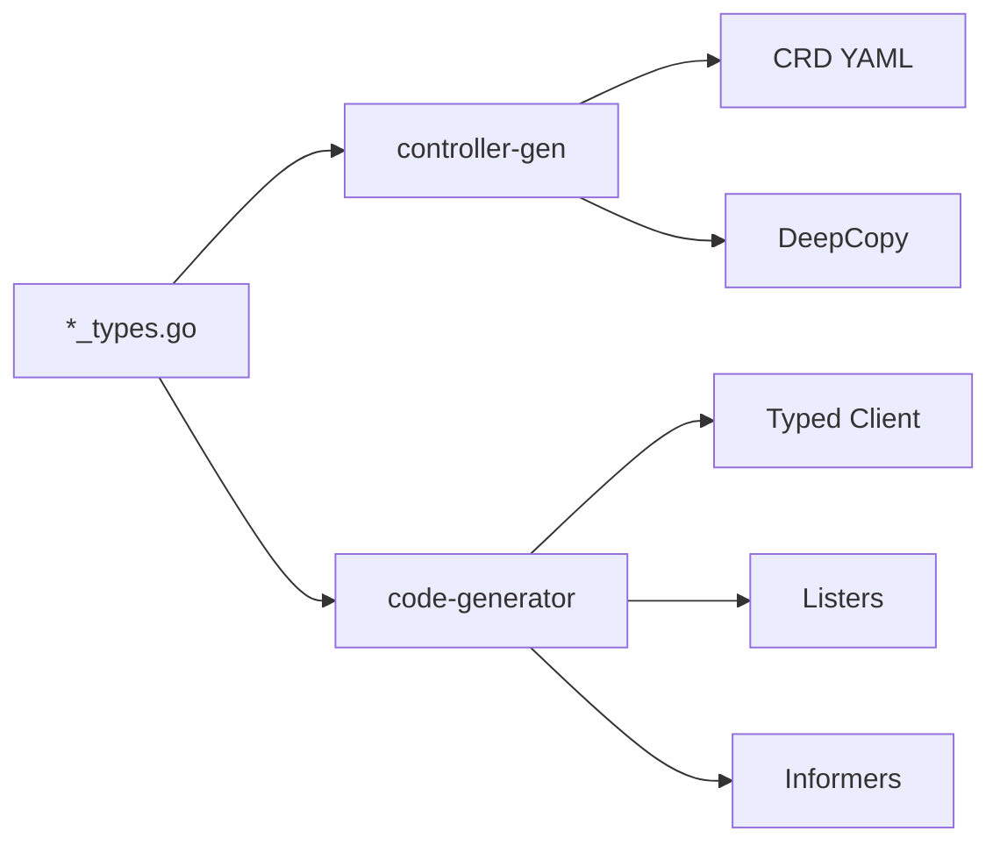

# Kubernetes客户端代码生成

<cite>
**本文引用的文件**
- [pkg/api/v1alpha1/actortemplate_types.go](file://pkg/api/v1alpha1/actortemplate_types.go)
- [pkg/api/v1alpha1/workerpool_types.go](file://pkg/api/v1alpha1/workerpool_types.go)
- [pkg/api/v1alpha1/sandboxconfig_types.go](file://pkg/api/v1alpha1/sandboxconfig_types.go)
- [pkg/api/v1alpha1/groupversion_info.go](file://pkg/api/v1alpha1/groupversion_info.go)
- [pkg/api/v1alpha1/gen.go](file://pkg/api/v1alpha1/gen.go)
- [pkg/api/v1alpha1/zz_generated.deepcopy.go](file://pkg/api/v1alpha1/zz_generated.deepcopy.go)
- [hack/run-tool.sh](file://hack/run-tool.sh)
- [hack/update/go-generate.sh](file://hack/update/go-generate.sh)
- [hack/tools/controller-gen/go.mod](file://hack/tools/controller-gen/go.mod)
- [hack/tools/code-generator/go.mod](file://hack/tools/code-generator/go.mod)
- [manifests/ate-install/generated/ate.dev_actortemplates.yaml](file://manifests/ate-install/generated/ate.dev_actortemplates.yaml)
- [manifests/ate-install/generated/ate.dev_workerpools.yaml](file://manifests/ate-install/generated/ate.dev_workerpools.yaml)
- [manifests/ate-install/generated/ate.dev_sandboxconfigs.yaml](file://manifests/ate-install/generated/ate.dev_sandboxconfigs.yaml)
- [manifests/ate-install/generated/role.yaml](file://manifests/ate-install/generated/role.yaml)
- [pkg/client/clientset/versioned/clientset.go](file://pkg/client/clientset/versioned/clientset.go)
- [pkg/client/informers/externalversions/factory.go](file://pkg/client/informers/externalversions/factory.go)
- [pkg/client/listers/api/v1alpha1/actortemplate.go](file://pkg/client/listers/api/v1alpha1/actortemplate.go)
</cite>

## 目录
1. [简介](#简介)
2. [项目结构](#项目结构)
3. [核心组件](#核心组件)
4. [架构总览](#架构总览)
5. [详细组件分析](#详细组件分析)
6. [依赖关系分析](#依赖关系分析)
7. [性能考虑](#性能考虑)
8. [故障排查指南](#故障排查指南)
9. [结论](#结论)
10. [附录](#附录)

## 简介
本文件面向Kubernetes自定义资源定义（CRD）与客户端代码生成的工程化实践，聚焦以下目标：
- 说明自定义资源类型声明与验证规则，包括 ActorTemplate、WorkerPool、SandboxConfig 等资源的字段定义与约束。
- 解释 deepcopy 自动生成机制与 zz_generated.deepcopy.go 的生成过程，以及何时需要手写实现。
- 阐述 typed client、informers、listers 的构建与使用方式。
- 说明 controller-gen 工具的配置与使用，涵盖 CRD 生成、RBAC 权限生成、OpenAPI 规范生成等。
- 提供 go generate 指令的使用方法与自动化集成方案。

## 项目结构
本项目采用“按API组组织”的结构，所有 v1alpha1 API 类型集中在 pkg/api/v1alpha1 下；通过 go:generate 驱动 code-generator 与 controller-tools 生成：
- CRD YAML 输出到 manifests/ate-install/generated/
- typed client 输出到 pkg/client/clientset
- listers 输出到 pkg/client/listers
- informers 输出到 pkg/client/informers
- deepcopy 方法由 controller-gen 在对象定义处触发，写入 zz_generated.deepcopy.go

图表来源
- [pkg/api/v1alpha1/gen.go:1-21](file://pkg/api/v1alpha1/gen.go#L1-L21)
- [hack/run-tool.sh:1-52](file://hack/run-tool.sh#L1-L52)
- [hack/update/go-generate.sh:1-23](file://hack/update/go-generate.sh#L1-L23)
- [pkg/api/v1alpha1/actortemplate_types.go:1-390](file://pkg/api/v1alpha1/actortemplate_types.go#L1-L390)
- [pkg/api/v1alpha1/workerpool_types.go:1-136](file://pkg/api/v1alpha1/workerpool_types.go#L1-L136)
- [pkg/api/v1alpha1/sandboxconfig_types.go:1-117](file://pkg/api/v1alpha1/sandboxconfig_types.go#L1-L117)

章节来源
- [pkg/api/v1alpha1/gen.go:1-21](file://pkg/api/v1alpha1/gen.go#L1-L21)
- [hack/run-tool.sh:1-52](file://hack/run-tool.sh#L1-L52)
- [hack/update/go-generate.sh:1-23](file://hack/update/go-generate.sh#L1-L23)

## 核心组件
本节从类型定义、验证规则、生成产物三个维度梳理核心组件。

- 类型定义与分组注册
  - API Group 为 ate.dev，版本 v1alpha1，位于 groupversion_info.go。
  - 各资源类型在 *_types.go 中定义，并通过 init() 注册 Scheme。

- 关键资源类型概览
  - ActorTemplate：描述可持久化的Actor模板，包含容器、卷、快照策略、沙箱类、工作池选择器等。
  - WorkerPool：描述工作池副本数、镜像、调度与资源、沙箱类及关联的沙箱配置名称。
  - SandboxConfig：集群级配置，描述某沙箱运行时族所需的二进制资产集合。

- 验证规则与标记
  - 广泛使用 kubebuilder 校验标记，如 +kubebuilder:validation:XValidation、+kubebuilder:validation:Enum、+kubebuilder:default、+kubebuilder:subresource 等。
  - 使用 CEL 表达式进行复杂约束，例如不可变 spec、onCommit 必须是 onPause 的子集、最多一个 DurableDir 卷等。

- 生成产物
  - CRD YAML：manifests/ate-install/generated/*.yaml
  - RBAC：manifests/ate-install/generated/role.yaml
  - DeepCopy：zz_generated.deepcopy.go
  - Typed Client / Informers / Listers：pkg/client 下对应目录

章节来源
- [pkg/api/v1alpha1/groupversion_info.go:1-42](file://pkg/api/v1alpha1/groupversion_info.go#L1-L42)
- [pkg/api/v1alpha1/actortemplate_types.go:1-390](file://pkg/api/v1alpha1/actortemplate_types.go#L1-L390)
- [pkg/api/v1alpha1/workerpool_types.go:1-136](file://pkg/api/v1alpha1/workerpool_types.go#L1-L136)
- [pkg/api/v1alpha1/sandboxconfig_types.go:1-117](file://pkg/api/v1alpha1/sandboxconfig_types.go#L1-L117)
- [manifests/ate-install/generated/ate.dev_actortemplates.yaml](file://manifests/ate-install/generated/ate.dev_actortemplates.yaml)
- [manifests/ate-install/generated/ate.dev_workerpools.yaml](file://manifests/ate-install/generated/ate.dev_workerpools.yaml)
- [manifests/ate-install/generated/ate.dev_sandboxconfigs.yaml](file://manifests/ate-install/generated/ate.dev_sandboxconfigs.yaml)
- [manifests/ate-install/generated/role.yaml](file://manifests/ate-install/generated/role.yaml)

## 架构总览
下图展示了从类型定义到最终生成产物的端到端流程，以及运行期客户端库的组织结构。

图表来源
- [pkg/api/v1alpha1/gen.go:1-21](file://pkg/api/v1alpha1/gen.go#L1-L21)
- [hack/run-tool.sh:1-52](file://hack/run-tool.sh#L1-L52)
- [hack/tools/controller-gen/go.mod:1-53](file://hack/tools/controller-gen/go.mod#L1-L53)
- [hack/tools/code-generator/go.mod:1-22](file://hack/tools/code-generator/go.mod#L1-L22)

## 详细组件分析

### 自定义资源类型与验证规则

### ActorTemplate
- 作用域：Namespaced，短名 actortemplate，支持 status 子资源与打印列。
- Spec 关键特性：
  - 不可变：spec == oldSelf 的 CEL 校验。
  - 容器：最多10个，命令/参数/环境变量数量限制，镜像必须带 digest（@）。
  - 卷：最多32个，仅允许一个 DurableDir 类型卷；每个容器最多挂载一个 DurableDir。
  - 快照：SnapshotsConfig 要求 location，onCommit 必须是 onPause 的子集。
  - 沙箱类：枚举 gvisor/microvm，默认 gvisor；当 sandboxClass=microvm 时不支持 DurableDir。
  - 工作池选择器：LabelSelector 用于筛选可用 WorkerPool。
- Status：包含阶段、GoldenActor 相关字段与条件数组。

图表来源
- [pkg/api/v1alpha1/actortemplate_types.go:1-390](file://pkg/api/v1alpha1/actortemplate_types.go#L1-L390)

章节来源
- [pkg/api/v1alpha1/actortemplate_types.go:1-390](file://pkg/api/v1alpha1/actortemplate_types.go#L1-L390)

### WorkerPool
- 作用域：Namespaced，短名 workerpool，支持 status 与 scale 子资源，打印期望与实际副本数。
- Spec 关键特性：
  - Replicas：最小值0。
  - AteomImage：必填且长度≥1。
  - Template：可选的 Pod 调度与资源设置（NodeSelector、Tolerations、PriorityClassName、NodeAffinity、Resources）。
  - SandboxClass：枚举 gvisor/microvm，默认 gvisor。
  - SandboxConfigName：引用集群级 SandboxConfig，需与 SandboxClass 匹配。

图表来源
- [pkg/api/v1alpha1/workerpool_types.go:1-136](file://pkg/api/v1alpha1/workerpool_types.go#L1-L136)

章节来源
- [pkg/api/v1alpha1/workerpool_types.go:1-136](file://pkg/api/v1alpha1/workerpool_types.go#L1-L136)

### SandboxConfig
- 作用域：Cluster，短名 sandboxconfig，打印 Class、Default、Age。
- Spec 关键特性：
  - SandboxClass：枚举 gvisor/microvm，默认 gvisor。
  - Default：是否作为该类的默认配置。
  - Assets：按架构与资产名索引的二进制清单，含 URL 与 SHA256 校验。

图表来源
- [pkg/api/v1alpha1/sandboxconfig_types.go:1-117](file://pkg/api/v1alpha1/sandboxconfig_types.go#L1-L117)

章节来源
- [pkg/api/v1alpha1/sandboxconfig_types.go:1-117](file://pkg/api/v1alpha1/sandboxconfig_types.go#L1-L117)

### DeepCopy 自动生成机制
- 生成位置：zz_generated.deepcopy.go，由 controller-gen 根据 *_types.go 中的类型与标记自动产出。
- 生成内容：
  - 每个类型的 DeepCopyInto、DeepCopy、DeepCopyObject 方法。
  - 对指针、切片、映射、内嵌结构体等进行递归深拷贝。
- 自定义实现时机：
  - 当类型包含非标准字段或需要特殊拷贝逻辑时，可在同包内手写 DeepCopyInto/DeepCopy，但通常优先保持自动生成。
- 构建标签：
  - 文件顶部包含 //go:build !ignore_autogenerated，确保在常规构建中包含。

图表来源
- [pkg/api/v1alpha1/zz_generated.deepcopy.go:1-605](file://pkg/api/v1alpha1/zz_generated.deepcopy.go#L1-L605)

章节来源
- [pkg/api/v1alpha1/zz_generated.deepcopy.go:1-605](file://pkg/api/v1alpha1/zz_generated.deepcopy.go#L1-L605)

### 客户端库生成：Typed Client、Informers、Listers
- 生成入口：
  - gen.go 中通过 go:generate 调用 hack/run-tool.sh 分别执行：
    - controller-gen：生成 CRD、OpenAPI、DeepCopy
    - client-gen：生成 typed client
    - lister-gen：生成 listers
    - informer-gen：生成 informers
- 工具定位：
  - hack/run-tool.sh 根据工具名选择对应的 go.mod 目录，解析二进制路径后执行。
- 生成产物：
  - typed client：pkg/client/clientset/versioned/*
  - listers：pkg/client/listers/api/v1alpha1/*
  - informers：pkg/client/informers/externalversions/*

图表来源
- [pkg/client/clientset/versioned/clientset.go:1-119](file://pkg/client/clientset/versioned/clientset.go#L1-L119)
- [pkg/client/informers/externalversions/factory.go:1-262](file://pkg/client/informers/externalversions/factory.go#L1-L262)
- [pkg/client/listers/api/v1alpha1/actortemplate.go:1-69](file://pkg/client/listers/api/v1alpha1/actortemplate.go#L1-L69)

章节来源
- [pkg/api/v1alpha1/gen.go:1-21](file://pkg/api/v1alpha1/gen.go#L1-L21)
- [hack/run-tool.sh:1-52](file://hack/run-tool.sh#L1-L52)
- [pkg/client/clientset/versioned/clientset.go:1-119](file://pkg/client/clientset/versioned/clientset.go#L1-L119)
- [pkg/client/informers/externalversions/factory.go:1-262](file://pkg/client/informers/externalversions/factory.go#L1-L262)
- [pkg/client/listers/api/v1alpha1/actortemplate.go:1-69](file://pkg/client/listers/api/v1alpha1/actortemplate.go#L1-L69)

### controller-gen 配置与使用
- 工具依赖：
  - sigs.k8s.io/controller-tools/cmd/controller-gen 在 hack/tools/controller-gen/go.mod 中声明。
- 主要功能：
  - CRD 生成：crd 插件，输出到 manifests/ate-install/generated/
  - OpenAPI 规范：object 插件，配合 kube-openapi 生成 schema
  - DeepCopy 生成：object 插件
- 常用选项：
  - crd:headerFile：为 CRD YAML 添加头部注释
  - object:headerFile：为 Go 生成文件添加头部注释
  - output:crd:dir：指定 CRD 输出目录
- RBAC 权限生成：
  - 通过 genclient 与 +kubebuilder:rbac 标记（若启用）生成 role.yaml，当前仓库已存在 role.yaml 产物。

章节来源
- [hack/tools/controller-gen/go.mod:1-53](file://hack/tools/controller-gen/go.mod#L1-L53)
- [pkg/api/v1alpha1/gen.go:1-21](file://pkg/api/v1alpha1/gen.go#L1-L21)
- [manifests/ate-install/generated/role.yaml](file://manifests/ate-install/generated/role.yaml)

### go generate 指令与自动化集成
- 单包生成：
  - 在 pkg/api/v1alpha1/gen.go 中声明多个 go:generate 指令，分别调用 controller-gen、client-gen、lister-gen、informer-gen。
- 统一工具封装：
  - hack/run-tool.sh 负责解析工具名与 go.mod，定位二进制并执行，避免全局 PATH 污染。
- 批量执行：
  - hack/update/go-generate.sh 遍历整个仓库执行 go generate ./...，便于 CI 或本地一键更新。
- 典型用法：
  - 新增/修改 *_types.go 后，运行脚本以重新生成所有产物。

图表来源
- [pkg/api/v1alpha1/gen.go:1-21](file://pkg/api/v1alpha1/gen.go#L1-L21)
- [hack/run-tool.sh:1-52](file://hack/run-tool.sh#L1-L52)
- [hack/update/go-generate.sh:1-23](file://hack/update/go-generate.sh#L1-L23)

章节来源
- [pkg/api/v1alpha1/gen.go:1-21](file://pkg/api/v1alpha1/gen.go#L1-L21)
- [hack/run-tool.sh:1-52](file://hack/run-tool.sh#L1-L52)
- [hack/update/go-generate.sh:1-23](file://hack/update/go-generate.sh#L1-L23)

## 依赖关系分析
- 工具链依赖
  - controller-gen：依赖 k8s.io/apiextensions-apiserver、k8s.io/kube-openapi、sigs.k8s.io/controller-tools 等。
  - code-generator（client-gen/lister-gen/informer-gen）：依赖 k8s.io/code-generator、gengo/v2。
- 生成产物依赖
  - typed client 依赖 rest.Config 与 discovery。
  - informers 依赖 cache.SharedIndexInformer 与 versioned.Interface。
  - listers 依赖 cache.Indexer 与 labels.Selector。

图表来源
- [hack/tools/controller-gen/go.mod:1-53](file://hack/tools/controller-gen/go.mod#L1-L53)
- [hack/tools/code-generator/go.mod:1-22](file://hack/tools/code-generator/go.mod#L1-L22)
- [pkg/client/clientset/versioned/clientset.go:1-119](file://pkg/client/clientset/versioned/clientset.go#L1-L119)
- [pkg/client/informers/externalversions/factory.go:1-262](file://pkg/client/informers/externalversions/factory.go#L1-L262)
- [pkg/client/listers/api/v1alpha1/actortemplate.go:1-69](file://pkg/client/listers/api/v1alpha1/actortemplate.go#L1-L69)

章节来源
- [hack/tools/controller-gen/go.mod:1-53](file://hack/tools/controller-gen/go.mod#L1-L53)
- [hack/tools/code-generator/go.mod:1-22](file://hack/tools/code-generator/go.mod#L1-L22)

## 性能考虑
- DeepCopy 复杂度：
  - 对指针、切片、映射进行递归拷贝，时间复杂度与数据结构规模线性相关；合理控制字段大小与嵌套层级。
- Informer 缓存：
  - 使用 SharedInformerFactory 共享 informer，减少重复创建开销；按需设置 resync 周期与 transform。
- Client QPS/Burst：
  - 通过 rest.Config 的 QPS 与 Burst 控制速率限制，避免 API Server 过载。

[本节为通用指导，不直接分析具体文件]

## 故障排查指南
- 生成失败
  - 检查 go:generate 指令路径与工具名是否正确；确认 hack/run-tool.sh 能解析到对应 go.mod 下的二进制。
  - 查看 controller-gen 与 code-generator 的版本兼容性。
- CRD 未生效
  - 确认 manifests/ate-install/generated/*.yaml 已正确部署至集群。
  - 检查 API Group/Version/Kind 是否与类型定义一致。
- 客户端连接问题
  - 核对 rest.Config 的 Host、BearerToken/Kubeconfig 配置。
  - 确认 RBAC 权限（role.yaml）已授予相应访问能力。

章节来源
- [pkg/api/v1alpha1/gen.go:1-21](file://pkg/api/v1alpha1/gen.go#L1-L21)
- [hack/run-tool.sh:1-52](file://hack/run-tool.sh#L1-L52)
- [manifests/ate-install/generated/role.yaml](file://manifests/ate-install/generated/role.yaml)

## 结论
通过将类型定义与 kubebuilder 标记集中管理，并结合 go:generate 与 hack/run-tool.sh 的统一工具编排，本项目实现了从 CRD、OpenAPI、DeepCopy 到 typed client、listers、informers 的全链路自动化生成。这种模式既保证了 API 契约的一致性，又提升了开发与维护效率。建议在变更类型定义后始终执行批量生成脚本，并在 CI 中加入一致性校验，以确保生成产物与源码同步。

[本节为总结性内容，不直接分析具体文件]

## 附录
- 常用命令
  - 更新生成代码：bash hack/update/go-generate.sh
  - 单独运行某个工具：bash hack/run-tool.sh <tool-name> [args...]
- 参考文件
  - 类型定义：pkg/api/v1alpha1/*_types.go
  - 生成入口：pkg/api/v1alpha1/gen.go
  - 工具封装：hack/run-tool.sh
  - 批量脚本：hack/update/go-generate.sh
  - 生成产物：manifests/ate-install/generated/*、pkg/client/*

[本节为补充信息，不直接分析具体文件]
