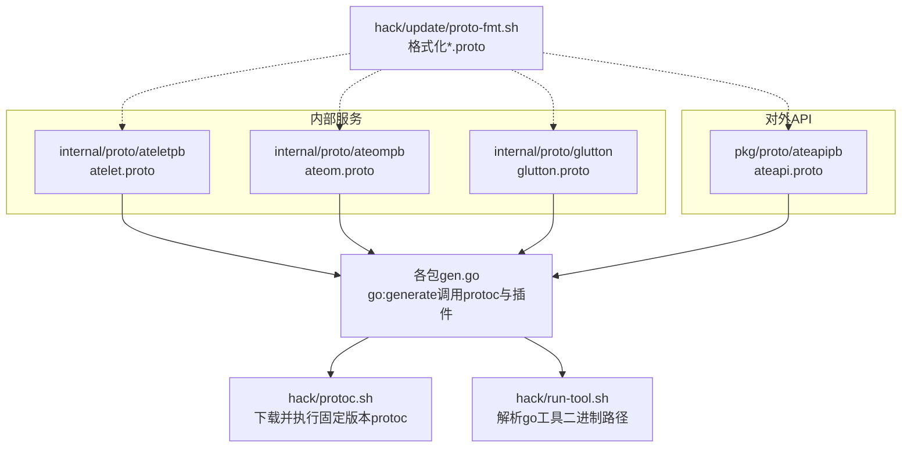
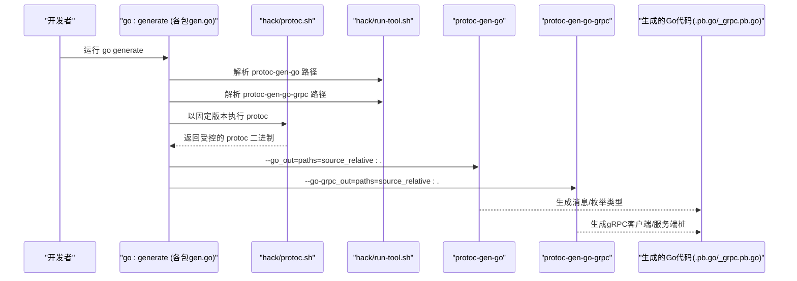
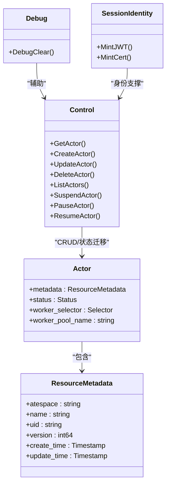
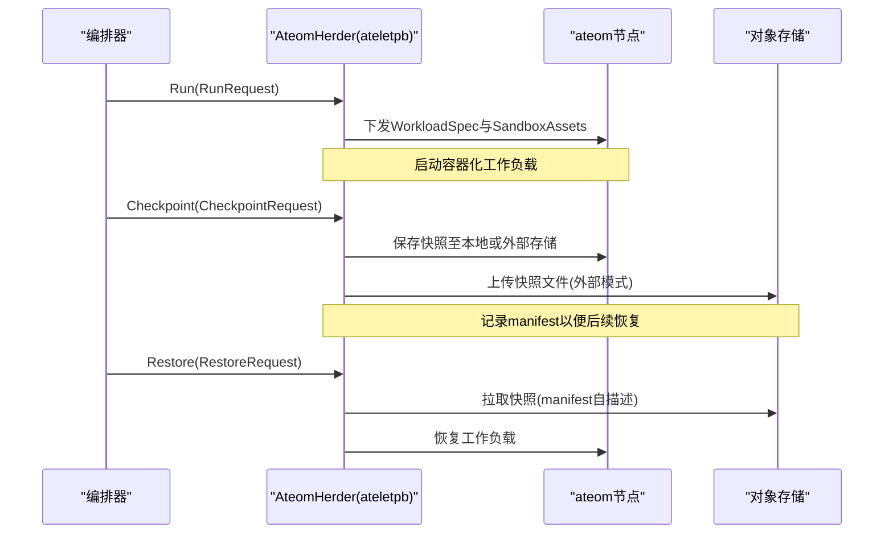
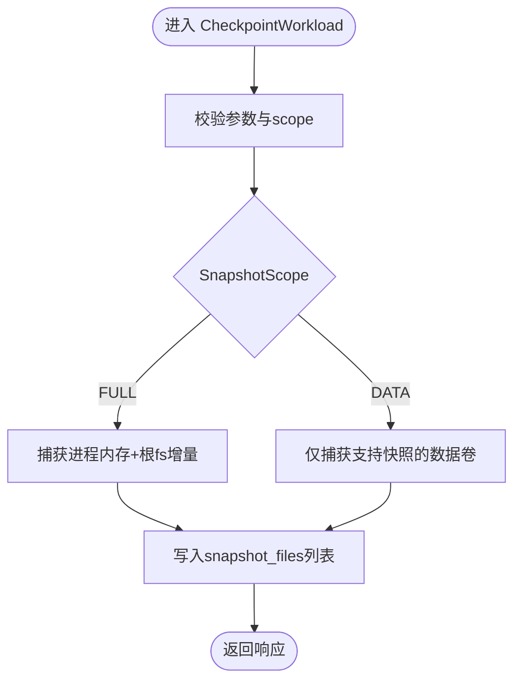
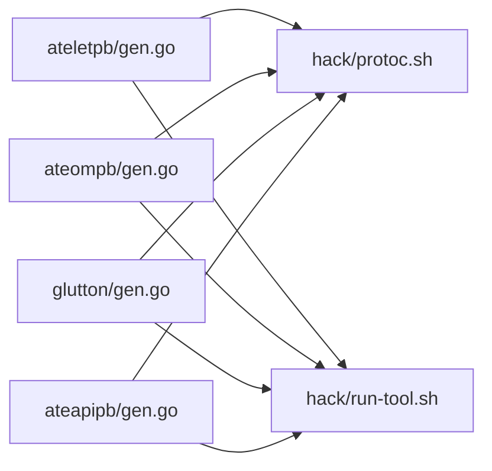

# Protocol Buffers代码生成

<cite>
**本文引用的文件**   
- [hack/protoc.sh](file://hack/protoc.sh)
- [hack/run-tool.sh](file://hack/run-tool.sh)
- [internal/proto/ateletpb/gen.go](file://internal/proto/ateletpb/gen.go)
- [internal/proto/ateompb/gen.go](file://internal/proto/ateompb/gen.go)
- [internal/proto/glutton/gen.go](file://internal/proto/glutton/gen.go)
- [pkg/proto/ateapipb/gen.go](file://pkg/proto/ateapipb/gen.go)
- [internal/proto/ateletpb/atelet.proto](file://internal/proto/ateletpb/atelet.proto)
- [internal/proto/ateompb/ateom.proto](file://internal/proto/ateompb/ateom.proto)
- [internal/proto/glutton/glutton.proto](file://internal/proto/glutton/glutton.proto)
- [pkg/proto/ateapipb/ateapi.proto](file://pkg/proto/ateapipb/ateapi.proto)
- [docs/api-style-guide.md](file://docs/api-style-guide.md)
- [hack/update/proto-fmt.sh](file://hack/update/proto-fmt.sh)
</cite>

## 目录
1. [简介](#简介)
2. [项目结构](#项目结构)
3. [核心组件](#核心组件)
4. [架构总览](#架构总览)
5. [详细组件分析](#详细组件分析)
6. [依赖关系分析](#依赖关系分析)
7. [性能与兼容性考量](#性能与兼容性考量)
8. [故障排查指南](#故障排查指南)
9. [结论](#结论)
10. [附录](#附录)

## 简介
本文件面向需要在 Substrate 项目中编写、维护与生成 Protocol Buffers（gRPC）代码的工程师，提供从 proto 编写规范、代码生成配置到版本管理与向后兼容性的完整指导。文档覆盖 ateapipb、ateletpb、ateompb、glutton 等包的职责划分，并给出可复用的生成命令与常见问题解决方案。

## 项目结构
Proto 源文件与生成脚本按“包”组织：每个包包含 .proto 定义与对应的 go:generate 指令，统一通过 hack 工具链完成 protoc 安装与插件路径解析。

图表来源
- [internal/proto/ateletpb/atelet.proto:1-239](file://internal/proto/ateletpb/atelet.proto#L1-L239)
- [internal/proto/ateompb/ateom.proto:1-171](file://internal/proto/ateompb/ateom.proto#L1-L171)
- [internal/proto/glutton/glutton.proto:1-109](file://internal/proto/glutton/glutton.proto#L1-L109)
- [pkg/proto/ateapipb/ateapi.proto:1-417](file://pkg/proto/ateapipb/ateapi.proto#L1-L417)
- [hack/protoc.sh:1-82](file://hack/protoc.sh#L1-L82)
- [hack/run-tool.sh:1-52](file://hack/run-tool.sh#L1-L52)
- [internal/proto/ateletpb/gen.go:1-18](file://internal/proto/ateletpb/gen.go#L1-L18)
- [internal/proto/ateompb/gen.go:1-18](file://internal/proto/ateompb/gen.go#L1-L18)
- [internal/proto/glutton/gen.go:1-18](file://internal/proto/glutton/gen.go#L1-L18)
- [pkg/proto/ateapipb/gen.go:1-18](file://pkg/proto/ateapipb/gen.go#L1-L18)
- [hack/update/proto-fmt.sh:1-53](file://hack/update/proto-fmt.sh#L1-L53)

章节来源
- [hack/protoc.sh:1-82](file://hack/protoc.sh#L1-L82)
- [hack/run-tool.sh:1-52](file://hack/run-tool.sh#L1-L52)
- [internal/proto/ateletpb/gen.go:1-18](file://internal/proto/ateletpb/gen.go#L1-L18)
- [internal/proto/ateompb/gen.go:1-18](file://internal/proto/ateompb/gen.go#L1-L18)
- [internal/proto/glutton/gen.go:1-18](file://internal/proto/glutton/gen.go#L1-L18)
- [pkg/proto/ateapipb/gen.go:1-18](file://pkg/proto/ateapipb/gen.go#L1-L18)
- [hack/update/proto-fmt.sh:1-53](file://hack/update/proto-fmt.sh#L1-L53)

## 核心组件
- 代码生成入口
  - 每个包内提供 gen.go，使用 go:generate 触发 protoc 与 Go 插件生成。
  - 通过 hack/protoc.sh 获取固定版本的 protoc 二进制，确保团队一致性。
  - 通过 hack/run-tool.sh 解析 protoc-gen-go 与 protoc-gen-go-grpc 的二进制路径，避免环境差异。
- Proto 包与职责
  - ateapipb：对外控制面 API（Actor、Atespace、Worker、SessionIdentity 等）。
  - ateletpb：编排层接口（AteomHerder），负责在 ateom 上运行/检查点/恢复工作负载。
  - ateompb：运行时接口（Ateom），用于对单个 gVisor/microVM 实例进行 Run/Checkpoint/Restore。
  - glutton：基准测试用示例服务（RAM/Disk/FD/Ping/Gossip）。
- 格式化工具
  - hack/update/proto-fmt.sh 基于 clang-format 对 *.proto 进行格式化，便于统一风格。

章节来源
- [internal/proto/ateletpb/gen.go:1-18](file://internal/proto/ateletpb/gen.go#L1-L18)
- [internal/proto/ateompb/gen.go:1-18](file://internal/proto/ateompb/gen.go#L1-L18)
- [internal/proto/glutton/gen.go:1-18](file://internal/proto/glutton/gen.go#L1-L18)
- [pkg/proto/ateapipb/gen.go:1-18](file://pkg/proto/ateapipb/gen.go#L1-L18)
- [hack/protoc.sh:1-82](file://hack/protoc.sh#L1-L82)
- [hack/run-tool.sh:1-52](file://hack/run-tool.sh#L1-L52)
- [hack/update/proto-fmt.sh:1-53](file://hack/update/proto-fmt.sh#L1-L53)

## 架构总览
下图展示了从 go generate 到最终生成 Go 客户端/服务端桩的代码生成流程，以及各包之间的职责边界。

图表来源
- [internal/proto/ateletpb/gen.go:1-18](file://internal/proto/ateletpb/gen.go#L1-L18)
- [internal/proto/ateompb/gen.go:1-18](file://internal/proto/ateompb/gen.go#L1-L18)
- [internal/proto/glutton/gen.go:1-18](file://internal/proto/glutton/gen.go#L1-L18)
- [pkg/proto/ateapipb/gen.go:1-18](file://pkg/proto/ateapipb/gen.go#L1-L18)
- [hack/protoc.sh:1-82](file://hack/protoc.sh#L1-L82)
- [hack/run-tool.sh:1-52](file://hack/run-tool.sh#L1-L52)

## 详细组件分析

### ateapipb（对外控制面 API）
- 包定位
  - 暴露 Agentic Substrate 的主要 gRPC 接口，包括 Actor、Atespace、Worker 生命周期管理，以及 SessionIdentity 凭证签发。
- 关键服务与资源
  - Control：Get/Create/Update/Delete/List 标准方法，以及 Suspend/Pause/Resume 自定义方法。
  - Debug：调试清理接口。
  - SessionIdentity：MintJWT/MintCert，为工作负载颁发会话级身份。
- 设计要点
  - 资源标识采用 (atespace, name) 二元组，并通过 ObjectRef 引用。
  - 所有资源共享 ResourceMetadata（含 version、uid、时间戳等）。
  - 更新操作强制使用 update_mask，且不支持通配符 *。
  - 乐观并发通过 version 与 uid 守卫实现。
- 命名与字段约定
  - 遵循 docs/api-style-guide.md 的字段命名、枚举命名、optional 使用等规范。

图表来源
- [pkg/proto/ateapipb/ateapi.proto:1-417](file://pkg/proto/ateapipb/ateapi.proto#L1-L417)
- [docs/api-style-guide.md:1-511](file://docs/api-style-guide.md#L1-L511)

章节来源
- [pkg/proto/ateapipb/ateapi.proto:1-417](file://pkg/proto/ateapipb/ateapi.proto#L1-L417)
- [docs/api-style-guide.md:1-511](file://docs/api-style-guide.md#L1-L511)

### ateletb（编排层接口）
- 包定位
  - 定义 AteomHerder 服务，供上层编排器在 ateom 节点上执行 Run/Checkpoint/Restore。
- 关键概念
  - WorkloadSpec：简化版 Pod 描述，包含容器、卷、就绪探针等。
  - SandboxAssets：跨架构的沙箱二进制资产集合，支持内容寻址校验。
  - CheckpointType/SnapshotScope：控制快照存储位置与范围。
- 典型调用序列

图表来源
- [internal/proto/ateletpb/atelet.proto:1-239](file://internal/proto/ateletpb/atelet.proto#L1-L239)

章节来源
- [internal/proto/ateletpb/atelet.proto:1-239](file://internal/proto/ateletpb/atelet.proto#L1-L239)

### ateompb（运行时接口）
- 包定位
  - 定义 Ateom 服务，直接对接单个 gVisor/microVM 实例，提供 RunWorkload/CheckpointWorkload/RestoreWorkload。
- 关键概念
  - SnapshotScope：FULL（内存+文件系统增量）与 DATA（仅数据卷）。
  - runtime_asset_paths：不同运行时（如 cloud-hypervisor）的本地资产映射。
- 与 ateletb 的关系
  - ateletpb 作为编排层，将高层意图转换为 ateompb 的具体运行时操作。

图表来源
- [internal/proto/ateompb/ateom.proto:1-171](file://internal/proto/ateompb/ateom.proto#L1-L171)

章节来源
- [internal/proto/ateompb/ateom.proto:1-171](file://internal/proto/ateompb/ateom.proto#L1-L171)

### glutton（基准测试示例）
- 包定位
  - 提供简单 RPC 服务，用于压力测试场景（写内存、写磁盘、打开FD、Ping、Gossip）。
- 适用场景
  - 快速验证网络、I/O、系统资源占用等行为。

章节来源
- [internal/proto/glutton/glutton.proto:1-109](file://internal/proto/glutton/glutton.proto#L1-L109)

## 依赖关系分析
- 生成链路
  - 各包 gen.go 依赖 hack/protoc.sh 与 hack/run-tool.sh。
  - protoc 版本被锁定，SHA 校验保证可重复构建。
  - 插件路径通过 run-tool.sh 动态解析，避免全局 PATH 污染。
- 包间耦合
  - ateapipb 独立于内部运行时协议；ateletpb 与 ateompb 分层解耦，前者面向编排，后者面向运行时。
  - glutton 为独立示例包，无强依赖。

图表来源
- [internal/proto/ateletpb/gen.go:1-18](file://internal/proto/ateletpb/gen.go#L1-L18)
- [internal/proto/ateompb/gen.go:1-18](file://internal/proto/ateompb/gen.go#L1-L18)
- [internal/proto/glutton/gen.go:1-18](file://internal/proto/glutton/gen.go#L1-L18)
- [pkg/proto/ateapipb/gen.go:1-18](file://pkg/proto/ateapipb/gen.go#L1-L18)
- [hack/protoc.sh:1-82](file://hack/protoc.sh#L1-L82)
- [hack/run-tool.sh:1-52](file://hack/run-tool.sh#L1-L52)

章节来源
- [internal/proto/ateletpb/gen.go:1-18](file://internal/proto/ateletpb/gen.go#L1-L18)
- [internal/proto/ateompb/gen.go:1-18](file://internal/proto/ateompb/gen.go#L1-L18)
- [internal/proto/glutton/gen.go:1-18](file://internal/proto/glutton/gen.go#L1-L18)
- [pkg/proto/ateapipb/gen.go:1-18](file://pkg/proto/ateapipb/gen.go#L1-L18)
- [hack/protoc.sh:1-82](file://hack/protoc.sh#L1-L82)
- [hack/run-tool.sh:1-52](file://hack/run-tool.sh#L1-L52)

## 性能与兼容性考量
- 生成性能
  - 使用 paths=source_relative 输出，减少路径计算开销，提升增量生成效率。
- 向后兼容
  - 新增字段时分配新的编号，保持旧客户端可忽略未知字段。
  - 删除字段时使用 reserved 标记占位，防止后续复用同一编号。
  - 谨慎修改枚举值语义；如需扩展，优先新增枚举值而非重定义。
  - 对外 API 变更需遵循 api-style-guide 的更新策略与字段存在性约定。
- 版本管理
  - 锁定 protoc 版本与 SHA，确保多平台一致行为。
  - 插件版本由 go.mod 管理，通过 run-tool.sh 解析具体二进制路径。

[本节为通用建议，不直接分析具体文件]

## 故障排查指南
- protoc 未找到或版本不一致
  - 现象：go generate 报错找不到 protoc 或版本不符。
  - 处理：确认已执行 hack/protoc.sh 安装，并确保其位于 PATH 或通过 go generate 自动调用。
- 插件路径错误
  - 现象：提示无法找到 protoc-gen-go 或 protoc-gen-go-grpc。
  - 处理：确保模块依赖正确，run-tool.sh 能解析到对应二进制路径。
- 生成目录与路径
  - 现象：生成的 .pb.go 与 _grpc.pb.go 不在预期位置。
  - 处理：确认 --go_out 与 --go-grpc_out 均使用 paths=source_relative，并与 gen.go 保持一致。
- 格式问题导致生成失败
  - 现象：lint 或生成阶段因格式不一致报错。
  - 处理：运行 hack/update/proto-fmt.sh 统一格式化后再提交。

章节来源
- [hack/protoc.sh:1-82](file://hack/protoc.sh#L1-L82)
- [hack/run-tool.sh:1-52](file://hack/run-tool.sh#L1-L52)
- [hack/update/proto-fmt.sh:1-53](file://hack/update/proto-fmt.sh#L1-L53)

## 结论
本项目通过统一的生成脚本与严格的样式规范，实现了跨团队的稳定 Protobuf/gRPC 代码生成。ateapipb 作为对外 API 包，遵循资源导向设计与强一致的命名约定；ateletpb 与 ateompb 分层清晰，分别承担编排与运行时职责；glutton 提供轻量基准能力。配合版本锁定的 protoc 与插件路径解析，可有效降低环境差异带来的风险。

[本节为总结性内容，不直接分析具体文件]

## 附录

### 编写规范与最佳实践（摘要）
- 字段命名
  - 使用 lower_snake_case；布尔字段省略 is_ 前缀；重复字段用复数名词。
- 枚举命名
  - 类型名 PascalCase，值 UPPER_SNAKE_CASE；包级枚举值需带前缀；零值必须为 {ENUM}_UNSPECIFIED。
- 字段存在性
  - optional 仅在三态语义下使用；更新语义由 update_mask 驱动。
- 标准字段
  - 所有资源包含 ResourceMetadata（atespace/name/uid/version/create_time/update_time）。
- 乐观并发
  - 通过 version 与 uid 守卫更新/删除，避免丢失更新与 ABA 问题。

章节来源
- [docs/api-style-guide.md:1-511](file://docs/api-style-guide.md#L1-L511)

### 代码生成示例（参考路径）
- 生成 ateapipb
  - 参考：[pkg/proto/ateapipb/gen.go:1-18](file://pkg/proto/ateapipb/gen.go#L1-L18)
- 生成 ateletpb
  - 参考：[internal/proto/ateletpb/gen.go:1-18](file://internal/proto/ateletpb/gen.go#L1-L18)
- 生成 ateompb
  - 参考：[internal/proto/ateompb/gen.go:1-18](file://internal/proto/ateompb/gen.go#L1-L18)
- 生成 glutton
  - 参考：[internal/proto/glutton/gen.go:1-18](file://internal/proto/glutton/gen.go#L1-L18)

### 常用命令速查
- 安装/准备 protoc
  - 参考：[hack/protoc.sh:1-82](file://hack/protoc.sh#L1-L82)
- 解析插件路径
  - 参考：[hack/run-tool.sh:1-52](file://hack/run-tool.sh#L1-L52)
- 格式化 proto
  - 参考：[hack/update/proto-fmt.sh:1-53](file://hack/update/proto-fmt.sh#L1-L53)
