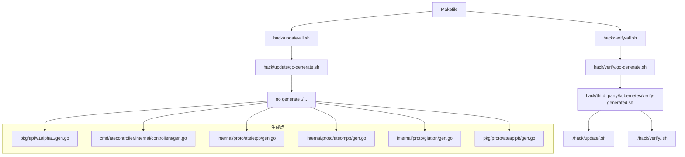
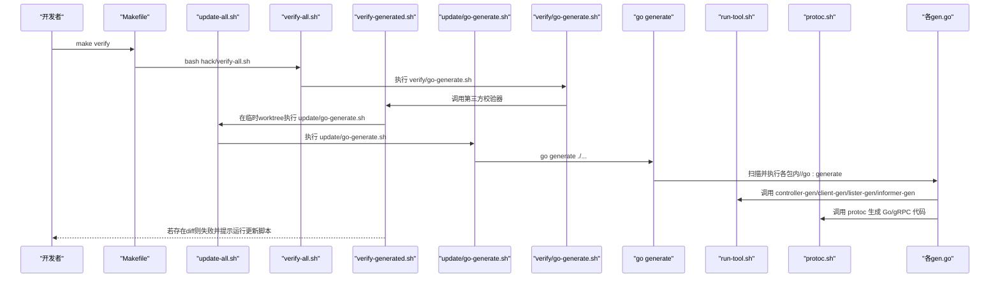
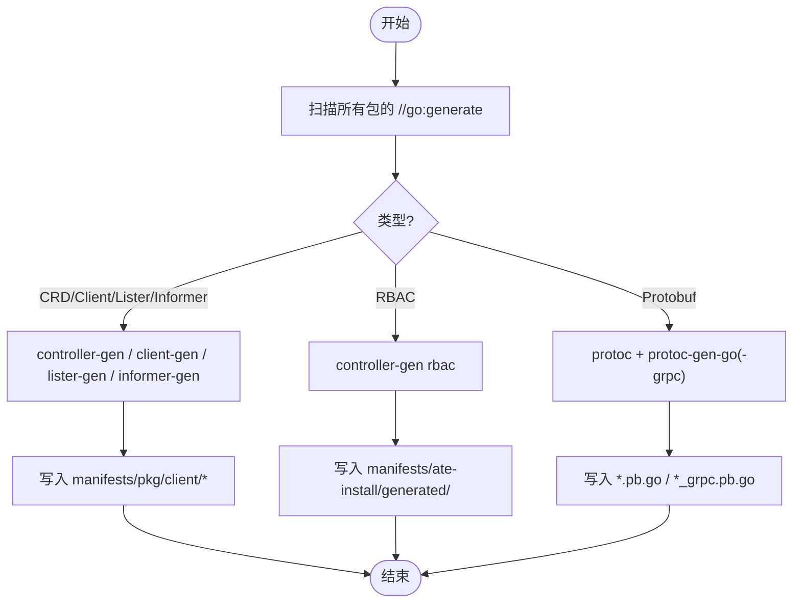
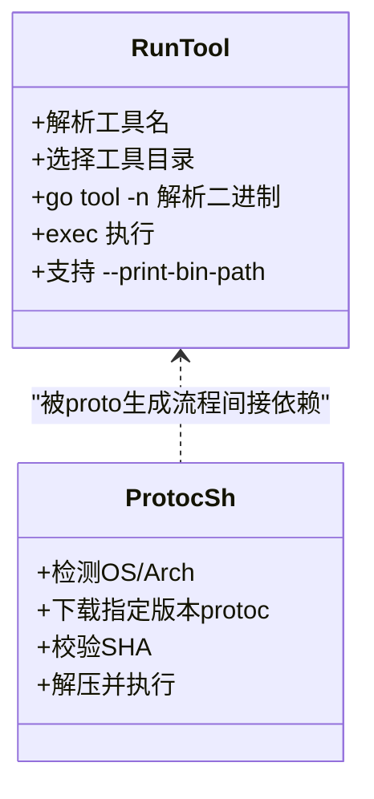
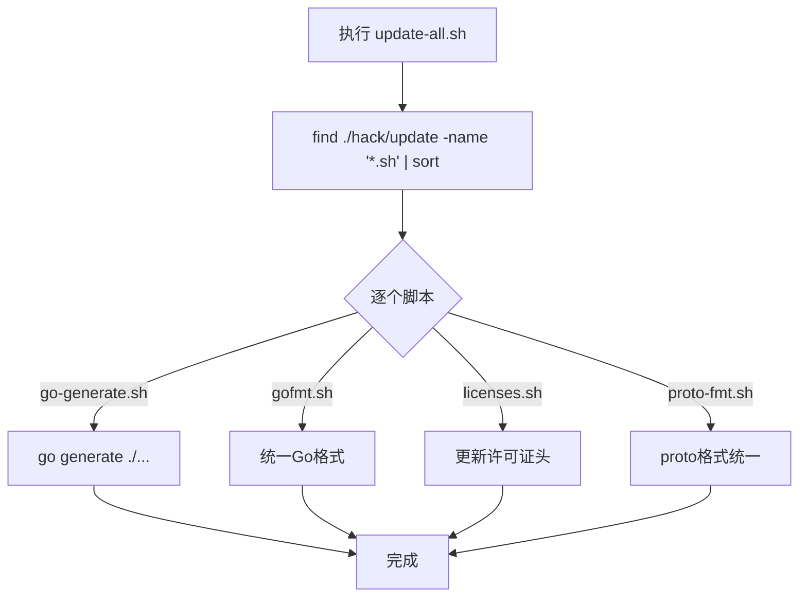
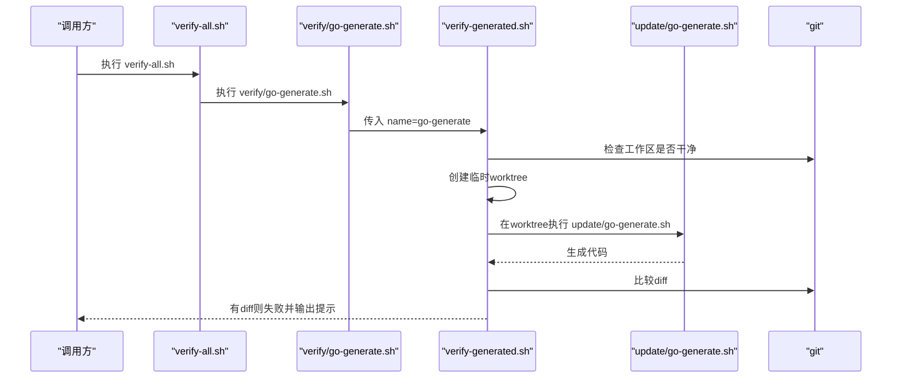
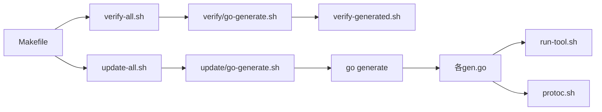

# 代码生成工作流

<cite>
**本文引用的文件**   
- [Makefile](file://Makefile)
- [hack/update-all.sh](file://hack/update-all.sh)
- [hack/verify-all.sh](file://hack/verify-all.sh)
- [hack/update/go-generate.sh](file://hack/update/go-generate.sh)
- [hack/verify/go-generate.sh](file://hack/verify/go-generate.sh)
- [hack/third_party/kubernetes/verify-generated.sh](file://hack/third_party/kubernetes/verify-generated.sh)
- [hack/run-tool.sh](file://hack/run-tool.sh)
- [hack/protoc.sh](file://hack/protoc.sh)
- [pkg/api/v1alpha1/gen.go](file://pkg/api/v1alpha1/gen.go)
- [cmd/atecontroller/internal/controllers/gen.go](file://cmd/atecontroller/internal/controllers/gen.go)
- [internal/proto/ateletpb/gen.go](file://internal/proto/ateletpb/gen.go)
- [internal/proto/ateompb/gen.go](file://internal/proto/ateompb/gen.go)
- [internal/proto/glutton/gen.go](file://internal/proto/glutton/gen.go)
- [pkg/proto/ateapipb/gen.go](file://pkg/proto/ateapipb/gen.go)
</cite>

## 目录
1. [简介](#简介)
2. [项目结构](#项目结构)
3. [核心组件](#核心组件)
4. [架构总览](#架构总览)
5. [详细组件分析](#详细组件分析)
6. [依赖关系分析](#依赖关系分析)
7. [性能考虑](#性能考虑)
8. [故障排除指南](#故障排除指南)
9. [结论](#结论)
10. [附录](#附录)

## 简介
本文件系统化梳理仓库中的“代码生成工作流”，覆盖触发机制（go generate、make target、CI/CD）、更新脚本组织与职责、验证流程实现、本地开发最佳实践，以及失败排查与性能优化建议。目标是帮助开发者快速理解并高效使用代码生成体系，确保生成产物与源码一致、可重复构建。

## 项目结构
围绕代码生成的关键目录与文件：
- hack/update：增量更新脚本集合，统一入口为 update-all.sh
- hack/verify：一致性校验脚本集合，统一入口为 verify-all.sh
- hack/third_party/kubernetes/verify-generated.sh：基于临时 worktree 的“先更新后比对”通用校验器
- 各模块下的 gen.go：声明 go:generate 指令，驱动具体生成任务
- hack/run-tool.sh：工具定位与执行封装，保证工具版本与路径稳定
- hack/protoc.sh：固定版本下载与校验 protoc，屏蔽平台差异

图表来源
- [Makefile:70-94](file://Makefile#L70-L94)
- [hack/update-all.sh:24-28](file://hack/update-all.sh#L24-L28)
- [hack/verify-all.sh:24-28](file://hack/verify-all.sh#L24-L28)
- [hack/update/go-generate.sh:17-22](file://hack/update/go-generate.sh#L17-L22)
- [hack/verify/go-generate.sh:17-22](file://hack/verify/go-generate.sh#L17-L22)
- [hack/third_party/kubernetes/verify-generated.sh:40-60](file://hack/third_party/kubernetes/verify-generated.sh#L40-L60)
- [pkg/api/v1alpha1/gen.go:17-20](file://pkg/api/v1alpha1/gen.go#L17-L20)
- [cmd/atecontroller/internal/controllers/gen.go:17-17](file://cmd/atecontroller/internal/controllers/gen.go#L17-L17)
- [internal/proto/ateletpb/gen.go:17-17](file://internal/proto/ateletpb/gen.go#L17-L17)
- [internal/proto/ateompb/gen.go:17-17](file://internal/proto/ateompb/gen.go#L17-L17)
- [internal/proto/glutton/gen.go:17-17](file://internal/proto/glutton/gen.go#L17-L17)
- [pkg/proto/ateapipb/gen.go:17-17](file://pkg/proto/ateapipb/gen.go#L17-L17)

章节来源
- [Makefile:70-94](file://Makefile#L70-L94)
- [hack/update-all.sh:17-28](file://hack/update-all.sh#L17-L28)
- [hack/verify-all.sh:17-28](file://hack/verify-all.sh#L17-L28)

## 核心组件
- go:generate 指令集
  - CRD/Client/Lister/Informer 生成：位于 pkg/api/v1alpha1/gen.go
  - RBAC 清单生成：位于 cmd/atecontroller/internal/controllers/gen.go
  - gRPC/Protobuf 生成：位于 internal/proto/* 与 pkg/proto/* 下的 gen.go
- 工具链封装
  - hack/run-tool.sh：解析工具名，定位到 hack/tools 下对应 go.mod，通过 go tool -n 获取二进制路径并执行
  - hack/protoc.sh：按平台下载指定版本的 protoc，校验 SHA 后执行
- 更新与验证
  - hack/update/go-generate.sh：调用 go generate ./...
  - hack/verify/go-generate.sh：委托第三方校验器在干净 worktree 中运行更新与比对
  - hack/update-all.sh / hack/verify-all.sh：遍历并顺序执行所有同名子脚本

章节来源
- [pkg/api/v1alpha1/gen.go:17-20](file://pkg/api/v1alpha1/gen.go#L17-L20)
- [cmd/atecontroller/internal/controllers/gen.go:17-17](file://cmd/atecontroller/internal/controllers/gen.go#L17-L17)
- [internal/proto/ateletpb/gen.go:17-17](file://internal/proto/ateletpb/gen.go#L17-L17)
- [internal/proto/ateompb/gen.go:17-17](file://internal/proto/ateompb/gen.go#L17-L17)
- [internal/proto/glutton/gen.go:17-17](file://internal/proto/glutton/gen.go#L17-L17)
- [pkg/proto/ateapipb/gen.go:17-17](file://pkg/proto/ateapipb/gen.go#L17-L17)
- [hack/run-tool.sh:33-51](file://hack/run-tool.sh#L33-L51)
- [hack/protoc.sh:19-81](file://hack/protoc.sh#L19-L81)
- [hack/update/go-generate.sh:17-22](file://hack/update/go-generate.sh#L17-L22)
- [hack/verify/go-generate.sh:17-22](file://hack/verify/go-generate.sh#L17-L22)

## 架构总览
下图展示从 Makefile 到 go:generate 再到具体工具的完整链路，以及验证阶段如何借助临时 worktree 进行一致性检查。

图表来源
- [Makefile:92-94](file://Makefile#L92-L94)
- [hack/verify-all.sh:24-28](file://hack/verify-all.sh#L24-L28)
- [hack/verify/go-generate.sh:22-22](file://hack/verify/go-generate.sh#L22-L22)
- [hack/third_party/kubernetes/verify-generated.sh:40-60](file://hack/third_party/kubernetes/verify-generated.sh#L40-L60)
- [hack/update-all.sh:24-28](file://hack/update-all.sh#L24-L28)
- [hack/update/go-generate.sh:22-22](file://hack/update/go-generate.sh#L22-L22)
- [pkg/api/v1alpha1/gen.go:17-20](file://pkg/api/v1alpha1/gen.go#L17-L20)
- [cmd/atecontroller/internal/controllers/gen.go:17-17](file://cmd/atecontroller/internal/controllers/gen.go#L17-L17)
- [internal/proto/ateletpb/gen.go:17-17](file://internal/proto/ateletpb/gen.go#L17-L17)
- [internal/proto/ateompb/gen.go:17-17](file://internal/proto/ateompb/gen.go#L17-L17)
- [internal/proto/glutton/gen.go:17-17](file://internal/proto/glutton/gen.go#L17-L17)
- [pkg/proto/ateapipb/gen.go:17-17](file://pkg/proto/ateapipb/gen.go#L17-L17)
- [hack/run-tool.sh:33-51](file://hack/run-tool.sh#L33-L51)
- [hack/protoc.sh:46-81](file://hack/protoc.sh#L46-L81)

## 详细组件分析

### go:generate 指令与生成目标
- CRD/Client/Lister/Informer
  - 入口：pkg/api/v1alpha1/gen.go
  - 产出：CRD 清单至 manifests/ate-install/generated/；clientset/listers/informers 至 pkg/client/*
- RBAC
  - 入口：cmd/atecontroller/internal/controllers/gen.go
  - 产出：RBAC 清单至 manifests/ate-install/generated/
- Protobuf/gRPC
  - 入口：internal/proto/* 与 pkg/proto/* 下的 gen.go
  - 产出：*.pb.go 与 *_grpc.pb.go

图表来源
- [pkg/api/v1alpha1/gen.go:17-20](file://pkg/api/v1alpha1/gen.go#L17-L20)
- [cmd/atecontroller/internal/controllers/gen.go:17-17](file://cmd/atecontroller/internal/controllers/gen.go#L17-L17)
- [internal/proto/ateletpb/gen.go:17-17](file://internal/proto/ateletpb/gen.go#L17-L17)
- [internal/proto/ateompb/gen.go:17-17](file://internal/proto/ateompb/gen.go#L17-L17)
- [internal/proto/glutton/gen.go:17-17](file://internal/proto/glutton/gen.go#L17-L17)
- [pkg/proto/ateapipb/gen.go:17-17](file://pkg/proto/ateapipb/gen.go#L17-L17)

章节来源
- [pkg/api/v1alpha1/gen.go:17-20](file://pkg/api/v1alpha1/gen.go#L17-L20)
- [cmd/atecontroller/internal/controllers/gen.go:17-17](file://cmd/atecontroller/internal/controllers/gen.go#L17-L17)
- [internal/proto/ateletpb/gen.go:17-17](file://internal/proto/ateletpb/gen.go#L17-L17)
- [internal/proto/ateompb/gen.go:17-17](file://internal/proto/ateompb/gen.go#L17-L17)
- [internal/proto/glutton/gen.go:17-17](file://internal/proto/glutton/gen.go#L17-L17)
- [pkg/proto/ateapipb/gen.go:17-17](file://pkg/proto/ateapipb/gen.go#L17-L17)

### 工具链封装：run-tool.sh 与 protoc.sh
- run-tool.sh
  - 作用：根据工具名选择工具目录（code-generator 或 tools/<tool>），用 go tool -n 解析二进制路径并执行
  - 优势：避免全局安装，锁定版本，支持 --print-bin-path 供其他脚本拼接参数
- protoc.sh
  - 作用：按平台下载固定版本 protoc，校验 SHA 后执行
  - 优势：跨平台一致性与可复现性

图表来源
- [hack/run-tool.sh:33-51](file://hack/run-tool.sh#L33-L51)
- [hack/protoc.sh:26-81](file://hack/protoc.sh#L26-L81)

章节来源
- [hack/run-tool.sh:17-51](file://hack/run-tool.sh#L17-L51)
- [hack/protoc.sh:19-81](file://hack/protoc.sh#L19-L81)

### 更新脚本组织与职责
- hack/update-all.sh
  - 遍历 hack/update/*.sh 并依次执行，用于一次性更新全部生成内容
- hack/update/go-generate.sh
  - 调用 go generate ./...，触发所有 //go:generate
- 其他更新脚本（如 gofmt、licenses、proto-fmt 等）
  - 负责格式化、许可证头、协议缓冲格式等辅助更新

图表来源
- [hack/update-all.sh:24-28](file://hack/update-all.sh#L24-L28)
- [hack/update/go-generate.sh:22-22](file://hack/update/go-generate.sh#L22-L22)

章节来源
- [hack/update-all.sh:17-28](file://hack/update-all.sh#L17-L28)
- [hack/update/go-generate.sh:17-22](file://hack/update/go-generate.sh#L17-L22)

### 验证流程实现
- hack/verify-all.sh
  - 遍历 hack/verify/*.sh 并依次执行，用于一次性校验
- hack/verify/go-generate.sh
  - 委托第三方校验器 verify-generated.sh，以“go-generate”为名称参数
- hack/third_party/kubernetes/verify-generated.sh
  - 核心逻辑：
    - 要求工作区干净（无未提交变更）
    - 创建临时 worktree
    - 在该 worktree 中执行 ./hack/update/<name>.sh
    - 比较 git status 是否存在 diff，若有则失败并打印差异与提示

图表来源
- [hack/verify-all.sh:24-28](file://hack/verify-all.sh#L24-L28)
- [hack/verify/go-generate.sh:22-22](file://hack/verify/go-generate.sh#L22-L22)
- [hack/third_party/kubernetes/verify-generated.sh:24-60](file://hack/third_party/kubernetes/verify-generated.sh#L24-L60)
- [hack/update/go-generate.sh:22-22](file://hack/update/go-generate.sh#L22-L22)

章节来源
- [hack/verify-all.sh:17-28](file://hack/verify-all.sh#L17-L28)
- [hack/verify/go-generate.sh:17-22](file://hack/verify/go-generate.sh#L17-L22)
- [hack/third_party/kubernetes/verify-generated.sh:17-60](file://hack/third_party/kubernetes/verify-generated.sh#L17-L60)

### CI/CD 集成建议
- 在 PR 合并前执行的步骤
  - 运行 make verify（会触发 test 与 verify-all）
  - 或在 CI 中直接执行 bash hack/verify-all.sh
- 在发布流水线
  - 先执行 bash hack/update-all.sh 生成最新产物
  - 再执行 bash hack/verify-all.sh 确保无差异
- 缓存策略
  - 缓存 hack/bin/protoc-install 与 hack/tools 下的 go module 缓存，加速 protoc 下载与工具构建

[本节为概念性说明，不直接分析具体文件]

## 依赖关系分析
- 顶层入口
  - Makefile 提供 fmt、verify、lint 等便捷目标
- 脚本编排
  - update-all.sh 与 verify-all.sh 作为统一入口，分别调度各自目录下脚本
- 生成点
  - 各 gen.go 通过 go:generate 声明生成任务
- 工具链
  - run-tool.sh 与 protoc.sh 为底层支撑

图表来源
- [Makefile:70-94](file://Makefile#L70-L94)
- [hack/update-all.sh:24-28](file://hack/update-all.sh#L24-L28)
- [hack/verify-all.sh:24-28](file://hack/verify-all.sh#L24-L28)
- [hack/update/go-generate.sh:22-22](file://hack/update/go-generate.sh#L22-L22)
- [hack/verify/go-generate.sh:22-22](file://hack/verify/go-generate.sh#L22-L22)
- [hack/third_party/kubernetes/verify-generated.sh:40-60](file://hack/third_party/kubernetes/verify-generated.sh#L40-L60)
- [pkg/api/v1alpha1/gen.go:17-20](file://pkg/api/v1alpha1/gen.go#L17-L20)
- [cmd/atecontroller/internal/controllers/gen.go:17-17](file://cmd/atecontroller/internal/controllers/gen.go#L17-L17)
- [internal/proto/ateletpb/gen.go:17-17](file://internal/proto/ateletpb/gen.go#L17-L17)
- [internal/proto/ateompb/gen.go:17-17](file://internal/proto/ateompb/gen.go#L17-L17)
- [internal/proto/glutton/gen.go:17-17](file://internal/proto/glutton/gen.go#L17-L17)
- [pkg/proto/ateapipb/gen.go:17-17](file://pkg/proto/ateapipb/gen.go#L17-L17)
- [hack/run-tool.sh:33-51](file://hack/run-tool.sh#L33-L51)
- [hack/protoc.sh:46-81](file://hack/protoc.sh#L46-L81)

章节来源
- [Makefile:70-94](file://Makefile#L70-L94)
- [hack/update-all.sh:17-28](file://hack/update-all.sh#L17-L28)
- [hack/verify-all.sh:17-28](file://hack/verify-all.sh#L17-L28)

## 性能考虑
- 并行化
  - 当前 go generate ./... 串行执行，可在后续优化为并发执行（例如 xargs -P）以提升速度
- 缓存
  - 利用 Go build cache 与 hack/tools 下 go mod 缓存，减少重复构建
  - 复用 hack/bin/protoc-install 下的 protoc 二进制，避免重复下载
- 增量生成
  - 仅对变更包执行 go generate，减少无关生成开销
- 网络与I/O
  - 将远程依赖下载到本地镜像层或缓存卷，降低 CI 网络抖动影响

[本节为通用建议，不直接分析具体文件]

## 故障排除指南
- 工作区不干净导致验证失败
  - 现象：verify 阶段报告 dirty working directory
  - 处理：提交或暂存变更后再运行验证
- 缺少工具或路径错误
  - 现象：run-tool.sh 无法解析工具二进制
  - 处理：确认 hack/tools 下对应 go.mod 存在且可解析；必要时清理 go 缓存并重试
- protoc 下载失败或校验失败
  - 现象：protoc.sh 报 checksum 不匹配或下载失败
  - 处理：检查网络与代理设置；删除 hack/bin/protoc-install 后重试
- 生成结果不一致
  - 现象：verify 阶段出现 diff
  - 处理：先运行 update-all.sh 重新生成，再提交变更；若仍失败，检查模板或输入定义是否有误
- 权限问题
  - 现象：无法写入 manifests 或 pkg/client 目录
  - 处理：确保当前用户对目标目录有写权限

章节来源
- [hack/third_party/kubernetes/verify-generated.sh:24-31](file://hack/third_party/kubernetes/verify-generated.sh#L24-L31)
- [hack/protoc.sh:64-77](file://hack/protoc.sh#L64-L77)

## 结论
本项目通过 go:generate 声明式驱动、统一的更新与验证脚本、稳定的工具链封装，构建了可复现、易维护的代码生成工作流。建议在本地与 CI 中保持一致的执行顺序与缓存策略，以获得稳定高效的体验。

## 附录
- 常用命令
  - 更新生成：bash hack/update-all.sh
  - 验证一致性：bash hack/verify-all.sh
  - 仅验证生成：make verify
  - 仅格式化：make fmt
- 相关路径
  - 生成产物：manifests/ate-install/generated/、pkg/client/*、*_grpc.pb.go 等

[本节为概览性信息，不直接分析具体文件]
