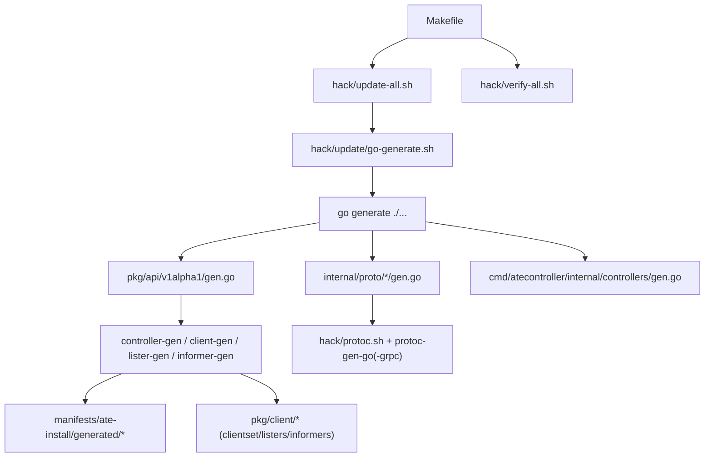
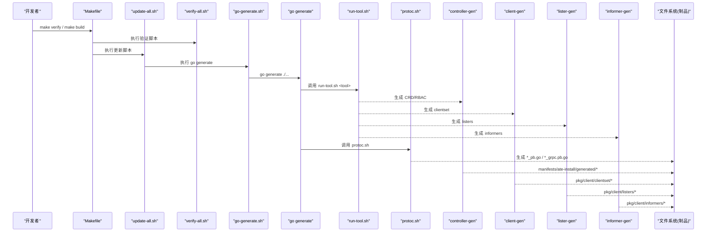
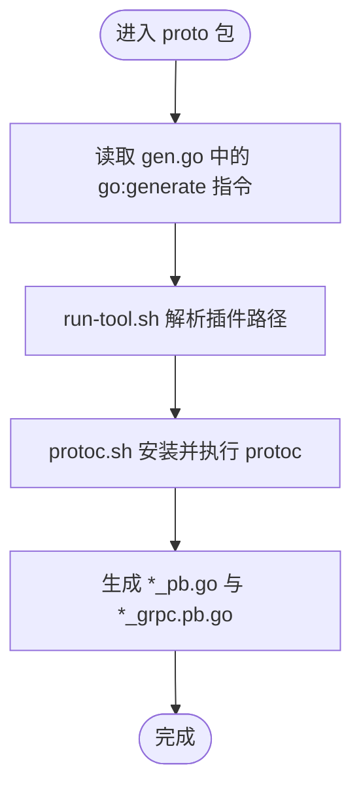
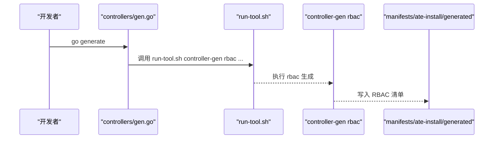
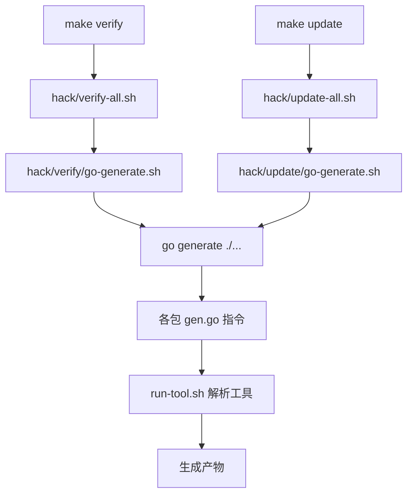
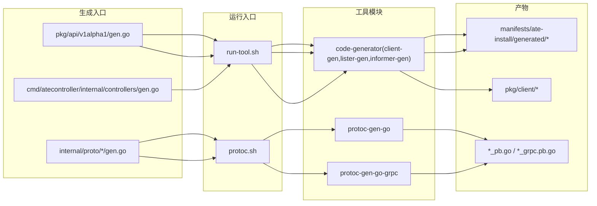

# 代码生成系统

<cite>
**本文引用的文件**   
- [Makefile](file://Makefile)
- [hack/update-all.sh](file://hack/update-all.sh)
- [hack/verify-all.sh](file://hack/verify-all.sh)
- [hack/update/go-generate.sh](file://hack/update/go-generate.sh)
- [hack/run-tool.sh](file://hack/run-tool.sh)
- [hack/protoc.sh](file://hack/protoc.sh)
- [internal/proto/ateletpb/gen.go](file://internal/proto/ateletpb/gen.go)
- [internal/proto/ateletpb/atelet.proto](file://internal/proto/ateletpb/atelet.proto)
- [internal/proto/ateompb/gen.go](file://internal/proto/ateompb/gen.go)
- [internal/proto/ateompb/ateom.proto](file://internal/proto/ateompb/ateom.proto)
- [pkg/api/v1alpha1/gen.go](file://pkg/api/v1alpha1/gen.go)
- [pkg/api/v1alpha1/actortemplate_types.go](file://pkg/api/v1alpha1/actortemplate_types.go)
- [cmd/atecontroller/internal/controllers/gen.go](file://cmd/atecontroller/internal/controllers/gen.go)
</cite>

## 目录
1. [简介](#简介)
2. [项目结构](#项目结构)
3. [核心组件](#核心组件)
4. [架构总览](#架构总览)
5. [详细组件分析](#详细组件分析)
6. [依赖关系分析](#依赖关系分析)
7. [性能与可维护性考虑](#性能与可维护性考虑)
8. [故障排查指南](#故障排查指南)
9. [结论](#结论)
10. [附录](#附录)

## 简介
本文件系统化梳理仓库中的“代码生成系统”，覆盖以下关键主题：
- Protocol Buffers 的定义与生成流程（proto 编写规范、生成命令执行、客户端与服务端代码自动生成）
- Kubernetes 客户端代码的生成（CRD 类型定义、deepcopy 生成、clientset/lister/informer 构建等）
- 代码生成的触发机制与自动化流程（go generate、统一工具入口、更新与校验脚本）
- 自定义代码生成器的开发与集成最佳实践

目标是帮助开发者快速理解并正确使用现有生成管线，同时为扩展新的生成器提供清晰路径。

## 项目结构
本项目将“生成相关”的代码与脚本集中在 hack 与 pkg/cmd 下的若干位置：
- proto 定义位于 internal/proto 与 pkg/proto 下，每个包内包含 .proto 与对应的 go:generate 入口 gen.go
- CRD 类型定义位于 pkg/api/v1alpha1，配套 go:generate 用于生成 deepcopy、CRD YAML、Kubernetes 客户端库
- 控制器 RBAC 清单由 controller-gen 从控制器源码注解生成到 manifests/ate-install/generated
- 统一的工具运行入口在 hack/run-tool.sh，封装了 client-gen、informer-gen、lister-gen、controller-gen 等工具的调用
- protoc 二进制通过 hack/protoc.sh 自动下载并校验版本后执行
- 顶层 Makefile 提供常用目标（build、test、fmt、lint、verify），验证阶段会调用 hack/verify-all.sh，更新阶段会调用 hack/update-all.sh



图表来源
- [Makefile:35-99](file://Makefile#L35-L99)
- [hack/update-all.sh:17-29](file://hack/update-all.sh#L17-L29)
- [hack/verify-all.sh:17-29](file://hack/verify-all.sh#L17-L29)
- [hack/update/go-generate.sh:17-23](file://hack/update/go-generate.sh#L17-L23)
- [pkg/api/v1alpha1/gen.go:17-21](file://pkg/api/v1alpha1/gen.go#L17-L21)
- [internal/proto/ateletpb/gen.go:17-18](file://internal/proto/ateletpb/gen.go#L17-L18)
- [internal/proto/ateompb/gen.go:17-18](file://internal/proto/ateompb/gen.go#L17-L18)
- [cmd/atecontroller/internal/controllers/gen.go:17-18](file://cmd/atecontroller/internal/controllers/gen.go#L17-L18)

章节来源
- [Makefile:35-99](file://Makefile#L35-L99)
- [hack/update-all.sh:17-29](file://hack/update-all.sh#L17-L29)
- [hack/verify-all.sh:17-29](file://hack/verify-all.sh#L17-L29)
- [hack/update/go-generate.sh:17-23](file://hack/update/go-generate.sh#L17-L23)

## 核心组件
- go:generate 入口
  - pkg/api/v1alpha1/gen.go：声明 CRD、deepcopy、clientset、listers、informers 的生成任务
  - internal/proto/*/gen.go：声明各 proto 包的 protoc 生成任务
  - cmd/atecontroller/internal/controllers/gen.go：声明 RBAC 清单生成任务
- 工具运行器
  - hack/run-tool.sh：根据工具名定位对应模块并执行，支持 --print-bin-path 输出二进制路径
- Protobuf 生成器
  - hack/protoc.sh：按平台下载指定版本的 protoc，校验 SHA 后执行
- 批量更新与校验
  - hack/update-all.sh：遍历并执行 hack/update/*.sh
  - hack/verify-all.sh：遍历并执行 hack/verify/*.sh
  - hack/update/go-generate.sh：执行 go generate ./...

章节来源
- [pkg/api/v1alpha1/gen.go:17-21](file://pkg/api/v1alpha1/gen.go#L17-L21)
- [internal/proto/ateletpb/gen.go:17-18](file://internal/proto/ateletpb/gen.go#L17-L18)
- [internal/proto/ateompb/gen.go:17-18](file://internal/proto/ateompb/gen.go#L17-L18)
- [cmd/atecontroller/internal/controllers/gen.go:17-18](file://cmd/atecontroller/internal/controllers/gen.go#L17-L18)
- [hack/run-tool.sh:17-52](file://hack/run-tool.sh#L17-L52)
- [hack/protoc.sh:17-82](file://hack/protoc.sh#L17-L82)
- [hack/update-all.sh:17-29](file://hack/update-all.sh#L17-L29)
- [hack/verify-all.sh:17-29](file://hack/verify-all.sh#L17-L29)
- [hack/update/go-generate.sh:17-23](file://hack/update/go-generate.sh#L17-L23)

## 架构总览
下图展示了从 make 目标到具体生成器的端到端流程，以及产物落盘位置。



图表来源
- [Makefile:35-99](file://Makefile#L35-L99)
- [hack/update-all.sh:17-29](file://hack/update-all.sh#L17-L29)
- [hack/verify-all.sh:17-29](file://hack/verify-all.sh#L17-L29)
- [hack/update/go-generate.sh:17-23](file://hack/update/go-generate.sh#L17-L23)
- [hack/run-tool.sh:17-52](file://hack/run-tool.sh#L17-L52)
- [hack/protoc.sh:17-82](file://hack/protoc.sh#L17-L82)
- [pkg/api/v1alpha1/gen.go:17-21](file://pkg/api/v1alpha1/gen.go#L17-L21)
- [internal/proto/ateletpb/gen.go:17-18](file://internal/proto/ateletpb/gen.go#L17-L18)
- [internal/proto/ateompb/gen.go:17-18](file://internal/proto/ateompb/gen.go#L17-L18)
- [cmd/atecontroller/internal/controllers/gen.go:17-18](file://cmd/atecontroller/internal/controllers/gen.go#L17-L18)

## 详细组件分析

### Protocol Buffers 定义与生成
- 定义位置
  - internal/proto/ateletpb/atelet.proto
  - internal/proto/ateompb/ateom.proto
  - pkg/proto/ateapipb/ateapi.proto（同模式，见同目录 gen.go）
- 生成入口
  - internal/proto/ateletpb/gen.go
  - internal/proto/ateompb/gen.go
  - pkg/proto/ateapipb/gen.go
- 生成过程
  - 通过 go:generate 调用 hack/protoc.sh，后者负责下载并校验指定版本的 protoc
  - 使用 hack/run-tool.sh 解析 protoc-gen-go 与 protoc-gen-go-grpc 的二进制路径
  - 以 paths=source_relative 方式生成 Go 源文件与 gRPC 存根
- 产物
  - 与 .proto 同目录的 *_pb.go 与 *_grpc.pb.go



图表来源
- [internal/proto/ateletpb/gen.go:17-18](file://internal/proto/ateletpb/gen.go#L17-L18)
- [internal/proto/ateompb/gen.go:17-18](file://internal/proto/ateompb/gen.go#L17-L18)
- [hack/protoc.sh:17-82](file://hack/protoc.sh#L17-L82)
- [hack/run-tool.sh:17-52](file://hack/run-tool.sh#L17-L52)

章节来源
- [internal/proto/ateletpb/atelet.proto:1-239](file://internal/proto/ateletpb/atelet.proto#L1-L239)
- [internal/proto/ateompb/ateom.proto:1-171](file://internal/proto/ateompb/ateom.proto#L1-L171)
- [internal/proto/ateletpb/gen.go:17-18](file://internal/proto/ateletpb/gen.go#L17-L18)
- [internal/proto/ateompb/gen.go:17-18](file://internal/proto/ateompb/gen.go#L17-L18)
- [hack/protoc.sh:17-82](file://hack/protoc.sh#L17-L82)
- [hack/run-tool.sh:17-52](file://hack/run-tool.sh#L17-L52)

### Kubernetes 客户端与 CRD 生成
- 类型定义
  - pkg/api/v1alpha1/actortemplate_types.go：定义 ActorTemplate 及其子类型，包含丰富的 kubebuilder 注释与 XValidation 规则
- 生成入口
  - pkg/api/v1alpha1/gen.go：集中声明以下生成任务
    - controller-gen crd/object：生成 CRD YAML 与 deepcopy
    - client-gen：生成 typed clientset
    - lister-gen：生成 listers
    - informer-gen：生成 informers
- 产物落盘
  - manifests/ate-install/generated/*：CRD 清单
  - pkg/client/clientset/*：typed clientset
  - pkg/client/listers/*：listers
  - pkg/client/informers/*：informers

```mermaid
classDiagram
class ActorTemplate {
+Spec
+Status
+TypeMeta
+ObjectMeta
}
class ActorTemplateList {
+Items
+TypeMeta
+ListMeta
}
class DeepCopy {
"+DeepCopyInto(...)"
"+DeepCopy() *ActorTemplate"
}
class ClientSet {
"+ApiV1alpha1()"
"+Actortemplates()"
}
class Listers {
"+Get(name)"
"+List(selector)"
}
class Informers {
"+Informer()"
"+Factory()"
}
ActorTemplate --> DeepCopy : "生成"
ActorTemplateList --> DeepCopy : "生成"
ActorTemplate --> ClientSet : "被访问"
ActorTemplate --> Listers : "被缓存"
ActorTemplate --> Informers : "被监听"
```

图表来源
- [pkg/api/v1alpha1/actortemplate_types.go:357-390](file://pkg/api/v1alpha1/actortemplate_types.go#L357-L390)
- [pkg/api/v1alpha1/gen.go:17-21](file://pkg/api/v1alpha1/gen.go#L17-L21)

章节来源
- [pkg/api/v1alpha1/actortemplate_types.go:1-390](file://pkg/api/v1alpha1/actortemplate_types.go#L1-L390)
- [pkg/api/v1alpha1/gen.go:17-21](file://pkg/api/v1alpha1/gen.go#L17-L21)

### 控制器 RBAC 清单生成
- 生成入口
  - cmd/atecontroller/internal/controllers/gen.go：通过 controller-gen rbac 生成 RBAC 清单
- 产物落盘
  - manifests/ate-install/generated/*：RBAC 清单



图表来源
- [cmd/atecontroller/internal/controllers/gen.go:17-18](file://cmd/atecontroller/internal/controllers/gen.go#L17-L18)
- [hack/run-tool.sh:17-52](file://hack/run-tool.sh#L17-L52)

章节来源
- [cmd/atecontroller/internal/controllers/gen.go:17-18](file://cmd/atecontroller/internal/controllers/gen.go#L17-L18)

### 触发机制与自动化流程
- 本地开发
  - 在任意含 go:generate 的包中执行 go generate ./...
  - 或通过 hack/update/go-generate.sh 统一触发
- CI/CD 与质量门禁
  - make verify 会调用 hack/verify-all.sh，其中包含 go-generate 校验等步骤
  - make update 或 hack/update-all.sh 会执行所有更新脚本（包括 go generate）
- 工具定位
  - hack/run-tool.sh 根据工具名选择对应模块目录，并通过 go tool -n 解析实际二进制路径，避免全局 PATH 污染



图表来源
- [Makefile:86-99](file://Makefile#L86-L99)
- [hack/verify-all.sh:17-29](file://hack/verify-all.sh#L17-L29)
- [hack/update-all.sh:17-29](file://hack/update-all.sh#L17-L29)
- [hack/update/go-generate.sh:17-23](file://hack/update/go-generate.sh#L17-L23)
- [hack/run-tool.sh:17-52](file://hack/run-tool.sh#L17-L52)

章节来源
- [Makefile:86-99](file://Makefile#L86-L99)
- [hack/verify-all.sh:17-29](file://hack/verify-all.sh#L17-L29)
- [hack/update-all.sh:17-29](file://hack/update-all.sh#L17-L29)
- [hack/update/go-generate.sh:17-23](file://hack/update/go-generate.sh#L17-L23)
- [hack/run-tool.sh:17-52](file://hack/run-tool.sh#L17-L52)

## 依赖关系分析
- 生成器与工具链
  - controller-gen、client-gen、lister-gen、informer-gen 通过 hack/tools/code-generator 管理
  - protoc-gen-go、protoc-gen-go-grpc 通过 hack/tools/protoc-gen-go 与 hack/tools/protoc-gen-go-grpc 管理
  - 运行时通过 hack/run-tool.sh 解析二进制路径，确保环境一致
- 版本与可重复性
  - hack/protoc.sh 固定 protoc 版本并按平台校验 SHA，保证跨机器一致
- 产物组织
  - CRD 清单：manifests/ate-install/generated
  - Kubernetes 客户端：pkg/client/{clientset,listers,informers}
  - gRPC/Protobuf：internal/proto/* 与 pkg/proto/* 下 *_pb.go 与 *_grpc.pb.go



图表来源
- [hack/run-tool.sh:17-52](file://hack/run-tool.sh#L17-L52)
- [hack/protoc.sh:17-82](file://hack/protoc.sh#L17-L82)
- [pkg/api/v1alpha1/gen.go:17-21](file://pkg/api/v1alpha1/gen.go#L17-L21)
- [internal/proto/ateletpb/gen.go:17-18](file://internal/proto/ateletpb/gen.go#L17-L18)
- [internal/proto/ateompb/gen.go:17-18](file://internal/proto/ateompb/gen.go#L17-L18)
- [cmd/atecontroller/internal/controllers/gen.go:17-18](file://cmd/atecontroller/internal/controllers/gen.go#L17-L18)

章节来源
- [hack/run-tool.sh:17-52](file://hack/run-tool.sh#L17-L52)
- [hack/protoc.sh:17-82](file://hack/protoc.sh#L17-L82)
- [pkg/api/v1alpha1/gen.go:17-21](file://pkg/api/v1alpha1/gen.go#L17-L21)
- [internal/proto/ateletpb/gen.go:17-18](file://internal/proto/ateletpb/gen.go#L17-L18)
- [internal/proto/ateompb/gen.go:17-18](file://internal/proto/ateompb/gen.go#L17-L18)
- [cmd/atecontroller/internal/controllers/gen.go:17-18](file://cmd/atecontroller/internal/controllers/gen.go#L17-L18)

## 性能与可维护性考虑
- 增量生成
  - 建议仅在变更涉及 .proto 或 types 时执行 go generate，避免全量重建
- 并行化
  - 若后续引入更多独立生成任务，可在 go generate 前对包进行并行处理
- 版本锁定
  - 保持 protoc 与插件版本锁定，避免 CI 与本地不一致
- 产物清理
  - 在切换分支或升级工具链后，必要时清理已生成文件再重新生成，避免残留导致混淆

[本节为通用指导，不直接分析具体文件]

## 故障排查指南
- go generate 未生效
  - 确认当前包存在 go:generate 指令且语法正确
  - 检查是否通过 go generate ./... 或 hack/update/go-generate.sh 触发
- 工具找不到或路径错误
  - 使用 hack/run-tool.sh --print-bin-path <tool> 验证二进制路径
  - 确认 hack/tools/<tool>/go.mod 与依赖可用
- protoc 下载失败或校验失败
  - 检查网络与代理设置
  - 查看 hack/protoc.sh 中的平台与 SHA 配置是否与当前环境匹配
- 生成产物缺失或不完整
  - 检查对应 gen.go 的生成参数是否正确
  - 确认输出目录权限与磁盘空间

章节来源
- [hack/run-tool.sh:17-52](file://hack/run-tool.sh#L17-L52)
- [hack/protoc.sh:17-82](file://hack/protoc.sh#L17-L82)
- [hack/update/go-generate.sh:17-23](file://hack/update/go-generate.sh#L17-L23)

## 结论
本项目的代码生成体系围绕 go:generate 与 hack 工具集构建，实现了：
- 稳定的 Protobuf/gRPC 代码生成（版本锁定、SHA 校验）
- 完整的 Kubernetes 客户端与 CRD 生成（deepcopy、clientset、listers、informers）
- 控制器 RBAC 清单的自动化生成
- 统一的更新与校验流程，便于本地与 CI 保持一致

遵循本文档的流程与实践，可高效地扩展新的生成器并保持工程一致性。

## 附录

### 常用命令速查
- 生成全部代码
  - go generate ./...
  - 或 hack/update/go-generate.sh
- 验证生成产物与格式
  - make verify
- 构建镜像与 CLI
  - make build
  - make build-atectl

章节来源
- [Makefile:35-99](file://Makefile#L35-L99)
- [hack/update/go-generate.sh:17-23](file://hack/update/go-generate.sh#L17-L23)
