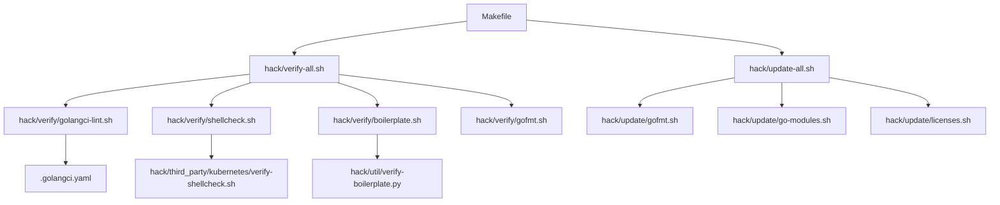
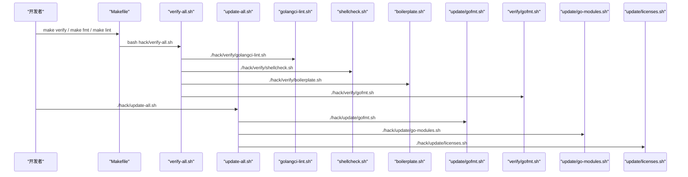
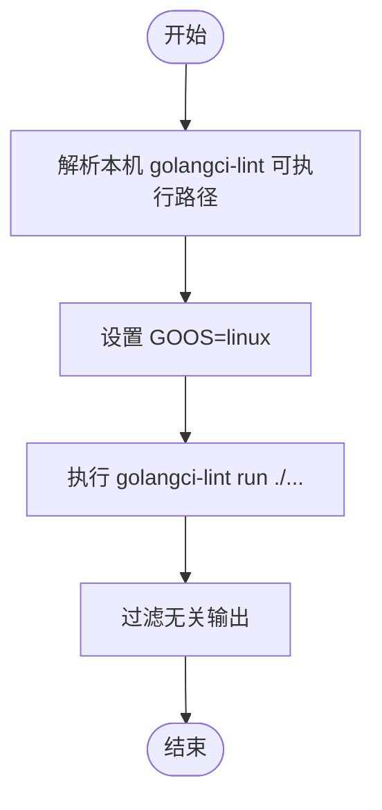
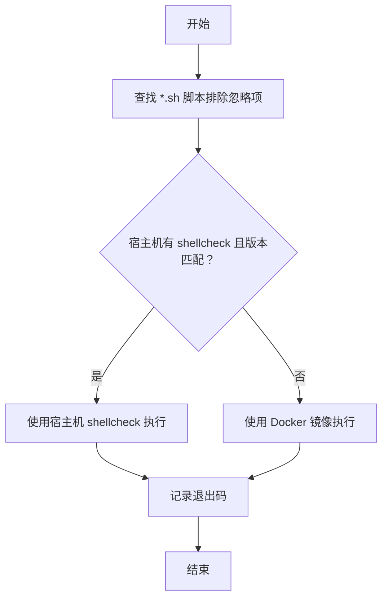
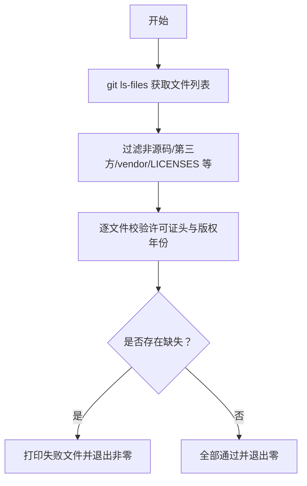
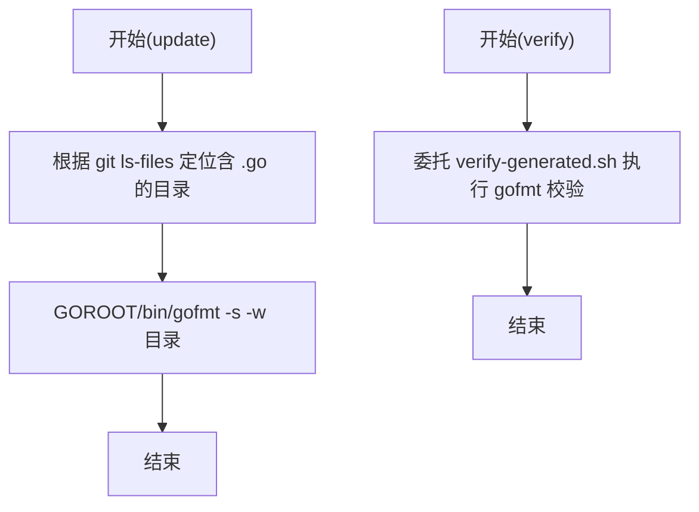
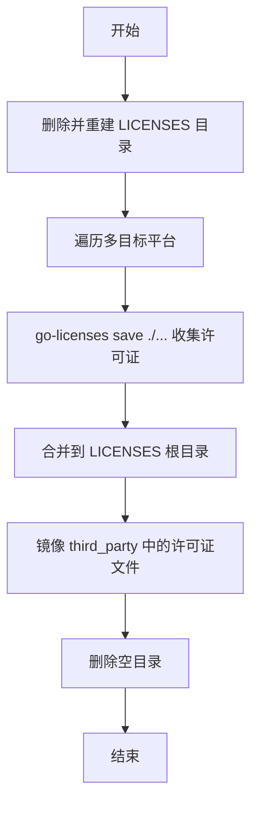
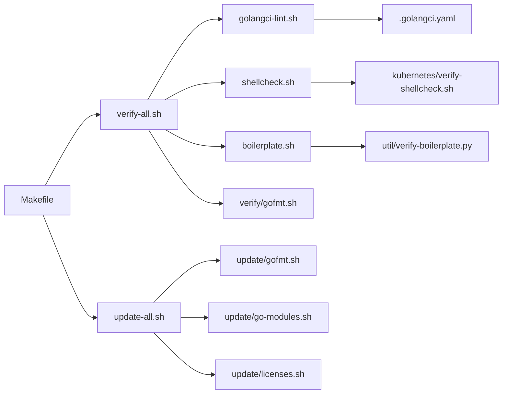

# 开发工具链

<cite>
**本文引用的文件**   
- [Makefile](file://Makefile)
- [hack/update-all.sh](file://hack/update-all.sh)
- [hack/verify-all.sh](file://hack/verify-all.sh)
- [hack/verify/golangci-lint.sh](file://hack/verify/golangci-lint.sh)
- [hack/verify/shellcheck.sh](file://hack/verify/shellcheck.sh)
- [hack/third_party/kubernetes/verify-shellcheck.sh](file://hack/third_party/kubernetes/verify-shellcheck.sh)
- [hack/verify/boilerplate.sh](file://hack/verify/boilerplate.sh)
- [hack/util/verify-boilerplate.py](file://hack/util/verify-boilerplate.py)
- [hack/update/go-modules.sh](file://hack/update/go-modules.sh)
- [hack/update/licenses.sh](file://hack/update/licenses.sh)
- [hack/update/gofmt.sh](file://hack/update/gofmt.sh)
- [hack/verify/gofmt.sh](file://hack/verify/gofmt.sh)
- [.golangci.yaml](file://.golangci.yaml)
</cite>

## 目录
1. [简介](#简介)
2. [项目结构](#项目结构)
3. [核心组件](#核心组件)
4. [架构总览](#架构总览)
5. [详细组件分析](#详细组件分析)
6. [依赖关系分析](#依赖关系分析)
7. [性能与效率考量](#性能与效率考量)
8. [故障排查指南](#故障排查指南)
9. [结论](#结论)
10. [附录](#附录)

## 简介
本文件面向开发者与维护者，系统化梳理 Substrate 项目的开发工具链与质量门禁流程。内容覆盖：
- 代码检查与静态分析：golangci-lint、shellcheck、许可证头校验（boilerplate）
- 格式检查：Go 格式化（gofmt）、协议缓冲格式（proto-fmt）
- 安全与合规扫描：许可证收集与第三方源码镜像
- 更新脚本：依赖更新、代码格式化、许可证管理等自动化任务
- 本地开发环境配置与自定义工具扩展指南

通过统一的 Makefile 入口与 hack 目录下的 verify/update 脚本体系，实现“可重复、可审计、跨平台一致”的开发体验。

## 项目结构
本项目将“验证（verify）”和“更新（update）”两类工具脚本分门别类组织在 hack 目录下：
- hack/verify：只读型检查脚本，用于 CI 和本地门禁
- hack/update：变更型脚本，用于本地或流水线执行更新操作
- hack/tools：各工具的 go.mod 管理，确保版本可控且与宿主环境解耦
- .golangci.yaml：golangci-lint 的集中配置
- Makefile：统一入口，聚合常用命令（构建、测试、格式化、lint、验证等）

图表来源
- [Makefile:35-99](file://Makefile#L35-L99)
- [hack/verify-all.sh:1-29](file://hack/verify-all.sh#L1-L29)
- [hack/update-all.sh:1-29](file://hack/update-all.sh#L1-L29)
- [hack/verify/golangci-lint.sh:1-31](file://hack/verify/golangci-lint.sh#L1-L31)
- [hack/verify/shellcheck.sh:1-23](file://hack/verify/shellcheck.sh#L1-L23)
- [hack/third_party/kubernetes/verify-shellcheck.sh:1-131](file://hack/third_party/kubernetes/verify-shellcheck.sh#L1-L131)
- [hack/verify/boilerplate.sh:1-23](file://hack/verify/boilerplate.sh#L1-L23)
- [hack/util/verify-boilerplate.py:1-140](file://hack/util/verify-boilerplate.py#L1-L140)
- [hack/update/gofmt.sh:1-49](file://hack/update/gofmt.sh#L1-L49)
- [hack/verify/gofmt.sh:1-23](file://hack/verify/gofmt.sh#L1-L23)
- [hack/update/go-modules.sh:1-24](file://hack/update/go-modules.sh#L1-L24)
- [hack/update/licenses.sh:1-97](file://hack/update/licenses.sh#L1-L97)
- [.golangci.yaml:1-110](file://.golangci.yaml#L1-L110)

章节来源
- [Makefile:35-99](file://Makefile#L35-L99)
- [hack/verify-all.sh:1-29](file://hack/verify-all.sh#L1-L29)
- [hack/update-all.sh:1-29](file://hack/update-all.sh#L1-L29)

## 核心组件
- golangci-lint 代码检查
  - 入口：Makefile lint 目标调用 verify/golangci-lint.sh
  - 行为：通过 run-tool.sh 解析本机可执行路径，并以 GOOS=linux 运行，保证与 Linux CI 一致的静态分析结果
  - 配置：.golangci.yaml 启用标准预设并补充拼写检查、排除规则与生成代码豁免
- shellcheck 脚本验证
  - 入口：Makefile 未直接暴露，可通过 verify-all 触发
  - 行为：封装 kubernetes 提供的 verify-shellcheck.sh，支持宿主机安装或 Docker 镜像回退；默认禁用部分误报规则
- boilerplate 许可证头检查
  - 入口：verify/boilerplate.sh 调用 util/verify-boilerplate.py
  - 行为：遍历 git 跟踪文件，校验 Apache 2.0 头部与版权年份范围，跳过非源码与第三方目录
- 代码格式化
  - Go 格式化：update/gofmt.sh 使用当前 GOROOT/bin/gofmt 对含 Go 文件的顶层目录批量格式化；verify/gofmt.sh 基于 kubernetes 的 verify-generated.sh 进行一致性校验
- 依赖与许可证管理
  - 依赖更新：update/go-modules.sh 执行 vendor 同步与 tidy
  - 许可证收集：update/licenses.sh 多目标构建下收集 go-licenses 输出，并镜像 in-tree third_party 的 LICENSE/NOTICE/COPYING 到 LICENSES/third_party

章节来源
- [Makefile:86-94](file://Makefile#L86-L94)
- [hack/verify/golangci-lint.sh:1-31](file://hack/verify/golangci-lint.sh#L1-L31)
- [.golangci.yaml:1-110](file://.golangci.yaml#L1-L110)
- [hack/verify/shellcheck.sh:1-23](file://hack/verify/shellcheck.sh#L1-L23)
- [hack/third_party/kubernetes/verify-shellcheck.sh:1-131](file://hack/third_party/kubernetes/verify-shellcheck.sh#L1-L131)
- [hack/verify/boilerplate.sh:1-23](file://hack/verify/boilerplate.sh#L1-L23)
- [hack/util/verify-boilerplate.py:1-140](file://hack/util/verify-boilerplate.py#L1-L140)
- [hack/update/gofmt.sh:1-49](file://hack/update/gofmt.sh#L1-L49)
- [hack/verify/gofmt.sh:1-23](file://hack/verify/gofmt.sh#L1-L23)
- [hack/update/go-modules.sh:1-24](file://hack/update/go-modules.sh#L1-L24)
- [hack/update/licenses.sh:1-97](file://hack/update/licenses.sh#L1-L97)

## 架构总览
下图展示了从 Makefile 到具体验证/更新脚本的调用链与关键依赖。

图表来源
- [Makefile:86-94](file://Makefile#L86-L94)
- [hack/verify-all.sh:1-29](file://hack/verify-all.sh#L1-L29)
- [hack/update-all.sh:1-29](file://hack/update-all.sh#L1-L29)
- [hack/verify/golangci-lint.sh:1-31](file://hack/verify/golangci-lint.sh#L1-L31)
- [hack/verify/shellcheck.sh:1-23](file://hack/verify/shellcheck.sh#L1-L23)
- [hack/verify/boilerplate.sh:1-23](file://hack/verify/boilerplate.sh#L1-L23)
- [hack/update/gofmt.sh:1-49](file://hack/update/gofmt.sh#L1-L49)
- [hack/verify/gofmt.sh:1-23](file://hack/verify/gofmt.sh#L1-L23)
- [hack/update/go-modules.sh:1-24](file://hack/update/go-modules.sh#L1-L24)
- [hack/update/licenses.sh:1-97](file://hack/update/licenses.sh#L1-L97)

## 详细组件分析

### golangci-lint 代码检查
- 执行方式
  - 通过 Makefile lint 目标触发
  - 脚本以 --print-bin-path 解析本机可执行路径，再以 GOOS=linux 运行，避免 macOS 等平台因 netlink 等包导致的类型检查失败
- 配置要点
  - 启用 standard 预设（errcheck、govet、ineffassign、staticcheck、unused）
  - 额外启用 misspell（仅注释模式），忽略特定词
  - 针对生成代码、Kubernetes 客户端生成目录、测试文件设置宽松策略
  - 对常见 defer Close()/os.Remove() 等返回码忽略模式进行规则级屏蔽
- 建议
  - 新增 linter 前确保基础规则已清洁
  - 若需放宽某规则，优先使用 exclusions.rules 文本匹配而非全局关闭

图表来源
- [hack/verify/golangci-lint.sh:1-31](file://hack/verify/golangci-lint.sh#L1-L31)
- [.golangci.yaml:1-110](file://.golangci.yaml#L1-L110)

章节来源
- [Makefile:86-90](file://Makefile#L86-L90)
- [hack/verify/golangci-lint.sh:1-31](file://hack/verify/golangci-lint.sh#L1-L31)
- [.golangci.yaml:1-110](file://.golangci.yaml#L1-L110)

### shellcheck 脚本验证
- 执行方式
  - 通过 verify/shellcheck.sh 委托至 third_party/kubernetes/verify-shellcheck.sh
- 行为特性
  - 自动发现仓库中所有 .sh 脚本（排除 gitignore、third_party、vendor 等）
  - 优先使用宿主机 shellcheck（版本匹配），否则回退到官方 Docker 镜像
  - 禁用部分误报规则（如 1091），支持颜色输出与外部源跟随
- 建议
  - 在 CI 中固定 SHELLCHECK_COLOR=never 便于解析
  - 如需新增禁用规则，请在脚本内维护清单并说明原因

图表来源
- [hack/verify/shellcheck.sh:1-23](file://hack/verify/shellcheck.sh#L1-L23)
- [hack/third_party/kubernetes/verify-shellcheck.sh:1-131](file://hack/third_party/kubernetes/verify-shellcheck.sh#L1-L131)

章节来源
- [hack/verify/shellcheck.sh:1-23](file://hack/verify/shellcheck.sh#L1-L23)
- [hack/third_party/kubernetes/verify-shellcheck.sh:1-131](file://hack/third_party/kubernetes/verify-shellcheck.sh#L1-L131)

### boilerplate 许可证头检查
- 执行方式
  - verify/boilerplate.sh 调用 util/verify-boilerplate.py
- 行为特性
  - 使用 git ls-files 获取受管文件集合
  - 校验 Apache 2.0 许可头关键字顺序与版权年份范围
  - 跳过非源码、第三方目录、vendor、LICENSES 等
- 建议
  - 新增文件时请保留模板头部，避免 CI 失败
  - 若需扩展支持新语言，可在 Python 脚本中添加扩展名白名单

图表来源
- [hack/verify/boilerplate.sh:1-23](file://hack/verify/boilerplate.sh#L1-L23)
- [hack/util/verify-boilerplate.py:1-140](file://hack/util/verify-boilerplate.py#L1-L140)

章节来源
- [hack/verify/boilerplate.sh:1-23](file://hack/verify/boilerplate.sh#L1-L23)
- [hack/util/verify-boilerplate.py:1-140](file://hack/util/verify-boilerplate.py#L1-L140)

### 代码格式化（Go）
- 更新（写入）
  - update/gofmt.sh：定位包含 Go 文件的顶层目录，使用 GOROOT/bin/gofmt 进行规范化
- 验证（只读）
  - verify/gofmt.sh：委托 kubernetes 的 verify-generated.sh 进行一致性检查
- 建议
  - 提交前运行 make fmt 或在编辑器中集成 gofmt
  - 若引入新的格式化器，建议在 update 与 verify 两侧同时提供

图表来源
- [hack/update/gofmt.sh:1-49](file://hack/update/gofmt.sh#L1-L49)
- [hack/verify/gofmt.sh:1-23](file://hack/verify/gofmt.sh#L1-L23)

章节来源
- [hack/update/gofmt.sh:1-49](file://hack/update/gofmt.sh#L1-L49)
- [hack/verify/gofmt.sh:1-23](file://hack/verify/gofmt.sh#L1-L23)

### 依赖与许可证管理
- 依赖更新
  - update/go-modules.sh：执行 go mod vendor 与 go mod tidy，保持 vendor 与依赖声明一致
- 许可证收集
  - update/licenses.sh：
    - 清理并重建 LICENSES 目录
    - 按 linux/amd64、linux/arm64、darwin/amd64、darwin/arm64 多目标收集 go-licenses 输出
    - 剔除自身模块循环引用
    - 镜像 in-tree third_party 的 LICENSE/NOTICE/COPYING 到 LICENSES/third_party
    - 清理空目录
- 建议
  - 在发布前运行 update-all 以确保 LICENSES 最新
  - 新增 CGO 依赖时注意 CGO_ENABLED 与目标平台兼容性

图表来源
- [hack/update/go-modules.sh:1-24](file://hack/update/go-modules.sh#L1-L24)
- [hack/update/licenses.sh:1-97](file://hack/update/licenses.sh#L1-L97)

章节来源
- [hack/update/go-modules.sh:1-24](file://hack/update/go-modules.sh#L1-L24)
- [hack/update/licenses.sh:1-97](file://hack/update/licenses.sh#L1-L97)

## 依赖关系分析
- 入口与编排
  - Makefile 聚合常用目标（build、test、e2e、fmt、verify-fmt、lint、verify、clean）
  - verify-all.sh 与 update-all.sh 分别遍历对应子目录下的脚本并顺序执行
- 工具版本与隔离
  - 通过 hack/run-tool.sh 解析工具二进制路径，结合各自 go.mod 锁定版本，避免宿主环境差异
- 平台一致性
  - golangci-lint 强制 GOOS=linux，shellcheck 支持 Docker 镜像回退，减少跨平台不一致问题

图表来源
- [Makefile:35-99](file://Makefile#L35-L99)
- [hack/verify-all.sh:1-29](file://hack/verify-all.sh#L1-L29)
- [hack/update-all.sh:1-29](file://hack/update-all.sh#L1-L29)
- [hack/verify/golangci-lint.sh:1-31](file://hack/verify/golangci-lint.sh#L1-L31)
- [hack/verify/shellcheck.sh:1-23](file://hack/verify/shellcheck.sh#L1-L23)
- [hack/verify/boilerplate.sh:1-23](file://hack/verify/boilerplate.sh#L1-L23)
- [hack/verify/gofmt.sh:1-23](file://hack/verify/gofmt.sh#L1-L23)
- [hack/update/gofmt.sh:1-49](file://hack/update/gofmt.sh#L1-L49)
- [hack/update/go-modules.sh:1-24](file://hack/update/go-modules.sh#L1-L24)
- [hack/update/licenses.sh:1-97](file://hack/update/licenses.sh#L1-L97)
- [.golangci.yaml:1-110](file://.golangci.yaml#L1-L110)
- [hack/third_party/kubernetes/verify-shellcheck.sh:1-131](file://hack/third_party/kubernetes/verify-shellcheck.sh#L1-L131)
- [hack/util/verify-boilerplate.py:1-140](file://hack/util/verify-boilerplate.py#L1-L140)

章节来源
- [Makefile:35-99](file://Makefile#L35-L99)
- [hack/verify-all.sh:1-29](file://hack/verify-all.sh#L1-L29)
- [hack/update-all.sh:1-29](file://hack/update-all.sh#L1-L29)

## 性能与效率考量
- 并行与串行
  - verify-all.sh 与 update-all.sh 采用顺序执行，便于定位失败点；如需加速，可按功能拆分阶段并在 CI 中并行化
- 工具缓存
  - 利用 hack/tools 下独立 go.mod 锁定工具版本，避免重复下载与编译
- 平台差异
  - golangci-lint 强制 GOOS=linux 提升一致性；shellcheck 支持 Docker 镜像回退，降低环境差异带来的不稳定
- 大仓库优化
  - gofmt 按目录批量处理；license 收集按目标平台并行化思路可扩展为并发执行（需谨慎合并输出）

[本节为通用指导，不直接分析具体文件]

## 故障排查指南
- golangci-lint 报错但本地无法复现
  - 确认是否以 GOOS=linux 运行；检查 .golangci.yaml 的排除规则与生成代码豁免
  - 参考：[hack/verify/golangci-lint.sh:1-31](file://hack/verify/golangci-lint.sh#L1-L31)、[.golangci.yaml:1-110](file://.golangci.yaml#L1-L110)
- shellcheck 在 CI 失败但在本地通过
  - 检查 shellcheck 版本是否与脚本要求一致；必要时使用 Docker 镜像执行
  - 参考：[hack/third_party/kubernetes/verify-shellcheck.sh:1-131](file://hack/third_party/kubernetes/verify-shellcheck.sh#L1-L131)
- boilerplate 校验失败
  - 确认文件头部包含 Apache 2.0 关键字与有效版权年份；检查是否被误加入排除范围
  - 参考：[hack/util/verify-boilerplate.py:1-140](file://hack/util/verify-boilerplate.py#L1-L140)
- gofmt 不一致
  - 使用 update/gofmt.sh 进行修复后再次 verify
  - 参考：[hack/update/gofmt.sh:1-49](file://hack/update/gofmt.sh#L1-L49)、[hack/verify/gofmt.sh:1-23](file://hack/verify/gofmt.sh#L1-L23)
- 许可证收集不完整
  - 确认多目标平台均已执行；检查 third_party 下是否有遗漏的 LICENSE/NOTICE/COPYING
  - 参考：[hack/update/licenses.sh:1-97](file://hack/update/licenses.sh#L1-L97)

章节来源
- [hack/verify/golangci-lint.sh:1-31](file://hack/verify/golangci-lint.sh#L1-L31)
- [.golangci.yaml:1-110](file://.golangci.yaml#L1-L110)
- [hack/third_party/kubernetes/verify-shellcheck.sh:1-131](file://hack/third_party/kubernetes/verify-shellcheck.sh#L1-L131)
- [hack/util/verify-boilerplate.py:1-140](file://hack/util/verify-boilerplate.py#L1-L140)
- [hack/update/gofmt.sh:1-49](file://hack/update/gofmt.sh#L1-L49)
- [hack/verify/gofmt.sh:1-23](file://hack/verify/gofmt.sh#L1-L23)
- [hack/update/licenses.sh:1-97](file://hack/update/licenses.sh#L1-L97)

## 结论
本工具链以 Makefile 为统一入口，配合 verify/update 双轨脚本体系，实现了跨平台一致的代码质量门禁与自动化更新能力。通过集中化的 golangci-lint 配置、严格的许可证头校验与完善的第三方许可证收集，项目在可维护性与合规性方面具备良好基础。建议在团队内推广本地预检与 CI 门禁的一致性实践，并按需逐步引入更多静态分析与安全扫描工具。

[本节为总结性内容，不直接分析具体文件]

## 附录

### 常用命令速查
- 运行全部验证
  - make verify
  - bash hack/verify-all.sh
- 运行全部更新
  - bash hack/update-all.sh
- 格式化与校验
  - make fmt
  - make verify-fmt
- 代码检查
  - make lint
- 依赖与许可证
  - bash hack/update/go-modules.sh
  - bash hack/update/licenses.sh

章节来源
- [Makefile:78-94](file://Makefile#L78-L94)
- [hack/verify-all.sh:1-29](file://hack/verify-all.sh#L1-L29)
- [hack/update-all.sh:1-29](file://hack/update-all.sh#L1-L29)
- [hack/update/go-modules.sh:1-24](file://hack/update/go-modules.sh#L1-L24)
- [hack/update/licenses.sh:1-97](file://hack/update/licenses.sh#L1-L97)

### 本地开发环境配置建议
- 工具版本管理
  - 使用 hack/tools 下各工具的 go.mod 锁定版本，避免宿主环境差异
- 编辑器集成
  - 在编辑器中启用 gofmt 保存时格式化，减少 verify-fmt 失败
- 预提交钩子
  - 可结合 pre-commit 框架调用 verify-all.sh 的部分步骤，缩短反馈周期
- 自定义工具扩展
  - 新增工具时遵循以下约定：
    - 在 hack/tools/<tool>/ 下提供 go.mod 与 go.sum
    - 在 verify/ 或 update/ 下提供对应脚本
    - 在 Makefile 中暴露便捷目标
    - 在 verify-all.sh 或 update-all.sh 中无需改动（自动发现）

[本节为通用指导，不直接分析具体文件]
