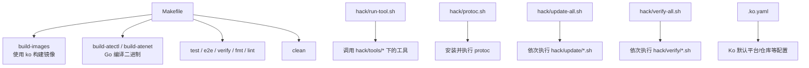
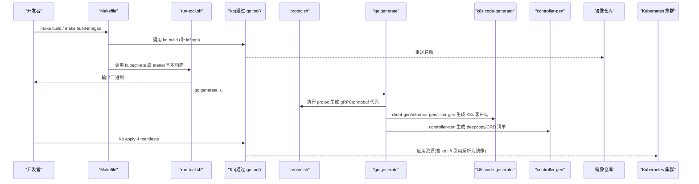
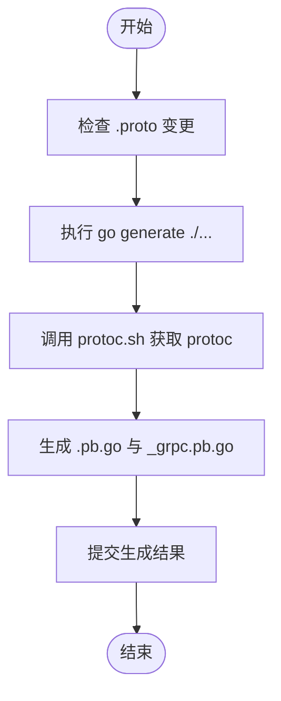
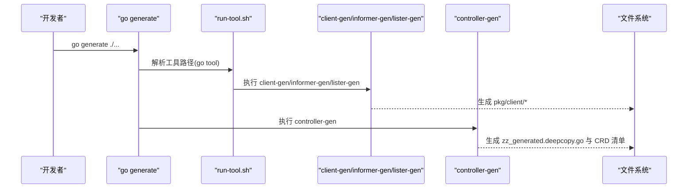
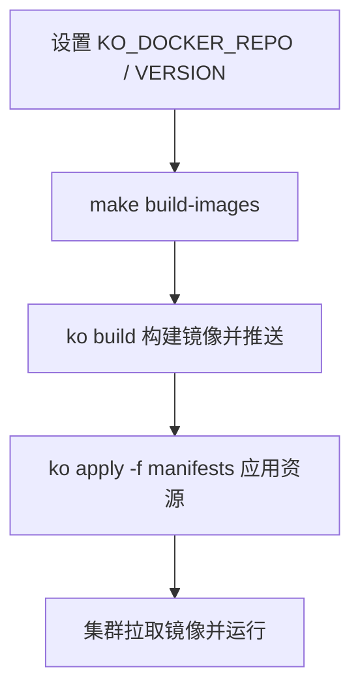
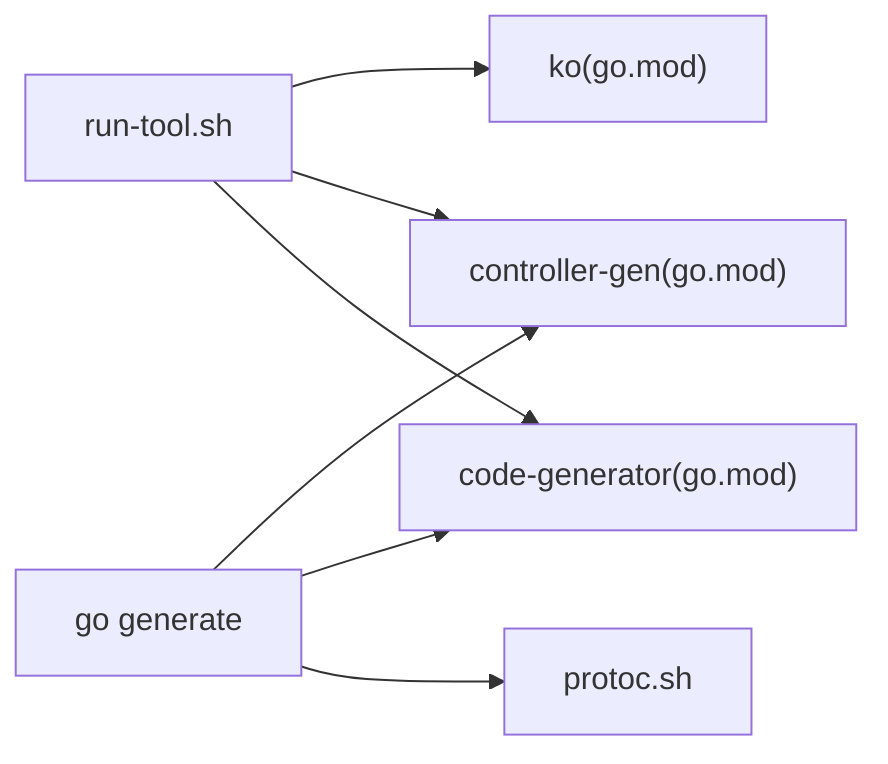

# 构建工具与代码生成

<cite>
**本文引用的文件**   
- [Makefile](file://Makefile)
- [hack/protoc.sh](file://hack/protoc.sh)
- [hack/run-tool.sh](file://hack/run-tool.sh)
- [hack/update-all.sh](file://hack/update-all.sh)
- [hack/verify-all.sh](file://hack/verify-all.sh)
- [hack/update/go-generate.sh](file://hack/update/go-generate.sh)
- [hack/verify/go-generate.sh](file://hack/verify/go-generate.sh)
- [hack/tools/ko/go.mod](file://hack/tools/ko/go.mod)
- [hack/tools/controller-gen/go.mod](file://hack/tools/controller-gen/go.mod)
- [hack/tools/code-generator/go.mod](file://hack/tools/code-generator/go.mod)
- [internal/proto/ateletpb/gen.go](file://internal/proto/ateletpb/gen.go)
- [internal/proto/ateompb/gen.go](file://internal/proto/ateompb/gen.go)
- [internal/proto/glutton/gen.go](file://internal/proto/glutton/gen.go)
- [pkg/proto/ateapipb/gen.go](file://pkg/proto/ateapipb/gen.go)
- [pkg/api/v1alpha1/gen.go](file://pkg/api/v1alpha1/gen.go)
- [.ko.yaml](file://.ko.yaml)
</cite>

## 目录
1. [简介](#简介)
2. [项目结构](#项目结构)
3. [核心组件](#核心组件)
4. [架构总览](#架构总览)
5. [详细组件分析](#详细组件分析)
6. [依赖分析](#依赖分析)
7. [性能考虑](#性能考虑)
8. [故障排查指南](#故障排查指南)
9. [结论](#结论)
10. [附录](#附录)

## 简介
本指南聚焦于项目的构建工具链与代码生成流程，覆盖以下主题：
- Makefile 的使用与常用目标（编译、打包、测试、验证、清理等）
- Protocol Buffers 的代码生成过程（proto 编写、生成命令执行、客户端代码生成）
- Kubernetes 客户端与 CRD 相关代码的自动生成（clientset、informer、lister、deepcopy 等）
- 镜像构建与发布流程（Ko 工具、多架构镜像、版本管理）
- 自定义构建脚本的开发与维护规范

## 项目结构
仓库采用“按功能域组织 + hack 工具集中管理”的结构。与构建和代码生成相关的核心位置如下：
- 顶层构建入口：Makefile
- 工具运行封装：hack/run-tool.sh（统一通过 go tool 解析并执行 hack/tools/*/go.mod 中声明的工具）
- 代码生成与格式化：hack/update/*.sh、hack/verify/*.sh
- Protobuf 工具链：hack/protoc.sh（自动下载并校验 protoc 二进制）
- Ko 配置与工具：.ko.yaml、hack/tools/ko/go.mod
- 代码生成点：各模块中的 gen.go（go:generate 驱动）

**图表来源** 
- [Makefile:35-99](file://Makefile#L35-L99)
- [hack/run-tool.sh:1-51](file://hack/run-tool.sh#L1-L51)
- [hack/protoc.sh:1-82](file://hack/protoc.sh#L1-L82)
- [hack/update-all.sh:1-29](file://hack/update-all.sh#L1-L29)
- [hack/verify-all.sh:1-29](file://hack/verify-all.sh#L1-L29)
- [.ko.yaml](file://.ko.yaml)

**章节来源**
- [Makefile:15-99](file://Makefile#L15-L99)
- [hack/run-tool.sh:1-51](file://hack/run-tool.sh#L1-L51)
- [hack/protoc.sh:1-82](file://hack/protoc.sh#L1-L82)
- [hack/update-all.sh:1-29](file://hack/update-all.sh#L1-L29)
- [hack/verify-all.sh:1-29](file://hack/verify-all.sh#L1-L29)

## 核心组件
- 构建入口与目标
  - all：默认目标，触发完整构建
  - build：组合构建镜像与 CLI 工具
  - build-images：基于 Ko 构建多个服务镜像
  - build-atectl / build-atenet：本地 Go 编译二进制
  - test / e2e / verify / fmt / lint / clean：测试、端到端、验证、格式化、静态检查、清理
- 工具运行器
  - run-tool.sh：根据工具名定位到 hack/tools/<tool>/go.mod，并通过 go tool 解析实际可执行路径后执行
- Protobuf 工具链
  - protoc.sh：自动检测平台、下载指定版本的 protoc 并校验 SHA，随后 exec 转发参数
- 更新与验证流水线
  - update-all.sh / verify-all.sh：遍历子脚本并顺序执行，保证一致性
- 代码生成点
  - 各模块 gen.go 通过 go:generate 声明生成规则，由 go generate ./... 驱动

**章节来源**
- [Makefile:35-99](file://Makefile#L35-L99)
- [hack/run-tool.sh:1-51](file://hack/run-tool.sh#L1-L51)
- [hack/protoc.sh:1-82](file://hack/protoc.sh#L1-L82)
- [hack/update-all.sh:1-29](file://hack/update-all.sh#L1-L29)
- [hack/verify-all.sh:1-29](file://hack/verify-all.sh#L1-L29)

## 架构总览
下图展示了从开发者命令到最终产物（二进制、镜像、Kubernetes 资源）的整体流程，以及代码生成的关键节点。

**图表来源** 
- [Makefile:35-99](file://Makefile#L35-L99)
- [hack/run-tool.sh:1-51](file://hack/run-tool.sh#L1-L51)
- [hack/protoc.sh:1-82](file://hack/protoc.sh#L1-L82)
- [hack/update/go-generate.sh:1-23](file://hack/update/go-generate.sh#L1-L23)
- [hack/tools/code-generator/go.mod:1-22](file://hack/tools/code-generator/go.mod#L1-L22)
- [hack/tools/controller-gen/go.mod:1-53](file://hack/tools/controller-gen/go.mod#L1-L53)
- [hack/tools/ko/go.mod:1-166](file://hack/tools/ko/go.mod#L1-L166)

## 详细组件分析

### Makefile 使用指南
- 常用命令
  - 构建全部：make
  - 仅构建镜像：make build-images
  - 构建 CLI 工具：make build-atectl
  - 构建 atenet：make build-atenet
  - 构建示例镜像：make build-demos
  - 单元测试：make test
  - 端到端测试：make e2e
  - 代码格式化：make fmt
  - 格式校验：make verify-fmt
  - 静态检查：make lint
  - 全量验证：make verify
  - 清理：make clean
- 版本注入
  - 通过 VERSION 变量与 LDFLAGS 注入版本号至 internal/version 包
- Ko 仓库
  - 通过 KO_DOCKER_REPO 指定镜像仓库前缀（默认 gcr.io/<PROJECT_ID>/ate-images）

**章节来源**
- [Makefile:15-99](file://Makefile#L15-L99)

### Protocol Buffers 代码生成
- 工具准备
  - 使用 hack/protoc.sh 自动下载并校验指定版本的 protoc 二进制，避免环境差异
- 生成入口
  - 各 proto 目录包含 gen.go，通过 go:generate 声明生成规则
  - 统一通过 go generate ./... 触发所有生成任务
- 生成内容
  - .pb.go 与 _grpc.pb.go 客户端/服务端桩代码
- 建议流程
  - 修改 .proto 后，先执行 go generate ./...，再提交变更；CI 可通过 verify-go-generate 校验是否最新

**图表来源** 
- [hack/protoc.sh:1-82](file://hack/protoc.sh#L1-L82)
- [hack/update/go-generate.sh:1-23](file://hack/update/go-generate.sh#L1-L23)
- [internal/proto/ateletpb/gen.go](file://internal/proto/ateletpb/gen.go)
- [internal/proto/ateompb/gen.go](file://internal/proto/ateompb/gen.go)
- [internal/proto/glutton/gen.go](file://internal/proto/glutton/gen.go)
- [pkg/proto/ateapipb/gen.go](file://pkg/proto/ateapipb/gen.go)

**章节来源**
- [hack/protoc.sh:1-82](file://hack/protoc.sh#L1-L82)
- [hack/update/go-generate.sh:1-23](file://hack/update/go-generate.sh#L1-L23)
- [internal/proto/ateletpb/gen.go](file://internal/proto/ateletpb/gen.go)
- [internal/proto/ateompb/gen.go](file://internal/proto/ateompb/gen.go)
- [internal/proto/glutton/gen.go](file://internal/proto/glutton/gen.go)
- [pkg/proto/ateapipb/gen.go](file://pkg/proto/ateapipb/gen.go)

### Kubernetes 客户端与 CRD 代码生成
- 工具与依赖
  - client-gen、informer-gen、lister-gen 在 hack/tools/code-generator/go.mod 中以 tool 指令声明
  - controller-gen 在 hack/tools/controller-gen/go.mod 中声明，用于生成 deepcopy 与 CRD 清单
- 生成入口
  - pkg/api/v1alpha1/gen.go 中通过 go:generate 声明生成规则
  - 通过 go generate ./... 触发
- 生成产物
  - pkg/client 下生成 clientset、informers、listers
  - pkg/api/v1alpha1/zz_generated.deepcopy.go 生成 DeepCopy 方法
- 建议流程
  - 修改 Types 定义后，执行 go generate ./...，确保生成文件与源码一致；CI 通过 verify-go-generate 校验

**图表来源** 
- [hack/tools/code-generator/go.mod:1-22](file://hack/tools/code-generator/go.mod#L1-L22)
- [hack/tools/controller-gen/go.mod:1-53](file://hack/tools/controller-gen/go.mod#L1-L53)
- [hack/run-tool.sh:1-51](file://hack/run-tool.sh#L1-L51)
- [pkg/api/v1alpha1/gen.go](file://pkg/api/v1alpha1/gen.go)

**章节来源**
- [hack/tools/code-generator/go.mod:1-22](file://hack/tools/code-generator/go.mod#L1-L22)
- [hack/tools/controller-gen/go.mod:1-53](file://hack/tools/controller-gen/go.mod#L1-L53)
- [hack/run-tool.sh:1-51](file://hack/run-tool.sh#L1-L51)
- [pkg/api/v1alpha1/gen.go](file://pkg/api/v1alpha1/gen.go)

### 镜像构建与发布（Ko）
- 工具与配置
  - Ko 通过 hack/tools/ko/go.mod 以 tool 指令声明，统一由 run-tool.sh 调用
  - .ko.yaml 提供默认平台、仓库等配置
- 构建与部署
  - make build-images 使用 ko build 构建多个服务的镜像
  - 使用 ko apply 将带有 ko:// 引用的清单直接应用到集群，自动解析镜像引用
- 多架构与版本
  - 通过 .ko.yaml 配置 defaultPlatforms 支持多架构
  - 通过 Makefile 的 VERSION 与 LDFLAGS 注入版本信息到二进制

**图表来源** 
- [Makefile:35-99](file://Makefile#L35-L99)
- [hack/tools/ko/go.mod:1-166](file://hack/tools/ko/go.mod#L1-L166)
- [.ko.yaml](file://.ko.yaml)

**章节来源**
- [Makefile:35-99](file://Makefile#L35-L99)
- [hack/tools/ko/go.mod:1-166](file://hack/tools/ko/go.mod#L1-L166)
- [.ko.yaml](file://.ko.yaml)

### 自定义构建脚本开发与维护指南
- 工具发现与执行
  - 新增工具时，在 hack/tools/<tool>/go.mod 中声明 tool 指令，并使用 run-tool.sh 调用
- 更新与验证脚本
  - 新增更新逻辑放入 hack/update/*.sh，由 update-all.sh 顺序执行
  - 新增校验逻辑放入 hack/verify/*.sh，由 verify-all.sh 顺序执行
- 一致性保障
  - 使用 set -o errexit -o nounset -o pipefail 确保错误快速失败
  - 使用 git rev-parse --show-toplevel 确定根目录，避免相对路径问题
- 最佳实践
  - 固定工具版本与哈希（如 protoc.sh 对 protoc 的二进制校验）
  - 将外部依赖（clang-format、docker、kubectl 等）的可用性检查前置
  - 保持脚本幂等，便于 CI 多次运行

**章节来源**
- [hack/run-tool.sh:1-51](file://hack/run-tool.sh#L1-L51)
- [hack/update-all.sh:1-29](file://hack/update-all.sh#L1-L29)
- [hack/verify-all.sh:1-29](file://hack/verify-all.sh#L1-L29)
- [hack/protoc.sh:1-82](file://hack/protoc.sh#L1-L82)

## 依赖分析
- 工具依赖关系
  - run-tool.sh 作为统一入口，依据工具名选择对应 hack/tools/<tool>/go.mod
  - code-generator 依赖 k8s.io/code-generator 的 client-gen/informer-gen/lister-gen
  - controller-gen 依赖 sigs.k8s.io/controller-tools
  - ko 依赖 google/ko 及容器生态库
- 生成链路耦合
  - go generate 串联 protobuf 与 K8s 代码生成，形成强耦合的生成阶段
  - Makefile 将构建与生成解耦，但通常建议在提交前完成生成

**图表来源** 
- [hack/run-tool.sh:1-51](file://hack/run-tool.sh#L1-L51)
- [hack/tools/code-generator/go.mod:1-22](file://hack/tools/code-generator/go.mod#L1-L22)
- [hack/tools/controller-gen/go.mod:1-53](file://hack/tools/controller-gen/go.mod#L1-L53)
- [hack/tools/ko/go.mod:1-166](file://hack/tools/ko/go.mod#L1-L166)
- [hack/protoc.sh:1-82](file://hack/protoc.sh#L1-L82)

**章节来源**
- [hack/run-tool.sh:1-51](file://hack/run-tool.sh#L1-L51)
- [hack/tools/code-generator/go.mod:1-22](file://hack/tools/code-generator/go.mod#L1-L22)
- [hack/tools/controller-gen/go.mod:1-53](file://hack/tools/controller-gen/go.mod#L1-L53)
- [hack/tools/ko/go.mod:1-166](file://hack/tools/ko/go.mod#L1-L166)
- [hack/protoc.sh:1-82](file://hack/protoc.sh#L1-L82)

## 性能考虑
- 并行与缓存
  - 使用 Go 模块缓存与 Docker/Ko 层缓存加速重复构建
- 增量生成
  - 仅在 proto 或 Types 变更时执行 go generate，减少不必要的生成开销
- 多架构构建
  - 合理配置 .ko.yaml 的 defaultPlatforms，避免无谓的交叉编译
- 二进制体积
  - 利用 LDFLAGS 控制版本信息注入，必要时启用更激进的裁剪选项

[本节为通用指导，不直接分析具体文件]

## 故障排查指南
- protoc 下载失败或校验失败
  - 检查网络与代理设置；确认平台识别与 SHA 匹配
- go generate 未生成预期文件
  - 确认各模块 gen.go 的 go:generate 指令正确；使用 go generate ./... 重新生成
- K8s 客户端生成缺失
  - 检查 hack/tools/code-generator/go.mod 的 tool 指令；确保 run-tool.sh 能解析到工具路径
- Ko 构建失败
  - 检查 KO_DOCKER_REPO 与认证；确认 .ko.yaml 的 defaultPlatforms 与当前环境匹配
- 验证失败
  - 使用 make verify 或 hack/verify-all.sh 逐项查看失败原因

**章节来源**
- [hack/protoc.sh:1-82](file://hack/protoc.sh#L1-L82)
- [hack/update/go-generate.sh:1-23](file://hack/update/go-generate.sh#L1-L23)
- [hack/verify/go-generate.sh:1-23](file://hack/verify/go-generate.sh#L1-L23)
- [Makefile:35-99](file://Makefile#L35-L99)

## 结论
本项目通过 Makefile 统一入口、run-tool.sh 工具分发、protoc.sh 工具锁定、go generate 驱动的代码生成以及 Ko 的一体化镜像构建与部署，形成了稳定且可复现的构建与发布流水线。遵循本文档的流程与规范，可有效提升团队协作效率与交付质量。

[本节为总结性内容，不直接分析具体文件]

## 附录
- 常用命令速查
  - 构建：make build / make build-images
  - 生成：go generate ./...
  - 验证：make verify / hack/verify-all.sh
  - 更新：hack/update-all.sh
  - 部署：ko apply -f manifests（或通过 Makefile/e2e 脚本）

[本节为补充说明，不直接分析具体文件]
