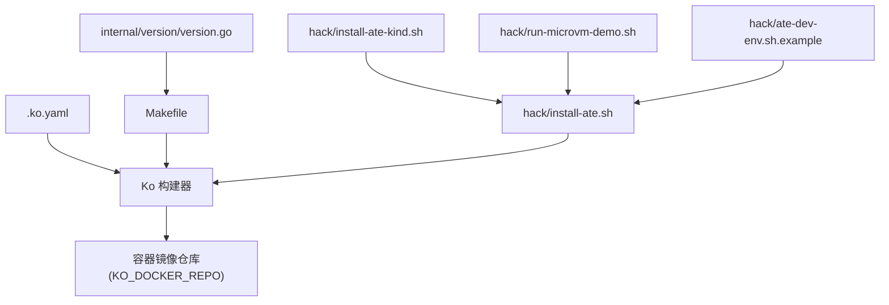
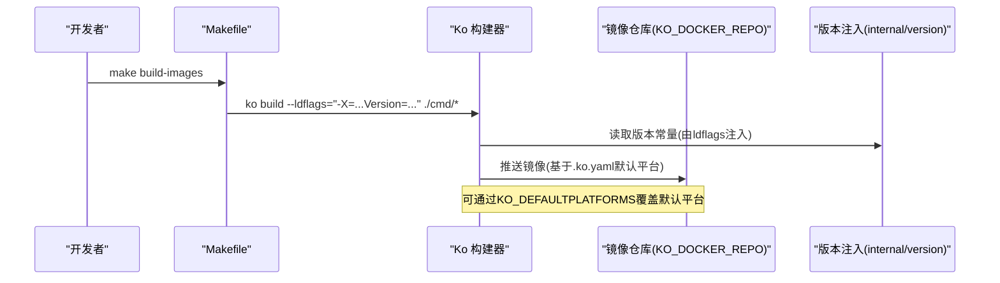
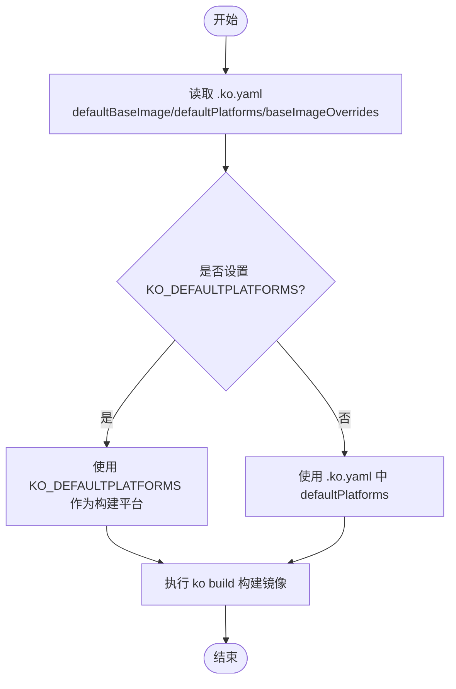
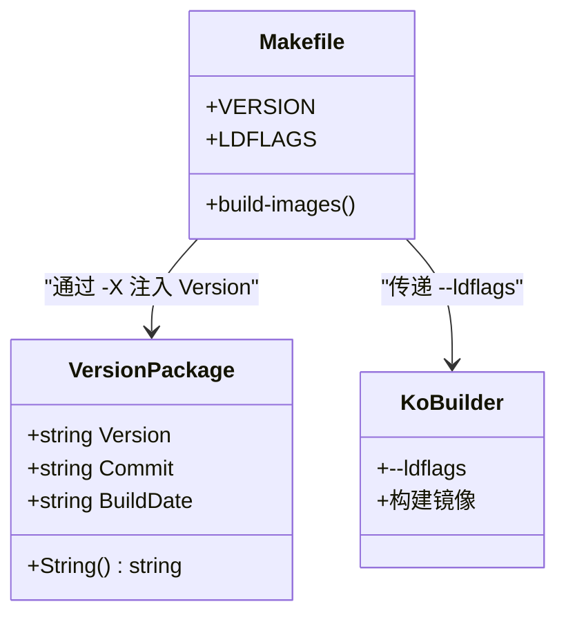
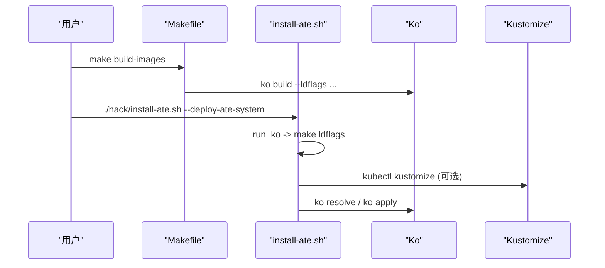
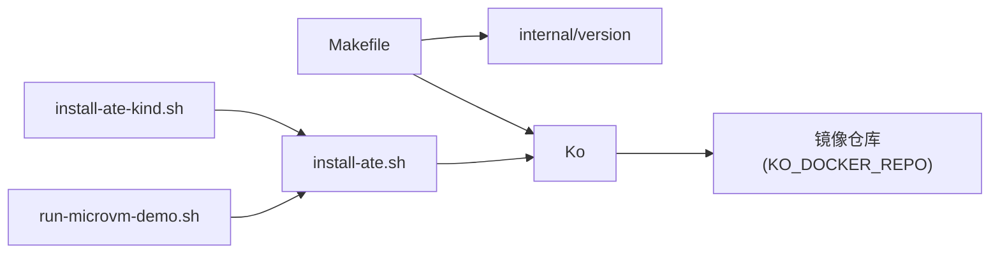

# 镜像构建与发布

<cite>
**本文引用的文件**   
- [.ko.yaml](file://.ko.yaml)
- [Makefile](file://Makefile)
- [hack/install-ate.sh](file://hack/install-ate.sh)
- [hack/ate-dev-env.sh.example](file://hack/ate-dev-env.sh.example)
- [hack/install-ate-kind.sh](file://hack/install-ate-kind.sh)
- [hack/run-microvm-demo.sh](file://hack/run-microvm-demo.sh)
- [internal/version/version.go](file://internal/version/version.go)
</cite>

## 目录
1. [简介](#简介)
2. [项目结构](#项目结构)
3. [核心组件](#核心组件)
4. [架构总览](#架构总览)
5. [详细组件分析](#详细组件分析)
6. [依赖关系分析](#依赖关系分析)
7. [性能与优化](#性能与优化)
8. [故障排除指南](#故障排除指南)
9. [结论](#结论)
10. [附录](#附录)

## 简介
本指南聚焦于使用 Ko 工具进行 Go 项目的镜像构建与发布，覆盖以下主题：
- Ko 配置与使用（.ko.yaml、环境变量、多架构构建、标签管理）
- 镜像构建流程（依赖管理、编译优化、安全扫描建议）
- 版本管理与发布策略（语义化版本、Git 标签集成、镜像推送）
- CI/CD 流水线中的镜像构建配置示例与排错要点

本项目通过 Makefile 与脚本统一封装 ko 的调用，结合 .ko.yaml 集中管理基础镜像与平台目标，并通过 ldflags 注入版本信息。

## 项目结构
与镜像构建相关的关键位置：
- 根级 Ko 配置：.ko.yaml
- 构建入口与参数：Makefile
- 安装与部署脚本（内部使用 ko apply/resolve）：hack/install-ate.sh、hack/install-ate-kind.sh、hack/run-microvm-demo.sh
- 开发环境示例变量：hack/ate-dev-env.sh.example
- 版本注入点：internal/version/version.go

图表来源
- [.ko.yaml:15-28](file://.ko.yaml#L15-L28)
- [Makefile:18-48](file://Makefile#L18-L48)
- [hack/install-ate.sh:112-133](file://hack/install-ate.sh#L112-L133)
- [hack/install-ate-kind.sh:27-32](file://hack/install-ate-kind.sh#L27-L32)
- [hack/run-microvm-demo.sh:140-154](file://hack/run-microvm-demo.sh#L140-L154)
- [hack/ate-dev-env.sh.example:38-41](file://hack/ate-dev-env.sh.example#L38-L41)
- [internal/version/version.go:27-31](file://internal/version/version.go#L27-L31)

章节来源
- [.ko.yaml:15-28](file://.ko.yaml#L15-L28)
- [Makefile:18-48](file://Makefile#L18-L48)
- [hack/install-ate.sh:112-133](file://hack/install-ate.sh#L112-L133)
- [hack/install-ate-kind.sh:27-32](file://hack/install-ate-kind.sh#L27-L32)
- [hack/run-microvm-demo.sh:140-154](file://hack/run-microvm-demo.sh#L140-L154)
- [hack/ate-dev-env.sh.example:38-41](file://hack/ate-dev-env.sh.example#L38-L41)
- [internal/version/version.go:27-31](file://internal/version/version.go#L27-L31)

## 核心组件
- Ko 配置文件 .ko.yaml
  - 默认基础镜像：gcr.io/distroless/static-debian13
  - 默认平台：linux/amd64, linux/arm64
  - 针对特定模块的基础镜像覆盖（如 demos/sandbox、demos/agent-secret 使用 alpine；cmd/ateom-microvm 使用 debian:stable-slim）
- Makefile 构建入口
  - 导出 KO_DOCKER_REPO 指向 gcr.io/<PROJECT_ID>/ate-images
  - 定义 VERSION 与 LDFLAGS，将版本号注入 internal/version.Version
  - build-images 目标使用 ko build 对多个 cmd 包进行构建
- 安装与部署脚本
  - hack/install-ate.sh 提供 run_ko 辅助函数，自动拼装 --ldflags 并转发给 ko
  - hack/install-ate-kind.sh 设置本地 Kind 环境的 KO_DOCKER_REPO 与 KO_DEFAULTPLATFORMS
  - hack/run-microvm-demo.sh 演示在 demo 场景下使用 ko apply 应用清单
- 版本注入
  - internal/version/version.go 暴露 Version/Commit/BuildDate，支持运行时从 BuildInfo 回退

章节来源
- [.ko.yaml:15-28](file://.ko.yaml#L15-L28)
- [Makefile:18-48](file://Makefile#L18-L48)
- [hack/install-ate.sh:112-133](file://hack/install-ate.sh#L112-L133)
- [hack/install-ate-kind.sh:27-32](file://hack/install-ate-kind.sh#L27-L32)
- [hack/run-microvm-demo.sh:140-154](file://hack/run-microvm-demo.sh#L140-L154)
- [internal/version/version.go:27-31](file://internal/version/version.go#L27-L31)

## 架构总览
下图展示了从源码到镜像的端到端路径，以及关键配置与环境变量的作用域。

图表来源
- [Makefile:42-48](file://Makefile#L42-L48)
- [.ko.yaml:17-19](file://.ko.yaml#L17-L19)
- [internal/version/version.go:27-31](file://internal/version/version.go#L27-L31)

## 详细组件分析

### Ko 配置与多架构构建
- 默认基础镜像与平台
  - 默认基础镜像为 distroless static-debian13，适合大多数 Go 二进制
  - 默认平台包含 amd64 与 arm64，便于跨架构分发
- 基础镜像覆盖
  - 针对部分模块（如 demos/sandbox、demos/agent-secret）指定 alpine
  - 针对 cmd/ateom-microvm 指定 debian:stable-slim，以满足 glibc 与 mount 能力需求
- 平台覆盖
  - 通过环境变量 KO_DEFAULTPLATFORMS 可覆盖 .ko.yaml 的 defaultPlatforms
  - 本地 Kind 环境通常设置为单架构以加速构建

图表来源
- [.ko.yaml:15-28](file://.ko.yaml#L15-L28)
- [hack/install-ate-kind.sh:27-32](file://hack/install-ate-kind.sh#L27-L32)
- [hack/ate-dev-env.sh.example:38-41](file://hack/ate-dev-env.sh.example#L38-L41)

章节来源
- [.ko.yaml:15-28](file://.ko.yaml#L15-L28)
- [hack/install-ate-kind.sh:27-32](file://hack/install-ate-kind.sh#L27-L32)
- [hack/ate-dev-env.sh.example:38-41](file://hack/ate-dev-env.sh.example#L38-L41)

### 版本管理与 ldflags 注入
- 版本来源
  - Makefile 通过 git describe 生成 VERSION，并构造 LDFLAGS 注入 internal/version.Version
  - internal/version/version.go 在 init 中若未显式注入 Commit/BuildDate，则回退至 runtime/debug.ReadBuildInfo()
- 构建时注入
  - ko build 与 go build 均接受 --ldflags，Makefile 统一输出 LDFLAGS 供各目标复用
- 运行期展示
  - 程序可通过 version.String() 输出“版本+提交+构建时间+OS/ARCH”的摘要

图表来源
- [Makefile:29-34](file://Makefile#L29-L34)
- [internal/version/version.go:27-31](file://internal/version/version.go#L27-L31)
- [internal/version/version.go:33-53](file://internal/version/version.go#L33-L53)

章节来源
- [Makefile:29-34](file://Makefile#L29-L34)
- [internal/version/version.go:27-31](file://internal/version/version.go#L27-L31)
- [internal/version/version.go:33-53](file://internal/version/version.go#L33-L53)

### 构建入口与部署集成
- Makefile 构建镜像
  - build-images 目标调用 ko build 对 ateapi、atelet、podcertcontroller、atenet 四个命令包进行构建
  - 同时提供 build-demos 用于构建示例
- 安装脚本集成
  - hack/install-ate.sh 的 run_ko 辅助函数会调用 make ldflags 收集 ldflags，再传递给 ko
  - 支持 kustomize 渲染后通过 ko resolve 解析镜像引用
- Kind 与 Demo 场景
  - hack/install-ate-kind.sh 设置 KO_DOCKER_REPO 与 KO_DEFAULTPLATFORMS，适配本地 Kind
  - hack/run-microvm-demo.sh 演示使用 ko apply 应用模板化的清单

图表来源
- [Makefile:42-48](file://Makefile#L42-L48)
- [hack/install-ate.sh:112-133](file://hack/install-ate.sh#L112-L133)
- [hack/install-ate.sh:147-167](file://hack/install-ate.sh#L147-L167)
- [hack/install-ate-kind.sh:27-32](file://hack/install-ate-kind.sh#L27-L32)
- [hack/run-microvm-demo.sh:140-154](file://hack/run-microvm-demo.sh#L140-L154)

章节来源
- [Makefile:42-48](file://Makefile#L42-L48)
- [hack/install-ate.sh:112-133](file://hack/install-ate.sh#L112-L133)
- [hack/install-ate.sh:147-167](file://hack/install-ate.sh#L147-L167)
- [hack/install-ate-kind.sh:27-32](file://hack/install-ate-kind.sh#L27-L32)
- [hack/run-microvm-demo.sh:140-154](file://hack/run-microvm-demo.sh#L140-L154)

### 标签管理与镜像推送
- 仓库地址
  - KO_DOCKER_REPO 决定镜像仓库前缀，Makefile 默认指向 gcr.io/<PROJECT_ID>/ate-images
- 标签策略
  - 当前仓库未强制约定标签命名规范；建议在 CI 中结合 Git 标签或提交哈希生成稳定标签（例如 v1.2.3、sha256:<digest>）
- 推送与拉取
  - 推送由 ko build 完成；拉取需确保运行环境具备对应仓库的访问权限（如 GCR 的 gcloud auth configure-docker）

章节来源
- [Makefile:18-20](file://Makefile#L18-L20)

## 依赖关系分析
- 组件耦合
  - Makefile 与 internal/version 强耦合（通过 LDFLAGS 注入）
  - install-ate.sh 与 ko 紧密集成（run_ko 统一处理 ldflags 与上下文）
  - Kind 与 Demo 脚本通过环境变量影响 ko 的行为（KO_DOCKER_REPO、KO_DEFAULTPLATFORMS）
- 外部依赖
  - 镜像仓库（GCR 等），需要认证与网络可达
  - 基础镜像（distroless、alpine、debian:stable-slim）

图表来源
- [Makefile:29-34](file://Makefile#L29-L34)
- [hack/install-ate.sh:112-133](file://hack/install-ate.sh#L112-L133)
- [hack/install-ate-kind.sh:27-32](file://hack/install-ate-kind.sh#L27-L32)
- [hack/run-microvm-demo.sh:140-154](file://hack/run-microvm-demo.sh#L140-L154)

章节来源
- [Makefile:29-34](file://Makefile#L29-L34)
- [hack/install-ate.sh:112-133](file://hack/install-ate.sh#L112-L133)
- [hack/install-ate-kind.sh:27-32](file://hack/install-ate-kind.sh#L27-L32)
- [hack/run-microvm-demo.sh:140-154](file://hack/run-microvm-demo.sh#L140-L154)

## 性能与优化
- 缓存与并行
  - 利用 Go 模块缓存与 Ko 的构建缓存提升重复构建速度
  - 在多核环境下，合理设置并发（Go 与 Ko 默认已较优）
- 基础镜像选择
  - 优先使用 distroless 减小镜像体积与安全面
  - 仅在必要时使用 alpine 或 debian:stable-slim（如需要 glibc 或系统调用）
- 构建产物瘦身
  - 通过 ldflags 去除调试符号与无用信息（可在 CI 中追加 -s -w）
- 多架构构建
  - 默认启用 amd64/arm64，CI 中建议使用构建器缓存与远端缓存加速

[本节为通用指导，不直接分析具体文件]

## 故障排除指南
- 无法登录镜像仓库
  - 现象：ko push 失败或鉴权错误
  - 排查：确认 KO_DOCKER_REPO 指向正确仓库，并完成相应认证（如 gcloud auth configure-docker）
- 平台不匹配
  - 现象：Kind 节点架构与镜像不一致导致调度失败
  - 排查：检查 KO_DEFAULTPLATFORMS 是否与节点架构一致（Kind 脚本默认设为 host arch）
- 版本未生效
  - 现象：程序版本信息仍为 dev 或 unknown
  - 排查：确认 Makefile 的 LDFLAGS 是否正确传入 ko build；internal/version 的 init 回退逻辑仅在没有显式注入时生效
- 基础镜像不可用
  - 现象：构建阶段拉取基础镜像失败
  - 排查：检查网络与镜像仓库可达性；必要时替换 baseImageOverrides 中的镜像源

章节来源
- [hack/install-ate-kind.sh:27-32](file://hack/install-ate-kind.sh#L27-L32)
- [Makefile:29-34](file://Makefile#L29-L34)
- [internal/version/version.go:33-53](file://internal/version/version.go#L33-L53)

## 结论
本项目通过 .ko.yaml 与 Makefile 实现了统一的镜像构建与版本注入，配合安装脚本将 ko 无缝集成到部署流程。推荐在 CI 中引入稳定的标签策略与安全扫描，进一步提升制品的可追溯性与安全性。

[本节为总结性内容，不直接分析具体文件]

## 附录

### 常用命令速查
- 构建镜像
  - make build-images
- 构建示例
  - make build-demos
- 本地 Kind 环境一键安装
  - hack/install-ate-kind.sh --deploy-ate-system
- 运行微虚拟机 Demo
  - hack/run-microvm-demo.sh

章节来源
- [Makefile:42-60](file://Makefile#L42-L60)
- [hack/install-ate-kind.sh:27-32](file://hack/install-ate-kind.sh#L27-L32)
- [hack/run-microvm-demo.sh:140-154](file://hack/run-microvm-demo.sh#L140-L154)
