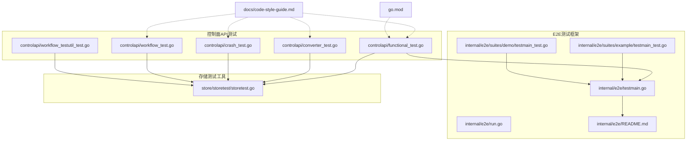
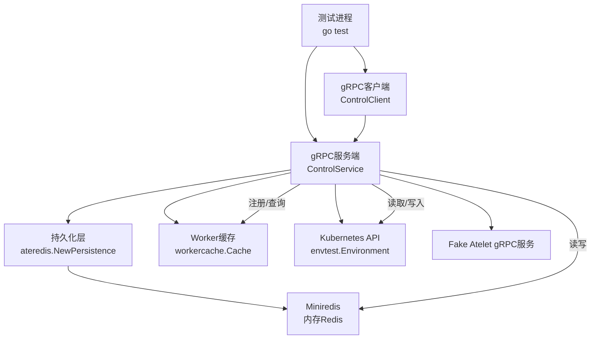
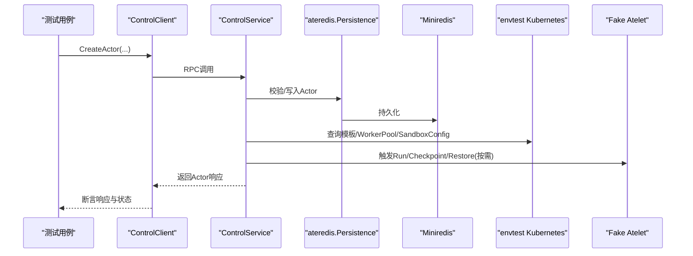
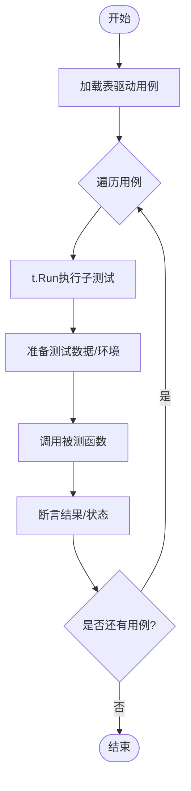
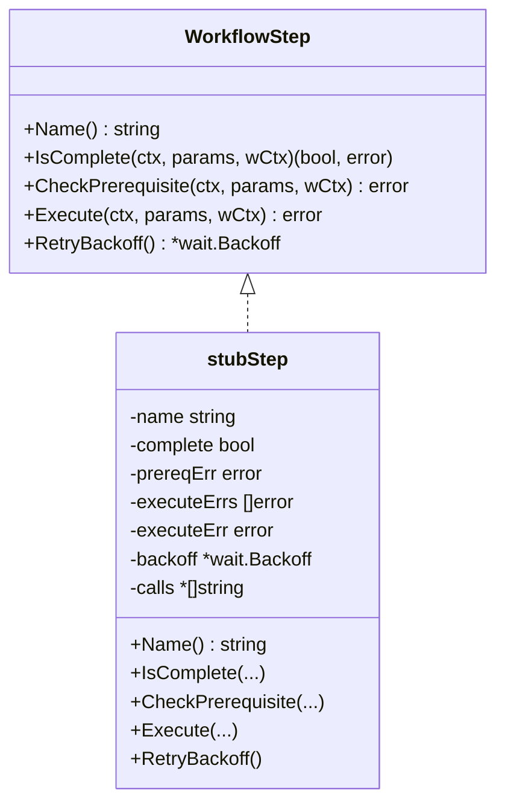
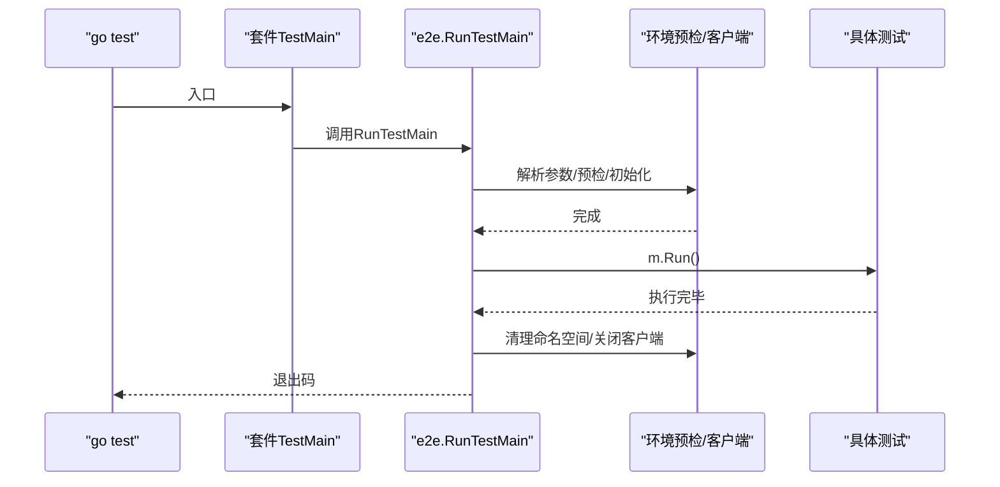
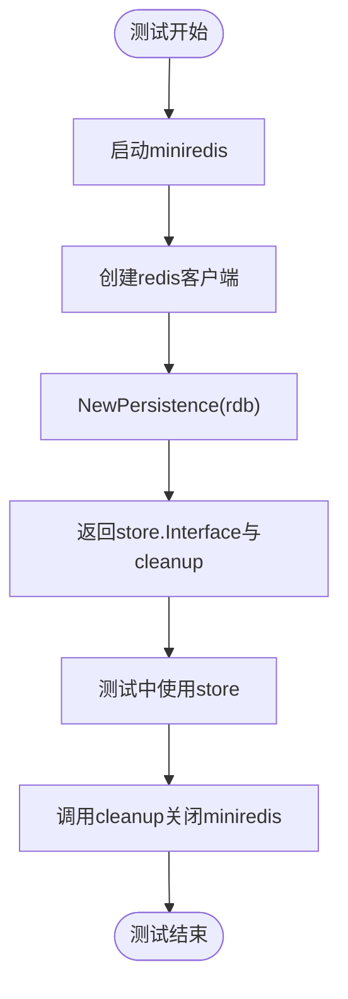
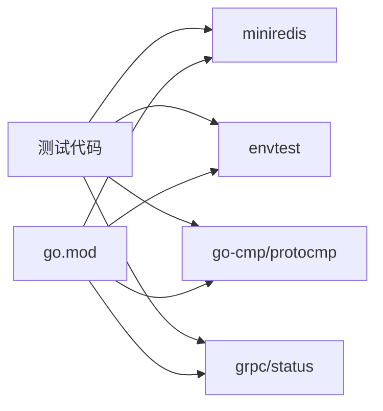

# 单元测试

<cite>
**本文引用的文件**   
- [go.mod](file://go.mod)
- [代码风格指南.md](file://docs/code-style-guide.md)
- [E2E测试说明.md](file://internal/e2e/README.md)
- [E2E测试主流程.go](file://internal/e2e/testmain.go)
- [E2E命令执行工具.go](file://internal/e2e/run.go)
- [示例套件TestMain.go](file://internal/e2e/suites/example/testmain_test.go)
- [演示套件TestMain.go](file://internal/e2e/suites/demo/testmain_test.go)
- [存储测试工具.go](file://cmd/ateapi/internal/store/storetest/storetest.go)
- [控制API功能测试.go](file://cmd/ateapi/internal/controlapi/functional_test.go)
- [转换器测试.go](file://cmd/ateapi/internal/controlapi/converter_test.go)
- [崩溃处理测试.go](file://cmd/ateapi/internal/controlapi/crash_test.go)
- [工作流测试.go](file://cmd/ateapi/internal/controlapi/workflow_test.go)
- [工作流测试工具.go](file://cmd/ateapi/internal/controlapi/workflow_testutil_test.go)
</cite>

## 目录
1. [简介](#简介)
2. [项目结构](#项目结构)
3. [核心组件](#核心组件)
4. [架构总览](#架构总览)
5. [详细组件分析](#详细组件分析)
6. [依赖分析](#依赖分析)
7. [性能考虑](#性能考虑)
8. [故障排查指南](#故障排查指南)
9. [结论](#结论)
10. [附录](#附录)

## 简介
本指南面向在该项目中编写高质量Go单元测试的工程师，结合仓库现有实践与规范，系统阐述：
- 测试用例设计原则与表驱动测试方法
- Mock对象与真实Fake的使用技巧（miniredis、envtest）
- 测试框架选择与最佳实践（仅使用标准库testing）
- API接口、控制器逻辑、数据处理函数的测试范式
- 测试数据准备、环境隔离、并发测试策略
- 覆盖率统计与报告生成的配置建议

## 项目结构
本项目遵循“按功能域组织”的结构，测试文件与源码同包或相邻包放置，便于复用测试辅助函数与共享基础设施。关键测试相关位置包括：
- 控制面API集成测试与端到端测试：cmd/ateapi/internal/controlapi/*_test.go
- E2E测试框架与套件：internal/e2e/*
- 存储层测试工具：cmd/ateapi/internal/store/storetest/*
- 代码风格与测试约定：docs/code-style-guide.md

**图示来源** 
- [控制API功能测试.go:1-120](file://cmd/ateapi/internal/controlapi/functional_test.go#L1-L120)
- [E2E测试主流程.go:1-82](file://internal/e2e/testmain.go#L1-L82)
- [E2E命令执行工具.go:45-74](file://internal/e2e/run.go#L45-L74)
- [示例套件TestMain.go:1-39](file://internal/e2e/suites/example/testmain_test.go#L1-L39)
- [演示套件TestMain.go:1-24](file://internal/e2e/suites/demo/testmain_test.go#L1-L24)
- [存储测试工具.go:1-47](file://cmd/ateapi/internal/store/storetest/storetest.go#L1-L47)
- [代码风格指南.md:36-41](file://docs/code-style-guide.md#L36-L41)
- [go.mod:1-60](file://go.mod#L1-L60)

**章节来源**
- [代码风格指南.md:36-41](file://docs/code-style-guide.md#L36-L41)
- [E2E测试说明.md:1-42](file://internal/e2e/README.md#L1-L42)
- [E2E测试主流程.go:1-82](file://internal/e2e/testmain.go#L1-L82)
- [E2E命令执行工具.go:45-74](file://internal/e2e/run.go#L45-L74)
- [示例套件TestMain.go:1-39](file://internal/e2e/suites/example/testmain_test.go#L1-L39)
- [演示套件TestMain.go:1-24](file://internal/e2e/suites/demo/testmain_test.go#L1-L24)
- [存储测试工具.go:1-47](file://cmd/ateapi/internal/store/storetest/storetest.go#L1-L47)
- [go.mod:1-60](file://go.mod#L1-L60)

## 核心组件
- 测试规范与约定
  - 仅使用标准库testing，不引入断言或Mock框架；优先采用表驱动测试与t.Run子测试；优先使用真实Fake（如miniredis、envtest），并通过t.Cleanup释放资源。
- 存储层测试工具
  - 提供基于miniredis的持久化实现，用于快速启动和清理测试数据库。
- E2E测试框架
  - 通过RunTestMain统一解析参数、预检环境与生命周期管理；默认跳过E2E，需显式传入--e2e运行。
- 控制面API测试
  - 使用envtest拉起Kubernetes API Server与CRD，配合miniredis作为后端存储，并启动真实gRPC服务进行端到端验证。

**章节来源**
- [代码风格指南.md:36-41](file://docs/code-style-guide.md#L36-L41)
- [存储测试工具.go:1-47](file://cmd/ateapi/internal/store/storetest/storetest.go#L1-L47)
- [E2E测试主流程.go:40-82](file://internal/e2e/testmain.go#L40-L82)
- [控制API功能测试.go:77-157](file://cmd/ateapi/internal/controlapi/functional_test.go#L77-L157)

## 架构总览
下图展示了控制面API测试的整体架构：测试进程启动本地Kubernetes API（envtest）、Redis（miniredis）、gRPC服务与Fake外部依赖，随后通过gRPC客户端调用被测服务，验证状态机与副作用。

**图示来源** 
- [控制API功能测试.go:77-157](file://cmd/ateapi/internal/controlapi/functional_test.go#L77-L157)
- [控制API功能测试.go:258-390](file://cmd/ateapi/internal/controlapi/functional_test.go#L258-L390)
- [控制API功能测试.go:158-241](file://cmd/ateapi/internal/controlapi/functional_test.go#L158-L241)
- [存储测试工具.go:26-47](file://cmd/ateapi/internal/store/storetest/storetest.go#L26-L47)

## 详细组件分析

### 组件A：控制面API测试（端到端）
- 目标
  - 验证Actor生命周期（创建、获取、列表、暂停、恢复、挂起、删除等）以及错误路径与边界条件。
- 关键实现要点
  - TestMain中启动envtest、创建必要命名空间与Pod、启动Fake Atelet gRPC服务、注册并启动真实Control gRPC服务。
  - setupTest为每个测试构建隔离环境：miniredis、k8s客户端、informers、worker cache、dialer、service实例、gRPC连接与客户端。
  - 使用wait.PollUntilContextTimeout等待informer缓存同步与资源就绪。
  - 使用protocmp忽略非确定性字段（uid、时间戳）进行结构化比较。
- 典型测试场景
  - 成功创建Actor、模板不存在、重复ID、分页与过滤、多池选择器、重入保护等。

**图示来源** 
- [控制API功能测试.go:692-753](file://cmd/ateapi/internal/controlapi/functional_test.go#L692-L753)
- [控制API功能测试.go:258-390](file://cmd/ateapi/internal/controlapi/functional_test.go#L258-L390)
- [控制API功能测试.go:158-241](file://cmd/ateapi/internal/controlapi/functional_test.go#L158-L241)

**章节来源**
- [控制API功能测试.go:77-157](file://cmd/ateapi/internal/controlapi/functional_test.go#L77-L157)
- [控制API功能测试.go:258-390](file://cmd/ateapi/internal/controlapi/functional_test.go#L258-L390)
- [控制API功能测试.go:692-753](file://cmd/ateapi/internal/controlapi/functional_test.go#L692-L753)

### 组件B：表驱动测试与断言
- 设计原则
  - 以struct切片定义用例，包含名称、输入、期望输出与可选检查回调；通过t.Run遍历执行。
  - 对复杂对象使用protocmp.Transform与IgnoreFields组合，屏蔽非确定性字段。
- 示例参考
  - 转换器转换枚举值的多分支覆盖。
  - 崩溃处理流程的状态变更与错误包装断言。

**图示来源** 
- [转换器测试.go:24-60](file://cmd/ateapi/internal/controlapi/converter_test.go#L24-L60)
- [崩溃处理测试.go:109-231](file://cmd/ateapi/internal/controlapi/crash_test.go#L109-L231)

**章节来源**
- [转换器测试.go:24-60](file://cmd/ateapi/internal/controlapi/converter_test.go#L24-L60)
- [崩溃处理测试.go:109-231](file://cmd/ateapi/internal/controlapi/crash_test.go#L109-L231)

### 组件C：工作流引擎与重试
- 目标
  - 验证步骤执行顺序（IsComplete -> CheckPrerequisite -> Execute）、前置条件错误传播、以及针对特定错误的可重试机制。
- 关键点
  - 使用stubStep记录调用序列与可控错误，确保幂等性与回退语义正确。
  - 当Execute返回持久化冲突错误且定义了Backoff时，仅重试Execute，不重复执行IsComplete与CheckPrerequisite。

**图示来源** 
- [工作流测试.go:29-70](file://cmd/ateapi/internal/controlapi/workflow_test.go#L29-L70)
- [工作流测试.go:130-207](file://cmd/ateapi/internal/controlapi/workflow_test.go#L130-L207)

**章节来源**
- [工作流测试.go:72-128](file://cmd/ateapi/internal/controlapi/workflow_test.go#L72-L128)
- [工作流测试.go:130-207](file://cmd/ateapi/internal/controlapi/workflow_test.go#L130-L207)
- [工作流测试工具.go:32-45](file://cmd/ateapi/internal/controlapi/workflow_testutil_test.go#L32-L45)

### 组件D：E2E测试框架与套件
- 运行方式
  - 默认跳过E2E，需要显式传入--e2e参数；支持--no-color、--kube-config、--kube-context等选项。
- 生命周期
  - RunTestMain负责绑定参数、预检环境、初始化共享客户端、清理命名空间，然后执行m.Run。
- 套件模板
  - 各套件实现TestMain，并在其中调用e2e.RunTestMain，以便统一管理。

**图示来源** 
- [E2E测试主流程.go:40-82](file://internal/e2e/testmain.go#L40-L82)
- [示例套件TestMain.go:32-39](file://internal/e2e/suites/example/testmain_test.go#L32-L39)
- [演示套件TestMain.go:24-24](file://internal/e2e/suites/demo/testmain_test.go#L24-L24)

**章节来源**
- [E2E测试说明.md:1-42](file://internal/e2e/README.md#L1-L42)
- [E2E测试主流程.go:40-82](file://internal/e2e/testmain.go#L40-L82)
- [示例套件TestMain.go:24-39](file://internal/e2e/suites/example/testmain_test.go#L24-L39)
- [演示套件TestMain.go:24-24](file://internal/e2e/suites/demo/testmain_test.go#L24-L24)

### 组件E：存储层测试工具（miniredis）
- 作用
  - 启动内存Redis服务器，返回基于真实实现的持久化接口，供单元/集成测试使用。
- 用法
  - 在测试中调用SetupTestStore获取store.Interface与cleanup函数，确保测试结束后释放资源。

**图示来源** 
- [存储测试工具.go:26-47](file://cmd/ateapi/internal/store/storetest/storetest.go#L26-L47)

**章节来源**
- [存储测试工具.go:26-47](file://cmd/ateapi/internal/store/storetest/storetest.go#L26-L47)

## 依赖分析
- 测试依赖
  - miniredis：内存Redis，用于替代真实Redis后端。
  - envtest：本地Kubernetes API Server与CRD，用于模拟K8s资源。
  - go-cmp/protocmp：结构化比较与Protobuf差异对比。
  - grpc/gRPC status：用于构造与断言gRPC错误码。
- 版本与模块
  - 所有依赖由go.mod集中管理，测试可直接引用对应包。

**图示来源** 
- [go.mod:1-60](file://go.mod#L1-L60)
- [控制API功能测试.go:29-58](file://cmd/ateapi/internal/controlapi/functional_test.go#L29-L58)

**章节来源**
- [go.mod:1-60](file://go.mod#L1-L60)
- [控制API功能测试.go:29-58](file://cmd/ateapi/internal/controlapi/functional_test.go#L29-L58)

## 性能考虑
- 避免不必要的I/O与网络调用：优先使用miniredis与envtest，减少对外部系统的依赖。
- 合理设置超时与重试：使用wait.PollUntilContextTimeout控制等待时长，避免测试长时间阻塞。
- 并行执行：利用t.Parallel与独立命名空间/端口，提高测试吞吐；注意共享资源的隔离。
- 精简日志与输出：仅在必要时打印上下文信息，降低I/O开销。

[本节为通用指导，无需列出具体文件来源]

## 故障排查指南
- 常见问题
  - E2E未运行：确认是否传入--e2e参数；查看RunTestMain中的提示信息。
  - 资源未就绪：检查informer缓存同步与WaitForCacheSync是否成功。
  - 端口占用：确保gRPC监听端口未被占用，或使用随机端口。
  - 断言失败：使用protocmp忽略非确定性字段，聚焦业务差异。
- 定位手段
  - 使用t.Logf记录关键路径信息；结合status.Code与errors.Is进行错误分类。
  - 借助Fake Atelet的请求快照与调用计数，验证交互是否符合预期。

**章节来源**
- [E2E测试主流程.go:40-82](file://internal/e2e/testmain.go#L40-L82)
- [控制API功能测试.go:158-241](file://cmd/ateapi/internal/controlapi/functional_test.go#L158-L241)

## 结论
本项目在测试方面强调“简单、真实、可维护”：
- 使用标准库testing与表驱动测试，保证可读性与扩展性
- 用miniredis与envtest替代外部依赖，提升稳定性与速度
- 通过统一的E2E框架与套件模板，规范测试生命周期与环境管理
- 借助protocmp与gRPC状态断言，精准定位问题

[本节为总结性内容，无需列出具体文件来源]

## 附录

### 如何编写高质量Go单元测试（实践清单）
- 设计原则
  - 单一职责：每个测试只验证一个行为或一条路径
  - 可重复：每次运行结果一致，避免外部状态污染
  - 可观测：失败时输出清晰的上下文信息
- 表驱动测试
  - 将用例抽象为结构体切片，包含输入、期望输出与可选检查回调
  - 使用t.Run为每个用例生成独立子测试，便于定位失败点
- Mock与Fake
  - 优先使用真实Fake（miniredis、envtest），必要时实现轻量接口Mock
  - 对gRPC服务，可通过FakeServer捕获请求与返回值
- 测试数据与环境
  - 使用临时命名空间与唯一标识，避免跨用例干扰
  - 通过setupTest封装环境初始化与清理逻辑
- 并发测试
  - 使用t.Parallel并行执行，确保资源隔离（端口、命名空间、Redis键空间）
  - 对共享状态加锁或使用原子变量，避免竞态
- 断言与比较
  - 使用protocmp.Transform与IgnoreFields进行结构化比较
  - 使用status.Code与errors.Is断言gRPC错误码与错误类型
- 覆盖率与报告
  - 使用go test -coverprofile=coverage.out收集覆盖率
  - 使用go tool cover -html=coverage.out生成HTML报告
  - 在CI中集成覆盖率阈值检查，保障质量基线

[本节为通用指导，无需列出具体文件来源]
