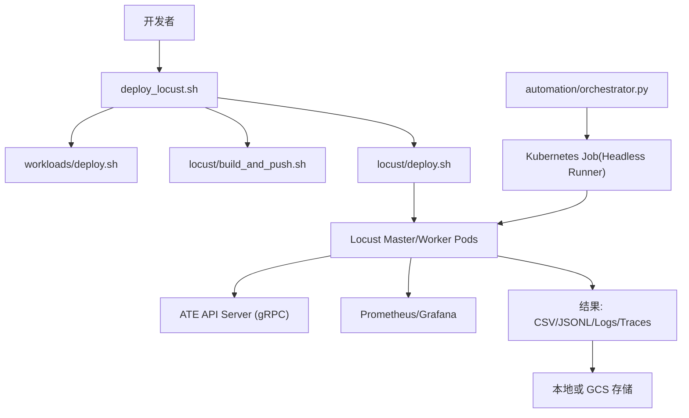
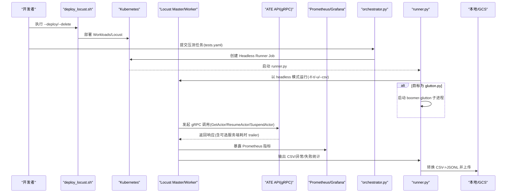
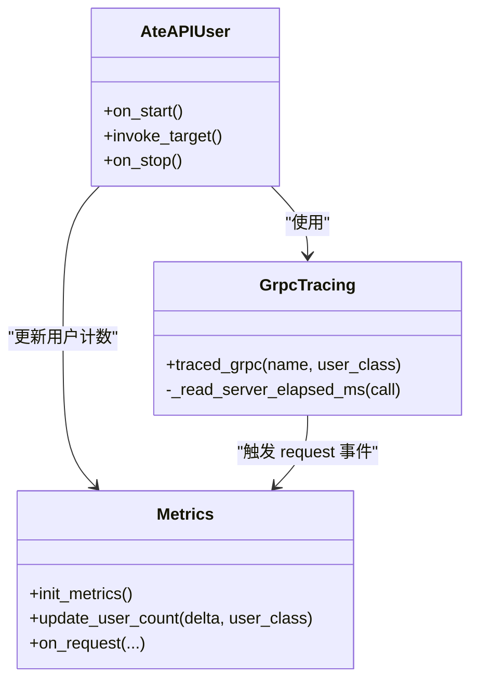
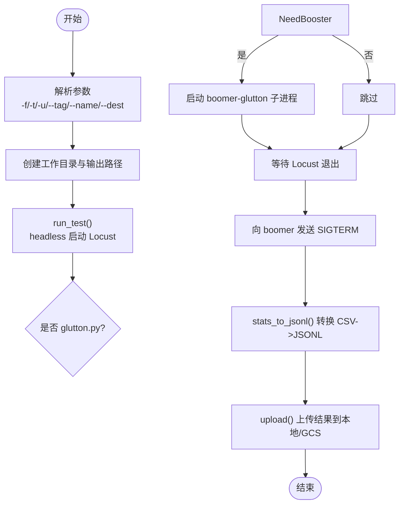
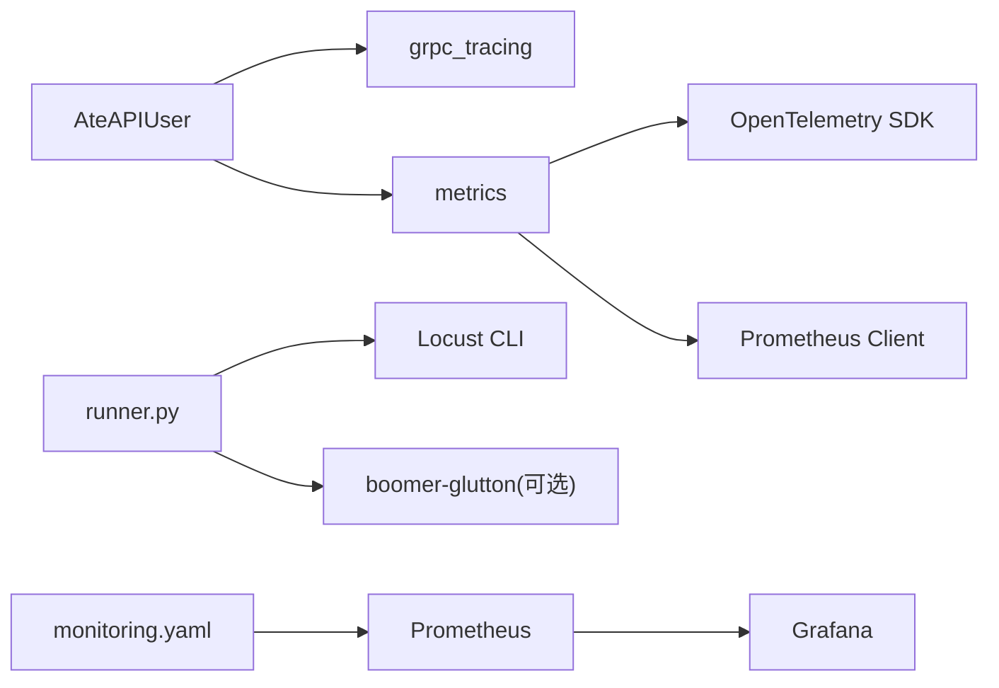

# 性能测试

<cite>
**本文引用的文件**   
- [benchmarking/README.md](file://benchmarking/README.md)
- [deploy_locust.sh](file://benchmarking/deploy_locust.sh)
- [locust/deploy.sh](file://benchmarking/locust/deploy.sh)
- [locust/runner.py](file://benchmarking/locust/runner.py)
- [locust/tests/ate_api.py](file://benchmarking/locust/tests/ate_api.py)
- [locust/common/metrics.py](file://benchmarking/locust/common/metrics.py)
- [locust/common/grpc_tracing.py](file://benchmarking/locust/common/grpc_tracing.py)
- [monitoring.yaml](file://benchmarking/monitoring.yaml)
- [automation/orchestrator.py](file://benchmarking/automation/orchestrator.py)
</cite>

## 目录
1. [简介](#简介)
2. [项目结构](#项目结构)
3. [核心组件](#核心组件)
4. [架构总览](#架构总览)
5. [详细组件分析](#详细组件分析)
6. [依赖关系分析](#依赖关系分析)
7. [性能考量](#性能考量)
8. [故障排查指南](#故障排查指南)
9. [结论](#结论)
10. [附录](#附录)

## 简介
本指南面向在 Substrate 仓库中开展性能测试的工程师，覆盖以下目标：
- 基准测试编写方法（Go 标准库 testing 包中的 B 函数使用、指标收集与分析）
- 压力测试框架 Locust 的配置与使用（负载模型定义、场景设计、监控指标配置）
- 具体性能测试示例（API 响应时间、并发处理能力、内存使用优化）
- 结果分析与解读（瓶颈识别、回归检测、容量规划建议）
- 持续集成中的性能测试集成与自动化执行

说明：
- 本仓库已提供基于 Locust 的压力测试套件与自动化编排工具；Go 侧未包含专门的 B 基准用例，但提供了通用测试组织方式与 e2e 运行入口，可作为扩展基准测试的基础。

## 项目结构
与性能测试相关的顶层目录与关键文件如下：
- benchmarking/README.md：部署与使用说明
- benchmarking/deploy_locust.sh：一键部署/删除压测环境与工作负载
- benchmarking/locust/deploy.sh：Locust 主从与工作负载的 K8s 部署脚本
- benchmarking/locust/runner.py：无头运行器，负责启动 Locust、采集 CSV/JSONL/日志/追踪并上传
- benchmarking/locust/tests/ate_api.py：针对 ATE API 的 gRPC 压测用户类
- benchmarking/locust/common/metrics.py：Prometheus/OpenTelemetry 指标初始化与请求事件上报
- benchmarking/locust/common/grpc_tracing.py：gRPC 调用链路追踪与延迟来源选择（客户端/服务端）
- benchmarking/monitoring.yaml：Grafana 仪表盘与 Prometheus 抓取配置
- benchmarking/automation/orchestrator.py：Kubernetes Job 编排器，用于 CI 中批量执行压测任务

图表来源
- [deploy_locust.sh:25-95](file://benchmarking/deploy_locust.sh#L25-L95)
- [locust/deploy.sh:43-82](file://benchmarking/locust/deploy.sh#L43-L82)
- [locust/runner.py:170-252](file://benchmarking/locust/runner.py#L170-L252)
- [monitoring.yaml:466-515](file://benchmarking/monitoring.yaml#L466-L515)

章节来源
- [benchmarking/README.md:1-90](file://benchmarking/README.md#L1-L90)
- [deploy_locust.sh:25-95](file://benchmarking/deploy_locust.sh#L25-L95)
- [locust/deploy.sh:43-82](file://benchmarking/locust/deploy.sh#L43-L82)

## 核心组件
- 部署与运行
  - deploy_locust.sh：封装 workloads 部署、镜像构建/推送、Locust 部署与删除流程
  - locust/deploy.sh：确保命名空间并渲染/应用 Locust 清单
  - automation/orchestrator.py：按 tests.yaml 生成并调度 Kubernetes Job，等待完成并拉取日志
- 压测执行与数据产出
  - runner.py：以 headless 模式运行 Locust，必要时拉起 boomer-glutton Go 子进程；将 CSV 转为 JSONL，统一输出到本地或 GCS
  - common/metrics.py：通过 OpenTelemetry + Prometheus 暴露 locust_requests_total、locust_request_duration_milliseconds、locust_users 等指标
  - common/grpc_tracing.py：为 gRPC 调用注入 W3C Trace Context，支持读取服务端耗时 trailer，优先上报服务端耗时
- 压测场景
  - tests/ate_api.py：AteAPIUser 用户类，创建 Actor、循环调用 GetActor/ResumeActor/SuspendActor，结合 wait_time 动态间隔与 tracing/metrics 上报

章节来源
- [deploy_locust.sh:25-95](file://benchmarking/deploy_locust.sh#L25-L95)
- [locust/deploy.sh:43-82](file://benchmarking/locust/deploy.sh#L43-L82)
- [automation/orchestrator.py:307-341](file://benchmarking/automation/orchestrator.py#L307-L341)
- [locust/runner.py:170-252](file://benchmarking/locust/runner.py#L170-L252)
- [locust/common/metrics.py:29-104](file://benchmarking/locust/common/metrics.py#L29-L104)
- [locust/common/grpc_tracing.py:68-123](file://benchmarking/locust/common/grpc_tracing.py#L68-L123)
- [locust/tests/ate_api.py:41-120](file://benchmarking/locust/tests/ate_api.py#L41-L120)

## 架构总览
下图展示了从 CLI 到集群内各组件的端到端压测流程，以及指标与追踪数据的流向。

图表来源
- [deploy_locust.sh:25-95](file://benchmarking/deploy_locust.sh#L25-L95)
- [locust/deploy.sh:43-82](file://benchmarking/locust/deploy.sh#L43-L82)
- [locust/runner.py:170-252](file://benchmarking/locust/runner.py#L170-L252)
- [locust/tests/ate_api.py:91-118](file://benchmarking/locust/tests/ate_api.py#L91-L118)
- [locust/common/grpc_tracing.py:68-123](file://benchmarking/locust/common/grpc_tracing.py#L68-L123)
- [locust/common/metrics.py:29-104](file://benchmarking/locust/common/metrics.py#L29-L104)
- [automation/orchestrator.py:311-337](file://benchmarking/automation/orchestrator.py#L311-L337)

## 详细组件分析

### Locust 压测用户与指标上报
- 用户类 AteAPIUser
  - on_start：建立 gRPC 安全通道、确保 atespace、创建 Actor
  - task：循环调用 GetActor/ResumeActor/SuspendActor，并通过 traced_grpc 包装
  - on_stop：更新活跃用户数、挂起 Actor、关闭通道
- 指标与追踪
  - metrics.init_metrics：启动 Prometheus HTTP 服务，注册计数器、直方图、上下计数器
  - grpc_tracing.traced_grpc：注入 W3C Trace Context，优先读取服务端耗时 trailer，上报 locust request 事件
  - metrics.on_request：监听 request 事件，写入 locust_requests_total、locust_request_duration_milliseconds、locust_users

图表来源
- [locust/tests/ate_api.py:41-120](file://benchmarking/locust/tests/ate_api.py#L41-L120)
- [locust/common/metrics.py:29-104](file://benchmarking/locust/common/metrics.py#L29-L104)
- [locust/common/grpc_tracing.py:68-123](file://benchmarking/locust/common/grpc_tracing.py#L68-L123)

章节来源
- [locust/tests/ate_api.py:41-120](file://benchmarking/locust/tests/ate_api.py#L41-L120)
- [locust/common/metrics.py:29-104](file://benchmarking/locust/common/metrics.py#L29-L104)
- [locust/common/grpc_tracing.py:68-123](file://benchmarking/locust/common/grpc_tracing.py#L68-L123)

### Headless Runner 与结果导出
- runner.main
  - 解析参数（-f/-t/-u/--tag/--name/--dest），准备工作目录与输出路径
  - run_test：以 headless 模式启动 Locust，必要时拉起 boomer-glutton；转发日志并抽取 trace 记录
  - stats_to_jsonl：将 Locust CSV 转换为结构化 JSONL，便于后续分析
  - upload：将 status/logs/traces/stats.csv/exceptions/failures 等上传至本地或 GCS
- 关键行为
  - 当测试目标为 glutton.py 时，启用 master 模式并等待一个 worker（boomer-glutton）连接
  - 对 boomer 进程优雅停止（SIGTERM），超时则 kill

图表来源
- [locust/runner.py:307-393](file://benchmarking/locust/runner.py#L307-L393)
- [locust/runner.py:170-252](file://benchmarking/locust/runner.py#L170-L252)
- [locust/runner.py:255-285](file://benchmarking/locust/runner.py#L255-L285)

章节来源
- [locust/runner.py:170-252](file://benchmarking/locust/runner.py#L170-L252)
- [locust/runner.py:255-285](file://benchmarking/locust/runner.py#L255-L285)
- [locust/runner.py:307-393](file://benchmarking/locust/runner.py#L307-L393)

### 监控与可视化
- monitoring.yaml
  - 内置 Grafana 仪表盘，展示 QPS、P99 延迟、活跃用户等
  - 通过 Prometheus 抓取 Locust 暴露的指标
- 常用指标
  - locust_requests_total：按 method/name/status/user_class 维度聚合的请求总数
  - locust_request_duration_milliseconds_bucket：请求延迟分布（用于计算分位数）
  - locust_users：当前活跃用户数（按 user_class 维度）

章节来源
- [monitoring.yaml:466-515](file://benchmarking/monitoring.yaml#L466-L515)
- [locust/common/metrics.py:46-64](file://benchmarking/locust/common/metrics.py#L46-L64)

### 自动化编排与 CI 集成
- orchestrator.run_test
  - 根据 tests.yaml 中的 name/file/duration/users 等字段渲染 Job 模板
  - 提交 Job 后等待完成，拉取最近日志并清理 Job
  - 支持将结果输出到 GCS 或本地路径，便于后续对比与归档
- 典型用法
  - 在 CI 中调用 orchestrator.py，传入 image/tag/dest，批量执行多组压测任务

章节来源
- [automation/orchestrator.py:311-337](file://benchmarking/automation/orchestrator.py#L311-L337)

## 依赖关系分析
- 组件耦合
  - AteAPIUser 依赖 metrics 与 grpc_tracing 进行指标与追踪上报
  - runner.py 依赖 Locust 命令行与可选的 boomer-glutton 二进制
  - metrics.py 依赖 OpenTelemetry SDK 与 Prometheus 客户端
  - monitoring.yaml 依赖 Prometheus 抓取 Locust Pod 的 /metrics
- 外部依赖
  - gRPC 客户端与服务端通信
  - Kubernetes 资源（Deployment/Service/Job）
  - 可选 GCS 作为结果持久化后端

图表来源
- [locust/tests/ate_api.py:41-120](file://benchmarking/locust/tests/ate_api.py#L41-L120)
- [locust/common/grpc_tracing.py:68-123](file://benchmarking/locust/common/grpc_tracing.py#L68-L123)
- [locust/common/metrics.py:29-104](file://benchmarking/locust/common/metrics.py#L29-L104)
- [locust/runner.py:170-252](file://benchmarking/locust/runner.py#L170-L252)
- [monitoring.yaml:466-515](file://benchmarking/monitoring.yaml#L466-L515)

## 性能考量
- 指标口径
  - 优先采用服务端耗时（若存在 x-server-elapsed-us trailer），否则回退到客户端测量
  - 使用 histogram 计算 P50/P90/P99 等分位延迟
- 并发与吞吐
  - 通过 users 与 spawn_rate 控制并发规模；观察 QPS 与延迟拐点
- 资源利用
  - 关注 CPU/内存/网络 IO 与数据库/对象存储的吞吐与延迟
- 稳定性
  - 关注错误率、重试与超时；结合异常与失败 CSV 定位问题
- 可观测性
  - 结合 Trace ID 与分布式追踪系统，定位慢调用链路与热点

[本节为通用指导，不直接分析具体文件]

## 故障排查指南
- 无法访问 Locust Web UI
  - 确认已在 benchmarking 命名空间下部署，并使用 kubectl port-forward 暴露端口
- 指标缺失或为 0
  - 检查 metrics.init_metrics 是否被调用；确认 Prometheus 抓取成功
- 延迟偏高且波动大
  - 核查是否使用了服务端耗时；检查 gevent 调度与 I/O 阻塞点
- 结果未上传
  - 检查 dest 是否为 gs:// 或本地路径；确认权限与网络连通性
- 压测任务长时间未完成
  - 查看 orchestrator 打印的 Job 日志；确认 timeout 设置合理

章节来源
- [benchmarking/README.md:45-79](file://benchmarking/README.md#L45-L79)
- [locust/common/metrics.py:29-64](file://benchmarking/locust/common/metrics.py#L29-L64)
- [locust/common/grpc_tracing.py:68-123](file://benchmarking/locust/common/grpc_tracing.py#L68-L123)
- [locust/runner.py:307-393](file://benchmarking/locust/runner.py#L307-L393)
- [automation/orchestrator.py:311-337](file://benchmarking/automation/orchestrator.py#L311-L337)

## 结论
本仓库提供了完整的 Locust 压测基础设施与自动化编排能力，能够覆盖 API 响应时间、并发处理与资源利用率等多维度的性能评估。通过统一的指标与追踪体系，配合 Prometheus/Grafana 可视化与 JSONL 结果归档，可实现高效的瓶颈定位、回归检测与容量规划。建议在 CI 中常态化执行关键场景的压测任务，形成基线并持续演进。

[本节为总结性内容，不直接分析具体文件]

## 附录

### 一、如何编写 Go 基准测试（Bench 函数）
- 基本步骤
  - 在 _test.go 文件中定义 BenchmarkXxx(b *testing.B) 函数
  - 在 b.N 循环中执行被测逻辑，避免额外开销
  - 使用 b.ReportAllocs() 报告内存分配情况
  - 使用 b.RunParallel 或并行 goroutine 模拟并发
- 指标收集与分析
  - go test -bench=. -benchmem 输出平均耗时与每操作分配次数
  - 使用 pprof 分析 CPU/内存热点
- 在本仓库中的实践建议
  - 参考现有测试组织方式（如 internal/e2e/suites/example/testmain_test.go 的 TestMain 组织），在需要时引入基准测试
  - 对于涉及网络/IO 的基准，建议使用固定数据集与隔离环境，减少噪声

章节来源
- [internal/e2e/suites/example/testmain_test.go:32-39](file://internal/e2e/suites/example/testmain_test.go#L32-L39)

### 二、Locust 配置与使用要点
- 部署
  - 使用 benchmarking/deploy_locust.sh --deploy 一键部署工作负载与 Locust
  - 使用 --worker-count N 控制 WorkerPool 副本数
- 运行
  - 通过 Web UI 选择用户类（如 AteAPIUser）、设置用户数与持续时间
  - 或通过 orchestrator.py 在 CI 中以 headless 模式批量执行
- 监控
  - 安装 monitoring.yaml 后可在 Grafana 查看 QPS、P99 延迟与活跃用户
- 结果
  - runner.py 会输出 logs.txt、traces.txt、stats.csv、stats.jsonl 等，并可上传到 GCS

章节来源
- [benchmarking/README.md:1-90](file://benchmarking/README.md#L1-L90)
- [deploy_locust.sh:25-95](file://benchmarking/deploy_locust.sh#L25-L95)
- [locust/deploy.sh:43-82](file://benchmarking/locust/deploy.sh#L43-L82)
- [locust/runner.py:307-393](file://benchmarking/locust/runner.py#L307-L393)
- [monitoring.yaml:466-515](file://benchmarking/monitoring.yaml#L466-L515)

### 三、典型性能测试示例
- API 响应时间测试
  - 使用 AteAPIUser 的 invoke_target 循环调用 GetActor/ResumeActor/SuspendActor
  - 通过 traces.txt 与 Grafana 面板观察 P99 延迟
- 并发处理能力测试
  - 调整 users/spawn_rate，观察 QPS 与延迟拐点，识别系统饱和点
- 内存使用优化测试
  - 结合 pprof 与 Prometheus 的内存指标，定位高分配热点并进行优化

章节来源
- [locust/tests/ate_api.py:91-118](file://benchmarking/locust/tests/ate_api.py#L91-L118)
- [locust/common/grpc_tracing.py:68-123](file://benchmarking/locust/common/grpc_tracing.py#L68-L123)
- [monitoring.yaml:466-515](file://benchmarking/monitoring.yaml#L466-L515)

### 四、结果分析与解读方法
- 瓶颈识别
  - 关注延迟分位上升与错误率升高同时出现的阶段，结合 trace 定位慢调用
- 性能回归检测
  - 以 JSONL 结果为输入，比较不同 commit 的 P99/QPS/错误率变化
- 容量规划建议
  - 基于吞吐-延迟曲线确定扩容阈值；结合资源利用率制定扩缩容策略

章节来源
- [locust/runner.py:255-285](file://benchmarking/locust/runner.py#L255-L285)
- [monitoring.yaml:466-515](file://benchmarking/monitoring.yaml#L466-L515)

### 五、持续集成中的性能测试集成
- 使用 orchestrator.py 在 CI 中批量执行 tests.yaml 定义的压测任务
- 将结果输出到 GCS，便于历史对比与看板展示
- 在 PR 合并前自动运行关键场景，阻断明显回归

章节来源
- [automation/orchestrator.py:311-337](file://benchmarking/automation/orchestrator.py#L311-L337)
