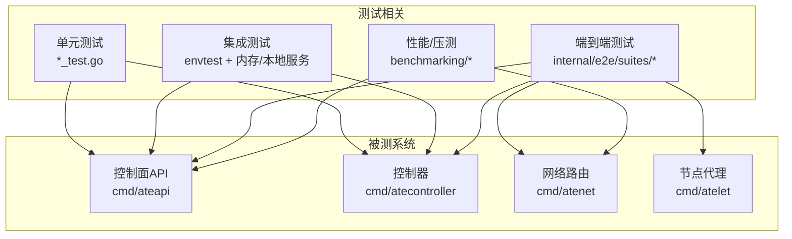
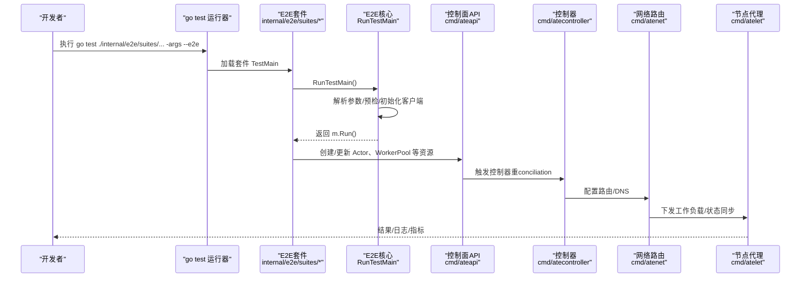
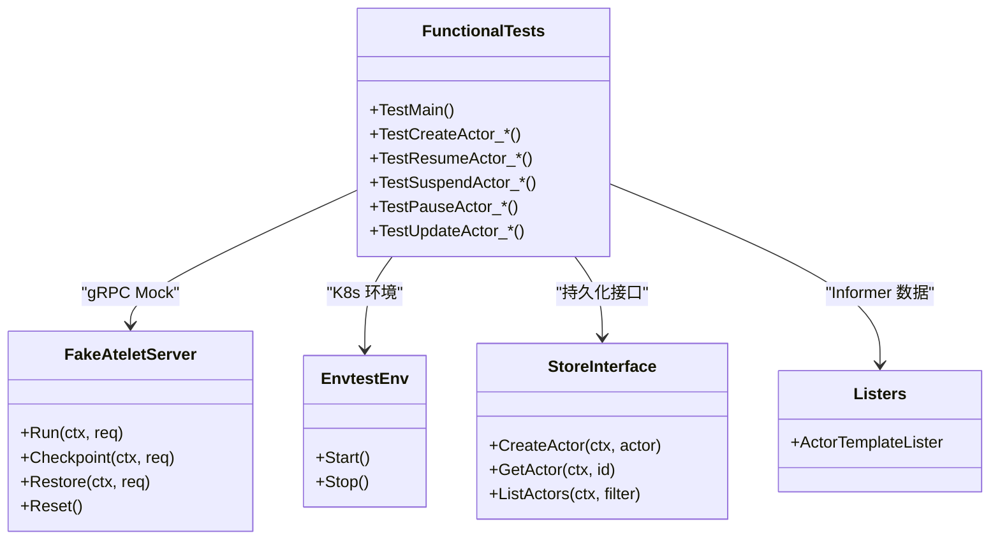
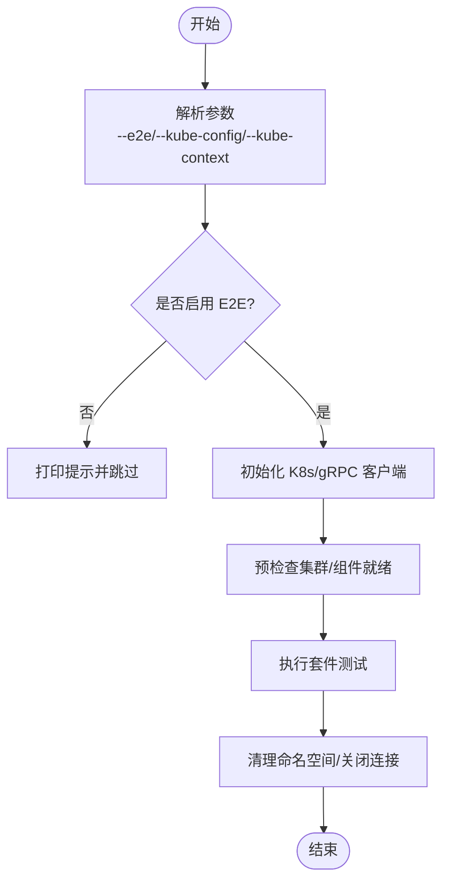
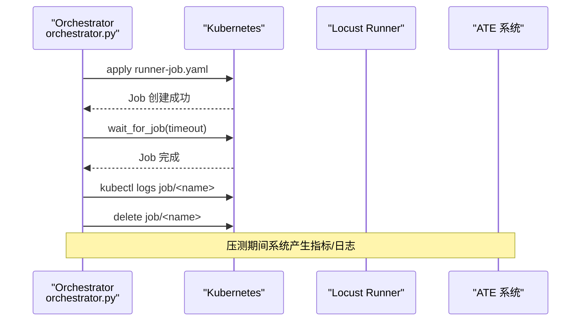
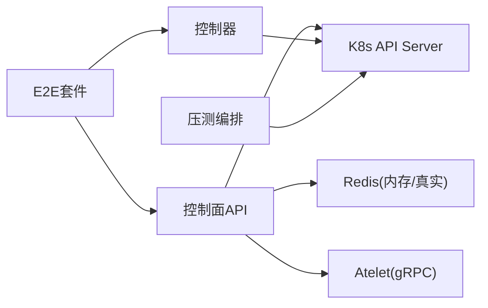

# 测试策略与实践

<cite>
**本文引用的文件**
- [README.md](file://README.md)
- [internal/e2e/README.md](file://internal/e2e/README.md)
- [internal/e2e/testmain.go](file://internal/e2e/testmain.go)
- [internal/e2e/env.go](file://internal/e2e/env.go)
- [internal/e2e/suites/example/testmain_test.go](file://internal/e2e/suites/example/testmain_test.go)
- [internal/e2e/suites/demo/testmain_test.go](file://internal/e2e/suites/demo/testmain_test.go)
- [cmd/ateapi/internal/controlapi/functional_test.go](file://cmd/ateapi/internal/controlapi/functional_test.go)
- [cmd/ateapi/internal/controlapi/workflow_testutil_test.go](file://cmd/ateapi/internal/controlapi/workflow_testutil_test.go)
- [benchmarking/automation/orchestrator.py](file://benchmarking/automation/orchestrator.py)
</cite>

## 目录
1. [引言](#引言)
2. [项目结构](#项目结构)
3. [核心组件](#核心组件)
4. [架构总览](#架构总览)
5. [详细组件分析](#详细组件分析)
6. [依赖分析](#依赖分析)
7. [性能考虑](#性能考虑)
8. [故障排查指南](#故障排查指南)
9. [结论](#结论)
10. [附录](#附录)

## 引言
本文件面向 Agent Substrate 项目的测试策略与最佳实践，覆盖单元测试、集成测试、端到端（E2E）测试、性能与压力测试以及覆盖率要求与报告生成。文档基于仓库现有实现进行提炼，提供可操作的流程、示例路径与可视化图示，帮助开发者快速建立稳定、可维护的测试体系。

## 项目结构
仓库采用多组件、分层组织方式：
- 控制面与服务：cmd/... 下包含 ateapi、atecontroller、atenet、atelet 等组件
- 公共库与协议：pkg/... 与 internal/proto/...
- E2E 测试框架：internal/e2e/...
- 基准与压测：benchmarking/...
- 安装与演示：manifests/...、demos/...

[此图为概念性结构图，不直接映射具体源码文件]

## 核心组件
- E2E 测试入口与生命周期管理：通过 e2e.RunTestMain 统一解析参数、执行预检、初始化客户端并清理命名空间。
- 单元测试与集成测试：使用 envtest 启动真实 etcd/apiserver，结合内存存储或本地 gRPC Fake 服务验证控制面逻辑。
- 性能与压力测试：基于 Locust 与自动化编排脚本在集群中运行负载场景，收集指标与日志。

章节来源
- [internal/e2e/README.md:1-42](file://internal/e2e/README.md#L1-L42)
- [internal/e2e/testmain.go:1-83](file://internal/e2e/testmain.go#L1-L83)
- [cmd/ateapi/internal/controlapi/functional_test.go:77-157](file://cmd/ateapi/internal/controlapi/functional_test.go#L77-L157)
- [benchmarking/automation/orchestrator.py:307-341](file://benchmarking/automation/orchestrator.py#L307-L341)

## 架构总览
下图展示了从测试驱动到被测系统的调用关系与数据流，包括 E2E 套件、控制面 API、控制器、网络路由与节点代理。

图表来源
- [internal/e2e/testmain.go:40-83](file://internal/e2e/testmain.go#L40-L83)
- [internal/e2e/suites/example/testmain_test.go:32-39](file://internal/e2e/suites/example/testmain_test.go#L32-L39)
- [internal/e2e/suites/demo/testmain_test.go:23-24](file://internal/e2e/suites/demo/testmain_test.go#L23-L24)

章节来源
- [internal/e2e/testmain.go:1-83](file://internal/e2e/testmain.go#L1-L83)
- [internal/e2e/suites/example/testmain_test.go:1-39](file://internal/e2e/suites/example/testmain_test.go#L1-L39)
- [internal/e2e/suites/demo/testmain_test.go:1-24](file://internal/e2e/suites/demo/testmain_test.go#L1-L24)

## 详细组件分析

### 单元测试与集成测试
- 目标：以最小外部依赖验证业务逻辑，确保 API 行为、错误码、状态机转换正确。
- 关键模式：
  - 使用 envtest 启动 apiserver 与 etcd，注入 CRD，构造 K8s 资源。
  - 使用内存 Redis 或本地 Fake gRPC 服务替代真实后端。
  - 使用 listers/indexer 模拟 informer 数据源。
  - 使用 protocmp/cmp 比较 protobuf 与结构体差异。
- 示例路径：
  - 控制面功能测试：[functional_test.go](file://cmd/ateapi/internal/controlapi/functional_test.go)
  - 工作流工具与断言：[workflow_testutil_test.go](file://cmd/ateapi/internal/controlapi/workflow_testutil_test.go)

图表来源
- [cmd/ateapi/internal/controlapi/functional_test.go:77-157](file://cmd/ateapi/internal/controlapi/functional_test.go#L77-L157)
- [cmd/ateapi/internal/controlapi/workflow_testutil_test.go:32-45](file://cmd/ateapi/internal/controlapi/workflow_testutil_test.go#L32-L45)

章节来源
- [cmd/ateapi/internal/controlapi/functional_test.go:77-157](file://cmd/ateapi/internal/controlapi/functional_test.go#L77-L157)
- [cmd/ateapi/internal/controlapi/workflow_testutil_test.go:1-100](file://cmd/ateapi/internal/controlapi/workflow_testutil_test.go#L1-L100)

#### 单元测试编写方法与最佳实践
- 用例设计
  - 正向路径：成功创建/恢复/暂停/更新 Actor，校验响应与状态。
  - 异常路径：模板不存在、重复创建、无可用 Worker、选择器不匹配等。
  - 边界条件：分页大小校验、并发重入、超时与重试。
- Mock 对象
  - 使用 FakeAteletServer 模拟 ateletpb.WorkersServer，记录调用与延迟。
  - 使用内存 store.Interface 与 indexer/listers 隔离外部依赖。
- 测试数据准备
  - 在 TestMain 中创建 ate-system 命名空间、共享 Pod、CRD 与必要资源。
  - 使用 seedWorkflowActor 等辅助函数批量播种数据。
- 断言与对比
  - 使用 protocmp.IgnoreFields 忽略 uid/version/timestamp 等非确定性字段。
  - 使用 status.Code 与 codes.FailedPrecondition 校验错误语义。

章节来源
- [cmd/ateapi/internal/controlapi/functional_test.go:77-157](file://cmd/ateapi/internal/controlapi/functional_test.go#L77-L157)
- [cmd/ateapi/internal/controlapi/workflow_testutil_test.go:47-100](file://cmd/ateapi/internal/controlapi/workflow_testutil_test.go#L47-L100)

### 端到端（E2E）测试
- 原则与约定
  - 使用 go test 作为测试框架；套件位于 internal/e2e/suites/<suite>。
  - 每个套件实现 TestMain 并通过 e2e.RunTestMain 统一处理参数与生命周期。
  - 默认跳过 E2E，需显式传入 --e2e 标志。
- 前置条件
  - 需要已部署 Agent Substrate 的集群（如通过 hack/install-ate.sh 或 kind）。
- 新套件创建
  - 复制 example 套件的 testmain_test.go 模板，实现 Setup/Teardown 并调用 e2e.RunTestMain。

图表来源
- [internal/e2e/testmain.go:33-83](file://internal/e2e/testmain.go#L33-L83)

章节来源
- [internal/e2e/README.md:1-42](file://internal/e2e/README.md#L1-L42)
- [internal/e2e/testmain.go:1-83](file://internal/e2e/testmain.go#L1-L83)
- [internal/e2e/suites/example/testmain_test.go:1-39](file://internal/e2e/suites/example/testmain_test.go#L1-L39)
- [internal/e2e/suites/demo/testmain_test.go:1-24](file://internal/e2e/suites/demo/testmain_test.go#L1-L24)

#### E2E 环境搭建与执行
- 本地开发环境
  - 参考 README 中的 Quickstart，使用 hack/create-kind-cluster.sh 与 install-ate-kind.sh 部署系统。
- 执行命令
  - 进入仓库根目录，source .ate-dev-env.sh 后执行：go test -v ./internal/e2e/suites/... -args --e2e
- 环境变量校验
  - 使用 e2e.CheckEnv 校验必需的环境变量，未设置则报错退出。

章节来源
- [README.md:97-128](file://README.md#L97-L128)
- [internal/e2e/README.md:1-42](file://internal/e2e/README.md#L1-L42)
- [internal/e2e/env.go:22-34](file://internal/e2e/env.go#L22-L34)

### 性能测试与压力测试
- 框架与工具
  - Locust 作为压测引擎，Python 脚本定义用户行为与流量形状。
  - 自动化编排 orchestrator.py 负责提交 Job、等待完成、拉取日志与清理。
- 典型流程
  - 构建镜像并推送到集群可用镜像仓库。
  - 渲染 runner-job.yaml.tmpl 并提交至指定命名空间。
  - 等待 Job 完成，收集日志与指标，删除 Job。
- 监控与指标
  - 配套 Prometheus/Grafana 仪表板用于观测延迟与吞吐。

图表来源
- [benchmarking/automation/orchestrator.py:307-341](file://benchmarking/automation/orchestrator.py#L307-L341)

章节来源
- [benchmarking/automation/orchestrator.py:307-341](file://benchmarking/automation/orchestrator.py#L307-L341)

## 依赖分析
- 组件耦合
  - 控制面 API 依赖 K8s 资源、Redis 缓存、Atelet gRPC 服务。
  - 控制器监听 CRD 变更并协调网络与运行时。
  - E2E 套件依赖 K8s 客户端与 ATE 系统组件。
- 外部依赖
  - envtest 提供 apiserver/etcd 二进制。
  - miniredis 提供内存 Redis 用于缓存层测试。
  - Go gRPC 与 Protobuf 用于服务间通信。

[此图为概念性依赖图，不直接映射具体源码文件]

章节来源
- [cmd/ateapi/internal/controlapi/functional_test.go:77-157](file://cmd/ateapi/internal/controlapi/functional_test.go#L77-L157)
- [internal/e2e/testmain.go:61-83](file://internal/e2e/testmain.go#L61-L83)

## 性能考虑
- 基准测试建议
  - 针对热点路径（如 Actor 创建/恢复）编写基准，关注 P95/P99 延迟与吞吐。
  - 使用固定数据集与预热阶段，避免冷启动影响。
- 指标采集与分析
  - 利用 Prometheus 导出指标，Grafana 展示趋势。
  - 对压测结果进行回归分析，识别退化点。
- 优化方向
  - 减少不必要的序列化/反序列化。
  - 合理设置超时与重试，避免雪崩。
  - 使用连接池与缓存命中提升稳定性。

[本节为通用指导，无需特定文件引用]

## 故障排查指南
- E2E 失败常见原因
  - 未传入 --e2e 导致套件被跳过。
  - kubeconfig/kube-context 未正确设置。
  - 集群未安装 ATE 系统或组件未就绪。
- 定位步骤
  - 检查 RunTestMain 的预检输出与颜色化提示。
  - 查看 Job 日志与命名空间资源状态。
  - 确认环境变量是否齐全（CheckEnv）。
- 单元测试失败
  - 核对 envtest 二进制路径与 CRD 目录。
  - 检查 FakeAteletServer 的状态重置与断言。

章节来源
- [internal/e2e/testmain.go:40-83](file://internal/e2e/testmain.go#L40-L83)
- [internal/e2e/env.go:22-34](file://internal/e2e/env.go#L22-L34)
- [cmd/ateapi/internal/controlapi/functional_test.go:77-157](file://cmd/ateapi/internal/controlapi/functional_test.go#L77-L157)

## 结论
本项目已形成清晰的测试分层：单元测试聚焦逻辑正确性，集成测试验证组件交互，E2E 测试覆盖端到端流程，性能与压测保障规模与稳定性。遵循本文策略与示例路径，可显著提升代码质量与交付效率。

[本节为总结性内容，无需特定文件引用]

## 附录
- 快速参考
  - 运行 E2E：参考 internal/e2e/README.md 的命令与原则。
  - 新增套件：复制 suites/example/testmain_test.go 模板。
  - 压测编排：参考 benchmarking/automation/orchestrator.py 的 Job 提交流程。

章节来源
- [internal/e2e/README.md:1-42](file://internal/e2e/README.md#L1-L42)
- [internal/e2e/suites/example/testmain_test.go:1-39](file://internal/e2e/suites/example/testmain_test.go#L1-L39)
- [benchmarking/automation/orchestrator.py:307-341](file://benchmarking/automation/orchestrator.py#L307-L341)
