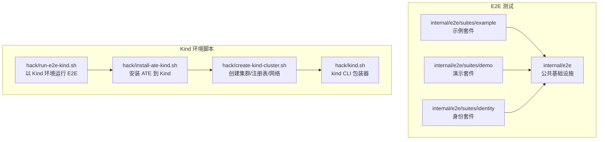
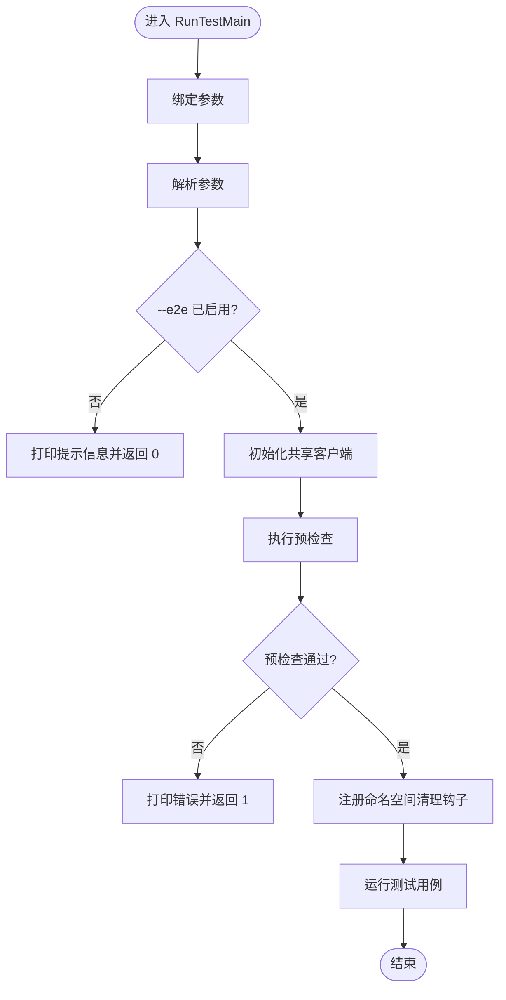
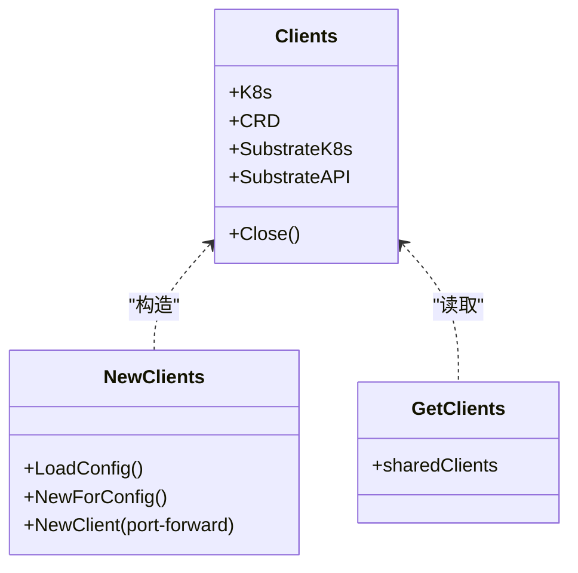
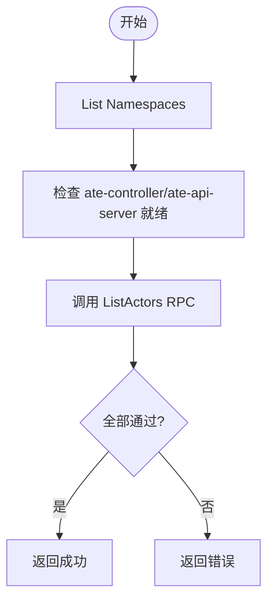
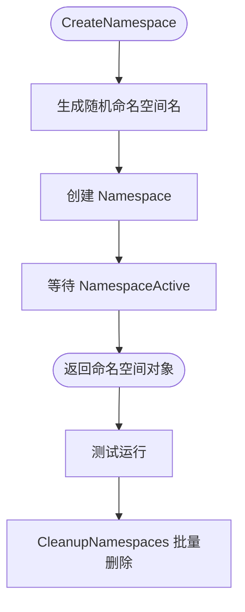
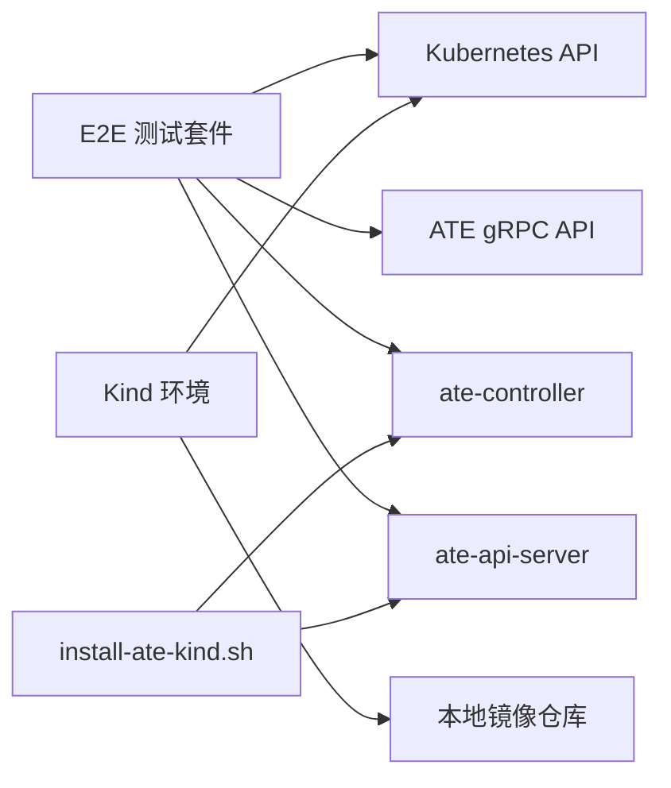

# 端到端测试

<cite>
**本文引用的文件**   
- [internal/e2e/README.md](file://internal/e2e/README.md)
- [internal/e2e/testmain.go](file://internal/e2e/testmain.go)
- [internal/e2e/run.go](file://internal/e2e/run.go)
- [internal/e2e/clients.go](file://internal/e2e/clients.go)
- [internal/e2e/env.go](file://internal/e2e/env.go)
- [internal/e2e/preflight.go](file://internal/e2e/preflight.go)
- [internal/e2e/namespace.go](file://internal/e2e/namespace.go)
- [internal/e2e/suites/example/testmain_test.go](file://internal/e2e/suites/example/testmain_test.go)
- [internal/e2e/suites/example/example_test.go](file://internal/e2e/suites/example/example_test.go)
- [hack/install-ate-kind.sh](file://hack/install-ate-kind.sh)
- [hack/run-e2e-kind.sh](file://hack/run-e2e-kind.sh)
- [hack/create-kind-cluster.sh](file://hack/create-kind-cluster.sh)
- [hack/kind.sh](file://hack/kind.sh)
</cite>

## 目录
1. [简介](#简介)
2. [项目结构](#项目结构)
3. [核心组件](#核心组件)
4. [架构总览](#架构总览)
5. [详细组件分析](#详细组件分析)
6. [依赖分析](#依赖分析)
7. [性能考虑](#性能考虑)
8. [故障排查指南](#故障排查指南)
9. [结论](#结论)
10. [附录](#附录)

## 简介
本文件面向希望在本地或 CI 环境中运行 Agent Substrate 的端到端（E2E）测试的工程师，系统性说明 E2E 测试框架的设计与实现、基于 Kind 的测试环境搭建、测试数据准备与管理、典型测试场景示例、执行流程与结果收集报告机制，以及并行执行、失败重试与故障恢复的实现方法。文档同时提供代码级架构图与流程图，帮助读者快速理解并扩展测试套件。

## 项目结构
E2E 测试采用“按套件组织”的结构：每个功能域对应一个 suites/<suite> 目录，内部包含 TestMain 模板与实际用例。公共基础设施位于 internal/e2e 包中，负责参数解析、客户端初始化、预检查、命名空间生命周期管理、命令执行封装等。



图表来源
- [internal/e2e/README.md:1-42](file://internal/e2e/README.md#L1-L42)
- [hack/create-kind-cluster.sh:1-139](file://hack/create-kind-cluster.sh#L1-L139)
- [hack/install-ate-kind.sh:1-39](file://hack/install-ate-kind.sh#L1-L39)
- [hack/run-e2e-kind.sh:1-42](file://hack/run-e2e-kind.sh#L1-L42)
- [hack/kind.sh:1-21](file://hack/kind.sh#L1-L21)

章节来源
- [internal/e2e/README.md:1-42](file://internal/e2e/README.md#L1-L42)

## 核心组件
- 测试入口与参数绑定：统一解析 --e2e、--kube-config、--kube-context 等参数，控制是否运行 E2E 套件。
- 共享客户端：在 RunTestMain 中一次性初始化 K8s、CRD、Substrate CRD 客户端及 ATE API 客户端，供所有用例复用。
- 预检查：校验 Kubernetes 连通性、关键 Deployment 就绪状态、ATE API 可达性。
- 命名空间管理：为每个测试创建隔离命名空间，并在测试结束后统一清理。
- 命令执行封装：提供带颜色输出和缩进的命令执行工具，便于调试。
- 环境变量校验：辅助校验必需的环境变量是否存在。

章节来源
- [internal/e2e/testmain.go:1-83](file://internal/e2e/testmain.go#L1-L83)
- [internal/e2e/clients.go:1-88](file://internal/e2e/clients.go#L1-L88)
- [internal/e2e/preflight.go:1-66](file://internal/e2e/preflight.go#L1-L66)
- [internal/e2e/namespace.go:1-148](file://internal/e2e/namespace.go#L1-L148)
- [internal/e2e/run.go:1-75](file://internal/e2e/run.go#L1-L75)
- [internal/e2e/env.go:1-35](file://internal/e2e/env.go#L1-L35)

## 架构总览
下图展示了从命令行触发到测试执行的完整链路，包括 Kind 环境准备、ATE 部署、E2E 客户端初始化、预检查与测试运行。

```mermaid
sequenceDiagram
participant Dev as "开发者"
participant Script as "run-e2e-kind.sh"
participant Install as "install-ate-kind.sh"
participant Create as "create-kind-cluster.sh"
participant Kind as "kind.sh"
participant Runner as "go test (E2E)"
participant TM as "RunTestMain"
participant Pre as "PreflightChecks"
participant NS as "Namespace 管理"
participant Suite as "具体测试套件"
Dev->>Script : 执行 E2E 脚本
Script->>Install : 设置 Kind 相关环境变量并调用
Install->>Create : 使用 Kustomize 安装 ATE
Create->>Kind : 创建 Kind 集群/配置注册表/网络
Dev->>Runner : go test ./internal/e2e/suites/... -args --e2e
Runner->>TM : 进入套件 TestMain
TM->>Pre : 预检查 K8s/Deployment/API
Pre-->>TM : 通过/失败
TM->>NS : 注册命名空间清理钩子
TM->>Suite : 运行用例
Suite-->>NS : 创建/删除命名空间
Suite-->>Runner : 返回测试结果
```

图表来源
- [hack/run-e2e-kind.sh:1-42](file://hack/run-e2e-kind.sh#L1-L42)
- [hack/install-ate-kind.sh:1-39](file://hack/install-ate-kind.sh#L1-L39)
- [hack/create-kind-cluster.sh:1-139](file://hack/create-kind-cluster.sh#L1-L139)
- [hack/kind.sh:1-21](file://hack/kind.sh#L1-L21)
- [internal/e2e/testmain.go:1-83](file://internal/e2e/testmain.go#L1-L83)
- [internal/e2e/preflight.go:1-66](file://internal/e2e/preflight.go#L1-L66)
- [internal/e2e/namespace.go:1-148](file://internal/e2e/namespace.go#L1-L148)

## 详细组件分析

### 测试入口与参数解析（RunTestMain）
- 作用：绑定 --e2e、--kube-config、--kube-context 等参数；当未启用 --e2e 时提示如何运行；初始化共享客户端、执行预检查、注册命名空间清理钩子后启动测试。
- 关键点：
  - 参数兼容 Go test 原生 flag。
  - 失败路径会打印彩色提示并退出非零码。
  - 共享客户端在 defer 中关闭，避免资源泄漏。



图表来源
- [internal/e2e/testmain.go:1-83](file://internal/e2e/testmain.go#L1-L83)

章节来源
- [internal/e2e/testmain.go:1-83](file://internal/e2e/testmain.go#L1-L83)

### 共享客户端（K8s/CRD/Substrate/ATE API）
- 作用：集中创建并缓存 K8s Clientset、APIExtensions Clientset、Substrate CRD Clientset 与 ATE gRPC 客户端；支持通过 kubeconfig/context 指定目标集群。
- 关键点：
  - 获取 kubeconfig 上下文后分别构造各客户端。
  - ATE API 客户端建立端口转发连接，超时保护。
  - 提供 GetClients() 全局访问，未初始化将 panic，确保正确初始化顺序。



图表来源
- [internal/e2e/clients.go:1-88](file://internal/e2e/clients.go#L1-L88)

章节来源
- [internal/e2e/clients.go:1-88](file://internal/e2e/clients.go#L1-L88)

### 预检查（PreflightChecks）
- 作用：验证测试环境就绪，包括 K8s 连通性、关键 Deployment 就绪、ATE API 可调用。
- 关键点：
  - 列出 Namespaces 验证 API 连通。
  - 检查 ate-controller、ate-api-server 的 ReadyReplicas > 0。
  - 调用 ListActors RPC 验证服务可用性。



图表来源
- [internal/e2e/preflight.go:1-66](file://internal/e2e/preflight.go#L1-L66)

章节来源
- [internal/e2e/preflight.go:1-66](file://internal/e2e/preflight.go#L1-L66)

### 命名空间管理（Namespace）
- 作用：为每个测试创建随机命名空间，等待其 Active，并在测试结束时统一清理。
- 关键点：
  - 名称生成规则保证唯一性，避免冲突。
  - 创建后轮询等待 NamespaceActive。
  - CleanupNamespaces 在 RunTestMain 的 defer 中执行，确保资源回收。



图表来源
- [internal/e2e/namespace.go:1-148](file://internal/e2e/namespace.go#L1-L148)

章节来源
- [internal/e2e/namespace.go:1-148](file://internal/e2e/namespace.go#L1-L148)

### 命令执行封装（RunCmd / RunCmdWithEnv）
- 作用：在执行外部命令时自动附加日志前缀与颜色，失败时直接标记测试失败。
- 关键点：
  - 支持追加自定义环境变量。
  - 标准输出/错误输出均带缩进与颜色，便于定位问题。

章节来源
- [internal/e2e/run.go:1-75](file://internal/e2e/run.go#L1-L75)

### 环境变量校验（CheckEnv）
- 作用：校验一组必需环境变量存在并返回映射值，缺失则报错。
- 适用场景：在测试套件 Setup 阶段校验必要的外部依赖（如存储桶、镜像仓库地址等）。

章节来源
- [internal/e2e/env.go:1-35](file://internal/e2e/env.go#L1-L35)

### 套件模板与示例（example）
- 作用：提供最小可用的 E2E 套件模板，展示如何在套件内集成 RunTestMain。
- 关键点：
  - 每个套件需实现 TestMain，调用 e2e.RunTestMain。
  - 可在 Setup/Teardown 中放置组件级资源准备与清理逻辑。

章节来源
- [internal/e2e/suites/example/testmain_test.go:1-40](file://internal/e2e/suites/example/testmain_test.go#L1-L40)
- [internal/e2e/suites/example/example_test.go:1-24](file://internal/e2e/suites/example/example_test.go#L1-L24)
- [internal/e2e/README.md:1-42](file://internal/e2e/README.md#L1-L42)

## 依赖分析
- 运行时依赖：
  - Kubernetes API Server（CoreV1、AppsV1、APIExtensions）。
  - ATE 控制器与服务（ate-controller、ate-api-server）。
  - ATE gRPC API（ListActors 等）。
- 构建/部署依赖：
  - Kind 集群与本地容器镜像仓库。
  - Kustomize（通过 install-ate-kind.sh 间接使用）。
  - kubectl（用于注册表 ConfigMap 注入与节点操作）。



图表来源
- [internal/e2e/preflight.go:1-66](file://internal/e2e/preflight.go#L1-L66)
- [internal/e2e/clients.go:1-88](file://internal/e2e/clients.go#L1-L88)
- [hack/install-ate-kind.sh:1-39](file://hack/install-ate-kind.sh#L1-L39)
- [hack/create-kind-cluster.sh:1-139](file://hack/create-kind-cluster.sh#L1-L139)

章节来源
- [internal/e2e/preflight.go:1-66](file://internal/e2e/preflight.go#L1-L66)
- [internal/e2e/clients.go:1-88](file://internal/e2e/clients.go#L1-L88)
- [hack/install-ate-kind.sh:1-39](file://hack/install-ate-kind.sh#L1-L39)
- [hack/create-kind-cluster.sh:1-139](file://hack/create-kind-cluster.sh#L1-L139)

## 性能考虑
- 客户端复用：共享客户端避免重复建立连接，减少开销。
- 命名空间隔离：通过独立命名空间并行运行不同套件，降低相互干扰。
- 预检查短路：在测试开始前尽早发现环境问题，避免无效用例执行。
- 命令输出优化：带缩进与颜色的输出有助于快速定位瓶颈与错误。

[本节为通用建议，不直接分析具体文件]

## 故障排查指南
- 无法连接到 K8s API：
  - 检查 --kube-config 与 --kube-context 是否正确。
  - 确认 Kind 集群已创建且处于运行状态。
- 关键 Deployment 未就绪：
  - 查看 ate-controller 与 ate-api-server 的副本数与事件。
  - 确认镜像仓库可达、镜像拉取策略正确。
- ATE API 不可用：
  - 确认端口转发正常，gRPC 调用是否超时。
  - 检查 ATE 服务日志与指标。
- 命名空间清理失败：
  - 手动删除残留命名空间，确保后续测试不受影响。
- 本地镜像仓库不可达：
  - 确认本地 registry 容器运行且端口映射正确。
  - 确认 Kind 节点已配置 hosts.toml 并加入 kind 网络。

章节来源
- [internal/e2e/preflight.go:1-66](file://internal/e2e/preflight.go#L1-L66)
- [internal/e2e/namespace.go:1-148](file://internal/e2e/namespace.go#L1-L148)
- [hack/create-kind-cluster.sh:1-139](file://hack/create-kind-cluster.sh#L1-L139)

## 结论
本 E2E 框架以 go test 为核心，结合 Kind 提供的轻量 Kubernetes 环境，实现了从环境准备、资源部署、客户端初始化、预检查到测试执行与清理的闭环。通过命名空间隔离与共享客户端，兼顾了稳定性与效率。建议在新增套件时遵循示例模板，按需扩展 Setup/Teardown 逻辑，并结合预检查与命名空间管理保障测试的可重复性与可维护性。

[本节为总结性内容，不直接分析具体文件]

## 附录

### 基于 Kind 的测试环境配置要点
- 本地镜像仓库：
  - 创建并暴露本地 registry，将 Kind 节点加入同一网络，配置 containerd 的 hosts.toml。
- 集群特性开关：
  - 启用 ClusterTrustBundle、ClusterTrustBundleProjection、PodCertificateRequest 等特性门控。
- 微虚拟机支持（可选）：
  - 若检测到 /dev/kvm，则在 Kind 节点挂载设备并打标签，以便 microvm WorkerPool 调度。
- Proxy ARP：
  - 为 gVisor 回环 pod-to-pod 网络启用 proxy_arp。

章节来源
- [hack/create-kind-cluster.sh:1-139](file://hack/create-kind-cluster.sh#L1-L139)

### 测试执行流程与环境变量
- 推荐方式：
  - 先安装 ATE 到 Kind：hack/install-ate-kind.sh
  - 再运行 E2E：hack/run-e2e-kind.sh
- 关键环境变量：
  - KO_DOCKER_REPO：指向本地镜像仓库（默认 localhost:5001）。
  - BUCKET_NAME：本地快照桶名（默认 ate-snapshots）。
  - KIND_CLUSTER_NAME：Kind 集群名（默认 kind）。
  - KUBECTL_CONTEXT：kubectl 上下文（默认 kind-${KIND_CLUSTER_NAME}）。
  - NO_DEV_ENV：禁用 .ate-dev-env.sh 覆盖，避免与 Kind 环境冲突。

章节来源
- [hack/install-ate-kind.sh:1-39](file://hack/install-ate-kind.sh#L1-L39)
- [hack/run-e2e-kind.sh:1-42](file://hack/run-e2e-kind.sh#L1-L42)

### 测试套件组织结构与创建步骤
- 位置：internal/e2e/suites/<suite>
- 模板：复制 example 套件的 testmain_test.go，实现 Setup/Teardown 并调用 e2e.RunTestMain。
- 运行：go test ./internal/e2e/suites/... -args --e2e

章节来源
- [internal/e2e/README.md:1-42](file://internal/e2e/README.md#L1-L42)
- [internal/e2e/suites/example/testmain_test.go:1-40](file://internal/e2e/suites/example/testmain_test.go#L1-L40)

### 典型测试场景示例（概念性）
- Actor 生命周期测试：
  - 创建 Actor -> 验证状态 -> 暂停/恢复 -> 删除 -> 清理命名空间。
- 工作节点管理测试：
  - 创建 WorkerPool -> 观察 Pod 调度 -> 扩缩容 -> 验证节点标签与亲和性。
- 网络路由测试：
  - 创建跨命名空间的通信用例 -> 验证 DNS 解析与路由 -> 断网恢复后重连。

[本节为概念性说明，不直接分析具体文件]

### 并行测试执行、失败重试与故障恢复
- 并行执行：
  - 使用 go test 的 -p 与 -parallel 选项，配合命名空间隔离，可实现套件间并行。
- 失败重试：
  - 在套件级别对不稳定用例进行有限次重试（例如最多 2 次），注意幂等与资源清理。
- 故障恢复：
  - 在 Teardown 中增加健壮的资源清理逻辑，确保即使测试中途失败也能释放命名空间与临时资源。
  - 对于外部依赖（镜像仓库、存储桶）异常，应在预检查阶段快速失败并提供诊断信息。

[本节为通用实践建议，不直接分析具体文件]
