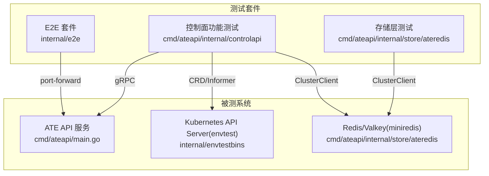
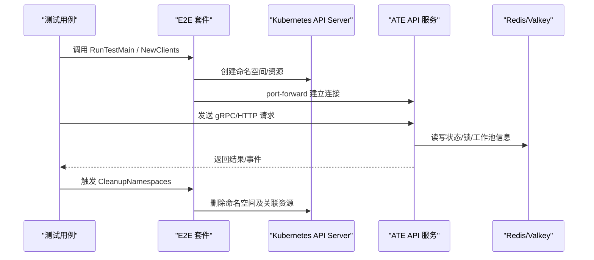
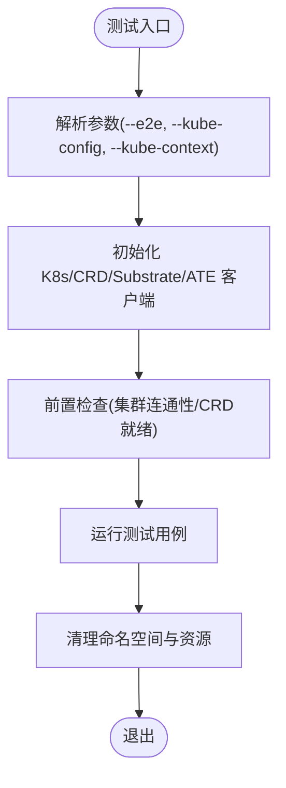
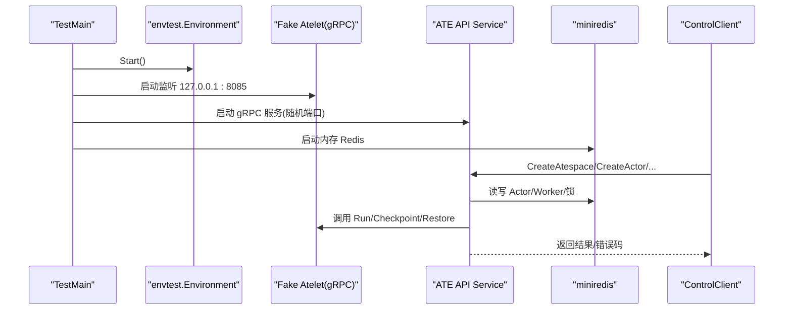
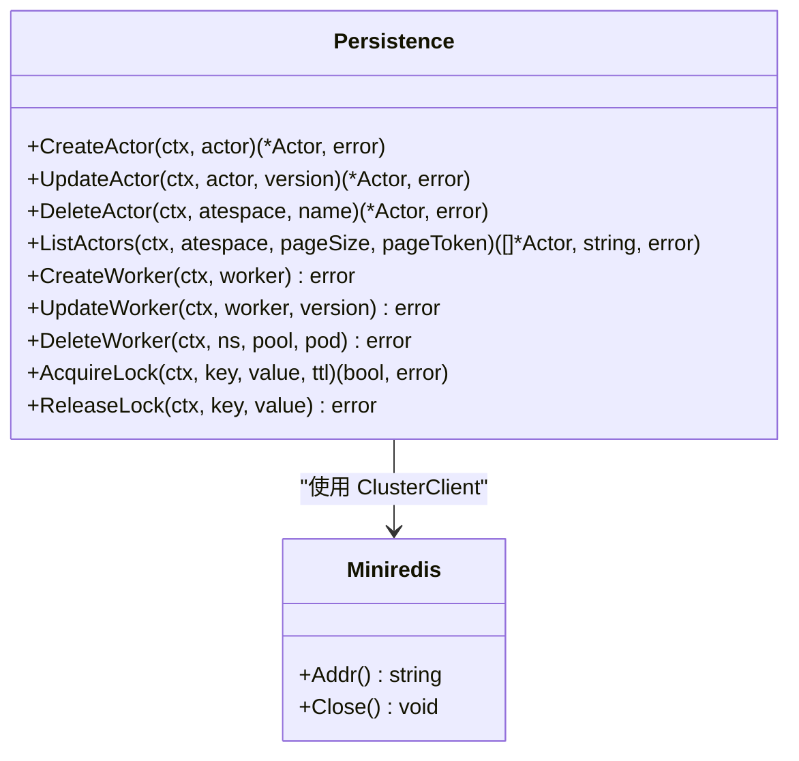
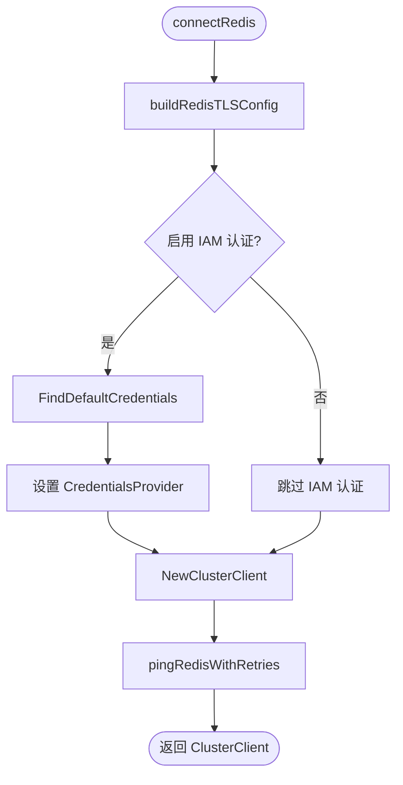
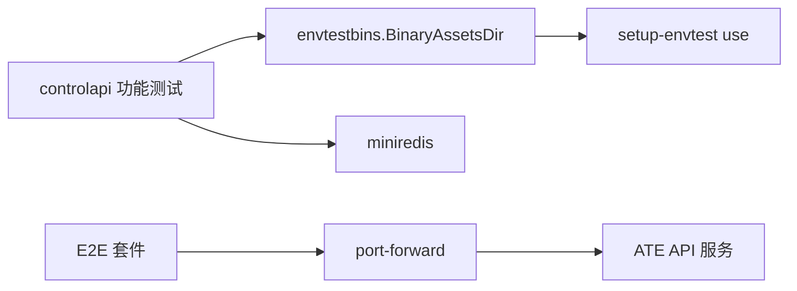

# 集成测试

<cite>
**本文引用的文件**   
- [README.md](file://README.md)
- [testmain.go](file://internal/e2e/testmain.go)
- [clients.go](file://internal/e2e/clients.go)
- [run.go](file://internal/e2e/run.go)
- [namespace.go](file://internal/e2e/namespace.go)
- [envtestbins.go](file://internal/envtestbins/envtestbins.go)
- [functional_test.go](file://cmd/ateapi/internal/controlapi/functional_test.go)
- [ateredis_test.go](file://cmd/ateapi/internal/store/ateredis/ateredis_test.go)
- [storetest.go](file://cmd/ateapi/internal/store/storetest/storetest.go)
- [main.go](file://cmd/ateapi/main.go)
</cite>

## 目录
1. [简介](#简介)
2. [项目结构](#项目结构)
3. [核心组件](#核心组件)
4. [架构总览](#架构总览)
5. [详细组件分析](#详细组件分析)
6. [依赖关系分析](#依赖关系分析)
7. [性能考虑](#性能考虑)
8. [故障排查指南](#故障排查指南)
9. [结论](#结论)
10. [附录](#附录)

## 简介
本指南面向希望在 Agent Substrate 项目中编写高质量集成测试的工程师，覆盖以下目标：
- 组件间交互测试：服务间通信、Kubernetes API Server、Redis/Valkey 缓存层等。
- 测试环境搭建：使用 envtest 启动本地 API Server，使用 miniredis 模拟 Redis/Valkey；E2E 通过 port-forward 连接真实集群中的 ATE API。
- 关键功能测试示例：gRPC 接口、HTTP 路由（通过 Envoy 与 DNS）、DNS 解析路径。
- 资源管理与清理：命名空间隔离、进程/端口生命周期管理、并发安全。
- 异步与错误场景：重试、冲突、超时、断链恢复等。

## 项目结构
仓库中用于集成测试的关键位置：
- internal/e2e：端到端测试套件入口、客户端初始化、命名空间管理、命令执行工具。
- cmd/ateapi/internal/controlapi：控制面 gRPC 服务的功能测试，包含完整的 envtest + miniredis 环境编排。
- cmd/ateapi/internal/store/ateredis：存储层（基于 Redis/Valkey）的单元测试与多主分片模拟。
- internal/envtestbins：envtest 二进制资产下载与跨进程锁，避免并行测试竞争。
- cmd/ateapi/main.go：ATE API 服务启动与 Redis 连接配置（TLS、IAM 认证）。

图表来源
- [testmain.go:40-82](file://internal/e2e/testmain.go#L40-L82)
- [functional_test.go:77-157](file://cmd/ateapi/internal/controlapi/functional_test.go#L77-L157)
- [envtestbins.go:27-59](file://internal/envtestbins/envtestbins.go#L27-L59)
- [ateredis_test.go:35-48](file://cmd/ateapi/internal/store/ateredis/ateredis_test.go#L35-L48)

章节来源
- [README.md:97-128](file://README.md#L97-L128)
- [testmain.go:40-82](file://internal/e2e/testmain.go#L40-L82)
- [envtestbins.go:27-59](file://internal/envtestbins/envtestbins.go#L27-L59)

## 核心组件
- E2E 套件入口与资源管理
  - 统一入口：RunTestMain 负责参数绑定、前置检查、共享客户端初始化与命名空间清理。
  - 客户端封装：NewClients 加载 kubeconfig、创建 k8s/clientset、CRD clientset、Substrate clientset，并通过 ateclient 建立到 ATE API 的连接（内部使用 port-forward）。
  - 命名空间隔离：CreateNamespace 生成随机名称并注册到全局清理列表，确保测试后自动回收。
  - 命令执行：RunCmd/RunCmdWithEnv 提供彩色输出与失败快速失败的便捷方法。

- 控制面功能测试（envtest + miniredis）
  - TestMain 启动 envtest 环境，创建 ate-system 命名空间与共享 Pod，启动 Fake Atelet gRPC 服务。
  - setupTest 为每个用例启动独立的 miniredis，构造 Persistence、WorkerCache、Service，并启动真实 gRPC 服务器与客户端。
  - 通过 Informer/Lister 同步 WorkerPool、ActorTemplate、SandboxConfig 等资源，等待缓存就绪后再执行业务逻辑。

- 存储层测试（Redis/Valkey）
  - 使用 miniredis 作为单节点或“伪集群”后端，验证 Actor/Worker 的 CRUD、分页、Watch 事件、分布式锁、并发冲突与重试语义。
  - 提供 storetest.SetupTestStore 复用最小化测试存储初始化流程。

章节来源
- [testmain.go:40-82](file://internal/e2e/testmain.go#L40-L82)
- [clients.go:46-83](file://internal/e2e/clients.go#L46-L83)
- [namespace.go:55-95](file://internal/e2e/namespace.go#L55-L95)
- [run.go:45-74](file://internal/e2e/run.go#L45-L74)
- [functional_test.go:77-157](file://cmd/ateapi/internal/controlapi/functional_test.go#L77-L157)
- [functional_test.go:258-390](file://cmd/ateapi/internal/controlapi/functional_test.go#L258-L390)
- [ateredis_test.go:35-48](file://cmd/ateapi/internal/store/ateredis/ateredis_test.go#L35-L48)
- [storetest.go:26-47](file://cmd/ateapi/internal/store/storetest/storetest.go#L26-L47)

## 架构总览
下图展示了集成测试的整体数据流与控制流：E2E 通过 port-forward 访问运行在集群中的 ATE API；控制面功能测试在本地以 envtest 启动 API Server，并以 miniredis 作为持久化后端；存储层测试直接对 Redis 接口进行边界与并发验证。

图表来源
- [testmain.go:61-82](file://internal/e2e/testmain.go#L61-L82)
- [clients.go:46-83](file://internal/e2e/clients.go#L46-L83)
- [functional_test.go:258-390](file://cmd/ateapi/internal/controlapi/functional_test.go#L258-L390)
- [main.go:248-314](file://cmd/ateapi/main.go#L248-L314)

## 详细组件分析

### 组件A：E2E 套件（端到端）
- 职责
  - 提供统一的测试入口与共享客户端。
  - 通过 port-forward 连接集群中的 ATE API，便于在 kind/GKE 上运行完整链路测试。
  - 管理命名空间生命周期，保证测试隔离与清理。
- 关键流程
  - 参数解析与开关：--e2e 启用 E2E 套件。
  - 客户端初始化：kubeconfig/context -> k8s/clientset -> substrate clientset -> ateclient。
  - 前置检查与清理：PreflightChecks、CleanupNamespaces。
- 典型用法
  - 在测试文件中引入 e2e 包并使用 GetClients() 获取共享客户端。
  - 使用 CreateNamespace 创建隔离命名空间并在结束时自动清理。

图表来源
- [testmain.go:33-59](file://internal/e2e/testmain.go#L33-L59)
- [clients.go:46-83](file://internal/e2e/clients.go#L46-L83)
- [namespace.go:55-95](file://internal/e2e/namespace.go#L55-L95)

章节来源
- [testmain.go:40-82](file://internal/e2e/testmain.go#L40-L82)
- [clients.go:46-83](file://internal/e2e/clients.go#L46-L83)
- [namespace.go:55-95](file://internal/e2e/namespace.go#L55-L95)
- [run.go:45-74](file://internal/e2e/run.go#L45-L74)

### 组件B：控制面功能测试（envtest + miniredis）
- 职责
  - 在本地启动真实的 Kubernetes API Server（envtest），注入 CRD 与必要资源。
  - 启动 Fake Atelet gRPC 服务，模拟底层执行器。
  - 启动真实 ATE API gRPC 服务，使用 miniredis 作为持久化后端。
  - 通过 Informer/Lister 同步 WorkerPool、ActorTemplate、SandboxConfig 等。
- 关键流程
  - TestMain：设置 envtest 二进制目录、启动 API Server、创建 ate-system 命名空间与共享 Pod、启动 Fake Atelet。
  - setupTest：为每个用例启动独立 miniredis，构建 Service、WorkerCache、Informer，启动 gRPC 服务并创建客户端。
  - 资源准备：创建 atespace、template、workerpool、worker pod，等待缓存与 API 可见性。
- 典型用例
  - 创建/查询/列出 Actor，校验元数据与服务端生成字段。
  - 模板不存在、重复 ID、无可用 Worker、多选择器匹配、幂等与重入等场景。

图表来源
- [functional_test.go:77-157](file://cmd/ateapi/internal/controlapi/functional_test.go#L77-L157)
- [functional_test.go:258-390](file://cmd/ateapi/internal/controlapi/functional_test.go#L258-L390)

章节来源
- [functional_test.go:77-157](file://cmd/ateapi/internal/controlapi/functional_test.go#L77-L157)
- [functional_test.go:258-390](file://cmd/ateapi/internal/controlapi/functional_test.go#L258-L390)

### 组件C：存储层测试（Redis/Valkey）
- 职责
  - 验证 Actor/Worker 的增删改查、分页、Watch 事件、分布式锁、并发冲突与重试语义。
  - 模拟多主分片场景，验证 ForEachMaster 并发行为与错误传播。
- 关键流程
  - setupTest：启动 miniredis，使用 redis.ClusterClient 连接，构造 Persistence。
  - newMultiMasterStore：为每个 shard 启动独立 miniredis，组合成“伪集群”，验证跨主并发。
- 典型用例
  - 更新冲突返回 ErrPersistenceRetry；分页遍历无重复；删除受状态约束；锁的 TTL 与释放校验。

图表来源
- [ateredis_test.go:35-48](file://cmd/ateapi/internal/store/ateredis/ateredis_test.go#L35-L48)
- [ateredis_test.go:1403-1436](file://cmd/ateapi/internal/store/ateredis/ateredis_test.go#L1403-L1436)

章节来源
- [ateredis_test.go:35-48](file://cmd/ateapi/internal/store/ateredis/ateredis_test.go#L35-L48)
- [ateredis_test.go:1403-1436](file://cmd/ateapi/internal/store/ateredis/ateredis_test.go#L1403-L1436)
- [storetest.go:26-47](file://cmd/ateapi/internal/store/storetest/storetest.go#L26-L47)

### 组件D：ATE API 服务与 Redis 连接（TLS/IAM）
- 职责
  - 解析标志与环境变量，构建 Redis TLS 配置，支持自定义 CA、ServerName、客户端证书。
  - 可选启用 Google IAM 认证，动态获取访问令牌。
  - 启动 gRPC 服务并监听指定地址。
- 关键流程
  - connectRedis：构建 TLS 配置 -> 选择是否启用 IAM -> 创建 ClusterClient -> 带重试 Ping。
  - buildRedisTLSConfig：读取 CA、设置 ServerName、加载客户端证书。
- 集成测试要点
  - 在功能测试中使用 miniredis 替代真实 Redis，跳过 TLS/IAM 分支，聚焦业务逻辑。
  - 在 E2E 中通过 port-forward 访问线上/集群部署的服务，验证端到端连通性与鉴权。

图表来源
- [main.go:248-314](file://cmd/ateapi/main.go#L248-L314)

章节来源
- [main.go:230-314](file://cmd/ateapi/main.go#L230-L314)

## 依赖关系分析
- envtest 二进制资产
  - BinaryAssetsDir 通过 hack/run-tool.sh 调用 setup-envtest use --print path，并使用文件锁串行化首次下载，避免并发竞争导致 etcd 可执行文件忙或归档解压失败。
- 控制面测试依赖
  - 依赖 envtest 提供的 API Server、CRD、Informer/Lister。
  - 依赖 miniredis 作为 Redis 后端，避免外部依赖。
- E2E 套件依赖
  - 依赖真实集群的 kubeconfig/context，通过 port-forward 访问 ATE API。
  - 依赖 ateclient 完成连接与转发。

图表来源
- [envtestbins.go:27-59](file://internal/envtestbins/envtestbins.go#L27-L59)
- [functional_test.go:77-157](file://cmd/ateapi/internal/controlapi/functional_test.go#L77-L157)
- [clients.go:46-83](file://internal/e2e/clients.go#L46-L83)

章节来源
- [envtestbins.go:27-59](file://internal/envtestbins/envtestbins.go#L27-L59)
- [functional_test.go:77-157](file://cmd/ateapi/internal/controlapi/functional_test.go#L77-L157)
- [clients.go:46-83](file://internal/e2e/clients.go#L46-L83)

## 性能考虑
- 并行测试与资源竞争
  - envtest 二进制下载通过文件锁串行化，避免并发竞争导致的 etcd 可执行文件忙问题。
  - 每个控制面测试用例使用独立的 miniredis 实例，避免状态污染与锁竞争。
- 缓存与等待策略
  - 使用 Informer.WaitForCacheSync 与 wait.PollUntilContextTimeout 等待资源就绪，减少竞态条件。
- 网络与 I/O
  - E2E 通过 port-forward 访问 API，注意超时与重试策略；控制面测试使用本地回环地址，降低网络开销。

[本节为通用指导，不直接分析具体文件]

## 故障排查指南
- envtest 启动失败
  - 现象：etcd 无法启动或二进制忙。
  - 排查：确认 BinaryAssetsDir 成功返回路径；检查 hack/run-tool.sh 与 setup-envtest 版本；查看日志输出。
- miniredis 不可用
  - 现象：连接失败或命令不支持。
  - 排查：确认使用 ClusterOptions 且避免集群专属命令；检查端口占用；查看测试 cleanup 是否提前关闭。
- E2E 连接失败
  - 现象：port-forward 超时或连接拒绝。
  - 排查：确认 kubeconfig/context 正确；检查集群中 ATE API 服务可用性；增加超时时间并重试。
- 更新冲突与重试
  - 现象：UpdateActor/UpdateWorker 返回 ErrPersistenceRetry。
  - 排查：确认调用方实现乐观锁重试；检查版本号是否正确传递。

章节来源
- [envtestbins.go:27-59](file://internal/envtestbins/envtestbins.go#L27-L59)
- [functional_test.go:258-390](file://cmd/ateapi/internal/controlapi/functional_test.go#L258-L390)
- [clients.go:46-83](file://internal/e2e/clients.go#L46-L83)

## 结论
本项目提供了完善的集成测试基础设施：
- 控制面功能测试通过 envtest + miniredis 实现了高保真、可复现的本地测试环境。
- E2E 套件通过 port-forward 对接真实集群，覆盖端到端链路。
- 存储层测试覆盖了并发、冲突、分页与 Watch 事件等复杂场景。
建议在新功能开发时优先补充对应场景的集成测试，确保稳定性与可维护性。

[本节为总结性内容，不直接分析具体文件]

## 附录
- 常用命令
  - 运行 E2E 套件：go test ./internal/e2e/... -args --e2e [--kube-config=...] [--kube-context=...]
  - 运行控制面功能测试：go test ./cmd/ateapi/internal/controlapi/...
  - 运行存储层测试：go test ./cmd/ateapi/internal/store/ateredis/...
- 参考文档
  - README 快速开始与 demo 说明，帮助理解整体系统与组件角色。

章节来源
- [README.md:97-128](file://README.md#L97-L128)
