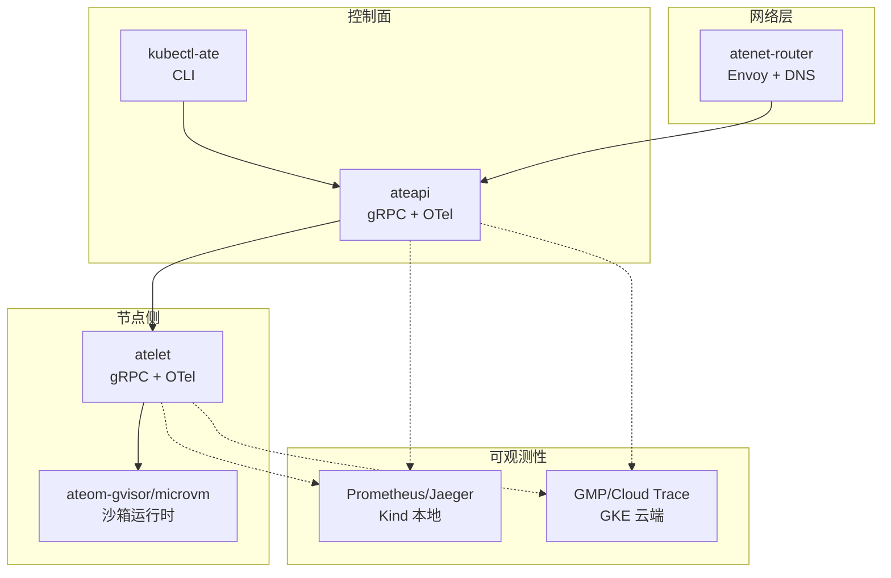
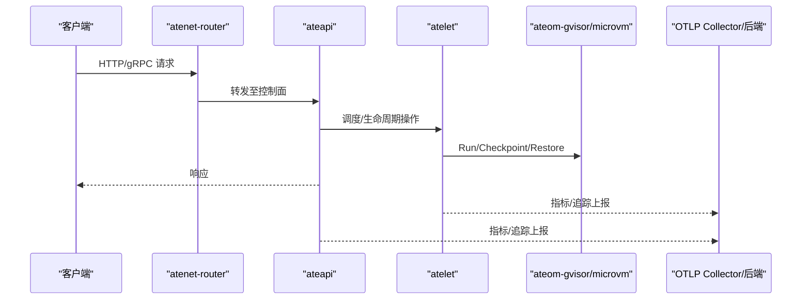
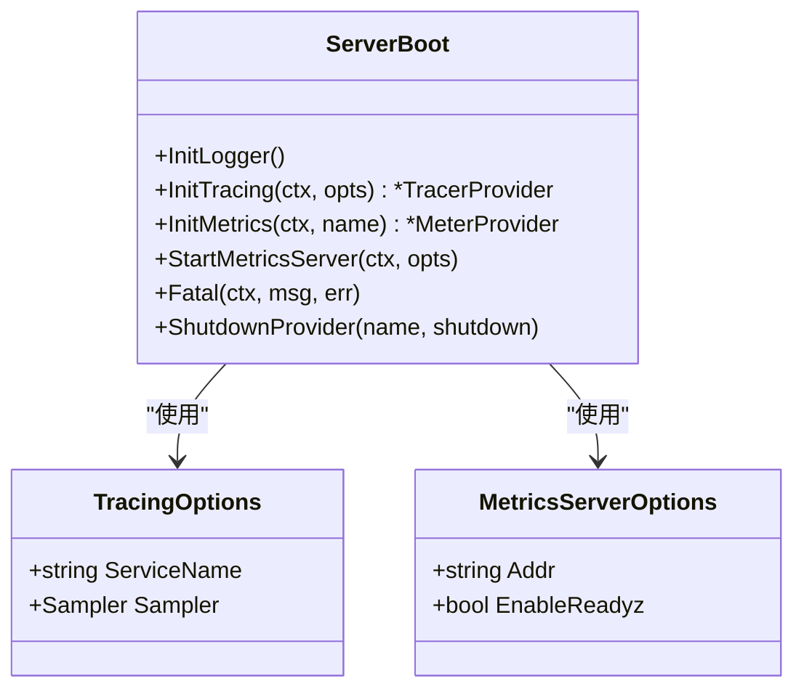
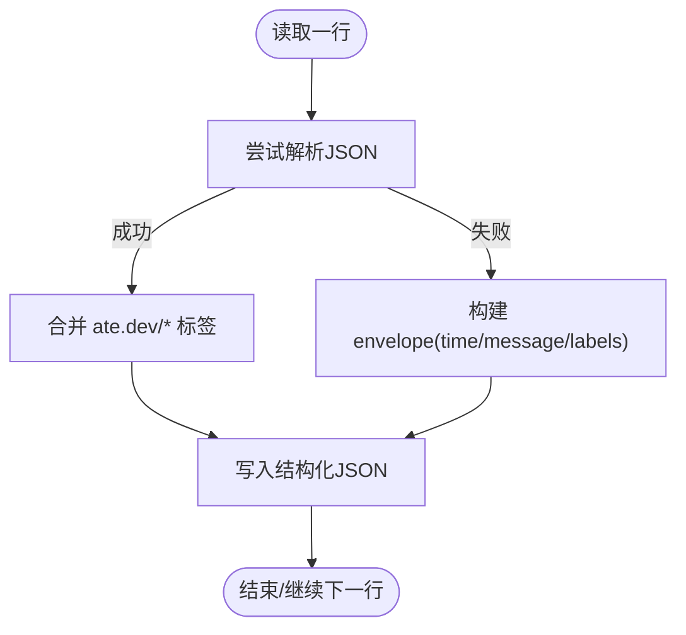
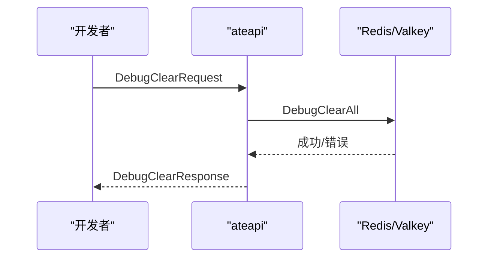
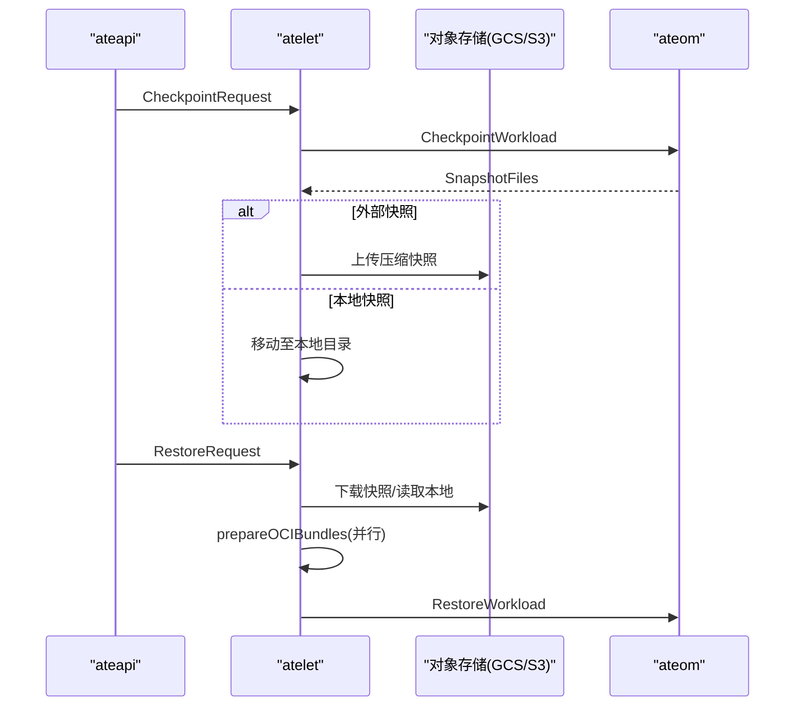
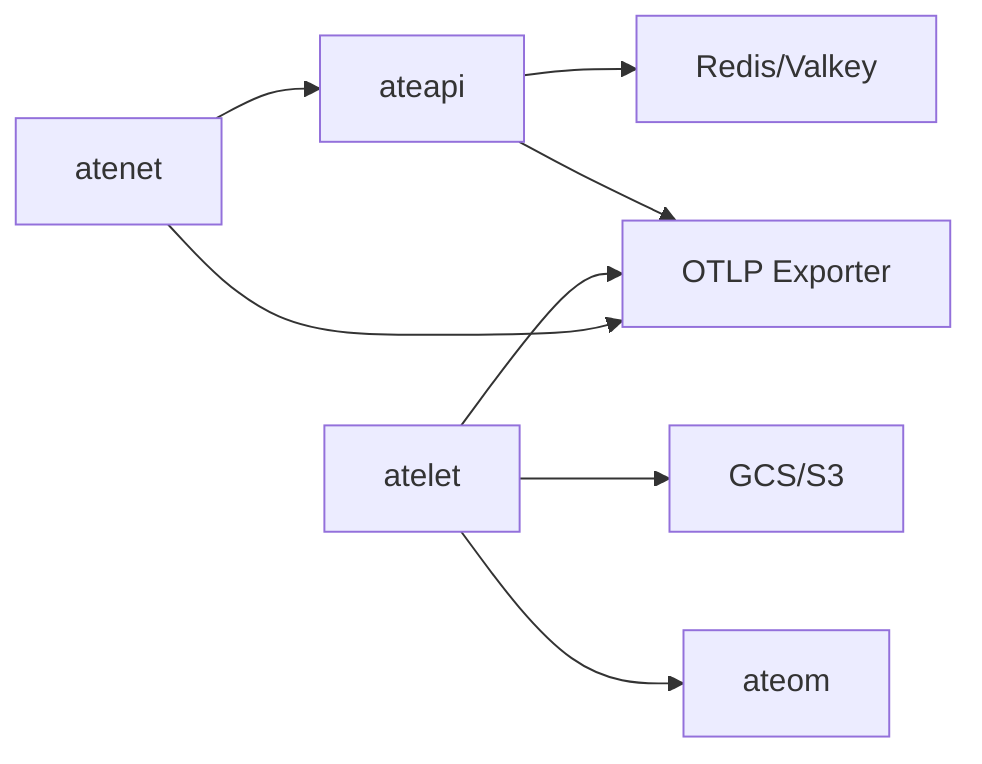

# 调试与故障排除

<cite>
**本文引用的文件**
- [README.md](file://README.md)
- [observability.md](file://docs/observability.md)
- [tracing.md](file://docs/dev/best-practices/tracing.md)
- [serverboot.go](file://internal/serverboot/serverboot.go)
- [logger.go](file://internal/actorlog/logger.go)
- [main.go (ateapi)](file://cmd/ateapi/main.go)
- [service.go (debugapi)](file://cmd/ateapi/internal/debugapi/service.go)
- [debug_clear.go (debugapi)](file://cmd/ateapi/internal/debugapi/debug_clear.go)
- [main.go (atelet)](file://cmd/atelet/main.go)
- [logs_actors_test.go](file://cmd/kubectl-ate/internal/cmd/logs_actors_test.go)
- [main.go (atenet)](file://cmd/atenet/main.go)
- [router.go (atenet router)](file://cmd/atenet/internal/router/router.go)
- [xds.go (atenet xds)](file://cmd/atenet/internal/router/xds.go)
- [status.go (atenet status)](file://cmd/atenet/internal/router/status.go)
- [errors.go (atenet router)](file://cmd/atenet/internal/router/errors.go)
- [ateerrors.go](file://internal/ateerrors/ateerrors.go)
- [counter_demo.py](file://benchmarking/locust/tests/counter_demo.py)
- [runner.py](file://benchmarking/locust/runner.py)
- [README.md (benchmarking)](file://benchmarking/README.md)
</cite>

## 目录
1. [简介](#简介)
2. [项目结构](#项目结构)
3. [核心组件](#核心组件)
4. [架构总览](#架构总览)
5. [详细组件分析](#详细组件分析)
6. [依赖关系分析](#依赖关系分析)
7. [性能考虑](#性能考虑)
8. [故障排除指南](#故障排除指南)
9. [结论](#结论)
10. [附录](#附录)

## 简介
本指南面向开发者与运维人员，提供 Agent Substrate 的本地与远程调试、日志系统、分布式追踪（OpenTelemetry）以及常见问题诊断方法。内容覆盖：
- 本地断点调试、变量查看、调用栈分析
- 生产环境远程调试与性能分析工具集成
- 结构化日志编写、级别控制、聚合与分析
- OpenTelemetry 集成、链路追踪与瓶颈定位
- 常见问题的排查步骤与最佳实践

## 项目结构
Agent Substrate 由多个服务组成，各自具备独立的启动、可观测性与调试能力：
- ateapi：控制面 gRPC API 服务
- atelet：节点侧工作负载管理守护进程
- atenet：网络控制器（DNS、Envoy 路由、代理 sidecar）
- ateom-gvisor/microvm：沙箱运行时辅助进程
- kubectl-ate：CLI 工具，支持按 Actor 维度查看日志等

图表来源
- [main.go (ateapi):79-206](file://cmd/ateapi/main.go#L79-L206)
- [main.go (atelet):74-183](file://cmd/atelet/main.go#L74-L183)
- [main.go (atenet):19-21](file://cmd/atenet/main.go#L19-L21)
- [observability.md:170-182](file://docs/observability.md#L170-L182)

章节来源
- [README.md:211-225](file://README.md#L211-L225)
- [observability.md:1-194](file://docs/observability.md#L1-L194)

## 核心组件
- 可观测性基础设施（serverboot）
  - 统一初始化 slog JSON 日志、OTel TracerProvider/MeterProvider、Prometheus /metrics 与可选 /readyz
  - 通过 OTEL_* 环境变量注入资源属性与导出器配置
- 结构化 Actor 日志（actorlog）
  - 将容器 stdout/stderr 包装为结构化 JSON，自动注入 ate.dev/* 标签，便于跨迁移与多容器解复用
- 控制面与节点侧服务
  - ateapi：注册 gRPC 服务、鉴权拦截器、OTel gRPC 统计处理器、Debug 服务
  - atelet：运行/检查点/恢复工作负载，记录快照大小指标，并发下载与解压优化
- 网络层（atenet）
  - 路由与 XDS 配置，支持 Envoy 端追踪开关与调试日志级别

章节来源
- [serverboot.go:44-193](file://internal/serverboot/serverboot.go#L44-L193)
- [logger.go:50-173](file://internal/actorlog/logger.go#L50-L173)
- [main.go (ateapi):79-206](file://cmd/ateapi/main.go#L79-L206)
- [main.go (atelet):74-183](file://cmd/atelet/main.go#L74-L183)
- [main.go (atenet):19-21](file://cmd/atenet/main.go#L19-L21)

## 架构总览
下图展示请求从客户端经 atenet 路由到 ateapi，再到 atelet 与沙箱运行时的完整链路，并标注可观测性出口。

图表来源
- [main.go (ateapi):182-196](file://cmd/ateapi/main.go#L182-L196)
- [main.go (atelet):176-182](file://cmd/atelet/main.go#L176-L182)
- [serverboot.go:91-147](file://internal/serverboot/serverboot.go#L91-L147)
- [observability.md:137-166](file://docs/observability.md#L137-L166)

## 详细组件分析

### 组件A：可观测性基础设施（serverboot）
- 功能要点
  - InitLogger：全局 slog JSON 输出，便于集中采集
  - InitTracing：创建 TracerProvider，设置 TraceContext 传播，使用 OTLP gRPC 导出
  - InitMetrics：同时暴露 Prometheus 与 OTLP 指标
  - StartMetricsServer：HTTP 服务提供 /metrics 与可选 /readyz
- 关键配置
  - ServiceName、ServiceInstanceID 作为资源属性
  - Sampler 策略在 ateapi 通常为 AlwaysSample，在 atelet 为 NeverSample（按需采样）

图表来源
- [serverboot.go:44-193](file://internal/serverboot/serverboot.go#L44-L193)

章节来源
- [serverboot.go:44-193](file://internal/serverboot/serverboot.go#L44-L193)

### 组件B：结构化 Actor 日志（actorlog）
- 功能要点
  - WrapContainerLogs：解析每行日志，若为 JSON 则合并 ate.dev/* 标签；否则包装为结构化 JSON
  - EmitLifecycleLog：生成合成生命周期事件，便于审计与排障
  - 支持 GCE 环境下的 logging.googleapis.com/labels 键名
- 使用建议
  - 多容器场景下为每个容器单独管道，确保 container_name 标签准确
  - 时间戳缺失时自动填充 RFC3339Nano

图表来源
- [logger.go:103-173](file://internal/actorlog/logger.go#L103-L173)

章节来源
- [logger.go:50-173](file://internal/actorlog/logger.go#L50-L173)

### 组件C：控制面调试接口（debugapi）
- 功能要点
  - DebugClear：清理持久化数据，用于本地调试或测试重置
  - 通过 gRPC 注册 DebugServer，配合主服务启动
- 典型流程

图表来源
- [service.go (debugapi):22-35](file://cmd/ateapi/internal/debugapi/service.go#L22-L35)
- [debug_clear.go (debugapi):24-36](file://cmd/ateapi/internal/debugapi/debug_clear.go#L24-L36)
- [main.go (ateapi):162-196](file://cmd/ateapi/main.go#L162-L196)

章节来源
- [service.go (debugapi):22-35](file://cmd/ateapi/internal/debugapi/service.go#L22-L35)
- [debug_clear.go (debugapi):24-36](file://cmd/ateapi/internal/debugapi/debug_clear.go#L24-L36)
- [main.go (ateapi):162-196](file://cmd/ateapi/main.go#L162-L196)

### 组件D：节点侧工作负载管理（atelet）
- 功能要点
  - Run/Checkpoint/Restore：协调 OCI 镜像拉取、快照上传/下载、ateom 执行
  - 指标：记录 snapshot.size 直方图，便于评估快照体积与恢复耗时
  - 并发优化：下载与 OCI bundle 准备并行执行，缩短冷启动恢复时间
- 关键路径

图表来源
- [main.go (atelet):309-583](file://cmd/atelet/main.go#L309-L583)

章节来源
- [main.go (atelet):273-583](file://cmd/atelet/main.go#L273-L583)

### 组件E：网络层与追踪（atenet）
- 功能要点
  - 路由与 XDS：支持 Envoy 端追踪开关与调试日志级别
  - 指标：atenet.router.route.duration（端到端路由延迟）
- 相关入口
  - main 入口、router 初始化、XDS 配置、状态页包含构建信息

章节来源
- [main.go (atenet):19-21](file://cmd/atenet/main.go#L19-L21)
- [router.go (atenet router):83-183](file://cmd/atenet/internal/router/router.go#L83-L183)
- [xds.go (atenet xds):122-122](file://cmd/atenet/internal/router/xds.go#L122-L122)
- [status.go (atenet status):189-189](file://cmd/atenet/internal/router/status.go#L189-L189)

## 依赖关系分析
- 服务间依赖
  - ateapi 依赖 Redis/Valkey 作为持久化，注册 Control/SessionIdentity/Debug 服务
  - atelet 依赖对象存储（GCS/S3）与 ateom 运行时
  - atenet 负责流量接入与路由，向控制面发起查询
- 可观测性依赖
  - 所有服务通过 serverboot 初始化 OTel 与 Prometheus
  - Kind 环境内置 Jaeger/Prometheus；GKE 环境对接 GMP/Cloud Trace

图表来源
- [main.go (ateapi):111-196](file://cmd/ateapi/main.go#L111-L196)
- [main.go (atelet):121-183](file://cmd/atelet/main.go#L121-L183)
- [serverboot.go:91-147](file://internal/serverboot/serverboot.go#L91-L147)

章节来源
- [main.go (ateapi):111-196](file://cmd/ateapi/main.go#L111-L196)
- [main.go (atelet):121-183](file://cmd/atelet/main.go#L121-L183)
- [serverboot.go:91-147](file://internal/serverboot/serverboot.go#L91-L147)

## 性能考虑
- 追踪采样
  - ateapi 默认 AlwaysSample，适合端到端追踪；atelet 默认 NeverSample，避免节点侧开销
- 指标粒度
  - rpc.server.call.duration、atenet.router.route.duration、atelet.snapshot.size 有助于识别热点与瓶颈
- 恢复路径优化
  - atelet 在 Restore 阶段并发执行快照下载与 OCI bundle 准备，减少冷启动延迟

章节来源
- [serverboot.go:82-119](file://internal/serverboot/serverboot.go#L82-L119)
- [main.go (atelet):506-544](file://cmd/atelet/main.go#L506-L544)
- [observability.md:103-134](file://docs/observability.md#L103-L134)

## 故障排除指南

### 本地调试环境搭建
- 快速启动开发集群与示例应用
  - 参考 README 中的 Quickstart 步骤，创建 kind 集群、安装 ate 系统与 demo
- 端口转发与访问
  - 将 atenet-router 端口转发到本地，以便发送 HTTP 请求触发工作流
- 断点调试
  - 使用 IDE 直接运行 cmd/ateapi、cmd/atelet、cmd/atenet 的 main 包，在关键函数处设置断点
  - 结合 slog JSON 日志与 OTel 追踪 ID 进行上下文关联

章节来源
- [README.md:97-128](file://README.md#L97-L128)

### 远程调试与生产技巧
- 启用按需追踪
  - 通过 CLI 或 API 调用携带 --trace 标志，生成 trace_id，便于在 Jaeger/Cloud Trace 中检索
- 指标与就绪探针
  - 通过 /metrics 抓取指标，/readyz 确认服务就绪
- 性能分析
  - 关注 rpc.server.call.duration、atenet.router.route.duration、atelet.snapshot.size 等指标
  - 结合 Go pprof 与系统工具（如 perf、eBPF）定位 CPU/IO 热点

章节来源
- [observability.md:137-166](file://docs/observability.md#L137-L166)
- [serverboot.go:176-193](file://internal/serverboot/serverboot.go#L176-L193)

### 日志系统配置与使用
- 结构化日志
  - 使用 actorlog 将容器输出包装为 JSON，自动注入 ate.dev/* 标签，支持 GCE 兼容键名
- 日志级别控制
  - 通过 slog 全局日志器输出 JSON；atenet 支持 debug/info/warn/error 级别
- 聚合与分析
  - 在 Kind 中使用 Prometheus/Jaeger；在 GKE 中使用 Cloud Monitoring/Cloud Trace
  - 使用 kubectl-ate logs actors 按 Actor 维度查看实时日志，支持跟随模式

章节来源
- [logger.go:50-173](file://internal/actorlog/logger.go#L50-L173)
- [observability.md:21-101](file://docs/observability.md#L21-L101)
- [logs_actors_test.go:34-170](file://cmd/kubectl-ate/internal/cmd/logs_actors_test.go#L34-L170)
- [router.go (atenet router):164-183](file://cmd/atenet/internal/router/router.go#L164-L183)

### 分布式追踪配置与使用
- OpenTelemetry 集成
  - 通过 serverboot.InitTracing 初始化 TracerProvider，设置 TraceContext 传播
  - gRPC/HTTP 客户端与服务端分别添加 otelgrpc/otelhttp 中间件
- 链路追踪分析
  - 在 Kind 中通过 Jaeger UI 查看；在 GKE 中通过 Cloud Trace 查看
  - 使用 benchmarking 脚本注入 trace_id，验证端到端链路
- 性能瓶颈定位
  - 结合 span 层级与指标，定位慢调用与外部依赖瓶颈

章节来源
- [serverboot.go:91-119](file://internal/serverboot/serverboot.go#L91-L119)
- [tracing.md:1-266](file://docs/dev/best-practices/tracing.md#L1-L266)
- [counter_demo.py:140-171](file://benchmarking/locust/tests/counter_demo.py#L140-L171)
- [observability.md:137-166](file://docs/observability.md#L137-L166)

### 常见问题诊断与解决步骤
- 问题：Actor 未运行，无法查看日志
  - 现象：kubectl-ate logs actors 提示未分配至任何 worker pod
  - 处理：先恢复/唤醒 Actor，或使用集中式日志后端查看历史
- 问题：追踪未产生
  - 现象：Jaeger/Cloud Trace 无对应 trace_id
  - 处理：确认调用是否携带 --trace；检查服务端采样策略与 OTLP 导出器配置
- 问题：快照上传失败导致恢复异常
  - 现象：Checkpoint 返回 DataLoss 或保存失败
  - 处理：检查对象存储权限与网络连通性；查看 atelet 日志与 snapshot.size 指标
- 问题：路由延迟高
  - 现象：atenet.router.route.duration 升高
  - 处理：检查上游服务健康度与资源占用；开启 Envoy 调试日志定位具体阶段

章节来源
- [observability.md:25-63](file://docs/observability.md#L25-L63)
- [main.go (atelet):357-379](file://cmd/atelet/main.go#L357-L379)
- [observability.md:103-134](file://docs/observability.md#L103-L134)

## 结论
通过统一的日志与追踪基础设施、结构化的 Actor 元数据、以及完善的指标体系，Agent Substrate 提供了强大的本地与生产调试能力。建议在开发阶段充分利用 Kind 内的 Jaeger/Prometheus，在生产环境对接 GMP/Cloud Trace，并结合 CLI 与结构化日志进行高效排障。

## 附录
- 基准测试与监控
  - Locust 脚本支持追踪注入与指标导出；可通过 Prometheus/Grafana 进行可视化分析
- 错误分类与处理
  - 使用 ateerrors 对错误进行分类与标记，便于上层判定是否应终止工作负载

章节来源
- [README.md (benchmarking):59-90](file://benchmarking/README.md#L59-L90)
- [runner.py:255-285](file://benchmarking/locust/runner.py#L255-L285)
- [ateerrors.go:1-39](file://internal/ateerrors/ateerrors.go#L1-L39)
