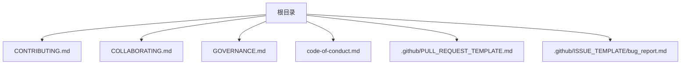
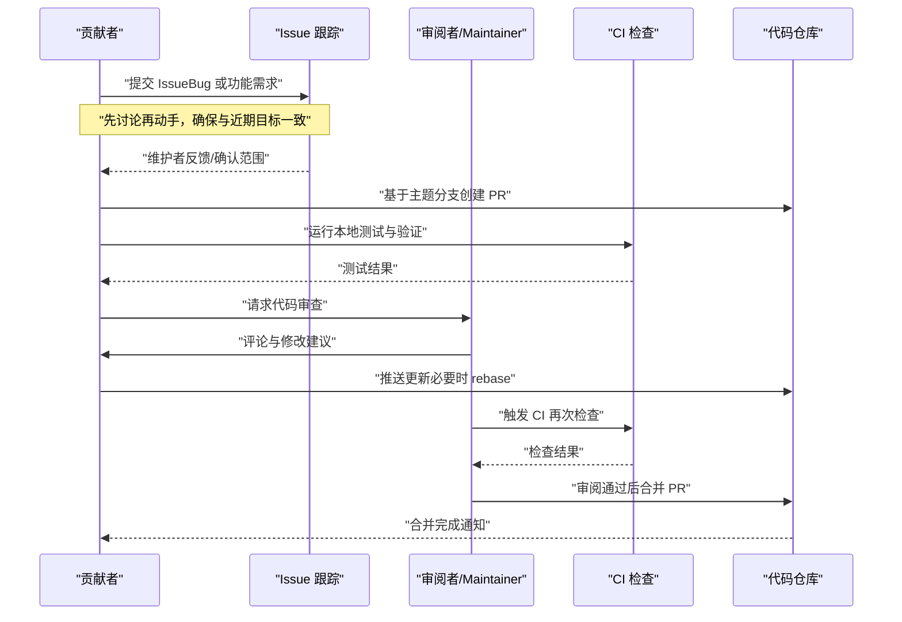
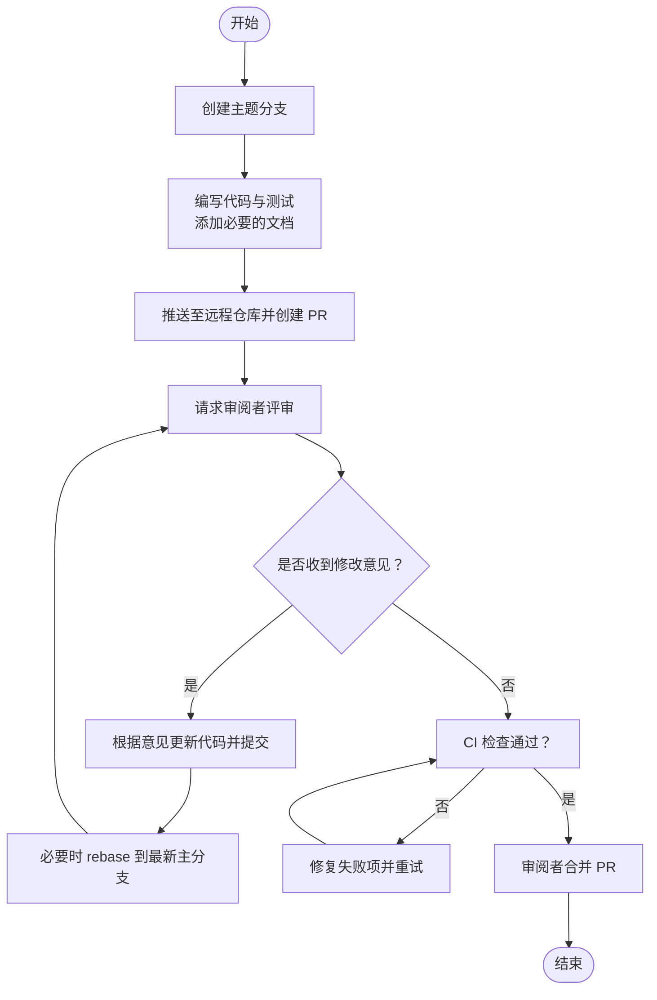
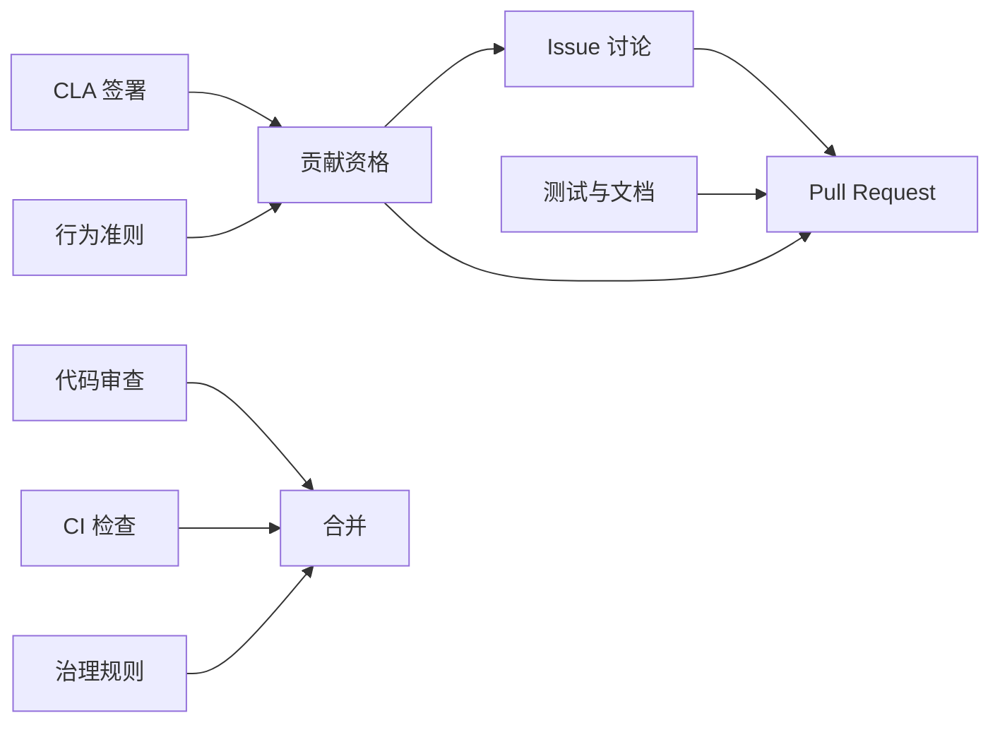

# 贡献工作流程

<cite>
**本文引用的文件**   
- [CONTRIBUTING.md](file://CONTRIBUTING.md)
- [COLLABORATING.md](file://COLLABORATING.md)
- [GOVERNANCE.md](file://GOVERNANCE.md)
- [code-of-conduct.md](file://code-of-conduct.md)
- [.github/PULL_REQUEST_TEMPLATE.md](file://.github/PULL_REQUEST_TEMPLATE.md)
- [.github/ISSUE_TEMPLATE/bug_report.md](file://.github/ISSUE_TEMPLATE/bug_report.md)
</cite>

## 目录
1. [简介](#简介)
2. [项目结构](#项目结构)
3. [核心组件](#核心组件)
4. [架构总览](#架构总览)
5. [详细流程与规范](#详细流程与规范)
6. [依赖关系分析](#依赖关系分析)
7. [性能与质量考量](#性能与质量考量)
8. [故障排查指南](#故障排查指南)
9. [结论](#结论)
10. [附录：新贡献者入门清单](#附录新贡献者入门清单)

## 简介
本指南面向希望参与 Agent Substrate 项目的贡献者，系统化说明如何提交 Issue、提出功能需求、创建并推进 Pull Request（PR）、参与代码审查、遵循社区协作规范与礼仪，以及冲突解决与决策流程。文档同时提供新贡献者的快速入门清单，帮助你在最短时间内高效、合规地参与开发。

## 项目结构
仓库中与贡献相关的治理与流程规范主要位于根目录的若干 Markdown 文件中，GitHub 模板位于 .github 目录下：
- 贡献与许可：CONTRIBUTING.md
- 协作规范与礼仪：COLLABORATING.md
- 治理与角色：GOVERNANCE.md
- 行为准则：code-of-conduct.md
- PR 模板：.github/PULL_REQUEST_TEMPLATE.md
- Bug 报告模板：.github/ISSUE_TEMPLATE/bug_report.md

**图表来源** 
- [CONTRIBUTING.md:1-68](file://CONTRIBUTING.md#L1-L68)
- [COLLABORATING.md:1-106](file://COLLABORATING.md#L1-L106)
- [GOVERNANCE.md:1-74](file://GOVERNANCE.md#L1-L74)
- [code-of-conduct.md:1-96](file://code-of-conduct.md#L1-L96)
- [.github/PULL_REQUEST_TEMPLATE.md:1-7](file://.github/PULL_REQUEST_TEMPLATE.md#L1-L7)
- [.github/ISSUE_TEMPLATE/bug_report.md:1-22](file://.github/ISSUE_TEMPLATE/bug_report.md#L1-L22)

**章节来源**
- [CONTRIBUTING.md:1-68](file://CONTRIBUTING.md#L1-L68)
- [COLLABORATING.md:1-106](file://COLLABORATING.md#L1-L106)
- [GOVERNANCE.md:1-74](file://GOVERNANCE.md#L1-L74)
- [code-of-conduct.md:1-96](file://code-of-conduct.md#L1-L96)
- [.github/PULL_REQUEST_TEMPLATE.md:1-7](file://.github/PULL_REQUEST_TEMPLATE.md#L1-L7)
- [.github/ISSUE_TEMPLATE/bug_report.md:1-22](file://.github/ISSUE_TEMPLATE/bug_report.md#L1-L22)

## 核心组件
- 贡献前置条件
  - 签署贡献者许可协议（CLA）
  - 遵守社区行为准则
- 贡献流程要点
  - 先讨论后实现：优先在 Issue 中沟通需求或问题
  - 小步快跑：小而聚焦的 PR 更易评审与更新
  - 必须包含测试：无测试或导致测试失败的变更不会被合并
  - 版权头信息：所有源码文件需包含标准版权与许可证头
- 协作与治理
  - 使用 PR 进行所有变更；禁止直接推送到主分支
  - 由审阅者合并 PR，作者不应自行批准或合并自己的 PR（紧急修复除外）
  - 明确角色与权限：默认贡献者、Contributor、Reviewer、Maintainer
  - 决策机制：代码变更需 Maintainer 批准且 CI 通过；设计变更需提前提案与反馈期；争议由 Maintainers 裁决
  - 工作时间建议：工作日美西时间 8am-8pm 内合并，避免非工作时段合并（紧急修复除外）
  - AI 辅助政策：允许使用 AI 工具，但需披露并对变更负责；不得将 AI 列为共同作者或使用特定提交后缀；大型 AI 生成 PR 不被接受；回复审查意见时不得使用 AI 工具代答

**章节来源**
- [CONTRIBUTING.md:9-68](file://CONTRIBUTING.md#L9-L68)
- [COLLABORATING.md:38-75](file://COLLABORATING.md#L38-L75)
- [GOVERNANCE.md:16-58](file://GOVERNANCE.md#L16-L58)

## 架构总览
下图展示了从“发现问题/提出需求”到“PR 合并上线”的端到端协作路径，涵盖 Issue 生命周期、PR 提交流程、代码审查与合并标准。

**图表来源** 
- [CONTRIBUTING.md:28-58](file://CONTRIBUTING.md#L28-L58)
- [COLLABORATING.md:38-97](file://COLLABORATING.md#L38-L97)
- [GOVERNANCE.md:47-58](file://GOVERNANCE.md#L47-L58)
- [.github/PULL_REQUEST_TEMPLATE.md:1-7](file://.github/PULL_REQUEST_TEMPLATE.md#L1-L7)
- [.github/ISSUE_TEMPLATE/bug_report.md:1-22](file://.github/ISSUE_TEMPLATE/bug_report.md#L1-L22)

## 详细流程与规范

### Issue 提交与讨论
- 何时开 Issue
  - 发现 Bug：使用 Bug 报告模板，清晰描述预期行为与实际行为，并提供可复现步骤与环境规格
  - 提出新功能或改进：先在 Issue 中阐述背景、动机与方案概要，等待维护者反馈后再投入大量开发
- 模板与字段
  - Bug 报告模板包含：预期行为、实际行为、复现步骤、版本与平台等
- 讨论原则
  - 保持书面沟通，清晰简洁；尊重不同语言背景的参与者
  - 若 Issue 长期未响应，可在不催促的前提下补充必要信息

**章节来源**
- [.github/ISSUE_TEMPLATE/bug_report.md:1-22](file://.github/ISSUE_TEMPLATE/bug_report.md#L1-L22)
- [COLLABORATING.md:28-36](file://COLLABORATING.md#L28-L36)
- [CONTRIBUTING.md:30-48](file://CONTRIBUTING.md#L30-L48)

### 功能需求提出与评估
- 在 Issue 中描述需求背景、目标用户、影响范围与大致方案
- 维护者会评估是否与近期目标一致，避免重复劳动
- 对于重大设计变更，需预留至少一周反馈期，并获得 Maintainer 支持

**章节来源**
- [CONTRIBUTING.md:30-48](file://CONTRIBUTING.md#L30-L48)
- [GOVERNANCE.md:47-58](file://GOVERNANCE.md#L47-L58)

### Pull Request 提交流程
- 分支管理
  - 不要直接推送到主分支；始终通过 PR 提议变更
  - 为每个特性或修复创建独立的主题分支，便于评审与更新
- 提交规范
  - 每次提交应聚焦单一变更点，便于审阅与回滚
  - 提交信息需清晰表达变更意图（参考 Kubernetes PR 指南中的提交信息与 AI 使用政策）
- PR 描述要求
  - 使用 PR 模板，填写关联 Issue 编号
  - 勾选“测试已通过”和“文档已更新”等自检项
  - 如涉及 AI 辅助，需在描述中披露使用情况及责任归属
- 合并策略
  - 由审阅者合并，作者不应自行批准或合并自己的 PR（紧急修复除外）
  - 合并前需至少一名 Maintainer 批准且 CI 全部通过

**图表来源** 
- [COLLABORATING.md:38-47](file://COLLABORATING.md#L38-L47)
- [CONTRIBUTING.md:50-58](file://CONTRIBUTING.md#L50-L58)
- [.github/PULL_REQUEST_TEMPLATE.md:1-7](file://.github/PULL_REQUEST_TEMPLATE.md#L1-L7)

**章节来源**
- [COLLABORATING.md:38-47](file://COLLABORATING.md#L38-L47)
- [CONTRIBUTING.md:50-58](file://CONTRIBUTING.md#L50-L58)
- [.github/PULL_REQUEST_TEMPLATE.md:1-7](file://.github/PULL_REQUEST_TEMPLATE.md#L1-L7)

### 代码审查标准与流程
- 审查要点
  - 正确性与安全性：逻辑是否正确，是否存在潜在风险
  - 可维护性：命名、结构与注释是否清晰，是否符合风格指南
  - 可测试性：是否覆盖关键路径与边界情况
  - 一致性：与现有设计与约定保持一致
- 反馈处理
  - 对每条评论逐一回应，必要时追加解释或示例
  - 使用 rebase 保持历史整洁，避免大段无关改动
- 合并标准
  - 至少一名 Maintainer 批准
  - CI 全绿（包括单元测试、集成测试与静态检查）
  - 文档与变更日志（如有）同步更新

**章节来源**
- [CONTRIBUTING.md:50-58](file://CONTRIBUTING.md#L50-L58)
- [COLLABORATING.md:76-87](file://COLLABORATING.md#L76-L87)
- [GOVERNANCE.md:47-58](file://GOVERNANCE.md#L47-L58)

### 社区协作规范与礼仪
- 沟通方式
  - 优先书面沟通（PR、Issue、邮件列表、Slack），便于追溯与共享
  - 使用英语作为主要沟通语言，尊重非母语参与者
- 决策流程
  - 代码变更：PR 需 Maintainer 批准且 CI 通过
  - 设计变更：提案 + 反馈期 + Maintainer 支持
  - 争议解决：先在 Issue/PR 上协商，无法达成一致时由 Maintainers 决定
- 冲突解决
  - 鼓励健康辩论，但严禁违反行为准则的行为
  - 违规举报按行为准则流程处理，由项目托管人与相关团队介入
- 工作时间
  - 工作日美西时间 8am-8pm 内合并，避免深夜或周末合并（紧急修复除外）
- 所有权文化
  - 鼓励对模块/子系统拥有责任感，同时避免领地化

**章节来源**
- [COLLABORATING.md:16-36](file://COLLABORATING.md#L16-L36)
- [COLLABORATING.md:89-106](file://COLLABORATING.md#L89-L106)
- [GOVERNANCE.md:47-68](file://GOVERNANCE.md#L47-L68)
- [code-of-conduct.md:61-90](file://code-of-conduct.md#L61-L90)

### 新贡献者入门指导
- 必读文档
  - 贡献指南：了解 CLA、测试要求、版权头与基本流程
  - 协作规范：了解 PR 工作流、AI 使用政策与工作时间建议
  - 行为准则：理解社区期望与冲突处理机制
  - 治理文档：了解角色、权限与决策流程
- 快速上手步骤
  - 阅读 README 与架构文档，了解系统概览
  - 选择一个标签为“good first issue”或小型修复任务
  - 在 Issue 中简要说明你的计划，获得认可后开始实现
  - 编写测试与文档，提交 PR 并跟进审阅反馈
- 资源链接
  - 贡献指南入口：[CONTRIBUTING.md](file://CONTRIBUTING.md)
  - 协作规范入口：[COLLABORATING.md](file://COLLABORATING.md)
  - 行为准则入口：[code-of-conduct.md](file://code-of-conduct.md)
  - 治理入口：[GOVERNANCE.md](file://GOVERNANCE.md)

**章节来源**
- [CONTRIBUTING.md:9-27](file://CONTRIBUTING.md#L9-L27)
- [COLLABORATING.md:49-75](file://COLLABORATING.md#L49-L75)
- [GOVERNANCE.md:16-46](file://GOVERNANCE.md#L16-L46)

## 依赖关系分析
贡献流程各要素之间的相互依赖如下：
- CLA 与行为准则是所有贡献的前置条件
- Issue 驱动 PR 的需求与范围
- PR 依赖测试与文档更新
- 代码审查依赖 Maintainer 可用性与跨公司协作
- 合并依赖 CI 结果与治理规则

**图表来源** 
- [CONTRIBUTING.md:9-27](file://CONTRIBUTING.md#L9-L27)
- [CONTRIBUTING.md:50-58](file://CONTRIBUTING.md#L50-L58)
- [COLLABORATING.md:38-47](file://COLLABORATING.md#L38-L47)
- [GOVERNANCE.md:47-58](file://GOVERNANCE.md#L47-L58)
- [code-of-conduct.md:61-90](file://code-of-conduct.md#L61-L90)

**章节来源**
- [CONTRIBUTING.md:9-58](file://CONTRIBUTING.md#L9-L58)
- [COLLABORATING.md:38-97](file://COLLABORATING.md#L38-L97)
- [GOVERNANCE.md:47-68](file://GOVERNANCE.md#L47-L68)
- [code-of-conduct.md:61-90](file://code-of-conduct.md#L61-L90)

## 性能与质量考量
- 小步快跑：小而聚焦的 PR 更易于评审与更新，降低回归风险
- 测试先行：确保新增与修改均有相应测试覆盖，避免引入不稳定因素
- 文档同步：变更涉及 API 或行为变化时，及时更新文档与示例
- 审阅效率：清晰的提交信息与变更摘要有助于提高审阅速度

[本节为通用指导，无需具体文件引用]

## 故障排查指南
- PR 被拒绝或未获批准
  - 检查是否满足合并标准（Maintainer 批准、CI 全绿）
  - 回顾审阅评论，逐条回应并更新代码
  - 如长时间无响应，礼貌地在 Issue/PR 中补充上下文
- 测试失败
  - 定位失败用例，复现问题并修复
  - 增加或完善测试以覆盖边界情况
- 行为准则相关问题
  - 依据行为准则流程进行举报与处理，联系项目托管人或指定邮箱

**章节来源**
- [GOVERNANCE.md:47-58](file://GOVERNANCE.md#L47-L58)
- [code-of-conduct.md:61-90](file://code-of-conduct.md#L61-L90)

## 结论
通过遵循本贡献工作流程，你可以更高效、合规地参与 Agent Substrate 的开发与协作。记住：先讨论后实现、小步快跑、重视测试与文档、尊重审阅与治理规则，是高质量贡献的关键。

[本节为总结性内容，无需具体文件引用]

## 附录：新贡献者入门清单
- 签署 CLA 并阅读行为准则
- 阅读贡献指南与协作规范
- 浏览 Issue 列表，选择适合的任务
- 在 Issue 中说明你的计划并获取认可
- 创建主题分支，实现变更并编写测试与文档
- 提交 PR，跟进审阅反馈并完成 rebase
- 等待 Maintainer 批准与 CI 通过后合并

**章节来源**
- [CONTRIBUTING.md:9-27](file://CONTRIBUTING.md#L9-L27)
- [COLLABORATING.md:38-75](file://COLLABORATING.md#L38-L75)
- [GOVERNANCE.md:16-46](file://GOVERNANCE.md#L16-L46)
