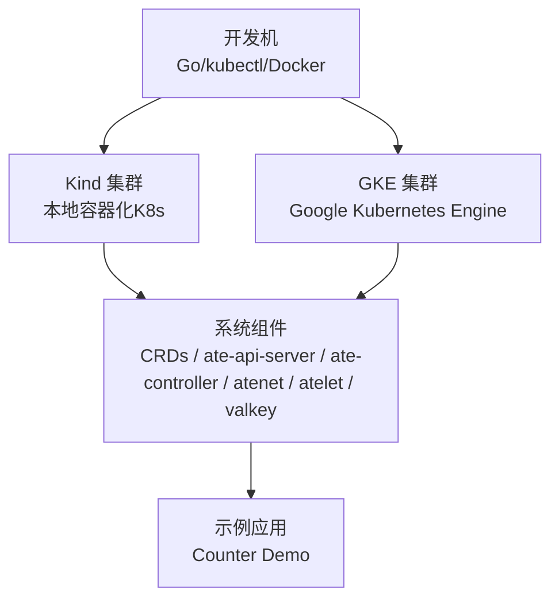
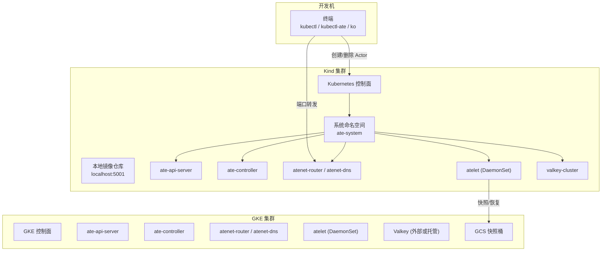
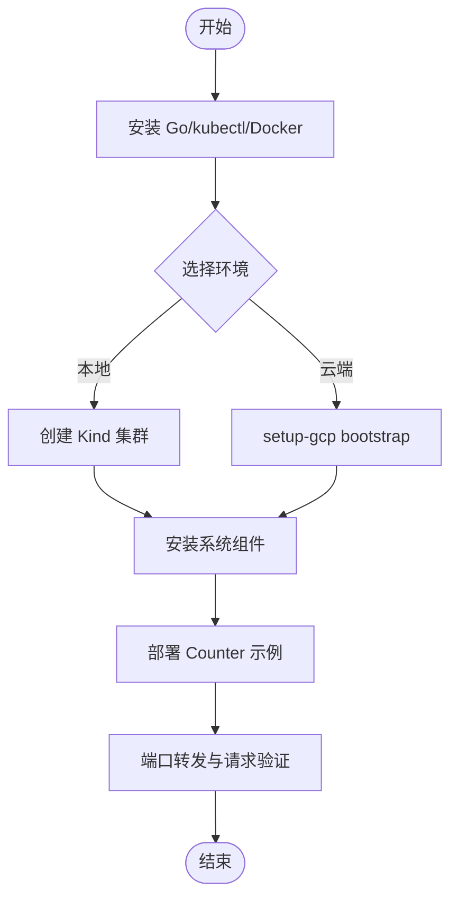

# 快速开始

<cite>
**本文引用的文件**
- [README.md](file://README.md)
- [create-kind-cluster.sh](file://hack/create-kind-cluster.sh)
- [install-ate-kind.sh](file://hack/install-ate-kind.sh)
- [install-ate.sh](file://hack/install-ate.sh)
- [delete-kind-cluster.sh](file://hack/delete-kind-cluster.sh)
- [teardown.sh](file://hack/teardown.sh)
- [counter README](file://demos/counter/README.md)
- [counter.yaml.tmpl](file://demos/counter/counter.yaml.tmpl)
- [setup-gcp README](file://tools/setup-gcp/README.md)
</cite>

## 目录
1. [简介](#简介)
2. [项目结构](#项目结构)
3. [核心组件](#核心组件)
4. [架构总览](#架构总览)
5. [详细组件分析](#详细组件分析)
6. [依赖关系分析](#依赖关系分析)
7. [性能与扩展性考虑](#性能与扩展性考虑)
8. [故障排除指南](#故障排除指南)
9. [结论](#结论)
10. [附录：端到端示例（Counter）](#附录端到端示例counter)

## 简介
本指南面向首次接触 Agent Substrate 的开发者，提供从环境准备到本地与云端部署的完整路径。你将学会：
- 安装 Go、kubectl、Docker 等前置依赖
- 使用 Kind 在本地搭建 Kubernetes 集群并部署系统组件
- 在 GKE 上完成资源准备、IAM 配置与集群初始化
- 通过 Counter 示例完成从模板定义、实例创建到网络路由配置的端到端流程
- 常见问题的定位与修复

## 项目结构
仓库提供了用于本地与云端的脚本、清单与示例应用，便于快速上手：
- hack 目录：包含本地 Kind 集群创建、一键安装、清理等脚本
- manifests/ate-install：系统组件的 Kustomize 与基础清单
- demos/counter：Counter 示例的模板与说明
- tools/setup-gcp：GCP 资源自动化准备工具



图表来源
- [README.md:97-193](file://README.md#L97-L193)
- [install-ate.sh:267-310](file://hack/install-ate.sh#L267-L310)

章节来源
- [README.md:97-193](file://README.md#L97-L193)

## 核心组件
Agent Substrate 的核心由以下组件构成：
- CRDs：WorkerPool、ActorTemplate、SandboxConfig 等自定义资源
- ate-api-server：控制面 API 服务，管理 Actor 生命周期与调度
- ate-controller：控制器，协调 WorkerPool 与 ActorTemplate 等资源
- atenet：网络层，提供 DNS、Envoy 路由与代理 Sidecar
- atelet：节点级守护进程，负责工作 Pod 监督、快照与状态迁移
- Valkey：内存数据库，作为会话与状态存储后端

这些组件通过安装脚本统一编排部署，支持 Kind 与 GKE 两种运行环境。

章节来源
- [install-ate.sh:267-310](file://hack/install-ate.sh#L267-L310)
- [install-ate.sh:327-374](file://hack/install-ate.sh#L327-L374)

## 架构总览
下图展示了本地与云端部署的整体交互：



图表来源
- [install-ate.sh:267-310](file://hack/install-ate.sh#L267-L310)
- [install-ate.sh:327-374](file://hack/install-ate.sh#L327-L374)
- [install-ate.sh:147-167](file://hack/install-ate.sh#L147-L167)

## 详细组件分析

### 本地开发环境（Kind）
- 前置依赖
  - 安装 Go、kubectl、Docker
  - 其他依赖（如 kind）将通过脚本自动管理
- 创建 Kind 集群与本地镜像仓库
  - 脚本会检测 /dev/kvm 以决定是否启用 micro-VM 支持
  - 为 gVisor 开启 Proxy ARP，确保 Pod 间网络连通
  - 将本地镜像仓库注册到每个节点，并在 kube-public 中记录
- 安装系统组件
  - 使用 install-ate-kind.sh 调用 install-ate.sh，设置 KO_DOCKER_REPO 指向本地仓库
  - 渲染 Kustomize 覆盖并构建镜像，应用 CRDs 与系统组件
- 安装示例应用
  - 使用 install-ate.sh --deploy-demo-counter 构建并部署 Counter 示例
- 安装 CLI 插件
  - go install ./cmd/kubectl-ate 以便使用 kubectl ate 子命令

章节来源
- [README.md:97-128](file://README.md#L97-L128)
- [create-kind-cluster.sh:26-139](file://hack/create-kind-cluster.sh#L26-L139)
- [install-ate-kind.sh:17-39](file://hack/install-ate-kind.sh#L17-L39)
- [install-ate.sh:147-167](file://hack/install-ate.sh#L147-L167)

### 云平台快速部署（GKE）
- 环境准备
  - 复制并编辑 .ate-dev-env.sh，source 后设置 PROJECT_ID、CLUSTER_NAME、CLUSTER_LOCATION 等
  - 使用 gcloud auth application-default login 配置 ADC
- 自动化资源准备
  - 执行 go run ./tools/setup-gcp bootstrap，依次启用 API、创建 GKE 集群、GCS 桶、IAM 绑定、Dashboard
- 部署系统组件
  - 在项目根目录执行 ./hack/install-ate.sh --deploy-ate-system
- 部署示例应用
  - 执行 ./hack/install-ate.sh --deploy-demo-counter

章节来源
- [README.md:130-175](file://README.md#L130-L175)
- [setup-gcp README:1-175](file://tools/setup-gcp/README.md#L1-L175)
- [install-ate.sh:267-310](file://hack/install-ate.sh#L267-L310)

### 示例应用：Counter 端到端流程
- 模板定义
  - WorkerPool 指定 ateomImage 与副本数
  - ActorTemplate 定义容器镜像、就绪探针、卷挂载、快照策略与持久化目录
  - 快照位置通过环境变量注入 GCS 桶路径
- 创建 atespace 与 Actor
  - 使用 kubectl-ate 创建 atespace 与 actor
- 网络路由
  - 通过 port-forward 暴露 atenet-router 的 Service，使用 Host 头访问具体 Actor
- 验证与清理
  - 发送 HTTP 请求递增计数器，查看 Actor 状态，手动 suspend/resume，最后删除

章节来源
- [counter README:1-116](file://demos/counter/README.md#L1-L116)
- [counter.yaml.tmpl:15-62](file://demos/counter/counter.yaml.tmpl#L15-L62)

## 依赖关系分析
- 安装脚本依赖
  - create-kind-cluster.sh：创建 Kind 集群、配置节点特性与本地镜像仓库
  - install-ate-kind.sh：设置 KO 与 ATE_INSTALL_KIND 标志，调用 install-ate.sh
  - install-ate.sh：解析参数、渲染清单、等待组件就绪、处理演示与清理
- 示例依赖
  - counter.yaml.tmpl：引用 ateomImage、pause 镜像、snapshot location 与 volumes
- 云端依赖
  - setup-gcp：按顺序启用 API、创建集群、桶、IAM 绑定与 Dashboard



图表来源
- [create-kind-cluster.sh:26-139](file://hack/create-kind-cluster.sh#L26-L139)
- [install-ate-kind.sh:17-39](file://hack/install-ate-kind.sh#L17-L39)
- [install-ate.sh:267-310](file://hack/install-ate.sh#L267-L310)
- [setup-gcp README:128-175](file://tools/setup-gcp/README.md#L128-L175)

章节来源
- [install-ate.sh:549-606](file://hack/install-ate.sh#L549-L606)
- [install-ate.sh:147-167](file://hack/install-ate.sh#L147-L167)

## 性能与扩展性考虑
- 多路复用：通过较少的 Worker Pod 承载大量 Actor，提升资源利用率
- 快照策略：ActorTemplate 中的 snapshotsConfig 可配置暂停时 Full 快照与提交时 Data 快照，平衡性能与一致性
- 网络层：atenet 提供高效的路由与 DNS，减少控制面参与，降低延迟
- 存储后端：Valkey 作为会话与状态存储，配合快照落盘实现高吞吐与持久化

[本节为通用指导，不直接分析具体文件]

## 故障排除指南
- 无法连接到本地镜像仓库
  - 确认 create-kind-cluster.sh 已将 localhost:5001 注册到各节点，且 registry 容器处于运行状态
  - 检查 kube-public ConfigMap 是否已写入 localRegistryHosting.v1
- 网络不通或 Pod 间无法通信
  - 确认已在节点上启用 Proxy ARP（gVisor loopback 场景）
  - 若启用 micro-VM，确认 /dev/kvm 权限与节点标签 ate.dev/sandboxClass=microvm
- 组件未就绪
  - 使用 rollout status 等待 ate-api-server、ate-controller、atenet-router、valkey-cluster、atelet 就绪
  - 若 JWT 模式，确认 ClusterTrustBundle 与 service-dns-ca-pool 已生成
- 删除失败或卡住
  - 使用 prepare_actor_for_delete 逻辑将 Actor 转为 SUSPENDED 后再删除
  - 使用 delete-all 或对应 demo 的 delete 选项清理
- 清理资源
  - 本地：./hack/delete-kind-cluster.sh 删除 Kind 集群与本地 registry
  - 云端：./hack/teardown.sh --all 按逆序删除 IAM、桶、节点池与集群

章节来源
- [create-kind-cluster.sh:94-139](file://hack/create-kind-cluster.sh#L94-L139)
- [install-ate.sh:304-310](file://hack/install-ate.sh#L304-L310)
- [install-ate.sh:376-424](file://hack/install-ate.sh#L376-L424)
- [install-ate.sh:499-507](file://hack/install-ate.sh#L499-L507)
- [delete-kind-cluster.sh:33-49](file://hack/delete-kind-cluster.sh#L33-L49)
- [teardown.sh:102-125](file://hack/teardown.sh#L102-L125)

## 结论
通过以上步骤，你可以在本地 Kind 或云端 GKE 上快速搭建 Agent Substrate，并使用 Counter 示例体验 Actor 的生命周期管理与网络路由。建议结合 observability 与 benchmarking 文档进一步探索监控与压测能力。

[本节为总结，不直接分析具体文件]

## 附录：端到端示例（Counter）

### 环境与前置
- 本地
  - 安装 Go、kubectl、Docker
  - 创建 Kind 集群与本地镜像仓库
  - 安装系统组件与示例应用
- 云端
  - 配置 .ate-dev-env.sh 与 ADC
  - 执行 setup-gcp bootstrap
  - 安装系统组件与示例应用

章节来源
- [README.md:97-128](file://README.md#L97-L128)
- [README.md:130-175](file://README.md#L130-L175)

### 模板与资源
- WorkerPool：指定 ateomImage 与副本数
- ActorTemplate：定义容器镜像、就绪探针、卷挂载、快照策略与持久化目录
- 快照位置：通过环境变量注入 GCS 桶路径

章节来源
- [counter.yaml.tmpl:15-62](file://demos/counter/counter.yaml.tmpl#L15-L62)

### 操作序列
```mermaid
sequenceDiagram
participant Dev as "开发者"
participant K8s as "Kubernetes"
participant Router as "atenet-router"
participant Actor as "Counter Actor"
Dev->>K8s : 创建 atespace
Dev->>K8s : 创建 Actor基于模板
Dev->>Router : 端口转发 8000 : 80
Dev->>Router : POST / 带 Host 头
Router->>Actor : 激活/恢复并转发请求
Actor-->>Router : 返回计数结果
Router-->>Dev : 响应
Dev->>K8s : 查看 Actor 状态
Dev->>K8s : 手动 suspend/resume
Dev->>K8s : 删除 Actor 与 atespace
```

图表来源
- [counter README:32-79](file://demos/counter/README.md#L32-L79)
- [install-ate.sh:376-424](file://hack/install-ate.sh#L376-L424)

### 输出示例（参考）
- 创建 atespace 与 Actor 成功后，kubectl 会返回资源创建信息
- 端口转发后，curl 请求应返回递增的计数值
- 查看 Actor 状态时，应显示 RUNNING 或 SUSPENDED 等状态枚举

章节来源
- [counter README:56-79](file://demos/counter/README.md#L56-L79)
