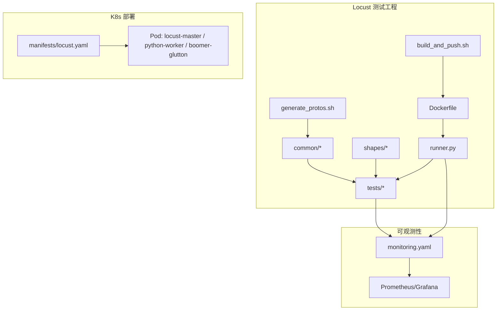
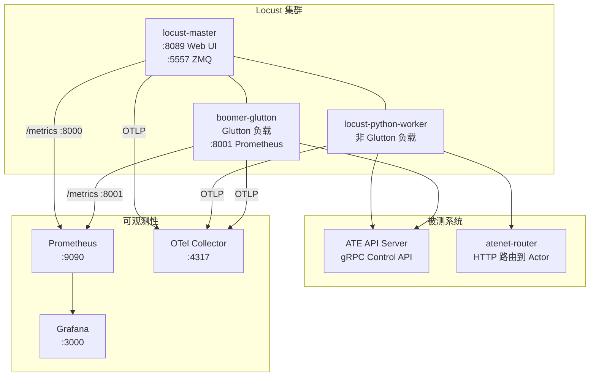
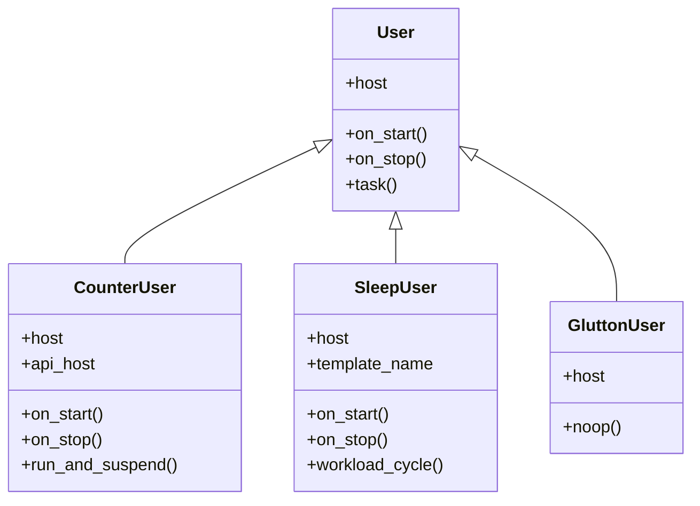
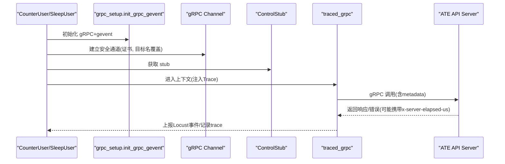
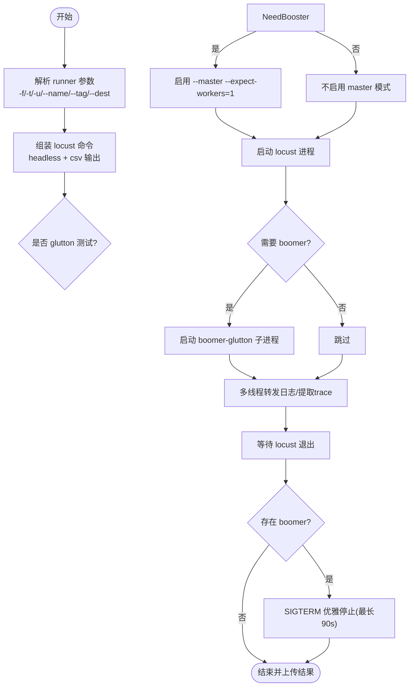
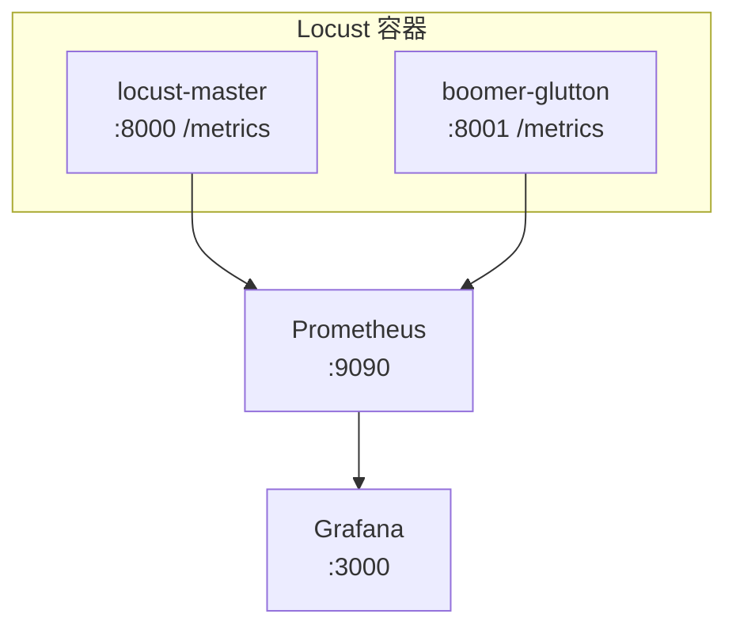
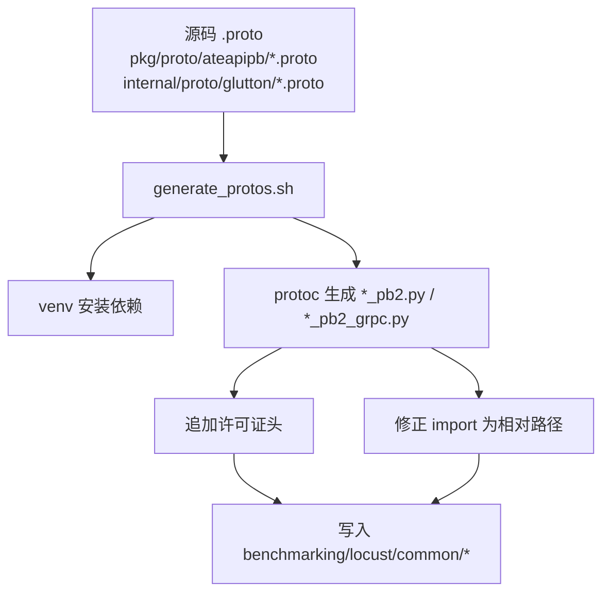
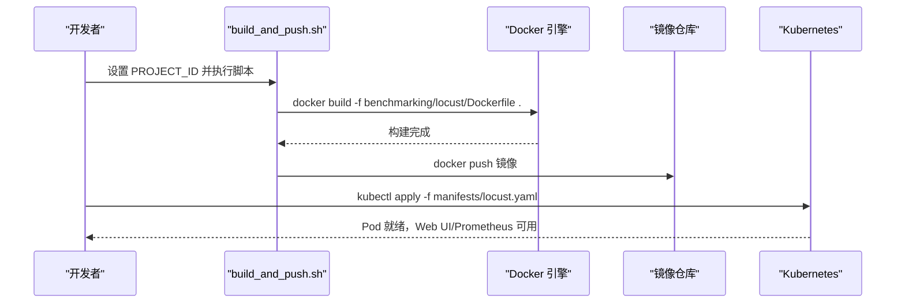
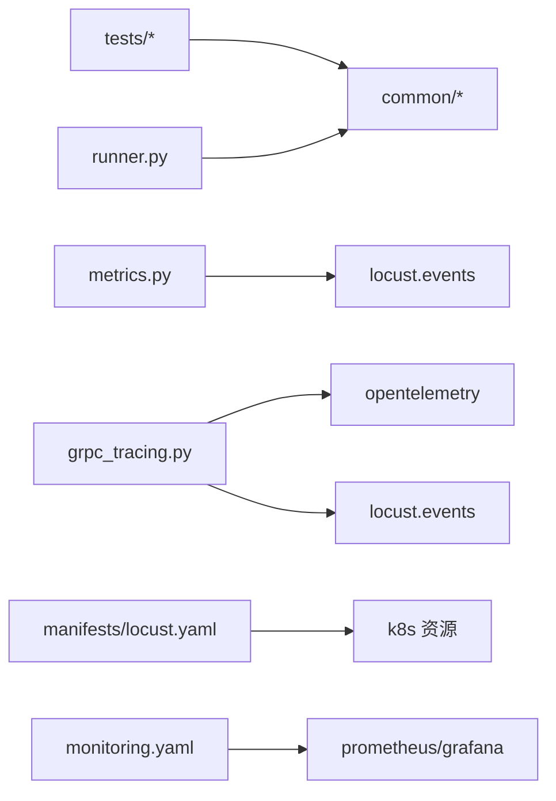

# Locust负载测试框架

<cite>
**本文引用的文件**   
- [runner.py](file://benchmarking/locust/runner.py)
- [grpc_setup.py](file://benchmarking/locust/common/grpc_setup.py)
- [counter_demo.py](file://benchmarking/locust/tests/counter_demo.py)
- [sleep.py](file://benchmarking/locust/tests/sleep.py)
- [glutton.py](file://benchmarking/locust/tests/glutton.py)
- [generate_protos.sh](file://benchmarking/locust/generate_protos.sh)
- [build_and_push.sh](file://benchmarking/locust/build_and_push.sh)
- [Dockerfile](file://benchmarking/locust/Dockerfile)
- [metrics.py](file://benchmarking/locust/common/metrics.py)
- [wait_time.py](file://benchmarking/locust/common/wait_time.py)
- [atespace.py](file://benchmarking/locust/common/atespace.py)
- [grpc_tracing.py](file://benchmarking/locust/common/grpc_tracing.py)
- [burst_shape.py](file://benchmarking/locust/shapes/burst_shape.py)
- [locust.yaml](file://benchmarking/locust/manifests/locust.yaml)
- [monitoring.yaml](file://benchmarking/monitoring.yaml)
</cite>

## 目录
1. [简介](#简介)
2. [项目结构](#项目结构)
3. [核心组件](#核心组件)
4. [架构总览](#架构总览)
5. [详细组件分析](#详细组件分析)
6. [依赖关系分析](#依赖关系分析)
7. [性能考量](#性能考量)
8. [故障排查指南](#故障排查指南)
9. [结论](#结论)
10. [附录](#附录)

## 简介
本文件系统性介绍 Substrate 仓库中基于 Locust 的负载测试框架实现，重点覆盖：
- Locust 用户类定义与行为模式（CounterUser、SleepUser、GluttonUser）
- gRPC 客户端集成（protobuf 生成、连接管理、请求构造、追踪与指标上报）
- 测试场景配置（用户数、并发策略、请求频率、等待时间等）
- Docker 镜像构建与部署流程（依赖安装、代码打包、镜像推送）
- 监控指标收集与导出（Prometheus metrics 暴露与采集）

该框架以 Python + Locust 为主控，结合 OpenTelemetry 与 Prometheus 进行可观测性建设；对高吞吐场景通过 Go 实现的 boomer-glutton 作为专用 worker 提供 GluttonUser 负载。

## 项目结构
Locust 相关代码集中在 benchmarking/locust 目录下，按职责分层组织：
- common：通用能力（gRPC 初始化、Tracing、Metrics、ATESPACE 初始化、等待时间策略、Boomer 配置）
- tests：具体负载用例（CounterUser、SleepUser、GluttonUser 等）
- shapes：自定义负载形状（如 BurstShape）
- manifests：Kubernetes 部署清单（包含 master、python-worker、boomer-glutton 三容器 Pod）
- runner.py：无头运行器，负责启动 locust、可选 boomer、输出日志/统计并上传结果
- Dockerfile：多阶段构建（Python 依赖、Go 二进制、distroless 运行时）
- generate_protos.sh：从源码 .proto 生成 Python gRPC 客户端到 common 包
- build_and_push.sh：一键构建并推送镜像

图表来源
- [Dockerfile:1-49](file://benchmarking/locust/Dockerfile#L1-L49)
- [runner.py:1-393](file://benchmarking/locust/runner.py#L1-L393)
- [generate_protos.sh:1-86](file://benchmarking/locust/generate_protos.sh#L1-L86)
- [build_and_push.sh:1-43](file://benchmarking/locust/build_and_push.sh#L1-L43)
- [locust.yaml:1-165](file://benchmarking/locust/manifests/locust.yaml#L1-L165)
- [monitoring.yaml:1-574](file://benchmarking/monitoring.yaml#L1-L574)

章节来源
- [Dockerfile:1-49](file://benchmarking/locust/Dockerfile#L1-L49)
- [runner.py:1-393](file://benchmarking/locust/runner.py#L1-L393)
- [generate_protos.sh:1-86](file://benchmarking/locust/generate_protos.sh#L1-L86)
- [build_and_push.sh:1-43](file://benchmarking/locust/build_and_push.sh#L1-L43)
- [locust.yaml:1-165](file://benchmarking/locust/manifests/locust.yaml#L1-L165)
- [monitoring.yaml:1-574](file://benchmarking/monitoring.yaml#L1-L574)

## 核心组件
- 无头运行器 runner.py：编排 locust 与可选 boomer-glutton，转发日志、抽取 trace 记录、将 CSV 统计转为 JSONL 并上传至本地或 GCS。
- gRPC 客户端集成：
  - grpc_setup.init_grpc_gevent：在 gevent 环境下初始化 gRPC 协程支持，避免阻塞其他 greenlet。
  - grpc_tracing.traced_grpc：统一包装 gRPC 调用，注入 W3C Trace Context，上报 Locust request 事件，优先使用服务端上报耗时。
  - atespace.ensure_atespace：幂等创建共享 atespace，失败仅忽略 ALREADY_EXISTS。
- 用户类与任务：
  - CounterUser：创建 Actor -> HTTP 调用 Router -> SuspendActor，带 Tracing 与 Metrics。
  - SleepUser：周期性 Suspend/Resume 循环，模拟工作负载切换。
  - GluttonUser：占位声明，真实负载由 boomer-glutton 承担。
- 等待时间与负载形状：
  - wait_time.dynamic_wait_time：基于命令行参数动态计算任务间隔。
  - burst_shape.BurstShape：周期脉冲式加压。
- 指标与追踪：
  - metrics.init_metrics：启动 prometheus_client HTTP 服务，注册 OTel PrometheusReader，定义计数器、直方图、上下计数器。
  - trace：OpenTelemetry 初始化与 tracer 获取。

章节来源
- [runner.py:1-393](file://benchmarking/locust/runner.py#L1-L393)
- [grpc_setup.py:1-38](file://benchmarking/locust/common/grpc_setup.py#L1-L38)
- [grpc_tracing.py:1-123](file://benchmarking/locust/common/grpc_tracing.py#L1-L123)
- [atespace.py:1-53](file://benchmarking/locust/common/atespace.py#L1-L53)
- [counter_demo.py:1-182](file://benchmarking/locust/tests/counter_demo.py#L1-L182)
- [sleep.py:1-124](file://benchmarking/locust/tests/sleep.py#L1-L124)
- [glutton.py:1-45](file://benchmarking/locust/tests/glutton.py#L1-L45)
- [wait_time.py:1-54](file://benchmarking/locust/common/wait_time.py#L1-L54)
- [burst_shape.py:1-41](file://benchmarking/locust/shapes/burst_shape.py#L1-L41)
- [metrics.py:1-104](file://benchmarking/locust/common/metrics.py#L1-L104)

## 架构总览
下图展示了 Locust 主控、Python Worker、Go Boomer Worker 以及被测系统（ATE API/Router）之间的交互关系，以及指标与追踪数据的流向。

图表来源
- [locust.yaml:1-165](file://benchmarking/locust/manifests/locust.yaml#L1-L165)
- [monitoring.yaml:1-574](file://benchmarking/monitoring.yaml#L1-L574)
- [metrics.py:1-104](file://benchmarking/locust/common/metrics.py#L1-L104)

## 详细组件分析

### 用户类与负载行为模式
- CounterUser
  - 生命周期：on_start 建立 gRPC 安全通道、确保 atespace、创建 Actor；on_stop 挂起并关闭资源。
  - 任务：ResumeActor -> HTTP RunCounter（经 Router，Host 头绑定 Actor）-> SuspendActor。
  - 可观测性：traced_grpc 包装 gRPC 调用，手动上报 HTTP 请求事件，附带 user_class 标签。
- SleepUser
  - 生命周期：on_start 建立 gRPC 通道、确保 atespace、创建 Actor；on_stop 挂起并删除 Actor。
  - 任务：SuspendActor -> sleep -> ResumeActor 循环。
- GluttonUser
  - 仅用于 class-picker 枚举；实际负载由 boomer-glutton 承担，Python 侧 noop。

图表来源
- [counter_demo.py:1-182](file://benchmarking/locust/tests/counter_demo.py#L1-L182)
- [sleep.py:1-124](file://benchmarking/locust/tests/sleep.py#L1-L124)
- [glutton.py:1-45](file://benchmarking/locust/tests/glutton.py#L1-L45)

章节来源
- [counter_demo.py:1-182](file://benchmarking/locust/tests/counter_demo.py#L1-L182)
- [sleep.py:1-124](file://benchmarking/locust/tests/sleep.py#L1-L124)
- [glutton.py:1-45](file://benchmarking/locust/tests/glutton.py#L1-L45)

### gRPC 客户端集成
- gRPC 与 gevent 协同
  - init_grpc_gevent：在 Locust 导入后、任何 channel 创建前调用，避免 C 扩展线程阻塞 gevent 调度。
- 连接管理
  - 使用 mTLS 证书（/run/servicedns-ca/ca.crt），设置 ssl_target_name_override，创建 secure_channel 与 stub。
- 请求构造与追踪
  - traced_grpc：注入 W3C Trace Context，优先读取服务端 x-server-elapsed-us trailer 作为延迟，上报 Locust request 事件，并在采样时输出 trace_id。
- ATESPACE 幂等初始化
  - ensure_atespace：CreateAtespace 忽略 ALREADY_EXISTS，保证并发安全。

图表来源
- [grpc_setup.py:1-38](file://benchmarking/locust/common/grpc_setup.py#L1-L38)
- [grpc_tracing.py:1-123](file://benchmarking/locust/common/grpc_tracing.py#L1-L123)
- [atespace.py:1-53](file://benchmarking/locust/common/atespace.py#L1-L53)
- [counter_demo.py:1-182](file://benchmarking/locust/tests/counter_demo.py#L1-L182)
- [sleep.py:1-124](file://benchmarking/locust/tests/sleep.py#L1-L124)

章节来源
- [grpc_setup.py:1-38](file://benchmarking/locust/common/grpc_setup.py#L1-L38)
- [grpc_tracing.py:1-123](file://benchmarking/locust/common/grpc_tracing.py#L1-L123)
- [atespace.py:1-53](file://benchmarking/locust/common/atespace.py#L1-L53)
- [counter_demo.py:1-182](file://benchmarking/locust/tests/counter_demo.py#L1-L182)
- [sleep.py:1-124](file://benchmarking/locust/tests/sleep.py#L1-L124)

### 测试场景配置方法
- 用户数量与持续时间
  - 通过 runner.py 参数 -u（用户数）、-t（运行时长）控制。
- 并发策略与负载形状
  - 使用 --shape=... 指定自定义形状（如 burst_shape.BurstShape），实现周期脉冲加压。
- 请求频率与等待时间
  - 通过 --min-wait-time/--max-wait-time 或环境变量 LOCUST_MIN_WAIT_TIME/LOCUST_MAX_WAIT_TIME 控制任务间随机等待。
- 选择用户类
  - 使用 --class-picker 在 Web UI 中选择不同 User 类执行。
- 额外参数透传
  - runner.py 支持 --name、--tag、--dest 及任意 locust 额外参数。

图表来源
- [runner.py:1-393](file://benchmarking/locust/runner.py#L1-L393)
- [burst_shape.py:1-41](file://benchmarking/locust/shapes/burst_shape.py#L1-L41)
- [wait_time.py:1-54](file://benchmarking/locust/common/wait_time.py#L1-L54)

章节来源
- [runner.py:1-393](file://benchmarking/locust/runner.py#L1-L393)
- [burst_shape.py:1-41](file://benchmarking/locust/shapes/burst_shape.py#L1-L41)
- [wait_time.py:1-54](file://benchmarking/locust/common/wait_time.py#L1-L54)

### 监控指标与导出配置
- 指标定义
  - locust_requests_total：请求总数（按 method/name/status/user_class 维度）。
  - locust_request_duration_milliseconds：请求延迟直方图（毫秒）。
  - locust_users：活跃用户数（按 user_class 维度）。
- 暴露方式
  - prometheus_client.start_http_server(8000) 暴露 /metrics。
  - OTel PrometheusMetricReader 同时注册，便于统一采集。
- 采集与可视化
  - Kubernetes Service 暴露 8000（主）与 8001（boomer）端口。
  - monitoring.yaml 部署 Prometheus 抓取 benchmarking 命名空间下带注解的 Pod，Grafana 预置多个 Dashboard。

图表来源
- [metrics.py:1-104](file://benchmarking/locust/common/metrics.py#L1-L104)
- [locust.yaml:1-165](file://benchmarking/locust/manifests/locust.yaml#L1-L165)
- [monitoring.yaml:1-574](file://benchmarking/monitoring.yaml#L1-L574)

章节来源
- [metrics.py:1-104](file://benchmarking/locust/common/metrics.py#L1-L104)
- [locust.yaml:1-165](file://benchmarking/locust/manifests/locust.yaml#L1-L165)
- [monitoring.yaml:1-574](file://benchmarking/monitoring.yaml#L1-L574)

### protobuf 生成与 gRPC 客户端
- 生成脚本
  - generate_protos.sh 在虚拟环境中安装 grpcio-tools，从 pkg/proto/ateapipb 与 internal/proto/glutton 生成 Python 客户端到 benchmarking/locust/common。
  - 自动添加许可证头，并将绝对 import 改写为相对 import，适配 common 包结构。
- 产物
  - ateapi_pb2.py / ateapi_pb2_grpc.py
  - glutton_pb2.py / glutton_pb2_grpc.py

图表来源
- [generate_protos.sh:1-86](file://benchmarking/locust/generate_protos.sh#L1-L86)

章节来源
- [generate_protos.sh:1-86](file://benchmarking/locust/generate_protos.sh#L1-L86)

### Docker 镜像构建与部署
- 构建步骤
  - 准备环境：设置 PROJECT_ID 环境变量。
  - 执行 build_and_push.sh：以仓库根为构建上下文，编译 Go 二进制并打包 Python 依赖，最终产出 distroless 镜像。
  - 推送镜像到私有仓库。
- 镜像内容
  - Stage1：Python 依赖安装到 /app/deps。
  - Stage2：CGO_ENABLED=0 编译 boomer-glutton 纯 Go 二进制。
  - Stage3：distroless 基础镜像，复制 Python 依赖、Go 二进制、Locust 代码与 runner。
- 部署
  - 使用 manifests/locust.yaml 部署三容器 Pod（master、python-worker、boomer-glutton），挂载 CA 证书卷，暴露 Web UI、ZMQ、Prometheus 端口。
  - 通过 Service 聚合端口，供 Prometheus 抓取与外部访问。

图表来源
- [build_and_push.sh:1-43](file://benchmarking/locust/build_and_push.sh#L1-L43)
- [Dockerfile:1-49](file://benchmarking/locust/Dockerfile#L1-L49)
- [locust.yaml:1-165](file://benchmarking/locust/manifests/locust.yaml#L1-L165)

章节来源
- [build_and_push.sh:1-43](file://benchmarking/locust/build_and_push.sh#L1-L43)
- [Dockerfile:1-49](file://benchmarking/locust/Dockerfile#L1-L49)
- [locust.yaml:1-165](file://benchmarking/locust/manifests/locust.yaml#L1-L165)

## 依赖关系分析
- 模块内耦合
  - tests 依赖 common（gRPC 初始化、Tracing、Metrics、ATESPACE、等待时间）。
  - runner 依赖 common.boomer_config 与 subprocess 管理子进程。
  - metrics 监听 locust events.request，形成松耦合的事件驱动上报。
- 外部依赖
  - gRPC + gevent 协同需显式初始化。
  - Prometheus client 与 OTel PrometheusReader 并存，分别暴露本地 HTTP 与 OTLP 导出。
  - Kubernetes 部署依赖 ServiceAccount、RBAC、ConfigMap 等资源。

图表来源
- [counter_demo.py:1-182](file://benchmarking/locust/tests/counter_demo.py#L1-L182)
- [sleep.py:1-124](file://benchmarking/locust/tests/sleep.py#L1-L124)
- [grpc_tracing.py:1-123](file://benchmarking/locust/common/grpc_tracing.py#L1-L123)
- [metrics.py:1-104](file://benchmarking/locust/common/metrics.py#L1-L104)
- [locust.yaml:1-165](file://benchmarking/locust/manifests/locust.yaml#L1-L165)
- [monitoring.yaml:1-574](file://benchmarking/monitoring.yaml#L1-L574)

章节来源
- [counter_demo.py:1-182](file://benchmarking/locust/tests/counter_demo.py#L1-L182)
- [sleep.py:1-124](file://benchmarking/locust/tests/sleep.py#L1-L124)
- [grpc_tracing.py:1-123](file://benchmarking/locust/common/grpc_tracing.py#L1-L123)
- [metrics.py:1-104](file://benchmarking/locust/common/metrics.py#L1-L104)
- [locust.yaml:1-165](file://benchmarking/locust/manifests/locust.yaml#L1-L165)
- [monitoring.yaml:1-574](file://benchmarking/monitoring.yaml#L1-L574)

## 性能考量
- gRPC 与 gevent 协同：必须在创建任何 gRPC 通道前调用 init_grpc_gevent，否则 C 层原生线程会阻塞 gevent 调度，导致整体吞吐下降。
- 服务端延迟优先：traced_grpc 优先采用 x-server-elapsed-us trailer，避免客户端调度抖动影响延迟评估。
- 指标粒度：request 事件附带 user_class、status 等标签，利于区分不同用户类的 QPS 与延迟分布。
- 负载形状：BurstShape 适合短时冲击测试，注意 spawn_rate 与 peak_users 的平衡，避免瞬时过载。
- 资源限制：manifests 中设置了 CPU/Memory requests，建议根据压测规模调整副本与资源配额。

[本节为通用指导，无需特定文件引用]

## 故障排查指南
- 无法建立 gRPC 连接
  - 检查 CA 证书卷挂载路径 /run/servicedns-ca/ca.crt 是否存在。
  - 确认 ssl_target_name_override 与服务端证书 CN/SAN 匹配。
- 指标未暴露
  - 确认 metrics.init_metrics 已调用且 start_http_server 成功监听 8000。
  - 检查 Service 端口映射与 Prometheus 抓取规则。
- 日志缺失或 trace 未记录
  - 确认 traced_grpc 被正确包裹 gRPC 调用，且在采样时输出 trace_id。
  - 检查 runner.py 的日志转发线程是否正常启动。
- Glutton 负载未生效
  - 确认 Python worker 设置了 LOCUST_NO_GLUTTON_USER=1，避免重复加载 GluttonUser。
  - 检查 boomer-glutton 是否能连接到 master 的 ZMQ 端口 5557。

章节来源
- [grpc_setup.py:1-38](file://benchmarking/locust/common/grpc_setup.py#L1-L38)
- [grpc_tracing.py:1-123](file://benchmarking/locust/common/grpc_tracing.py#L1-L123)
- [metrics.py:1-104](file://benchmarking/locust/common/metrics.py#L1-L104)
- [runner.py:1-393](file://benchmarking/locust/runner.py#L1-L393)
- [locust.yaml:1-165](file://benchmarking/locust/manifests/locust.yaml#L1-L165)

## 结论
该框架以 Locust 为核心，结合 OpenTelemetry 与 Prometheus 构建了端到端的可观测性体系；通过 gRPC 与 HTTP 混合调用模式，覆盖了 ATE API 与 Router 的关键路径。针对高吞吐场景引入 Go 实现的 boomer-glutton，有效提升了 GluttonUser 的负载能力。完善的构建与部署脚本使得镜像生产与集群部署标准化，便于持续集成与自动化压测。

[本节为总结性内容，无需特定文件引用]

## 附录
- 常用运行参数
  - -f：测试文件路径（tests 目录）
  - -t：运行时长
  - -u：用户数
  - --shape：负载形状类
  - --min-wait-time/--max-wait-time：任务间隔范围
  - --class-picker：选择用户类
  - --name/--tag/--dest：结果命名与存储位置
- 关键端口
  - 8000：Locust 主节点 Prometheus
  - 8001：boomer-glutton Prometheus
  - 8089：Locust Web UI
  - 5557：ZMQ（master-worker）

[本节为补充信息，无需特定文件引用]
