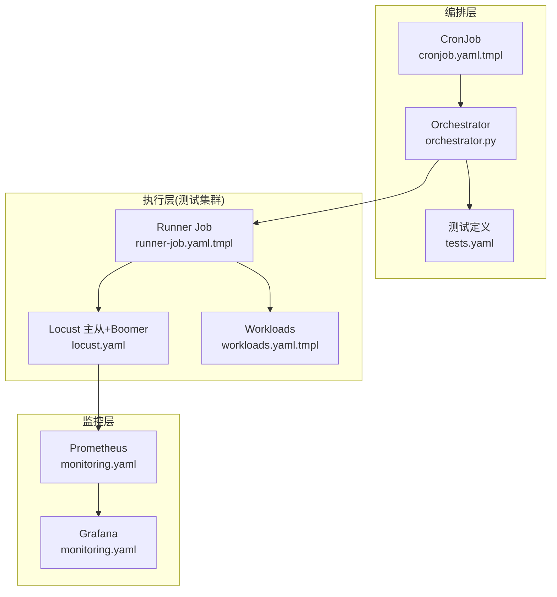
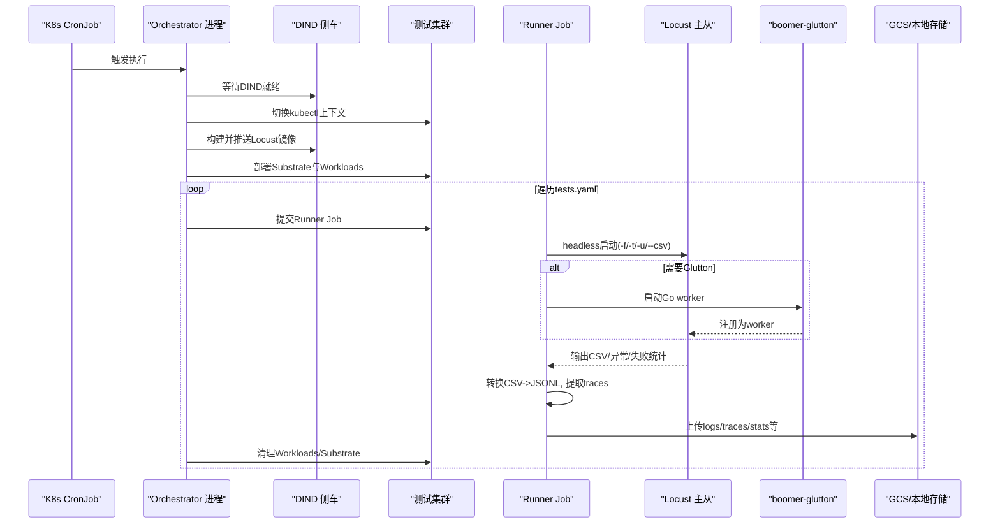
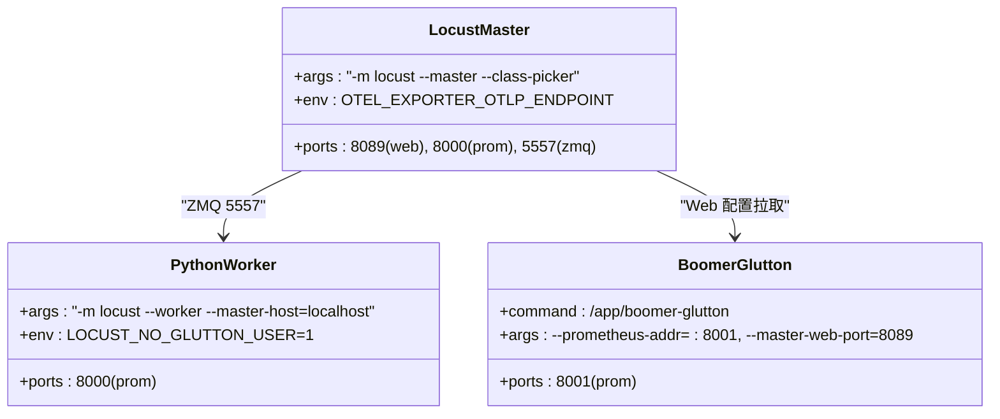
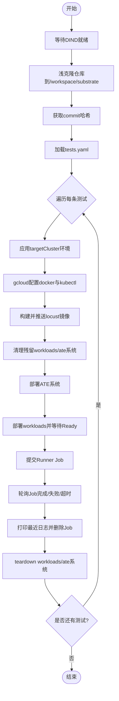
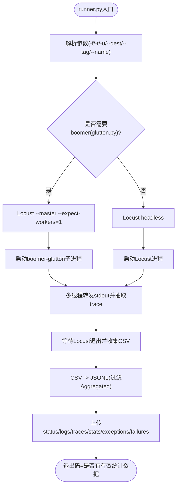
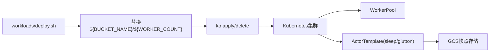
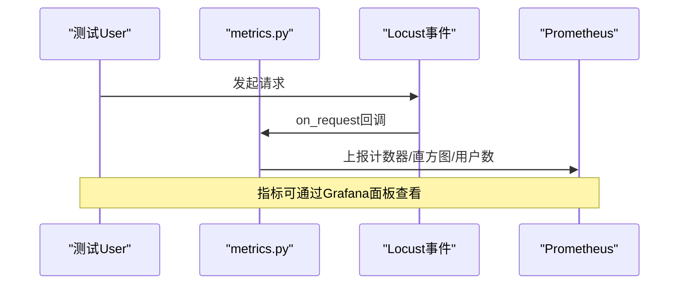
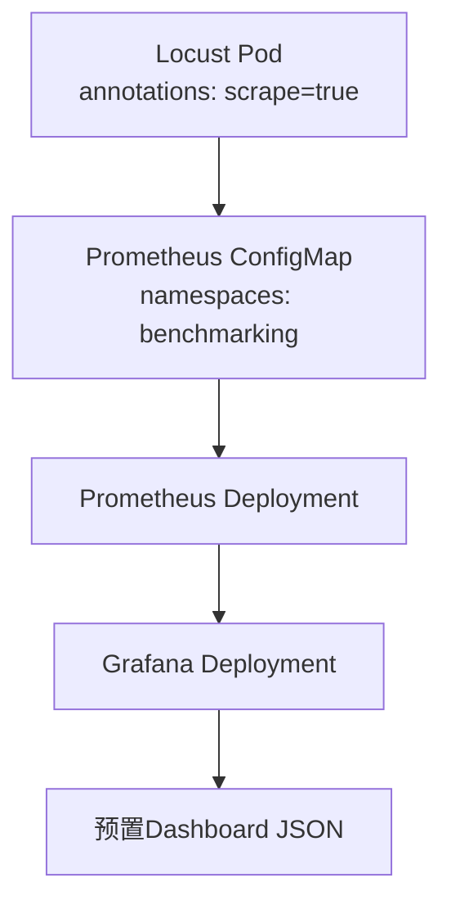
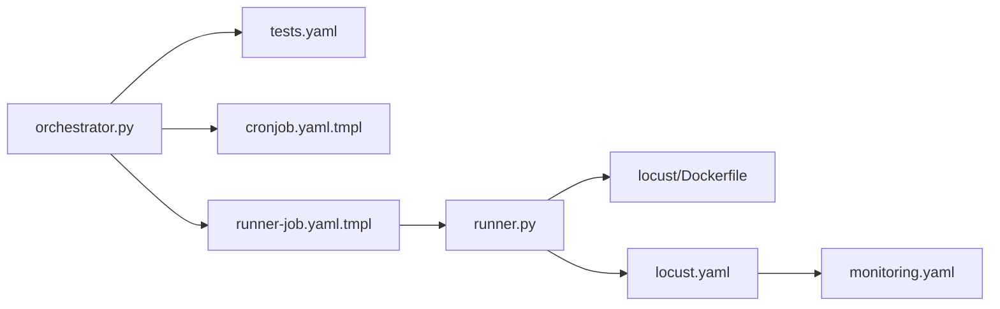

# 基准测试框架

<cite>
**本文引用的文件**   
- [benchmarking/README.md](file://benchmarking/README.md)
- [benchmarking/automation/README.md](file://benchmarking/automation/README.md)
- [benchmarking/automation/orchestrator.py](file://benchmarking/automation/orchestrator.py)
- [benchmarking/automation/tests.yaml](file://benchmarking/automation/tests.yaml)
- [benchmarking/automation/manifests/cronjob.yaml.tmpl](file://benchmarking/automation/manifests/cronjob.yaml.tmpl)
- [benchmarking/automation/manifests/runner-job.yaml.tmpl](file://benchmarking/automation/manifests/runner-job.yaml.tmpl)
- [benchmarking/locust/Dockerfile](file://benchmarking/locust/Dockerfile)
- [benchmarking/locust/deploy.sh](file://benchmarking/locust/deploy.sh)
- [benchmarking/locust/manifests/locust.yaml](file://benchmarking/locust/manifests/locust.yaml)
- [benchmarking/locust/runner.py](file://benchmarking/locust/runner.py)
- [benchmarking/locust/tests/glutton.py](file://benchmarking/locust/tests/glutton.py)
- [benchmarking/locust/common/grpc_setup.py](file://benchmarking/locust/common/grpc_setup.py)
- [benchmarking/locust/common/metrics.py](file://benchmarking/locust/common/metrics.py)
- [benchmarking/workloads/deploy.sh](file://benchmarking/workloads/deploy.sh)
- [benchmarking/workloads/manifests/workloads.yaml.tmpl](file://benchmarking/workloads/manifests/workloads.yaml.tmpl)
- [benchmarking/monitoring.yaml](file://benchmarking/monitoring.yaml)
</cite>

## 目录
1. [简介](#简介)
2. [项目结构](#项目结构)
3. [核心组件](#核心组件)
4. [架构总览](#架构总览)
5. [详细组件分析](#详细组件分析)
6. [依赖关系分析](#依赖关系分析)
7. [性能与可扩展性](#性能与可扩展性)
8. [故障排查指南](#故障排查指南)
9. [结论](#结论)
10. [附录](#附录)

## 简介
本仓库的基准测试框架围绕 Substrate 的性能评估展开，采用 Locust 作为负载生成器，结合 Go 实现的 boomer-glutton 高并发工作节点，通过 Kubernetes CronJob 编排自动化执行、结果收集与上报。框架支持：
- 在本地或 CI 环境中快速部署 Locust 并运行负载测试
- 使用自动化编排器（orchestrator）按批次调度多组测试用例，构建镜像、部署被测系统、执行测试、清理环境并上传结果
- 集成 Prometheus/Grafana 进行指标采集与可视化
- 提供 gRPC 客户端集成与 OpenTelemetry 追踪能力

## 项目结构
基准测试相关代码集中在 benchmarking 目录下，主要包含：
- locust：Locust 主从容器镜像构建、部署清单、无头运行器、测试脚本与公共库
- automation：自动化编排器、CronJob 模板、Runner Job 模板、测试列表
- workloads：被测工作负载的部署脚本与模板
- monitoring.yaml：Prometheus 与 Grafana 的一键安装清单

图表来源
- [benchmarking/automation/manifests/cronjob.yaml.tmpl:1-99](file://benchmarking/automation/manifests/cronjob.yaml.tmpl#L1-L99)
- [benchmarking/automation/orchestrator.py:1-441](file://benchmarking/automation/orchestrator.py#L1-L441)
- [benchmarking/automation/tests.yaml:1-83](file://benchmarking/automation/tests.yaml#L1-L83)
- [benchmarking/automation/manifests/runner-job.yaml.tmpl:1-88](file://benchmarking/automation/manifests/runner-job.yaml.tmpl#L1-L88)
- [benchmarking/locust/manifests/locust.yaml:1-165](file://benchmarking/locust/manifests/locust.yaml#L1-L165)
- [benchmarking/workloads/manifests/workloads.yaml.tmpl:1-78](file://benchmarking/workloads/manifests/workloads.yaml.tmpl#L1-L78)
- [benchmarking/monitoring.yaml:1-574](file://benchmarking/monitoring.yaml#L1-L574)

章节来源
- [benchmarking/README.md:1-90](file://benchmarking/README.md#L1-L90)

## 核心组件
- Locust 主从与工作节点
  - 主节点暴露 Web UI 与 /metrics；Python Worker 负责非 Glutton 场景；Go Boomer 实现高性能 GluttonUser
- 自动化编排器
  - 基于 CronJob 触发，克隆指定分支，构建并推送 Locust 镜像，部署被测系统与 Workloads，逐条执行 tests.yaml 中的用例，收集结果并上传
- Runner 无头执行器
  - 以 headless 模式启动 Locust，必要时拉起 boomer-glutton，解析日志提取 trace，将 CSV 转为 JSONL 并上传到 GCS 或本地路径
- 监控与可视化
  - Prometheus 抓取 Locust 与 Boomer 的 /metrics，Grafana 预置仪表盘展示 QPS、延迟分布与活跃用户数

章节来源
- [benchmarking/locust/manifests/locust.yaml:15-165](file://benchmarking/locust/manifests/locust.yaml#L15-L165)
- [benchmarking/automation/orchestrator.py:1-441](file://benchmarking/automation/orchestrator.py#L1-L441)
- [benchmarking/locust/runner.py:1-393](file://benchmarking/locust/runner.py#L1-L393)
- [benchmarking/monitoring.yaml:1-574](file://benchmarking/monitoring.yaml#L1-L574)

## 架构总览
下图展示了从定时任务触发到测试结果落盘的端到端流程。

图表来源
- [benchmarking/automation/manifests/cronjob.yaml.tmpl:1-99](file://benchmarking/automation/manifests/cronjob.yaml.tmpl#L1-L99)
- [benchmarking/automation/orchestrator.py:150-441](file://benchmarking/automation/orchestrator.py#L150-L441)
- [benchmarking/automation/manifests/runner-job.yaml.tmpl:1-88](file://benchmarking/automation/manifests/runner-job.yaml.tmpl#L1-L88)
- [benchmarking/locust/runner.py:170-393](file://benchmarking/locust/runner.py#L170-L393)
- [benchmarking/locust/manifests/locust.yaml:15-165](file://benchmarking/locust/manifests/locust.yaml#L15-L165)

## 详细组件分析

### Locust 负载测试框架部署与配置
- 镜像构建
  - 多阶段构建：Python 依赖缓存、Go boomer-glutton 二进制编译、最终 distroless 镜像打包 Python 环境与 Go 二进制
- 部署方式
  - 通过 deploy.sh 渲染并应用 locust.yaml，创建命名空间与 Deployment/Service
  - Pod 内三容器共享网络命名空间：locust-master、locust-python-worker、boomer-glutton
- 关键端口与指标
  - Web UI: 8089；Prometheus 指标: 8000（主）、8001（boomer）
  - ZMQ 通信: 5557（主从连接）
- 环境变量与证书
  - OTEL_EXPORTER_OTLP_ENDPOINT 指向集群内置 OTel Collector
  - 挂载 clusterTrustBundle 用于访问受保护服务

图表来源
- [benchmarking/locust/Dockerfile:1-49](file://benchmarking/locust/Dockerfile#L1-L49)
- [benchmarking/locust/deploy.sh:1-83](file://benchmarking/locust/deploy.sh#L1-L83)
- [benchmarking/locust/manifests/locust.yaml:15-165](file://benchmarking/locust/manifests/locust.yaml#L15-L165)

章节来源
- [benchmarking/locust/Dockerfile:1-49](file://benchmarking/locust/Dockerfile#L1-L49)
- [benchmarking/locust/deploy.sh:1-83](file://benchmarking/locust/deploy.sh#L1-L83)
- [benchmarking/locust/manifests/locust.yaml:15-165](file://benchmarking/locust/manifests/locust.yaml#L15-L165)

### 自动化测试编排器
- 触发与准备
  - CronJob 在编排集群上运行，initContainer 启动 DIND，主容器 orchestrator.py 等待 Docker 可用后克隆仓库
- 目标集群切换
  - 根据 tests.yaml 的 targetCluster 字段，复制对应 .ate-dev-env.sh 并设置 gcloud/docker/kubectl 上下文
- 构建与部署
  - 构建 locust-test:<commit> 镜像并推送至 KO_DOCKER_REPO
  - 调用 hack/install-ate.sh 部署 ATE 系统，再部署 workloads
- 测试执行与清理
  - 为每个用例渲染 runner-job.yaml.tmpl 并提交 Job，轮询状态、打印日志、删除 Job
  - 每次测试前后均 teardown 以确保隔离

图表来源
- [benchmarking/automation/orchestrator.py:170-441](file://benchmarking/automation/orchestrator.py#L170-L441)
- [benchmarking/automation/manifests/cronjob.yaml.tmpl:1-99](file://benchmarking/automation/manifests/cronjob.yaml.tmpl#L1-L99)
- [benchmarking/automation/tests.yaml:1-83](file://benchmarking/automation/tests.yaml#L1-L83)

章节来源
- [benchmarking/automation/README.md:1-137](file://benchmarking/automation/README.md#L1-L137)
- [benchmarking/automation/orchestrator.py:1-441](file://benchmarking/automation/orchestrator.py#L1-L441)
- [benchmarking/automation/manifests/cronjob.yaml.tmpl:1-99](file://benchmarking/automation/manifests/cronjob.yaml.tmpl#L1-L99)
- [benchmarking/automation/manifests/runner-job.yaml.tmpl:1-88](file://benchmarking/automation/manifests/runner-job.yaml.tmpl#L1-L88)
- [benchmarking/automation/tests.yaml:1-83](file://benchmarking/automation/tests.yaml#L1-L83)

### 无头执行器与结果收集
- 执行模式
  - 当测试为 glutton.py 时，以 master 模式运行 Locust 并等待一个 worker（boomer），否则普通 headless 模式
- 日志与追踪
  - 并行线程转发子进程 stdout，匹配特定格式行写入 traces.txt（TSV）
- 指标导出
  - 将 stats.csv 转换为 JSONL，保留时间戳、tag、test_name、metric 与 measurements
- 结果上传
  - 支持 gs:// 与本地路径两种目标，统一上传 logs、traces、stats、异常与失败记录

图表来源
- [benchmarking/locust/runner.py:170-393](file://benchmarking/locust/runner.py#L170-L393)

章节来源
- [benchmarking/locust/runner.py:1-393](file://benchmarking/locust/runner.py#L1-L393)

### 测试环境搭建与管理
- 工作负载部署
  - 通过 workloads/deploy.sh 渲染 workloads.yaml.tmpl，使用 ko apply 部署 WorkerPool 与 ActorTemplate
  - 支持 --worker-count 控制 WorkerPool 副本数
- 资源与快照
  - ActorTemplate 指定 pauseImage 与容器镜像，snapshot 位置指向 GCS bucket
- 一键安装与卸载
  - 顶层 install-ate.sh 提供 --deploy-benchmarks / --delete-benchmarks 选项

图表来源
- [benchmarking/workloads/deploy.sh:1-108](file://benchmarking/workloads/deploy.sh#L1-L108)
- [benchmarking/workloads/manifests/workloads.yaml.tmpl:1-78](file://benchmarking/workloads/manifests/workloads.yaml.tmpl#L1-L78)

章节来源
- [benchmarking/workloads/deploy.sh:1-108](file://benchmarking/workloads/deploy.sh#L1-L108)
- [benchmarking/workloads/manifests/workloads.yaml.tmpl:1-78](file://benchmarking/workloads/manifests/workloads.yaml.tmpl#L1-L78)
- [benchmarking/README.md:1-90](file://benchmarking/README.md#L1-L90)

### 测试脚本开发指南
- Python 测试用例
  - 参考 glutton.py：声明 User 类与 @task，按需初始化 boomer 配置
- gRPC 客户端集成
  - 使用 common/grpc_setup.py 在 gevent 环境下初始化 gRPC，避免阻塞其他协程
- 性能指标定义
  - 使用 common/metrics.py 提供的计数器、直方图与上下计数，配合 events.request 钩子自动上报
- 追踪
  - 通过 OTEL_EXPORTER_OTLP_ENDPOINT 接入集群 OTel Collector；runner.py 会解析日志中的 trace_id 并输出 traces.txt

图表来源
- [benchmarking/locust/tests/glutton.py:1-45](file://benchmarking/locust/tests/glutton.py#L1-L45)
- [benchmarking/locust/common/grpc_setup.py:1-38](file://benchmarking/locust/common/grpc_setup.py#L1-L38)
- [benchmarking/locust/common/metrics.py:1-104](file://benchmarking/locust/common/metrics.py#L1-L104)

章节来源
- [benchmarking/locust/tests/glutton.py:1-45](file://benchmarking/locust/tests/glutton.py#L1-L45)
- [benchmarking/locust/common/grpc_setup.py:1-38](file://benchmarking/locust/common/grpc_setup.py#L1-L38)
- [benchmarking/locust/common/metrics.py:1-104](file://benchmarking/locust/common/metrics.py#L1-L104)

### 监控系统集成（Prometheus + Grafana）
- 安装与访问
  - 应用 monitoring.yaml 后，通过 port-forward 访问 Grafana
- 抓取策略
  - 基于 Pod 注解 prometheus.io/scrape=true 与端口，仅抓取 benchmarking 命名空间下的 Pod
- 仪表盘
  - 预置 ATE API、Counter Demo、Workloads Benchmarking 三类面板，展示 QPS、P99 延迟热力图与活跃用户数

图表来源
- [benchmarking/monitoring.yaml:1-574](file://benchmarking/monitoring.yaml#L1-L574)
- [benchmarking/locust/manifests/locust.yaml:43-46](file://benchmarking/locust/manifests/locust.yaml#L43-L46)

章节来源
- [benchmarking/monitoring.yaml:1-574](file://benchmarking/monitoring.yaml#L1-L574)
- [benchmarking/README.md:64-79](file://benchmarking/README.md#L64-L79)

## 依赖关系分析
- 组件耦合
  - orchestrator.py 强依赖 tests.yaml 与目标集群环境脚本；runner.py 依赖 Locust 输出格式与 boomer-glutton 二进制
  - locust.yaml 中三个容器共享网络命名空间，通过 localhost 与端口协作
- 外部依赖
  - gcloud、kubectl、ko、docker（DIND）、OTel Collector、GCS（可选）
- 潜在循环依赖
  - 无直接循环；编排器与执行器职责清晰分离

图表来源
- [benchmarking/automation/orchestrator.py:1-441](file://benchmarking/automation/orchestrator.py#L1-L441)
- [benchmarking/automation/tests.yaml:1-83](file://benchmarking/automation/tests.yaml#L1-L83)
- [benchmarking/automation/manifests/cronjob.yaml.tmpl:1-99](file://benchmarking/automation/manifests/cronjob.yaml.tmpl#L1-L99)
- [benchmarking/automation/manifests/runner-job.yaml.tmpl:1-88](file://benchmarking/automation/manifests/runner-job.yaml.tmpl#L1-L88)
- [benchmarking/locust/runner.py:1-393](file://benchmarking/locust/runner.py#L1-L393)
- [benchmarking/locust/Dockerfile:1-49](file://benchmarking/locust/Dockerfile#L1-L49)
- [benchmarking/locust/manifests/locust.yaml:1-165](file://benchmarking/locust/manifests/locust.yaml#L1-L165)
- [benchmarking/monitoring.yaml:1-574](file://benchmarking/monitoring.yaml#L1-L574)

## 性能与可扩展性
- 高并发模型
  - Go boomer-glutton 作为独立 worker 承担 GluttonUser 压力，避免 Python/gevent 瓶颈
- 指标粒度
  - 请求级计数器与直方图，附带 user_class/name/status 标签，便于多维分析
- 扩展建议
  - 增加更多用户类与形状（shapes）以模拟不同流量模型
  - 引入更细粒度的分布式追踪采样策略与采样率动态调整

[本节为通用指导，不直接分析具体文件]

## 故障排查指南
- 常见错误定位
  - 未设置必要环境变量（如 PROJECT_ID、BUCKET_NAME）导致部署失败
  - DIND 未就绪导致镜像构建失败
  - 目标集群权限不足（IAM 绑定缺失）导致无法管理集群资源或上传结果
- 日志与结果
  - 查看 runner 日志与 traces.txt 定位慢请求与失败原因
  - 检查 Prometheus 抓取是否正常，确认 Pod 注解与端口映射
- 恢复步骤
  - 清理残留 Job 与命名空间资源，重新执行编排器或手动触发 CronJob

章节来源
- [benchmarking/automation/README.md:87-130](file://benchmarking/automation/README.md#L87-L130)
- [benchmarking/locust/runner.py:307-393](file://benchmarking/locust/runner.py#L307-L393)
- [benchmarking/monitoring.yaml:58-85](file://benchmarking/monitoring.yaml#L58-L85)

## 结论
该基准测试框架以 Kubernetes 为中心，将 Locust 与高性能 Go 工作节点结合，并通过编排器实现可重复、可观测、可归档的端到端压测流水线。借助 Prometheus/Grafana 与 OpenTelemetry，团队能够快速发现性能回归并定位根因。建议在持续集成中常态化运行，并结合业务特性定制测试形状与指标口径。

[本节为总结性内容，不直接分析具体文件]

## 附录
- 快速上手
  - 本地部署 Locust：参考 README 中的 kubectl port-forward 与 Web UI 操作
  - 启用监控：应用 monitoring.yaml 后访问 Grafana
- 开发提示
  - 重建 gRPC Python 客户端：遵循 README 的 venv 与 requirements 说明

章节来源
- [benchmarking/README.md:45-90](file://benchmarking/README.md#L45-L90)
