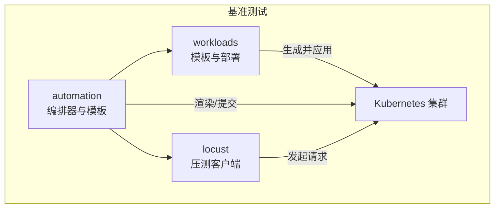
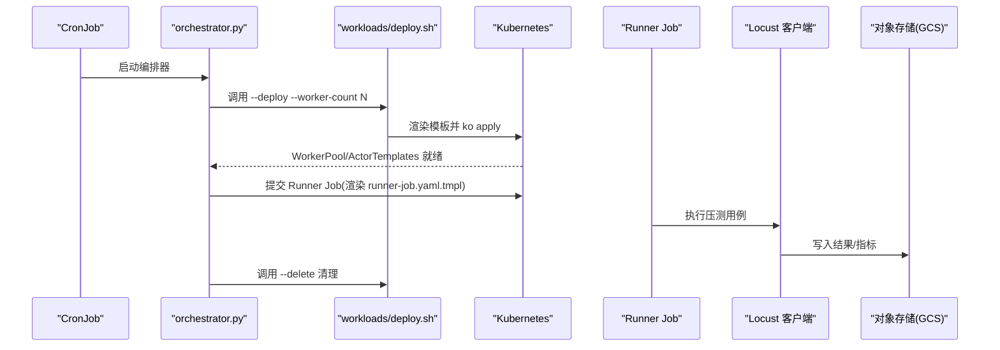
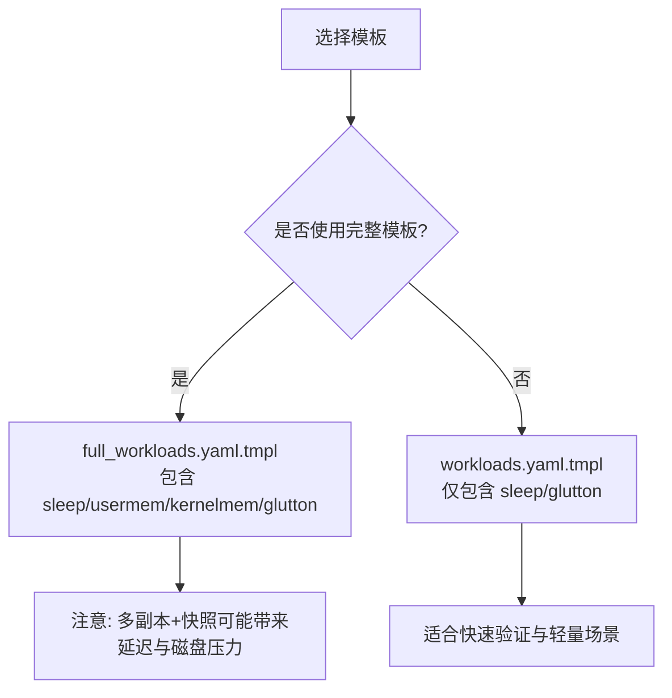
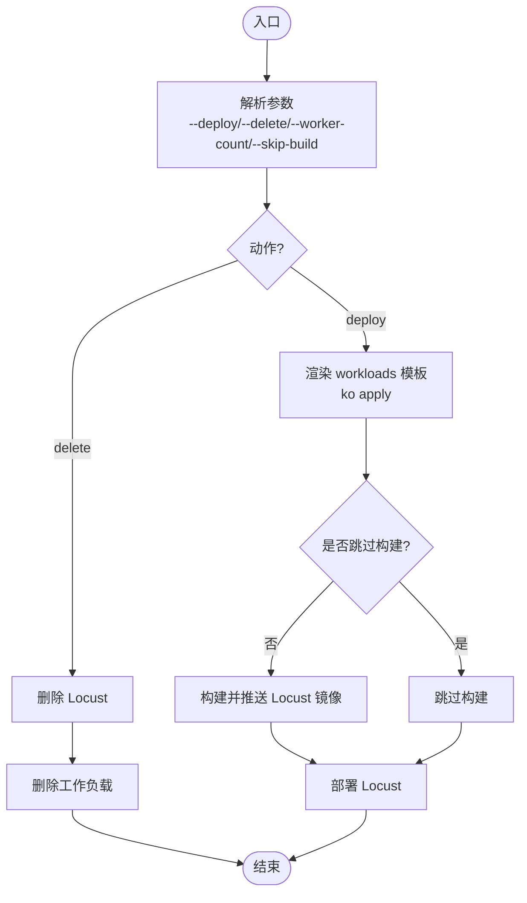
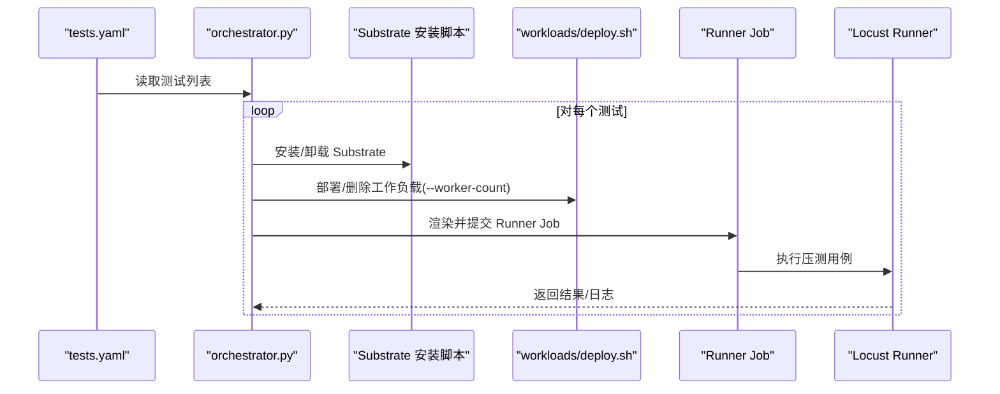
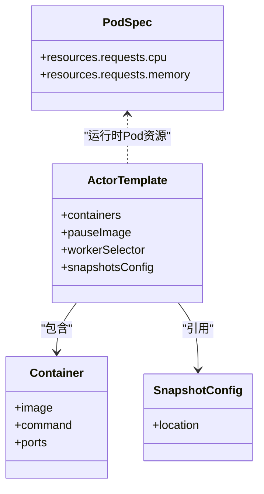
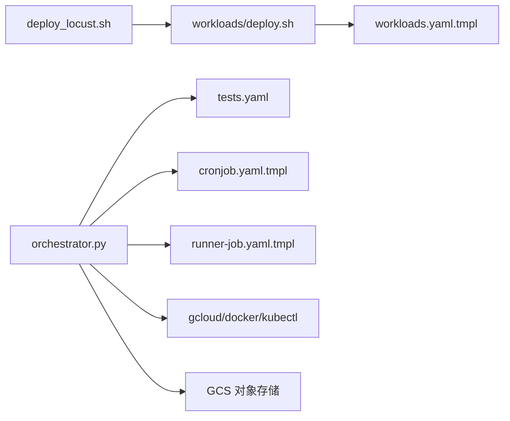

# 测试工作负载

<cite>
**本文引用的文件**   
- [benchmarking/README.md](file://benchmarking/README.md)
- [benchmarking/deploy_locust.sh](file://benchmarking/deploy_locust.sh)
- [benchmarking/workloads/deploy.sh](file://benchmarking/workloads/deploy.sh)
- [benchmarking/workloads/manifests/workloads.yaml.tmpl](file://benchmarking/workloads/manifests/workloads.yaml.tmpl)
- [benchmarking/workloads/manifests/full_workloads.yaml.tmpl](file://benchmarking/workloads/manifests/full_workloads.yaml.tmpl)
- [benchmarking/automation/orchestrator.py](file://benchmarking/automation/orchestrator.py)
- [benchmarking/automation/tests.yaml](file://benchmarking/automation/tests.yaml)
- [benchmarking/automation/manifests/cronjob.yaml.tmpl](file://benchmarking/automation/manifests/cronjob.yaml.tmpl)
- [benchmarking/automation/manifests/runner-job.yaml.tmpl](file://benchmarking/automation/manifests/runner-job.yaml.tmpl)
</cite>

## 目录
1. [简介](#简介)
2. [项目结构](#项目结构)
3. [核心组件](#核心组件)
4. [架构总览](#架构总览)
5. [详细组件分析](#详细组件分析)
6. [依赖关系分析](#依赖关系分析)
7. [性能考虑](#性能考虑)
8. [故障排查指南](#故障排查指南)
9. [结论](#结论)
10. [附录](#附录)

## 简介
本文件聚焦于基准测试中使用的工作负载定义与管理，覆盖以下主题：
- 工作负载 YAML 模板与参数化机制（含 FullWorkloads 与基础 Workloads 的差异）
- 部署脚本与自动化流程（参数替换、资源创建、状态监控）
- 工作负载的资源规格定义（CPU、内存、存储等配置与限制）
- 自定义工作负载开发指南（新增测试场景、依赖管理、版本控制）
- 性能调优建议与最佳实践

## 项目结构
基准测试相关代码位于 benchmarking 目录下，关键路径如下：
- workloads：工作负载模板与部署脚本
- automation：自动化编排器、CronJob/Runner Job 模板与测试清单
- locust：压测客户端与部署脚本（与本主题关联较少，但参与整体流程）

图表来源
- [benchmarking/workloads/deploy.sh:1-108](file://benchmarking/workloads/deploy.sh#L1-L108)
- [benchmarking/automation/orchestrator.py:1-441](file://benchmarking/automation/orchestrator.py#L1-L441)
- [benchmarking/automation/manifests/cronjob.yaml.tmpl:1-99](file://benchmarking/automation/manifests/cronjob.yaml.tmpl#L1-L99)
- [benchmarking/automation/manifests/runner-job.yaml.tmpl:1-88](file://benchmarking/automation/manifests/runner-job.yaml.tmpl#L1-L88)

章节来源
- [benchmarking/README.md:1-90](file://benchmarking/README.md#L1-L90)

## 核心组件
- 工作负载模板
  - 基础模板：workloads.yaml.tmpl，包含 Namespace、WorkerPool、ActorTemplate（sleep、glutton）
  - 完整模板：full_workloads.yaml.tmpl，在基础之上增加 usermem、kernelmem 等更重的工作负载
- 部署脚本
  - workloads/deploy.sh：读取环境变量，替换模板占位符，通过 ko apply/delete 创建或删除资源
  - deploy_locust.sh：端到端编排，先部署工作负载，再构建/推送 Locust 镜像，最后部署 Locust
- 自动化编排器
  - orchestrator.py：按 tests.yaml 逐条执行测试；为每个目标集群准备环境、构建镜像、部署 Substrate 与工作负载、等待就绪、运行 Runner Job、清理资源
  - CronJob/Runner Job 模板：提供定时任务与单次测试任务的 Kubernetes 资源模板

章节来源
- [benchmarking/workloads/manifests/workloads.yaml.tmpl:1-78](file://benchmarking/workloads/manifests/workloads.yaml.tmpl#L1-L78)
- [benchmarking/workloads/manifests/full_workloads.yaml.tmpl:1-122](file://benchmarking/workloads/manifests/full_workloads.yaml.tmpl#L1-L122)
- [benchmarking/workloads/deploy.sh:1-108](file://benchmarking/workloads/deploy.sh#L1-L108)
- [benchmarking/deploy_locust.sh:1-96](file://benchmarking/deploy_locust.sh#L1-L96)
- [benchmarking/automation/orchestrator.py:1-441](file://benchmarking/automation/orchestrator.py#L1-L441)
- [benchmarking/automation/tests.yaml:1-83](file://benchmarking/automation/tests.yaml#L1-L83)
- [benchmarking/automation/manifests/cronjob.yaml.tmpl:1-99](file://benchmarking/automation/manifests/cronjob.yaml.tmpl#L1-L99)
- [benchmarking/automation/manifests/runner-job.yaml.tmpl:1-88](file://benchmarking/automation/manifests/runner-job.yaml.tmpl#L1-L88)

## 架构总览
下图展示了从 CronJob 触发到工作负载部署、压测执行与结果落盘的端到端流程。

图表来源
- [benchmarking/automation/manifests/cronjob.yaml.tmpl:1-99](file://benchmarking/automation/manifests/cronjob.yaml.tmpl#L1-L99)
- [benchmarking/automation/orchestrator.py:275-337](file://benchmarking/automation/orchestrator.py#L275-L337)
- [benchmarking/workloads/deploy.sh:57-67](file://benchmarking/workloads/deploy.sh#L57-L67)
- [benchmarking/automation/manifests/runner-job.yaml.tmpl:1-88](file://benchmarking/automation/manifests/runner-job.yaml.tmpl#L1-L88)

## 详细组件分析

### 工作负载模板与差异（FullWorkloads vs 基础 Workloads）
- 基础模板（workloads.yaml.tmpl）
  - 定义 Namespace、WorkerPool、ActorTemplate（sleep、glutton）
  - 使用 ${WORKER_COUNT} 与 ${BUCKET_NAME} 占位符进行参数化
  - snapshotsConfig.location 指向 GCS 路径，用于快照持久化
- 完整模板（full_workloads.yaml.tmpl）
  - 在基础模板基础上增加 usermem、kernelmem 等更重的工作负载
  - 注释说明当前存在性能问题：多副本导致跨节点恢复时缓存命中率下降；磁盘空间不足导致非 sleep 工作负载无法完成快照
  - 建议在磁盘与调度优化后优先使用该模板

图表来源
- [benchmarking/workloads/manifests/full_workloads.yaml.tmpl:15-22](file://benchmarking/workloads/manifests/full_workloads.yaml.tmpl#L15-L22)
- [benchmarking/workloads/manifests/workloads.yaml.tmpl:1-78](file://benchmarking/workloads/manifests/workloads.yaml.tmpl#L1-L78)
- [benchmarking/workloads/manifests/full_workloads.yaml.tmpl:23-122](file://benchmarking/workloads/manifests/full_workloads.yaml.tmpl#L23-L122)

章节来源
- [benchmarking/workloads/manifests/workloads.yaml.tmpl:1-78](file://benchmarking/workloads/manifests/workloads.yaml.tmpl#L1-L78)
- [benchmarking/workloads/manifests/full_workloads.yaml.tmpl:1-122](file://benchmarking/workloads/manifests/full_workloads.yaml.tmpl#L1-L122)

### 部署脚本与参数替换
- workloads/deploy.sh
  - 支持 --deploy 与 --delete 两种动作
  - 支持 --worker-count N 指定 WorkerPool 副本数
  - 通过 sed 将 ${BUCKET_NAME} 与 ${WORKER_COUNT} 替换到模板中
  - 使用 ko apply/delete 处理 ko:// 引用，确保镜像解析后再交给 kubectl
- deploy_locust.sh
  - 封装端到端流程：先部署工作负载，再构建/推送 Locust 镜像，最后部署 Locust
  - 支持 --skip-build 跳过镜像构建，复用已有 :latest 镜像

图表来源
- [benchmarking/workloads/deploy.sh:41-67](file://benchmarking/workloads/deploy.sh#L41-L67)
- [benchmarking/deploy_locust.sh:31-95](file://benchmarking/deploy_locust.sh#L31-L95)

章节来源
- [benchmarking/workloads/deploy.sh:1-108](file://benchmarking/workloads/deploy.sh#L1-L108)
- [benchmarking/deploy_locust.sh:1-96](file://benchmarking/deploy_locust.sh#L1-L96)

### 自动化编排器与测试清单
- orchestrator.py
  - 根据 tests.yaml 逐项执行测试
  - 为每个 targetCluster 准备 .ate-dev-env.sh，设置 gcloud/docker/kubectl 上下文
  - 每次测试前后均 teardown 工作负载与 Substrate，避免污染
  - 渲染 runner-job.yaml.tmpl 并提交 Job，轮询 Job 状态并输出日志
- tests.yaml
  - 描述每个测试的名称、目标集群、用例文件、持续时间、并发用户数、可选 flags、可选 workerCount
- CronJob/Runner Job 模板
  - cronjob.yaml.tmpl：定义定时任务、DIND sidecar、挂载 ConfigMap（tests.yaml 与 target-clusters）
  - runner-job.yaml.tmpl：定义单个测试的 Job，注入 OTEL 环境变量与服务证书卷

图表来源
- [benchmarking/automation/orchestrator.py:275-337](file://benchmarking/automation/orchestrator.py#L275-L337)
- [benchmarking/automation/tests.yaml:1-83](file://benchmarking/automation/tests.yaml#L1-L83)
- [benchmarking/automation/manifests/cronjob.yaml.tmpl:1-99](file://benchmarking/automation/manifests/cronjob.yaml.tmpl#L1-L99)
- [benchmarking/automation/manifests/runner-job.yaml.tmpl:1-88](file://benchmarking/automation/manifests/runner-job.yaml.tmpl#L1-L88)

章节来源
- [benchmarking/automation/orchestrator.py:1-441](file://benchmarking/automation/orchestrator.py#L1-L441)
- [benchmarking/automation/tests.yaml:1-83](file://benchmarking/automation/tests.yaml#L1-L83)
- [benchmarking/automation/manifests/cronjob.yaml.tmpl:1-99](file://benchmarking/automation/manifests/cronjob.yaml.tmpl#L1-L99)
- [benchmarking/automation/manifests/runner-job.yaml.tmpl:1-88](file://benchmarking/automation/manifests/runner-job.yaml.tmpl#L1-L88)

### 工作负载的资源规格定义
- 工作负载容器资源
  - 在 ActorTemplate 的 containers 字段中可定义容器的命令、镜像、端口等
  - 快照存储通过 snapshotsConfig.location 指向 GCS 路径，由 ${BUCKET_NAME} 参数化
- 运行时 Pod 资源
  - CronJob 与 Runner Job 模板中定义了 requests.cpu 与 requests.memory，作为 Pod 资源请求
  - 这些值影响调度与配额，需结合集群容量与压测规模调整

图表来源
- [benchmarking/workloads/manifests/workloads.yaml.tmpl:36-78](file://benchmarking/workloads/manifests/workloads.yaml.tmpl#L36-L78)
- [benchmarking/workloads/manifests/full_workloads.yaml.tmpl:44-122](file://benchmarking/workloads/manifests/full_workloads.yaml.tmpl#L44-L122)
- [benchmarking/automation/manifests/cronjob.yaml.tmpl:86-90](file://benchmarking/automation/manifests/cronjob.yaml.tmpl#L86-L90)
- [benchmarking/automation/manifests/runner-job.yaml.tmpl:74-77](file://benchmarking/automation/manifests/runner-job.yaml.tmpl#L74-L77)

章节来源
- [benchmarking/workloads/manifests/workloads.yaml.tmpl:1-78](file://benchmarking/workloads/manifests/workloads.yaml.tmpl#L1-L78)
- [benchmarking/workloads/manifests/full_workloads.yaml.tmpl:1-122](file://benchmarking/workloads/manifests/full_workloads.yaml.tmpl#L1-L122)
- [benchmarking/automation/manifests/cronjob.yaml.tmpl:86-90](file://benchmarking/automation/manifests/cronjob.yaml.tmpl#L86-L90)
- [benchmarking/automation/manifests/runner-job.yaml.tmpl:74-77](file://benchmarking/automation/manifests/runner-job.yaml.tmpl#L74-L77)

### 自定义工作负载开发指南
- 新增工作负载步骤
  - 在工作负载模板中添加新的 ActorTemplate 条目，定义 pauseImage、containers、workerSelector 与 snapshotsConfig.location
  - 如需更多工作负载类型，参考 full_workloads.yaml.tmpl 中的 usermem、kernelmem 示例
  - 若需要固定 WorkerPool 引用而非标签选择，可参考 full_workloads.yaml.tmpl 中 glutton 的 workerPoolRef 用法
- 依赖管理
  - 容器镜像建议使用固定 digest（sha256），避免不可重现构建
  - 快照数据存放于 GCS，确保 ${BUCKET_NAME} 正确配置且具备读写权限
- 版本控制
  - 自动化流程会为每次构建打上 commit tag，便于结果回溯
  - 测试清单 tests.yaml 中可通过 flags 向 runner.py 传递额外参数，便于扩展行为
- 本地验证
  - 使用 deploy_locust.sh --deploy 一键部署工作负载与 Locust
  - 通过 Locust Web UI 手动触发测试或查看实时统计

章节来源
- [benchmarking/workloads/manifests/full_workloads.yaml.tmpl:60-122](file://benchmarking/workloads/manifests/full_workloads.yaml.tmpl#L60-L122)
- [benchmarking/workloads/manifests/workloads.yaml.tmpl:36-78](file://benchmarking/workloads/manifests/workloads.yaml.tmpl#L36-L78)
- [benchmarking/automation/tests.yaml:15-33](file://benchmarking/automation/tests.yaml#L15-L33)
- [benchmarking/deploy_locust.sh:69-84](file://benchmarking/deploy_locust.sh#L69-L84)

### 性能调优建议与最佳实践
- 工作负载模板选择
  - 当前 full_workloads.yaml.tmpl 在多副本与快照场景下存在性能瓶颈，建议仅在磁盘与调度优化后启用
- 副本与缓存
  - 减少不必要的多副本以避免跨节点恢复时的缓存缺失导致的延迟
- 快照与存储
  - 合理划分 GCS 路径并按工作负载隔离，避免热点竞争
- 资源请求
  - 根据压测规模调整 CronJob 与 Runner Job 的 CPU/内存 requests，确保稳定调度
- 镜像与构建
  - 使用 --skip-build 复用已有镜像以缩短流水线时间；生产环境建议固定镜像版本
- 观测与排障
  - 开启 OTEL 追踪，结合 Prometheus/Grafana 进行深入分析

章节来源
- [benchmarking/workloads/manifests/full_workloads.yaml.tmpl:15-22](file://benchmarking/workloads/manifests/full_workloads.yaml.tmpl#L15-L22)
- [benchmarking/automation/manifests/cronjob.yaml.tmpl:86-90](file://benchmarking/automation/manifests/cronjob.yaml.tmpl#L86-L90)
- [benchmarking/automation/manifests/runner-job.yaml.tmpl:68-77](file://benchmarking/automation/manifests/runner-job.yaml.tmpl#L68-L77)
- [benchmarking/deploy_locust.sh:73-80](file://benchmarking/deploy_locust.sh#L73-L80)

## 依赖关系分析
- 脚本与模板依赖
  - workloads/deploy.sh 依赖 workloads.yaml.tmpl 与 BUCKET_NAME 环境变量
  - deploy_locust.sh 依赖 workloads/deploy.sh 与 locust 构建/部署脚本
  - orchestrator.py 依赖 tests.yaml、cronjob.yaml.tmpl、runner-job.yaml.tmpl 以及目标集群配置
- 外部依赖
  - gcloud/docker/kubectl 工具链
  - GCS 对象存储（快照与结果）
  - OTEL 收集器（可选）

图表来源
- [benchmarking/workloads/deploy.sh:32-55](file://benchmarking/workloads/deploy.sh#L32-L55)
- [benchmarking/deploy_locust.sh:69-84](file://benchmarking/deploy_locust.sh#L69-L84)
- [benchmarking/automation/orchestrator.py:190-202](file://benchmarking/automation/orchestrator.py#L190-L202)
- [benchmarking/automation/tests.yaml:1-83](file://benchmarking/automation/tests.yaml#L1-L83)
- [benchmarking/automation/manifests/cronjob.yaml.tmpl:1-99](file://benchmarking/automation/manifests/cronjob.yaml.tmpl#L1-L99)
- [benchmarking/automation/manifests/runner-job.yaml.tmpl:1-88](file://benchmarking/automation/manifests/runner-job.yaml.tmpl#L1-L88)

章节来源
- [benchmarking/workloads/deploy.sh:1-108](file://benchmarking/workloads/deploy.sh#L1-L108)
- [benchmarking/deploy_locust.sh:1-96](file://benchmarking/deploy_locust.sh#L1-L96)
- [benchmarking/automation/orchestrator.py:1-441](file://benchmarking/automation/orchestrator.py#L1-L441)
- [benchmarking/automation/tests.yaml:1-83](file://benchmarking/automation/tests.yaml#L1-L83)
- [benchmarking/automation/manifests/cronjob.yaml.tmpl:1-99](file://benchmarking/automation/manifests/cronjob.yaml.tmpl#L1-L99)
- [benchmarking/automation/manifests/runner-job.yaml.tmpl:1-88](file://benchmarking/automation/manifests/runner-job.yaml.tmpl#L1-L88)

## 性能考虑
- 多副本与缓存命中：减少不必要的 WorkerPool 副本以降低跨节点恢复带来的冷启动与远程拉取开销
- 快照大小与磁盘空间：full_workloads.yaml.tmpl 中的重型工作负载会产生较大快照，需评估磁盘与网络带宽
- 资源请求与限流：根据压测规模调整 Pod 资源请求，避免过度超分导致抖动
- 镜像层与构建缓存：合理使用 --skip-build 与固定镜像版本，提升流水线稳定性

[本节为通用指导，不直接分析具体文件]

## 故障排查指南
- 常见错误
  - BUCKET_NAME 未设置：workloads/deploy.sh 会报错退出
  - 目标集群配置缺失：orchestrator.py 会在 apply_target_cluster 时报错
  - Docker 侧车未就绪：orchestrator.py 会等待 DIND 超时
  - 工作负载未就绪：orchestrator.py 会等待 ActorTemplates Ready 超时
- 定位方法
  - 查看 Runner Job 日志：orchestrator.py 在失败时会打印最近日志
  - 检查 CronJob/Job 状态：kubectl get jobs -n substrate-benchmark / -n benchmarking
  - 确认 gcloud/docker/kubectl 上下文是否正确切换

章节来源
- [benchmarking/workloads/deploy.sh:26-30](file://benchmarking/workloads/deploy.sh#L26-L30)
- [benchmarking/automation/orchestrator.py:117-148](file://benchmarking/automation/orchestrator.py#L117-L148)
- [benchmarking/automation/orchestrator.py:170-179](file://benchmarking/automation/orchestrator.py#L170-L179)
- [benchmarking/automation/orchestrator.py:292-304](file://benchmarking/automation/orchestrator.py#L292-L304)
- [benchmarking/automation/orchestrator.py:333-336](file://benchmarking/automation/orchestrator.py#L333-L336)

## 结论
本仓库提供了完善的工作负载定义与自动化基准测试框架。通过模板参数化与脚本编排，能够快速部署不同规模的工作负载，并在多集群环境下执行可复现的压测。针对 FullWorkloads 的性能问题，建议在基础设施与调度优化后逐步启用。配合 OTEL 与可视化平台，可实现端到端的性能观测与问题定位。

[本节为总结性内容，不直接分析具体文件]

## 附录
- 快速上手
  - 部署工作负载与 Locust：./benchmarking/deploy_locust.sh --deploy
  - 删除所有资源：./benchmarking/deploy_locust.sh --delete
  - 访问 Locust Web UI：kubectl port-forward svc/locust -n benchmarking 8089:8089
  - 可选：安装 Prometheus/Grafana 进行深度分析

章节来源
- [benchmarking/README.md:17-43](file://benchmarking/README.md#L17-L43)
- [benchmarking/README.md:47-79](file://benchmarking/README.md#L47-L79)
