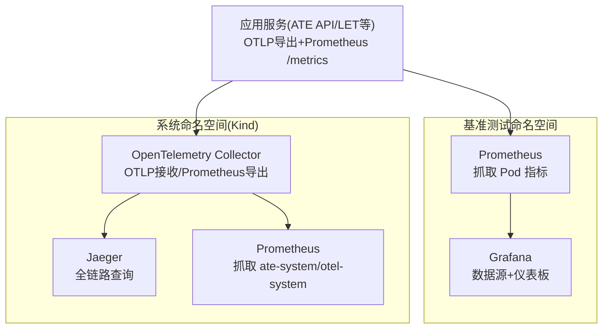
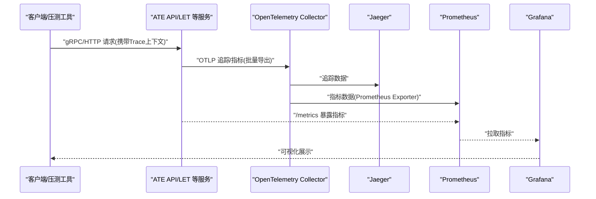
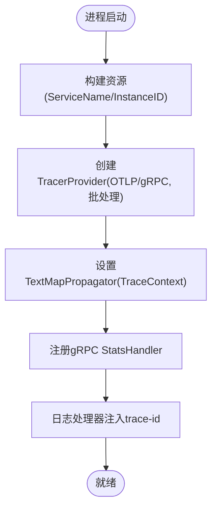
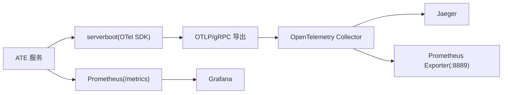

# 监控系统集成

<cite>
**本文引用的文件**   
- [monitoring.yaml](file://benchmarking/monitoring.yaml)
- [prometheus.yaml](file://manifests/ate-install/kind/prometheus.yaml)
- [otel-collector.yaml](file://manifests/ate-install/kind/otel-collector.yaml)
- [serverboot.go](file://internal/serverboot/serverboot.go)
- [main.go](file://cmd/ateapi/main.go)
- [tracing.md](file://docs/dev/best-practices/tracing.md)
- [observability.md](file://docs/observability.md)
- [contextlogging.go](file://internal/contextlogging/contextlogging.go)
- [ate-e2e-latency-dashboard.json](file://tools/setup-gcp/dashboards/ate-e2e-latency-dashboard.json)
- [ate-grpc-dashboard.json](file://tools/setup-gcp/dashboards/ate-grpc-dashboard.json)
- [ate-snapshot-dashboard.json](file://tools/setup-gcp/dashboards/ate-snapshot-dashboard.json)
</cite>

## 目录
1. [简介](#简介)
2. [项目结构](#项目结构)
3. [核心组件](#核心组件)
4. [架构总览](#架构总览)
5. [详细组件分析](#详细组件分析)
6. [依赖关系分析](#依赖关系分析)
7. [性能与容量规划](#性能与容量规划)
8. [故障排查指南](#故障排查指南)
9. [结论](#结论)
10. [附录](#附录)

## 简介
本文件面向基准测试与生产环境，系统化阐述 Agent Substrate 的监控与可观测性集成方案，重点覆盖：
- Prometheus 与 Grafana 的安装配置（服务发现、指标抓取、仪表板）
- OpenTelemetry 追踪系统（上下文传递、Span 创建、数据导出）
- 自定义业务指标的采集与可视化
- 分布式链路追踪的调试与分析方法
- 监控数据的持久化存储与查询优化策略

## 项目结构
仓库中与监控相关的关键位置：
- 基准测试监控栈：在 benchmarking 命名空间部署 Prometheus + Grafana，并内置多个 Locust 场景仪表板
- Kind 开发环境：在 otel-system 命名空间部署 Prometheus、OpenTelemetry Collector 与 Jaeger
- 服务端埋点：通过 serverboot 统一初始化 TracerProvider/MeterProvider，暴露 /metrics 并通过 OTLP 导出
- 文档与最佳实践：包含本地与 GKE 后端差异说明、Trace 使用建议与日志 TraceID 注入

图表来源
- [monitoring.yaml:53-131](file://benchmarking/monitoring.yaml#L53-L131)
- [prometheus.yaml:58-188](file://manifests/ate-install/kind/prometheus.yaml#L58-L188)
- [otel-collector.yaml:21-114](file://manifests/ate-install/kind/otel-collector.yaml#L21-L114)

章节来源
- [observability.md:115-182](file://docs/observability.md#L115-L182)

## 核心组件
- 指标采集与展示
  - Prometheus：基于 Kubernetes ServiceDiscovery 自动发现 Pod，按注解控制抓取路径与端口
  - Grafana：以 Prometheus 为默认数据源，提供多套预置仪表板
- 分布式追踪
  - OpenTelemetry Collector：接收 OTLP(gRPC/HTTP)，转发至 Jaeger 与 Prometheus 导出器
  - Jaeger：提供链路可视化与检索
- 服务端埋点
  - serverboot：统一初始化 TracerProvider/MeterProvider，注册 TraceContext 传播，暴露 /metrics
  - 各服务（如 ateapi）启动时启用 gRPC StatsHandler 与中间件，完成请求级埋点

章节来源
- [serverboot.go:91-147](file://internal/serverboot/serverboot.go#L91-L147)
- [main.go:88-101](file://cmd/ateapi/main.go#L88-L101)
- [otel-collector.yaml:26-54](file://manifests/ate-install/kind/otel-collector.yaml#L26-L54)
- [prometheus.yaml:64-110](file://manifests/ate-install/kind/prometheus.yaml#L64-L110)
- [monitoring.yaml:59-85](file://benchmarking/monitoring.yaml#L59-L85)

## 架构总览
下图展示了从客户端到后端服务的端到端可观测性数据流：

图表来源
- [serverboot.go:121-147](file://internal/serverboot/serverboot.go#L121-L147)
- [otel-collector.yaml:26-54](file://manifests/ate-install/kind/otel-collector.yaml#L26-L54)
- [prometheus.yaml:64-110](file://manifests/ate-install/kind/prometheus.yaml#L64-L110)
- [monitoring.yaml:59-85](file://benchmarking/monitoring.yaml#L59-L85)

## 详细组件分析

### Prometheus 安装与服务发现
- 基准测试环境(benchmarking)
  - 通过 ConfigMap 挂载 prometheus.yml，启用 kubernetes_sd_configs 角色 pod，仅抓取标注了特定注解的 Pod
  - relabel_configs 将注解中的 path/port 映射到 __metrics_path__ 与 __address__
  - 提供 Service 暴露 9090 端口
- Kind 环境(otel-system)
  - 支持 IPv6/IPv4 地址重写，过滤 Pending/Succeeded/Failed 阶段 Pod
  - 增加 namespace/pod/node 标签便于聚合
  - 使用 emptyDir 作为 TSDB 存储（重启丢失）

章节来源
- [monitoring.yaml:53-131](file://benchmarking/monitoring.yaml#L53-L131)
- [prometheus.yaml:58-188](file://manifests/ate-install/kind/prometheus.yaml#L58-L188)

### Grafana 安装与仪表板
- 数据源
  - 通过 ConfigMap 声明 Prometheus 数据源，访问模式 proxy，设为默认
- 仪表板提供者
  - 使用 file 类型提供者，扫描指定目录加载 JSON 仪表板
- 内置仪表板
  - 针对 Locust 场景提供多套仪表板（ATE API、Counter Demo、Workloads Benchmarking），包含 QPS、P99 延迟、热力图与活跃用户数

章节来源
- [monitoring.yaml:134-166](file://benchmarking/monitoring.yaml#L134-L166)
- [monitoring.yaml:167-515](file://benchmarking/monitoring.yaml#L167-L515)

### OpenTelemetry 追踪集成
- 服务端初始化
  - serverboot.InitTracing 创建 TracerProvider，设置资源属性（服务名、实例ID），注册 TraceContext 文本映射传播器
  - 使用 OTLP/gRPC 导出器，采用批处理导出
- gRPC 埋点
  - 服务启动时添加 StatsHandler，自动记录方法、状态码、耗时等指标
- 日志关联
  - 日志处理器从 Context 提取 TraceID 并注入结构化字段，便于跨系统关联

图表来源
- [serverboot.go:60-119](file://internal/serverboot/serverboot.go#L60-L119)
- [main.go:88-101](file://cmd/ateapi/main.go#L88-L101)
- [contextlogging.go:34-46](file://internal/contextlogging/contextlogging.go#L34-L46)

章节来源
- [serverboot.go:91-119](file://internal/serverboot/serverboot.go#L91-L119)
- [main.go:182-196](file://cmd/ateapi/main.go#L182-L196)
- [contextlogging.go:34-46](file://internal/contextlogging/contextlogging.go#L34-L46)
- [tracing.md:28-81](file://docs/dev/best-practices/tracing.md#L28-L81)

### OpenTelemetry Collector 与 Jaeger
- 接收端
  - 同时监听 gRPC(4317) 与 HTTP(4318) OTLP 协议
- 处理与导出
  - traces 管道：otlp -> batch -> otlp/jaeger + debug
  - metrics 管道：otlp -> batch -> prometheus(8889) + debug
- 配套服务
  - Jaeger all-in-one 提供 OTLP 接收与 Query UI(16686)

章节来源
- [otel-collector.yaml:26-54](file://manifests/ate-install/kind/otel-collector.yaml#L26-L54)
- [otel-collector.yaml:116-162](file://manifests/ate-install/kind/otel-collector.yaml#L116-L162)

### 自定义业务指标收集与展示
- 指标定义与采集
  - 通过 serverboot.InitMetrics 注册 MeterProvider，同时暴露 Prometheus 读取器与 OTLP 周期性导出器
  - 服务可通过标准 SDK 创建 Counter/Histogram/Gauge 等仪器，结合资源属性进行维度聚合
- 可视化
  - Kind 环境：Prometheus UI 直接查询
  - GKE 环境：通过 Google Cloud Monitoring 仪表板查看（见附录）

章节来源
- [serverboot.go:121-147](file://internal/serverboot/serverboot.go#L121-L147)
- [observability.md:103-134](file://docs/observability.md#L103-L134)

### 分布式追踪调试与分析
- 本地调试
  - 通过 port-forward 暴露 Jaeger UI，使用 --trace 触发请求生成链路
  - 在 Jaeger 中按 Trace ID 或 Service 筛选，查看 Span 层级与耗时
- 关键定位点
  - 网关/路由层、控制面 gRPC 调用、工作节点恢复/快照等阶段的耗时分布
  - 结合日志 trace-id 快速关联同一请求的日志片段

章节来源
- [observability.md:137-166](file://docs/observability.md#L137-L166)
- [tracing.md:140-200](file://docs/dev/best-practices/tracing.md#L140-L200)

## 依赖关系分析
- 组件耦合
  - 服务对 serverboot 的强依赖（TracerProvider/MeterProvider 初始化）
  - Prometheus 对 Kubernetes API 的 RBAC 权限依赖
  - Collector 对 Jaeger 与 Prometheus Exporter 的网络可达性依赖
- 外部依赖
  - OTLP 协议、Kubernetes SD、Jaeger、Prometheus

图表来源
- [serverboot.go:91-147](file://internal/serverboot/serverboot.go#L91-L147)
- [otel-collector.yaml:26-54](file://manifests/ate-install/kind/otel-collector.yaml#L26-L54)
- [prometheus.yaml:64-110](file://manifests/ate-install/kind/prometheus.yaml#L64-L110)
- [monitoring.yaml:59-85](file://benchmarking/monitoring.yaml#L59-L85)

章节来源
- [prometheus.yaml:15-56](file://manifests/ate-install/kind/prometheus.yaml#L15-L56)
- [otel-collector.yaml:96-114](file://manifests/ate-install/kind/otel-collector.yaml#L96-L114)

## 性能与容量规划
- 抓取间隔与批处理
  - Prometheus scrape_interval 建议根据负载调整；Collector 使用 batch 处理器降低网络开销
- 存储与保留
  - Kind 使用 emptyDir，重启即丢；生产建议持久化卷或迁移至云托管存储
- 标签基数控制
  - 避免高基数字段（如随机ID）进入高频指标；利用 relabel 裁剪不必要标签
- 采样策略
  - 追踪采样按需开启（ParentBased(NeverSample/AlwaysSample）；生产建议概率采样或基于头部开关

[本节为通用指导，不直接分析具体文件]

## 故障排查指南
- Prometheus 无法抓取
  - 检查 RBAC 与 ServiceAccount 是否具备 pods/services/endpoints 等权限
  - 确认 Pod 注解 prometheus_io_scrape=true，且 path/port 正确
  - 查看 Targets 页面确认目标状态
- Jaeger 无链路
  - 确认服务已初始化 TracerProvider 并设置 TraceContext 传播
  - 确认 Collector 的 OTLP 端口可达，且 traces 管道已启用
  - 使用 --trace 触发一次请求后在 Jaeger 搜索
- 指标缺失
  - 确认服务已启动 MetricsServer 并在正确端口暴露 /metrics
  - 核对 Prometheus relabel 规则是否正确映射 __metrics_path__ 与 __address__
- 日志无 trace-id
  - 确认日志处理器已包装并能从 Context 提取 TraceID

章节来源
- [prometheus.yaml:15-56](file://manifests/ate-install/kind/prometheus.yaml#L15-L56)
- [monitoring.yaml:69-85](file://benchmarking/monitoring.yaml#L69-L85)
- [serverboot.go:91-119](file://internal/serverboot/serverboot.go#L91-L119)
- [contextlogging.go:34-46](file://internal/contextlogging/contextlogging.go#L34-L46)

## 结论
本项目在 Kind 与基准测试环境中提供了开箱即用的监控与追踪能力：Prometheus 负责指标抓取与存储，Grafana 提供可视化；OpenTelemetry Collector 统一汇聚追踪与指标，Jaeger 用于链路分析。服务端通过 serverboot 标准化初始化，确保一致的埋点与导出行为。生产环境可在此基础上扩展持久化、告警与更细粒度的采样策略。

[本节为总结性内容，不直接分析具体文件]

## 附录

### 关键清单与参考路径
- Prometheus 抓取配置（基准测试）
  - [monitoring.yaml:53-131](file://benchmarking/monitoring.yaml#L53-L131)
- Prometheus 抓取配置（Kind）
  - [prometheus.yaml:58-188](file://manifests/ate-install/kind/prometheus.yaml#L58-L188)
- Grafana 数据源与仪表板提供者
  - [monitoring.yaml:134-166](file://benchmarking/monitoring.yaml#L134-L166)
- Grafana 内置仪表板（Locust 场景）
  - [monitoring.yaml:167-515](file://benchmarking/monitoring.yaml#L167-L515)
- OpenTelemetry Collector 配置与 Jaeger
  - [otel-collector.yaml:21-162](file://manifests/ate-install/kind/otel-collector.yaml#L21-L162)
- 服务端埋点与指标导出
  - [serverboot.go:91-147](file://internal/serverboot/serverboot.go#L91-L147)
  - [main.go:88-101](file://cmd/ateapi/main.go#L88-L101)
- 追踪最佳实践
  - [tracing.md:28-81](file://docs/dev/best-practices/tracing.md#L28-L81)
- 可观测性概览（本地与 GKE 差异）
  - [observability.md:115-182](file://docs/observability.md#L115-L182)
- 日志注入 TraceID
  - [contextlogging.go:34-46](file://internal/contextlogging/contextlogging.go#L34-L46)
- GCP 仪表板定义（示例）
  - [ate-e2e-latency-dashboard.json:1-217](file://tools/setup-gcp/dashboards/ate-e2e-latency-dashboard.json#L1-L217)
  - [ate-grpc-dashboard.json:1-159](file://tools/setup-gcp/dashboards/ate-grpc-dashboard.json#L1-L159)
  - [ate-snapshot-dashboard.json:1-137](file://tools/setup-gcp/dashboards/ate-snapshot-dashboard.json#L1-L137)
