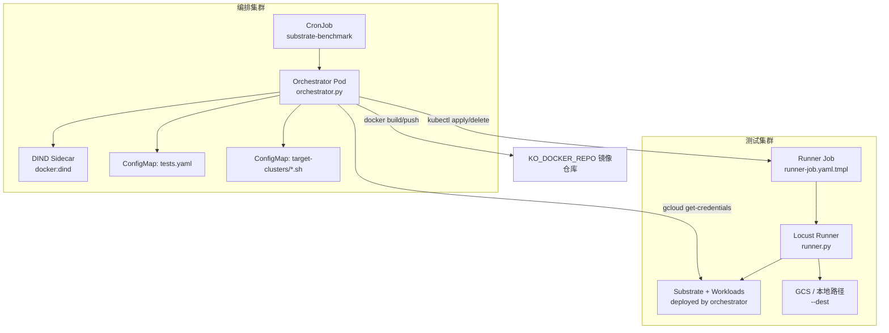
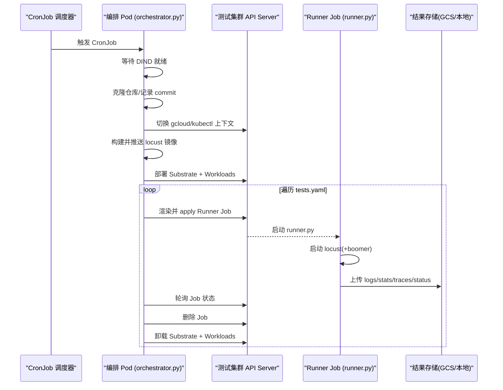
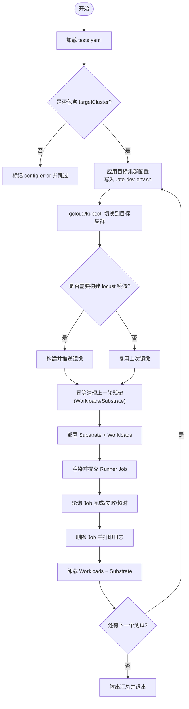
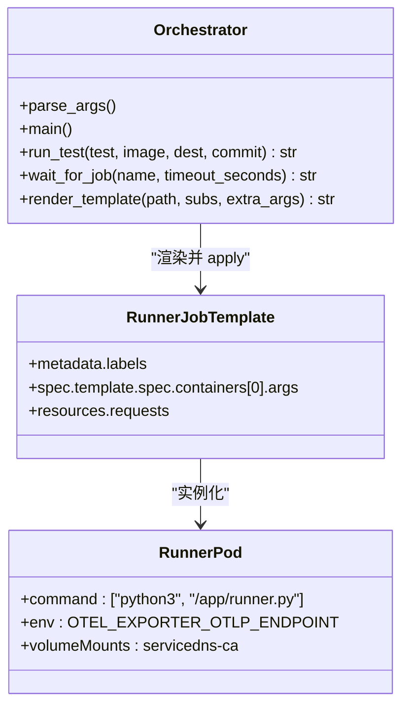
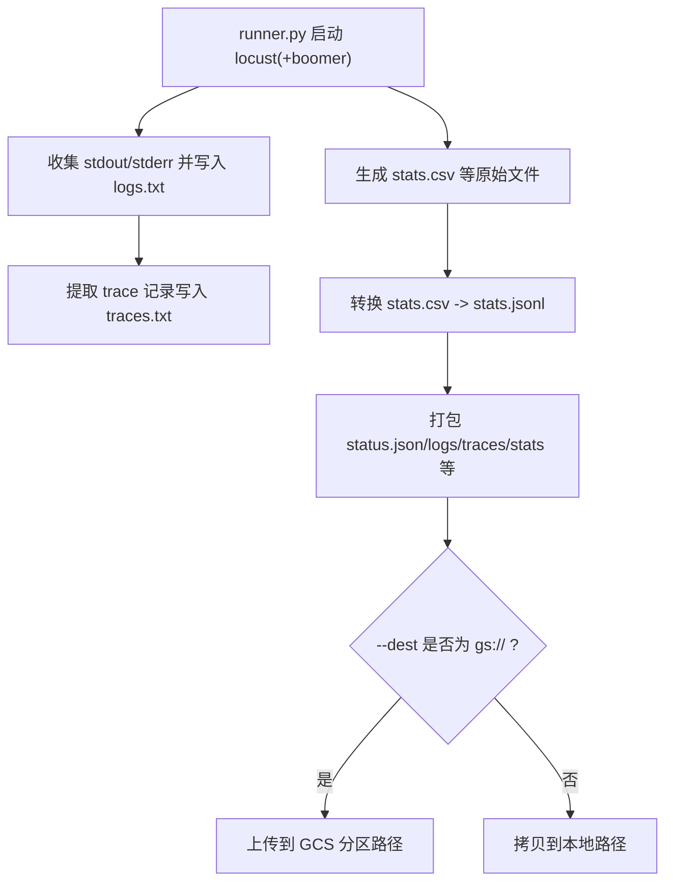
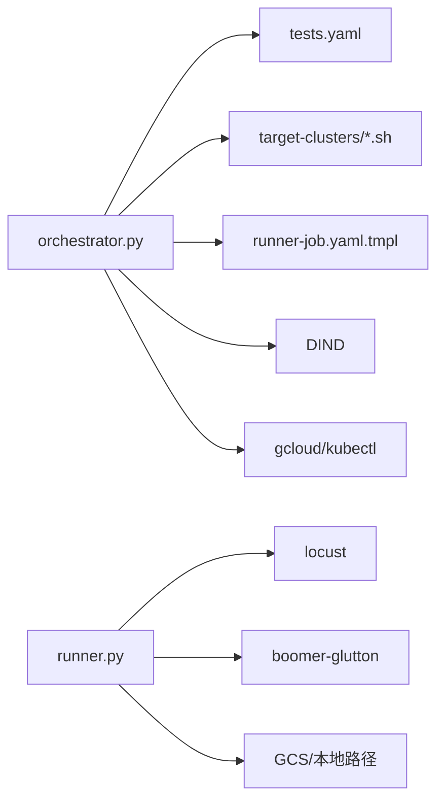

# 自动化编排器

<cite>
**本文引用的文件**   
- [orchestrator.py](file://benchmarking/automation/orchestrator.py)
- [tests.yaml](file://benchmarking/automation/tests.yaml)
- [Dockerfile](file://benchmarking/automation/Dockerfile)
- [setup.sh](file://benchmarking/automation/setup.sh)
- [cronjob.yaml.tmpl](file://benchmarking/automation/manifests/cronjob.yaml.tmpl)
- [runner-job.yaml.tmpl](file://benchmarking/automation/manifests/runner-job.yaml.tmpl)
- [README.md](file://benchmarking/automation/README.md)
- [runner.py](file://benchmarking/locust/runner.py)
- [glutton.py](file://benchmarking/locust/tests/glutton.py)
</cite>

## 目录
1. [简介](#简介)
2. [项目结构](#项目结构)
3. [核心组件](#核心组件)
4. [架构总览](#架构总览)
5. [详细组件分析](#详细组件分析)
6. [依赖关系分析](#依赖关系分析)
7. [性能与资源特性](#性能与资源特性)
8. [故障排查指南](#故障排查指南)
9. [结论](#结论)
10. [附录](#附录)

## 简介
本文件系统性介绍基准测试自动化编排器的功能与实现，重点覆盖：
- 测试任务调度与执行机制：用例定义格式、执行顺序控制、依赖管理。
- 工作节点自动创建与管理：Kubernetes Job 的生成、资源分配、生命周期管理。
- 测试结果收集与分析：指标聚合、报告生成、趋势分析。
- 测试环境自动化搭建：集群初始化、组件部署、网络配置等步骤。
- 错误处理与重试机制的实现细节。

该编排器以 CronJob 为入口，在“编排集群”上运行一个 Python 编排进程，负责克隆指定分支、构建并推送镜像、按目标集群上下文部署被测系统（Substrate）与工作负载，然后逐个提交 Kubernetes Job 执行 Locust 压测，并在每个测试前后清理环境，确保隔离性。

## 项目结构
自动化编排相关代码位于 benchmarking/automation 目录，关键文件如下：
- orchestrator.py：编排主程序，负责环境准备、镜像构建、测试调度与结果轮询。
- tests.yaml：测试清单，描述每个测试的名称、目标集群、用例文件、持续时间、并发用户数、可选参数等。
- manifests/cronjob.yaml.tmpl：编排 CronJob 模板，包含命名空间、ServiceAccount、CronJob 及 ConfigMap 挂载。
- manifests/runner-job.yaml.tmpl：单测 Job 模板，运行时由编排器渲染后提交到测试集群。
- Dockerfile：编排容器镜像构建脚本，内置 Go、gcloud、kubectl、Python 环境。
- setup.sh：交互式向导，生成 scratch 下的 cronjob.yaml、test-list.yaml、target-clusters.yaml，并构建/推送编排镜像。
- README.md：编排器使用说明、前置条件与 IAM 绑定说明。
- runner.py：Locust 无头运行器，负责启动压测、采集日志与指标、上传结果。
- glutton.py：Glutton 示例压测用例（仅声明 User，实际负载由 boomer-glutton 提供）。

图表来源
- [cronjob.yaml.tmpl:1-99](file://benchmarking/automation/manifests/cronjob.yaml.tmpl#L1-L99)
- [orchestrator.py:1-441](file://benchmarking/automation/orchestrator.py#L1-L441)
- [runner-job.yaml.tmpl:1-88](file://benchmarking/automation/manifests/runner-job.yaml.tmpl#L1-L88)
- [runner.py:1-393](file://benchmarking/locust/runner.py#L1-L393)

章节来源
- [README.md:1-137](file://benchmarking/automation/README.md#L1-L137)
- [Dockerfile:1-67](file://benchmarking/automation/Dockerfile#L1-L67)
- [setup.sh:1-159](file://benchmarking/automation/setup.sh#L1-L159)

## 核心组件
- 编排主程序 orchestrator.py
  - 解析命令行参数（仓库地址、分支、结果存放路径、测试清单路径）。
  - 等待 DIND 就绪，浅克隆 Substrate 仓库并记录 commit。
  - 根据 tests.yaml 中的 targetCluster 切换 gcloud/kubectl 上下文，构建并推送 locust 镜像。
  - 在每个测试前/后调用安装/卸载脚本，保证环境隔离。
  - 渲染 runner-job.yaml.tmpl 并提交 Job，轮询状态并清理。
- 测试清单 tests.yaml
  - 定义测试项：name、description、targetCluster、file、duration、users、workerCount、flags。
  - flags 作为额外参数透传给 runner.py，进而透传给 locust。
- 编排镜像 Dockerfile
  - 安装 Go、gcloud、kubectl、Python 及依赖；复制编排脚本与模板；设置入口。
- 向导 setup.sh
  - 从 .ate-dev-env.sh 快照目标集群环境，构建并推送编排镜像，生成三个独立可应用的 manifest。
- 模板 manifests/cronjob.yaml.tmpl 与 manifests/runner-job.yaml.tmpl
  - 前者定义编排 CronJob、SA、命名空间、ConfigMap 挂载与资源请求。
  - 后者定义单个测试 Job 的 SA、标签、环境变量、资源请求与 OTEL 端点。
- 运行器 runner.py
  - 启动 locust（必要时同时启动 boomer-glutton），转发日志，抽取 trace 信息，将 CSV 转为 JSONL，上传至 GCS 或本地路径。
- 示例用例 glutton.py
  - 声明 GluttonUser，配合 boomer-glutton 提供真实负载。

章节来源
- [orchestrator.py:1-441](file://benchmarking/automation/orchestrator.py#L1-L441)
- [tests.yaml:1-83](file://benchmarking/automation/tests.yaml#L1-L83)
- [Dockerfile:1-67](file://benchmarking/automation/Dockerfile#L1-L67)
- [setup.sh:1-159](file://benchmarking/automation/setup.sh#L1-L159)
- [cronjob.yaml.tmpl:1-99](file://benchmarking/automation/manifests/cronjob.yaml.tmpl#L1-L99)
- [runner-job.yaml.tmpl:1-88](file://benchmarking/automation/manifests/runner-job.yaml.tmpl#L1-L88)
- [runner.py:1-393](file://benchmarking/locust/runner.py#L1-L393)
- [glutton.py:1-45](file://benchmarking/locust/tests/glutton.py#L1-L45)

## 架构总览
整体流程分为“编排集群”和“测试集群”两部分：
- 编排集群
  - CronJob 定时触发，启动编排 Pod（含 DIND sidecar）。
  - 编排 Pod 拉取测试清单与目标集群配置，克隆源码，构建镜像，切换上下文，部署被测系统与负载。
- 测试集群
  - 编排 Pod 通过 kubectl 提交 Runner Job，Runner 执行 runner.py，启动 locust 与可选 boomer-glutton，产出日志与指标，上传结果。

图表来源
- [orchestrator.py:340-436](file://benchmarking/automation/orchestrator.py#L340-L436)
- [runner-job.yaml.tmpl:1-88](file://benchmarking/automation/manifests/runner-job.yaml.tmpl#L1-L88)
- [runner.py:307-393](file://benchmarking/locust/runner.py#L307-L393)

## 详细组件分析

### 测试任务调度与执行机制
- 用例定义格式（tests.yaml）
  - 必填字段：name、targetCluster、file、duration、users。
  - 可选字段：description、workerCount（默认 1）、flags（透传给 runner.py）。
  - targetCluster 对应 /etc/orchestrator/target-clusters/<name>.sh，编排器会将其复制到仓库根目录作为 .ate-dev-env.sh，供后续安装脚本使用。
- 执行顺序控制
  - 编排器按 tests.yaml 的顺序串行执行，每次只允许一个 Runner Job 活跃，避免并发污染。
  - 提交前检查是否存在未完成的 Runner Job，若有则等待或超时失败。
- 依赖管理
  - 每个测试依赖的目标集群配置通过 ConfigMap 注入。
  - 每个测试依赖的 Substrate 与 Workloads 在测试前部署，结束后卸载，确保隔离。
  - 同一目标集群下，locust 镜像只构建一次，避免重复构建开销。

图表来源
- [orchestrator.py:340-436](file://benchmarking/automation/orchestrator.py#L340-L436)
- [tests.yaml:1-83](file://benchmarking/automation/tests.yaml#L1-L83)

章节来源
- [orchestrator.py:1-441](file://benchmarking/automation/orchestrator.py#L1-L441)
- [tests.yaml:1-83](file://benchmarking/automation/tests.yaml#L1-L83)

### 工作节点的自动创建与管理（Kubernetes Job）
- Job 生成
  - 编排器读取 runner-job.yaml.tmpl，替换占位符（JOB_NAME、IMAGE、TEST_FILE、DURATION、USERS、TAG、NAME、DEST），并将 flags 追加到 args。
  - 提交到测试集群的 benchmarking 命名空间，并为 Job 打上 app/test-name/tag 标签便于筛选。
- 资源分配
  - Runner Job 容器资源请求：CPU 500m、内存 512Mi。
  - 编排 Pod 资源请求：CPU 1、内存 2Gi。
- 生命周期管理
  - 提交后轮询 Job 状态，支持 complete/failed/timeout 三种结果。
  - 完成后打印最近日志并删除 Job，避免资源泄漏。
  - 通过 backoffLimit=0 与 restartPolicy=Never 保证幂等性与一次性执行语义。

图表来源
- [orchestrator.py:311-337](file://benchmarking/automation/orchestrator.py#L311-L337)
- [runner-job.yaml.tmpl:1-88](file://benchmarking/automation/manifests/runner-job.yaml.tmpl#L1-L88)

章节来源
- [orchestrator.py:190-337](file://benchmarking/automation/orchestrator.py#L190-L337)
- [runner-job.yaml.tmpl:1-88](file://benchmarking/automation/manifests/runner-job.yaml.tmpl#L1-L88)

### 测试结果收集与分析
- 数据产出
  - runner.py 启动 locust，若用例为 glutton.py，则同时启动 boomer-glutton 作为 worker。
  - 输出文件包括：logs.txt、traces.txt、stats.csv、exceptions.csv、failures.csv、stats_history.csv、status.json，以及将 stats.csv 转换为 stats.jsonl。
- 指标聚合
  - 将 CSV 的列名规范化为 JSONL 的 measurements 键值对，保留时间戳、tag、test_name、metric 等信息，便于后续聚合与可视化。
- 报告生成与上传
  - 支持上传到 GCS（gs://bucket/path）或本地路径（--dest 指定）。
  - 上传路径采用分区布局：runs/<name>/run_date=<date>/run_ts=<ts>/run_tag=<commit>/<filename>。
- 趋势分析
  - 基于 JSONL 与 CSV 的历史数据，可在外部工具中进行趋势分析与对比（例如按 tag 比较不同 commit 的表现）。

图表来源
- [runner.py:255-393](file://benchmarking/locust/runner.py#L255-L393)

章节来源
- [runner.py:1-393](file://benchmarking/locust/runner.py#L1-L393)

### 测试环境的自动化搭建流程
- 集群初始化
  - 编排集群：需要启用 Workload Identity，无需特殊 API，单节点即可。
  - 测试集群：需启用证书相关 beta API，Kubernetes 版本要求较高，以便 Pod 证书与信任束可用。
- 组件部署
  - 编排器调用 hack/install-ate.sh --deploy-ate-system 部署 Substrate 系统组件。
  - 调用 benchmarking/workloads/deploy.sh --deploy 部署工作负载，并等待 ActorTemplates Ready。
- 网络配置
  - Runner Job 容器挂载 servicedns CA，用于访问受保护的服务。
  - 通过 OTEL_EXPORTER_OTLP_ENDPOINT 指向 OpenTelemetry Collector，上报追踪与指标。
- 清理与隔离
  - 每个测试前后均执行 teardown，确保不互相污染。
  - 幂等清理：即使上一次 CronJob 异常中断，也会先清理残留再部署新环境。

章节来源
- [README.md:1-137](file://benchmarking/automation/README.md#L1-L137)
- [orchestrator.py:275-309](file://benchmarking/automation/orchestrator.py#L275-L309)
- [runner-job.yaml.tmpl:67-88](file://benchmarking/automation/manifests/runner-job.yaml.tmpl#L67-L88)

### 错误处理与重试机制
- 目标集群配置缺失
  - 若 tests.yaml 中某测试缺少 targetCluster，编排器直接标记 config-error 并跳过。
- DIND 未就绪
  - 等待 docker info 成功，超过超时抛出异常。
- 目标集群上下文切换失败
  - 若 gcloud/kubectl 命令失败，编排器记录错误并继续下一条测试（不影响其他测试）。
- 已有 Runner Job 冲突
  - 提交前轮询是否有活跃的 Runner Job，若有则等待直至空闲或超时失败。
- Job 执行结果
  - 轮询 Job 状态，返回 complete/failed/timeout；无论结果如何都会删除 Job。
- 环境与资源清理
  - 使用 finally 块确保每次测试后都执行 teardown，避免资源泄漏。
  - 清理 .ate-dev-env.sh，防止下一测试误用上一测试的环境变量。
- 重试策略
  - 当前实现未引入显式重试逻辑（backoffLimit=0、restartPolicy=Never），强调幂等与一次性执行。
  - 如需重试，可在上层 CronJob 或外部编排层进行。

章节来源
- [orchestrator.py:170-251](file://benchmarking/automation/orchestrator.py#L170-L251)
- [orchestrator.py:311-436](file://benchmarking/automation/orchestrator.py#L311-L436)
- [runner-job.yaml.tmpl:36-46](file://benchmarking/automation/manifests/runner-job.yaml.tmpl#L36-L46)

## 依赖关系分析
- 外部依赖
  - Docker（DIND）：用于构建与推送 locust 镜像。
  - gcloud/kubectl：用于认证与操作测试集群。
  - Python 包：PyYAML、google-cloud-storage（仅在上传到 GCS 时导入）。
- 内部依赖
  - orchestrator.py 依赖 tests.yaml 与 target-clusters ConfigMap。
  - runner.py 依赖 locust 与 boomer-glutton（当用例为 glutton.py）。
  - 模板文件被 orchestrator.py 渲染后提交到测试集群。

图表来源
- [orchestrator.py:1-441](file://benchmarking/automation/orchestrator.py#L1-L441)
- [runner.py:1-393](file://benchmarking/locust/runner.py#L1-L393)

章节来源
- [Dockerfile:1-67](file://benchmarking/automation/Dockerfile#L1-L67)
- [orchestrator.py:1-441](file://benchmarking/automation/orchestrator.py#L1-L441)
- [runner.py:1-393](file://benchmarking/locust/runner.py#L1-L393)

## 性能与资源特性
- 并行度控制
  - 编排器串行执行测试，避免并发竞争与资源争用。
  - 同一目标集群下复用已构建的 locust 镜像，减少构建开销。
- 资源请求
  - 编排 Pod CPU 1、内存 2Gi；Runner Job CPU 500m、内存 512Mi。可根据压测规模调整。
- 超时与等待
  - DIND 就绪等待、Job 轮询等待均有超时保护，避免长时间阻塞。
- 结果上传
  - 支持 GCS 与本地路径，建议在生产中使用 GCS 以获得更好的可扩展性与持久化能力。

[本节为通用指导，不直接分析具体文件]

## 故障排查指南
- 常见问题定位
  - 目标集群配置缺失：检查 tests.yaml 中 targetCluster 是否正确，确认 ConfigMap 中存在对应的 *.sh 文件。
  - DIND 未就绪：查看编排 Pod 日志，确认 docker info 是否成功；检查镜像仓库与网络连通性。
  - gcloud/kubectl 权限不足：确认 Workload Identity 绑定与 IAM 角色（container.admin、artifactregistry.writer、storage.objectCreator）。
  - Job 卡住或超时：查看 Job 日志与 Runner Pod 日志，确认 locust 与 boomer 是否正常退出。
  - 结果未上传：检查 --dest 路径与权限，确认 GCS 或本地路径可达。
- 日志与诊断
  - 编排器会打印每条命令与关键步骤，便于快速定位问题。
  - Runner 会将 locust 与 boomer 的输出分别标注 [locust]/[boomer] 前缀，方便区分。
  - traces.txt 提供逐条 trace 记录，便于关联端到端延迟与错误。

章节来源
- [orchestrator.py:214-273](file://benchmarking/automation/orchestrator.py#L214-L273)
- [runner.py:154-252](file://benchmarking/locust/runner.py#L154-L252)

## 结论
该自动化编排器通过 CronJob 驱动，实现了跨集群的基准测试全链路自动化：从源码克隆、镜像构建、环境部署、测试执行到结果上传与清理，形成闭环。其设计强调幂等与隔离，通过严格的顺序控制与资源清理，确保多次运行的稳定性与可重复性。结合 JSONL/CSV 的结构化结果与 OTEL 集成，便于后续的趋势分析与可视化。

[本节为总结，不直接分析具体文件]

## 附录
- 快速上手
  - 运行 setup.sh 生成编排所需 manifest 并构建/推送编排镜像。
  - 编辑生成的 cronjob.yaml，填写 --repo/--branch/--dest 后应用到编排集群。
  - 修改 tests.yaml 或 target-clusters ConfigMap 以调整测试集与目标集群。
- 扩展建议
  - 增加重试策略：在上层编排层对失败的测试进行有限次重试。
  - 增强指标聚合：在外部系统中对 JSONL 数据进行聚合与告警。
  - 多目标集群并行：通过多个 CronJob 或队列系统实现跨集群并行执行。

[本节为补充说明，不直接分析具体文件]
