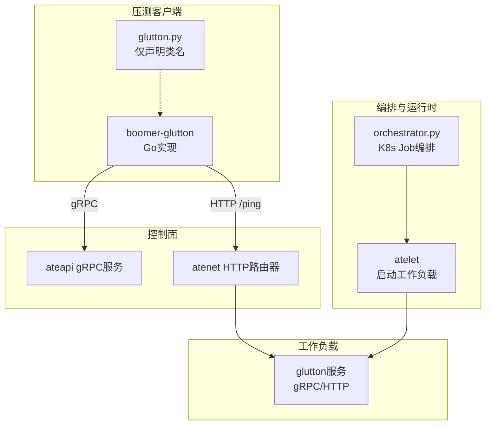
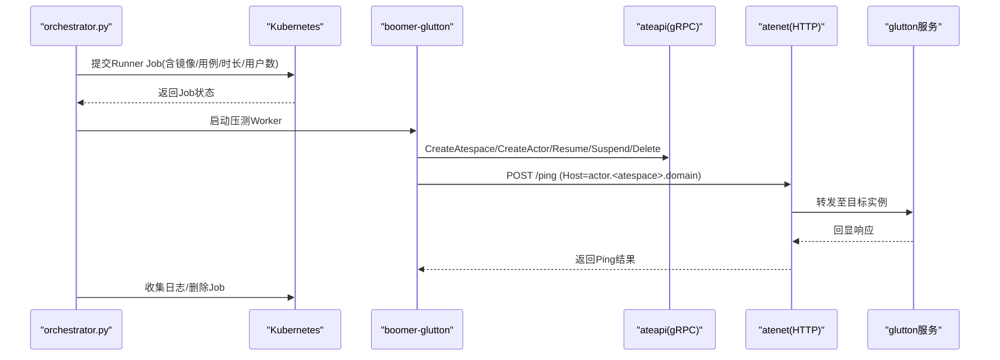
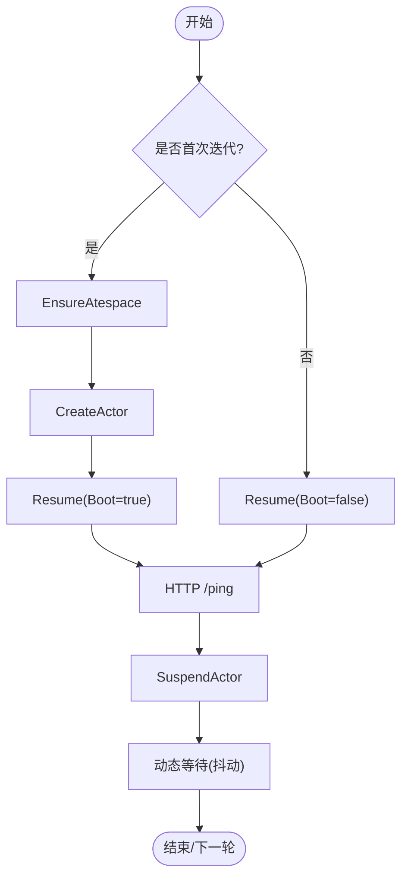
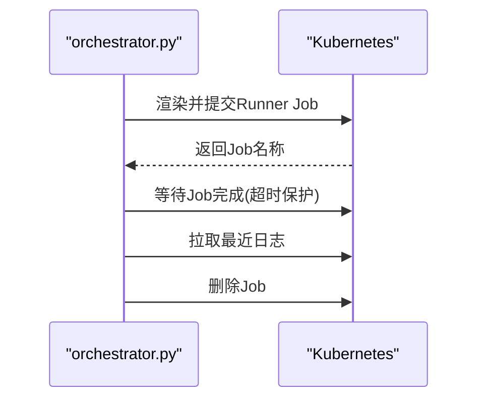
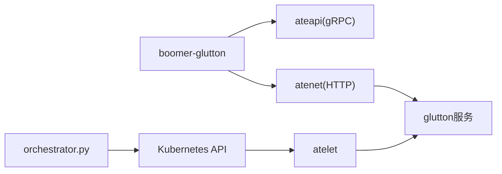

# CPU密集型测试

<cite>
**本文引用的文件**   
- [cmd/benchmarking/glutton/main.go](file://cmd/benchmarking/glutton/main.go)
- [internal/proto/glutton/glutton.proto](file://internal/proto/glutton/glutton.proto)
- [cmd/benchmarking/boomer-glutton/main.go](file://cmd/benchmarking/boomer-glutton/main.go)
- [internal/benchmarking/boomer/glutton/lifecycle.go](file://internal/benchmarking/boomer/glutton/lifecycle.go)
- [internal/benchmarking/boomer/glutton/grpcclient.go](file://internal/benchmarking/boomer/glutton/grpcclient.go)
- [benchmarking/locust/tests/glutton.py](file://benchmarking/locust/tests/glutton.py)
- [benchmarking/automation/orchestrator.py](file://benchmarking/automation/orchestrator.py)
- [cmd/atelet/main.go](file://cmd/atelet/main.go)
</cite>

## 目录
1. [简介](#简介)
2. [项目结构](#项目结构)
3. [核心组件](#核心组件)
4. [架构总览](#架构总览)
5. [详细组件分析](#详细组件分析)
6. [依赖关系分析](#依赖关系分析)
7. [性能考量与优化建议](#性能考量与优化建议)
8. [故障排查指南](#故障排查指南)
9. [结论](#结论)
10. [附录](#附录)

## 简介
本文件围绕“CPU密集型测试”的目标，结合仓库中的基准测试与负载生成工具链，系统阐述：
- 计算密集型任务的模拟方式（内存写入、磁盘随机写、网络往返等）
- 并发计算的测试方法（多协程并发、通过编排器并行执行多个作业）
- 负载均衡与任务分发（HTTP路由+gRPC服务、按主机头路由到目标工作负载）
- CPU占用率监控与分析（指标采集、延迟统计、热点识别思路）
- CPU性能优化建议（算法、并行化、缓存策略）
- CPU亲和性与NUMA感知的测试方案（在容器/Kubernetes环境下的可操作路径）

## 项目结构
与CPU密集型测试直接相关的代码主要分布在以下位置：
- 服务端负载注入器：glutton（提供RAM/Disk/FD/Ping/Gossip等接口）
- 客户端压测器：boomer-glutton（Go实现的Locust Worker，复用现有控制面API）
- 自动化编排：orchestrator.py（Kubernetes Job驱动多场景压测）
- 运行时调度：atelet（负责在工作节点启动实际工作负载）



图表来源
- [cmd/benchmarking/glutton/main.go:122-149](file://cmd/benchmarking/glutton/main.go#L122-L149)
- [internal/benchmarking/boomer/glutton/lifecycle.go:283-339](file://internal/benchmarking/boomer/glutton/lifecycle.go#L283-L339)
- [cmd/atelet/main.go:250-271](file://cmd/atelet/main.go#L250-L271)
- [benchmarking/automation/orchestrator.py:311-337](file://benchmarking/automation/orchestrator.py#L311-L337)
- [benchmarking/locust/tests/glutton.py:24-44](file://benchmarking/locust/tests/glutton.py#L24-L44)

章节来源
- [cmd/benchmarking/glutton/main.go:122-149](file://cmd/benchmarking/glutton/main.go#L122-L149)
- [internal/benchmarking/boomer/glutton/lifecycle.go:283-339](file://internal/benchmarking/boomer/glutton/lifecycle.go#L283-L339)
- [cmd/atelet/main.go:250-271](file://cmd/atelet/main.go#L250-L271)
- [benchmarking/automation/orchestrator.py:311-337](file://benchmarking/automation/orchestrator.py#L311-L337)
- [benchmarking/locust/tests/glutton.py:24-44](file://benchmarking/locust/tests/glutton.py#L24-L44)

## 核心组件
- glutton服务
  - 暴露gRPC与HTTP两种协议入口；HTTP模式仅暴露/ping，其余为gRPC专用
  - 提供WriteRAM、WriteDisk、OpenFD、Ping、Gossip等方法，用于消耗内存、磁盘、文件描述符以及产生网络流量
  - 内置Prometheus指标：ram/disk写入字节数、Ping请求计数、Gossip发送次数与延迟直方图、打开FD数量、对端延迟配置等
- boomer-glutton客户端
  - Go实现的Locust Worker，通过boomer协议接入Python主控
  - 生命周期：创建Atespace→创建Actor→Resume→HTTP Ping→Suspend→Sleep（动态等待）
  - 支持遥测采样率与等待时间等运行时参数动态下发
- orchestrator.py
  - 基于Kubernetes Job的自动化编排，渲染模板并提交Runner Job，等待结果并清理
- atelet
  - 根据控制面指令在工作节点上运行工作负载（如glutton），完成端到端链路

章节来源
- [cmd/benchmarking/glutton/main.go:122-149](file://cmd/benchmarking/glutton/main.go#L122-L149)
- [cmd/benchmarking/glutton/main.go:217-298](file://cmd/benchmarking/glutton/main.go#L217-L298)
- [internal/benchmarking/boomer/glutton/lifecycle.go:85-124](file://internal/benchmarking/boomer/glutton/lifecycle.go#L85-L124)
- [benchmarking/automation/orchestrator.py:311-337](file://benchmarking/automation/orchestrator.py#L311-L337)
- [cmd/atelet/main.go:250-271](file://cmd/atelet/main.go#L250-L271)

## 架构总览
下图展示了从压测发起、控制面协调、路由转发到工作负载执行的完整调用链。



图表来源
- [benchmarking/automation/orchestrator.py:311-337](file://benchmarking/automation/orchestrator.py#L311-L337)
- [internal/benchmarking/boomer/glutton/lifecycle.go:186-255](file://internal/benchmarking/boomer/glutton/lifecycle.go#L186-L255)
- [internal/benchmarking/boomer/glutton/lifecycle.go:283-339](file://internal/benchmarking/boomer/glutton/lifecycle.go#L283-L339)
- [cmd/benchmarking/glutton/main.go:151-185](file://cmd/benchmarking/glutton/main.go#L151-L185)

## 详细组件分析

### glutton服务：CPU/IO/网络压力注入
- 协议与路由
  - gRPC主监听端口；HTTP模式仅暴露/ping，便于跨协议对比
- 资源消耗接口
  - WriteRAM：按Key覆盖或追加随机数据，记录写入字节数
  - WriteDisk：流式写入随机字节到磁盘，避免一次性大内存分配
  - OpenFD：维持指定数量的打开文件描述符
- 网络与遥测
  - Ping：简单回显
  - Gossip：定时向对端发送Ping，统计延迟分布与失败原因
  - 指标：ram/disk写入字节、Ping请求计数、Gossip发送量与延迟直方图、打开FD数量、对端延迟配置

```mermaid
classDiagram
class GluttonService {
+string dataDir
+map~string,[]byte~ ram
+[]*os.File fds
+map~string,*peerGossip~ peers
+WriteRAM(req) resp
+WriteDisk(req) resp
+OpenFD(req) resp
+Ping(req) resp
+Gossip(req) resp
+Close() void
}
class peerGossip {
+string host
+int32 delayMs
+cancel context.CancelFunc
+done chan struct{}
}
GluttonService --> peerGossip : "管理对端心跳"
```

图表来源
- [cmd/benchmarking/glutton/main.go:191-208](file://cmd/benchmarking/glutton/main.go#L191-L208)
- [cmd/benchmarking/glutton/main.go:314-350](file://cmd/benchmarking/glutton/main.go#L314-L350)
- [cmd/benchmarking/glutton/main.go:353-386](file://cmd/benchmarking/glutton/main.go#L353-L386)
- [cmd/benchmarking/glutton/main.go:391-416](file://cmd/benchmarking/glutton/main.go#L391-L416)
- [cmd/benchmarking/glutton/main.go:419-422](file://cmd/benchmarking/glutton/main.go#L419-L422)
- [cmd/benchmarking/glutton/main.go:426-475](file://cmd/benchmarking/glutton/main.go#L426-L475)
- [cmd/benchmarking/glutton/main.go:477-533](file://cmd/benchmarking/glutton/main.go#L477-L533)

章节来源
- [cmd/benchmarking/glutton/main.go:122-149](file://cmd/benchmarking/glutton/main.go#L122-L149)
- [cmd/benchmarking/glutton/main.go:217-298](file://cmd/benchmarking/glutton/main.go#L217-L298)
- [cmd/benchmarking/glutton/main.go:314-350](file://cmd/benchmarking/glutton/main.go#L314-L350)
- [cmd/benchmarking/glutton/main.go:353-386](file://cmd/benchmarking/glutton/main.go#L353-L386)
- [cmd/benchmarking/glutton/main.go:391-416](file://cmd/benchmarking/glutton/main.go#L391-L416)
- [cmd/benchmarking/glutton/main.go:419-422](file://cmd/benchmarking/glutton/main.go#L419-L422)
- [cmd/benchmarking/glutton/main.go:426-475](file://cmd/benchmarking/glutton/main.go#L426-L475)
- [cmd/benchmarking/glutton/main.go:477-533](file://cmd/benchmarking/glutton/main.go#L477-L533)

### boomer-glutton客户端：并发与任务编排
- 并发模型
  - 每个VU对应一个goroutine，维护各自的用户状态（Actor引用、是否首次Resume等）
  - 通过sync.Map按goroutineID索引用户对象，避免全局锁竞争
- 任务流程
  - 首次迭代：确保Atespace→创建Actor→冷启动Resume
  - 后续迭代：Resume→HTTP Ping→Suspend→动态等待（MinWait~MaxWait抖动）
- 遥测与指标
  - 使用Tracer记录每次调用，优先采用服务端尾标延迟，否则回退到客户端测量
  - 成功/失败分别上报Prometheus指标，包含错误类型与大小信息



图表来源
- [internal/benchmarking/boomer/glutton/lifecycle.go:98-124](file://internal/benchmarking/boomer/glutton/lifecycle.go#L98-L124)
- [internal/benchmarking/boomer/glutton/lifecycle.go:186-255](file://internal/benchmarking/boomer/glutton/lifecycle.go#L186-L255)
- [internal/benchmarking/boomer/glutton/lifecycle.go:283-339](file://internal/benchmarking/boomer/glutton/lifecycle.go#L283-L339)
- [internal/benchmarking/boomer/glutton/lifecycle.go:161-168](file://internal/benchmarking/boomer/glutton/lifecycle.go#L161-L168)

章节来源
- [internal/benchmarking/boomer/glutton/lifecycle.go:85-124](file://internal/benchmarking/boomer/glutton/lifecycle.go#L85-L124)
- [internal/benchmarking/boomer/glutton/lifecycle.go:186-255](file://internal/benchmarking/boomer/glutton/lifecycle.go#L186-L255)
- [internal/benchmarking/boomer/glutton/lifecycle.go:283-339](file://internal/benchmarking/boomer/glutton/lifecycle.go#L283-L339)
- [internal/benchmarking/boomer/glutton/lifecycle.go:161-168](file://internal/benchmarking/boomer/glutton/lifecycle.go#L161-L168)

### orchestrator.py：多作业并行与结果聚合
- 渲染Runner Job模板，设置镜像、用例文件、持续时间、用户数等参数
- 等待无活跃Runner后提交新Job，超时等待完成后拉取日志并清理
- 支持多次测试顺序执行，便于组合不同负载场景



图表来源
- [benchmarking/automation/orchestrator.py:311-337](file://benchmarking/automation/orchestrator.py#L311-L337)

章节来源
- [benchmarking/automation/orchestrator.py:311-337](file://benchmarking/automation/orchestrator.py#L311-L337)

### atenet路由与glutton HTTP模式：负载均衡与任务分发
- atenet根据HTTP Host头将请求路由到目标Actor实例
- glutton在HTTP模式下仅暴露/ping，保持与gRPC一致的语义，便于跨协议对比
- 该机制天然支持水平扩展：新增实例后，通过DNS/Host映射即可纳入负载均衡

章节来源
- [cmd/benchmarking/glutton/main.go:151-185](file://cmd/benchmarking/glutton/main.go#L151-L185)
- [internal/benchmarking/boomer/glutton/lifecycle.go:283-339](file://internal/benchmarking/boomer/glutton/lifecycle.go#L283-L339)

## 依赖关系分析
- 客户端依赖
  - boomer-glutton依赖ateapi控制面进行资源编排，依赖atenet进行HTTP路由访问
  - 通过TLS连接ateapi（跳过严格SAN校验以适配集群内证书）
- 服务端依赖
  - glutton服务依赖标准库与OTel生态进行指标与追踪
  - 通过gRPC反射与HTTP mux暴露接口
- 编排依赖
  - orchestrator.py依赖kubectl与Kubernetes API进行作业调度



图表来源
- [internal/benchmarking/boomer/glutton/grpcclient.go:27-41](file://internal/benchmarking/boomer/glutton/grpcclient.go#L27-L41)
- [internal/benchmarking/boomer/glutton/lifecycle.go:283-339](file://internal/benchmarking/boomer/glutton/lifecycle.go#L283-L339)
- [cmd/benchmarking/glutton/main.go:122-149](file://cmd/benchmarking/glutton/main.go#L122-L149)
- [cmd/atelet/main.go:250-271](file://cmd/atelet/main.go#L250-L271)
- [benchmarking/automation/orchestrator.py:311-337](file://benchmarking/automation/orchestrator.py#L311-L337)

章节来源
- [internal/benchmarking/boomer/glutton/grpcclient.go:27-41](file://internal/benchmarking/boomer/glutton/grpcclient.go#L27-L41)
- [internal/benchmarking/boomer/glutton/lifecycle.go:283-339](file://internal/benchmarking/boomer/glutton/lifecycle.go#L283-L339)
- [cmd/benchmarking/glutton/main.go:122-149](file://cmd/benchmarking/glutton/main.go#L122-L149)
- [cmd/atelet/main.go:250-271](file://cmd/atelet/main.go#L250-L271)
- [benchmarking/automation/orchestrator.py:311-337](file://benchmarking/automation/orchestrator.py#L311-L337)

## 性能考量与优化建议
- 计算密集型任务模拟
  - 内存写入：WriteRAM按Key覆盖或追加随机数据，适合制造CPU与内存带宽压力
  - 磁盘随机写：WriteDisk分块流式写入，避免一次性大内存分配，适合评估I/O子系统与CPU协同
  - 网络往返：Ping/Gossip构造稳定网络负载，便于观察CPU在网络栈与序列化上的开销
- 并发计算测试方法
  - 多线程并行：通过boomer的多goroutine并发执行任务，模拟高并发场景
  - 多进程并行：借助orchestrator.py并行提交多个Kubernetes Job，横向扩展压测规模
  - 协程并发：Go原生goroutine天然适合高并发，配合sync.Map降低锁竞争
- 负载均衡测试设计
  - 任务分发：通过Host头将请求路由到不同实例，验证水平扩展能力
  - 负载均衡算法：由atnet内部实现，可通过增加实例数量验证吞吐与延迟变化
  - 动态扩缩容：在压测过程中调整实例数量，观察恢复时间与稳定性
- CPU占用率监控与分析
  - 指标采集：glutton内置Prometheus指标（写入字节、请求计数、延迟直方图等）
  - 热点函数识别：结合OTel追踪与服务端尾标延迟，定位慢路径
  - 性能瓶颈定位：区分客户端/服务端延迟，结合系统级工具（perf、eBPF）深入分析
- CPU性能优化建议
  - 算法优化：减少不必要的拷贝与序列化，尽量复用缓冲区
  - 并行化改造：利用多核并行处理独立子任务，注意避免共享锁争用
  - 缓存策略：对热点数据进行本地缓存，降低重复计算与外部依赖开销
- CPU亲和性与NUMA感知
  - 在Kubernetes中可通过Pod的nodeSelector/tolerations与NodeAffinity绑定特定节点
  - 使用cgroup v2 cpuset限制CPU集，结合NUMA拓扑选择本地内存节点
  - 在应用层通过runtime.GOMAXPROCS与线程池策略匹配物理核数，减少跨NUMA访问

[本节为通用指导，不直接分析具体文件]

## 故障排查指南
- 常见问题
  - 连接失败：检查ateapi TLS配置与集群内证书SAN条目
  - 路由失败：确认Host头格式与atnet路由规则一致
  - 指标缺失：确认Prometheus抓取目标与Exporter端口可达
- 定位步骤
  - 查看Runner Job日志，确认用例执行与退出码
  - 检查glutton服务的指标与日志，关注Gossip延迟与失败原因
  - 使用OTel追踪ID关联客户端与服务端调用链

章节来源
- [internal/benchmarking/boomer/glutton/grpcclient.go:27-41](file://internal/benchmarking/boomer/glutton/grpcclient.go#L27-L41)
- [internal/benchmarking/boomer/glutton/lifecycle.go:283-339](file://internal/benchmarking/boomer/glutton/lifecycle.go#L283-L339)
- [cmd/benchmarking/glutton/main.go:477-533](file://cmd/benchmarking/glutton/main.go#L477-L533)
- [benchmarking/automation/orchestrator.py:311-337](file://benchmarking/automation/orchestrator.py#L311-L337)

## 结论
本项目提供了完整的CPU密集型测试工具链：glutton作为服务端压力注入点，boomer-glutton作为高并发客户端，orchestrator.py负责规模化编排，atelet负责工作负载启动。通过合理的任务设计与指标采集，可以有效评估CPU、内存、磁盘与网络的综合表现，并为进一步优化提供依据。

[本节为总结性内容，不直接分析具体文件]

## 附录
- 相关协议定义
  - glutton服务接口定义位于proto文件中，供gRPC与HTTP模式共用
- Python侧占位
  - locust侧仅声明GluttonUser类名，真实逻辑由Go Worker承担

章节来源
- [internal/proto/glutton/glutton.proto](file://internal/proto/glutton/glutton.proto)
- [benchmarking/locust/tests/glutton.py:24-44](file://benchmarking/locust/tests/glutton.py#L24-L44)
