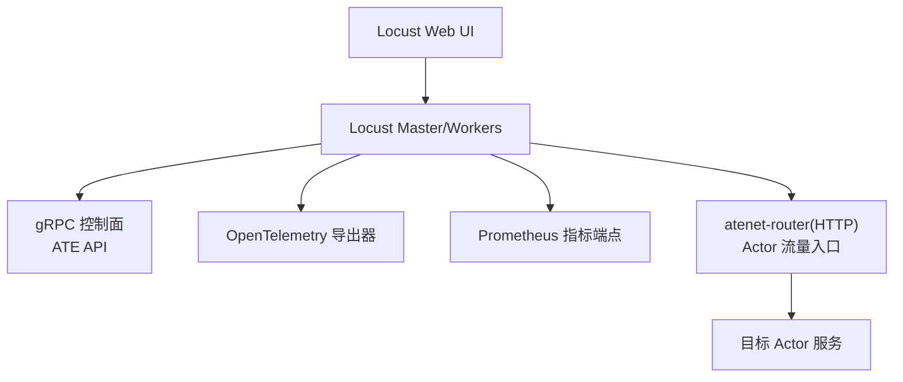
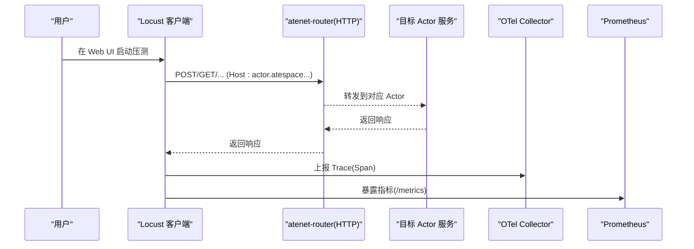
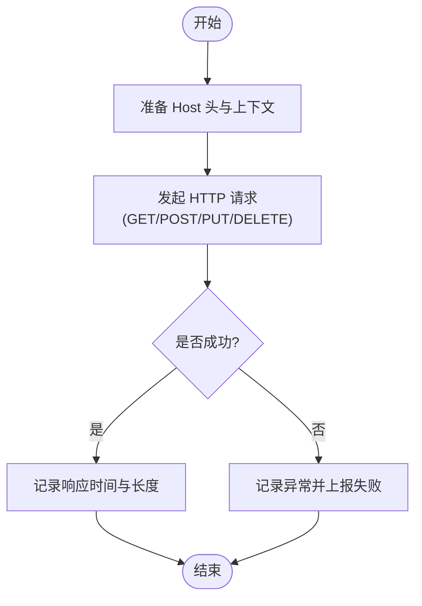
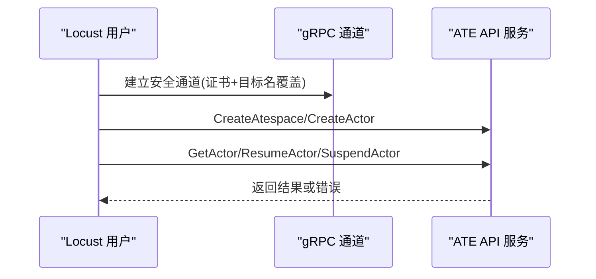
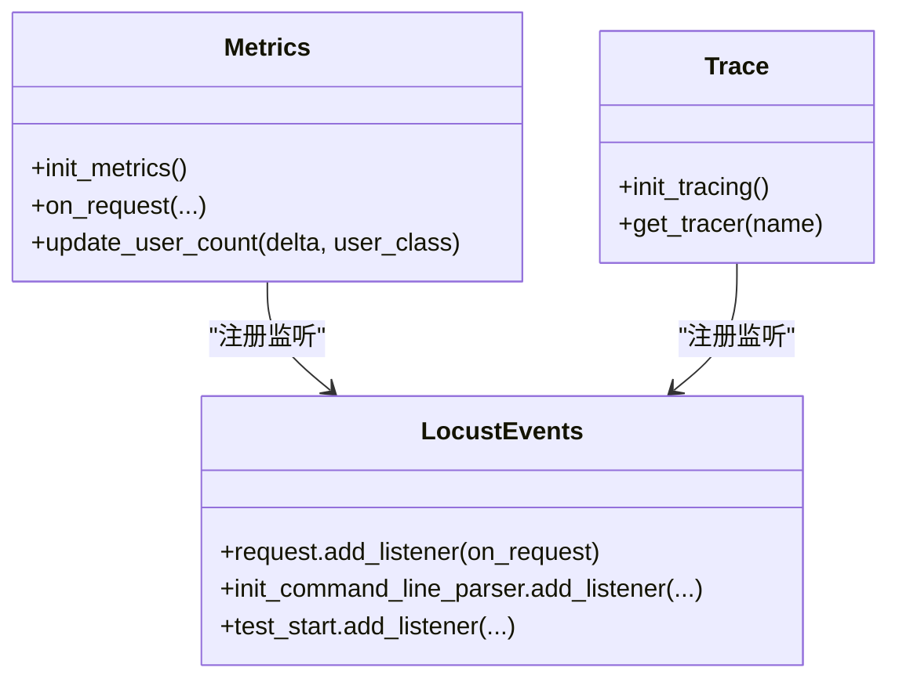
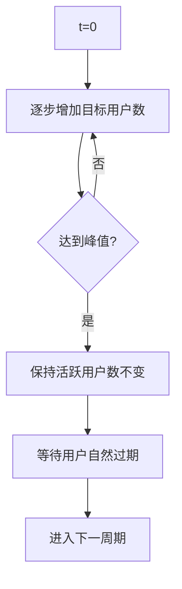
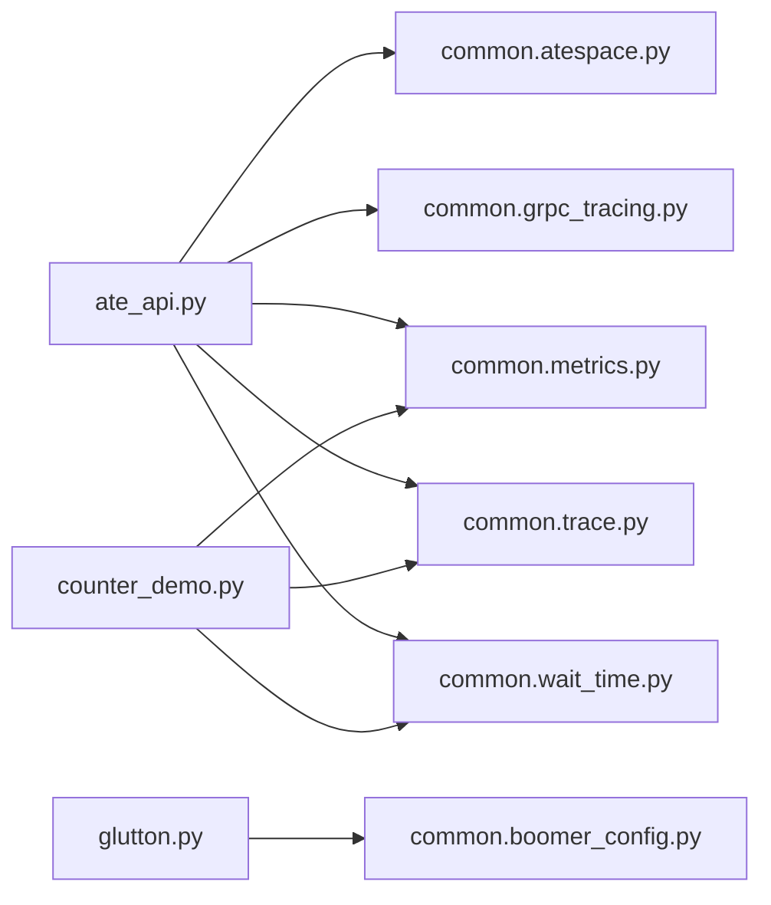

# HTTP工作负载测试

<cite>
**本文引用的文件**   
- [README.md](file://benchmarking/README.md)
- [deploy.sh](file://benchmarking/locust/deploy.sh)
- [ate_api.py](file://benchmarking/locust/tests/ate_api.py)
- [counter_demo.py](file://benchmarking/locust/tests/counter_demo.py)
- [glutton.py](file://benchmarking/locust/tests/glutton.py)
- [metrics.py](file://benchmarking/locust/common/metrics.py)
- [trace.py](file://benchmarking/locust/common/trace.py)
- [wait_time.py](file://benchmarking/locust/common/wait_time.py)
- [burst_shape.py](file://benchmarking/locust/shapes/burst_shape.py)
- [grpc_setup.py](file://benchmarking/locust/common/grpc_setup.py)
- [atespace.py](file://benchmarking/locust/common/atespace.py)
</cite>

## 目录
1. [简介](#简介)
2. [项目结构](#项目结构)
3. [核心组件](#核心组件)
4. [架构总览](#架构总览)
5. [详细组件分析](#详细组件分析)
6. [依赖关系分析](#依赖关系分析)
7. [性能考虑](#性能考虑)
8. [故障排查指南](#故障排查指南)
9. [结论](#结论)
10. [附录](#附录)

## 简介
本文件系统性介绍 Substrate 仓库中 HTTP 工作负载测试的实现与配置，覆盖以下方面：
- REST API 调用测试模式（GET、POST、PUT、DELETE）的模拟方法
- WebSocket 连接的建立与消息处理测试方案
- 文件上传下载的测试场景（大文件传输、并发上传、断点续传等）
- 请求参数构造、响应验证与错误处理机制
- 性能指标收集与分析（响应时间、吞吐量、错误率等）
- 负载均衡与故障转移测试实现思路

说明：当前仓库中的基准测试以 Locust 为主，结合 gRPC 控制面与 OpenTelemetry/Prometheus 观测体系。HTTP 层通过 atenet-router 转发到具体 Actor；gRPC 用于资源编排与控制面操作。

## 项目结构
基准测试相关代码集中在 benchmarking 目录，其中：
- locust：基于 Locust 的压测脚本与公共模块
- automation：自动化编排与任务清单
- workloads：工作负载部署清单
- 根级脚本提供一键部署与删除能力

图表来源
- [README.md:45-78](file://benchmarking/README.md#L45-L78)
- [deploy.sh:43-82](file://benchmarking/locust/deploy.sh#L43-L82)

章节来源
- [README.md:1-90](file://benchmarking/README.md#L1-L90)
- [deploy.sh:43-82](file://benchmarking/locust/deploy.sh#L43-L82)

## 核心组件
- 用户类与任务定义
  - AteAPIUser：通过 gRPC 创建/管理 Actor，并执行 Get/Resume/Suspend 等操作
  - CounterUser：演示通过 HTTP Host 头路由到特定 Actor，并进行业务调用
  - GluttonUser：占位声明，实际高吞吐压力由 Go boomer-glutton 承担
- 公共能力
  - metrics：初始化 Prometheus 指标与 OTel 指标，监听 Locust request 事件统计延迟与计数
  - trace：初始化 OTel TracerProvider，支持动态采样概率
  - wait_time：可配置的随机等待时间，模拟真实用户行为
  - grpc_setup：将 gRPC 与 gevent 协作，避免阻塞其他协程
  - atespace：幂等确保 atespace 存在，供所有测试共享
- 形状与调度
  - BurstShape：按周期突发式增加用户数，模拟突发流量

章节来源
- [ate_api.py:41-120](file://benchmarking/locust/tests/ate_api.py#L41-L120)
- [counter_demo.py:57-171](file://benchmarking/locust/tests/counter_demo.py#L57-L171)
- [glutton.py:24-45](file://benchmarking/locust/tests/glutton.py#L24-L45)
- [metrics.py:29-104](file://benchmarking/locust/common/metrics.py#L29-L104)
- [trace.py:70-120](file://benchmarking/locust/common/trace.py#L70-L120)
- [wait_time.py:22-54](file://benchmarking/locust/common/wait_time.py#L22-L54)
- [grpc_setup.py:18-38](file://benchmarking/locust/common/grpc_setup.py#L18-L38)
- [atespace.py:34-53](file://benchmarking/locust/common/atespace.py#L34-L53)
- [burst_shape.py:17-41](file://benchmarking/locust/shapes/burst_shape.py#L17-L41)

## 架构总览
下图展示了从 Locust 发起请求到后端服务的端到端路径，以及观测数据流向。

图表来源
- [counter_demo.py:50-171](file://benchmarking/locust/tests/counter_demo.py#L50-L171)
- [metrics.py:66-95](file://benchmarking/locust/common/metrics.py#L66-L95)
- [trace.py:87-114](file://benchmarking/locust/common/trace.py#L87-L114)

## 详细组件分析

### REST API 调用测试模式（GET/POST/PUT/DELETE）
- 通过 HTTP 访问 atenet-router，使用 Host 头选择目标 Actor，从而对任意 Actor 的 HTTP 接口进行 GET/POST/PUT/DELETE 等调用
- 示例流程（Counter 演示）：
  - 设置 Host 头为 <actor-name>.<atespace>.actors.resources.substrate.ate.dev
  - 使用 http_session.post 发起请求，记录响应时间与长度，并通过 events.request.fire 上报 Locust 统计
  - 异常时同样上报失败事件，便于统计错误率
- 扩展建议：
  - 新增 User 类并在 @task 中封装不同 HTTP 方法的调用
  - 统一在 on_start/on_stop 中完成认证、会话初始化与清理
  - 使用 common.wait_time.dynamic_wait_time 模拟真实用户节奏

章节来源
- [counter_demo.py:140-171](file://benchmarking/locust/tests/counter_demo.py#L140-L171)
- [wait_time.py:49-54](file://benchmarking/locust/common/wait_time.py#L49-L54)

### gRPC 控制面与资源编排
- AteAPIUser 在 on_start 中建立安全 gRPC 通道，确保 atespace 存在，并创建 Actor
- 在任务循环中调用 GetActor、ResumeActor、SuspendActor 等方法，配合 traced_grpc 注入追踪元数据
- 使用 grpc_setup.init_grpc_gevent 保证 gRPC 与 gevent 协同，避免阻塞其他协程

图表来源
- [ate_api.py:46-90](file://benchmarking/locust/tests/ate_api.py#L46-L90)
- [atespace.py:34-53](file://benchmarking/locust/common/atespace.py#L34-L53)
- [grpc_setup.py:18-38](file://benchmarking/locust/common/grpc_setup.py#L18-L38)

章节来源
- [ate_api.py:41-120](file://benchmarking/locust/tests/ate_api.py#L41-L120)
- [atespace.py:34-53](file://benchmarking/locust/common/atespace.py#L34-L53)
- [grpc_setup.py:18-38](file://benchmarking/locust/common/grpc_setup.py#L18-L38)

### 指标与追踪
- 指标
  - 通过 prometheus_client 启动 /metrics 端口，并使用 OTel PrometheusMetricReader 输出
  - 监听 Locust request 事件，统计请求总数、延迟直方图与活跃用户数
- 追踪
  - 初始化 TracerProvider 与 OTLP 导出器，支持运行时调整采样概率
  - 在关键调用处使用 traced_grpc 或 tracer.start_as_current_span 埋点

图表来源
- [metrics.py:29-104](file://benchmarking/locust/common/metrics.py#L29-L104)
- [trace.py:70-120](file://benchmarking/locust/common/trace.py#L70-L120)

章节来源
- [metrics.py:29-104](file://benchmarking/locust/common/metrics.py#L29-L104)
- [trace.py:70-120](file://benchmarking/locust/common/trace.py#L70-L120)

### 流量形状与等待策略
- BurstShape：周期性突发，前段逐步提升目标用户数至峰值，后段保持活跃用户自然过期
- dynamic_wait_time：根据命令行参数在[min,max]区间内随机等待，模拟真实用户节奏

图表来源
- [burst_shape.py:17-41](file://benchmarking/locust/shapes/burst_shape.py#L17-L41)
- [wait_time.py:22-54](file://benchmarking/locust/common/wait_time.py#L22-L54)

章节来源
- [burst_shape.py:17-41](file://benchmarking/locust/shapes/burst_shape.py#L17-L41)
- [wait_time.py:22-54](file://benchmarking/locust/common/wait_time.py#L22-L54)

### 文件上传下载测试场景
- 现状：当前基准测试未直接包含 HTTP 文件上传/下载用例
- 可扩展方向：
  - 大文件传输：分块上传、流式压缩上传（参考 atelet 内部对象存储实现思路），服务端侧支持断点续传
  - 并发上传：多 Worker 并行向同一 Bucket/Object 写入，校验一致性
  - 断点续传：客户端记录已上传片段，服务端支持 Range/PartETag 语义
- 注意：如需端到端验证，可在现有 User 类中新增 task，使用 requests 或 aiohttp 发起 multipart/form-data 或分块 PUT 请求，并结合 metrics/trace 上报

章节来源
- [README.md:45-78](file://benchmarking/README.md#L45-L78)

### WebSocket 连接与消息处理测试
- 现状：当前基准测试未包含 WebSocket 用例
- 可扩展方向：
  - 使用 websockets 或 websocket-client 库建立连接，发送订阅/发布消息
  - 统计连接建立耗时、消息往返延迟、重连次数与失败率
  - 结合 trace/metrics 上报连接状态与消息吞吐

章节来源
- [README.md:45-78](file://benchmarking/locust/README.md#L45-L78)

### 请求参数构造、响应验证与错误处理
- 参数构造
  - HTTP：通过 headers 注入 Host 头与追踪上下文
  - gRPC：使用生成的 pb2/pb2_grpc 构建请求体
- 响应验证
  - HTTP：检查状态码与响应体长度，必要时解析 JSON 字段
  - gRPC：捕获 RpcError，区分 ALREADY_EXISTS 等预期错误
- 错误处理
  - 统一在 try/except 中捕获异常，上报失败事件并记录日志
  - 对于幂等性操作（如 ensure_atespace），忽略预期错误码

章节来源
- [counter_demo.py:140-171](file://benchmarking/locust/tests/counter_demo.py#L140-L171)
- [atespace.py:34-53](file://benchmarking/locust/common/atespace.py#L34-L53)
- [metrics.py:66-95](file://benchmarking/locust/common/metrics.py#L66-L95)

### 性能指标收集与分析
- 指标项
  - 请求总数：locust_requests_total（按 method/name/status/user_class 维度）
  - 请求延迟：locust_request_duration_milliseconds（毫秒直方图）
  - 活跃用户数：locust_users（按 user_class 维度）
- 采集方式
  - Locust request 事件驱动上报
  - Prometheus 抓取 /metrics 端点
- 可视化
  - Locust Web UI 自带统计面板
  - 可选安装 Prometheus/Grafana 进行深度分析

章节来源
- [metrics.py:29-104](file://benchmarking/locust/common/metrics.py#L29-L104)
- [README.md:64-78](file://benchmarking/README.md#L64-L78)

### 负载均衡与故障转移测试
- 现状：当前基准测试未内置专门的 LB/Failover 用例
- 可扩展方向：
  - 多副本/多节点：通过 K8s Service 或 Ingress 暴露多个后端实例，观察请求分布与切换
  - 故障注入：模拟后端 Pod 重启、网络分区、限流/熔断，验证自动恢复与降级
  - 指标关注：错误率突增、延迟尖峰、重试与回退效果

章节来源
- [README.md:45-78](file://benchmarking/README.md#L45-L78)

## 依赖关系分析
- Locust 用户类依赖公共模块：
  - ate_api.py → common.atespace, common.grpc_tracing, common.metrics, common.trace, common.wait_time
  - counter_demo.py → common.metrics, common.trace, common.wait_time
  - glutton.py → common.boomer_config（仅占位）
- 公共模块间关系：
  - metrics 监听 Locust request 事件
  - trace 注册命令行参数与生命周期钩子，提供 Tracer
  - wait_time 提供动态等待策略
  - grpc_setup 负责 gRPC 与 gevent 集成

图表来源
- [ate_api.py:41-120](file://benchmarking/locust/tests/ate_api.py#L41-L120)
- [counter_demo.py:57-171](file://benchmarking/locust/tests/counter_demo.py#L57-L171)
- [glutton.py:24-45](file://benchmarking/locust/tests/glutton.py#L24-L45)

章节来源
- [ate_api.py:41-120](file://benchmarking/locust/tests/ate_api.py#L41-L120)
- [counter_demo.py:57-171](file://benchmarking/locust/tests/counter_demo.py#L57-L171)
- [glutton.py:24-45](file://benchmarking/locust/tests/glutton.py#L24-L45)

## 性能考虑
- 并发模型
  - Locust 基于 gevent 协程，需确保 gRPC 与 gevent 兼容（见 grpc_setup）
- 指标开销
  - 合理设置 OTel 采样概率，避免过高采样导致额外开销
- 等待策略
  - 使用 dynamic_wait_time 模拟真实用户节奏，避免瞬时全部并发造成系统抖动
- 形状设计
  - 使用 BurstShape 模拟突发流量，评估系统在峰值下的稳定性

[本节为通用指导，不直接分析具体文件]

## 故障排查指南
- 常见问题
  - gRPC 阻塞：确认已调用 init_grpc_gevent，避免阻塞 gevent 事件循环
  - 指标未上报：检查 /metrics 端口是否可用，确认 request 事件监听是否生效
  - 追踪缺失：确认 --trace-probability 大于 0，且 OTLP 导出器可达
- 定位手段
  - 查看 Locust Web UI 日志获取 trace_id
  - 通过 Prometheus/Grafana 观察延迟与错误率趋势
  - 针对幂等操作（如 ensure_atespace）忽略 ALREADY_EXISTS 错误

章节来源
- [grpc_setup.py:18-38](file://benchmarking/locust/common/grpc_setup.py#L18-L38)
- [metrics.py:66-95](file://benchmarking/locust/common/metrics.py#L66-L95)
- [trace.py:70-120](file://benchmarking/locust/common/trace.py#L70-L120)
- [atespace.py:34-53](file://benchmarking/locust/common/atespace.py#L34-L53)
- [README.md:59-78](file://benchmarking/README.md#L59-L78)

## 结论
本仓库提供了基于 Locust 的完整基准测试框架，涵盖 gRPC 控制面与 HTTP 路由到 Actor 的端到端路径，并集成了 OpenTelemetry 与 Prometheus 观测能力。当前尚未内置 WebSocket、HTTP 文件上传/下载、LB/Failover 专用用例，但可通过扩展 User 类与任务轻松补齐。建议在后续迭代中完善这些场景，以覆盖更全面的 HTTP 工作负载测试需求。

[本节为总结性内容，不直接分析具体文件]

## 附录
- 部署与运行
  - 使用 deploy_locust.sh 一键部署/删除 Locust 与相关工作负载
  - 通过 kubectl port-forward 访问 Locust Web UI 与 Grafana
- 开发提示
  - 生成 Python gRPC 客户端：generate_protos.sh
  - 自定义 User 类时，复用 common 模块提供的 metrics/trace/wait_time 能力

章节来源
- [README.md:1-90](file://benchmarking/README.md#L1-L90)
- [deploy.sh:43-82](file://benchmarking/locust/deploy.sh#L43-L82)
