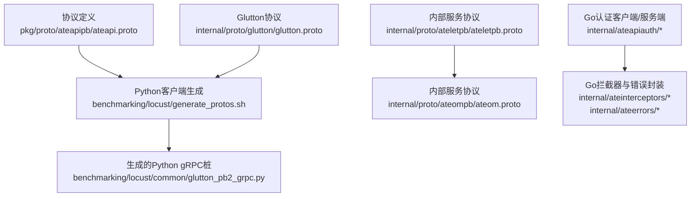
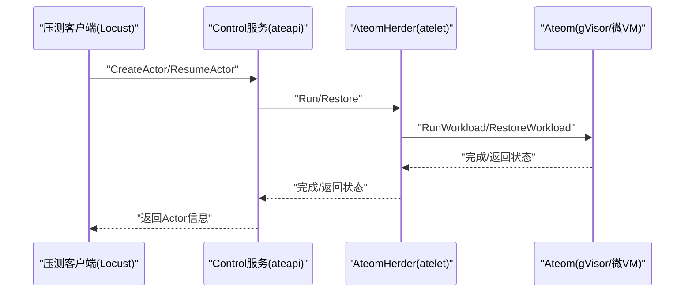
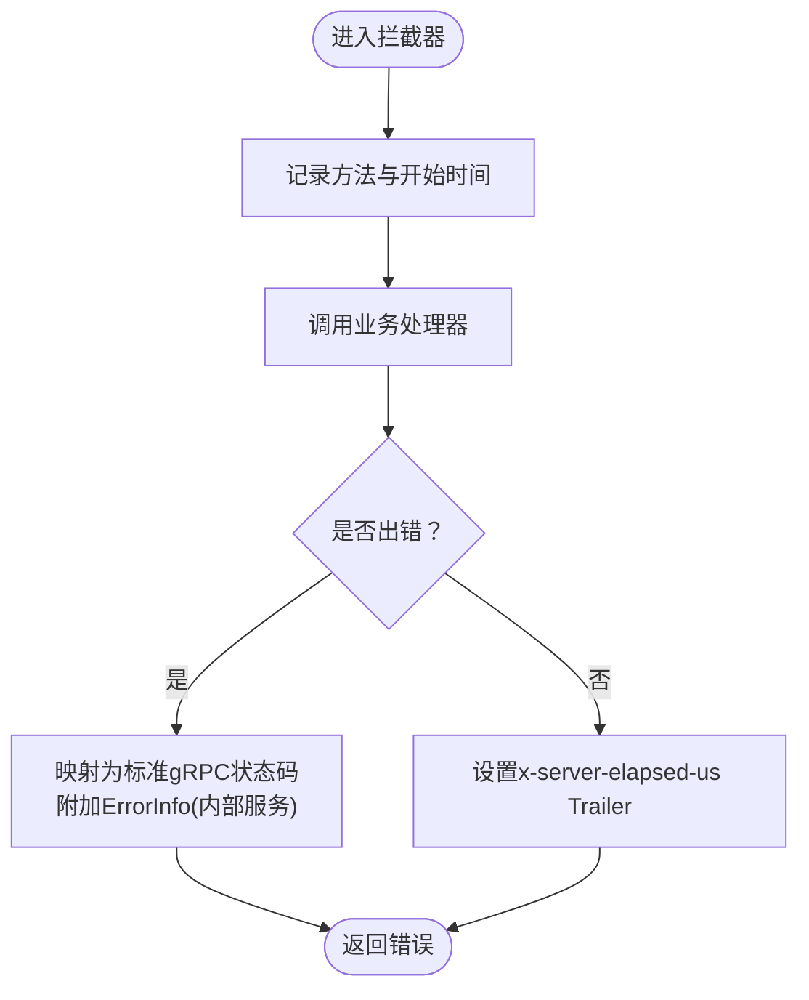
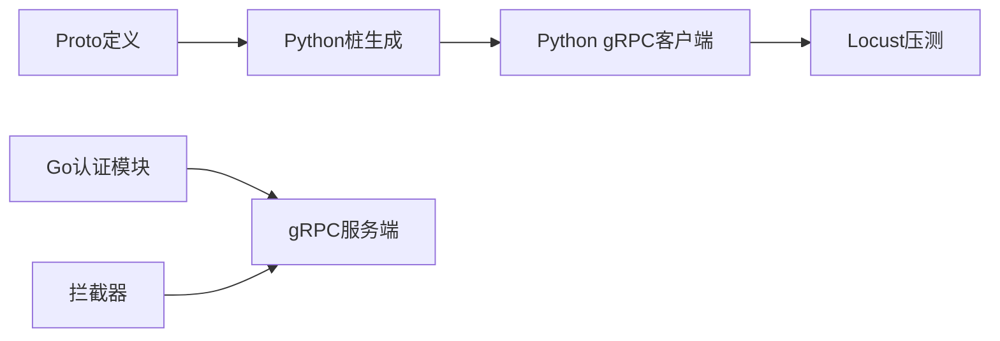

# gRPC工作负载测试

<cite>
**本文引用的文件**   
- [ateapi.proto](file://pkg/proto/ateapipb/ateapi.proto)
- [atelet.proto](file://internal/proto/ateletpb/ateletpb/atelet.proto)
- [ateom.proto](file://internal/proto/ateompb/ateom.proto)
- [glutton.proto](file://internal/proto/glutton/glutton.proto)
- [generate_protos.sh](file://benchmarking/locust/generate_protos.sh)
- [glutton_pb2_grpc.py](file://benchmarking/locust/common/glutton_pb2_grpc.py)
- [client.go](file://internal/ateapiauth/client.go)
- [server.go](file://internal/ateapiauth/server.go)
- [ateinterceptors.go](file://internal/ateinterceptors/ateinterceptors.go)
- [ateerrors.go](file://internal/ateerrors/ateerrors.go)
- [README.md](file://README.md)
</cite>

## 目录
1. [简介](#简介)
2. [项目结构](#项目结构)
3. [核心组件](#核心组件)
4. [架构总览](#架构总览)
5. [详细组件分析](#详细组件分析)
6. [依赖关系分析](#依赖关系分析)
7. [性能考虑](#性能考虑)
8. [故障排查指南](#故障排查指南)
9. [结论](#结论)
10. [附录](#附录)

## 简介
本文件面向“gRPC工作负载测试”的完整实现，围绕协议缓冲定义、客户端生成与配置、流式处理测试方法、拦截器使用（日志、追踪、认证）、性能基准测试（QPS、延迟、资源消耗）以及错误处理与重试机制展开。文档以仓库中实际存在的proto定义、Python/Go客户端生成脚本、认证与拦截器实现为依据，提供可操作的测试设计与落地建议。

## 项目结构
与gRPC工作负载测试直接相关的代码与资产主要分布在以下位置：
- 协议定义：pkg/proto/ateapipb、internal/proto/ateletpb、internal/proto/ateompb、internal/proto/glutton
- Python客户端生成与Locust压测：benchmarking/locust/generate_protos.sh、benchmarking/locust/common/glutton_pb2_grpc.py
- Go侧认证与拦截器：internal/ateapiauth、internal/ateinterceptors、internal/ateerrors
- 顶层说明：README.md

图表来源
- [generate_protos.sh:47-85](file://benchmarking/locust/generate_protos.sh#L47-L85)
- [glutton_pb2_grpc.py:1-193](file://benchmarking/locust/common/glutton_pb2_grpc.py#L1-L193)
- [ateapi.proto:1-417](file://pkg/proto/ateapipb/ateapi.proto#L1-L417)
- [ateletpb.proto:1-239](file://internal/proto/ateletpb/ateletpb.proto#L1-L239)
- [ateom.proto:1-171](file://internal/proto/ateompb/ateom.proto#L1-L171)
- [glutton.proto:1-200](file://internal/proto/glutton/glutton.proto#L1-L200)

章节来源
- [README.md:195-225](file://README.md#L195-L225)

## 核心组件
- 控制面API（Control）：对外暴露Actor生命周期管理、Atespace管理、Worker列表等标准CRUD与分页接口，遵循Google API规范风格。
- 节点编排API（AteomHerder）：在节点上执行Run/Checkpoint/Restore，驱动底层沙箱运行与快照。
- 虚拟机内控制API（Ateom）：对单个gVisor或微VM实例进行Workload运行、检查点与恢复。
- Glutton压测协议：用于产生内存/磁盘/网络等压力，配合Locust进行端到端压测。
- 认证与拦截器：支持mTLS与JWT两种模式；统一拦截器负责日志、耗时Trailer、结构化错误传播。

章节来源
- [ateapi.proto:25-65](file://pkg/proto/ateapipb/ateapi.proto#L25-L65)
- [ateletpb.proto:21-33](file://internal/proto/ateletpb/ateletpb.proto#L21-L33)
- [ateom.proto:34-48](file://internal/proto/ateompb/ateom.proto#L34-L48)
- [glutton.proto:1-200](file://internal/proto/glutton/glutton.proto#L1-L200)

## 架构总览
下图展示从控制面到节点、再到沙箱的工作负载执行路径，以及压测客户端如何调用相关服务。

图表来源
- [ateapi.proto:25-65](file://pkg/proto/ateapipb/ateapi.proto#L25-L65)
- [ateletpb.proto:21-33](file://internal/proto/ateletpb/ateletpb.proto#L21-L33)
- [ateom.proto:34-48](file://internal/proto/ateompb/ateom.proto#L34-L48)

## 详细组件分析

### 协议缓冲定义与消息类型
- 控制面API（Control）
  - 资源模型：Actor、Atespace、Worker、Selector、ResourceMetadata等。
  - 标准方法：Get/Create/Update/List/Pause/Suspend/Resume/Delete等，遵循AIP风格，List采用分页。
  - 参考路径：[ateapi.proto:25-65](file://pkg/proto/ateapipb/ateapi.proto#L25-L65)、[ateapi.proto:117-157](file://pkg/proto/ateapipb/ateapi.proto#L117-L157)、[ateapi.proto:284-304](file://pkg/proto/ateapipb/ateapi.proto#L284-L304)

- 节点编排API（AteomHerder）
  - 能力：Run、Checkpoint、Restore；包含SandboxAssets、WorkloadSpec、Volume、Container、Readyz等。
  - 参考路径：[ateletpb.proto:21-33](file://internal/proto/ateletpb/ateletpb.proto#L21-L33)、[ateletpb.proto:77-135](file://internal/proto/ateletpb/ateletpb.proto#L77-L135)

- 虚拟机内控制API（Ateom）
  - 能力：RunWorkload、CheckpointWorkload、RestoreWorkload；包含SnapshotScope等。
  - 参考路径：[ateom.proto:34-48](file://internal/proto/ateompb/ateom.proto#L34-L48)、[ateom.proto:97-107](file://internal/proto/ateompb/ateom.proto#L97-L107)

- Glutton压测协议
  - 用途：为压测场景提供RAM/Disk/FD/Gossip等方法，便于构造不同维度的负载。
  - 参考路径：[glutton.proto:1-200](file://internal/proto/glutton/glutton.proto#L1-L200)

章节来源
- [ateapi.proto:25-65](file://pkg/proto/ateapipb/ateapi.proto#L25-L65)
- [ateletpb.proto:21-33](file://internal/proto/ateletpb/ateletpb.proto#L21-L33)
- [ateom.proto:34-48](file://internal/proto/ateompb/ateom.proto#L34-L48)
- [glutton.proto:1-200](file://internal/proto/glutton/glutton.proto#L1-L200)

### gRPC客户端生成与配置（Python/Go）
- Python客户端生成
  - 通过脚本调用protoc生成Python桩，并修正相对导入以便在common包下使用。
  - 参考路径：[generate_protos.sh:47-85](file://benchmarking/locust/generate_protos.sh#L47-L85)
  - 生成产物示例：[glutton_pb2_grpc.py:1-193](file://benchmarking/locust/common/glutton_pb2_grpc.py#L1-L193)

- Go客户端认证与连接
  - 支持两种模式：
    - mTLS：默认模式，传输层证书校验可配置。
    - JWT：基于Kubernetes ServiceAccount Token作为Bearer凭证，每RPC读取token文件以支持自动轮换。
  - 参考路径：[client.go:34-95](file://internal/ateapiauth/client.go#L34-L95)、[client.go:97-117](file://internal/ateapiauth/client.go#L97-L117)

- 服务端认证拦截器
  - 支持mTLS与JWT两种模式；JWT模式下解析Authorization头并调用验证函数。
  - 参考路径：[server.go:72-103](file://internal/ateapiauth/server.go#L72-L103)、[server.go:141-152](file://internal/ateapiauth/server.go#L141-L152)

章节来源
- [generate_protos.sh:47-85](file://benchmarking/locust/generate_protos.sh#L47-L85)
- [glutton_pb2_grpc.py:1-193](file://benchmarking/locust/common/glutton_pb2_grpc.py#L1-L193)
- [client.go:34-95](file://internal/ateapiauth/client.go#L34-L95)
- [client.go:97-117](file://internal/ateapiauth/client.go#L97-L117)
- [server.go:72-103](file://internal/ateapiauth/server.go#L72-L103)
- [server.go:141-152](file://internal/ateapiauth/server.go#L141-L152)

### 流式处理测试方法
- 现状说明
  - 当前仓库中的核心服务（Control、AteomHerder、Ateom）均为Unary RPC，未定义Server/Client/Bidirectional Streaming接口。
  - 因此，针对单向/双向/服务端流的测试场景，可在现有框架基础上扩展新的Streaming RPC定义，并在压测客户端中增加对应调用逻辑。

- 建议的测试设计
  - 服务端流：例如“持续上报工作负载指标”，客户端建立一次请求后消费多帧响应，适合监控与遥测。
  - 客户端流：例如“批量写入事件”，客户端持续发送请求帧，服务端聚合处理。
  - 双向流：例如“交互式会话”，客户端与服务端交替收发，适合长连接交互场景。

- 实施要点
  - 在相应proto中新增Streaming RPC定义，保持与现有命名与错误码风格一致。
  - 在Python压测客户端中增加流式调用封装，记录吞吐、延迟与错误率。
  - 在服务端添加统一的流式拦截器，确保日志、追踪与超时控制一致。

章节来源
- [ateapi.proto:25-65](file://pkg/proto/ateapipb/ateapi.proto#L25-L65)
- [ateletpb.proto:21-33](file://internal/proto/ateletpb/ateletpb.proto#L21-L33)
- [ateom.proto:34-48](file://internal/proto/ateompb/ateom.proto#L34-L48)

### gRPC拦截器使用（日志、追踪、认证）
- 通用服务器拦截器
  - 功能：记录方法名、请求/响应摘要、错误信息、耗时；将服务端处理耗时写入Trailer，供客户端统计真实服务时间。
  - 安全：对包含敏感字段的消息进行脱敏（如env字段）。
  - 参考路径：[ateinterceptors.go:36-72](file://internal/ateinterceptors/ateinterceptors.go#L36-L72)、[ateinterceptors.go:104-139](file://internal/ateinterceptors/ateinterceptors.go#L104-L139)

- 内部服务专用拦截器
  - 功能：保留完整的gRPC错误细节（包括ErrorInfo），便于调试与自动化处理。
  - 参考路径：[ateinterceptors.go:74-102](file://internal/ateinterceptors/ateinterceptors.go#L74-L102)

- 认证拦截器
  - mTLS模式：身份由传输层证书建立。
  - JWT模式：解析Authorization头，调用外部验证函数校验Bearer Token。
  - 参考路径：[server.go:81-103](file://internal/ateapiauth/server.go#L81-L103)、[server.go:141-152](file://internal/ateapiauth/server.go#L141-L152)

图表来源
- [ateinterceptors.go:36-72](file://internal/ateinterceptors/ateinterceptors.go#L36-L72)
- [ateinterceptors.go:74-102](file://internal/ateinterceptors/ateinterceptors.go#L74-L102)

章节来源
- [ateinterceptors.go:36-72](file://internal/ateinterceptors/ateinterceptors.go#L36-L72)
- [ateinterceptors.go:74-102](file://internal/ateinterceptors/ateinterceptors.go#L74-L102)
- [server.go:81-103](file://internal/ateapiauth/server.go#L81-L103)

### 错误处理与重试机制
- 结构化错误
  - 使用NewGRPCError构建符合AIP-193的错误，携带ErrorInfo（Reason、Domain、Metadata），便于上层按原因分类处理。
  - 参考路径：[ateerrors.go:68-99](file://internal/ateerrors/ateerrors.go#L68-L99)

- 拦截器错误传播
  - 通用拦截器会将非status错误包装为Internal；内部服务拦截器保留完整错误细节。
  - 参考路径：[ateinterceptors.go:57-72](file://internal/ateinterceptors/ateinterceptors.go#L57-L72)、[ateinterceptors.go:88-102](file://internal/ateinterceptors/ateinterceptors.go#L88-L102)

- 重试策略建议
  - 仅对幂等且可重试的错误码（如Unavailable、DeadlineExceeded）进行指数退避重试。
  - 结合ErrorInfo.Reason进行细粒度决策（例如区分瞬时失败与数据不一致）。
  - 在压测客户端中实现可配置的重试策略，并统计重试次数与成功率。

章节来源
- [ateerrors.go:68-99](file://internal/ateerrors/ateerrors.go#L68-L99)
- [ateinterceptors.go:57-72](file://internal/ateinterceptors/ateinterceptors.go#L57-L72)
- [ateinterceptors.go:88-102](file://internal/ateinterceptors/ateinterceptors.go#L88-L102)

### 性能基准测试（QPS、延迟、资源消耗）
- 压测工具链
  - Locust + Python gRPC客户端：通过generate_protos.sh生成Python桩，编写用户行为模拟高并发。
  - 参考路径：[generate_protos.sh:47-85](file://benchmarking/locust/generate_protos.sh#L47-L85)、[glutton_pb2_grpc.py:1-193](file://benchmarking/locust/common/glutton_pb2_grpc.py#L1-L193)

- 关键指标
  - QPS：单位时间内成功完成的RPC数量。
  - 延迟：P50/P95/P99，优先使用服务端Trailer提供的x-server-elapsed-us以减少客户端调度开销影响。
  - 资源消耗：CPU、内存、FD、网络带宽；可通过系统监控与Prometheus采集。

- 测试场景
  - 短连接高频调用：评估控制面API吞吐与延迟。
  - 长连接流式调用：评估服务端流/客户端流/双向流的稳定性与背压处理。
  - 混合负载：结合Glutton协议制造内存/磁盘/网络压力，观察系统整体表现。

章节来源
- [generate_protos.sh:47-85](file://benchmarking/locust/generate_protos.sh#L47-L85)
- [glutton_pb2_grpc.py:1-193](file://benchmarking/locust/common/glutton_pb2_grpc.py#L1-L193)

## 依赖关系分析
- 生成依赖
  - Python桩生成依赖grpcio-tools与protobuf版本匹配；脚本会安装requirements.txt中的依赖。
  - 参考路径：[generate_protos.sh:74-85](file://benchmarking/locust/generate_protos.sh#L74-L85)

- 运行时依赖
  - Go客户端与服务端均依赖google.golang.org/grpc及credentials；认证模块依赖Kubernetes SA token文件。
  - 参考路径：[client.go:17-27](file://internal/ateapiauth/client.go#L17-L27)、[server.go:24-33](file://internal/ateapiauth/server.go#L24-L33)

图表来源
- [generate_protos.sh:47-85](file://benchmarking/locust/generate_protos.sh#L47-L85)
- [client.go:17-27](file://internal/ateapiauth/client.go#L17-L27)
- [server.go:24-33](file://internal/ateapiauth/server.go#L24-L33)

章节来源
- [generate_protos.sh:74-85](file://benchmarking/locust/generate_protos.sh#L74-L85)
- [client.go:17-27](file://internal/ateapiauth/client.go#L17-L27)
- [server.go:24-33](file://internal/ateapiauth/server.go#L24-L33)

## 性能考虑
- 连接池与复用：在高并发场景下复用gRPC连接，减少握手开销。
- 超时与取消：合理设置RPC超时与上下文取消，避免长尾请求拖垮系统。
- 采样与Trailer：利用x-server-elapsed-us获取更准确的延迟分布，降低客户端抖动影响。
- 背压与限流：在流式场景中引入速率限制与背压，防止下游过载。
- 资源隔离：结合Glutton协议进行多维压力注入，识别瓶颈点（CPU/IO/网络）。

## 故障排查指南
- 认证失败
  - 现象：Unauthenticated错误。
  - 排查：确认CA文件、Token文件路径与内容；检查Authorization头格式。
  - 参考路径：[server.go:141-152](file://internal/ateapiauth/server.go#L141-L152)、[client.go:104-117](file://internal/ateapiauth/client.go#L104-L117)

- 错误码与详情
  - 现象：业务错误未携带ErrorInfo或错误码不正确。
  - 排查：确认使用NewGRPCError创建错误；检查拦截器是否正确传播。
  - 参考路径：[ateerrors.go:68-99](file://internal/ateerrors/ateerrors.go#L68-L99)、[ateinterceptors.go:57-72](file://internal/ateinterceptors/ateinterceptors.go#L57-L72)

- 延迟异常
  - 现象：客户端统计延迟偏高。
  - 排查：对比x-server-elapsed-us与客户端测量值，定位客户端调度开销。
  - 参考路径：[ateinterceptors.go:36-72](file://internal/ateinterceptors/ateinterceptors.go#L36-L72)

## 结论
本项目提供了完善的gRPC协议定义、客户端生成与认证拦截器基础设施，适用于构建高质量的工作负载测试体系。建议在现有Unary接口基础上逐步引入Streaming RPC，并结合结构化错误与Trailer延迟指标完善压测与排障能力。

## 附录
- 快速开始与演示：参见README中的Demo与Quickstart部分，了解如何在本地或GKE环境部署与访问服务。
  - 参考路径：[README.md:97-159](file://README.md#L97-L159)
