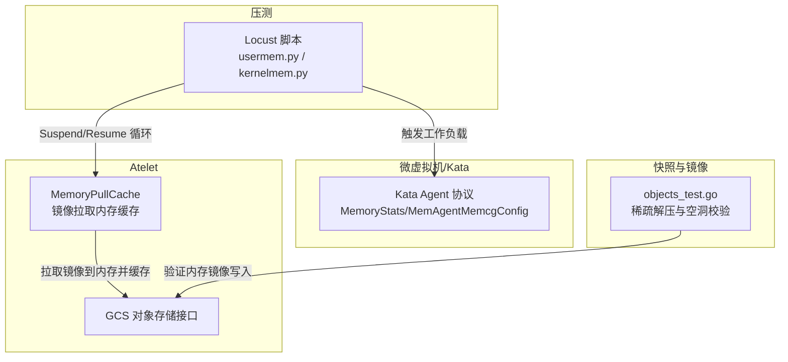
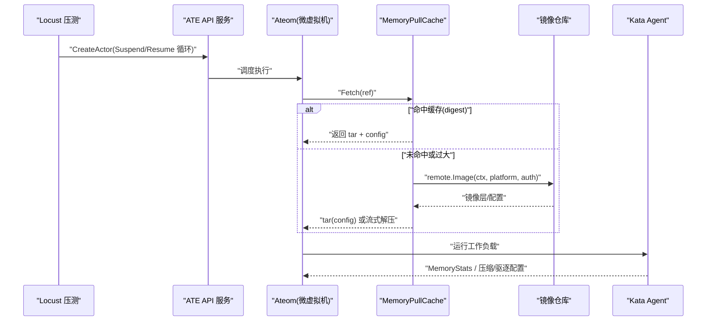
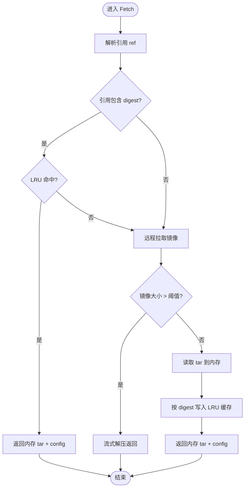
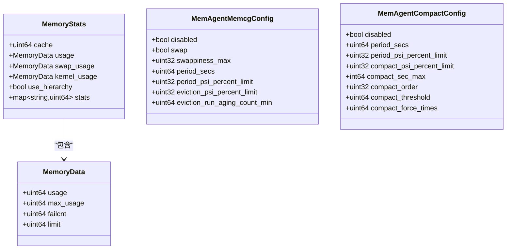
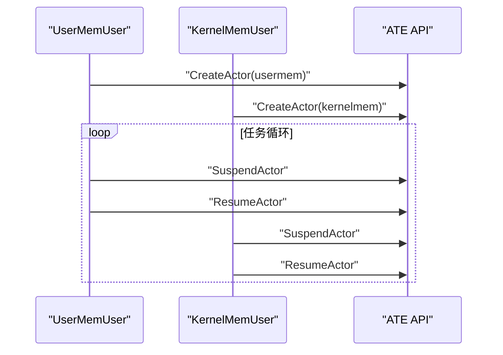
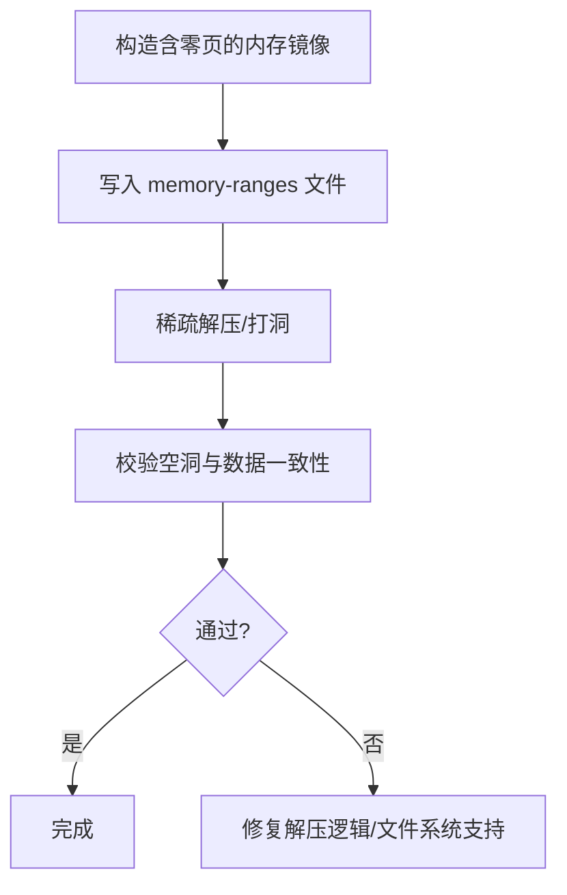
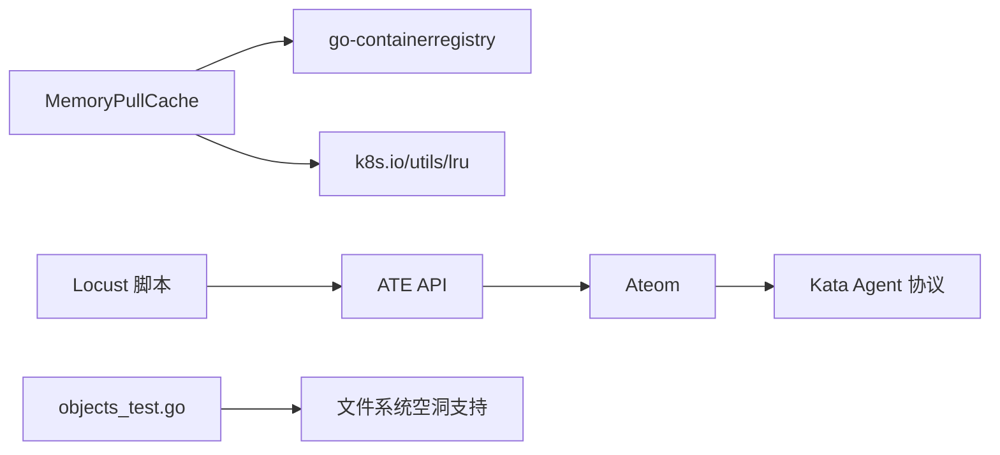

# 内存操作测试

<cite>
**本文引用的文件**   
- [memorypullcache.go](file://cmd/atelet/internal/memorypullcache/memorypullcache.go)
- [memorypullcache_test.go](file://cmd/atelet/internal/memorypullcache/memorypullcache_test.go)
- [agent.pb.go](file://cmd/ateom-microvm/internal/third_party/kata/agentpb/agent.pb.go)
- [usermem.py](file://benchmarking/locust/tests/usermem.py)
- [kernelmem.py](file://benchmarking/locust/tests/kernelmem.py)
- [objects_test.go](file://cmd/atelet/internal/ategcs/objects_test.go)
- [threat-model.md](file://docs/threat-model.md)
</cite>

## 目录
1. [引言](#引言)
2. [项目结构](#项目结构)
3. [核心组件](#核心组件)
4. [架构总览](#架构总览)
5. [详细组件分析](#详细组件分析)
6. [依赖分析](#依赖分析)
7. [性能考虑](#性能考虑)
8. [故障排查指南](#故障排查指南)
9. [结论](#结论)
10. [附录](#附录)

## 引言
本文件围绕“内存操作测试”的设计与实现，系统梳理用户态与内核态的内存访问测试、内存泄漏检测、内存压力测试、安全与边界条件验证，以及性能优化建议。结合仓库中的镜像拉取内存缓存、Kata Agent 内存统计与压缩配置、Locust 压测用例、快照稀疏解压测试与安全威胁模型，给出可落地的测试方案与最佳实践。

## 项目结构
与内存操作测试直接相关的代码与脚本主要分布在以下位置：
- atelet 侧的镜像拉取内存缓存（用于控制拉取过程中的内存占用）
- Kata Agent 协议定义（提供内存使用统计与压缩/驱逐策略配置）
- Locust 压测脚本（通过 Suspend/Resume 循环驱动工作负载，间接施加内存压力）
- 快照稀疏解压测试（验证内存镜像写入磁盘时的空洞生成与数据正确性）
- 威胁模型文档（指导内存相关的安全与隔离约束）

图表来源
- [memorypullcache.go:72-198](file://cmd/atelet/internal/memorypullcache/memorypullcache.go#L72-L198)
- [agent.pb.go:1007-1089](file://cmd/ateom-microvm/internal/third_party/kata/agentpb/agent.pb.go#L1007-L1089)
- [usermem.py:99-124](file://benchmarking/locust/tests/usermem.py#L99-L124)
- [kernelmem.py:99-124](file://benchmarking/locust/tests/kernelmem.py#L99-L124)
- [objects_test.go:315-340](file://cmd/atelet/internal/ategcs/objects_test.go#L315-L340)

章节来源
- [memorypullcache.go:72-198](file://cmd/atelet/internal/memorypullcache/memorypullcache.go#L72-L198)
- [agent.pb.go:1007-1089](file://cmd/ateom-microvm/internal/third_party/kata/agentpb/agent.pb.go#L1007-L1089)
- [usermem.py:99-124](file://benchmarking/locust/tests/usermem.py#L99-L124)
- [kernelmem.py:99-124](file://benchmarking/locust/tests/kernelmem.py#L99-L124)
- [objects_test.go:315-340](file://cmd/atelet/internal/ategcs/objects_test.go#L315-L340)

## 核心组件
- 镜像拉取内存缓存（MemoryPullCache）
  - 职责：在拉取 OCI 镜像时，将小体积镜像完整读入进程内存进行 LRU 缓存；大镜像则走流式解压路径，避免峰值内存过高。
  - 关键点：按 digest 命中缓存、本地注册表识别与重写、上下文传播以支持取消、大小阈值裁剪。
- Kata Agent 内存统计与配置
  - MemoryStats：包含 cache、usage、swap_usage、kernel_usage 等指标，便于观测容器/沙箱内存使用。
  - MemAgentMemcgConfig/MemAgentCompactConfig：提供 PSI 驱动的驱逐与压缩参数，可用于内存压力下的回收与碎片整理。
- Locust 压测脚本
  - usermem.py / kernelmem.py：通过 CreateActor -> SuspendActor -> ResumeActor 循环，驱动工作负载对宿主与沙箱内存产生持续压力。
- 快照稀疏解压测试
  - objects_test.go：构造含大量零页的内存镜像，验证解压后磁盘空洞（punch hole）是否生效，确保“内存镜像”写盘的正确性与空间效率。

章节来源
- [memorypullcache.go:72-198](file://cmd/atelet/internal/memorypullcache/memorypullcache.go#L72-L198)
- [agent.pb.go:1007-1089](file://cmd/ateom-microvm/internal/third_party/kata/agentpb/agent.pb.go#L1007-L1089)
- [agent.pb.go:4225-4323](file://cmd/ateom-microvm/internal/third_party/kata/agentpb/agent.pb.go#L4225-L4323)
- [usermem.py:99-124](file://benchmarking/locust/tests/usermem.py#L99-L124)
- [kernelmem.py:99-124](file://benchmarking/locust/tests/kernelmem.py#L99-L124)
- [objects_test.go:315-340](file://cmd/atelet/internal/ategcs/objects_test.go#L315-L340)

## 架构总览
下图展示从压测入口到镜像拉取、缓存命中、以及沙箱内存统计的关键交互。

图表来源
- [memorypullcache.go:72-198](file://cmd/atelet/internal/memorypullcache/memorypullcache.go#L72-L198)
- [agent.pb.go:1007-1089](file://cmd/ateom-microvm/internal/third_party/kata/agentpb/agent.pb.go#L1007-L1089)
- [usermem.py:99-124](file://benchmarking/locust/tests/usermem.py#L99-L124)
- [kernelmem.py:99-124](file://benchmarking/locust/tests/kernelmem.py#L99-L124)

## 详细组件分析

### 组件一：镜像拉取内存缓存（MemoryPullCache）
- 设计要点
  - 基于 LRU 的进程内缓存，键为镜像 digest，值为 tar 字节数组与配置。
  - 当请求引用包含 digest 且命中缓存时，直接返回内存中 tar 与配置，避免网络 IO。
  - 对大于阈值的镜像，不放入内存缓存，改为流式解压返回，降低 RSS 峰值。
  - 支持本地注册表识别与重写，允许 HTTP 拉取以适配开发环境。
  - 通过 WithContext 传递调用方上下文，使取消信号能中断正在进行的层下载，防止后台 goroutine 持有部分缓冲导致 RSS 膨胀。
- 关键流程（算法流程图）

图表来源
- [memorypullcache.go:72-198](file://cmd/atelet/internal/memorypullcache/memorypullcache.go#L72-L198)

章节来源
- [memorypullcache.go:72-198](file://cmd/atelet/internal/memorypullcache/memorypullcache.go#L72-L198)
- [memorypullcache_test.go:21-84](file://cmd/atelet/internal/memorypullcache/memorypullcache_test.go#L21-L84)

### 组件二：Kata Agent 内存统计与压缩/驱逐配置
- 数据结构
  - MemoryData：记录 usage、max_usage、failcnt、limit 等。
  - MemoryStats：汇总 cache、usage、swap_usage、kernel_usage 及扩展 stats。
  - MemAgentMemcgConfig：cgroup 内存子系统相关 PSI 周期、驱逐阈值等。
  - MemAgentCompactConfig：周期性压缩、压缩阈值、顺序、强制次数等。
- 用途
  - 监控沙箱/容器的内存使用趋势，定位异常增长。
  - 通过 PSI 阈值触发驱逐与压缩，缓解 OOM 风险与碎片化。
- 类图（概念映射到实际类型）

图表来源
- [agent.pb.go:1007-1089](file://cmd/ateom-microvm/internal/third_party/kata/agentpb/agent.pb.go#L1007-L1089)
- [agent.pb.go:4225-4323](file://cmd/ateom-microvm/internal/third_party/kata/agentpb/agent.pb.go#L4225-L4323)

章节来源
- [agent.pb.go:1007-1089](file://cmd/ateom-microvm/internal/third_party/kata/agentpb/agent.pb.go#L1007-L1089)
- [agent.pb.go:4225-4323](file://cmd/ateom-microvm/internal/third_party/kata/agentpb/agent.pb.go#L4225-L4323)

### 组件三：Locust 压测脚本（用户态/内核态内存压力）
- 目标
  - 通过频繁创建、挂起、恢复 Actor，驱动宿主机与沙箱的内存分配与释放，形成持续的内存压力。
- 行为
  - on_start：建立 gRPC 通道，确保 atespace，创建 Actor。
  - workload_cycle：周期性 SuspendActor -> ResumeActor，模拟内存抖动与碎片化场景。
  - on_stop：清理资源，关闭连接。
- 适用场景
  - 用户态内存压力：usermem.py 对应模板侧重应用层内存分配模式。
  - 内核态内存压力：kernelmem.py 对应模板侧重内核路径（如页面分配、页缓存）的压力。

图表来源
- [usermem.py:99-124](file://benchmarking/locust/tests/usermem.py#L99-L124)
- [kernelmem.py:99-124](file://benchmarking/locust/tests/kernelmem.py#L99-L124)

章节来源
- [usermem.py:99-124](file://benchmarking/locust/tests/usermem.py#L99-L124)
- [kernelmem.py:99-124](file://benchmarking/locust/tests/kernelmem.py#L99-L124)

### 组件四：快照稀疏解压与空洞生成（内存镜像写盘）
- 目的
  - 验证“内存镜像”文件中大量零页区域被正确打洞（punch hole），减少磁盘占用，同时保证数据精确一致。
- 方法
  - 构造近似真实 guest memory-ranges 的数据分布（首块、中间跨块、尾部非对齐）。
  - 解压后检查磁盘占用块数与内容一致性，确认空洞生效。
- 意义
  - 对快照恢复与迁移的性能至关重要，避免无谓 I/O 与存储浪费。

图表来源
- [objects_test.go:315-340](file://cmd/atelet/internal/ategcs/objects_test.go#L315-L340)

章节来源
- [objects_test.go:315-340](file://cmd/atelet/internal/ategcs/objects_test.go#L315-L340)

## 依赖分析
- 组件耦合
  - MemoryPullCache 依赖 go-containerregistry 与 LRU 缓存，受上下文取消影响较大。
  - Kata Agent 协议作为只读契约，供上层观测与调优。
  - Locust 脚本通过 API 间接驱动宿主机与沙箱内存行为。
  - 快照测试依赖底层文件系统对空洞的支持。
- 外部依赖
  - 镜像仓库认证（GCR/pkg.dev）、本地注册表兼容。
  - 操作系统/文件系统特性（fallocate/punch hole）。

图表来源
- [memorypullcache.go:17-33](file://cmd/atelet/internal/memorypullcache/memorypullcache.go#L17-L33)
- [agent.pb.go:1007-1089](file://cmd/ateom-microvm/internal/third_party/kata/agentpb/agent.pb.go#L1007-L1089)
- [usermem.py:99-124](file://benchmarking/locust/tests/usermem.py#L99-L124)
- [kernelmem.py:99-124](file://benchmarking/locust/tests/kernelmem.py#L99-L124)
- [objects_test.go:315-340](file://cmd/atelet/internal/ategcs/objects_test.go#L315-L340)

章节来源
- [memorypullcache.go:17-33](file://cmd/atelet/internal/memorypullcache/memorypullcache.go#L17-L33)
- [agent.pb.go:1007-1089](file://cmd/ateom-microvm/internal/third_party/kata/agentpb/agent.pb.go#L1007-L1089)
- [usermem.py:99-124](file://benchmarking/locust/tests/usermem.py#L99-L124)
- [kernelmem.py:99-124](file://benchmarking/locust/tests/kernelmem.py#L99-L124)
- [objects_test.go:315-340](file://cmd/atelet/internal/ategcs/objects_test.go#L315-L340)

## 性能考虑
- 缓存策略
  - 仅对小体积镜像做内存缓存，大镜像走流式解压，避免 RSS 峰值。
  - 可按 digest 复用已拉取镜像，显著降低重复拉取的 CPU/IO 开销。
- 内存池与对象复用
  - 在高频 Suspend/Resume 场景下，复用临时缓冲区与对象可减少 GC 压力。
- 垃圾回收调优
  - 合理设置 Go GC 参数（如 GOGC），在高并发拉取与解压时平衡延迟与吞吐。
- PSI 驱动的回收与压缩
  - 利用 MemAgentMemcgConfig 与 MemAgentCompactConfig 的 PSI 阈值，提前触发驱逐与压缩，降低 OOM 概率。
- 快照与空洞
  - 确保文件系统支持 punch hole，减少快照体积与恢复时间。

[本节为通用性能建议，无需特定文件来源]

## 故障排查指南
- 镜像拉取阶段
  - 现象：RSS 异常升高或取消无效。
  - 排查：确认 remote.WithContext 是否正确传播；检查大镜像是否误入内存缓存；核对本地注册表重写规则。
- 内存统计异常
  - 现象：MemoryStats 指标突增或长期不降。
  - 排查：关注 swap_usage 与 kernel_usage；调整 PSI 驱逐阈值与压缩参数；观察 failcnt 变化。
- 快照空洞失效
  - 现象：memory-ranges 文件占满磁盘。
  - 排查：确认文件系统是否支持空洞；验证解压路径是否调用打洞接口；对比预期与实际磁盘块数。
- 安全与隔离
  - 参考威胁模型中对“恶意镜像 DoS/资源耗尽”“快照篡改/泄露”的缓解措施，确保拉取与恢复链路具备鉴权与完整性校验。

章节来源
- [memorypullcache.go:72-198](file://cmd/atelet/internal/memorypullcache/memorypullcache.go#L72-L198)
- [agent.pb.go:1007-1089](file://cmd/ateom-microvm/internal/third_party/kata/agentpb/agent.pb.go#L1007-L1089)
- [objects_test.go:315-340](file://cmd/atelet/internal/ategcs/objects_test.go#L315-L340)
- [threat-model.md:93-117](file://docs/threat-model.md#L93-L117)

## 结论
通过对镜像拉取内存缓存、Kata Agent 内存统计与压缩配置、Locust 压测脚本与快照稀疏解压测试的综合分析，可以构建覆盖用户态与内核态的内存操作测试体系。结合 PSI 驱动的回收与压缩、合理的缓存与对象复用策略，以及严格的安全与完整性校验，能够在高并发与极端压力下保障系统的稳定性与性能。

[本节为总结性内容，无需特定文件来源]

## 附录
- 用户态内存访问测试建议
  - 分配/读写：在 Actor 中构造不同大小的连续/离散分配，覆盖页边界与对齐情况。
  - 内存映射：mmap/munmap 生命周期与错误路径（越界、权限不足、资源耗尽）。
- 内核态内存操作测试建议
  - 系统调用：kmalloc/kfree、page alloc/free、slab 分配器压力。
  - 页面操作：换入/换出、页缓存命中率、匿名页与文件页差异。
- 内存泄漏检测
  - 监控：采集 MemoryStats 指标，结合 failcnt 与 swap_usage 判断异常。
  - 定位：结合堆栈采样与对象生命周期追踪，区分短期热点与长期泄漏。
  - 性能影响：评估采样频率与开销，必要时仅在回归测试开启。
- 内存压力测试
  - 高并发分配：多协程/多进程并发分配与释放，观察抖动与碎片化。
  - OOM 模拟：逐步逼近限制，验证驱逐/压缩/退避策略。
- 内存安全与边界条件
  - 越界访问、空指针、重复释放、use-after-free 的检测与防护。
  - 镜像与快照的完整性校验与最小权限原则。

[本节为通用方法论，无需特定文件来源]
