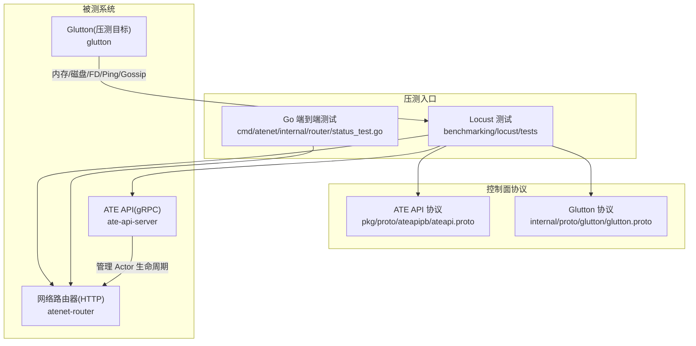
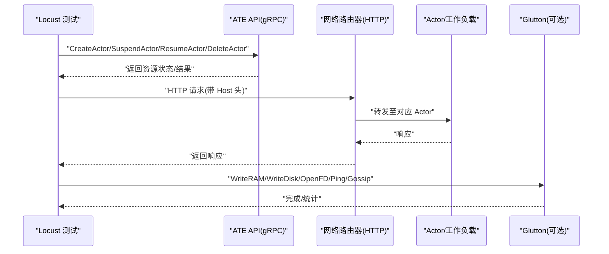
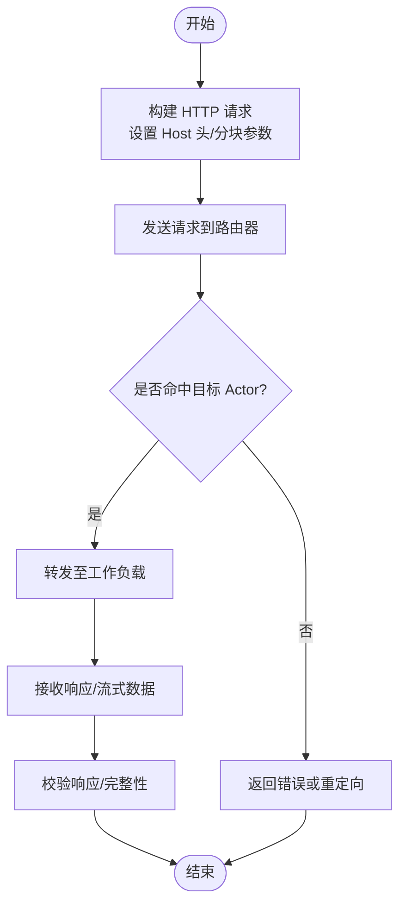
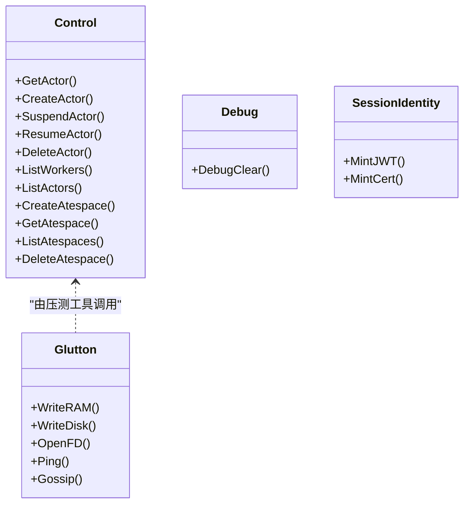
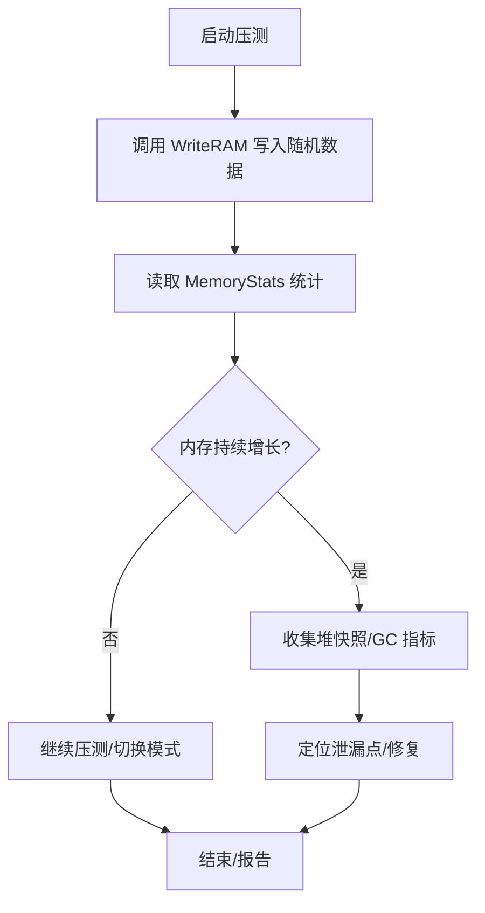
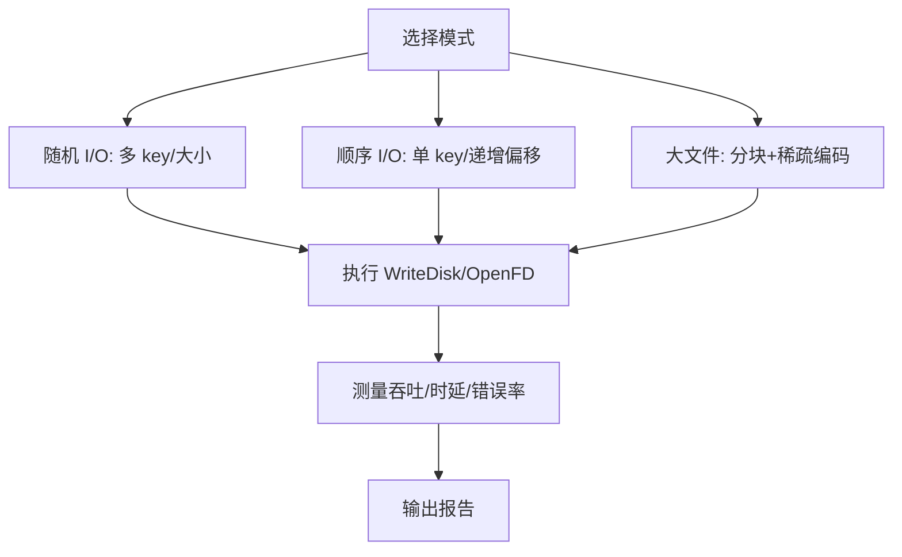
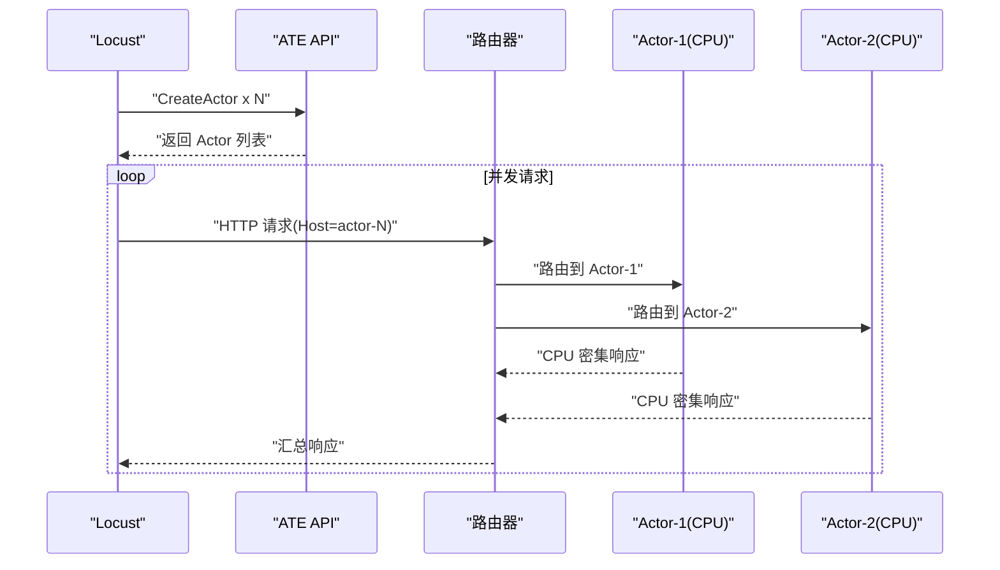
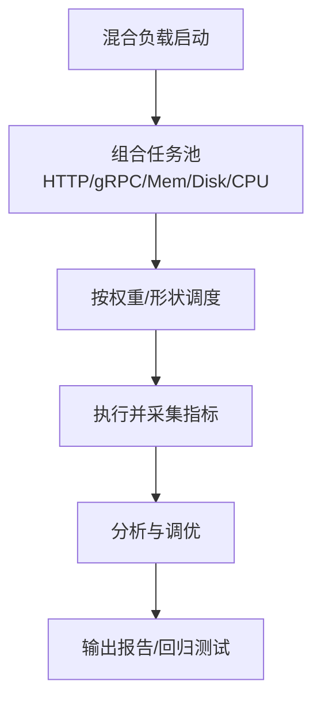
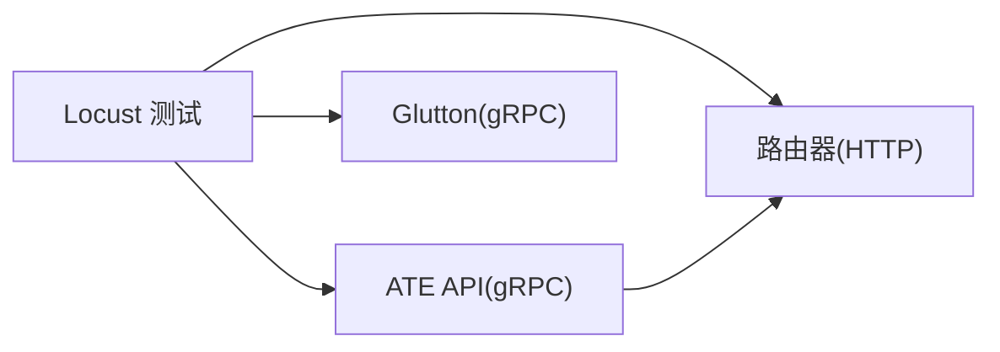

# 工作负载类型

<cite>
**本文引用的文件**   
- [README.md](file://README.md)
- [benchmarking/README.md](file://benchmarking/README.md)
- [pkg/proto/ateapipb/ateapi.proto](file://pkg/proto/ateapipb/ateapi.proto)
- [internal/proto/glutton/glutton.proto](file://internal/proto/glutton/glutton.proto)
- [benchmarking/locust/tests/kernelmem.py](file://benchmarking/locust/tests/kernelmem.py)
- [benchmarking/locust/tests/glutton.py](file://benchmarking/locust/tests/glutton.py)
- [benchmarking/locust/common/glutton_pb2_grpc.py](file://benchmarking/locust/common/glutton_pb2_grpc.py)
- [cmd/atenet/internal/router/status_test.go](file://cmd/atenet/internal/router/status_test.go)
- [internal/readyz/readyz.go](file://internal/readyz/readyz.go)
- [cmd/atelet/internal/ategcs/objects_test.go](file://cmd/atelet/internal/ategcs/objects_test.go)
- [cmd/ateom-microvm/internal/third_party/kata/agentpb/agent.pb.go](file://cmd/ateom-microvm/internal/third_party/kata/agentpb/agent.pb.go)
</cite>

## 目录
1. [简介](#简介)
2. [项目结构](#项目结构)
3. [核心组件](#核心组件)
4. [架构总览](#架构总览)
5. [详细组件分析](#详细组件分析)
6. [依赖关系分析](#依赖关系分析)
7. [性能考量](#性能考量)
8. [故障排查指南](#故障排查指南)
9. [结论](#结论)
10. [附录](#附录)

## 简介
本文件面向“工作负载类型”的测试方法与实现细节，覆盖以下关键场景：
- HTTP 请求测试：REST API 调用、WebSocket 连接、文件上传下载
- gRPC 服务测试：协议缓冲定义、客户端生成、流式处理与生命周期操作
- 内存操作测试：用户态内存访问、内核态内存操作、内存泄漏检测
- 文件系统 IO 测试：随机读写、顺序读写、大文件处理
- CPU 密集型测试：计算密集型任务、并发计算、负载均衡
- 混合工作负载：多类压力组合与编排

本项目提供基于 Locust 的压测套件与 Go 侧的端到端测试，配合 ATE API（gRPC）与网络路由器（HTTP），可覆盖上述多种工作负载。

## 项目结构
与“工作负载类型”直接相关的代码主要分布在以下位置：
- 基准测试说明与部署脚本：benchmarking/README.md
- gRPC 控制面协议定义：pkg/proto/ateapipb/ateapi.proto
- Glutton 压测协议定义：internal/proto/glutton/glutton.proto
- Locust 测试用例（Python）：benchmarking/locust/tests/*.py
- 网络路由状态页测试（HTTP）：cmd/atenet/internal/router/status_test.go
- 就绪探针（HTTP）：internal/readyz/readyz.go
- 对象存储与稀疏内容编解码测试（IO）：cmd/atelet/internal/ategcs/objects_test.go
- 内核态内存统计（Kata Agent PB）：cmd/ateom-microvm/internal/third_party/kata/agentpb/agent.pb.go

图表来源
- [benchmarking/README.md:1-90](file://benchmarking/README.md#L1-L90)
- [pkg/proto/ateapipb/ateapi.proto:25-65](file://pkg/proto/ateapipb/ateapi.proto#L25-L65)
- [internal/proto/glutton/glutton.proto:23-45](file://internal/proto/glutton/glutton.proto#L23-L45)
- [cmd/atenet/internal/router/status_test.go:92-144](file://cmd/atenet/internal/router/status_test.go#L92-L144)

章节来源
- [README.md:1-225](file://README.md#L1-L225)
- [benchmarking/README.md:1-90](file://benchmarking/README.md#L1-L90)

## 核心组件
- ATE API（gRPC）：提供 Actor/Atespace/Worker 等资源的创建、挂起、恢复、删除、列举等能力，是工作负载生命周期管理的核心接口。
- Glutton（gRPC）：面向压测的轻量服务，暴露 WriteRAM、WriteDisk、OpenFD、Ping、Gossip 等方法，用于构造内存、磁盘、FD、网络等压力。
- 网络路由器（HTTP）：对外暴露 HTTP 接口，支持按 Host 头进行路由；提供 /statusz 等诊断页面，便于验证请求命中与追踪。
- Locust 测试集：通过 Python 脚本驱动 ATE API 与路由器，模拟真实用户行为与工作负载。

章节来源
- [pkg/proto/ateapipb/ateapi.proto:25-65](file://pkg/proto/ateapipb/ateapi.proto#L25-L65)
- [internal/proto/glutton/glutton.proto:23-45](file://internal/proto/glutton/glutton.proto#L23-L45)
- [cmd/atenet/internal/router/status_test.go:92-144](file://cmd/atenet/internal/router/status_test.go#L92-L144)

## 架构总览
下图展示从 Locust 到 ATE API 再到路由器与被测工作负载的整体交互流程，以及 Glutton 作为独立压测目标的接入方式。

图表来源
- [pkg/proto/ateapipb/ateapi.proto:25-65](file://pkg/proto/ateapipb/ateapi.proto#L25-L65)
- [internal/proto/glutton/glutton.proto:23-45](file://internal/proto/glutton/glutton.proto#L23-L45)
- [cmd/atenet/internal/router/status_test.go:92-144](file://cmd/atenet/internal/router/status_test.go#L92-L144)

## 详细组件分析

### HTTP 请求测试（REST、WebSocket、文件上传下载）
- REST API 调用
  - 使用 Locust 或 Go 测试向路由器发起 HTTP 请求，并通过 Host 头将请求绑定到特定 Actor，以验证动态路由与状态保持。
  - 示例参考路径：[counter_demo 中设置 Host 头并发起请求:103-108](file://benchmarking/locust/tests/counter_demo.py#L103-L108)
- WebSocket 连接
  - 可通过在路由器前配置反向代理或使用支持 WS 的客户端库建立双向长连接，结合 Host 头进行会话级路由。
  - 建议结合分布式追踪与指标采集，记录握手时延、消息往返时延与错误率。
- 文件上传下载
  - 通过分块上传与断点续传策略提升稳定性；服务端可使用流式写入减少峰值内存占用。
  - 针对大文件，建议使用对象存储后端与稀疏编码优化传输效率。
  - 参考路径：[对象存储与稀疏内容编解码测试:417-465](file://cmd/atelet/internal/ategcs/objects_test.go#L417-L465)

图表来源
- [cmd/atenet/internal/router/status_test.go:92-144](file://cmd/atenet/internal/router/status_test.go#L92-L144)
- [cmd/atelet/internal/ategcs/objects_test.go:417-465](file://cmd/atelet/internal/ategcs/objects_test.go#L417-L465)

章节来源
- [cmd/atenet/internal/router/status_test.go:92-144](file://cmd/atenet/internal/router/status_test.go#L92-L144)
- [cmd/atelet/internal/ategcs/objects_test.go:417-465](file://cmd/atelet/internal/ategcs/objects_test.go#L417-L465)

### gRPC 服务测试（协议缓冲、客户端生成、流式处理）
- 协议缓冲定义
  - ATE API 定义了 Control、Debug、SessionIdentity 等服务，涵盖 Actor/Atespace/Worker 的完整生命周期与调试能力。
  - Glutton 定义了 WriteRAM、WriteDisk、OpenFD、Ping、Gossip 等压测方法。
  - 参考路径：
    - [ATE API 服务定义:25-65](file://pkg/proto/ateapipb/ateapi.proto#L25-L65)
    - [Glutton 服务定义:23-45](file://internal/proto/glutton/glutton.proto#L23-L45)
- 客户端生成
  - 使用 protoc 与 grpc 插件为 Go/Python 生成客户端代码；Locust 侧通过 common 包中的 pb2_grpc 模块调用。
  - 参考路径：
    - [Glutton Python gRPC 存根:80-110](file://benchmarking/locust/common/glutton_pb2_grpc.py#L80-L110)
- 流式处理测试
  - 可在 Glutton 的 Gossip 方法上实现周期性消息推送，或在 ATE API 上新增 Server/Client/Bidirectional Streaming RPC 以测试流式吞吐与时延。
  - 当前 Glutton.Gossip 已具备 Peer 列表与延迟配置，适合构造多节点间持续通信的压力模型。

图表来源
- [pkg/proto/ateapipb/ateapi.proto:25-65](file://pkg/proto/ateapipb/ateapi.proto#L25-L65)
- [internal/proto/glutton/glutton.proto:23-45](file://internal/proto/glutton/glutton.proto#L23-L45)

章节来源
- [pkg/proto/ateapipb/ateapi.proto:25-65](file://pkg/proto/ateapipb/ateapi.proto#L25-L65)
- [internal/proto/glutton/glutton.proto:23-45](file://internal/proto/glutton/glutton.proto#L23-L45)
- [benchmarking/locust/common/glutton_pb2_grpc.py:80-110](file://benchmarking/locust/common/glutton_pb2_grpc.py#L80-L110)

### 内存操作测试（用户态、内核态、泄漏检测）
- 用户态内存访问
  - 通过 Glutton.WriteRAM 对指定 key 写入随机字节，支持覆盖或追加模式，可用于评估用户态内存分配与写放大。
  - 参考路径：[Glutton 协议定义:55-66](file://internal/proto/glutton/glutton.proto#L55-L66)
- 内核态内存操作
  - 借助 Kata Agent 的 MemoryStats 获取进程/容器级别的内存使用、缓存、Swap 与内核态用量，辅助定位内核态压力。
  - 参考路径：[MemoryStats 字段:1007-1089](file://cmd/ateom-microvm/internal/third_party/kata/agentpb/agent.pb.go#L1007-L1089)
- 内存泄漏检测
  - 在长时间运行压测后对比 MemoryStats.Usage 与 Cache 变化趋势，结合 GC 指标与堆快照分析潜在泄漏。
  - 建议在 Suspend/Resume 循环中观察内存增长是否稳定收敛。

图表来源
- [internal/proto/glutton/glutton.proto:55-66](file://internal/proto/glutton/glutton.proto#L55-L66)
- [cmd/ateom-microvm/internal/third_party/kata/agentpb/agent.pb.go:1007-1089](file://cmd/ateom-microvm/internal/third_party/kata/agentpb/agent.pb.go#L1007-L1089)

章节来源
- [internal/proto/glutton/glutton.proto:55-66](file://internal/proto/glutton/glutton.proto#L55-L66)
- [cmd/ateom-microvm/internal/third_party/kata/agentpb/agent.pb.go:1007-1089](file://cmd/ateom-microvm/internal/third_party/kata/agentpb/agent.pb.go#L1007-L1089)

### 文件系统 IO 测试（随机/顺序/大文件）
- 随机读写
  - 使用 Glutton.WriteDisk 指定不同 key 与大小，模拟随机 I/O 模式；结合 OpenFD 打开大量 FD 以施加系统资源压力。
  - 参考路径：
    - [Glutton.WriteDisk/OpenFD:68-87](file://internal/proto/glutton/glutton.proto#L68-L87)
- 顺序读写
  - 通过连续写入相同 key 或递增偏移的文件，评估顺序吞吐与延迟。
- 大文件处理
  - 采用分块写入与稀疏编码，降低网络与存储开销；参考对象存储与稀疏编解码测试用例。
  - 参考路径：[稀疏内容编解码测试:417-465](file://cmd/atelet/internal/ategcs/objects_test.go#L417-L465)

图表来源
- [internal/proto/glutton/glutton.proto:68-87](file://internal/proto/glutton/glutton.proto#L68-L87)
- [cmd/atelet/internal/ategcs/objects_test.go:417-465](file://cmd/atelet/internal/ategcs/objects_test.go#L417-L465)

章节来源
- [internal/proto/glutton/glutton.proto:68-87](file://internal/proto/glutton/glutton.proto#L68-L87)
- [cmd/atelet/internal/ategcs/objects_test.go:417-465](file://cmd/atelet/internal/ategcs/objects_test.go#L417-L465)

### CPU 密集型测试（计算任务、并发、负载均衡）
- 计算密集型任务
  - 在工作负载中引入 CPU 密集算法（如矩阵运算、哈希计算），通过 Glutton.Ping 或自定义 RPC 触发，评估 CPU 利用率与调度公平性。
- 并发计算
  - 使用多协程/线程并行执行计算任务，结合 ATE API 的 ResumeActor 快速拉起多个实例，验证水平扩展能力。
- 负载均衡
  - 通过路由器按 Host 头分发请求至不同 Actor，观察各 Worker 的负载分布与热点迁移。
  - 参考路径：[路由器状态页测试（验证匹配与追踪）:92-144](file://cmd/atenet/internal/router/status_test.go#L92-L144)

图表来源
- [cmd/atenet/internal/router/status_test.go:92-144](file://cmd/atenet/internal/router/status_test.go#L92-L144)
- [pkg/proto/ateapipb/ateapi.proto:25-65](file://pkg/proto/ateapipb/ateapi.proto#L25-L65)

章节来源
- [cmd/atenet/internal/router/status_test.go:92-144](file://cmd/atenet/internal/router/status_test.go#L92-L144)
- [pkg/proto/ateapipb/ateapi.proto:25-65](file://pkg/proto/ateapipb/ateapi.proto#L25-L65)

### 混合工作负载设计与模拟
- 设计思路
  - 组合 HTTP 请求、gRPC 调用、内存/磁盘 IO、CPU 计算等多类任务，按比例混合注入，模拟真实业务峰谷与突发。
  - 使用 Glutton.Gossip 构造节点间持续通信，叠加 ATE API 的 Suspend/Resume 循环，评估系统在状态迁移时的稳定性。
- 实施要点
  - 通过 Locust 的用户类与等待时间函数调节流量曲线；结合分布式追踪与指标采集，定位瓶颈。
  - 参考路径：
    - [KernelMemUser 的 Suspend/Resume 循环:99-124](file://benchmarking/locust/tests/kernelmem.py#L99-L124)
    - [GluttonUser 占位声明（供主节点枚举）:35-44](file://benchmarking/locust/tests/glutton.py#L35-L44)

图表来源
- [benchmarking/locust/tests/kernelmem.py:99-124](file://benchmarking/locust/tests/kernelmem.py#L99-L124)
- [benchmarking/locust/tests/glutton.py:35-44](file://benchmarking/locust/tests/glutton.py#L35-L44)

章节来源
- [benchmarking/locust/tests/kernelmem.py:99-124](file://benchmarking/locust/tests/kernelmem.py#L99-L124)
- [benchmarking/locust/tests/glutton.py:35-44](file://benchmarking/locust/tests/glutton.py#L35-L44)

## 依赖关系分析
- Locust 测试依赖 ATE API 与路由器：
  - 通过 gRPC 调用 ATE API 管理 Actor 生命周期
  - 通过 HTTP 访问路由器进行业务请求
- Glutton 作为独立压测目标，提供内存/磁盘/FD/网络压力
- 路由器提供 HTTP 诊断页面，便于验证请求命中与追踪

图表来源
- [pkg/proto/ateapipb/ateapi.proto:25-65](file://pkg/proto/ateapipb/ateapi.proto#L25-L65)
- [internal/proto/glutton/glutton.proto:23-45](file://internal/proto/glutton/glutton.proto#L23-L45)
- [cmd/atenet/internal/router/status_test.go:92-144](file://cmd/atenet/internal/router/status_test.go#L92-L144)

章节来源
- [pkg/proto/ateapipb/ateapi.proto:25-65](file://pkg/proto/ateapipb/ateapi.proto#L25-L65)
- [internal/proto/glutton/glutton.proto:23-45](file://internal/proto/glutton/glutton.proto#L23-L45)
- [cmd/atenet/internal/router/status_test.go:92-144](file://cmd/atenet/internal/router/status_test.go#L92-L144)

## 性能考量
- 就绪探针与超时控制
  - 使用短轮询与合理超时避免冷启动阶段的误判，提高探测稳定性。
  - 参考路径：[就绪探针配置:34-60](file://internal/readyz/readyz.go#L34-L60)
- 对象存储与稀疏编码
  - 对于大文件与稀疏数据，采用分块与稀疏编码可降低带宽与存储成本，提升吞吐。
  - 参考路径：[稀疏内容编解码测试:417-465](file://cmd/atelet/internal/ategcs/objects_test.go#L417-L465)
- 指标与追踪
  - 启用分布式追踪与 Prometheus 指标，结合 Grafana 面板进行深度分析。
  - 参考路径：[基准测试监控说明](file://benchmarking/README.md:64-L79)

章节来源
- [internal/readyz/readyz.go:34-60](file://internal/readyz/readyz.go#L34-L60)
- [cmd/atelet/internal/ategcs/objects_test.go:417-465](file://cmd/atelet/internal/ategcs/objects_test.go#L417-L465)
- [benchmarking/README.md:64-79](file://benchmarking/README.md#L64-L79)

## 故障排查指南
- 路由器状态页验证
  - 检查 /statusz 页面是否包含预期标题与活动追踪信息；支持 JSON 格式输出以便自动化解析。
  - 参考路径：[路由器状态页测试](file://cmd/atenet/internal/router/status_test.go:92-L144)
- 就绪探针失败
  - 调整整体超时、请求超时与轮询间隔，确保冷启动阶段不被误判为不健康。
  - 参考路径：[就绪探针配置](file://internal/readyz/readyz.go:34-L60)
- gRPC 调用异常
  - 确认 CA 证书与目标名称覆盖配置正确；检查 ATE API 服务可达性与鉴权。
  - 参考路径：[KernelMemUser 初始化 gRPC 通道](file://benchmarking/locust/tests/kernelmem.py:44-L50)

章节来源
- [cmd/atenet/internal/router/status_test.go:92-144](file://cmd/atenet/internal/router/status_test.go#L92-L144)
- [internal/readyz/readyz.go:34-60](file://internal/readyz/readyz.go#L34-L60)
- [benchmarking/locust/tests/kernelmem.py:44-50](file://benchmarking/locust/tests/kernelmem.py#L44-L50)

## 结论
通过 ATE API 的生命周期管理与路由器的高性能转发，结合 Glutton 的多维压力源与 Locust 的灵活编排，本仓库提供了覆盖 HTTP、gRPC、内存、磁盘、CPU 及混合工作负载的完整测试方案。建议在生产环境中结合分布式追踪与指标面板，持续评估与优化系统在不同负载下的表现。

## 附录
- 快速开始与演示
  - 参考项目根 README 中的 Quickstart 与 Demo 部分，了解如何安装与运行示例应用。
  - 参考路径：[项目 README](file://README.md:97-L158)
- 基准测试部署与运行
  - 使用 deploy_locust.sh 一键部署 Locust 与压测工作负载，并通过 Web UI 启动测试。
  - 参考路径：[基准测试说明](file://benchmarking/README.md:1-L44)

章节来源
- [README.md:97-158](file://README.md#L97-L158)
- [benchmarking/README.md:1-44](file://benchmarking/README.md#L1-L44)
