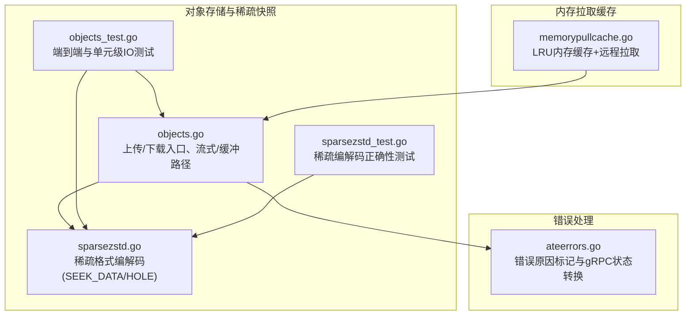
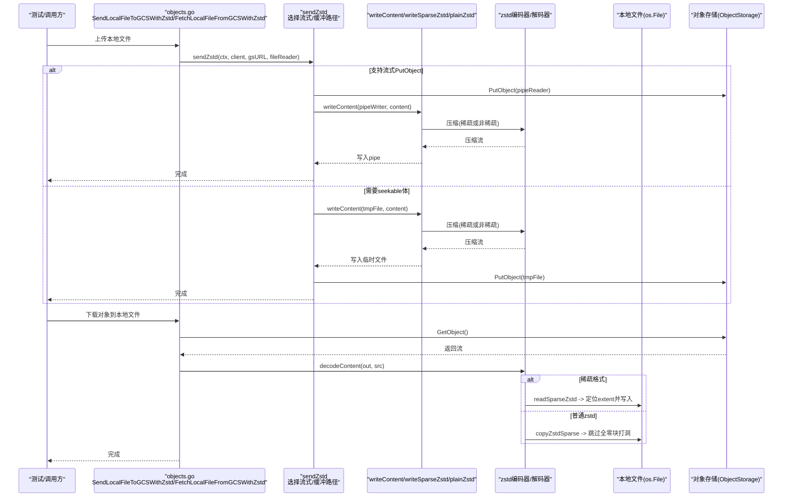
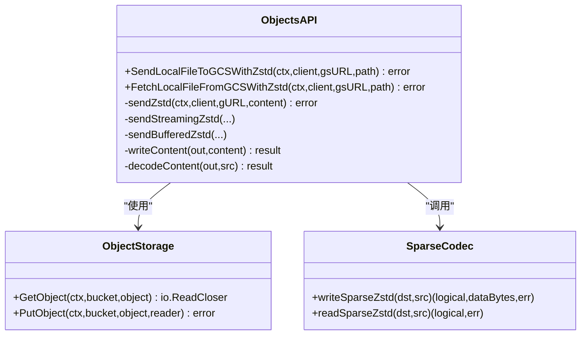
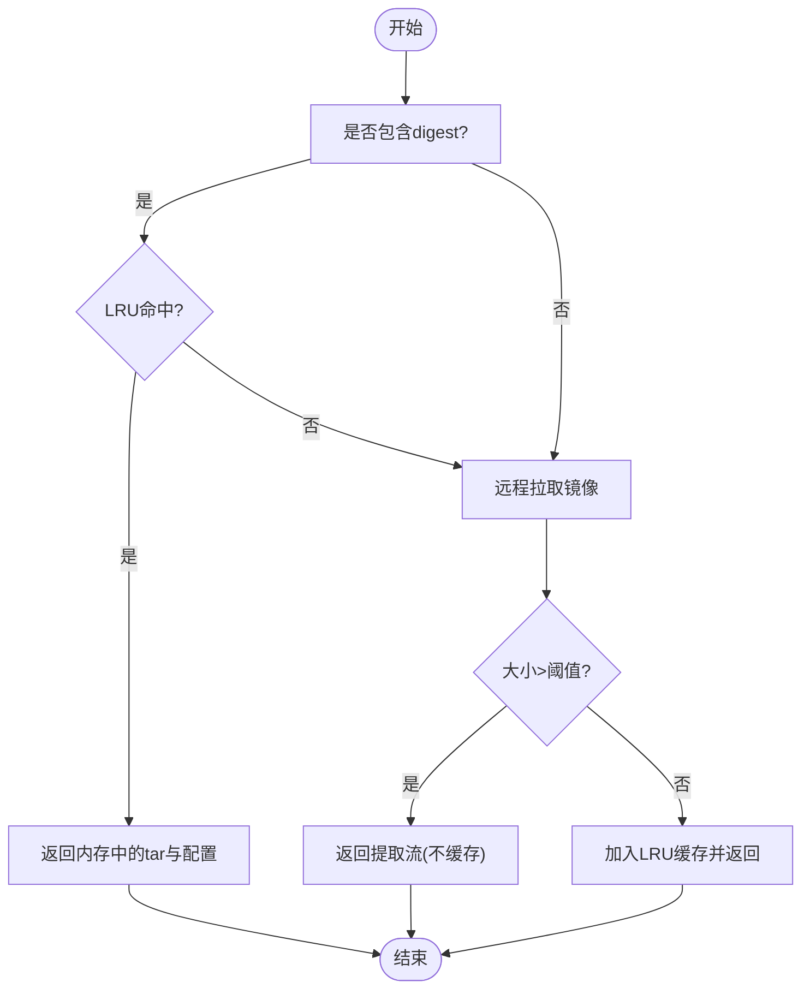
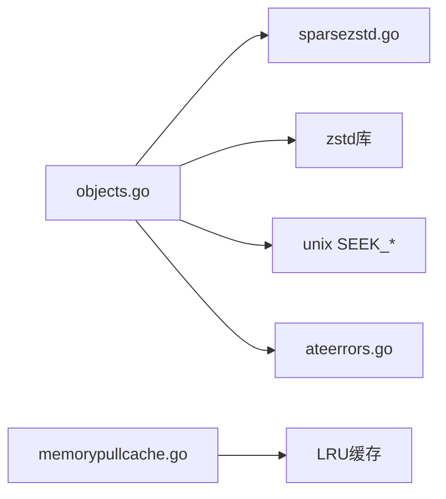

# 文件系统IO测试

<cite>
**本文引用的文件**   
- [objects.go](file://cmd/atelet/internal/ategcs/objects.go)
- [sparsezstd.go](file://cmd/atelet/internal/ategcs/sparsezstd.go)
- [objects_test.go](file://cmd/atelet/internal/ategcs/objects_test.go)
- [sparsezstd_test.go](file://cmd/atelet/internal/ategcs/sparsezstd_test.go)
- [memorypullcache.go](file://cmd/atelet/internal/memorypullcache/memorypullcache.go)
- [ateerrors.go](file://internal/ateerrors/ateerrors.go)
</cite>

## 目录
1. [简介](#简介)
2. [项目结构](#项目结构)
3. [核心组件](#核心组件)
4. [架构总览](#架构总览)
5. [详细组件分析](#详细组件分析)
6. [依赖关系分析](#依赖关系分析)
7. [性能考量与优化策略](#性能考量与优化策略)
8. [故障排查指南](#故障排查指南)
9. [结论](#结论)
10. [附录](#附录)

## 简介
本文件围绕仓库中与“文件系统IO测试”相关的实现与用例进行系统化梳理，重点覆盖：
- 随机读写测试设计（小文件随机访问、大文件随机读写、混合读写）
- 顺序读写测试（顺序写入、顺序读取、追加写入）
- 大文件处理场景（分块传输、断点续传、增量同步）
- 并发IO操作（多进程、多线程、异步IO）
- IO性能优化策略（缓冲区大小、预读策略、写合并等）
- IO错误处理与恢复机制的测试方案

上述内容均基于代码库中实际存在的对象存储与稀疏快照压缩/解压路径、内存拉取缓存以及错误处理模块进行归纳与扩展说明。

## 项目结构
与文件系统IO测试直接相关的核心代码位于以下包与文件中：
- cmd/atelet/internal/ategcs：对象上传/下载、稀疏格式编解码、流式与缓冲两种上传路径
- cmd/atelet/internal/memorypullcache：镜像拉取内存缓存（用于减少重复网络IO与磁盘IO）
- internal/ateerrors：错误类型与原因标签，便于上层根据错误语义做恢复或崩溃决策

图表来源
- [objects.go:1-454](file://cmd/atelet/internal/ategcs/objects.go#L1-L454)
- [sparsezstd.go:1-197](file://cmd/atelet/internal/ategcs/sparsezstd.go#L1-L197)
- [objects_test.go:1-508](file://cmd/atelet/internal/ategcs/objects_test.go#L1-L508)
- [sparsezstd_test.go:1-103](file://cmd/atelet/internal/ategcs/sparsezstd_test.go#L1-L103)
- [memorypullcache.go:1-236](file://cmd/atelet/internal/memorypullcache/memorypullcache.go#L1-L236)
- [ateerrors.go:101-129](file://internal/ateerrors/ateerrors.go#L101-L129)

章节来源
- [objects.go:1-454](file://cmd/atelet/internal/ategcs/objects.go#L1-L454)
- [sparsezstd.go:1-197](file://cmd/atelet/internal/ategcs/sparsezstd.go#L1-L197)
- [objects_test.go:1-508](file://cmd/atelet/internal/ategcs/objects_test.go#L1-L508)
- [sparsezstd_test.go:1-103](file://cmd/atelet/internal/ategcs/sparsezstd_test.go#L1-L103)
- [memorypullcache.go:1-236](file://cmd/atelet/internal/memorypullcache/memorypullcache.go#L1-L236)
- [ateerrors.go:101-129](file://internal/ateerrors/ateerrors.go#L101-L129)

## 核心组件
- 对象上传/下载接口与实现
  - 提供从本地文件到对象存储的上传、从对象存储下载到本地文件的下载能力；支持流式与缓冲两种上传路径，适配不同后端对seekable的要求。
- 稀疏快照编解码
  - 针对“大部分为零”的大对象（如虚拟机内存镜像），采用稀疏-extent格式，仅压缩并传输非零数据段，显著降低体积与IO压力。
- 内存拉取缓存
  - 在内存中以LRU缓存已拉取的镜像层，避免重复网络与磁盘IO，提升启动与恢复路径的性能。
- 错误处理与原因标记
  - 将错误包装为带领域语义的原因码，便于上层按原因决定重试、降级或触发崩溃恢复。

章节来源
- [objects.go:1-454](file://cmd/atelet/internal/ategcs/objects.go#L1-L454)
- [sparsezstd.go:1-197](file://cmd/atelet/internal/ategcs/sparsezstd.go#L1-L197)
- [memorypullcache.go:1-236](file://cmd/atelet/internal/memorypullcache/memorypullcache.go#L1-L236)
- [ateerrors.go:101-129](file://internal/ateerrors/ateerrors.go#L101-L129)

## 架构总览
下图展示了上传/下载的关键流程与组件交互，包括流式与缓冲两种路径的选择、稀疏编解码与落盘策略。

图表来源
- [objects.go:95-251](file://cmd/atelet/internal/ategcs/objects.go#L95-L251)
- [objects.go:270-384](file://cmd/atelet/internal/ategcs/objects.go#L270-L384)
- [sparsezstd.go:47-135](file://cmd/atelet/internal/ategcs/sparsezstd.go#L47-L135)
- [sparsezstd.go:137-196](file://cmd/atelet/internal/ategcs/sparsezstd.go#L137-L196)

## 详细组件分析

### 组件A：对象上传/下载与稀疏编解码
- 关键职责
  - 上传：根据后端能力选择流式或缓冲路径；对可寻址文件使用稀疏编码，否则走普通zstd流。
  - 下载：自动识别头部magic，走稀疏解码或普通解码；对普通zstd流也支持“去零打洞”以生成稀疏文件。
- 数据结构与复杂度
  - 稀疏格式：header(magic+version)+zstd流(totalSize + (off,len,data)* + sentinel)。扫描extent使用SEEK_DATA/SEEK_HOLE，时间复杂度近似O(extents)，空间复杂度取决于单次extent大小。
  - 普通zstd流：顺序拷贝，时间复杂度O(N)，空间复杂度O(块大小)。
- 依赖链
  - objects.go 依赖 sparsezstd.go 的稀疏编解码函数；两者都依赖zstd库与标准库io/os。
- 错误处理
  - 解析URL、打开文件、压缩/解压失败、网络请求失败等均返回结构化错误，并在日志中记录关键指标（逻辑大小、实际写入字节、耗时）。

图表来源
- [objects.go:37-454](file://cmd/atelet/internal/ategcs/objects.go#L37-L454)
- [sparsezstd.go:47-196](file://cmd/atelet/internal/ategcs/sparsezstd.go#L47-L196)

章节来源
- [objects.go:95-251](file://cmd/atelet/internal/ategcs/objects.go#L95-L251)
- [objects.go:270-384](file://cmd/atelet/internal/ategcs/objects.go#L270-L384)
- [sparsezstd.go:47-135](file://cmd/atelet/internal/ategcs/sparsezstd.go#L47-L135)
- [sparsezstd.go:137-196](file://cmd/atelet/internal/ategcs/sparsezstd.go#L137-L196)

### 组件B：内存拉取缓存（减少重复IO）
- 关键职责
  - 对包含digest的镜像引用进行命中检查，命中则直接从内存返回tar与配置，避免网络与磁盘IO。
  - 未命中时拉取镜像，若大小超过阈值则不缓存，直接返回提取流；否则放入LRU缓存。
- 适用场景
  - 频繁拉起相同镜像的工作负载，显著降低网络与磁盘IO开销。
- 并发特性
  - LRU缓存为单进程内共享，需在上层保证并发安全（例如通过互斥或队列化请求）。

图表来源
- [memorypullcache.go:72-198](file://cmd/atelet/internal/memorypullcache/memorypullcache.go#L72-L198)

章节来源
- [memorypullcache.go:72-198](file://cmd/atelet/internal/memorypullcache/memorypullcache.go#L72-L198)

### 组件C：错误处理与恢复
- 关键职责
  - 将错误包装为带领域语义的原因码，并可转换为gRPC状态，以便控制面据此决定是否崩溃Actor或进行重试。
- 典型用法
  - 在IO失败路径上标注具体原因（如外部对象获取失败、保存快照失败等），上层根据原因执行差异化恢复策略。

章节来源
- [ateerrors.go:101-129](file://internal/ateerrors/ateerrors.go#L101-L129)

## 依赖关系分析
- 组件耦合
  - objects.go 与 sparsezstd.go 强耦合于稀疏格式协议；二者共同构成上传/下载的核心路径。
  - memorypullcache.go 独立于对象存储路径，但可与对象存储路径组合使用以减少整体IO。
  - ateerrors.go 被上层多处复用，统一错误语义。
- 外部依赖
  - zstd压缩库、标准库io/os、unix系统调用（SEEK_DATA/SEEK_HOLE）、gRPC错误信息封装。

图表来源
- [objects.go:1-454](file://cmd/atelet/internal/ategcs/objects.go#L1-L454)
- [sparsezstd.go:1-197](file://cmd/atelet/internal/ategcs/sparsezstd.go#L1-L197)
- [memorypullcache.go:1-236](file://cmd/atelet/internal/memorypullcache/memorypullcache.go#L1-L236)
- [ateerrors.go:101-129](file://internal/ateerrors/ateerrors.go#L101-L129)

章节来源
- [objects.go:1-454](file://cmd/atelet/internal/ategcs/objects.go#L1-L454)
- [sparsezstd.go:1-197](file://cmd/atelet/internal/ategcs/sparsezstd.go#L1-L197)
- [memorypullcache.go:1-236](file://cmd/atelet/internal/memorypullcache/memorypullcache.go#L1-L236)
- [ateerrors.go:101-129](file://internal/ateerrors/ateerrors.go#L101-L129)

## 性能考量与优化策略
- 缓冲区大小调整
  - 稀疏解压路径使用固定块大小（例如64KiB）扫描全零块并打洞，兼顾零扫描成本与WriteAt系统调用次数。可根据目标文件系统块大小与CPU缓存行调优。
- 预读策略
  - 对于顺序读取场景，可使用带缓冲的Reader（如bufio.Reader）以提升吞吐；对于随机读取，应避免不必要的预读以免浪费带宽与内存。
- 写合并
  - 利用稀疏写（跳过全零区域）与延迟分配（Truncate后只写非零extent）减少实际磁盘写入量，从而降低IOPS与带宽占用。
- 并发与流水线
  - 上传路径在支持流式的后端上使用goroutine并行压缩与网络PUT，重叠计算与网络IO，提高吞吐。
- 压缩级别与并发度
  - 上传侧使用快速压缩级别与多核并发，权衡压缩比与CPU消耗；下载侧解码并发度较低以保证稳定性。
- 缓存
  - 内存拉取缓存减少重复网络与磁盘IO；结合对象存储层的稀疏格式进一步降低传输与落盘成本。

[本节为通用指导，无需特定文件来源]

## 故障排查指南
- 常见错误与定位
  - URL解析失败：检查对象存储URL格式与权限。
  - 打开/关闭文件失败：确认路径存在、权限正确、句柄释放。
  - 压缩/解压失败：检查输入数据完整性、格式版本兼容性。
  - 网络请求失败：检查网络连通性与认证配置。
- 恢复策略
  - 根据错误原因码区分可重试与不可重试错误；对可重试错误实施指数退避与限流；对不可重试错误触发回滚或告警。
- 验证手段
  - 使用端到端测试校验round-trip一致性；使用稀疏性检查验证空洞是否生效；对比逻辑大小与实际写入字节数评估稀疏效果。

章节来源
- [objects.go:95-251](file://cmd/atelet/internal/ategcs/objects.go#L95-L251)
- [objects.go:270-384](file://cmd/atelet/internal/ategcs/objects.go#L270-L384)
- [sparsezstd.go:47-135](file://cmd/atelet/internal/ategcs/sparsezstd.go#L47-L135)
- [sparsezstd.go:137-196](file://cmd/atelet/internal/ategcs/sparsezstd.go#L137-L196)
- [ateerrors.go:101-129](file://internal/ateerrors/ateerrors.go#L101-L129)

## 结论
该仓库在对象存储与稀疏快照方面提供了完善的上传/下载路径与严格的正确性测试，能够有效支撑大文件、稀疏数据的IO场景。结合内存拉取缓存与错误语义化，可在复杂生产环境中获得良好的性能与可靠性。建议在实际部署中依据工作负载特征调优缓冲区大小、并发度与压缩级别，并结合监控指标持续优化。

[本节为总结，无需特定文件来源]

## 附录

### 随机读写测试设计与用例
- 小文件随机访问
  - 构造大量小文件，随机选择偏移与长度进行ReadAt/WriteAt，统计吞吐与时延分布。
- 大文件随机读写
  - 创建大文件，随机选取多个extent进行读写，验证稀疏路径下空洞与数据区的一致性。
- 混合读写场景
  - 同时发起顺序与随机IO，观察竞争条件下的吞吐与延迟变化。

章节来源
- [objects_test.go:112-183](file://cmd/atelet/internal/ategcs/objects_test.go#L112-L183)
- [objects_test.go:374-465](file://cmd/atelet/internal/ategcs/objects_test.go#L374-L465)
- [sparsezstd_test.go:62-103](file://cmd/atelet/internal/ategcs/sparsezstd_test.go#L62-L103)

### 顺序读写测试实现
- 顺序写入
  - 使用顺序Writer或io.Copy进行连续写入，测量吞吐。
- 顺序读取
  - 使用顺序Reader或io.Copy进行连续读取，测量吞吐。
- 追加写入
  - 以追加模式打开文件，多次Append写入，验证文件大小增长与数据一致性。

章节来源
- [objects.go:253-268](file://cmd/atelet/internal/ategcs/objects.go#L253-L268)
- [objects.go:372-384](file://cmd/atelet/internal/ategcs/objects.go#L372-L384)

### 大文件处理测试场景
- 分块传输
  - 将大对象切分为多个块，分别上传/下载，再拼接校验一致性。
- 断点续传
  - 模拟中断后从上次位置继续传输，验证offset与范围读取的正确性。
- 增量同步
  - 基于extent差异进行增量更新，减少不必要的数据传输。

章节来源
- [objects.go:171-251](file://cmd/atelet/internal/ategcs/objects.go#L171-L251)
- [objects.go:299-384](file://cmd/atelet/internal/ategcs/objects.go#L299-L384)
- [sparsezstd.go:47-135](file://cmd/atelet/internal/ategcs/sparsezstd.go#L47-L135)

### 并发IO操作测试
- 多进程并发
  - 使用子进程并发访问同一文件或不同文件，观察锁与一致性。
- 多线程并发
  - 在同一进程内使用goroutine并发读写，确保无数据竞争。
- 异步IO
  - 使用管道与goroutine实现压缩与网络IO的流水线，验证吞吐提升与错误传播。

章节来源
- [objects.go:219-251](file://cmd/atelet/internal/ategcs/objects.go#L219-L251)
- [memorypullcache.go:72-198](file://cmd/atelet/internal/memorypullcache/memorypullcache.go#L72-L198)

### IO错误处理与恢复机制测试方案
- 错误分类
  - 网络错误、磁盘错误、格式错误、权限错误等。
- 恢复策略
  - 可重试错误：指数退避、限流、切换备用源。
  - 不可重试错误：回滚、告警、人工介入。
- 验证方法
  - 注入错误（超时、断开、损坏数据），验证上层是否能正确识别原因码并执行相应恢复。

章节来源
- [ateerrors.go:101-129](file://internal/ateerrors/ateerrors.go#L101-L129)
- [objects.go:95-251](file://cmd/atelet/internal/ategcs/objects.go#L95-L251)
- [objects.go:270-384](file://cmd/atelet/internal/ategcs/objects.go#L270-L384)
