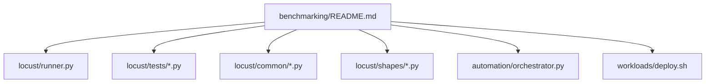
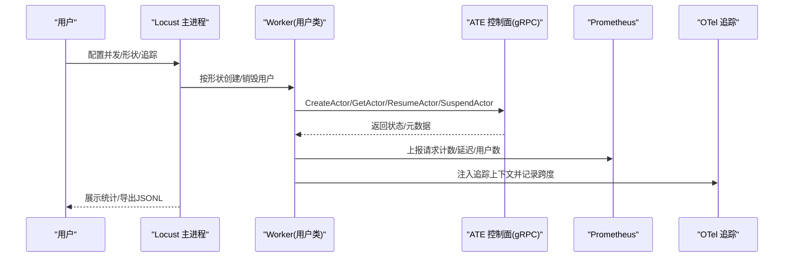
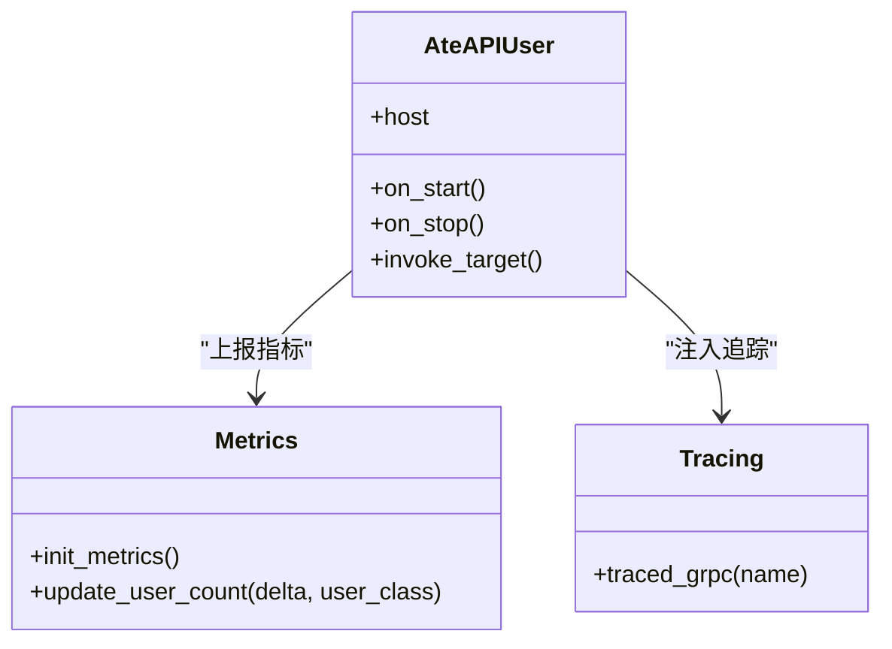
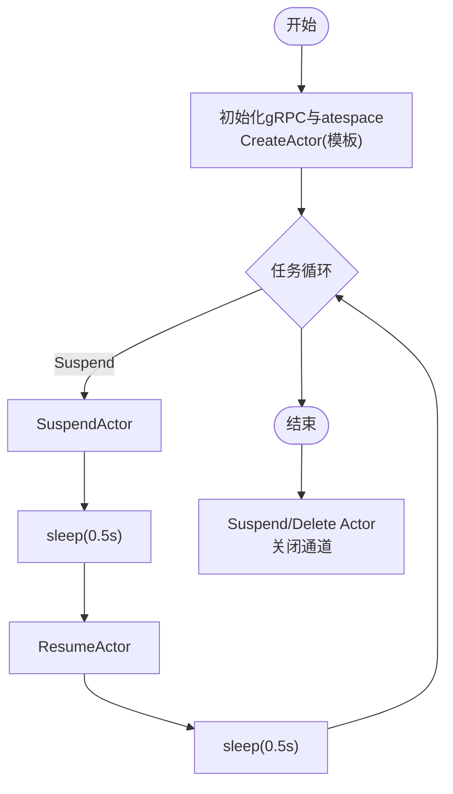
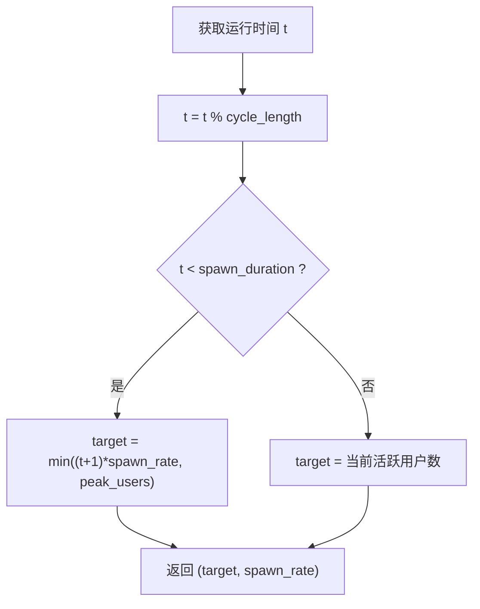
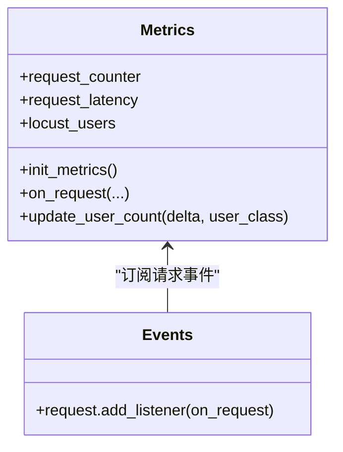
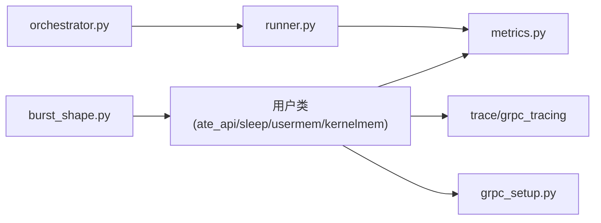

# 混合工作负载测试

<cite>
**本文引用的文件**   
- [benchmarking/README.md](file://benchmarking/README.md)
- [locust/tests/ate_api.py](file://benchmarking/locust/tests/ate_api.py)
- [locust/tests/sleep.py](file://benchmarking/locust/tests/sleep.py)
- [locust/tests/usermem.py](file://benchmarking/locust/tests/usermem.py)
- [locust/tests/kernelmem.py](file://benchmarking/locust/tests/kernelmem.py)
- [locust/tests/glutton.py](file://benchmarking/locust/tests/glutton.py)
- [locust/common/metrics.py](file://benchmarking/locust/common/metrics.py)
- [locust/common/grpc_setup.py](file://benchmarking/locust/common/grpc_setup.py)
- [locust/shapes/burst_shape.py](file://benchmarking/locust/shapes/burst_shape.py)
- [locust/runner.py](file://benchmarking/locust/runner.py)
- [automation/orchestrator.py](file://benchmarking/automation/orchitector.py)
- [generate_protos.sh](file://benchmarking/locust/generate_protos.sh)
- [glutton_pb2_grpc.py](file://benchmarking/locust/common/glutton_pb2_grpc.py)
- [counter_demo.py](file://benchmarking/locust/tests/counter_demo.py)
</cite>

## 目录
1. [简介](#简介)
2. [项目结构](#项目结构)
3. [核心组件](#核心组件)
4. [架构总览](#架构总览)
5. [详细组件分析](#详细组件分析)
6. [依赖关系分析](#依赖关系分析)
7. [性能考量](#性能考量)
8. [故障排查指南](#故障排查指南)
9. [结论](#结论)
10. [附录](#附录)

## 简介
本文件系统性介绍“混合工作负载测试”的设计与实现，覆盖以下目标：
- 多种工作负载组合场景：HTTP+gRPC、内存+IO、CPU+网络等。
- 工作负载形状定义：突发流量、渐变负载、周期性负载等模式。
- 真实业务场景模拟：微服务调用链、数据管道处理、实时计算等复杂场景。
- 资源竞争与冲突测试：锁竞争、带宽争用、存储I/O冲突等。
- 混合负载性能分析方法：端到端延迟、资源利用率、系统瓶颈识别。
- 容量规划与弹性伸缩测试方案。

本仓库的基准测试套件基于 Locust（Python）驱动，结合 gRPC/HTTP 客户端、OpenTelemetry 追踪与 Prometheus 指标采集，提供可编排、可扩展的混合负载能力。

## 项目结构
基准测试相关代码集中在 benchmarking 目录下，关键组织方式如下：
- locust：Locust 测试脚本、通用工具、负载形状、运行器与监控集成。
- automation：自动化编排与作业调度。
- workloads：工作负载部署模板与脚本。
- README：部署与使用说明。

图表来源
- [benchmarking/README.md:1-90](file://benchmarking/README.md#L1-L90)

章节来源
- [benchmarking/README.md:1-90](file://benchmarking/README.md#L1-L90)

## 核心组件
- 用户类与工作流
  - AteAPIUser：通过 gRPC 控制面创建 Actor，并循环执行 GetActor/ResumeActor/SuspendActor，用于验证控制面吞吐与延迟。
  - SleepUser/UserMemUser/KernelMemUser：分别触发不同工作负载模板（sleep、usermem、kernelmem），在任务中穿插 Suspend/Resume 以模拟 CPU/内存/内核态资源占用与切换。
  - GluttonUser：占位声明，实际高压力负载由 Go boomer-glutton 承担；Python 侧仅用于 UI 枚举。
- 通用能力
  - metrics：初始化 Prometheus HTTP 服务与 OTel PrometheusReader，注册请求计数、延迟直方图、活跃用户数等指标。
  - grpc_setup：将 gRPC 的 poller 接入 gevent 事件循环，避免阻塞其他协程。
  - burst_shape：实现周期性突发负载形状，按周期内阶段动态调整目标用户数与生成速率。
- 运行与编排
  - runner：统计结果导出为 JSONL，便于后续分析与可视化。
  - orchestrator：Kubernetes Job 编排，提交测试任务、等待完成、拉取日志与清理。

章节来源
- [locust/tests/ate_api.py:1-120](file://benchmarking/locust/tests/ate_api.py#L1-L120)
- [locust/tests/sleep.py:1-124](file://benchmarking/locust/tests/sleep.py#L1-L124)
- [locust/tests/usermem.py:1-124](file://benchmarking/locust/tests/usermem.py#L1-L124)
- [locust/tests/kernelmem.py:1-124](file://benchmarking/locust/tests/kernelmem.py#L1-L124)
- [locust/tests/glutton.py:1-45](file://benchmarking/locust/tests/glutton.py#L1-L45)
- [locust/common/metrics.py:1-104](file://benchmarking/locust/common/metrics.py#L1-L104)
- [locust/common/grpc_setup.py:1-37](file://benchmarking/locust/common/grpc_setup.py#L1-L37)
- [locust/shapes/burst_shape.py:1-41](file://benchmarking/locust/shapes/burst_shape.py#L1-L41)
- [locust/runner.py:249-285](file://benchmarking/locust/runner.py#L249-L285)
- [automation/orchestrator.py:307-341](file://benchmarking/automation/orchestrator.py#L307-L341)

## 架构总览
混合负载测试的整体流程：
- 用户在 Locust Web UI 选择用户类与负载形状，配置并发用户数、持续时间、是否启用追踪等。
- Locust 主进程加载 User 类与 Shape，启动 gRPC/HTTP 客户端，按形状调度用户生命周期。
- 每个用户实例建立安全 gRPC 通道，调用控制面 API 管理 Actor 生命周期，并在任务中执行特定工作负载。
- 指标与追踪贯穿请求链路，Prometheus 暴露指标，OTel 收集分布式追踪。
- 自动化编排通过 Kubernetes Job 批量提交测试，统一收集结果与日志。

图表来源
- [locust/tests/ate_api.py:1-120](file://benchmarking/locust/tests/ate_api.py#L1-L120)
- [locust/common/metrics.py:1-104](file://benchmarking/locust/common/metrics.py#L1-L104)
- [locust/runner.py:249-285](file://benchmarking/locust/runner.py#L249-L285)

## 详细组件分析

### 组件A：AteAPIUser（gRPC 控制面压测）
职责：
- 初始化 gRPC 安全通道与 CA 证书。
- 确保 atespace 存在，创建 Actor 引用。
- 循环执行 GetActor/ResumeActor/SuspendActor，统计延迟与成功率。
- 通过 metrics 上报指标，通过 tracing 注入追踪上下文。

图表来源
- [locust/tests/ate_api.py:1-120](file://benchmarking/locust/tests/ate_api.py#L1-L120)
- [locust/common/metrics.py:1-104](file://benchmarking/locust/common/metrics.py#L1-L104)

章节来源
- [locust/tests/ate_api.py:1-120](file://benchmarking/locust/tests/ate_api.py#L1-L120)
- [locust/common/metrics.py:1-104](file://benchmarking/locust/common/metrics.py#L1-L104)

### 组件B：Sleep/UserMem/KernelMem 用户类（CPU/内存/内核态混合）
职责：
- 创建对应模板的 Actor（sleep/usermem/kernelmem）。
- 在任务中交替执行 Suspend/Resume，并插入 sleep 以模拟 CPU/内存/内核态资源消耗。
- 在 on_stop 中清理资源（Suspend/Delete），保证环境整洁。

图表来源
- [locust/tests/sleep.py:1-124](file://benchmarking/locust/tests/sleep.py#L1-L124)
- [locust/tests/usermem.py:1-124](file://benchmarking/locust/tests/usermem.py#L1-L124)
- [locust/tests/kernelmem.py:1-124](file://benchmarking/locust/tests/kernelmem.py#L1-L124)

章节来源
- [locust/tests/sleep.py:1-124](file://benchmarking/locust/tests/sleep.py#L1-L124)
- [locust/tests/usermem.py:1-124](file://benchmarking/locust/tests/usermem.py#L1-L124)
- [locust/tests/kernelmem.py:1-124](file://benchmarking/locust/tests/kernelmem.py#L1-L124)

### 组件C：GluttonUser（高压力负载入口）
说明：
- Python 侧仅做占位声明，供 UI 枚举；实际高压力负载由 Go boomer-glutton 承担。
- 环境变量 LOCUST_NO_GLUTTON_USER=1 时跳过加载该模块，避免重复加载。

章节来源
- [locust/tests/glutton.py:1-45](file://benchmarking/locust/tests/glutton.py#L1-L45)

### 组件D：负载形状 BurstShape（周期性突发）
职责：
- 定义一个周期长度与生成阶段时长。
- 在生成阶段线性增加目标用户数至峰值，随后进入空闲阶段保持当前活跃用户数，尊重自然过期。

图表来源
- [locust/shapes/burst_shape.py:1-41](file://benchmarking/locust/shapes/burst_shape.py#L1-L41)

章节来源
- [locust/shapes/burst_shape.py:1-41](file://benchmarking/locust/shapes/burst_shape.py#L1-L41)

### 组件E：指标与追踪（Prometheus + OTel）
职责：
- 初始化 Prometheus HTTP 服务与 OTel PrometheusReader。
- 监听 Locust request 事件，上报请求总数、延迟直方图、活跃用户数。
- 支持多标签维度（method、name、status、user_class）。

图表来源
- [locust/common/metrics.py:1-104](file://benchmarking/locust/common/metrics.py#L1-L104)

章节来源
- [locust/common/metrics.py:1-104](file://benchmarking/locust/common/metrics.py#L1-L104)

### 组件F：gRPC 与 gevent 协同
职责：
- 在 Locust 导入后对 gRPC 进行补丁，使其 poller 使用 gevent 事件循环，避免阻塞其他协程。
- 防止重复初始化导致池泄漏或钩子重复注册。

章节来源
- [locust/common/grpc_setup.py:1-37](file://benchmarking/locust/common/grpc_setup.py#L1-L37)

### 组件G：运行器与结果导出
职责：
- 将 Locust CSV 统计转换为 JSONL，包含时间戳、标签、测试名、指标名称与测量值。
- 便于外部系统聚合与可视化。

章节来源
- [locust/runner.py:249-285](file://benchmarking/locust/runner.py#L249-L285)

### 组件H：自动化编排（Kubernetes Job）
职责：
- 渲染 Runner Job 模板，设置 JOB_NAME、IMAGE、TEST_FILE、DURATION、USERS、TAG、NAME、DEST 等参数。
- 提交 Job、等待完成、拉取日志、清理资源。

章节来源
- [automation/orchestrator.py:307-341](file://benchmarking/automation/orchestrator.py#L307-L341)

### 组件I：gRPC 客户端生成
职责：
- 根据 .proto 文件生成 Python gRPC 客户端代码。
- 修正相对导入路径，适配 common 包结构。

章节来源
- [generate_protos.sh:47-85](file://benchmarking/locust/generate_protos.sh#L47-L85)

### 组件J：Glutton 服务端接口（示例）
说明：
- 提供 WriteRAM 等方法，用于压测 I/O 与内存写入场景。
- 作为高压力负载的目标服务之一。

章节来源
- [glutton_pb2_grpc.py:151-193](file://benchmarking/locust/common/glutton_pb2_grpc.py#L151-L193)

### 组件K：HTTP+gRPC 混合链路（Counter Demo）
说明：
- CounterDemo 通过 HTTP 调用 atenet-router，同时注入追踪上下文，形成 HTTP+gRPC 混合链路。
- 可用于评估跨协议链路的端到端延迟与错误率。

章节来源
- [counter_demo.py:140-171](file://benchmarking/locust/tests/counter_demo.py#L140-L171)

## 依赖关系分析
- 组件耦合
  - 用户类依赖 metrics 与 tracing 工具，统一上报指标与追踪。
  - gRPC 客户端依赖 grpc_setup 的 gevent 补丁，确保并发不阻塞。
  - 负载形状独立于用户类，通过 tick 回调控制并发策略。
  - 运行器与编排脚本解耦，前者负责本地统计导出，后者负责集群级作业调度。
- 外部依赖
  - Prometheus 与 OTel SDK 用于指标与追踪。
  - Kubernetes 用于作业编排与资源隔离。

图表来源
- [locust/tests/ate_api.py:1-120](file://benchmarking/locust/tests/ate_api.py#L1-L120)
- [locust/common/metrics.py:1-104](file://benchmarking/locust/common/metrics.py#L1-L104)
- [locust/common/grpc_setup.py:1-37](file://benchmarking/locust/common/grpc_setup.py#L1-L37)
- [locust/shapes/burst_shape.py:1-41](file://benchmarking/locust/shapes/burst_shape.py#L1-L41)
- [locust/runner.py:249-285](file://benchmarking/locust/runner.py#L249-L285)
- [automation/orchestrator.py:307-341](file://benchmarking/automation/orchestrator.py#L307-L341)

## 性能考量
- 端到端延迟
  - 通过 OTel 追踪与 Locust 请求事件统计，可获得从客户端到服务端的完整延迟分布。
  - 建议关注 p50/p95/p99 分位数与失败率。
- 资源利用率
  - 结合 Prometheus 指标与系统监控（CPU/内存/网络/磁盘），定位热点与瓶颈。
  - 针对 Sleep/UserMem/KernelMem 用户类，观察 CPU/内存/内核态资源变化。
- 系统瓶颈识别
  - 若 gRPC 调用阻塞影响其他协程，确认已启用 grpc_setup 的 gevent 补丁。
  - 若指标未上报，检查 Prometheus 端口与 OTel 配置。
- 并发与形状
  - 使用 BurstShape 模拟突发流量，观察系统在峰值期的恢复能力与排队行为。
  - 自定义 LoadTestShape 可实现渐变负载与周期性负载。

[本节为通用指导，无需具体文件引用]

## 故障排查指南
- gRPC 与 gevent 兼容问题
  - 现象：单个 gRPC 调用阻塞所有协程。
  - 排查：确认在创建 gRPC 通道前调用 init_grpc_gevent。
- 指标缺失
  - 现象：Prometheus 无 locust_* 指标。
  - 排查：检查 8000 端口是否被占用，OTel PrometheusReader 是否正确初始化。
- 追踪缺失
  - 现象：无法在追踪系统中看到 span。
  - 排查：确认已启用 OTel 追踪，且 traced_grpc 正确注入上下文。
- 作业失败
  - 现象：Kubernetes Job 长时间未完成或无日志。
  - 排查：查看 orchestrator 提交的 Job 状态与日志，确认镜像与参数正确。

章节来源
- [locust/common/grpc_setup.py:1-37](file://benchmarking/locust/common/grpc_setup.py#L1-L37)
- [locust/common/metrics.py:1-104](file://benchmarking/locust/common/metrics.py#L1-L104)
- [automation/orchestrator.py:307-341](file://benchmarking/automation/orchestrator.py#L307-L341)

## 结论
本仓库提供了完整的混合工作负载测试框架，涵盖 HTTP+gRPC、CPU/内存/内核态等多种负载类型，并通过负载形状实现突发与周期性流量模型。借助 Prometheus 与 OTel，可对端到端延迟、资源利用率与系统瓶颈进行系统化分析。配合 Kubernetes 自动化编排，可高效执行大规模压测与回归验证。

[本节为总结性内容，无需具体文件引用]

## 附录

### 混合工作负载组合场景设计
- HTTP+gRPC 混合
  - 使用 CounterDemo 发起 HTTP 请求，内部再调用 gRPC 控制面，形成跨协议链路。
  - 适用：网关/路由层与后端服务的整体吞吐与延迟评估。
- 内存+IO 混合
  - 使用 Glutton 的 WriteRAM 接口进行内存写入压测，结合用户类中的 I/O 操作。
  - 适用：缓存/内存数据库与持久化层的综合评估。
- CPU+网络 混合
  - Sleep/UserMem/KernelMem 用户类在任务中穿插 Suspend/Resume 与 sleep，模拟 CPU/内存/内核态资源消耗与网络往返。
  - 适用：微服务间频繁启停与状态切换的场景。

章节来源
- [counter_demo.py:140-171](file://benchmarking/locust/tests/counter_demo.py#L140-L171)
- [glutton_pb2_grpc.py:151-193](file://benchmarking/locust/common/glutton_pb2_grpc.py#L151-L193)
- [locust/tests/sleep.py:1-124](file://benchmarking/locust/tests/sleep.py#L1-L124)
- [locust/tests/usermem.py:1-124](file://benchmarking/locust/tests/usermem.py#L1-L124)
- [locust/tests/kernelmem.py:1-124](file://benchmarking/locust/tests/kernelmem.py#L1-L124)

### 工作负载形状定义
- 突发流量
  - 使用 BurstShape，周期内先快速生成用户至峰值，随后进入空闲阶段保持活跃用户。
- 渐变负载
  - 自定义 LoadTestShape，在 tick 中按时间函数逐步提升目标用户数。
- 周期性负载
  - 在 tick 中按固定周期切换不同用户类与速率，模拟业务高峰与低谷。

章节来源
- [locust/shapes/burst_shape.py:1-41](file://benchmarking/locust/shapes/burst_shape.py#L1-L41)

### 真实业务场景模拟
- 微服务调用链
  - 通过 CounterDemo 的 HTTP 入口与 gRPC 控制面，构建跨服务链路。
- 数据管道处理
  - 结合 Glutton 的 WriteRAM 与用户类的 I/O 操作，模拟数据写入与读取。
- 实时计算
  - 使用 Sleep/UserMem/KernelMem 用户类模拟计算密集型与状态切换型任务。

章节来源
- [counter_demo.py:140-171](file://benchmarking/locust/tests/counter_demo.py#L140-L171)
- [glutton_pb2_grpc.py:151-193](file://benchmarking/locust/common/glutton_pb2_grpc.py#L151-L193)
- [locust/tests/sleep.py:1-124](file://benchmarking/locust/tests/sleep.py#L1-L124)
- [locust/tests/usermem.py:1-124](file://benchmarking/locust/tests/usermem.py#L1-L124)
- [locust/tests/kernelmem.py:1-124](file://benchmarking/locust/tests/kernelmem.py#L1-L124)

### 资源竞争与冲突测试
- 锁竞争
  - 通过并发创建/挂起/恢复 Actor，观察控制面锁与队列竞争。
- 带宽争用
  - 在高并发下对比 HTTP 与 gRPC 的吞吐差异，评估网络瓶颈。
- 存储 I/O 冲突
  - 结合 Glutton 的 WriteRAM 与持久化操作，评估磁盘 I/O 争用。

[本节为通用指导，无需具体文件引用]

### 容量规划与弹性伸缩测试方案
- 容量规划
  - 逐步增加并发用户数，观察系统吞吐与延迟拐点，确定最大承载能力。
- 弹性伸缩
  - 使用 BurstShape 模拟突发流量，评估自动扩缩容策略的响应时间与稳定性。
- 回归验证
  - 将关键场景纳入自动化编排，定期执行并对比历史指标。

章节来源
- [locust/shapes/burst_shape.py:1-41](file://benchmarking/locust/shapes/burst_shape.py#L1-L41)
- [automation/orchestrator.py:307-341](file://benchmarking/automation/orchestrator.py#L307-L341)
