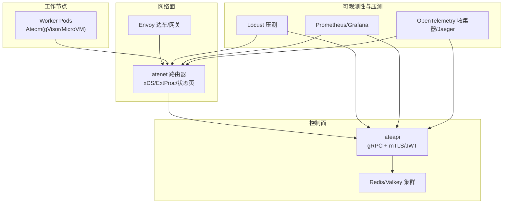
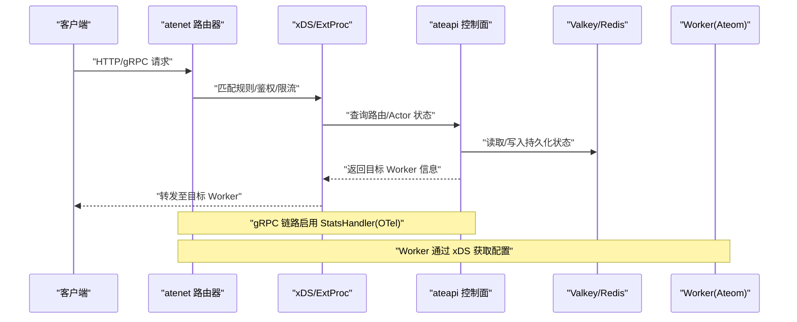
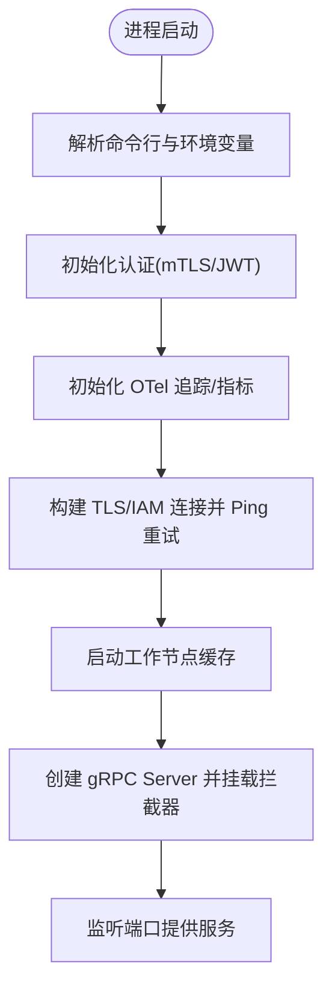
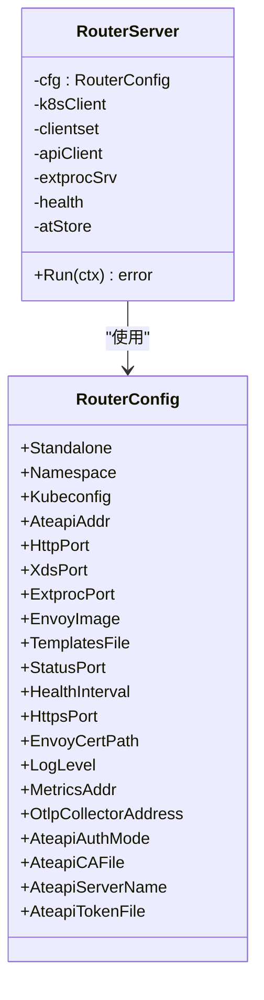
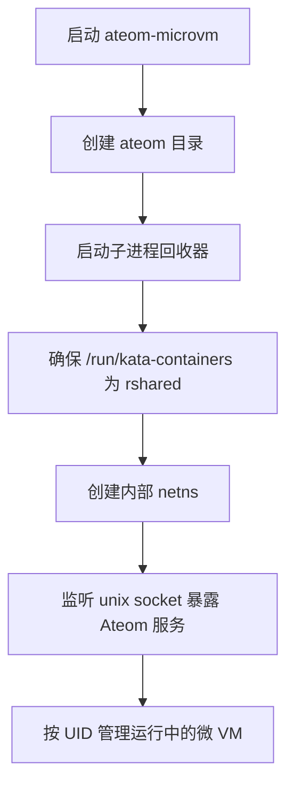
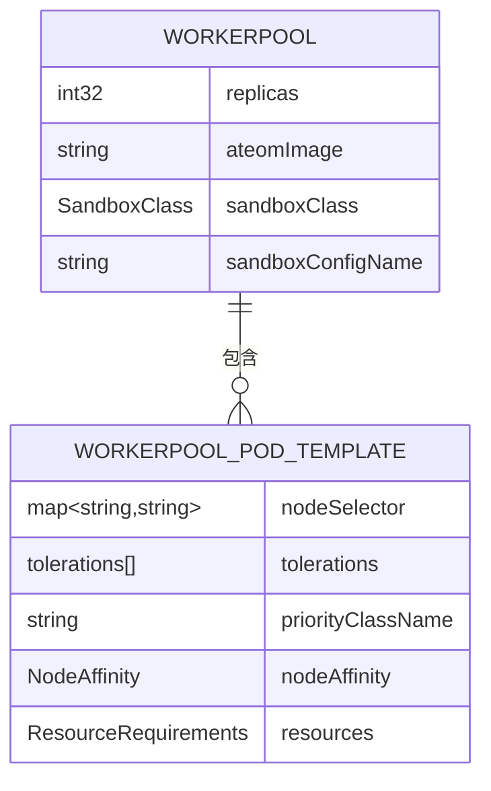
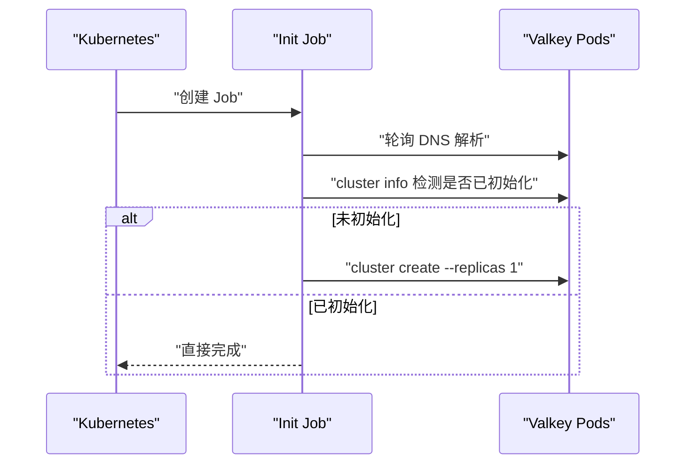
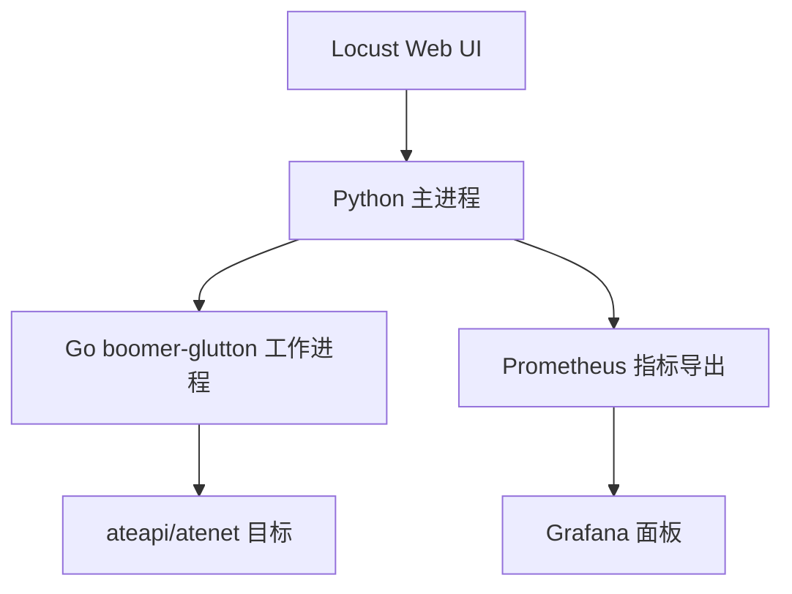
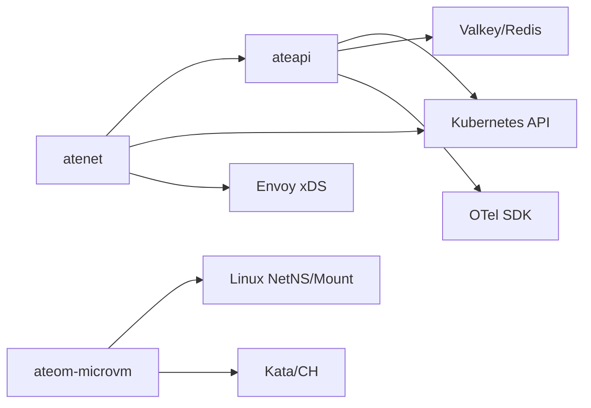

# 性能优化指导

<cite>
**本文引用的文件**   
- [README.md](file://README.md)
- [architecture.md](file://docs/architecture.md)
- [observability.md](file://docs/observability.md)
- [main.go](file://cmd/ateapi/main.go)
- [router.go](file://cmd/atenet/internal/router/router.go)
- [xds.go](file://cmd/atenet/internal/router/xds.go)
- [dashboard.html](file://cmd/atenet/internal/router/dashboard.html)
- [net.go](file://cmd/ateom-microvm/net.go)
- [main.go](file://cmd/ateom-microvm/main.go)
- [workerpool_types.go](file://pkg/api/v1alpha1/workerpool_types.go)
- [zz_generated.deepcopy.go](file://pkg/api/v1alpha1/zz_generated.deepcopy.go)
- [valkey.yaml](file://manifests/ate-install/valkey.yaml)
- [tests.yaml](file://benchmarking/automation/tests.yaml)
- [monitoring.yaml](file://benchmarking/monitoring.yaml)
- [metrics.py](file://benchmarking/locust/common/metrics.py)
- [glutton.py](file://benchmarking/locust/tests/glutton.py)
- [oci.pb.go](file://cmd/ateom-microvm/internal/third_party/kata/agentpb/oci.pb.go)
- [agent.pb.go](file://cmd/ateom-microvm/internal/third_party/kata/agentpb/agent.pb.go)
</cite>

## 目录
1. [简介](#简介)
2. [项目结构](#项目结构)
3. [核心组件](#核心组件)
4. [架构总览](#架构总览)
5. [详细组件分析](#详细组件分析)
6. [依赖关系分析](#依赖关系分析)
7. [性能考量与优化策略](#性能考量与优化策略)
8. [故障排查指南](#故障排查指南)
9. [结论](#结论)
10. [附录](#附录)

## 简介
本指导面向在 Kubernetes 上运行的高并发、低延迟“代理型”工作负载，结合仓库中控制面（ateapi）、网络路由（atenet）、节点侧执行器（ateom-gvisor/microvm）以及基准测试与可观测性工具，给出系统级与应用级的性能优化方法与最佳实践。内容覆盖：
- 系统层：Linux 内核参数、网络栈、存储 I/O 调优建议
- 应用层：代码路径、算法与数据结构选择、连接复用与超时配置
- 资源层：CPU/内存分配、容器资源限制、Pod 调度策略
- 数据层：数据库与缓存（Valkey/Redis）集群化、TLS 与安全、连接池与重试
- 网络层：gRPC/HTTP/Envoy xDS、负载均衡与流量控制
- 持续优化：基于 Locust 的压测与 Prometheus/Grafana 监控闭环

## 项目结构
本项目围绕以下关键子系统组织：
- 控制面 API 服务（ateapi）：提供 gRPC 接口管理 Actor/Worker 生命周期，集成认证、追踪、指标与 Redis/Valkey 持久化
- 网络路由（atenet）：聚合 DNS、Envoy xDS、外部处理扩展（ExtProc），负责将入站请求路由到目标 Worker
- 节点侧执行器（ateom-*）：在 Pod 内以 gVisor 或 Kata+Cloud-Hypervisor 微 VM 方式运行 Actor，支持快照/恢复
- 基准与可观测性：Locust 压测、Prometheus/Grafana、OpenTelemetry 追踪

图表来源
- [main.go:1-206](file://cmd/ateapi/main.go#L1-L206)
- [router.go:152-315](file://cmd/atenet/internal/router/router.go#L152-L315)
- [xds.go:211-234](file://cmd/atenet/internal/router/xds.go#L211-L234)
- [valkey.yaml:1-227](file://manifests/ate-install/valkey.yaml#L1-L227)

章节来源
- [README.md:1-225](file://README.md#L1-L225)

## 核心组件
- ateapi：启动 gRPC 服务器，加载 TLS 证书与可选客户端 CA，初始化 OpenTelemetry 追踪与指标，连接 Valkey/Redis 集群并建立工作节点缓存，注册控制面、会话身份与调试服务
- atenet：协调控制器、健康检查、xDS 服务、ExtProc 与 HTTP 状态页面；默认关闭采样以降低开销，按需开启 OTLP 上报
- ateom-microvm/gvisor：在 Pod 内暴露本地 Unix Socket gRPC，创建独立网络命名空间，驱动沙箱生命周期（运行/暂停/恢复/快照）
- 基准与可观测：Locust 用户类与指标导出，Prometheus/Grafana 面板，OpenTelemetry 端到端追踪

章节来源
- [main.go:1-206](file://cmd/ateapi/main.go#L1-L206)
- [router.go:152-315](file://cmd/atenet/internal/router/router.go#L152-L315)
- [main.go:73-154](file://cmd/ateom-microvm/main.go#L73-L154)

## 架构总览
下图展示从客户端到 Worker 的关键调用链与控制面交互，突出认证、路由与可观测性注入点。

图表来源
- [router.go:176-218](file://cmd/atenet/internal/router/router.go#L176-L218)
- [xds.go:211-234](file://cmd/atenet/internal/router/xds.go#L211-L234)
- [main.go:182-206](file://cmd/ateapi/main.go#L182-L206)

## 详细组件分析

### 控制面（ateapi）
- 安全与认证：支持 mTLS 与 JWT 模式；构建服务端 TLS 凭据时可加载自定义 CA，验证客户端证书
- 指标与追踪：全局初始化 TracerProvider/MeterProvider，gRPC 挂载 StatsHandler，暴露 /metrics
- 外部依赖：连接 Valkey/Redis 集群，支持 IAM 令牌注入与 TLS 双向认证；带重试的连通性探测
- 运行时：启动 gRPC 服务，注册控制面、会话身份与调试服务

图表来源
- [main.go:79-206](file://cmd/ateapi/main.go#L79-L206)
- [main.go:248-331](file://cmd/ateapi/main.go#L248-L331)
- [main.go:351-373](file://cmd/ateapi/main.go#L351-L373)

章节来源
- [main.go:1-476](file://cmd/ateapi/main.go#L1-L476)

### 网络路由（atenet）
- 启动流程：初始化日志级别、OTel（默认 NeverSample 降低开销）、指标服务；根据配置连接 ateapi
- 子模块：xDS 服务（为 Envoy 下发配置）、ExtProc（外部处理）、健康检查、HTTP 状态页
- 安全：支持自定义 CA、ServerName、Token 文件等选项；生成自签证书用于本地测试

图表来源
- [router.go:65-150](file://cmd/atenet/internal/router/router.go#L65-L150)
- [router.go:152-315](file://cmd/atenet/internal/router/router.go#L152-L315)

章节来源
- [router.go:1-352](file://cmd/atenet/internal/router/router.go#L1-L352)
- [xds.go:211-234](file://cmd/atenet/internal/router/xds.go#L211-L234)
- [dashboard.html:387-458](file://cmd/atenet/internal/router/dashboard.html#L387-L458)

### 节点侧执行器（ateom-microvm）
- 进程职责：创建 ateom 目录、子进程回收器、共享挂载传播、Unix Socket gRPC 服务
- 网络隔离：为每个激活创建独立 netns，veth 对接入 kata 虚拟机
- 日志：统一同步写入 stdout，避免多流交错

图表来源
- [main.go:73-154](file://cmd/ateom-microvm/main.go#L73-L154)
- [main.go:156-182](file://cmd/ateom-microvm/main.go#L156-L182)
- [net.go:484-510](file://cmd/ateom-microvm/net.go#L484-L510)

章节来源
- [main.go:1-226](file://cmd/ateom-microvm/main.go#L1-L226)
- [net.go:462-510](file://cmd/ateom-microvm/net.go#L462-L510)

### 资源与调度（WorkerPool）
- 模板字段：NodeSelector、Tolerations、PriorityClassName、NodeAffinity、Resources
- 控制器映射：将模板字段映射到 Pod 的对应 spec 字段，实现精细化调度与资源约束

图表来源
- [workerpool_types.go:22-52](file://pkg/api/v1alpha1/workerpool_types.go#L22-L52)
- [workerpool_types.go:54-89](file://pkg/api/v1alpha1/workerpool_types.go#L54-L89)
- [zz_generated.deepcopy.go:532-579](file://pkg/api/v1alpha1/zz_generated.deepcopy.go#L532-L579)

章节来源
- [workerpool_types.go:1-136](file://pkg/api/v1alpha1/workerpool_types.go#L1-L136)
- [zz_generated.deepcopy.go:532-579](file://pkg/api/v1alpha1/zz_generated.deepcopy.go#L532-L579)

### 数据存储（Valkey/Redis 集群）
- 部署形态：StatefulSet 6 副本，Headless Service 暴露稳定主机名，启用 TLS 与集群模式
- 初始化 Job：等待所有 Pod DNS 解析后，自动创建集群并设置副本数
- 安全：使用 PodCertificate 投影证书与 CA Secret，强制 TLS 与客户端认证

图表来源
- [valkey.yaml:150-227](file://manifests/ate-install/valkey.yaml#L150-L227)
- [valkey.yaml:73-149](file://manifests/ate-install/valkey.yaml#L73-L149)

章节来源
- [valkey.yaml:1-227](file://manifests/ate-install/valkey.yaml#L1-L227)

### 基准测试与可观测性
- Locust：Python 主进程与 Go boomer 工作进程协作，动态拉取 UI 配置，导出 Prometheus 指标
- 指标：请求总数、延迟直方图、活跃用户数，支持按 user_class 维度聚合
- Grafana：内置面板展示分位延迟与活跃用户分布

图表来源
- [glutton.py:24-45](file://benchmarking/locust/tests/glutton.py#L24-L45)
- [metrics.py:29-101](file://benchmarking/locust/common/metrics.py#L29-L101)
- [monitoring.yaml:497-542](file://benchmarking/monitoring.yaml#L497-L542)

章节来源
- [glutton.py:1-45](file://benchmarking/locust/tests/glutton.py#L1-L45)
- [metrics.py:1-101](file://benchmarking/locust/common/metrics.py#L1-L101)
- [monitoring.yaml:497-542](file://benchmarking/monitoring.yaml#L497-L542)

## 依赖关系分析
- ateapi 依赖：
  - Kubernetes Informers/Listers（CRD 与 Pod 事件）
  - Redis/Valkey 集群（持久化与工作节点缓存）
  - OpenTelemetry（追踪与指标）
  - 认证中间件（mTLS/JWT）
- atenet 依赖：
  - Kubernetes Client（CRD 与 Pod 操作）
  - ateapi gRPC（路由决策）
  - Envoy xDS（配置下发）
  - OTLP Collector（可选）
- ateom-microvm 依赖：
  - Linux 命名空间与挂载传播
  - Kata Agent/Cloud-Hypervisor（微 VM 生命周期）
  - 本地 Unix Socket gRPC

图表来源
- [main.go:111-155](file://cmd/ateapi/main.go#L111-L155)
- [router.go:106-150](file://cmd/atenet/internal/router/router.go#L106-L150)
- [main.go:114-154](file://cmd/ateom-microvm/main.go#L114-L154)

章节来源
- [main.go:1-206](file://cmd/ateapi/main.go#L1-L206)
- [router.go:1-150](file://cmd/atenet/internal/router/router.go#L1-L150)
- [main.go:73-154](file://cmd/ateom-microvm/main.go#L73-L154)

## 性能考量与优化策略

### 系统级优化（Linux 内核与网络栈）
- 网络栈
  - 增大 TCP 收发缓冲区与 backlog，提升突发吞吐与连接建立稳定性
  - 启用 BBR 拥塞控制，改善高丢包/高延迟环境下的吞吐
  - 调整 SO_REUSEPORT，配合多进程/多线程监听端口，提高分发效率
- 内存与交换
  - 合理设置 vm.swappiness，避免频繁换页导致抖动
  - 针对大对象/长连接场景，适当提高 vm.min_free_kbytes 与 vm.vfs_cache_pressure
- 文件系统与 I/O
  - 使用 ext4/xfs 时开启 noatime，减少元数据写放大
  - 针对 SSD/NVMe，选择合适的 I/O 调度器（none/mq-deadline）
  - 合理设置 dirty_ratio/dirty_background_ratio，避免批量刷盘抖动
- 命名空间与 cgroup
  - 为关键进程绑定 CPU 亲和与 cgroup v2 资源配额，降低抢占抖动
  - 使用独立的 network namespace 隔离业务流量，避免与其他进程争用

[本节为通用指导，不直接分析具体文件]

### 应用级优化（代码与算法）
- 连接与超时
  - 控制面对外部依赖（如 Redis/Valkey）采用带重试的连接与短超时探测，避免阻塞启动
  - 健康检查与就绪探针使用最小化的 HTTP 客户端，禁用压缩、限制空闲连接，缩短探测周期
- 追踪与指标
  - 默认关闭采样（NeverSample）以减少开销，仅在需要时开启 ParentBased 采样
  - 指标粒度适中，避免过多标签导致 Cardinality 爆炸
- 数据结构与并发
  - 热点路径尽量使用无锁或细粒度锁的数据结构，减少 GC 压力
  - 批量处理与批写，合并小请求，降低系统调用次数

章节来源
- [main.go:248-331](file://cmd/ateapi/main.go#L248-L331)
- [router.go:176-192](file://cmd/atenet/internal/router/router.go#L176-L192)
- [main.go:84-91](file://cmd/ateom-microvm/main.go#L84-L91)

### 资源配置与调度（Kubernetes）
- CPU/内存
  - 为 Worker 设置合理的 requests/limits，避免超卖导致的抖动
  - 对 CPU 密集型任务使用 CPU 独占或绑核，降低上下文切换
- 调度策略
  - 使用 NodeSelector/Tolerations/PriorityClassName/NodeAffinity 精准定位高性能节点
  - 利用 HPA/VPA 与自定义指标（如队列长度、P99 延迟）进行弹性伸缩
- 镜像与启动
  - 预拉取镜像、使用本地 registry，缩短冷启动时间
  - 精简镜像体积，减少启动阶段解压与拷贝开销

章节来源
- [workerpool_types.go:22-52](file://pkg/api/v1alpha1/workerpool_types.go#L22-L52)
- [zz_generated.deepcopy.go:532-579](file://pkg/api/v1alpha1/zz_generated.deepcopy.go#L532-L579)

### 数据库与缓存（Valkey/Redis）
- 集群与拓扑
  - 使用 Headless Service 与稳定主机名，便于客户端直连与故障转移
  - 合理设置 cluster-node-timeout 与副本数，平衡一致性与可用性
- 安全与传输
  - 强制 TLS 与客户端认证，启用证书自动重载，避免重启风暴
- 连接与命令
  - 客户端启用连接池与流水线，减少握手与往返
  - 避免大键与热键，拆分热点数据，使用过期策略与淘汰策略

章节来源
- [valkey.yaml:1-227](file://manifests/ate-install/valkey.yaml#L1-L227)
- [main.go:248-331](file://cmd/ateapi/main.go#L248-L331)

### 网络通信优化（gRPC/HTTP/Envoy）
- gRPC
  - 启用 StatsHandler 注入追踪，但注意采样率与标签基数
  - 合理设置 keepalive 与最大消息大小，避免连接闲置与超大报文
- HTTP/Envoy
  - 使用 xDS 动态下发路由与负载均衡策略，支持灰度与回滚
  - 启用连接复用与 HTTP/2，减少握手开销
- 流量控制
  - 在 ExtProc 层实现速率限制与熔断，保护后端服务
  - 基于延迟与错误率的自适应路由，提升整体 SLA

章节来源
- [router.go:176-218](file://cmd/atenet/internal/router/router.go#L176-L218)
- [xds.go:211-234](file://cmd/atenet/internal/router/xds.go#L211-L234)
- [dashboard.html:387-458](file://cmd/atenet/internal/router/dashboard.html#L387-L458)

### 性能测试驱动的持续优化
- 压测设计
  - 使用 Locust 定义不同用户类与形状，模拟真实负载曲线
  - 自动化测试脚本集中管理，支持多集群与多场景
- 指标与可视化
  - 导出 Prometheus 指标，Grafana 面板展示 P95/P99 延迟与活跃用户
  - 结合 OpenTelemetry 追踪，定位慢调用与瓶颈
- 回归与基线
  - 建立性能基线与阈值告警，变更前后对比，防止退化

章节来源
- [tests.yaml:34-82](file://benchmarking/automation/tests.yaml#L34-L82)
- [metrics.py:29-101](file://benchmarking/locust/common/metrics.py#L29-L101)
- [monitoring.yaml:497-542](file://benchmarking/monitoring.yaml#L497-L542)

## 故障排查指南
- 启动失败
  - 检查 ateapi 的 gRPC 监听地址与证书路径，确认 CA 与密钥正确
  - 验证 Redis/Valkey 连通性，关注重试日志与最终错误
- 路由异常
  - 查看 atenet 的状态页与日志，确认 xDS/ExtProc 是否正常启动
  - 核对 ateapi 返回的目标 Worker 信息与网络可达性
- 指标缺失
  - 确认 OTel 与 Prometheus 抓取目标可用，检查 /metrics 端口
  - 若使用自定义 CA，确认客户端信任链完整
- 压测结果不稳定
  - 检查 Locust 配置与 boomer 工作进程数量
  - 观察 Grafana 面板，定位延迟尖峰与错误率上升时段

章节来源
- [main.go:248-331](file://cmd/ateapi/main.go#L248-L331)
- [router.go:290-315](file://cmd/atenet/internal/router/router.go#L290-L315)
- [observability.md:119-145](file://docs/observability.md#L119-L145)

## 结论
通过在系统层、应用层、资源层、数据层与网络层的协同优化，并结合压测与可观测性闭环，可以显著提升 Agent Substrate 在高并发、低延迟场景下的整体表现。建议在上线前建立性能基线与回归流程，持续迭代优化策略。

## 附录
- 北极星指标参考：激活延迟、规模上限、吞吐量目标
- 快速开始与演示：参考 README 中的 Quickstart 与 Demo 说明

章节来源
- [architecture.md:142-155](file://docs/architecture.md#L142-L155)
- [README.md:97-158](file://README.md#L97-L158)
