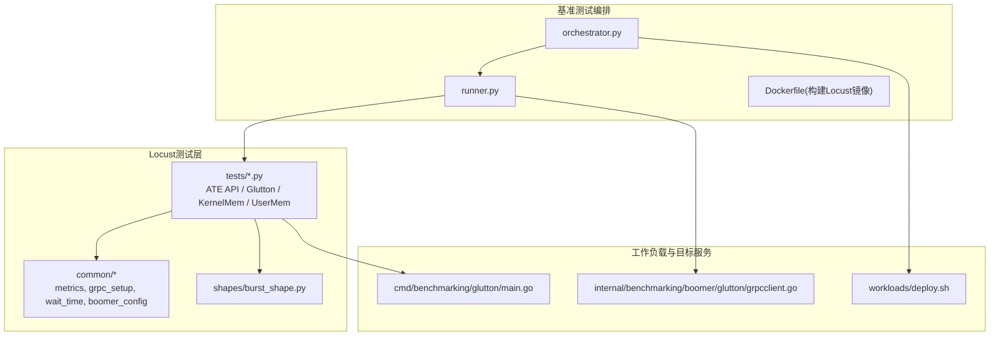
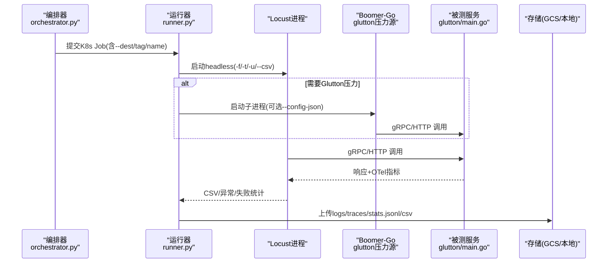
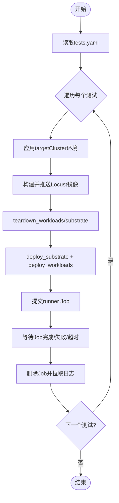
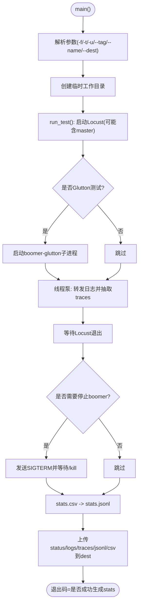
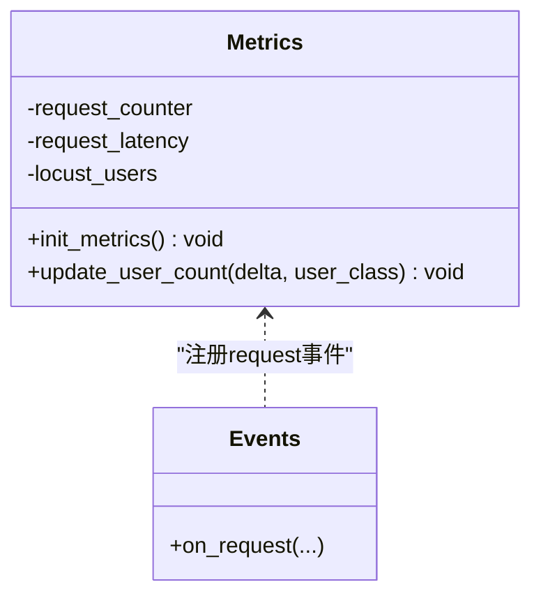
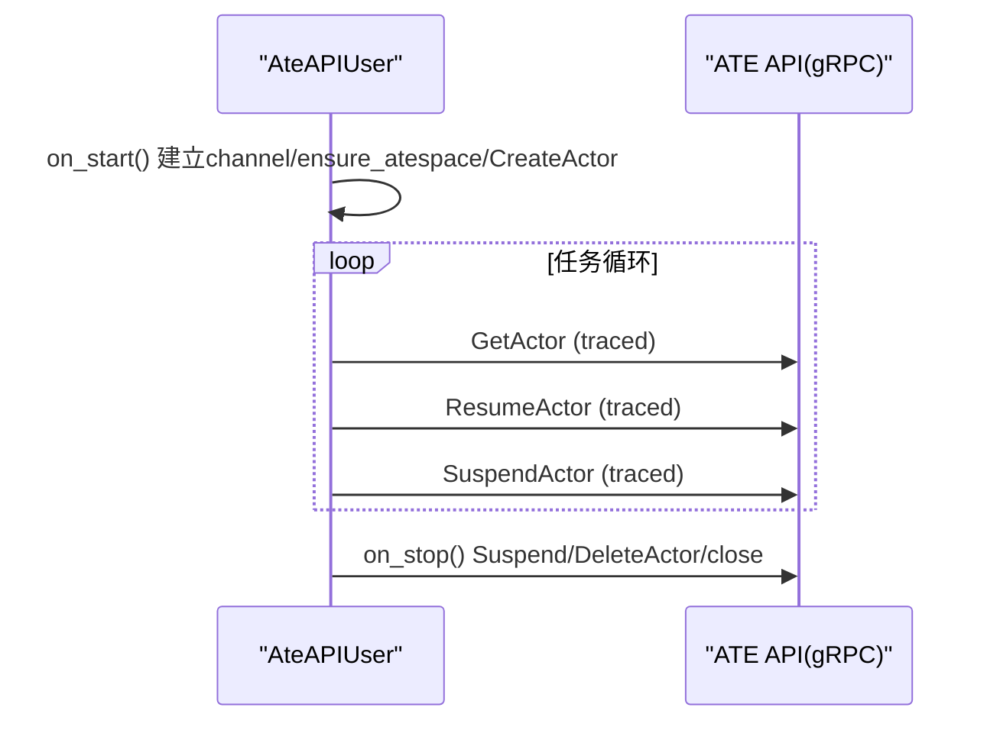
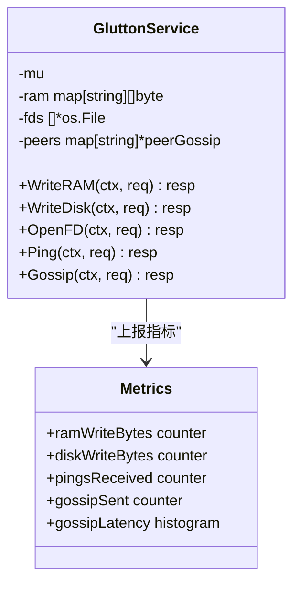
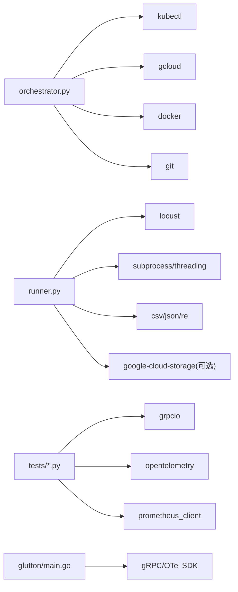

# 性能基准测试

<cite>
**本文引用的文件**   
- [benchmarking/README.md](file://benchmarking/README.md)
- [benchmarking/locust/runner.py](file://benchmarking/locust/runner.py)
- [benchmarking/automation/orchestrator.py](file://benchmarking/automation/orchestrator.py)
- [benchmarking/locust/common/metrics.py](file://benchmarking/locust/common/metrics.py)
- [benchmarking/locust/tests/glutton.py](file://benchmarking/locust/tests/glutton.py)
- [benchmarking/locust/tests/ate_api.py](file://benchmarking/locust/tests/ate_api.py)
- [benchmarking/locust/common/grpc_setup.py](file://benchmarking/locust/common/grpc_setup.py)
- [benchmarking/locust/common/boomer_config.py](file://benchmarking/locust/common/boomer_config.py)
- [benchmarking/workloads/deploy.sh](file://benchmarking/workloads/deploy.sh)
- [cmd/benchmarking/glutton/main.go](file://cmd/benchmarking/glutton/main.go)
- [internal/benchmarking/boomer/glutton/grpcclient.go](file://internal/benchmarking/boomer/glutton/grpcclient.go)
- [benchmarking/locust/common/wait_time.py](file://benchmarking/locust/common/wait_time.py)
- [benchmarking/locust/shapes/burst_shape.py](file://benchmarking/locust/shapes/burst_shape.py)
</cite>

## 目录
1. [简介](#简介)
2. [项目结构](#项目结构)
3. [核心组件](#核心组件)
4. [架构总览](#架构总览)
5. [详细组件分析](#详细组件分析)
6. [依赖关系分析](#依赖关系分析)
7. [性能考量](#性能考量)
8. [故障排查指南](#故障排查指南)
9. [结论](#结论)
10. [附录](#附录)

## 简介
本指南面向需要在 Substrate 上进行大规模性能基准测试的工程师，提供基于 Locust 的端到端负载测试方案。内容涵盖：
- 部署与配置 Locust 及工作负载
- 编写测试脚本、模拟并发用户、采集性能指标
- 覆盖 HTTP、gRPC、文件 IO、内存操作等典型工作负载
- 结果分析与解读（吞吐、延迟、资源利用率）
- 系统调优、资源配置与算法优化建议
- 自动化流水线搭建（持续集成、回归检测、报告生成）
- 不同规模集群的基准数据组织与对比方法
- 性能问题诊断与定位（瓶颈识别、热点分析、内存泄漏检测）

## 项目结构
基准测试相关代码主要位于 benchmarking 目录，包含：
- 编排与自动化：orchestrator.py、manifests、Dockerfile、requirements.txt
- Locust 测试框架：tests、common、shapes、runner.py、deploy.sh
- 工作负载部署：workloads/deploy.sh 与模板
- 被测服务示例：cmd/benchmarking/glutton/main.go（gRPC/HTTP 压测目标）

图表来源
- [benchmarking/automation/orchestrator.py:1-120](file://benchmarking/automation/orchestrator.py#L1-L120)
- [benchmarking/locust/runner.py:1-120](file://benchmarking/locust/runner.py#L1-L120)
- [benchmarking/locust/tests/ate_api.py:1-60](file://benchmarking/locust/tests/ate_api.py#L1-L60)
- [benchmarking/locust/common/metrics.py:1-60](file://benchmarking/locust/common/metrics.py#L1-L60)
- [benchmarking/workloads/deploy.sh:1-60](file://benchmarking/workloads/deploy.sh#L1-L60)
- [cmd/benchmarking/glutton/main.go:1-120](file://cmd/benchmarking/glutton/main.go#L1-L120)
- [internal/benchmarking/boomer/glutton/grpcclient.go:1-42](file://internal/benchmarking/boomer/glutton/grpcclient.go#L1-L42)

章节来源
- [benchmarking/README.md:1-90](file://benchmarking/README.md#L1-L90)

## 核心组件
- 编排器 orchestrator.py：克隆仓库、构建并推送 Locust 镜像、按 tests.yaml 逐条提交 Kubernetes Job 执行 runner.py，并在测试前后清理环境。
- 无头运行器 runner.py：以 headless 模式启动 Locust，必要时拉起 Go 版 boomer-glutton 作为真实高并发压力源；收集 CSV/JSONL/日志/追踪记录并上传到 GCS 或本地路径。
- 指标与追踪 common/metrics.py：通过 Prometheus + OpenTelemetry 暴露请求计数、延迟直方图、活跃用户数等指标。
- gRPC 适配 common/grpc_setup.py：将 gRPC 的 poller 接入 gevent 循环，避免阻塞其他协程。
- 动态等待时间 common/wait_time.py：支持 --min-wait-time/--max-wait-time 参数，实现随机间隔任务调度。
- 峰值形状 shapes/burst_shape.py：定义突发型负载曲线（周期、峰值、生成速率）。
- ATE API 测试 tests/ate_api.py：创建 Actor、周期性调用 GetActor/ResumeActor/SuspendActor，结合 tracing 与 metrics。
- Glutton 压测 stub tests/glutton.py：仅用于 UI 枚举用户类，实际压力由 boomer-glutton 承担。
- 工作负载部署 workloads/deploy.sh：使用 ko 应用模板，部署 WorkerPool 等压测目标。
- 压测目标 cmd/benchmarking/glutton/main.go：提供 gRPC/HTTP 接口，支持内存写入、磁盘写入、FD 打开、Ping/Gossip 等能力，并输出 OTel 指标。
- Boomer gRPC 客户端 internal/benchmarking/boomer/glutton/grpcclient.go：TLS 连接 ateapi，注入 OTel 统计。

章节来源
- [benchmarking/automation/orchestrator.py:1-120](file://benchmarking/automation/orchestrator.py#L1-L120)
- [benchmarking/locust/runner.py:1-120](file://benchmarking/locust/runner.py#L1-L120)
- [benchmarking/locust/common/metrics.py:1-60](file://benchmarking/locust/common/metrics.py#L1-L60)
- [benchmarking/locust/common/grpc_setup.py:1-38](file://benchmarking/locust/common/grpc_setup.py#L1-L38)
- [benchmarking/locust/common/wait_time.py:1-54](file://benchmarking/locust/common/wait_time.py#L1-L54)
- [benchmarking/locust/shapes/burst_shape.py:1-41](file://benchmarking/locust/shapes/burst_shape.py#L1-L41)
- [benchmarking/locust/tests/ate_api.py:1-120](file://benchmarking/locust/tests/ate_api.py#L1-L120)
- [benchmarking/locust/tests/glutton.py:1-45](file://benchmarking/locust/tests/glutton.py#L1-L45)
- [benchmarking/workloads/deploy.sh:1-108](file://benchmarking/workloads/deploy.sh#L1-L108)
- [cmd/benchmarking/glutton/main.go:1-150](file://cmd/benchmarking/glutton/main.go#L1-L150)
- [internal/benchmarking/boomer/glutton/grpcclient.go:1-42](file://internal/benchmarking/boomer/glutton/grpcclient.go#L1-L42)

## 架构总览
下图展示了从编排器到 Locust 运行器、再到被测服务的整体流程，以及指标与追踪数据的落盘与上传路径。

图表来源
- [benchmarking/automation/orchestrator.py:311-337](file://benchmarking/automation/orchestrator.py#L311-L337)
- [benchmarking/locust/runner.py:170-252](file://benchmarking/locust/runner.py#L170-L252)
- [cmd/benchmarking/glutton/main.go:120-150](file://cmd/benchmarking/glutton/main.go#L120-L150)

## 详细组件分析

### 编排器 orchestrator.py
职责
- 解析 tests.yaml，逐个测试项准备目标集群环境（gcloud/kubectl），构建并推送 Locust 镜像，提交 runner Job，等待完成并清理。
- 保证幂等性：每次测试前 teardown_workloads() 与 teardown_substrate()，避免状态污染。

关键流程
- 选择 targetCluster -> 设置 .ate-dev-env.sh -> 刷新环境变量 -> 构建镜像 -> 部署 substrate 与工作负载 -> 提交 Job -> 轮询 Job 状态 -> 拉取日志 -> 清理。

图表来源
- [benchmarking/automation/orchestrator.py:340-441](file://benchmarking/automation/orchestrator.py#L340-L441)

章节来源
- [benchmarking/automation/orchestrator.py:1-120](file://benchmarking/automation/orchestrator.py#L1-L120)
- [benchmarking/automation/orchestrator.py:311-337](file://benchmarking/automation/orchestrator.py#L311-L337)

### 运行器 runner.py
职责
- 以 headless 模式运行 Locust，必要时拉起 boomer-glutton 作为 worker。
- 转发 stdout/stderr 到 logs.txt，抽取 trace 记录到 traces.txt。
- 将 stats.csv 转换为 stats.jsonl，统一上传到 GCS 或本地路径。

关键点
- 当测试为 glutton.py 时，启用 master 模式并等待一个 worker（boomer）。
- 对 boomer 发送 SIGTERM 优雅退出，最长等待 90 秒后强制 kill。
- JSONL 字段包括 timestamp、tag、test_name、metric、measurements。

图表来源
- [benchmarking/locust/runner.py:307-393](file://benchmarking/locust/runner.py#L307-L393)
- [benchmarking/locust/runner.py:170-252](file://benchmarking/locust/runner.py#L170-L252)
- [benchmarking/locust/runner.py:255-305](file://benchmarking/locust/runner.py#L255-L305)

章节来源
- [benchmarking/locust/runner.py:1-120](file://benchmarking/locust/runner.py#L1-L120)
- [benchmarking/locust/runner.py:170-252](file://benchmarking/locust/runner.py#L170-L252)
- [benchmarking/locust/runner.py:255-305](file://benchmarking/locust/runner.py#L255-L305)
- [benchmarking/locust/runner.py:307-393](file://benchmarking/locust/runner.py#L307-L393)

### 指标与追踪 common/metrics.py
- 初始化 Prometheus 服务器（默认端口 8000）与 OTel PrometheusReader。
- 注册 locust.request 事件监听，累计请求总数、延迟直方图，并按 user_class/method/name/status 打标签。
- 提供 update_user_count(delta, user_class) 在 on_start/on_stop 中更新活跃用户数。

图表来源
- [benchmarking/locust/common/metrics.py:29-104](file://benchmarking/locust/common/metrics.py#L29-L104)

章节来源
- [benchmarking/locust/common/metrics.py:1-104](file://benchmarking/locust/common/metrics.py#L1-L104)

### gRPC 与 gevent 兼容 common/grpc_setup.py
- 在 Locust 导入 gevent 之后、创建任何 gRPC channel 之前，调用 init_gevent()，使 gRPC 的 poller 进入 gevent 循环，避免阻塞。

章节来源
- [benchmarking/locust/common/grpc_setup.py:1-38](file://benchmarking/locust/common/grpc_setup.py#L1-L38)

### 动态等待时间 common/wait_time.py
- 注册 --min-wait-time 与 --max-wait-time 命令行参数（支持环境变量 LOCUST_MIN_WAIT_TIME/LOCUST_MAX_WAIT_TIME）。
- dynamic_wait_time(user) 返回均匀分布的随机等待秒数，用于控制任务间节奏。

章节来源
- [benchmarking/locust/common/wait_time.py:1-54](file://benchmarking/locust/common/wait_time.py#L1-L54)

### 峰值形状 shapes/burst_shape.py
- BurstShape 定义一个 30 秒周期的突发负载：前 10 秒逐步增长到 3 个用户，随后保持当前活跃用户数直至周期结束。

章节来源
- [benchmarking/locust/shapes/burst_shape.py:1-41](file://benchmarking/locust/shapes/burst_shape.py#L1-L41)

### ATE API 测试 tests/ate_api.py
- 建立 TLS gRPC 通道（带证书与 SAN 覆盖），确保 atespace，创建 Actor。
- 任务循环中依次调用 GetActor、ResumeActor、SuspendActor，并使用 traced_grpc 注入追踪上下文。
- 在 on_start/on_stop 中更新活跃用户数。

图表来源
- [benchmarking/locust/tests/ate_api.py:41-120](file://benchmarking/locust/tests/ate_api.py#L41-L120)

章节来源
- [benchmarking/locust/tests/ate_api.py:1-120](file://benchmarking/locust/tests/ate_api.py#L1-L120)

### Glutton 压测 stub tests/glutton.py
- 仅声明 GluttonUser 以便 UI 枚举；实际压力由 boomer-glutton 承担。
- 在 master 模式下通过 /boomer-config 暴露运行时参数（trace概率、等待时间等）。

章节来源
- [benchmarking/locust/tests/glutton.py:1-45](file://benchmarking/locust/tests/glutton.py#L1-L45)
- [benchmarking/locust/common/boomer_config.py:70-90](file://benchmarking/locust/common/boomer_config.py#L70-L90)

### 工作负载部署 workloads/deploy.sh
- 根据模板替换 BUCKET_NAME 与 WORKER_COUNT，使用 ko apply/delete 管理资源。
- 要求 BUCKET_NAME 环境变量存在。

章节来源
- [benchmarking/workloads/deploy.sh:1-108](file://benchmarking/workloads/deploy.sh#L1-L108)

### 压测目标 cmd/benchmarking/glutton/main.go
- 支持 gRPC 与 HTTP 两种模式，暴露 Ping、WriteRAM、WriteDisk、OpenFD、Gossip 等接口。
- 内置 OTel 指标（ram/disk 写入字节、ping 请求计数、gossip 延迟直方图等）。
- 流式随机写磁盘，避免一次性大对象驻留内存。

图表来源
- [cmd/benchmarking/glutton/main.go:191-298](file://cmd/benchmarking/glutton/main.go#L191-L298)
- [cmd/benchmarking/glutton/main.go:314-386](file://cmd/benchmarking/glutton/main.go#L314-L386)
- [cmd/benchmarking/glutton/main.go:419-422](file://cmd/benchmarking/glutton/main.go#L419-L422)
- [cmd/benchmarking/glutton/main.go:426-475](file://cmd/benchmarking/glutton/main.go#L426-L475)

章节来源
- [cmd/benchmarking/glutton/main.go:1-150](file://cmd/benchmarking/glutton/main.go#L1-L150)
- [cmd/benchmarking/glutton/main.go:191-298](file://cmd/benchmarking/glutton/main.go#L191-L298)
- [cmd/benchmarking/glutton/main.go:314-386](file://cmd/benchmarking/glutton/main.go#L314-L386)
- [cmd/benchmarking/glutton/main.go:419-422](file://cmd/benchmarking/glutton/main.go#L419-L422)
- [cmd/benchmarking/glutton/main.go:426-475](file://cmd/benchmarking/glutton/main.go#L426-L475)

### Boomer gRPC 客户端 internal/benchmarking/boomer/glutton/grpcclient.go
- 使用 TLS 连接 ateapi（跳过严格主机名校验，适用于集群内证书场景），注入 OTel 客户端统计。

章节来源
- [internal/benchmarking/boomer/glutton/grpcclient.go:1-42](file://internal/benchmarking/boomer/glutton/grpcclient.go#L1-L42)

## 依赖关系分析
- orchestrator.py 依赖 kubectl/gcloud/docker/git/yaml，负责生命周期管理与结果上传路径传递。
- runner.py 依赖 Python 标准库、subprocess、threading、csv/json/re，必要时依赖 google-cloud-storage。
- tests 模块依赖 locust、grpcio、opentelemetry、prometheus_client。
- glutton/main.go 依赖 gRPC、OTel SDK/Exporter、protobuf。

图表来源
- [benchmarking/automation/orchestrator.py:1-120](file://benchmarking/automation/orchestrator.py#L1-L120)
- [benchmarking/locust/runner.py:1-120](file://benchmarking/locust/runner.py#L1-L120)
- [benchmarking/locust/tests/ate_api.py:1-60](file://benchmarking/locust/tests/ate_api.py#L1-L60)
- [cmd/benchmarking/glutton/main.go:1-120](file://cmd/benchmarking/glutton/main.go#L1-L120)

章节来源
- [benchmarking/automation/orchestrator.py:1-120](file://benchmarking/automation/orchestrator.py#L1-L120)
- [benchmarking/locust/runner.py:1-120](file://benchmarking/locust/runner.py#L1-L120)
- [benchmarking/locust/tests/ate_api.py:1-60](file://benchmarking/locust/tests/ate_api.py#L1-L60)
- [cmd/benchmarking/glutton/main.go:1-120](file://cmd/benchmarking/glutton/main.go#L1-L120)

## 性能考量
- 并发模型
  - Locust 基于 gevent 协程，需确保 gRPC 与 gevent 兼容（见 grpc_setup.py）。
  - 对于极高并发场景，优先使用 boomer-glutton 作为压力源（Go 原生并发）。
- 指标采集
  - 使用 Prometheus + OTel 导出请求计数、延迟直方图、活跃用户数。
  - 建议在 Grafana 中建立看板，关联 run tag 与 commit 进行对比。
- 等待策略
  - 使用 dynamic_wait_time 模拟真实用户行为，避免过于规律的请求导致缓存命中失真。
- 负载形状
  - 使用 BurstShape 模拟突发流量，验证系统在尖峰下的稳定性与恢复能力。
- 存储与网络
  - glutton 的 WriteDisk 采用分块随机写，避免大对象驻留内存；注意磁盘 I/O 与页缓存影响。
  - gRPC 连接复用与 TLS 开销在高并发下需关注。

[本节为通用指导，不直接分析具体文件]

## 故障排查指南
- 常见问题
  - DIND 未就绪：编排器会等待 docker info 成功，若超时则报错。检查容器运行时与网络。
  - 目标集群凭据缺失：apply_target_cluster 会校验 PROJECT_ID/CLUSTER_NAME/CLUSTER_LOCATION/KO_DOCKER_REPO。
  - 旧 Job 残留：wait_for_no_active_runners 会阻止新测试启动直到所有 runner Job 完成。
- 运行器问题
  - stats.csv 未生成：runner 会记录原因并跳过 JSONL 生成，最终非零退出。
  - boomer 未退出：超过 90 秒将被 kill，检查 SIGTERM 处理逻辑与资源清理。
- 指标与追踪
  - Prometheus 端口冲突：metrics 初始化时会尝试启动 8000 端口，冲突会警告但不中断。
  - gRPC 阻塞：确认已调用 grpc_setup.init_grpc_gevent() 且发生在创建 channel 之前。

章节来源
- [benchmarking/automation/orchestrator.py:170-250](file://benchmarking/automation/orchestrator.py#L170-L250)
- [benchmarking/automation/orchestrator.py:253-273](file://benchmarking/automation/orchestrator.py#L253-L273)
- [benchmarking/locust/runner.py:338-393](file://benchmarking/locust/runner.py#L338-L393)
- [benchmarking/locust/common/metrics.py:35-44](file://benchmarking/locust/common/metrics.py#L35-L44)
- [benchmarking/locust/common/grpc_setup.py:18-38](file://benchmarking/locust/common/grpc_setup.py#L18-L38)

## 结论
本指南提供了基于 Locust 与 Go 压力源的完整基准测试体系，覆盖编排、运行、指标采集、结果归档与可视化。通过可复用的测试脚本、灵活的负载形状与完善的自动化流水线，可在不同规模集群上稳定执行回归与容量评估，并为性能优化与问题定位提供可靠数据支撑。

[本节为总结，不直接分析具体文件]

## 附录

### 部署与运行步骤
- 安装与部署
  - 参考 README 中的命令，使用 ./benchmarking/deploy_locust.sh --deploy 一键部署 Locust 与工作负载。
  - 如需 Prometheus/Grafana，应用 benchmarking/monitoring.yaml 并通过 port-forward 访问。
- 运行测试
  - 通过 Locust Web UI 选择用户类（如 AteAPIUser、KernelMemUser、UserMemUser、GluttonUser），配置并发用户数、持续时间、等待时间与追踪开关。
  - 或通过 orchestrator 自动提交 Job 执行。

章节来源
- [benchmarking/README.md:1-90](file://benchmarking/README.md#L1-L90)

### 工作负载类型与测试方法
- HTTP 请求
  - 使用 glutton HTTP 模式（/ping），适合简单连通性与吞吐评估。
- gRPC 调用
  - ATE API 测试（Create/Get/Resume/Suspend Actor），结合 tracing 与 metrics。
- 文件 IO
  - glutton WriteDisk 接口，支持截断与覆盖模式，观察磁盘 I/O 与延迟。
- 内存操作
  - glutton WriteRAM 接口，支持截断与覆盖模式，观察内存分配与 GC 行为。
- FD 压力
  - glutton OpenFD 接口，调整打开 FD 数量，评估系统 FD 限制与内核态开销。

章节来源
- [cmd/benchmarking/glutton/main.go:314-386](file://cmd/benchmarking/glutton/main.go#L314-L386)
- [cmd/benchmarking/glutton/main.go:391-416](file://cmd/benchmarking/glutton/main.go#L391-L416)
- [benchmarking/locust/tests/ate_api.py:91-119](file://benchmarking/locust/tests/ate_api.py#L91-L119)

### 结果分析与解读
- 吞吐量
  - 查看 stats.jsonl 中的 requests_per_second 指标，按 test_name 与 tag 聚合。
- 延迟
  - 关注 p50/p90/p99 等百分位列，结合 traces.txt 中的单条 span 延迟进行根因定位。
- 资源利用率
  - 通过 Prometheus 抓取 glutton 与 Locust 指标，观察 CPU/内存/FD/IO 使用情况。
- 对比分析
  - 使用 run_date/run_ts/run_tag 分区组织数据，便于跨版本与集群规模对比。

章节来源
- [benchmarking/locust/runner.py:255-305](file://benchmarking/locust/runner.py#L255-L305)
- [benchmarking/locust/runner.py:367-386](file://benchmarking/locust/runner.py#L367-L386)

### 自动化流水线搭建
- 持续集成
  - 使用 orchestrator 定时触发 CronJob，按 tests.yaml 顺序执行多目标集群测试。
- 性能回归检测
  - 比较同一 tag 在不同时间的 stats.jsonl，设定阈值告警（如 p99 延迟上升超过 X%）。
- 报告生成
  - 将 stats.jsonl 与 traces.txt 同步至 GCS，配合 BI 工具生成趋势报告。

章节来源
- [benchmarking/automation/orchestrator.py:340-441](file://benchmarking/automation/orchestrator.py#L340-L441)

### 不同规模集群的基准数据与对比
- 数据组织
  - 使用 dest 根路径下的 runs/<name>/run_date=<date>/run_ts=<ts>/run_tag=<tag> 分区。
- 对比维度
  - 同 tag 不同日期：评估版本演进效果。
  - 同日期不同 tag：评估并行分支差异。
  - 不同 workerCount：评估水平扩展能力。

章节来源
- [benchmarking/locust/runner.py:327-335](file://benchmarking/locust/runner.py#L327-L335)
- [benchmarking/workloads/deploy.sh:51-67](file://benchmarking/workloads/deploy.sh#L51-L67)

### 性能问题诊断与定位
- 瓶颈识别
  - 若 p99 显著升高但吞吐下降，优先检查锁竞争与序列化点（如 glutton 全局 mu）。
- 热点分析
  - 结合 traces.txt 与 OTel 链路，定位慢调用链路与服务端热点。
- 内存泄漏检测
  - 观察 glutton.ram.write.bytes 与进程 RSS 变化，确认是否存在未释放引用。
- 网络与 TLS
  - 检查 gRPC 连接池与握手耗时，必要时调整 keepalive 与超时。

章节来源
- [cmd/benchmarking/glutton/main.go:191-298](file://cmd/benchmarking/glutton/main.go#L191-L298)
- [benchmarking/locust/runner.py:116-152](file://benchmarking/locust/runner.py#L116-L152)
