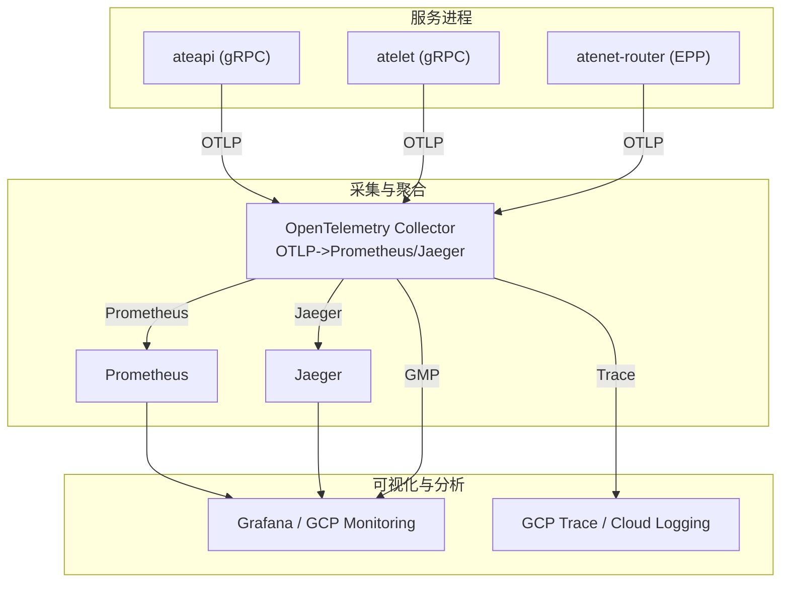
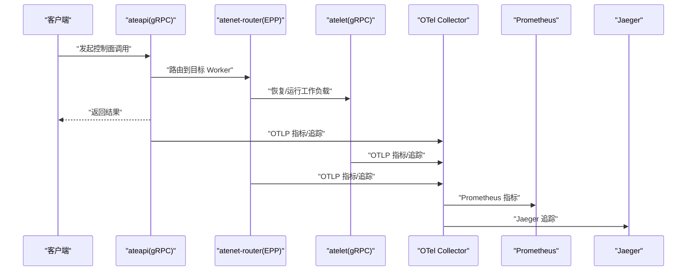
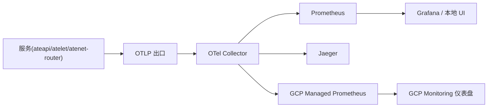

# 指标分析与解读

<cite>
**本文引用的文件**   
- [observability.md](file://docs/observability.md)
- [tracing.md](file://docs/dev/best-practices/tracing.md)
- [serverboot.go](file://internal/serverboot/serverboot.go)
- [metrics.go](file://cmd/atenet/internal/router/metrics.go)
- [prom.go](file://internal/benchmarking/boomer/metrics/prom.go)
- [monitoring.yaml](file://benchmarking/monitoring.yaml)
- [otel-collector.yaml](file://manifests/ate-install/kind/otel-collector.yaml)
- [ate-grpc-dashboard.json](file://tools/setup-gcp/dashboards/ate-grpc-dashboard.json)
- [ate-e2e-latency-dashboard.json](file://tools/setup-gcp/dashboards/ate-e2e-latency-dashboard.json)
- [main.go](file://cmd/atelet/main.go)
</cite>

## 目录
1. [引言](#引言)
2. [项目结构](#项目结构)
3. [核心组件](#核心组件)
4. [架构总览](#架构总览)
5. [详细组件分析](#详细组件分析)
6. [依赖关系分析](#依赖关系分析)
7. [性能考量](#性能考量)
8. [故障排查指南](#故障排查指南)
9. [结论](#结论)
10. [附录](#附录)

## 引言
本文件面向性能工程师与平台运维人员，系统化讲解 Agent Substrate 在“指标收集与解读”方面的实践。内容覆盖：
- 关键性能指标定义与计算方法（吞吐量、延迟、错误率、资源利用率）
- 分布式追踪数据的分析方法（链路追踪、热点识别、瓶颈定位）
- 系统资源监控指标（CPU、内存、网络带宽、磁盘 IO）
- 应用层指标（请求队列长度、连接池状态、缓存命中率等）
- 趋势分析与对比评估（历史比较、基线建立、回归检测）
- 异常检测与告警规则配置方法

## 项目结构
本项目在可观测性方面采用 OpenTelemetry 作为统一采集标准，结合 Prometheus/Jaeger/GCP Monitoring 等后端进行存储与可视化。核心相关文件包括：
- 可观测性文档与最佳实践：docs/observability.md、docs/dev/best-practices/tracing.md
- 服务启动与 OTel 初始化：internal/serverboot/serverboot.go
- 路由服务自定义指标：cmd/atenet/internal/router/metrics.go
- 压测侧 Prometheus 指标导出：internal/benchmarking/boomer/metrics/prom.go
- 本地与 GKE 的 OTel Collector 部署：manifests/ate-install/kind/otel-collector.yaml
- 基准测试监控栈（Prometheus + Grafana）：benchmarking/monitoring.yaml
- GCP 仪表盘定义：tools/setup-gcp/dashboards/*.json
- atelet 服务主流程与指标埋点：cmd/atelet/main.go

图表来源
- [otel-collector.yaml:26-54](file://manifests/ate-install/kind/otel-collector.yaml#L26-L54)
- [observability.md:170-182](file://docs/observability.md#L170-L182)

章节来源
- [observability.md:103-182](file://docs/observability.md#L103-L182)
- [otel-collector.yaml:26-54](file://manifests/ate-install/kind/otel-collector.yaml#L26-L54)

## 核心组件
- 可观测性模型与指标清单：定义了 gRPC 服务端指标、路由耗时、快照大小等核心指标及其标签维度。
- 追踪最佳实践：提供服务器/客户端的 OTel 初始化、采样策略、中间件集成方式。
- 指标导出与采集：通过 OTLP 将指标发送至本地 Prometheus 或 GCP Managed Prometheus；追踪数据经 Collector 转发至 Jaeger 或 GCP Trace。
- 压测指标对齐：Go 压测工具暴露与 Python Locust 一致的 Prometheus 指标，便于复用看板。

章节来源
- [observability.md:103-133](file://docs/observability.md#L103-L133)
- [tracing.md:28-114](file://docs/dev/best-practices/tracing.md#L28-L114)
- [prom.go:32-57](file://internal/benchmarking/boomer/metrics/prom.go#L32-L57)

## 架构总览
下图展示了从服务到采集器再到可视化的端到端路径，以及关键指标与追踪的流转。

图表来源
- [observability.md:137-166](file://docs/observability.md#L137-L166)
- [otel-collector.yaml:26-54](file://manifests/ate-install/kind/otel-collector.yaml#L26-L54)

## 详细组件分析

### 指标体系与定义
- 全局 gRPC 服务端指标（由 otelgrpc 自动产出）
  - 名称：rpc.server.call.duration
  - 类型：直方图
  - 含义：按方法的 gRPC 延迟分布，附带请求速率与错误计数
  - 标签：rpc.method、rpc.response.status_code
  - 用途：计算 QPS、P50/P95/P99 延迟、错误率
- 路由阶段指标（atenet-router 自定义）
  - 名称：atenet.router.route.duration
  - 类型：直方图
  - 含义：从接收请求到解析出目标 Worker 的耗时（不含 Actor 执行与响应）
  - 用途：衡量网关/路由层开销，辅助端到端延迟拆解
- 快照大小指标（atelet 自定义）
  - 名称：atelet.snapshot.size
  - 类型：直方图
  - 含义：每次检查点写入的未压缩镜像大小（字节）
  - 标签：kind、actor_template_namespace、actor_template_name
  - 用途：评估快照体积对 I/O 与恢复时延的影响
- 压测侧指标（Go Boomer 与 Python Locust 对齐）
  - locust_requests_total：按 method/name/status/user_class 的请求总数
  - locust_request_duration_milliseconds：按相同维度的延迟直方图
  - locust_users：按 user_class 的活跃用户数

章节来源
- [observability.md:107-113](file://docs/observability.md#L107-L113)
- [metrics.go:24-51](file://cmd/atenet/internal/router/metrics.go#L24-L51)
- [main.go:273-307](file://cmd/atelet/main.go#L273-L307)
- [prom.go:32-57](file://internal/benchmarking/boomer/metrics/prom.go#L32-L57)

### 关键指标的计算方法与解读
- 吞吐量（QPS）
  - 公式：rate(指标_count[窗口]) 或 sum(rate(...)) by 维度
  - 示例：rpc.server.call.duration_count、locust_requests_total_total
- 延迟分位数
  - 公式：histogram_quantile(分位, rate(指标_bucket[窗口]))
  - 示例：P50/P95/P99 分别对应 0.50/0.95/0.99
- 错误率
  - 公式：sum(rate(指标_count{status!="OK"}[窗口])) / sum(rate(指标_count[窗口]))
  - 说明：基于 rpc.response.status_code 非 OK 的比率
- 资源利用率（建议）
  - CPU：node_cpu_usage_seconds_total 或 container_cpu_usage_seconds_total
  - 内存：container_memory_working_set_bytes
  - 网络：container_network_receive_bytes_total / transmit_bytes_total
  - 磁盘 IO：container_fs_reads_bytes_total / writes_bytes_total
  - 说明：上述为通用 Prometheus 指标命名约定，可在集群中启用 cAdvisor/Kubelet 指标后查询

章节来源
- [observability.md:107-113](file://docs/observability.md#L107-L113)
- [ate-grpc-dashboard.json:12-79](file://tools/setup-gcp/dashboards/ate-grpc-dashboard.json#L12-L79)
- [ate-e2e-latency-dashboard.json:12-48](file://tools/setup-gcp/dashboards/ate-e2e-latency-dashboard.json#L12-L48)

### 分布式追踪数据分析
- 链路追踪
  - 使用 OTel 在 gRPC/HTTP 间传播上下文，形成跨服务的完整调用链
  - 支持按需采样（ParentBased+NeverSample/AlwaysSample），避免生产环境过度开销
- 热点识别
  - 通过 trace 树查看各 span 耗时占比，定位慢节点
  - 结合标签（如 actor_template_name、rpc.method）筛选热点方法/模板
- 瓶颈定位
  - 对比路由阶段（atenet.router.route.duration）与服务内部（rpc.server.call.duration）
  - 结合日志与指标，区分网络、序列化、外部依赖、I/O 等瓶颈

章节来源
- [tracing.md:19-26](file://docs/dev/best-practices/tracing.md#L19-L26)
- [observability.md:137-166](file://docs/observability.md#L137-L166)

### 系统资源与应用层指标
- 系统资源
  - CPU/内存/网络/磁盘 IO：参考“关键指标的计算方法与解读”中的通用指标
- 应用层指标（建议）
  - 请求队列长度：pending_requests 或 queue_length（需业务埋点）
  - 连接池状态：active/idle connections（数据库/HTTP 客户端）
  - 缓存命中率：cache_hits/cache_misses（Redis/本地缓存）
  - 说明：这些指标需在具体业务代码中显式埋点并纳入 OTel/Prometheus

章节来源
- [observability.md:103-133](file://docs/observability.md#L103-L133)

### 性能趋势分析与对比评估
- 历史数据比较
  - 使用 Prometheus 时间范围查询对比不同时段 P99/QPS/错误率
- 基线建立
  - 以稳定期数据计算均值与方差，设定动态阈值
- 回归检测
  - 当 P99 延迟或错误率相对基线显著上升时触发告警
- 看板支撑
  - GCP 仪表盘已内置 gRPC 延迟/QPS/错误率与路由 E2E 延迟面板，可直接复用

章节来源
- [ate-grpc-dashboard.json:12-79](file://tools/setup-gcp/dashboards/ate-grpc-dashboard.json#L12-L79)
- [ate-e2e-latency-dashboard.json:12-48](file://tools/setup-gcp/dashboards/ate-e2e-latency-dashboard.json#L12-L48)

### 异常检测与告警规则配置
- 指标类告警（PromQL 思路）
  - 高错误率：rate(rpc.server.call.duration_count{status!="OK"}[5m]) / rate(rpc.server.call.duration_count[5m]) > 阈值
  - 高延迟：histogram_quantile(0.99, rate(rpc.server.call.duration_bucket[5m])) > 阈值
  - 低吞吐：rate(locust_requests_total_total[5m]) < 阈值（压测场景）
- 追踪类告警
  - 长尾链路：trace 中某 span 耗时超过阈值且出现频率升高
- 配置位置
  - 本地 Kind：Prometheus 抓取 OTel Collector 的 :8889 指标
  - GKE：指标直接上报 GCP Managed Prometheus，告警规则在 Cloud Monitoring 中配置

章节来源
- [observability.md:170-182](file://docs/observability.md#L170-L182)
- [otel-collector.yaml:26-54](file://manifests/ate-install/kind/otel-collector.yaml#L26-L54)

## 依赖关系分析
- 服务与 OTel 的关系
  - 所有服务通过 OTLP 发送指标与追踪数据
  - 本地环境：Collector 将指标导出到 Prometheus，追踪导出到 Jaeger
  - 云环境：Collector 将指标导出到 GCP Managed Prometheus，追踪导出到 GCP Trace
- 指标与看板的关系
  - GCP 仪表盘 JSON 直接引用 OTel 指标名与标签，用于展示延迟/QPS/错误率

图表来源
- [observability.md:170-182](file://docs/observability.md#L170-L182)
- [otel-collector.yaml:26-54](file://manifests/ate-install/kind/otel-collector.yaml#L26-L54)

章节来源
- [observability.md:170-182](file://docs/observability.md#L170-L182)
- [otel-collector.yaml:26-54](file://manifests/ate-install/kind/otel-collector.yaml#L26-L54)

## 性能考量
- 采样策略
  - 生产建议默认 NeverSample，仅在需要时开启 AlwaysSample 或概率采样，降低开销
- 直方图桶设计
  - 针对延迟指标设置合适的桶边界，兼顾精度与存储成本
- 指标维度控制
  - 避免过多高基数标签导致存储膨胀与查询变慢
- 批处理与缓冲
  - OTel Collector 的 batch 处理器可减少下游压力

章节来源
- [tracing.md:76-95](file://docs/dev/best-practices/tracing.md#L76-L95)
- [otel-collector.yaml:34-54](file://manifests/ate-install/kind/otel-collector.yaml#L34-L54)

## 故障排查指南
- 指标不可见
  - 确认 OTel Collector 是否运行，Prometheus 是否成功抓取 :8889
  - 检查服务是否成功初始化 TracerProvider/MeterProvider
- 追踪缺失
  - 确认客户端/服务端是否正确注入/提取 TraceContext
  - 检查采样器是否设置为 NeverSample 导致未记录
- 看板无数据
  - 核对仪表盘 JSON 中的指标名与标签是否与 OTel 输出一致
  - 确认 top_level_controller_name 等标签值正确

章节来源
- [observability.md:115-133](file://docs/observability.md#L115-L133)
- [tracing.md:76-95](file://docs/dev/best-practices/tracing.md#L76-L95)
- [otel-collector.yaml:26-54](file://manifests/ate-install/kind/otel-collector.yaml#L26-L54)

## 结论
通过统一的 OTel 指标与追踪体系，Agent Substrate 实现了跨服务、跨环境的可观测性。借助 Prometheus 与 GCP Monitoring 的看板能力，能够快速定位延迟、吞吐与错误率的异常，并结合追踪数据进行根因分析。建议在业务层补充队列、连接池、缓存命中率等应用级指标，完善整体性能画像。

## 附录
- 本地开发快速上手
  - 通过端口转发访问 Prometheus 与 Jaeger，验证指标与追踪是否正常
- 压测看板
  - benchmarking/monitoring.yaml 提供了 Prometheus 与 Grafana 的部署与看板定义，便于复现与对比

章节来源
- [observability.md:115-133](file://docs/observability.md#L115-L133)
- [monitoring.yaml:173-328](file://benchmarking/monitoring.yaml#L173-L328)
