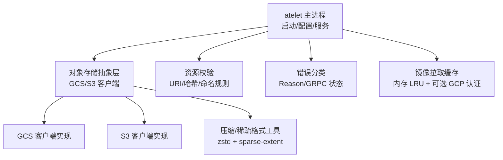
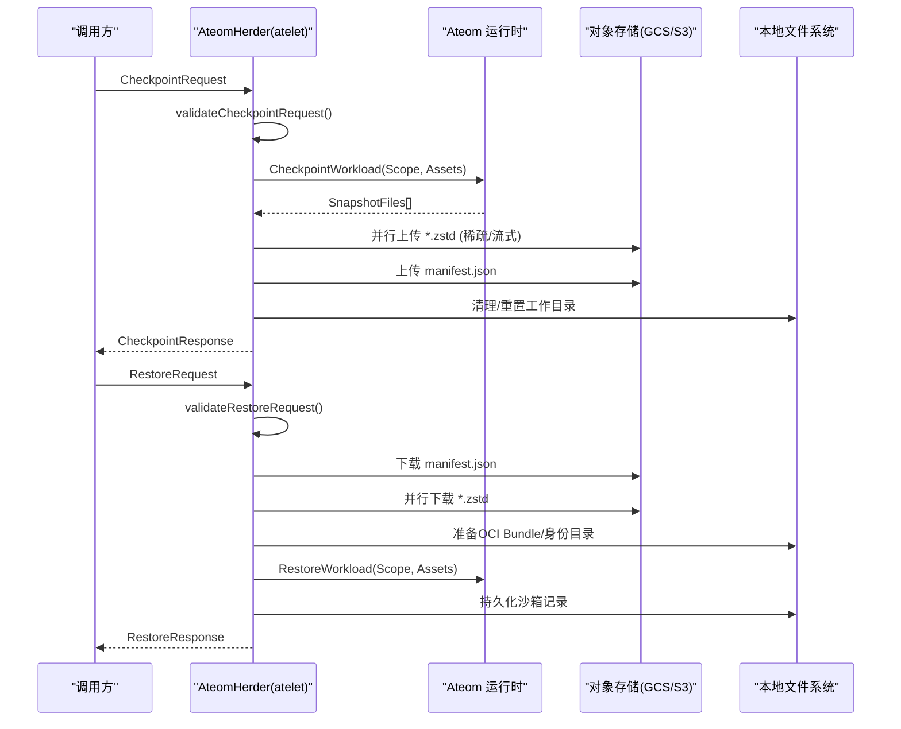
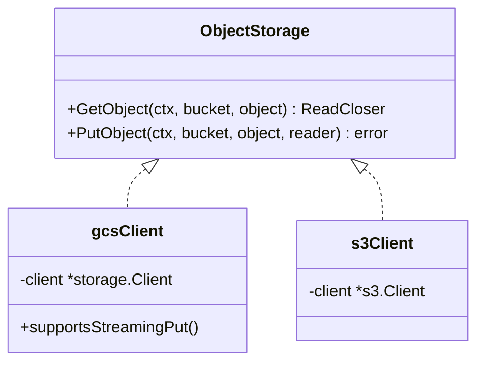
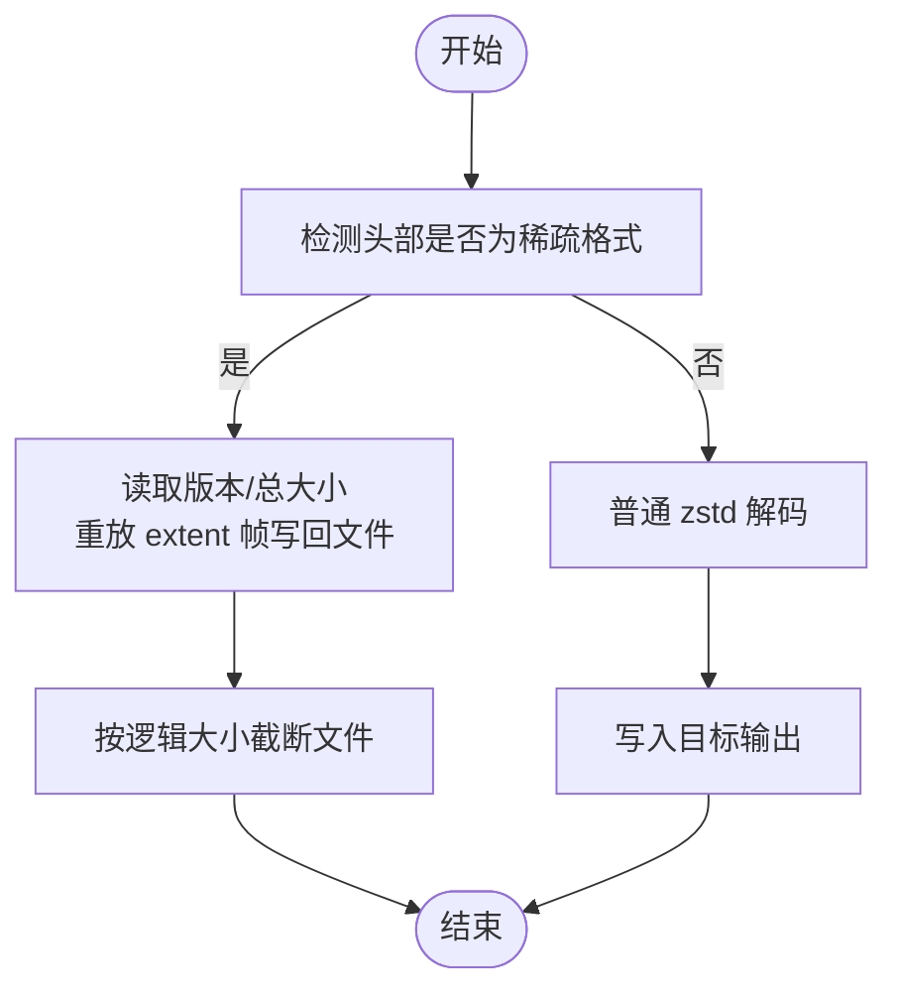
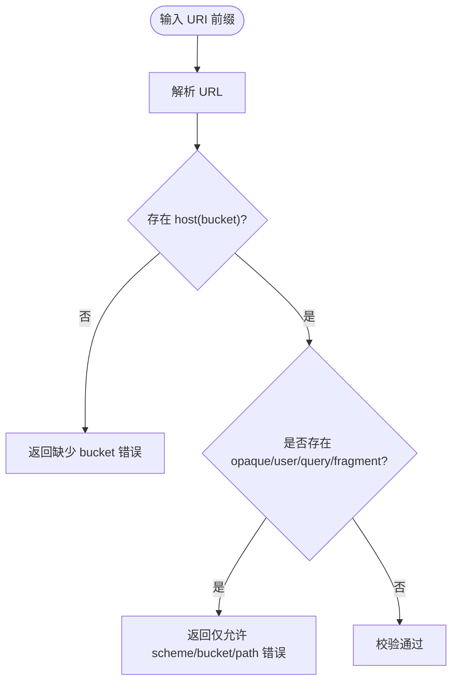
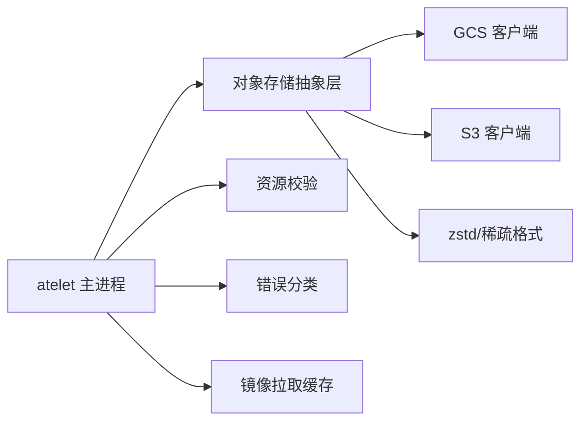

# 存储与快照问题

<cite>
**本文引用的文件**   
- [cmd/atelet/main.go](file://cmd/atelet/main.go)
- [cmd/atelet/sandbox_assets.go](file://cmd/atelet/sandbox_assets.go)
- [cmd/atelet/internal/ategcs/gcs.go](file://cmd/atelet/internal/ategcs/gcs.go)
- [cmd/atelet/internal/ategcs/s3.go](file://cmd/atelet/internal/ategcs/s3.go)
- [cmd/atelet/internal/ategcs/objects.go](file://cmd/atelet/internal/ategcs/objects.go)
- [cmd/atelet/internal/ategcs/sparsezstd.go](file://cmd/atelet/internal/ategcs/sparsezstd.go)
- [internal/resources/validate.go](file://internal/resources/validate.go)
- [internal/ateerrors/ateerrors.go](file://internal/ateerrors/ateerrors.go)
- [cmd/atelet/internal/memorypullcache/memorypullcache.go](file://cmd/atelet/internal/memorypullcache/memorypullcache.go)
</cite>

## 目录
1. [简介](#简介)
2. [项目结构](#项目结构)
3. [核心组件](#核心组件)
4. [架构总览](#架构总览)
5. [详细组件分析](#详细组件分析)
6. [依赖关系分析](#依赖关系分析)
7. [性能考量](#性能考量)
8. [故障排查指南](#故障排查指南)
9. [结论](#结论)
10. [附录](#附录)

## 简介
本指南聚焦于存储与快照相关问题的诊断与排障，覆盖对象存储（GCS/S3）连接、认证与权限验证、网络连通性测试；快照创建失败的原因与解决方案；快照恢复异常的诊断步骤（数据完整性、版本兼容性、状态一致性）；文件系统挂载与访问问题；容器镜像拉取与缓存问题；以及存储性能优化与容量规划建议。文档内容基于代码实现进行系统化梳理，帮助读者快速定位并解决问题。

## 项目结构
与存储和快照相关的核心路径与职责如下：
- atelet 服务入口与生命周期管理：负责初始化 GCS/S3 客户端、构建服务、处理 Checkpoint/Restore RPC。
- 对象存储抽象层：统一封装 GCS/S3 的 Get/Put 操作，并提供压缩/稀疏格式上传下载能力。
- 资源校验：对 URI 前缀、哈希等输入进行严格校验，避免深层错误。
- 错误分类：通过 Reason 标记可判定是否应终止工作负载。
- 内存镜像拉取缓存：加速 OCI 镜像拉取，支持本地仓库重写与 GCP 认证。

图表来源
- [cmd/atelet/main.go:126-174](file://cmd/atelet/main.go#L126-L174)
- [cmd/atelet/internal/ategcs/gcs.go:27-66](file://cmd/atelet/internal/ategcs/gcs.go#L27-L66)
- [cmd/atelet/internal/ategcs/s3.go:29-58](file://cmd/atelet/internal/ategcs/s3.go#L29-L58)
- [cmd/atelet/internal/ategcs/objects.go:37-40](file://cmd/atelet/internal/ategcs/objects.go#L37-L40)
- [cmd/atelet/internal/ategcs/sparsezstd.go:29-46](file://cmd/atelet/internal/ategcs/sparsezstd.go#L29-L46)
- [internal/resources/validate.go:150-174](file://internal/resources/validate.go#L150-L174)
- [internal/ateerrors/ateerrors.go:44-55](file://internal/ateerrors/ateerrors.go#L44-L55)
- [cmd/atelet/internal/memorypullcache/memorypullcache.go:35-70](file://cmd/atelet/internal/memorypullcache/memorypullcache.go#L35-L70)

章节来源
- [cmd/atelet/main.go:126-174](file://cmd/atelet/main.go#L126-L174)
- [cmd/atelet/internal/ategcs/objects.go:37-40](file://cmd/atelet/internal/ategcs/objects.go#L37-L40)
- [internal/resources/validate.go:150-174](file://internal/resources/validate.go#L150-L174)
- [internal/ateerrors/ateerrors.go:44-55](file://internal/ateerrors/ateerrors.go#L44-L55)
- [cmd/atelet/internal/memorypullcache/memorypullcache.go:35-70](file://cmd/atelet/internal/memorypullcache/memorypullcache.go#L35-L70)

## 核心组件
- 对象存储抽象接口与实现
  - ObjectStorage 接口定义 GetObject/PutObject，屏蔽 GCS/S3 差异。
  - gcsClient 与 s3Client 分别实现接口，并在读取缺失对象时包装为特定 Reason。
- 压缩与稀疏格式
  - 上传：根据后端能力选择流式或缓冲写入；稀疏格式仅压缩非零区域，显著降低体积与时间。
  - 下载：自动识别稀疏格式头，按逻辑大小重建稀疏文件，减少磁盘占用。
- 资源校验
  - ValidateSnapshotURIPrefix 确保 URI 仅包含 scheme、bucket、path，防止查询/片段/用户信息导致对象名被吞掉。
- 错误分类
  - Reason 枚举用于标注失败原因，CrashIfReason 将特定错误升级为 DataLoss 并附带“需崩溃”元数据。
- 镜像拉取缓存
  - MemoryPullCache 使用 LRU 缓存镜像 tar 与配置，支持本地仓库重写与 GCP 认证，大镜像不缓存直接流式解压。

章节来源
- [cmd/atelet/internal/ategcs/objects.go:37-40](file://cmd/atelet/internal/ategcs/objects.go#L37-L40)
- [cmd/atelet/internal/ategcs/gcs.go:35-66](file://cmd/atelet/internal/ategcs/gcs.go#L35-L66)
- [cmd/atelet/internal/ategcs/s3.go:37-58](file://cmd/atelet/internal/ategcs/s3.go#L37-L58)
- [cmd/atelet/internal/ategcs/sparsezstd.go:29-46](file://cmd/atelet/internal/ategcs/sparsezstd.go#L29-L46)
- [internal/resources/validate.go:150-174](file://internal/resources/validate.go#L150-L174)
- [internal/ateerrors/ateerrors.go:44-55](file://internal/ateerrors/ateerrors.go#L44-L55)
- [cmd/atelet/internal/memorypullcache/memorypullcache.go:72-198](file://cmd/atelet/internal/memorypullcache/memorypullcache.go#L72-L198)

## 架构总览
下图展示 Checkpoint/Restore 的关键调用链与存储交互。

图表来源
- [cmd/atelet/main.go:309-380](file://cmd/atelet/main.go#L309-L380)
- [cmd/atelet/main.go:454-583](file://cmd/atelet/main.go#L454-L583)
- [cmd/atelet/main.go:422-452](file://cmd/atelet/main.go#L422-L452)
- [cmd/atelet/main.go:625-643](file://cmd/atelet/main.go#L625-L643)
- [cmd/atelet/sandbox_assets.go:206-241](file://cmd/atelet/sandbox_assets.go#L206-L241)
- [cmd/atelet/internal/ategcs/objects.go:95-118](file://cmd/atelet/internal/ategcs/objects.go#L95-L118)
- [cmd/atelet/internal/ategcs/objects.go:270-297](file://cmd/atelet/internal/ategcs/objects.go#L270-L297)

## 详细组件分析

### 对象存储客户端（GCS/S3）
- 设计要点
  - 统一接口：GetObject/PutObject，便于在 GCS/S3 间切换。
  - 错误语义：缺失对象映射到 ReasonFailedGetExternalObject，便于上层分类。
  - 上传策略：GCS 支持流式 PutObject，S3 需要 seekable 体（缓冲至临时文件）。
- 常见问题定位
  - 认证失败：检查环境变量与默认凭据加载流程。
  - 权限不足：确认 Bucket/Object 读写权限。
  - 网络不通：观察 PutObject/GetObject 返回的错误类型与时延。

图表来源
- [cmd/atelet/internal/ategcs/objects.go:37-40](file://cmd/atelet/internal/ategcs/objects.go#L37-L40)
- [cmd/atelet/internal/ategcs/gcs.go:27-66](file://cmd/atelet/internal/ategcs/gcs.go#L27-L66)
- [cmd/atelet/internal/ategcs/s3.go:29-58](file://cmd/atelet/internal/ategcs/s3.go#L29-L58)

章节来源
- [cmd/atelet/internal/ategcs/gcs.go:35-66](file://cmd/atelet/internal/ategcs/gcs.go#L35-L66)
- [cmd/atelet/internal/ategcs/s3.go:37-58](file://cmd/atelet/internal/ategcs/s3.go#L37-L58)

### 压缩与稀疏格式（zstd + sparse-extent）
- 上传
  - 流式路径（GCS）：压缩与网络 PUT 重叠，无需临时文件。
  - 缓冲路径（S3/rustfs）：先压缩到临时文件，再 PutObject。
  - 稀疏格式：仅压缩非零块，显著降低体积与耗时。
- 下载
  - 自动识别稀疏格式头，按逻辑大小重建稀疏文件，跳过零块写入。
- 关键风险点
  - 格式版本不兼容：reader 会拒绝不支持的版本。
  - 范围越界：extent off+len 超出声明 size 会报错。

图表来源
- [cmd/atelet/internal/ategcs/objects.go:299-328](file://cmd/atelet/internal/ategcs/objects.go#L299-L328)
- [cmd/atelet/internal/ategcs/objects.go:347-384](file://cmd/atelet/internal/ategcs/objects.go#L347-L384)
- [cmd/atelet/internal/ategcs/sparsezstd.go:137-196](file://cmd/atelet/internal/ategcs/sparsezstd.go#L137-L196)

章节来源
- [cmd/atelet/internal/ategcs/objects.go:156-251](file://cmd/atelet/internal/ategcs/objects.go#L156-L251)
- [cmd/atelet/internal/ategcs/sparsezstd.go:29-46](file://cmd/atelet/internal/ategcs/sparsezstd.go#L29-L46)
- [cmd/atelet/internal/ategcs/sparsezstd.go:137-196](file://cmd/atelet/internal/ategcs/sparsezstd.go#L137-L196)

### 资源校验与请求边界防护
- 快照 URI 前缀校验
  - 仅允许 scheme/bucket/path，禁止 query/fragment/userinfo，避免对象名拼接后丢失。
- 运行参数校验
  - 资源名、容器名、UID 等遵循 DNS-1123 规则，防止路径穿越与冲突。
- 作用域校验
  - SnapshotScope 必须为 FULL 或 DATA，拒绝未指定或非法值。

图表来源
- [internal/resources/validate.go:150-174](file://internal/resources/validate.go#L150-L174)

章节来源
- [internal/resources/validate.go:150-174](file://internal/resources/validate.go#L150-L174)
- [cmd/atelet/main.go:868-911](file://cmd/atelet/main.go#L868-L911)
- [cmd/atelet/main.go:913-956](file://cmd/atelet/main.go#L913-L956)
- [cmd/atelet/main.go:958-968](file://cmd/atelet/main.go#L958-L968)

### 错误分类与崩溃指令
- Reason 机制
  - 将领域错误编码为 Reason，并通过 NewGRPCError 附加 ErrorInfo。
  - CrashIfReason 将特定 Reason 升级为 DataLoss，并携带“需崩溃”元数据。
- 典型场景
  - 外部对象获取失败、无效对象 URL、保存快照失败、终端文件系统错误等。

章节来源
- [internal/ateerrors/ateerrors.go:44-55](file://internal/ateerrors/ateerrors.go#L44-L55)
- [internal/ateerrors/ateerrors.go:68-99](file://internal/ateerrors/ateerrors.go#L68-99)
- [internal/ateerrors/ateerrors.go:101-111](file://internal/ateerrors/ateerrors.go#L101-L111)

### 镜像拉取与缓存
- 行为特性
  - 本地/回环仓库自动启用 Insecure 模式，支持 localhost 替换为实际镜像仓库。
  - GCR/pkg.dev 域名自动注入 GCP 认证器。
  - 大镜像（>100MB）不缓存，直接流式解压，避免内存膨胀。
- 常见故障
  - 无法解析引用、认证失败、网络超时、镜像过大导致无缓存命中。

章节来源
- [cmd/atelet/internal/memorypullcache/memorypullcache.go:72-198](file://cmd/atelet/internal/memorypullcache/memorypullcache.go#L72-L198)
- [cmd/atelet/internal/memorypullcache/memorypullcache.go:200-235](file://cmd/atelet/internal/memorypullcache/memorypullcache.go#L200-L235)

## 依赖关系分析
- atelet 主进程依赖：
  - 对象存储抽象层（GCS/S3）
  - 资源校验模块
  - 错误分类模块
  - 镜像拉取缓存
- 对象存储抽象层依赖：
  - GCS SDK / S3 SDK
  - zstd 压缩库
  - 稀疏格式编解码
- 校验与错误模块为横切关注点，被多处调用。

图表来源
- [cmd/atelet/main.go:126-174](file://cmd/atelet/main.go#L126-L174)
- [cmd/atelet/internal/ategcs/objects.go:37-40](file://cmd/atelet/internal/ategcs/objects.go#L37-L40)
- [cmd/atelet/internal/ategcs/gcs.go:27-66](file://cmd/atelet/internal/ategcs/gcs.go#L27-L66)
- [cmd/atelet/internal/ategcs/s3.go:29-58](file://cmd/atelet/internal/ategcs/s3.go#L29-L58)
- [cmd/atelet/internal/ategcs/sparsezstd.go:29-46](file://cmd/atelet/internal/ategcs/sparsezstd.go#L29-L46)
- [internal/resources/validate.go:150-174](file://internal/resources/validate.go#L150-L174)
- [internal/ateerrors/ateerrors.go:44-55](file://internal/ateerrors/ateerrors.go#L44-L55)
- [cmd/atelet/internal/memorypullcache/memorypullcache.go:35-70](file://cmd/atelet/internal/memorypullcache/memorypullcache.go#L35-L70)

章节来源
- [cmd/atelet/main.go:126-174](file://cmd/atelet/main.go#L126-L174)
- [cmd/atelet/internal/ategcs/objects.go:37-40](file://cmd/atelet/internal/ategcs/objects.go#L37-L40)

## 性能考量
- 上传
  - 优先使用流式上传（GCS），避免中间文件 I/O 与额外内存占用。
  - 稀疏格式仅传输非零块，显著降低带宽与 CPU 压力。
- 下载
  - 自动稀疏重建，只写非零块，减少磁盘写入量。
- 镜像拉取
  - 小镜像走内存缓存，命中即返回；大镜像直接流式解压，避免 RSS 飙升。
- 并发
  - 快照文件并行上传/下载，缩短端到端时延。

[本节为通用指导，不直接分析具体文件]

## 故障排查指南

### 对象存储（GCS/S3）连接问题
- 认证配置
  - GCS：默认使用 ADC/工作负载身份；若显式禁用认证，则使用匿名客户端。
  - S3：依赖标准 AWS 环境变量；可通过路径风格开关适配不同 S3 兼容服务。
- 权限验证
  - 确认 Bucket/Object 具备读写权限；缺失对象会返回特定 Reason。
- 网络连通性
  - 观察 Get/Put 错误类型与时延；必要时开启追踪与指标观测。
- 参考实现位置
  - 客户端初始化与后端选择
  - 对象读取/写入与错误包装
  - 流式/缓冲上传策略

章节来源
- [cmd/atelet/main.go:126-174](file://cmd/atelet/main.go#L126-L174)
- [cmd/atelet/internal/ategcs/gcs.go:35-66](file://cmd/atelet/internal/ategcs/gcs.go#L35-L66)
- [cmd/atelet/internal/ategcs/s3.go:37-58](file://cmd/atelet/internal/ategcs/s3.go#L37-L58)
- [cmd/atelet/internal/ategcs/objects.go:156-251](file://cmd/atelet/internal/ategcs/objects.go#L156-L251)

### 快照创建失败的常见原因与解决
- 存储空间不足
  - 现象：上传阶段失败或写入临时文件失败。
  - 排查：检查节点磁盘空间与对象存储配额；查看日志中“压缩/上传”耗时与错误。
- 权限问题
  - 现象：PutObject 返回鉴权/权限错误。
  - 排查：核对 IAM/桶策略；确认路径风格与 endpoint 配置。
- 格式错误
  - 现象：稀疏格式版本不被支持或 extent 越界。
  - 排查：确认构建版本与快照格式兼容；检查下载/解压日志中的范围校验错误。
- 参考实现位置
  - 上传流程与错误包装
  - 稀疏格式版本与范围校验

章节来源
- [cmd/atelet/main.go:422-452](file://cmd/atelet/main.go#L422-L452)
- [cmd/atelet/internal/ategcs/objects.go:156-251](file://cmd/atelet/internal/ategcs/objects.go#L156-L251)
- [cmd/atelet/internal/ategcs/sparsezstd.go:137-196](file://cmd/atelet/internal/ategcs/sparsezstd.go#L137-L196)

### 快照恢复异常的诊断步骤
- 数据完整性检查
  - 校验 manifest 可读且可解析；确认所有 snapshot files 存在且完整。
  - 下载过程出现 IO 错误或中断会导致不完整。
- 版本兼容性验证
  - 稀疏格式版本不匹配会被拒绝；确保恢复端与创建端版本兼容。
- 状态一致性确认
  - 沙箱资产记录与镜像 bundle 准备完成后再调用 restore；注意目录重置与原子写入。
- 参考实现位置
  - 恢复流程、manifest 下载与解析、OCI bundle 准备、目录重置

章节来源
- [cmd/atelet/main.go:454-583](file://cmd/atelet/main.go#L454-L583)
- [cmd/atelet/sandbox_assets.go:206-241](file://cmd/atelet/sandbox_assets.go#L206-L241)
- [cmd/atelet/main.go:1009-1074](file://cmd/atelet/main.go#L1009-L1074)

### 文件系统挂载与访问问题
- 终端文件系统错误
  - 不存在、权限不足、只读、循环链接、名称过长等会被标记为终端错误，影响后续操作。
- 目录重置与原子写入
  - 清理与创建 bundle/runsc/pid/checkpoint/restore/identity 目录；身份文件采用原子写入避免部分可见。
- 参考实现位置
  - 终端错误判断与包装
  - 目录重置与原子写入

章节来源
- [cmd/atelet/sandbox_assets.go:243-266](file://cmd/atelet/sandbox_assets.go#L243-L266)
- [cmd/atelet/main.go:1009-1074](file://cmd/atelet/main.go#L1009-L1074)

### 容器镜像拉取与缓存问题
- 本地仓库不可达
  - 现象：解析引用失败或 HTTP 拉取失败。
  - 排查：确认 localhost 替换配置与 Insecure 模式；检查网络与证书。
- 认证失败
  - 现象：GCR/pkg.dev 拉取失败。
  - 排查：确认 GCP 认证器可用；检查环境变量与凭据。
- 镜像过大
  - 现象：超过阈值不缓存，直接流式解压。
  - 排查：评估内存与 I/O 压力；考虑镜像瘦身或分层优化。
- 参考实现位置
  - 本地仓库重写与 Insecure 模式
  - GCP 认证注入与大镜像处理

章节来源
- [cmd/atelet/internal/memorypullcache/memorypullcache.go:72-198](file://cmd/atelet/internal/memorypullcache/memorypullcache.go#L72-L198)
- [cmd/atelet/internal/memorypullcache/memorypullcache.go:200-235](file://cmd/atelet/internal/memorypullcache/memorypullcache.go#L200-L235)

## 结论
通过对对象存储抽象层、压缩与稀疏格式、资源校验、错误分类与镜像缓存的系统分析，可以高效定位存储与快照相关问题。建议在部署前完善认证与权限配置，结合稀疏格式与流式上传提升性能，并通过严格的 URI/哈希校验与错误分类保障稳定性与可观测性。

[本节为总结性内容，不直接分析具体文件]

## 附录
- 关键配置与环境变量
  - ATE_STORAGE_BACKEND：选择 s3 或默认 GCS。
  - AWS_S3_USE_PATH_STYLE：S3 路径风格开关。
  - localhost-registry-replacement：本地仓库替换地址。
- 参考实现位置
  - 启动配置与客户端初始化
  - 镜像拉取缓存构造

章节来源
- [cmd/atelet/main.go:126-174](file://cmd/atelet/main.go#L126-L174)
- [cmd/atelet/internal/memorypullcache/memorypullcache.go:49-70](file://cmd/atelet/internal/memorypullcache/memorypullcache.go#L49-L70)
