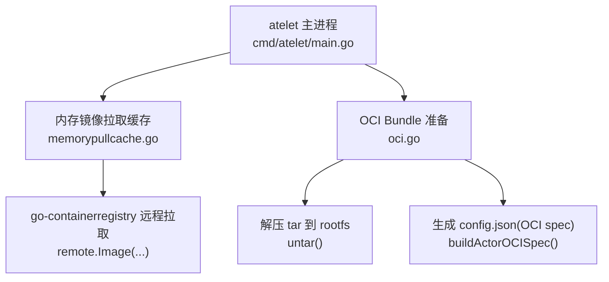
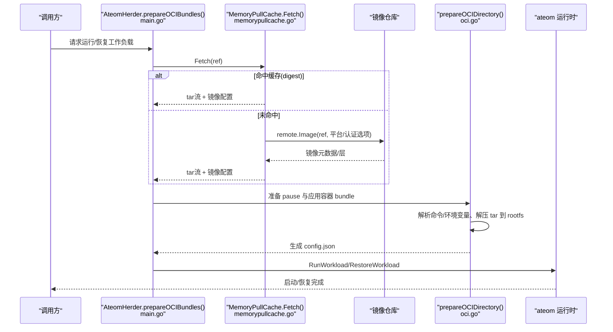
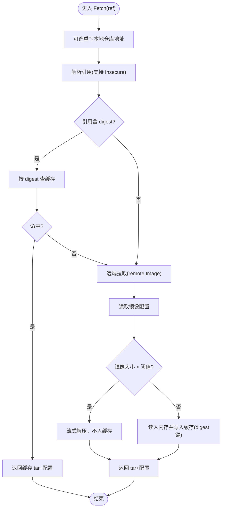
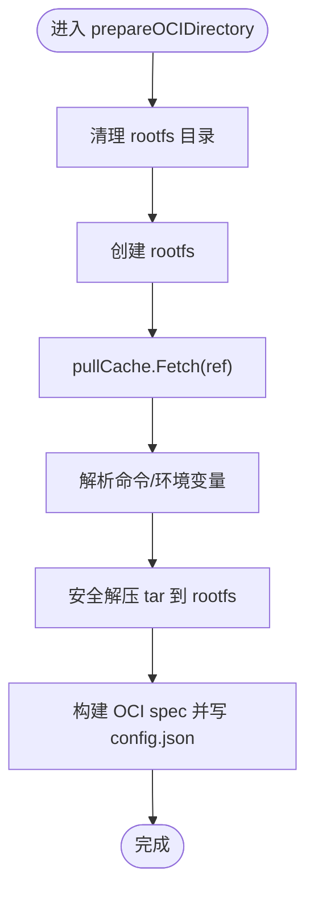
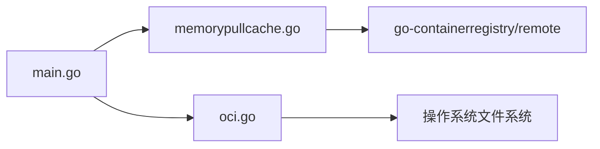

# 容器镜像问题

<cite>
**本文引用的文件**
- [cmd/atelet/main.go](file://cmd/atelet/main.go)
- [cmd/atelet/oci.go](file://cmd/atelet/oci.go)
- [cmd/atelet/internal/memorypullcache/memorypullcache.go](file://cmd/atelet/internal/memorypullcache/memorypullcache.go)
- [cmd/atelet/internal/memorypullcache/memorypullcache_test.go](file://cmd/atelet/internal/memorypullcache/memorypullcache_test.go)
- [internal/ateerrors/ateerrors.go](file://internal/ateerrors/ateerrors.go)
</cite>

## 目录
1. [简介](#简介)
2. [项目结构](#项目结构)
3. [核心组件](#核心组件)
4. [架构总览](#架构总览)
5. [详细组件分析](#详细组件分析)
6. [依赖关系分析](#依赖关系分析)
7. [性能与容量特性](#性能与容量特性)
8. [故障诊断指南](#故障诊断指南)
9. [结论](#结论)
10. [附录](#附录)

## 简介
本文件聚焦于容器镜像拉取、缓存与部署过程中的问题诊断方法，覆盖镜像仓库连接失败、认证失败、镜像损坏等典型问题的排查步骤；解释本地内存镜像缓存机制的工作原理与故障恢复策略；并提供镜像优化建议（大小优化、分层策略、预加载）、多架构镜像支持说明、私有仓库配置与安全扫描集成思路。内容基于代码库中 atelet 组件的镜像拉取与 OCI bundle 准备逻辑进行系统化梳理。

## 项目结构
与镜像拉取和部署直接相关的核心路径：
- cmd/atelet：节点侧守护进程，负责镜像拉取、OCI bundle 准备、与 ateom 交互执行工作负载
- cmd/atelet/internal/memorypullcache：内存级镜像拉取缓存实现
- internal/ateerrors：错误原因码定义，用于上层统一归因

图表来源
- [cmd/atelet/main.go:108-119](file://cmd/atelet/main.go#L108-L119)
- [cmd/atelet/internal/memorypullcache/memorypullcache.go:72-198](file://cmd/atelet/internal/memorypullcache/memorypullcache.go#L72-L198)
- [cmd/atelet/oci.go:60-116](file://cmd/atelet/oci.go#L60-L116)

章节来源
- [cmd/atelet/main.go:108-119](file://cmd/atelet/main.go#L108-L119)
- [cmd/atelet/internal/memorypullcache/memorypullcache.go:72-198](file://cmd/atelet/internal/memorypullcache/memorypullcache.go#L72-L198)
- [cmd/atelet/oci.go:60-116](file://cmd/atelet/oci.go#L60-L116)

## 核心组件
- 内存镜像拉取缓存 MemoryPullCache
  - 职责：按镜像引用解析、命中 LRU 缓存、必要时从远端仓库拉取并解压为 tar 流返回，同时返回镜像配置对象
  - 关键行为：
    - 支持本地/回环地址仓库的 HTTP 拉取（Insecure）
    - 对 GCR/PKG.dev 自动附加应用默认凭据
    - 仅当镜像体积小于阈值时入内存缓存，否则走流式解压不缓存
    - 支持以 digest 引用作为缓存键，兼容多架构场景
- OCI Bundle 准备 prepareOCIDirectory
  - 职责：调用缓存获取镜像 tar 与配置，校验并解析命令与环境变量，解压到 rootfs，生成 OCI runtime spec 并落盘
- 错误归因 ateerrors.Reason*
  - 职责：为不同阶段错误提供可观测的原因码，便于上层判定是否应触发“崩溃”或重试

章节来源
- [cmd/atelet/internal/memorypullcache/memorypullcache.go:35-70](file://cmd/atelet/internal/memorypullcache/memorypullcache.go#L35-L70)
- [cmd/atelet/internal/memorypullcache/memorypullcache.go:72-198](file://cmd/atelet/internal/memorypullcache/memorypullcache.go#L72-L198)
- [cmd/atelet/oci.go:60-116](file://cmd/atelet/oci.go#L60-L116)
- [internal/ateerrors/ateerrors.go:44-44](file://internal/ateerrors/ateerrors.go#L44-L44)

## 架构总览
镜像拉取与部署的关键流程如下：

图表来源
- [cmd/atelet/main.go:645-753](file://cmd/atelet/main.go#L645-L753)
- [cmd/atelet/internal/memorypullcache/memorypullcache.go:72-198](file://cmd/atelet/internal/memorypullcache/memorypullcache.go#L72-L198)
- [cmd/atelet/oci.go:60-116](file://cmd/atelet/oci.go#L60-L116)

## 详细组件分析

### 内存镜像拉取缓存 MemoryPullCache
- 设计要点
  - 使用 LRU 缓存条目数上限（固定数量），而非总字节数上限
  - 仅当镜像大小小于阈值时才将完整 tar 放入内存缓存，否则直接流式解压
  - 针对 gcr.io/.gcr.io/pkg.dev/.pkg.dev 自动附加 GCP 应用默认凭据
  - 本地/回环地址允许 Insecure 拉取，便于 kind 开发环境
  - 若引用包含 digest，则以该 digest 作为缓存键，避免多架构导致 key 不一致
- 关键路径
  - 解析引用与本地仓库识别
  - 缓存命中/未命中分支
  - 远端拉取与平台选择
  - 大镜像跳过缓存
  - 写入缓存（digest 键）

图表来源
- [cmd/atelet/internal/memorypullcache/memorypullcache.go:72-198](file://cmd/atelet/internal/memorypullcache/memorypullcache.go#L72-L198)

章节来源
- [cmd/atelet/internal/memorypullcache/memorypullcache.go:72-198](file://cmd/atelet/internal/memorypullcache/memorypullcache.go#L72-L198)
- [cmd/atelet/internal/memorypullcache/memorypullcache_test.go:21-84](file://cmd/atelet/internal/memorypullcache/memorypullcache_test.go#L21-L84)

### OCI Bundle 准备 prepareOCIDirectory
- 职责
  - 清理并创建 rootfs 目录
  - 通过缓存获取镜像 tar 与配置
  - 解析最终命令行与环境变量（遵循 Pod 语义）
  - 安全解压 tar 到 rootfs（防越界、处理重复项、权限恢复）
  - 生成 OCI runtime spec 并写入 config.json
- 关键点
  - 若未指定 ENTRYPOINT/CMD 且模板也未设置 command/args，则视为无效容器配置
  - 解压过程使用 os.Root 限制在 rootfs 内，防止恶意符号链接逃逸
  - 目录权限在解压后按镜像定义恢复

图表来源
- [cmd/atelet/oci.go:60-116](file://cmd/atelet/oci.go#L60-L116)
- [cmd/atelet/oci.go:150-175](file://cmd/atelet/oci.go#L150-L175)
- [cmd/atelet/oci.go:338-493](file://cmd/atelet/oci.go#L338-L493)

章节来源
- [cmd/atelet/oci.go:60-116](file://cmd/atelet/oci.go#L60-L116)
- [cmd/atelet/oci.go:150-175](file://cmd/atelet/oci.go#L150-L175)
- [cmd/atelet/oci.go:338-493](file://cmd/atelet/oci.go#L338-L493)

### 启动与初始化（GCP 认证与缓存构造）
- 启动时根据参数决定是否启用 GCP 应用默认凭据
- 构造内存镜像拉取缓存实例，传入本地仓库替换目标与认证器
- 后续 prepareOCIBundles 并行准备 pause 与应用容器的 bundle

章节来源
- [cmd/atelet/main.go:108-119](file://cmd/atelet/main.go#L108-L119)
- [cmd/atelet/main.go:645-753](file://cmd/atelet/main.go#L645-L753)

## 依赖关系分析
- 组件耦合
  - main.go 依赖 memorypullcache 与 oci.go 协作完成镜像拉取与 bundle 准备
  - memorypullcache 依赖 go-containerregistry 的 remote 包访问镜像仓库
  - oci.go 依赖 memorypullcache 提供的 tar 流与镜像配置
- 外部依赖
  - go-containerregistry：镜像解析、认证、拉取、解压
  - 操作系统文件系统：tar 解压、权限管理、符号链接处理
- 潜在循环依赖
  - 当前无循环依赖迹象，职责边界清晰

图表来源
- [cmd/atelet/main.go:108-119](file://cmd/atelet/main.go#L108-L119)
- [cmd/atelet/internal/memorypullcache/memorypullcache.go:129-152](file://cmd/atelet/internal/memorypullcache/memorypullcache.go#L129-L152)
- [cmd/atelet/oci.go:60-116](file://cmd/atelet/oci.go#L60-L116)

章节来源
- [cmd/atelet/main.go:108-119](file://cmd/atelet/main.go#L108-L119)
- [cmd/atelet/internal/memorypullcache/memorypullcache.go:129-152](file://cmd/atelet/internal/memorypullcache/memorypullcache.go#L129-L152)
- [cmd/atelet/oci.go:60-116](file://cmd/atelet/oci.go#L60-L116)

## 性能与容量特性
- 内存缓存
  - 采用固定条目数的 LRU，非按总字节数限流
  - 仅对小镜像（小于阈值）进行内存缓存，大镜像走流式解压
- 并发与上下文传播
  - 远端拉取传递 caller context，以便取消时中断正在进行的层下载，避免 RSS 膨胀
- 平台选择
  - 拉取时显式指定 linux 架构，确保与宿主机一致
- 指标与日志
  - 拉取命中/未命中、缓存填充、过大镜像跳过等均有日志输出，便于定位瓶颈

章节来源
- [cmd/atelet/internal/memorypullcache/memorypullcache.go:50-70](file://cmd/atelet/internal/memorypullcache/memorypullcache.go#L50-L70)
- [cmd/atelet/internal/memorypullcache/memorypullcache.go:129-140](file://cmd/atelet/internal/memorypullcache/memorypullcache.go#L129-L140)
- [cmd/atelet/internal/memorypullcache/memorypullcache.go:166-173](file://cmd/atelet/internal/memorypullcache/memorypullcache.go#L166-L173)

## 故障诊断指南

### 一、镜像仓库连接失败
常见现象
- 拉取超时、DNS 解析失败、TLS 握手失败
- 本地仓库无法访问（kind 环境下）

排查步骤
- 确认网络连通性与 DNS 解析
- 检查是否为本地/回环地址仓库，是否需要开启 Insecure 模式
- 若使用 kind，确认已配置本地仓库替换地址
- 查看日志中的“Cache miss”、“in remote.Image”等关键字段

相关实现参考
- 本地仓库识别与 Insecure 选项
- 本地仓库地址重写
- 远端拉取错误包装

章节来源
- [cmd/atelet/internal/memorypullcache/memorypullcache.go:85-95](file://cmd/atelet/internal/memorypullcache/memorypullcache.go#L85-L95)
- [cmd/atelet/internal/memorypullcache/memorypullcache.go:223-235](file://cmd/atelet/internal/memorypullcache/memorypullcache.go#L223-L235)
- [cmd/atelet/internal/memorypullcache/memorypullcache.go:149-152](file://cmd/atelet/internal/memorypullcache/memorypullcache.go#L149-L152)

### 二、认证失败
常见现象
- 401/403 响应
- GCR/PKG.dev 访问被拒绝

排查步骤
- 确认是否启用了 GCP 应用默认凭据
- 验证工作负载身份或 ADC 配置是否正确
- 检查仓库权限绑定与 IAM 策略
- 观察日志中是否出现认证器创建失败的致命错误

相关实现参考
- 启动时按需创建 GCP 认证器
- 针对特定域名自动附加认证器

章节来源
- [cmd/atelet/main.go:108-114](file://cmd/atelet/main.go#L108-L114)
- [cmd/atelet/internal/memorypullcache/memorypullcache.go:142-147](file://cmd/atelet/internal/memorypullcache/memorypullcache.go#L142-L147)

### 三、镜像损坏或不可用
常见现象
- 拉取成功但解压失败
- 缺少必要文件或权限异常
- 镜像配置缺失导致无法确定入口命令

排查步骤
- 校验镜像完整性（digest 对比）
- 检查镜像是否包含有效的 ENTRYPOINT/CMD 或模板是否提供了 command/args
- 关注解压阶段的错误信息（如非法 tar 条目、权限问题）
- 对于大镜像，确认是否因超过阈值而跳过缓存导致 I/O 压力增大

相关实现参考
- 无效容器配置的错误原因码
- tar 解压的安全校验与权限恢复
- 大镜像跳过缓存的日志

章节来源
- [cmd/atelet/oci.go:150-175](file://cmd/atelet/oci.go#L150-L175)
- [cmd/atelet/oci.go:338-493](file://cmd/atelet/oci.go#L338-L493)
- [cmd/atelet/internal/memorypullcache/memorypullcache.go:166-173](file://cmd/atelet/internal/memorypullcache/memorypullcache.go#L166-L173)
- [internal/ateerrors/ateerrors.go:44-44](file://internal/ateerrors/ateerrors.go#L44-L44)

### 四、本地镜像缓存机制工作原理与故障恢复
工作原理
- 首次拉取（未命中）：解析引用、远端拉取、读取配置、判断大小、解压 tar
- 小镜像：将 tar 与配置写入 LRU 缓存（以 digest 为键）
- 后续命中：直接从内存返回 tar 与配置，避免网络与磁盘 I/O
- 大镜像：直接流式解压，不入缓存，降低内存占用

故障恢复
- 缓存失效：重启 atelet 会清空内存缓存，下次拉取重新填充
- 大镜像频繁拉取：考虑镜像瘦身或引入共享缓存层（如 GCS 二级缓存）
- 多架构镜像：确保以 digest 引用，避免 tag 导致的缓存键不一致

章节来源
- [cmd/atelet/internal/memorypullcache/memorypullcache.go:97-117](file://cmd/atelet/internal/memorypullcache/memorypullcache.go#L97-L117)
- [cmd/atelet/internal/memorypullcache/memorypullcache.go:166-198](file://cmd/atelet/internal/memorypullcache/memorypullcache.go#L166-L198)

### 五、镜像优化建议
- 镜像大小优化
  - 精简基础镜像、合并 RUN 指令、移除无用依赖
  - 利用多阶段构建，仅保留运行期所需文件
- 分层策略
  - 将稳定层与易变层分离，提升缓存命中率
  - 将依赖安装与业务代码分层，减少重建范围
- 预加载技术
  - 使用 digest 引用，配合本地缓存加速二次拉起
  - 对常用小镜像预热，缩短冷启动时间
- 多架构镜像支持
  - 构建 multi-arch manifest，运行时按平台选择具体镜像
  - 使用 digest 作为缓存键，避免多架构导致的键冲突
- 私有仓库配置
  - 本地/回环仓库：启用 Insecure 模式或使用仓库替换
  - GCR/PKG.dev：启用 GCP 应用默认凭据
- 安全扫描集成
  - 在 CI/CD 流水线中集成镜像扫描工具，阻断高危漏洞镜像
  - 结合签名与校验（如 cosign），确保镜像完整性与来源可信

[本节为通用指导，无需源码引用]

## 结论
本系统通过内存级镜像拉取缓存与安全的 OCI bundle 准备流程，实现了高效、可控的镜像拉取与部署能力。针对连接失败、认证失败、镜像损坏等问题，可通过日志与错误原因码快速定位根因。结合镜像优化与多架构支持，可在保证安全性的前提下显著提升启动性能与稳定性。

[本节为总结性内容，无需源码引用]

## 附录

### 关键错误原因码与使用位置
- 终端文件系统错误：用于指示本地磁盘/文件系统层面的不可恢复错误
- 无效容器配置：当镜像与模板均未提供有效命令时触发
- 外部对象获取失败：用于标识远端对象存储拉取失败

章节来源
- [internal/ateerrors/ateerrors.go:44-44](file://internal/ateerrors/ateerrors.go#L44-L44)
- [cmd/atelet/oci.go:150-175](file://cmd/atelet/oci.go#L150-L175)
