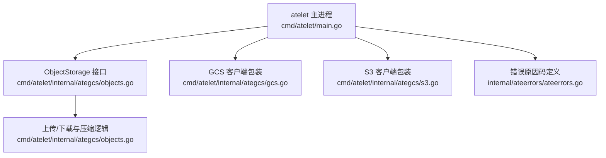
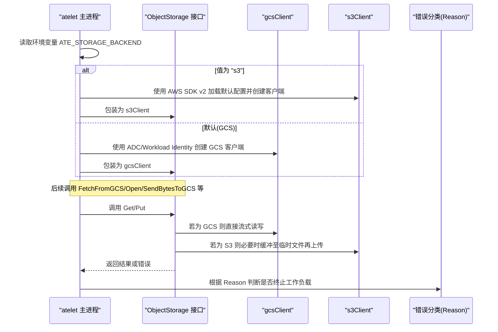
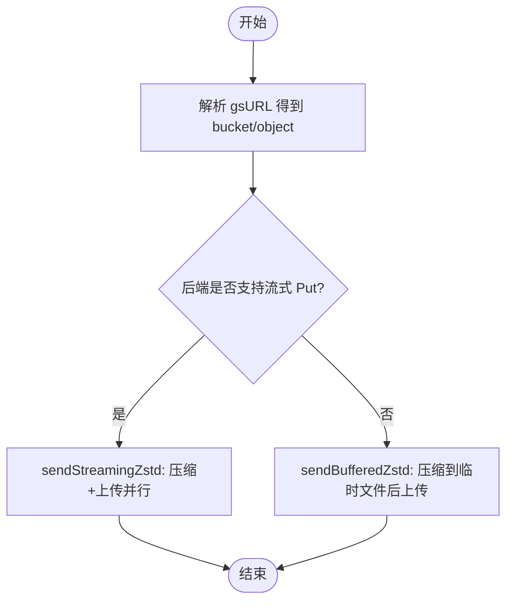
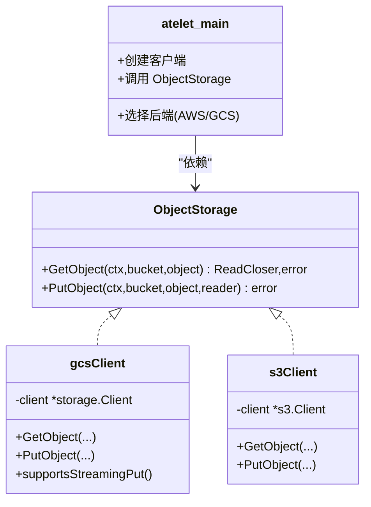

# 对象存储问题

<cite>
**本文引用的文件**
- [cmd/atelet/main.go](file://cmd/atelet/main.go)
- [cmd/atelet/internal/ategcs/gcs.go](file://cmd/atelet/internal/ategcs/gcs.go)
- [cmd/atelet/internal/ategcs/s3.go](file://cmd/atelet/internal/ategcs/s3.go)
- [cmd/atelet/internal/ategcs/objects.go](file://cmd/atelet/internal/ategcs/objects.go)
- [internal/ateerrors/ateerrors.go](file://internal/ateerrors/ateerrors.go)
</cite>

## 目录
1. [简介](#简介)
2. [项目结构](#项目结构)
3. [核心组件](#核心组件)
4. [架构总览](#架构总览)
5. [详细组件分析](#详细组件分析)
6. [依赖关系分析](#依赖关系分析)
7. [性能与容量特性](#性能与容量特性)
8. [故障排查指南](#故障排查指南)
9. [结论](#结论)
10. [附录：配置与环境变量清单](#附录配置与环境变量清单)

## 简介
本文面向在生产环境中使用本项目的用户，聚焦于对象存储（Google Cloud Storage、AWS S3）连接与配置的排障方法。内容涵盖认证配置验证、权限检查、网络连接测试，以及存储空间不足、配额限制、网络超时等常见错误的定位与解决思路；同时给出 GCS 与 S3 的特定配置要求与安全相关问题的处理方法（如存储桶策略、IAM 权限、VPC 网络）。

## 项目结构
与对象存储相关的代码主要位于 atelet 进程及其内部 ategcs 包中：
- atelet 主程序负责根据环境变量选择后端（GCS 或 S3），并初始化对应的 SDK 客户端。
- ategcs 包提供统一的 ObjectStorage 接口，分别由 gcsClient 和 s3Client 实现，封装 Get/Put 操作及上传下载流程。
- ateerrors 包定义错误原因码，用于上层对失败进行分类与决策（例如是否应终止工作负载）。

图表来源
- [cmd/atelet/main.go:126-161](file://cmd/atelet/main.go#L126-L161)
- [cmd/atelet/internal/ategcs/objects.go:37-40](file://cmd/atelet/internal/ategcs/objects.go#L37-L40)
- [cmd/atelet/internal/ategcs/gcs.go:27-66](file://cmd/atelet/internal/ategcs/gcs.go#L27-L66)
- [cmd/atelet/internal/ategcs/s3.go:29-58](file://cmd/atelet/internal/ategcs/s3.go#L29-L58)
- [internal/ateerrors/ateerrors.go:44-55](file://internal/ateerrors/ateerrors.go#L44-L55)

章节来源
- [cmd/atelet/main.go:126-161](file://cmd/atelet/main.go#L126-L161)
- [cmd/atelet/internal/ategcs/objects.go:37-40](file://cmd/atelet/internal/ategcs/objects.go#L37-L40)
- [cmd/atelet/internal/ategcs/gcs.go:27-66](file://cmd/atelet/internal/ategcs/gcs.go#L27-L66)
- [cmd/atelet/internal/ategcs/s3.go:29-58](file://cmd/atelet/internal/ategcs/s3.go#L29-L58)
- [internal/ateerrors/ateerrors.go:44-55](file://internal/ateerrors/ateerrors.go#L44-L55)

## 核心组件
- ObjectStorage 接口：统一抽象 GetObject/PutObject，屏蔽 GCS/S3 差异。
- gcsClient：基于 cloud.google.com/go/storage，支持流式 Put（无需 seekable body）。
- s3Client：基于 aws-sdk-go-v2/service/s3，Put 需要 seekable body，因此上层在发送前会缓冲到临时文件。
- 上传/下载管线：包含 zstd 压缩、稀疏写入、并发上传/下载、URL 解析等。
- 错误分类：通过 Reason 标记失败类型，便于上层判定是否应终止工作负载。

章节来源
- [cmd/atelet/internal/ategcs/objects.go:37-40](file://cmd/atelet/internal/ategcs/objects.go#L37-L40)
- [cmd/atelet/internal/ategcs/gcs.go:27-66](file://cmd/atelet/internal/ategcs/gcs.go#L27-L66)
- [cmd/atelet/internal/ategcs/s3.go:29-58](file://cmd/atelet/internal/ategcs/s3.go#L29-L58)
- [cmd/atelet/internal/ategcs/objects.go:156-251](file://cmd/atelet/internal/ategcs/objects.go#L156-L251)
- [internal/ateerrors/ateerrors.go:44-55](file://internal/ateerrors/ateerrors.go#L44-L55)

## 架构总览
下图展示了从 atelet 启动到对象存储读写的整体流程，包括后端选择、客户端创建、上传/下载路径与错误分类。

图表来源
- [cmd/atelet/main.go:126-161](file://cmd/atelet/main.go#L126-L161)
- [cmd/atelet/internal/ategcs/objects.go:42-93](file://cmd/atelet/internal/ategcs/objects.go#L42-L93)
- [cmd/atelet/internal/ategcs/gcs.go:35-66](file://cmd/atelet/internal/ategcs/gcs.go#L35-L66)
- [cmd/atelet/internal/ategcs/s3.go:37-58](file://cmd/atelet/internal/ategcs/s3.go#L37-L58)
- [internal/ateerrors/ateerrors.go:44-55](file://internal/ateerrors/ateerrors.go#L44-L55)

## 详细组件分析

### 组件一：后端选择与客户端初始化
- 环境变量 ATE_STORAGE_BACKEND 决定后端：
  - 设置为 "s3" 时，使用 AWS SDK v2 的 config.LoadDefaultConfig 加载标准 AWS 环境变量（如 AK/SK、Region、Endpoint 等），并可启用 UsePathStyle。
  - 未设置或为其他值时，默认使用 GCS，通过 ADC/Workload Identity 自动获取凭据。
- 匿名 GCS 客户端也会创建，用于公开只读场景（不影响鉴权路径）。

章节来源
- [cmd/atelet/main.go:126-161](file://cmd/atelet/main.go#L126-L161)

### 组件二：GCS 客户端实现
- GetObject：当目标对象或桶不存在时，将底层错误转换为统一的“获取外部对象失败”原因码，便于上层归类。
- PutObject：支持流式写入，无需 seekable body，适合与压缩管道直连以提升吞吐。

章节来源
- [cmd/atelet/internal/ategcs/gcs.go:35-66](file://cmd/atelet/internal/ategcs/gcs.go#L35-L66)

### 组件三：S3 客户端实现
- GetObject：当 NoSuchKey 时，同样转换为“获取外部对象失败”原因码。
- PutObject：SDK 需要 seekable body，因此上层在发送前会将数据压缩到临时文件后再上传。

章节来源
- [cmd/atelet/internal/ategcs/s3.go:37-58](file://cmd/atelet/internal/ategcs/s3.go#L37-L58)

### 组件四：上传/下载与压缩管线
- URL 解析：统一以 gsURL 形式解析出 bucket 与 object。
- 小对象上传：SendBytesToGCS 直接 Put。
- 大对象上传：SendLocalFileToGCSWithZstd 先 zstd 压缩，再根据后端能力选择：
  - 流式后端（GCS）：sendStreamingZstd，边压缩边上传，避免落盘。
  - 非流式后端（S3/rustfs）：sendBufferedZstd，先压缩到临时文件，再 Put。
- 下载：FetchFromGCS/FetchLocalFileFromGCSWithZstd 支持稀疏格式与纯 zstd 流，自动识别并解压。

图表来源
- [cmd/atelet/internal/ategcs/objects.go:156-251](file://cmd/atelet/internal/ategcs/objects.go#L156-L251)
- [cmd/atelet/internal/ategcs/objects.go:446-453](file://cmd/atelet/internal/ategcs/objects.go#L446-L453)

章节来源
- [cmd/atelet/internal/ategcs/objects.go:42-93](file://cmd/atelet/internal/ategcs/objects.go#L42-L93)
- [cmd/atelet/internal/ategcs/objects.go:95-118](file://cmd/atelet/internal/ategcs/objects.go#L95-L118)
- [cmd/atelet/internal/ategcs/objects.go:156-251](file://cmd/atelet/internal/ategcs/objects.go#L156-L251)
- [cmd/atelet/internal/ategcs/objects.go:270-328](file://cmd/atelet/internal/ategcs/objects.go#L270-L328)
- [cmd/atelet/internal/ategcs/objects.go:446-453](file://cmd/atelet/internal/ategcs/objects.go#L446-L453)

### 组件五：错误分类与可观测性
- 错误原因码：INVALID_OBJECT_URL、FAILED_GET_EXTERNAL_OBJECT、FAILED_SAVE_SNAPSHOT 等，用于上层区分非法参数、对象不可用、保存快照失败等。
- CrashIfReason：当错误链中包含指定 Reason 时，包装为 DataLoss 并附带“需终止工作负载”的元信息，供控制面决策。

章节来源
- [internal/ateerrors/ateerrors.go:44-55](file://internal/ateerrors/ateerrors.go#L44-L55)
- [internal/ateerrors/ateerrors.go:101-111](file://internal/ateerrors/ateerrors.go#L101-L111)

## 依赖关系分析
- atelet 主进程依赖 ategcs.ObjectStorage 抽象，运行时注入 gcsClient 或 s3Client。
- ategcs 包依赖云厂商 SDK：cloud.google.com/go/storage 与 github.com/aws/aws-sdk-go-v2/service/s3。
- 错误分类依赖 ateerrors 提供的 Reason 与 gRPC 状态包装。

图表来源
- [cmd/atelet/internal/ategcs/objects.go:37-40](file://cmd/atelet/internal/ategcs/objects.go#L37-L40)
- [cmd/atelet/internal/ategcs/gcs.go:27-66](file://cmd/atelet/internal/ategcs/gcs.go#L27-L66)
- [cmd/atelet/internal/ategcs/s3.go:29-58](file://cmd/atelet/internal/ategcs/s3.go#L29-L58)
- [cmd/atelet/main.go:126-161](file://cmd/atelet/main.go#L126-L161)

章节来源
- [cmd/atelet/internal/ategcs/objects.go:37-40](file://cmd/atelet/internal/ategcs/objects.go#L37-L40)
- [cmd/atelet/internal/ategcs/gcs.go:27-66](file://cmd/atelet/internal/ategcs/gcs.go#L27-L66)
- [cmd/atelet/internal/ategcs/s3.go:29-58](file://cmd/atelet/internal/ategcs/s3.go#L29-L58)
- [cmd/atelet/main.go:126-161](file://cmd/atelet/main.go#L126-L161)

## 性能与容量特性
- 压缩与稀疏写入：上传采用 zstd（SpeedFastest，多核并行），下载支持稀疏格式，减少磁盘占用与 I/O。
- 流式 vs 缓冲：GCS 支持流式 Put，避免中间文件；S3 需要缓冲到临时文件，增加磁盘压力但保证签名与 Content-Length。
- 并发：上传/下载均按文件并发执行，提升吞吐。

章节来源
- [cmd/atelet/internal/ategcs/objects.go:156-251](file://cmd/atelet/internal/ategcs/objects.go#L156-L251)
- [cmd/atelet/internal/ategcs/objects.go:270-328](file://cmd/atelet/internal/ategcs/objects.go#L270-L328)

## 故障排查指南

### 通用诊断步骤
- 确认后端选择：检查环境变量 ATE_STORAGE_BACKEND 是否为 "s3" 或未设置（默认 GCS）。
- 查看日志：关注“Failed to load S3 config”、“Failed to create GCS client”、“while getting object”、“while putting object”等关键日志位置。
- 校验 URL：确保 gsURL 格式正确，能解析出 bucket 与 object。

章节来源
- [cmd/atelet/main.go:126-161](file://cmd/atelet/main.go#L126-L161)
- [cmd/atelet/internal/ategcs/objects.go:42-93](file://cmd/atelet/internal/ategcs/objects.go#L42-L93)

### 认证配置验证
- GCS（默认）：
  - 运行环境需具备有效的 ADC 或 Workload Identity，以便 storage.NewClient 成功创建客户端。
  - 若无法创建客户端，通常意味着缺少有效凭据或所在环境未正确绑定身份。
- S3：
  - 使用 AWS SDK v2 的默认配置加载器，会从标准环境变量读取 AK/SK、Region、Endpoint 等。
  - 如需兼容某些 S3 兼容服务，可通过 AWS_S3_USE_PATH_STYLE=true 启用路径风格。

章节来源
- [cmd/atelet/main.go:126-161](file://cmd/atelet/main.go#L126-L161)

### 权限检查
- GCS：
  - 读取对象失败且错误被包装为“获取外部对象失败”，可能由于对象不存在或缺少读取权限。
  - 写入对象失败可能是缺少写入权限或桶策略拒绝。
- S3：
  - NoSuchKey 会被包装为“获取外部对象失败”。
  - PutObject 失败可能由于缺少 Put 权限或桶策略限制。

章节来源
- [cmd/atelet/internal/ategcs/gcs.go:35-44](file://cmd/atelet/internal/ategcs/gcs.go#L35-L44)
- [cmd/atelet/internal/ategcs/s3.go:37-49](file://cmd/atelet/internal/ategcs/s3.go#L37-L49)
- [internal/ateerrors/ateerrors.go:44-55](file://internal/ateerrors/ateerrors.go#L44-L55)

### 网络连接测试
- 若客户端创建失败或请求报网络错误，优先检查：
  - DNS 解析与出口 IP 白名单。
  - VPC 出站规则、NAT/代理配置。
  - 防火墙与安全组是否放行对应端口。
- 对于 S3 兼容服务，确认 Endpoint 与 UsePathStyle 设置正确。

章节来源
- [cmd/atelet/main.go:126-161](file://cmd/atelet/main.go#L126-L161)

### 存储空间不足与配额限制
- 现象：PutObject 失败，可能伴随服务端返回容量或配额错误。
- 处理：
  - 扩容桶空间或调整配额。
  - 降低并发或分批上传，避免瞬时峰值触发限流。
  - 监控指标与日志中的上传耗时与大小，评估是否需要优化压缩率或分片策略。

章节来源
- [cmd/atelet/internal/ategcs/objects.go:156-251](file://cmd/atelet/internal/ategcs/objects.go#L156-L251)

### 网络超时与重试
- 现象：Get/Put 过程中出现超时或中断。
- 处理：
  - 检查网络稳定性与带宽。
  - 适当增大超时与重试策略（由 SDK 层控制）。
  - 观察日志中的压缩与上传总耗时，定位瓶颈。

章节来源
- [cmd/atelet/internal/ategcs/objects.go:156-251](file://cmd/atelet/internal/ategcs/objects.go#L156-L251)

### 不同云服务商的特定配置与排错要点
- Google Cloud Storage（GCS）
  - 认证：ADC/Workload Identity 必须可用。
  - 权限：至少授予读取/写入相应桶与对象的权限；检查桶策略与 IAM。
  - URL：gsURL 需符合 Host/Path 规范。
- AWS S3
  - 认证：标准环境变量（AK/SK、Region、Endpoint 等）需正确设置。
  - 兼容模式：UsePathStyle=true 适用于部分 S3 兼容服务。
  - 权限：授予 GetObject/PutObject 所需的最小权限；检查桶策略与 IAM。

章节来源
- [cmd/atelet/main.go:126-161](file://cmd/atelet/main.go#L126-L161)
- [cmd/atelet/internal/ategcs/gcs.go:35-66](file://cmd/atelet/internal/ategcs/gcs.go#L35-L66)
- [cmd/atelet/internal/ategcs/s3.go:37-58](file://cmd/atelet/internal/ategcs/s3.go#L37-L58)

### 安全相关问题（存储桶策略、IAM、VPC）
- 存储桶策略：
  - 确保允许来自运行 atelet 的节点或服务账号访问。
  - 针对只读场景可使用匿名客户端（仅读取公开对象）。
- IAM 权限：
  - 遵循最小权限原则，仅授予必要操作。
  - 定期审计与回收过期权限。
- VPC 网络：
  - 确保出站流量可达云服务 API 端点。
  - 若使用私有端点或代理，需在 SDK 配置中正确设置 Endpoint 与证书。

章节来源
- [cmd/atelet/main.go:126-161](file://cmd/atelet/main.go#L126-L161)

## 结论
通过统一 ObjectStorage 抽象与明确的错误分类，项目在 GCS 与 S3 上提供了稳定一致的对象存储能力。排障时应优先确认后端选择与认证配置，其次检查权限与网络连通性，最后结合日志与指标定位容量与性能问题。针对不同云服务商的差异（如流式 Put、路径风格、环境变量），按需调整配置与策略，可有效降低故障率并提升系统可靠性。

## 附录：配置与环境变量清单
- ATE_STORAGE_BACKEND
  - 作用：选择对象存储后端。
  - 取值："s3" 或留空（默认 GCS）。
- AWS_S3_USE_PATH_STYLE
  - 作用：S3 兼容模式下启用路径风格。
  - 取值："true"/"false"。
- AWS SDK 标准环境变量（仅在 S3 模式下生效）
  - AWS_ACCESS_KEY_ID、AWS_SECRET_ACCESS_KEY、AWS_REGION、AWS_DEFAULT_REGION、AWS_ENDPOINT_URL 等。

章节来源
- [cmd/atelet/main.go:126-161](file://cmd/atelet/main.go#L126-L161)
