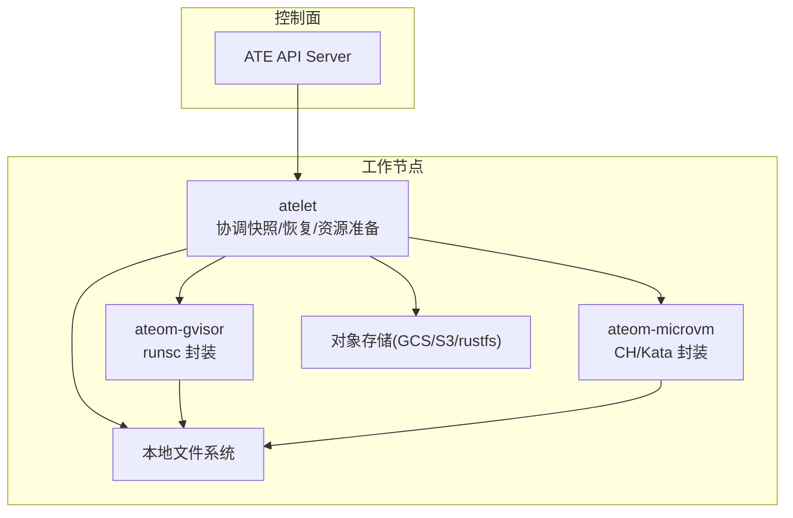
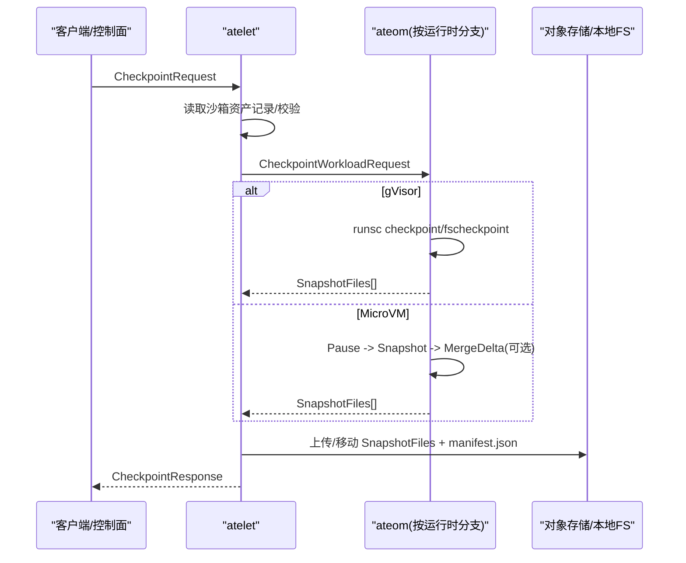
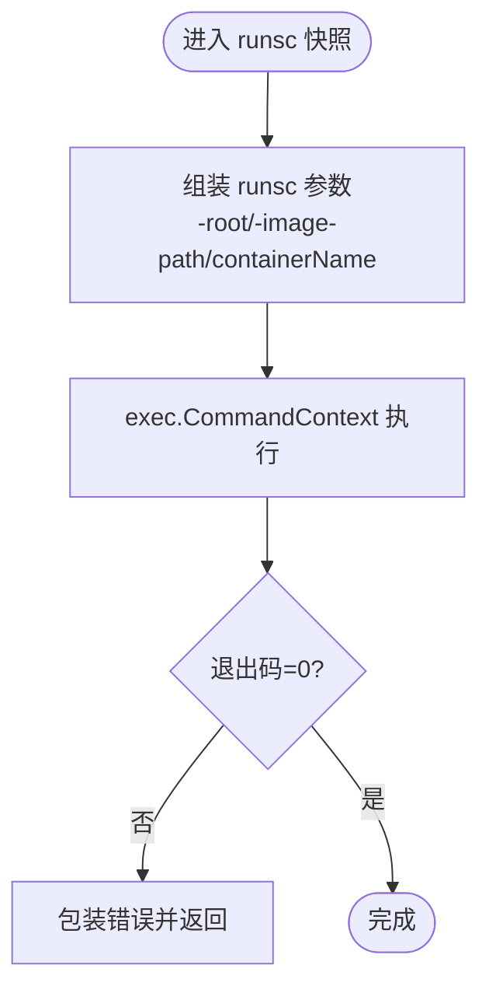
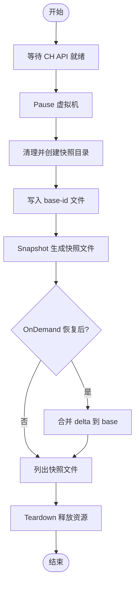
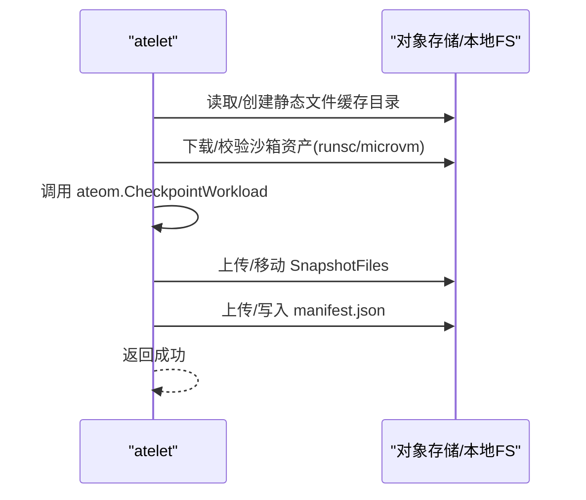
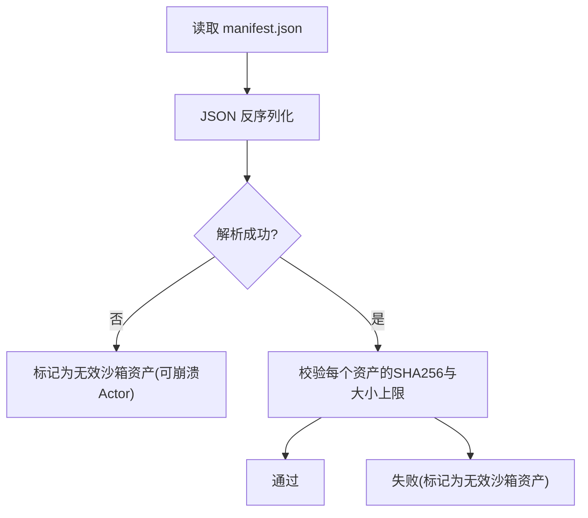
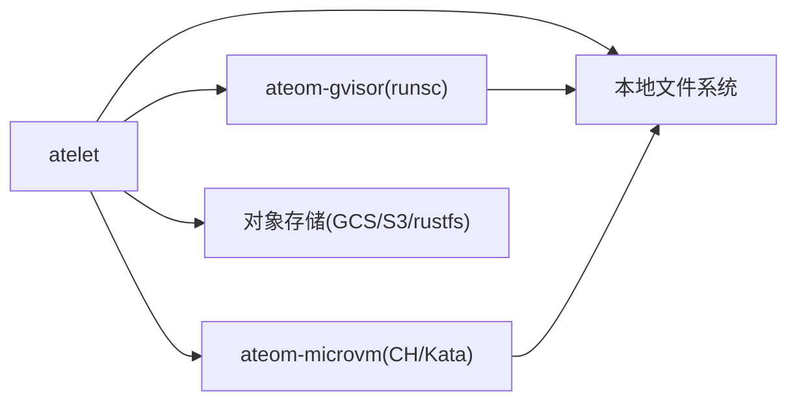

# 快照创建失败

<cite>
**本文引用的文件**   
- [cmd/atelet/main.go](file://cmd/atelet/main.go)
- [cmd/atelet/sandbox_assets.go](file://cmd/atelet/sandbox_assets.go)
- [cmd/ateom-gvisor/runsc.go](file://cmd/ateom-gvisor/runsc.go)
- [cmd/ateom-microvm/checkpoint.go](file://cmd/ateom-microvm/checkpoint.go)
- [cmd/ateom-microvm/restore.go](file://cmd/ateom-microvm/restore.go)
- [internal/ateerrors/ateerrors.go](file://internal/ateerrors/ateerrors.go)
</cite>

## 目录
1. [简介](#简介)
2. [项目结构](#项目结构)
3. [核心组件](#核心组件)
4. [架构总览](#架构总览)
5. [详细组件分析](#详细组件分析)
6. [依赖关系分析](#依赖关系分析)
7. [性能与容量特性](#性能与容量特性)
8. [故障诊断指南](#故障诊断指南)
9. [结论](#结论)
10. [附录：错误码与原因枚举](#附录错误码与原因枚举)

## 简介
本文聚焦于“快照创建”流程中可能出现的各类失败场景及其诊断方法，覆盖内存转储失败、文件系统快照中断、权限不足、存储空间不足等根因分析与解决方案；提供具体的错误日志分析方法与调试技巧，并针对 gVisor 与 MicroVM 两种运行时环境给出特定问题处理建议；同时解释快照格式验证失败的常见原因与修复步骤。

## 项目结构
本仓库中与快照创建相关的关键路径包括：
- atelet（工作节点侧服务）：协调快照生命周期、对象存储上传/下载、OCI bundle 准备、调用 ateom 执行具体运行时快照。
- ateom-gvisor：基于 runsc 的 gVisor 运行时封装，负责 checkpoint/fscheckpoint/restore 等命令编排。
- ateom-microvm：基于 Cloud Hypervisor + Kata Agent 的微虚拟机运行时封装，负责 pause/snapshot/merge 等流程。
- ateerrors：统一的错误分类与“是否应崩溃 Actor”的决策机制。

图表来源
- [cmd/atelet/main.go:309-380](file://cmd/atelet/main.go#L309-L380)
- [cmd/atelet/sandbox_assets.go:91-111](file://cmd/atelet/sandbox_assets.go#L91-L111)
- [cmd/ateom-gvisor/runsc.go:105-172](file://cmd/ateom-gvisor/runsc.go#L105-L172)
- [cmd/ateom-microvm/checkpoint.go:44-154](file://cmd/ateom-microvm/checkpoint.go#L44-L154)

章节来源
- [cmd/atelet/main.go:309-380](file://cmd/atelet/main.go#L309-L380)
- [cmd/atelet/sandbox_assets.go:91-111](file://cmd/atelet/sandbox_assets.go#L91-L111)
- [cmd/ateom-gvisor/runsc.go:105-172](file://cmd/ateom-gvisor/runsc.go#L105-L172)
- [cmd/ateom-microvm/checkpoint.go:44-154](file://cmd/ateom-microvm/checkpoint.go#L44-L154)

## 核心组件
- atelet 的 Checkpoint 流程：校验请求、读取运行时的沙箱资产记录、调用 ateom 执行快照、根据返回的文件列表上传或移动到本地、写入清单 manifest.json。
- atelet 的 Restore 流程：拉取清单、并发下载快照与准备 OCI bundle、调用 ateom 恢复。
- gVisor 快照：通过 runsc checkpoint/fscheckpoint 生成镜像文件，支持持久卷增量快照。
- MicroVM 快照：pause -> snapshot -> 可选合并 delta -> teardown，输出 config/state/memory-ranges/base-id 等文件。
- 错误体系：统一 Reason 枚举与 DataLoss 标记，用于指示是否需要崩溃 Actor。

章节来源
- [cmd/atelet/main.go:309-380](file://cmd/atelet/main.go#L309-L380)
- [cmd/atelet/main.go:454-583](file://cmd/atelet/main.go#L454-L583)
- [cmd/ateom-gvisor/runsc.go:105-172](file://cmd/ateom-gvisor/runsc.go#L105-L172)
- [cmd/ateom-microvm/checkpoint.go:44-154](file://cmd/ateom-microvm/checkpoint.go#L44-L154)
- [internal/ateerrors/ateerrors.go:44-55](file://internal/ateerrors/ateerrors.go#L44-L55)

## 架构总览
下图展示了快照创建端到端时序，涵盖 atelet、ateom（gVisor/MicroVM）、对象存储与本地文件系统的交互。

图表来源
- [cmd/atelet/main.go:309-380](file://cmd/atelet/main.go#L309-L380)
- [cmd/atelet/main.go:422-452](file://cmd/atelet/main.go#L422-L452)
- [cmd/ateom-gvisor/runsc.go:105-172](file://cmd/ateom-gvisor/runsc.go#L105-L172)
- [cmd/ateom-microvm/checkpoint.go:44-154](file://cmd/ateom-microvm/checkpoint.go#L44-L154)

## 详细组件分析

### gVisor 快照（runsc）
- 关键路径
  - 内存快照：runsc checkpoint，将容器内存与状态写入 image-path。
  - 持久卷快照：runsc fscheckpoint，对指定路径进行增量快照。
- 典型失败点
  - 进程级异常：runsc 子进程退出码非零。
  - 文件系统 I/O 错误：EISDIR/ENOTDIR/EROFS/权限不足等。
  - 参数不合法：缺少必要路径或容器名。
- 诊断要点
  - 检查 runsc 子进程标准输出/错误流中的 JSON 日志。
  - 确认目标目录存在且可写，路径为真实文件而非目录。
  - 若使用 fscheckpoint，确保挂载点与容器内路径一致。

图表来源
- [cmd/ateom-gvisor/runsc.go:105-172](file://cmd/ateom-gvisor/runsc.go#L105-L172)

章节来源
- [cmd/ateom-gvisor/runsc.go:105-172](file://cmd/ateom-gvisor/runsc.go#L105-L172)

### MicroVM 快照（Cloud Hypervisor + Kata）
- 关键路径
  - 等待 CH API socket 就绪。
  - Pause 虚拟机。
  - 清理并创建快照目录，写入 base-id 文件。
  - Snapshot 生成 config/state/memory-ranges 等文件。
  - 如为 OnDemand 恢复后的再次快照，需将 delta 合并到 base，形成完整快照。
  - Teardown 释放资源。
- 典型失败点
  - CH API 不可用或超时。
  - Pause 失败（内核/设备驱动不支持）。
  - 快照目录创建/写入失败（权限/只读/空间不足）。
  - 合并 delta 失败（跨文件系统回退拷贝失败）。
- 诊断要点
  - 关注 CH API 连接与暂停耗时日志。
  - 检查快照目录权限与磁盘剩余空间。
  - 确认 OnDemand 恢复源目录存在且可访问。

图表来源
- [cmd/ateom-microvm/checkpoint.go:44-154](file://cmd/ateom-microvm/checkpoint.go#L44-L154)

章节来源
- [cmd/ateom-microvm/checkpoint.go:44-154](file://cmd/ateom-microvm/checkpoint.go#L44-L154)

### atelet 快照协调与上传/移动
- 关键路径
  - 读取 on-node 的沙箱资产记录，确保 runsc 或 microvm 资产可用。
  - 调用 ateom 执行快照，获取 SnapshotFiles 列表。
  - 外部存储：并发上传 zstd 压缩后的快照文件，最后上传 manifest.json。
  - 本地存储：移动快照文件到本地目录，写入 manifest.json。
- 典型失败点
  - 沙箱资产缺失或哈希校验失败。
  - 对象存储上传失败（网络/鉴权/配额）。
  - 本地目录创建/重命名失败（权限/只读/空间不足）。
  - 清单解析失败（JSON 格式不正确）。
- 诊断要点
  - 核对 manifest.json 内容与 SnapshotFiles 一致性。
  - 监控对象存储上传并发任务错误。
  - 检查静态文件缓存目录权限与大小限制。

图表来源
- [cmd/atelet/main.go:309-380](file://cmd/atelet/main.go#L309-L380)
- [cmd/atelet/main.go:422-452](file://cmd/atelet/main.go#L422-L452)
- [cmd/atelet/sandbox_assets.go:91-111](file://cmd/atelet/sandbox_assets.go#L91-L111)

章节来源
- [cmd/atelet/main.go:309-380](file://cmd/atelet/main.go#L309-L380)
- [cmd/atelet/main.go:422-452](file://cmd/atelet/main.go#L422-L452)
- [cmd/atelet/sandbox_assets.go:91-111](file://cmd/atelet/sandbox_assets.go#L91-L111)

### 快照格式验证与清单
- 清单内容
  - sandboxClass、assets（含 URL 与 SHA256）、snapshotFiles。
- 验证逻辑
  - 读取 manifest.json 并反序列化为 sandboxAssetsRecord。
  - 校验 assets 的 SHA256 与最大体积上限。
  - 在 Restore 时依据 manifest 精确下载/复制对应文件集合。
- 常见失败
  - JSON 解析失败（格式损坏/字段缺失）。
  - SHA256 不匹配或超过大小上限。
  - 清单文件不存在或无法读取。

图表来源
- [cmd/atelet/sandbox_assets.go:235-241](file://cmd/atelet/sandbox_assets.go#L235-L241)
- [cmd/atelet/sandbox_assets.go:117-184](file://cmd/atelet/sandbox_assets.go#L117-L184)

章节来源
- [cmd/atelet/sandbox_assets.go:235-241](file://cmd/atelet/sandbox_assets.go#L235-L241)
- [cmd/atelet/sandbox_assets.go:117-184](file://cmd/atelet/sandbox_assets.go#L117-L184)

## 依赖关系分析
- atelet 依赖 ateom（gVisor/MicroVM）执行底层快照。
- atelet 依赖对象存储（GCS/S3/rustfs）与本地文件系统。
- ateom-gvisor 依赖 runsc 二进制。
- ateom-microvm 依赖 CH API 与 Kata Agent。

图表来源
- [cmd/atelet/main.go:309-380](file://cmd/atelet/main.go#L309-L380)
- [cmd/atelet/sandbox_assets.go:91-111](file://cmd/atelet/sandbox_assets.go#L91-L111)
- [cmd/ateom-gvisor/runsc.go:105-172](file://cmd/ateom-gvisor/runsc.go#L105-L172)
- [cmd/ateom-microvm/checkpoint.go:44-154](file://cmd/ateom-microvm/checkpoint.go#L44-L154)

章节来源
- [cmd/atelet/main.go:309-380](file://cmd/atelet/main.go#L309-L380)
- [cmd/atelet/sandbox_assets.go:91-111](file://cmd/atelet/sandbox_assets.go#L91-L111)
- [cmd/ateom-gvisor/runsc.go:105-172](file://cmd/ateom-gvisor/runsc.go#L105-L172)
- [cmd/ateom-microvm/checkpoint.go:44-154](file://cmd/ateom-microvm/checkpoint.go#L44-L154)

## 性能与容量特性
- 并发上传/下载：SnapshotFiles 的上传/下载采用并发 goroutine，提升吞吐。
- 大小限制：资产下载有最大字节上限，防止无界占用磁盘。
- 指标采集：记录快照文件大小直方图，便于观测分布与异常峰值。

章节来源
- [cmd/atelet/main.go:273-307](file://cmd/atelet/main.go#L273-L307)
- [cmd/atelet/sandbox_assets.go:44-46](file://cmd/atelet/sandbox_assets.go#L44-L46)
- [cmd/atelet/main.go:422-452](file://cmd/atelet/main.go#L422-L452)

## 故障诊断指南

### 通用错误分类与“是否崩溃 Actor”
- 错误原因枚举（Reason）：
  - TERMINAL_FILE_SYSTEM_ERROR：终端文件系统错误（如权限、只读、路径非法等），通常要求崩溃 Actor。
  - INVALID_SANDBOX_ASSET：沙箱资产无效（哈希不匹配、格式错误、超限等），通常要求崩溃 Actor。
  - INVALID_CHECKPOINT_RESULT：快照结果无效（例如未返回任何快照文件）。
  - FAILED_SAVE_SNAPSHOT：保存快照失败（上传/移动失败）。
  - INVALID_OBJECT_URL / FAILED_GET_EXTERNAL_OBJECT：对象存储访问失败。
  - INVALID_CONTAINER_CONFIG：容器配置不可运行。
- 决策函数：
  - CrashIfReason：当错误链包含指定的 Reason 时，转换为 DataLoss 并携带 actorCrashed=true 元数据。
  - ActorCrashRequested：从 gRPC status 的 ErrorInfo 中判断是否需要崩溃 Actor。

章节来源
- [internal/ateerrors/ateerrors.go:44-55](file://internal/ateerrors/ateerrors.go#L44-L55)
- [internal/ateerrors/ateerrors.go:101-129](file://internal/ateerrors/ateerrors.go#L101-L129)
- [cmd/atelet/main.go:350-379](file://cmd/atelet/main.go#L350-L379)

### 内存转储失败（MicroVM）
- 现象
  - Snapshot 阶段报错，或合并 delta 失败。
- 根因定位
  - CH API 不可用或超时。
  - Pause 失败（内核/设备不支持）。
  - 快照目录创建/写入失败（权限/只读/空间不足）。
  - OnDemand 恢复源目录不存在或不可读。
- 解决建议
  - 确认宿主机 KVM 与内核支持。
  - 检查快照目录权限与磁盘空间。
  - 若为 OnDemand 恢复后再快照，确保 restoreSourceDir 存在且可读。

章节来源
- [cmd/ateom-microvm/checkpoint.go:64-123](file://cmd/ateom-microvm/checkpoint.go#L64-L123)

### 文件系统快照中断（gVisor）
- 现象
  - runsc checkpoint/fscheckpoint 返回错误。
- 根因定位
  - 目标路径不是普通文件或不可写。
  - 容器内持久卷路径不一致或未正确挂载。
  - 系统调用被拒绝（权限/SELinux/AppArmor）。
- 解决建议
  - 校验 image-path 指向的目录存在且可写。
  - 对于 fscheckpoint，确保 -path 与容器内挂载点一致。
  - 检查宿主安全策略与用户权限。

章节来源
- [cmd/ateom-gvisor/runsc.go:105-172](file://cmd/ateom-gvisor/runsc.go#L105-L172)

### 权限不足
- 现象
  - 创建静态文件缓存目录失败、写入 manifest.json 失败、读取本地快照清单失败。
- 根因定位
  - 进程 UID/GID 无写权限。
  - 文件系统挂载为只读。
  - 路径过长或符号链接循环。
- 解决建议
  - 修正目录权限（至少 0700）。
  - 卸载只读挂载或切换到可写分区。
  - 避免超长路径与循环链接。

章节来源
- [cmd/atelet/sandbox_assets.go:96-101](file://cmd/atelet/sandbox_assets.go#L96-L101)
- [cmd/atelet/main.go:493-501](file://cmd/atelet/main.go#L493-L501)
- [cmd/atelet/sandbox_assets.go:250-266](file://cmd/atelet/sandbox_assets.go#L250-L266)

### 存储空间不足
- 现象
  - 临时文件创建失败、重命名失败、对象存储上传失败。
- 根因定位
  - 本地磁盘空间耗尽。
  - 对象存储配额不足或网络拥塞。
- 解决建议
  - 清理无用快照与缓存，扩容磁盘。
  - 调整并发度与重试策略，观察对象存储限流。

章节来源
- [cmd/atelet/sandbox_assets.go:151-184](file://cmd/atelet/sandbox_assets.go#L151-L184)
- [cmd/atelet/main.go:422-452](file://cmd/atelet/main.go#L422-L452)

### 快照格式验证失败
- 现象
  - 反序列化 manifest.json 失败、SHA256 不匹配、资产超过大小上限。
- 根因定位
  - 清单文件损坏或不完整。
  - 资产 URL 错误或内容被篡改。
  - 下载过程截断或网络错误。
- 解决建议
  - 重新生成并上传正确的 manifest.json。
  - 校验资产 URL 与 SHA256，确保一致。
  - 启用重试与完整性校验，必要时重新下载。

章节来源
- [cmd/atelet/sandbox_assets.go:235-241](file://cmd/atelet/sandbox_assets.go#L235-L241)
- [cmd/atelet/sandbox_assets.go:117-184](file://cmd/atelet/sandbox_assets.go#L117-L184)

### gVisor 特定问题处理
- 常见问题
  - runsc 版本与 bundle 不兼容导致 checkpoint/restore 失败。
  - 容器未定义 ENTRYPOINT/CMD 导致启动失败（INVALID_CONTAINER_CONFIG）。
- 处理建议
  - 确保 runsc 资产与镜像 bundle 一致（由 manifest 锁定）。
  - 修正容器配置，提供有效的命令行。

章节来源
- [cmd/atelet/sandbox_assets.go:91-111](file://cmd/atelet/sandbox_assets.go#L91-L111)
- [cmd/atelet/main.go:244-248](file://cmd/atelet/main.go#L244-L248)

### MicroVM 特定问题处理
- 常见问题
  - CH API 不可用或 Pause 失败。
  - OnDemand 恢复后再快照，delta 合并失败。
- 处理建议
  - 检查 KVM 与内核模块加载情况。
  - 确保 OnDemand 恢复源目录存在且可访问。
  - 查看 CH 日志与 kata-agent 连通性。

章节来源
- [cmd/ateom-microvm/checkpoint.go:64-123](file://cmd/ateom-microvm/checkpoint.go#L64-L123)
- [cmd/ateom-microvm/restore.go:84-112](file://cmd/ateom-microvm/restore.go#L84-L112)

### 日志分析与调试技巧
- atelet
  - 关注 Checkpoint/Restore 各阶段耗时日志（download/unpack/ateom_restore）。
  - 检查对象存储上传/下载并发任务的错误信息。
- gVisor
  - 查看 runsc 子进程的 JSON 日志，定位 checkpoint/fscheckpoint/restore 的具体错误。
- MicroVM
  - 关注 CH API 连接与暂停耗时、Snapshot 与 Merge 耗时。
  - 检查 base-id 文件是否存在且与预期一致。

章节来源
- [cmd/atelet/main.go:577-582](file://cmd/atelet/main.go#L577-L582)
- [cmd/ateom-gvisor/runsc.go:105-172](file://cmd/ateom-gvisor/runsc.go#L105-L172)
- [cmd/ateom-microvm/checkpoint.go:98-153](file://cmd/ateom-microvm/checkpoint.go#L98-L153)

## 结论
快照创建涉及多组件协作与多种外部依赖，失败场景主要集中在文件系统权限与空间、对象存储可用性、运行时能力与兼容性、以及快照清单完整性等方面。通过统一的错误分类与“是否崩溃 Actor”的决策机制，可以快速定位问题边界并采取相应修复措施。建议在部署与运维中强化权限与容量监控、对象存储健康检查、以及快照清单与资产完整性校验。

## 附录：错误码与原因枚举
- 原因枚举（Reason）
  - TERMINAL_FILE_SYSTEM_ERROR
  - INVALID_SANDBOX_ASSET
  - INVALID_CHECKPOINT_RESULT
  - FAILED_SAVE_SNAPSHOT
  - INVALID_OBJECT_URL
  - FAILED_GET_EXTERNAL_OBJECT
  - INVALID_CONTAINER_CONFIG
- 行为
  - NewGRPCError：构造带 ErrorInfo 的 gRPC 错误，支持附加 metadata（如 actorCrashed）。
  - CrashIfReason：当错误链包含指定 Reason 时，转换为 DataLoss 并标记需要崩溃 Actor。
  - ActorCrashRequested：从 gRPC status 的 ErrorInfo 中判断是否需要崩溃 Actor。

章节来源
- [internal/ateerrors/ateerrors.go:44-55](file://internal/ateerrors/ateerrors.go#L44-L55)
- [internal/ateerrors/ateerrors.go:68-99](file://internal/ateerrors/ateerrors.go#L68-99)
- [internal/ateerrors/ateerrors.go:101-129](file://internal/ateerrors/ateerrors.go#L101-L129)
