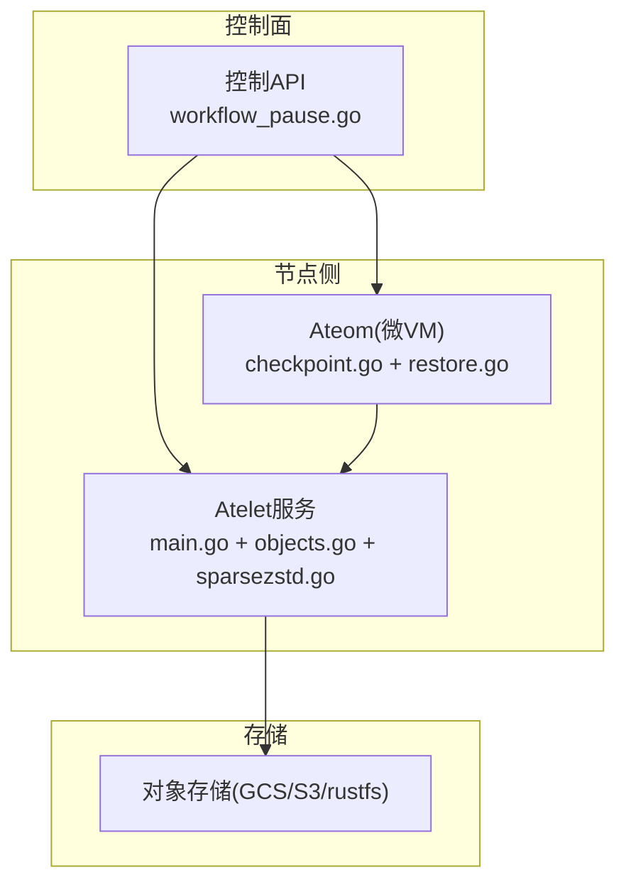
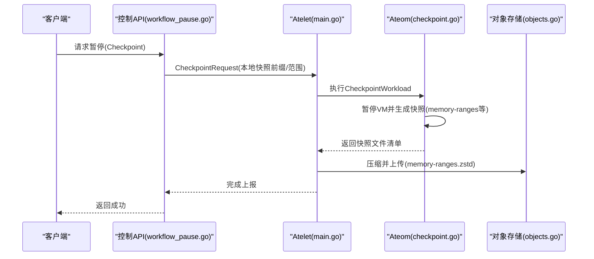
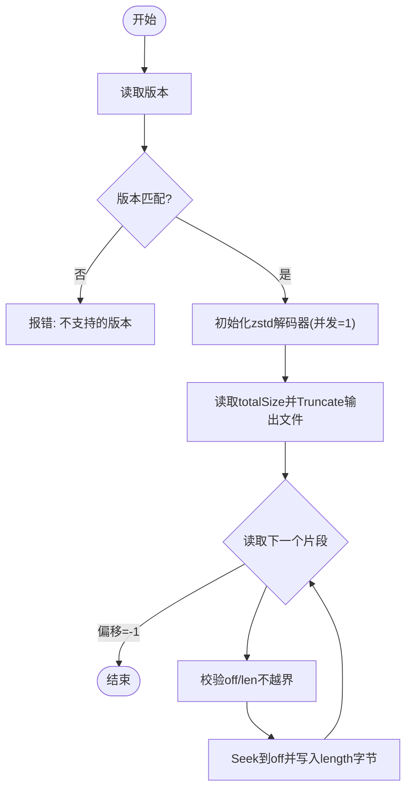
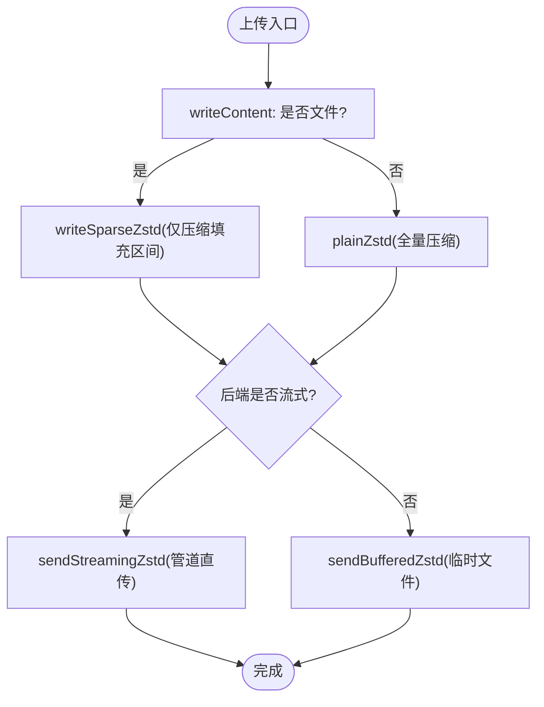
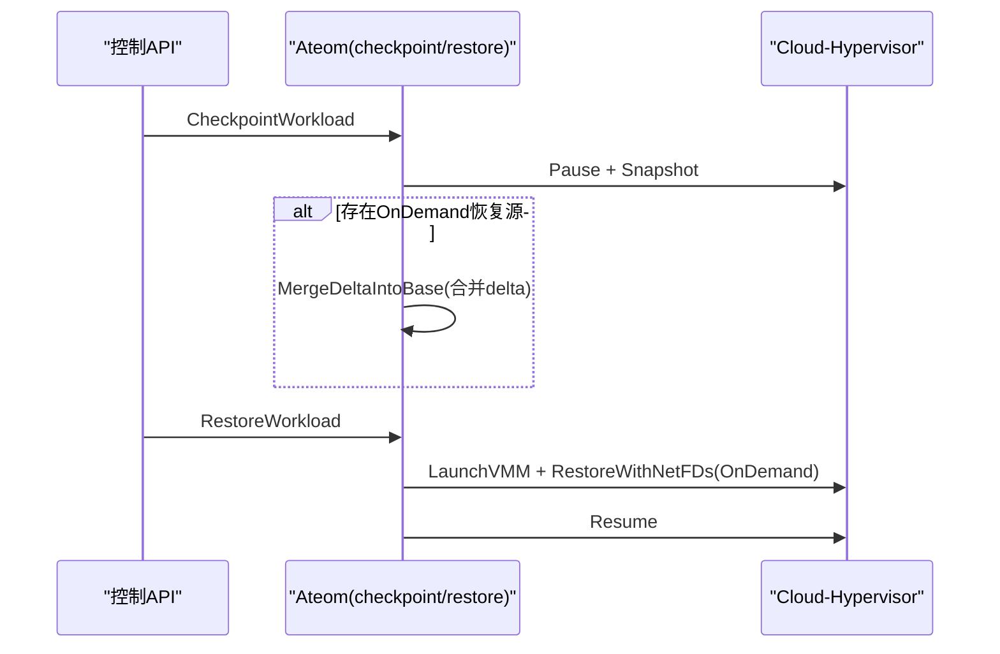
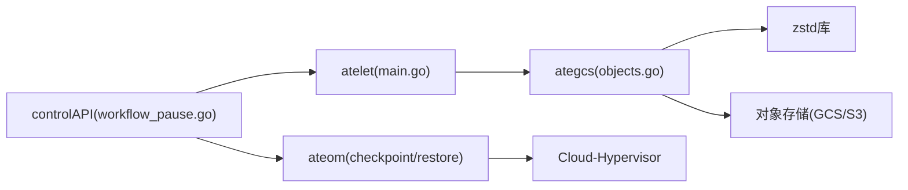

# 快照性能问题

<cite>
**本文引用的文件**   
- [sparsezstd.go](file://cmd/atelet/internal/ategcs/sparsezstd.go)
- [objects.go](file://cmd/atelet/internal/ategcs/objects.go)
- [checkpoint.go](file://cmd/ateom-microvm/checkpoint.go)
- [restore.go](file://cmd/ateom-microvm/restore.go)
- [workflow_pause.go](file://cmd/ateapi/internal/controlapi/workflow_pause.go)
- [main.go](file://cmd/atelet/main.go)
- [ate-snapshot-dashboard.json](file://tools/setup-gcp/dashboards/ate-snapshot-dashboard.json)
- [README.md](file://benchmarking/README.md)
</cite>

## 目录
1. [简介](#简介)
2. [项目结构](#项目结构)
3. [核心组件](#核心组件)
4. [架构总览](#架构总览)
5. [详细组件分析](#详细组件分析)
6. [依赖关系分析](#依赖关系分析)
7. [性能考量与优化策略](#性能考量与优化策略)
8. [故障排查指南](#故障排查指南)
9. [结论](#结论)
10. [附录](#附录)

## 简介
本文件聚焦于“快照”在系统内的端到端实现与性能瓶颈，围绕以下目标展开：
- 内存快照大小对性能的影响机制
- I/O密集型路径的优化方法（稀疏写入、流式上传、并发控制）
- 压缩算法选择对快照体积与速度的权衡
- 增量快照的配置与效果评估
- 性能监控指标定义、基准测试方法与调优最佳实践
- 大规模部署场景下的扩展建议

## 项目结构
与快照相关的代码主要分布在三个子系统：
- atelet：负责将宿主机上的快照对象进行压缩、上传/下载，并暴露度量接口
- ateom-microvm：驱动 Cloud-Hypervisor 完成 VM 暂停、快照生成与恢复
- control API：编排暂停/恢复工作流，协调 atelet 与 ateom 的交互

图表来源
- [workflow_pause.go:130-165](file://cmd/ateapi/internal/controlapi/workflow_pause.go#L130-L165)
- [main.go:98-102](file://cmd/atelet/main.go#L98-L102)
- [objects.go:95-118](file://cmd/atelet/internal/ategcs/objects.go#L95-L118)
- [checkpoint.go:98-123](file://cmd/ateom-microvm/checkpoint.go#L98-L123)
- [restore.go:150-176](file://cmd/ateom-microvm/restore.go#L150-L176)

章节来源
- [workflow_pause.go:130-165](file://cmd/ateapi/internal/controlapi/workflow_pause.go#L130-L165)
- [main.go:98-102](file://cmd/atelet/main.go#L98-L102)
- [objects.go:95-118](file://cmd/atelet/internal/ategcs/objects.go#L95-L118)
- [checkpoint.go:98-123](file://cmd/ateom-microvm/checkpoint.go#L98-L123)
- [restore.go:150-176](file://cmd/ateom-microvm/restore.go#L150-L176)

## 核心组件
- 稀疏-Extent 格式与 ZSTD 编码/解码
  - 采用自定义“ATESPRSE”魔数+版本头，随后是单个 zstd 流，包含逻辑大小与若干“偏移+长度+数据”片段，以特殊结束标记收尾。该格式只编码实际填充的数据段，跳过空洞，显著降低压缩与传输成本。
- 上传/下载流水线
  - 针对可寻址文件走稀疏路径；否则回退为普通 zstd 流。支持两种上传模式：流式直传（GCS）与缓冲到临时文件再上传（S3/rustfs）。
- VM 快照生命周期
  - 暂停 -> 生成快照（含 memory-ranges）-> 可选合并 OnDemand delta -> 清理资源。恢复时通过 OnDemand(userfaultfd) 快速拉起，按需缺页回填。

章节来源
- [sparsezstd.go:29-62](file://cmd/atelet/internal/ategcs/sparsezstd.go#L29-L62)
- [objects.go:137-154](file://cmd/atelet/internal/ategcs/objects.go#L137-L154)
- [checkpoint.go:98-123](file://cmd/ateom-microvm/checkpoint.go#L98-L123)
- [restore.go:164-176](file://cmd/ateom-microvm/restore.go#L164-L176)

## 架构总览
下图展示了从控制面触发暂停到最终落盘/上传的关键调用链与数据流向。

图表来源
- [workflow_pause.go:130-165](file://cmd/ateapi/internal/controlapi/workflow_pause.go#L130-L165)
- [checkpoint.go:98-123](file://cmd/ateom-microvm/checkpoint.go#L98-L123)
- [objects.go:95-118](file://cmd/atelet/internal/ategcs/objects.go#L95-L118)

## 详细组件分析

### 组件A：稀疏-Extent 格式与ZSTD编解码
- 设计要点
  - 魔数与版本：便于兼容演进，未知版本直接拒绝
  - 单zstd流：元数据(totalSize)与数据片段交错，末尾以特殊偏移(-1)终止
  - 读取端强制校验边界，避免越界写
- 关键流程
  - 写入：遍历源文件的非空区间(SEEK_DATA/SEEK_HOLE)，仅对这些区间进行二进制序列化与压缩
  - 读取：按序解析片段，定位偏移后写入，未覆盖区域保持空洞

图表来源
- [sparsezstd.go:141-196](file://cmd/atelet/internal/ategcs/sparsezstd.go#L141-L196)

章节来源
- [sparsezstd.go:29-62](file://cmd/atelet/internal/ategcs/sparsezstd.go#L29-L62)
- [sparsezstd.go:137-196](file://cmd/atelet/internal/ategcs/sparsezstd.go#L137-L196)

### 组件B：上传/下载流水线与I/O优化
- 上传路径
  - writeContent 自动识别是否为文件：若是则走稀疏路径(writeSparseZstd)，否则走普通zstd
  - sendZstd 根据后端能力选择：
    - 流式后端(GCS)：sendStreamingZstd，压缩与网络PUT并行，无需临时文件
    - 需seek的后端(S3/rustfs)：sendBufferedZstd，先压缩到临时文件再PutObject
- 下载路径
  - decodeContent 检测魔数：若为稀疏格式则走 readSparseZstd；否则回退为普通zstd
  - 普通zstd路径下，若目标是文件，使用 copyZstdSparse 跳过全零块，产出稀疏文件

图表来源
- [objects.go:137-154](file://cmd/atelet/internal/ategcs/objects.go#L137-L154)
- [objects.go:171-181](file://cmd/atelet/internal/ategcs/objects.go#L171-L181)
- [objects.go:186-212](file://cmd/atelet/internal/ategcs/objects.go#L186-L212)
- [objects.go:219-251](file://cmd/atelet/internal/ategcs/objects.go#L219-L251)
- [objects.go:299-328](file://cmd/atelet/internal/ategcs/objects.go#L299-L328)
- [objects.go:347-384](file://cmd/atelet/internal/ategcs/objects.go#L347-L384)
- [objects.go:392-428](file://cmd/atelet/internal/ategcs/objects.go#L392-L428)

章节来源
- [objects.go:137-154](file://cmd/atelet/internal/ategcs/objects.go#L137-L154)
- [objects.go:171-181](file://cmd/atelet/internal/ategcs/objects.go#L171-L181)
- [objects.go:186-212](file://cmd/atelet/internal/ategcs/objects.go#L186-L212)
- [objects.go:219-251](file://cmd/atelet/internal/ategcs/objects.go#L219-L251)
- [objects.go:299-328](file://cmd/atelet/internal/ategcs/objects.go#L299-L328)
- [objects.go:347-384](file://cmd/atelet/internal/ategcs/objects.go#L347-L384)
- [objects.go:392-428](file://cmd/atelet/internal/ategcs/objects.go#L392-L428)

### 组件C：VM 快照与恢复（OnDemand）
- 暂停与快照
  - 暂停VM，生成快照目录（config.json/state.json/memory-ranges），记录baseID
  - 若来自OnDemand恢复后的再次暂停，会将CH产生的delta叠加到基镜像，形成完整快照
- 恢复
  - 重建overlay RO lower与网络tap设备，以OnDemand模式恢复，减少冷启动时间并保持memfd稀疏，利于后续暂停

图表来源
- [checkpoint.go:98-123](file://cmd/ateom-microvm/checkpoint.go#L98-L123)
- [restore.go:150-176](file://cmd/ateom-microvm/restore.go#L150-L176)

章节来源
- [checkpoint.go:98-123](file://cmd/ateom-microvm/checkpoint.go#L98-L123)
- [restore.go:150-176](file://cmd/ateom-microvm/restore.go#L150-L176)

## 依赖关系分析
- 模块耦合
  - control API 依赖 atelet 的 gRPC 接口发起本地快照任务
  - atelet 依赖 ategcs 的压缩/上传/下载能力
  - ateom 通过 CH 的 REST API 完成 VM 级快照/恢复
- 外部依赖
  - zstd 编码器/解码器
  - 对象存储后端(GCS/S3/rustfs)
  - Linux内核特性(SEEK_DATA/SEEK_HOLE, userfaultfd)

图表来源
- [workflow_pause.go:130-165](file://cmd/ateapi/internal/controlapi/workflow_pause.go#L130-L165)
- [main.go:98-102](file://cmd/atelet/main.go#L98-L102)
- [objects.go:95-118](file://cmd/atelet/internal/ategcs/objects.go#L95-L118)
- [checkpoint.go:98-123](file://cmd/ateom-microvm/checkpoint.go#L98-L123)
- [restore.go:150-176](file://cmd/ateom-microvm/restore.go#L150-L176)

章节来源
- [workflow_pause.go:130-165](file://cmd/ateapi/internal/controlapi/workflow_pause.go#L130-L165)
- [main.go:98-102](file://cmd/atelet/main.go#L98-L102)
- [objects.go:95-118](file://cmd/atelet/internal/ategcs/objects.go#L95-L118)
- [checkpoint.go:98-123](file://cmd/ateom-microvm/checkpoint.go#L98-L123)
- [restore.go:150-176](file://cmd/ateom-microvm/restore.go#L150-L176)

## 性能考量与优化策略

### 内存快照大小对性能的影响
- 影响维度
  - 压缩CPU占用：越大越占CPU，但稀疏格式仅压缩填充区间，显著降低实际工作量
  - 网络带宽：决定上传/下载耗时，受后端吞吐与延迟影响
  - 磁盘I/O：稀疏写入/读取减少实际IO，但仍需处理元数据与碎片
- 观测手段
  - 通过日志中的 logical_bytes/populated_bytes 估算压缩收益
  - 通过 Prometheus 面板观察快照大小分布与QPS

章节来源
- [objects.go:207-211](file://cmd/atelet/internal/ategcs/objects.go#L207-L211)
- [objects.go:246-250](file://cmd/atelet/internal/ategcs/objects.go#L246-L250)
- [objects.go:324-327](file://cmd/atelet/internal/ategcs/objects.go#L324-L327)
- [ate-snapshot-dashboard.json:1-137](file://tools/setup-gcp/dashboards/ate-snapshot-dashboard.json#L1-L137)

### I/O密集型操作优化
- 稀疏扫描与写入
  - 利用 SEEK_DATA/SEEK_HOLE 仅读取填充区间，避免全量扫描大镜像
  - 下载时对普通zstd流也做全零块跳过，产出稀疏文件
- 流式上传
  - 对GCS等支持流式Put的后端，使用io.Pipe将压缩与网络PUT重叠，避免中间文件
- 并发控制
  - 编码器并发：使用所有可用CPU核提升吞吐
  - 解码器并发：限制为1，避免解压阶段争用导致抖动

章节来源
- [sparsezstd.go:82-87](file://cmd/atelet/internal/ategcs/sparsezstd.go#L82-L87)
- [sparsezstd.go:150-154](file://cmd/atelet/internal/ategcs/sparsezstd.go#L150-L154)
- [objects.go:255-268](file://cmd/atelet/internal/ategcs/objects.go#L255-L268)
- [objects.go:219-251](file://cmd/atelet/internal/ategcs/objects.go#L219-L251)
- [objects.go:392-428](file://cmd/atelet/internal/ategcs/objects.go#L392-L428)

### 压缩算法选择与权衡
- 算法：zstd
- 级别：SpeedFastest，兼顾速度与体积；对于近零数据的高比例镜像，更高级别带来的体积收益有限
- 兼容性：解码器自动探测级别，历史快照仍可正常恢复

章节来源
- [objects.go:156-162](file://cmd/atelet/internal/ategcs/objects.go#L156-L162)
- [objects.go:255-268](file://cmd/atelet/internal/ategcs/objects.go#L255-L268)

### 增量快照配置与效果评估
- OnDemand恢复
  - 首次恢复使用userfaultfd按需缺页，大幅缩短恢复时间并保持memfd稀疏
  - 后续暂停时，将CH产生的delta叠加到基镜像，形成自包含的完整快照
- 效果评估
  - 对比OnDemand与Eager恢复的耗时差异
  - 观察后续暂停的快照大小与压缩时间，验证增量收益

章节来源
- [restore.go:164-176](file://cmd/ateom-microvm/restore.go#L164-L176)
- [checkpoint.go:105-123](file://cmd/ateom-microvm/checkpoint.go#L105-L123)

### 并发控制策略
- 上传并发
  - 多核压缩 + 网络并行，最大化吞吐
- 下载并发
  - 解码并发设为1，避免解压阶段竞争
- 工作流并发
  - 控制面通过状态机与前置条件检查保证同一Actor的暂停/恢复串行化

章节来源
- [objects.go:255-268](file://cmd/atelet/internal/ategcs/objects.go#L255-L268)
- [sparsezstd.go:150-154](file://cmd/atelet/internal/ategcs/sparsezstd.go#L150-L154)
- [workflow_pause.go:82-103](file://cmd/ateapi/internal/controlapi/workflow_pause.go#L82-L103)

### 性能监控指标定义
- 快照大小分布
  - 指标名：atelet.snapshot.size_bucket (histogram)
  - 维度：actor_template_name, kind(pages)
  - 用途：P50/P95/P99 大小趋势、按模板聚合
- 快照QPS
  - 指标名：atelet.snapshot.size_count (counter)
  - 用途：单位时间内快照数量
- 面板
  - 提供P50/P95/P99曲线、按模板聚合的P99、热力图分布

章节来源
- [ate-snapshot-dashboard.json:1-137](file://tools/setup-gcp/dashboards/ate-snapshot-dashboard.json#L1-L137)
- [main.go:98-102](file://cmd/atelet/main.go#L98-L102)

### 基准测试方法
- 工具
  - Locust：用于构建负载模型与压测脚本
  - glutton：提供可控的RAM/Disk/FD压力工作负载
- 步骤
  - 部署Locust与监控(Prometheus/Grafana)
  - 通过UI选择用户类与参数，启动压测
  - 结合Trace与Metrics分析快照路径的延迟与吞吐

章节来源
- [README.md:1-90](file://benchmarking/README.md#L1-L90)

### 调优最佳实践
- 优先启用稀疏格式与流式上传（GCS）
- 合理设置压缩级别（默认SpeedFastest通常最优）
- 监控logical/populated比率，评估稀疏收益
- 对OnDemand恢复后的再次暂停，确保delta合并成功，避免下次暂停退化
- 关注对象存储后端能力，必要时切换为流式后端以降低峰值内存与磁盘IO

[本节为通用指导，不直接分析具体文件]

### 大规模部署扩展建议
- 水平扩展
  - 增加WorkerPool副本，分散快照任务
  - 使用高吞吐对象存储与就近接入点
- 资源隔离
  - 为快照相关进程分配独立CPU配额，避免与业务线程争抢
- 缓存与复用
  - 复用连接池与拉取缓存，减少重复开销
- 容量规划
  - 基于P99快照大小与QPS预测带宽与存储增长

[本节为通用指导，不直接分析具体文件]

## 故障排查指南
- 常见错误
  - 不支持的快照格式版本：检查读写两端版本一致性
  - 负size或越界extent：确认写入端完整性与校验逻辑
  - 后端签名/Content-Length失败：切换到流式后端或确保可seek
- 诊断线索
  - 查看上传/下载的日志字段：sparse/logical_bytes/populated_bytes/streaming
  - 使用Prometheus面板观察异常尖峰
  - 结合Trace定位慢点（压缩、网络、磁盘）

章节来源
- [sparsezstd.go:146-148](file://cmd/atelet/internal/ategcs/sparsezstd.go#L146-L148)
- [sparsezstd.go:185-187](file://cmd/atelet/internal/ategcs/sparsezstd.go#L185-L187)
- [objects.go:207-211](file://cmd/atelet/internal/ategcs/objects.go#L207-L211)
- [objects.go:246-250](file://cmd/atelet/internal/ategcs/objects.go#L246-L250)
- [objects.go:324-327](file://cmd/atelet/internal/ategcs/objects.go#L324-L327)

## 结论
- 稀疏-Extent格式与zstd组合在“大镜像、低填充率”的场景下具备显著优势
- 流式上传与并发压缩能进一步降低端到端延迟
- OnDemand恢复配合delta合并，既加速恢复又保障后续暂停质量
- 完善的监控与基准体系是持续优化的基础

[本节为总结性内容，不直接分析具体文件]

## 附录
- 术语
  - 稀疏文件：包含空洞的文件，未写入区域不占用物理空间
  - OnDemand恢复：基于userfaultfd按需缺页的恢复方式
  - Delta：两次快照之间的差异部分

[本节为概念说明，不直接分析具体文件]
