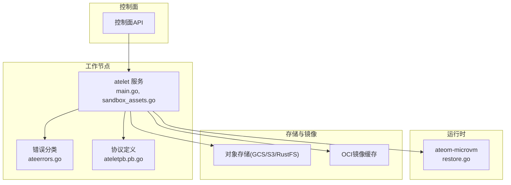
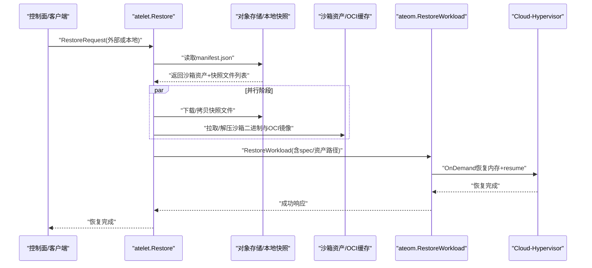
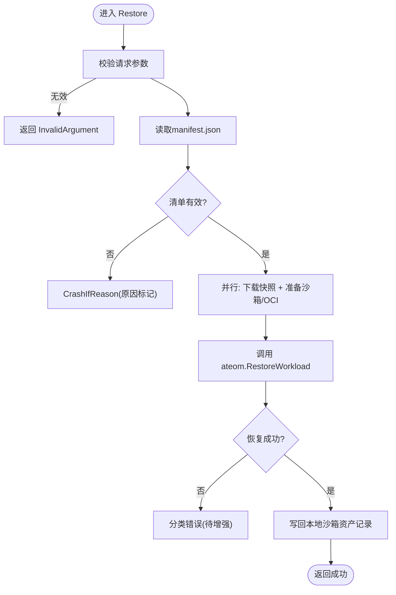
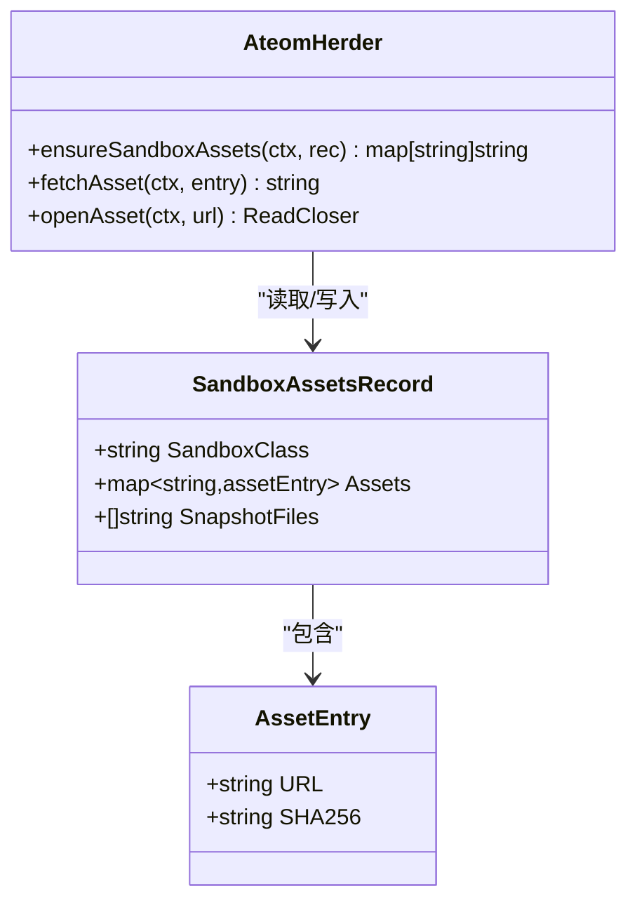
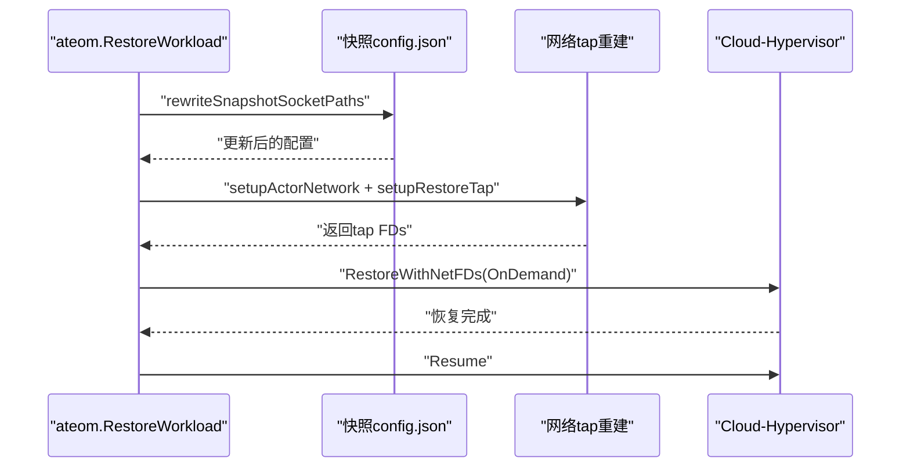
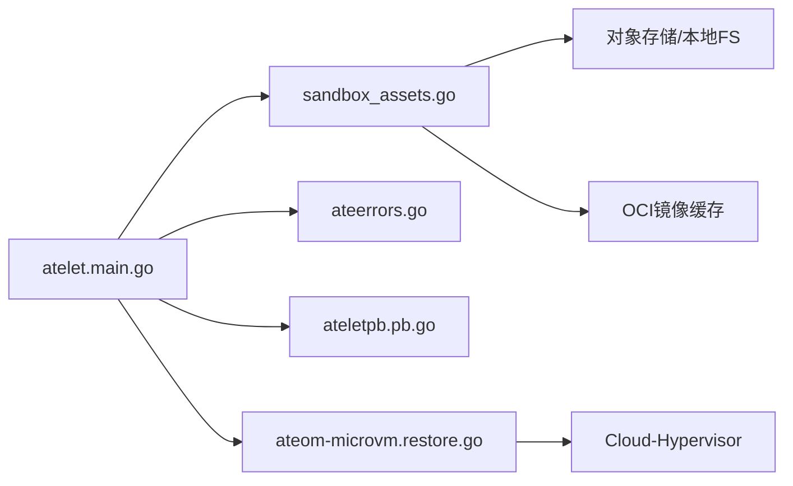

# 快照恢复异常

<cite>
**本文引用的文件**   
- [cmd/atelet/main.go](file://cmd/atelet/main.go)
- [cmd/atelet/sandbox_assets.go](file://cmd/atelet/sandbox_assets.go)
- [cmd/ateom-microvm/restore.go](file://cmd/ateom-microvm/restore.go)
- [internal/ateerrors/ateerrors.go](file://internal/ateerrors/ateerrors.go)
- [internal/proto/ateletpb/atelet.pb.go](file://internal/proto/ateletpb/atelet.pb.go)
- [tools/setup-gcp/dashboards/ate-snapshot-dashboard.json](file://tools/setup-gcp/dashboards/ate-snapshot-dashboard.json)
- [docs/observability.md](file://docs/observability.md)
- [internal/serverboot/serverboot.go](file://internal/serverboot/serverboot.go)
- [internal/contextlogging/contextlogging.go](file://internal/contextlogging/contextlogging.go)
</cite>

## 目录
1. [简介](#简介)
2. [项目结构](#项目结构)
3. [核心组件](#核心组件)
4. [架构总览](#架构总览)
5. [详细组件分析](#详细组件分析)
6. [依赖关系分析](#依赖关系分析)
7. [性能与可观测性](#性能与可观测性)
8. [故障排查指南](#故障排查指南)
9. [结论与建议](#结论与建议)
10. [附录：回滚与备用恢复方案](#附录回滚与备用恢复方案)

## 简介
本文件聚焦于快照恢复过程中的异常情况与问题排查，覆盖版本不兼容、数据损坏、依赖缺失、内存状态恢复失败、文件系统不一致、网络配置冲突等典型失败场景的诊断与处置策略。同时提供恢复过程监控指标与故障定位工具的使用建议，并给出回滚机制与备用恢复方案的设计建议，帮助在复杂生产环境中快速定位和解决问题。

## 项目结构
与快照恢复相关的核心代码分布在以下模块：
- atelet（工作节点服务）：负责下载/拷贝快照、准备沙箱运行时与OCI镜像、调用底层运行时执行恢复。
- ateom-microvm（微虚拟机运行时适配层）：负责基于云超融合器（Cloud Hypervisor）的内存与设备状态恢复。
- ateerrors（错误分类与崩溃指令）：统一错误码与“应崩溃”标记，供控制面决策。
- ateletpb（协议定义）：RestoreRequest/CheckpointRequest 等消息类型。
- 可观测性：日志、指标、仪表板与追踪。

图表来源
- [cmd/atelet/main.go:454-583](file://cmd/atelet/main.go#L454-L583)
- [cmd/atelet/sandbox_assets.go:91-184](file://cmd/atelet/sandbox_assets.go#L91-L184)
- [cmd/ateom-microvm/restore.go:52-206](file://cmd/ateom-microvm/restore.go#L52-L206)
- [internal/ateerrors/ateerrors.go:44-111](file://internal/ateerrors/ateerrors.go#L44-L111)
- [internal/proto/ateletpb/atelet.pb.go:1273-1416](file://internal/proto/ateletpb/atelet.pb.go#L1273-L1416)

章节来源
- [cmd/atelet/main.go:454-583](file://cmd/atelet/main.go#L454-L583)
- [cmd/atelet/sandbox_assets.go:91-184](file://cmd/atelet/sandbox_assets.go#L91-L184)
- [cmd/ateom-microvm/restore.go:52-206](file://cmd/ateom-microvm/restore.go#L52-L206)
- [internal/ateerrors/ateerrors.go:44-111](file://internal/ateerrors/ateerrors.go#L44-L111)
- [internal/proto/ateletpb/atelet.pb.go:1273-1416](file://internal/proto/ateletpb/atelet.pb.go#L1273-L1416)

## 核心组件
- atelet 恢复流程入口：Validate -> 读取快照清单(manifest) -> 并发下载/拷贝快照与准备沙箱资源 -> 调用 ateom.RestoreWorkload -> 记录本地沙箱资产记录 -> 输出耗时分解日志。
- 沙箱资产与清单：通过 manifest.json 记录创建快照的沙箱二进制集合与快照文件列表，确保跨节点恢复自描述。
- 错误分类与崩溃指令：使用 Reason 枚举与 ErrorInfo 元数据标记“应崩溃”，控制面据此决定是否终止 Actor。
- 微虚拟机恢复：重写快照 config.json 中的 socket 路径、重建网络 tap FDs、以 OnDemand 模式恢复内存并 resume。

章节来源
- [cmd/atelet/main.go:454-583](file://cmd/atelet/main.go#L454-L583)
- [cmd/atelet/sandbox_assets.go:38-68](file://cmd/atelet/sandbox_assets.go#L38-L68)
- [internal/ateerrors/ateerrors.go:44-111](file://internal/ateerrors/ateerrors.go#L44-L111)
- [cmd/ateom-microvm/restore.go:209-254](file://cmd/ateom-microvm/restore.go#L209-L254)

## 架构总览
下图展示一次典型的 Restore 请求从 atelet 到 ateom-microvm 的调用链及关键错误处理点。

图表来源
- [cmd/atelet/main.go:454-583](file://cmd/atelet/main.go#L454-L583)
- [cmd/ateom-microvm/restore.go:150-176](file://cmd/ateom-microvm/restore.go#L150-L176)

## 详细组件分析

### 组件A：atelet 恢复主流程与异常分支
- 输入校验：对 RestoreRequest 的类型、作用域、路径等进行严格校验，非法参数直接返回 InvalidArgument。
- 清单加载：根据快照类型（外部对象存储或本地目录）读取 manifest.json；若为本地且遇到终端文件系统错误，则返回 DataLoss 并附带“应崩溃”元数据。
- 并发准备：下载/拷贝快照与准备沙箱资源并行执行，缩短冷启动恢复时间。
- 运行时恢复：调用 ateom.RestoreWorkload；若失败，当前实现未区分可重试与不可重试错误，需后续增强分类。
- 结果记录：成功后写回本地沙箱资产记录，以便后续 Checkpoint 能复用相同版本。

图表来源
- [cmd/atelet/main.go:454-583](file://cmd/atelet/main.go#L454-L583)
- [internal/ateerrors/ateerrors.go:101-111](file://internal/ateerrors/ateerrors.go#L101-L111)

章节来源
- [cmd/atelet/main.go:454-583](file://cmd/atelet/main.go#L454-L583)
- [internal/ateerrors/ateerrors.go:101-111](file://internal/ateerrors/ateerrors.go#L101-L111)

### 组件B：沙箱资产与清单管理（版本与完整性）
- 清单内容：包含沙箱类、各架构下的资产URL与SHA256、以及快照文件列表。
- 资产获取：优先匿名客户端访问公共桶，再回退到认证客户端；流式下载并计算哈希，超过大小上限或哈希不匹配视为无效资产。
- 终端文件系统错误：当出现不存在、权限不足、只读文件系统等问题时，包装为“终端文件系统错误”，用于上层判定是否崩溃。

图表来源
- [cmd/atelet/sandbox_assets.go:38-68](file://cmd/atelet/sandbox_assets.go#L38-L68)
- [cmd/atelet/sandbox_assets.go:91-184](file://cmd/atelet/sandbox_assets.go#L91-L184)

章节来源
- [cmd/atelet/sandbox_assets.go:91-184](file://cmd/atelet/sandbox_assets.go#L91-L184)
- [cmd/atelet/sandbox_assets.go:243-266](file://cmd/atelet/sandbox_assets.go#L243-L266)

### 组件C：ateom-microvm 恢复与网络/套接字重定向
- 套接字重定向：将快照 config.json 中的 vsock、serial、virtiofsd 套接字路径指向当前 Actor 的 VMDir，避免跨节点路径不一致导致失败。
- 网络重建：读取快照中的网络设备信息，重建 tap FDs 并通过 SCM_RIGHTS 传递给 CH，保证网络状态一致。
- 内存恢复：采用 OnDemand 模式恢复内存，减少恢复时间与后续挂起成本。

图表来源
- [cmd/ateom-microvm/restore.go:209-254](file://cmd/ateom-microvm/restore.go#L209-L254)
- [cmd/ateom-microvm/restore.go:114-176](file://cmd/ateom-microvm/restore.go#L114-L176)

章节来源
- [cmd/ateom-microvm/restore.go:114-176](file://cmd/ateom-microvm/restore.go#L114-L176)
- [cmd/ateom-microvm/restore.go:209-254](file://cmd/ateom-microvm/restore.go#L209-L254)

## 依赖关系分析
- atelet 依赖对象存储（GCS/S3/RustFS）与本地文件系统，依赖 OCI 镜像缓存与静态沙箱二进制缓存。
- atelet 与 ateom 通过 gRPC 交互，错误通过 ateerrors 进行结构化标注，控制面据此决定是否需要崩溃 Actor。
- 协议层面由 ateletpb 定义 RestoreRequest/CheckpointRequest 等字段，包括快照类型与作用域。

图表来源
- [cmd/atelet/main.go:454-583](file://cmd/atelet/main.go#L454-L583)
- [cmd/atelet/sandbox_assets.go:91-184](file://cmd/atelet/sandbox_assets.go#L91-L184)
- [internal/ateerrors/ateerrors.go:44-111](file://internal/ateerrors/ateerrors.go#L44-L111)
- [internal/proto/ateletpb/atelet.pb.go:1273-1416](file://internal/proto/ateletpb/atelet.pb.go#L1273-L1416)
- [cmd/ateom-microvm/restore.go:150-176](file://cmd/ateom-microvm/restore.go#L150-L176)

章节来源
- [cmd/atelet/main.go:454-583](file://cmd/atelet/main.go#L454-L583)
- [cmd/atelet/sandbox_assets.go:91-184](file://cmd/atelet/sandbox_assets.go#L91-L184)
- [internal/ateerrors/ateerrors.go:44-111](file://internal/ateerrors/ateerrors.go#L44-L111)
- [internal/proto/ateletpb/atelet.pb.go:1273-1416](file://internal/proto/ateletpb/atelet.pb.go#L1273-L1416)
- [cmd/ateom-microvm/restore.go:150-176](file://cmd/ateom-microvm/restore.go#L150-L176)

## 性能与可观测性
- 指标：atelet 暴露 snapshot size 直方图指标，按模板维度统计快照页大小分布与QPS，便于观察恢复负载与容量趋势。
- 日志：恢复流程输出分阶段耗时（下载、OCI解包、ateom恢复），结合上下文追踪ID，便于跨服务链路定位。
- 仪表板：提供快照尺寸与QPS仪表板，支持P50/P95/P99与热力图视图。

章节来源
- [cmd/atelet/main.go:273-307](file://cmd/atelet/main.go#L273-L307)
- [cmd/atelet/main.go:577-582](file://cmd/atelet/main.go#L577-L582)
- [tools/setup-gcp/dashboards/ate-snapshot-dashboard.json:1-137](file://tools/setup-gcp/dashboards/ate-snapshot-dashboard.json#L1-L137)
- [docs/observability.md:1-102](file://docs/observability.md#L1-L102)
- [internal/serverboot/serverboot.go:44-58](file://internal/serverboot/serverboot.go#L44-L58)
- [internal/contextlogging/contextlogging.go:38-46](file://internal/contextlogging/contextlogging.go#L38-L46)

## 故障排查指南

### 常见失败场景与诊断要点
- 版本不兼容
  - 现象：恢复时报错或运行时行为异常。
  - 诊断：检查 manifest.json 中记录的沙箱资产版本与当前节点可用资产是否一致；确认沙箱二进制与镜像版本是否与快照创建时一致。
  - 依据：清单自描述设计确保跨节点恢复一致性；资产校验失败会标记为无效资产。
  - 参考
    - [cmd/atelet/sandbox_assets.go:38-68](file://cmd/atelet/sandbox_assets.go#L38-L68)
    - [cmd/atelet/sandbox_assets.go:120-184](file://cmd/atelet/sandbox_assets.go#L120-L184)

- 数据损坏
  - 现象：清单解析失败、快照文件缺失或哈希不匹配。
  - 诊断：核对 manifest.json 完整性与快照文件列表；验证对象存储中文件的可用性；关注“无效沙箱资产”错误。
  - 依据：清单解析与哈希校验失败会被归类为无效资产；本地清单读取失败可能触发终端文件系统错误。
  - 参考
    - [cmd/atelet/sandbox_assets.go:235-241](file://cmd/atelet/sandbox_assets.go#L235-L241)
    - [cmd/atelet/main.go:482-504](file://cmd/atelet/main.go#L482-L504)

- 依赖缺失
  - 现象：无法拉取沙箱二进制或OCI镜像；prepareOCIBundles 失败。
  - 诊断：检查对象存储客户端配置与权限；确认镜像仓库可达；查看 prepareOCIBundles 相关错误。
  - 依据：prepareOCIBundles 会创建持久卷目录与容器bundle，失败通常与文件系统或镜像拉取有关。
  - 参考
    - [cmd/atelet/main.go:647-753](file://cmd/atelet/main.go#L647-L753)

- 内存状态恢复失败
  - 现象：OnDemand 恢复或 resume 失败。
  - 诊断：检查 Cloud-Hypervisor 日志与网络FD传递；确认 tap 设备重建成功；关注 restore 阶段的错误信息。
  - 依据：恢复流程明确调用 RestoreWithNetFDs 与 Resume，失败会返回具体错误。
  - 参考
    - [cmd/ateom-microvm/restore.go:150-176](file://cmd/ateom-microvm/restore.go#L150-L176)

- 文件系统不一致
  - 现象：读取清单或复制快照文件失败，报终端文件系统错误。
  - 诊断：检查磁盘挂载、权限、只读状态、路径长度与符号链接环；确认本地快照目录存在且可读。
  - 依据：isTerminalFileSystemErr 识别多种终端错误并包装为“终端文件系统错误”。
  - 参考
    - [cmd/atelet/sandbox_assets.go:250-266](file://cmd/atelet/sandbox_assets.go#L250-L266)
    - [cmd/atelet/main.go:492-504](file://cmd/atelet/main.go#L492-L504)

- 网络配置冲突
  - 现象：恢复后网络不通或端口冲突。
  - 诊断：检查 rewriteSnapshotSocketPaths 是否正确重定向套接字路径；确认 tap 设备与队列对设置正确。
  - 依据：恢复流程显式重写 vsock、serial、virtiofsd 套接字路径，并重建网络。
  - 参考
    - [cmd/ateom-microvm/restore.go:209-254](file://cmd/ateom-microvm/restore.go#L209-L254)
    - [cmd/ateom-microvm/restore.go:114-148](file://cmd/ateom-microvm/restore.go#L114-L148)

### 错误分类与崩溃指令
- 使用 Reason 枚举与 ErrorInfo 元数据标记失败原因，控制面可通过 ActorCrashRequested 判断是否需要崩溃 Actor。
- 常见原因包括：终端文件系统错误、无效沙箱资产、无效检查点结果、保存快照失败、无效对象URL、获取外部对象失败、无效容器配置。
- 参考
  - [internal/ateerrors/ateerrors.go:44-111](file://internal/ateerrors/ateerrors.go#L44-L111)

### 监控指标与定位工具
- 指标：snapshot size 直方图与 QPS，按模板维度聚合，便于发现异常增长或热点。
- 日志：恢复流程输出下载、解包、恢复阶段耗时；结合 trace-id 进行跨服务关联。
- 仪表板：快照尺寸与QPS面板，支持多分位数与热力图。
- 参考
  - [cmd/atelet/main.go:273-307](file://cmd/atelet/main.go#L273-L307)
  - [cmd/atelet/main.go:577-582](file://cmd/atelet/main.go#L577-L582)
  - [tools/setup-gcp/dashboards/ate-snapshot-dashboard.json:1-137](file://tools/setup-gcp/dashboards/ate-snapshot-dashboard.json#L1-L137)
  - [docs/observability.md:1-102](file://docs/observability.md#L1-L102)
  - [internal/serverboot/serverboot.go:44-58](file://internal/serverboot/serverboot.go#L44-L58)
  - [internal/contextlogging/contextlogging.go:38-46](file://internal/contextlogging/contextlogging.go#L38-L46)

## 结论与建议
- 清单自描述与资产哈希校验是保障恢复一致性与安全性的关键，务必确保清单与快照文件完整。
- 终端文件系统错误应被视作不可重试，及时崩溃并告警，避免污染后续恢复尝试。
- 建议在 ateom.RestoreWorkload 的错误分类上增强，区分可重试与不可重试错误，提升恢复鲁棒性。
- 利用指标与日志进行分层监控，结合 trace-id 进行端到端定位，提高排障效率。

## 附录：回滚与备用恢复方案

### 回滚机制设计建议
- 保留最近N个快照清单与文件，支持按时间或版本号回滚。
- 在恢复前进行预检（清单有效性、文件完整性、沙箱资产可用性），失败则拒绝恢复并提示回滚目标。
- 恢复完成后进行健康检查（readyz），失败则自动切换至上一版本快照。

### 备用恢复方案
- 本地快照优先：当对象存储不可用时，回退到本地快照目录进行恢复。
- 双通道下载：外部对象存储与本地缓存并行，任一成功即可继续；失败则记录原因并告警。
- 降级恢复：在内存恢复失败时，尝试仅恢复文件系统与网络状态，业务进程冷启动作为最后手段。

[本节为概念性建议，不直接分析具体源码文件]
