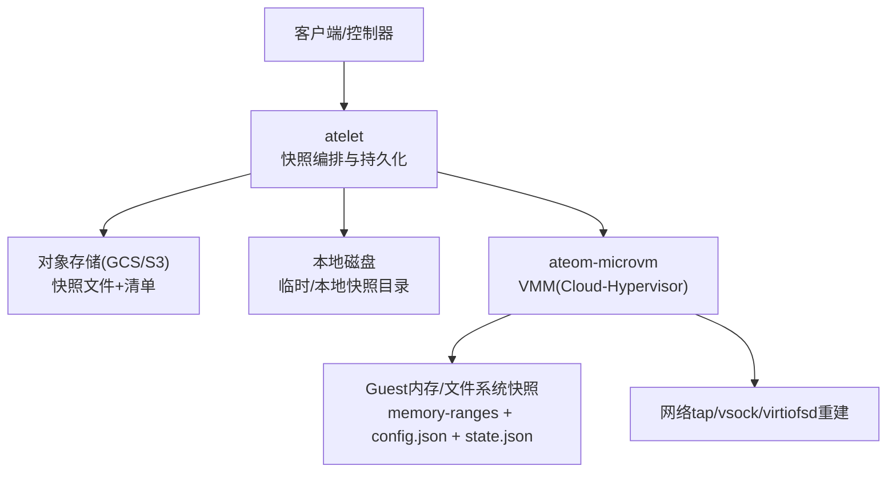
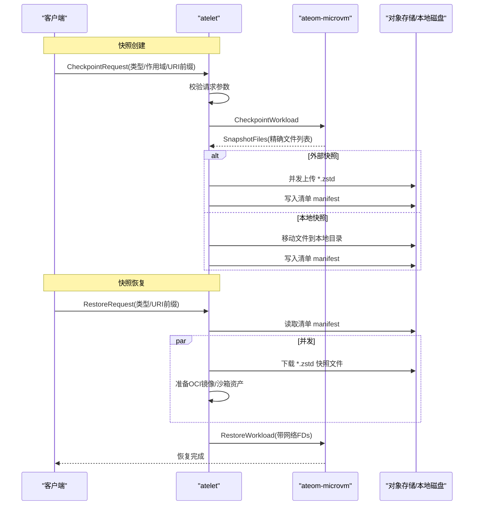
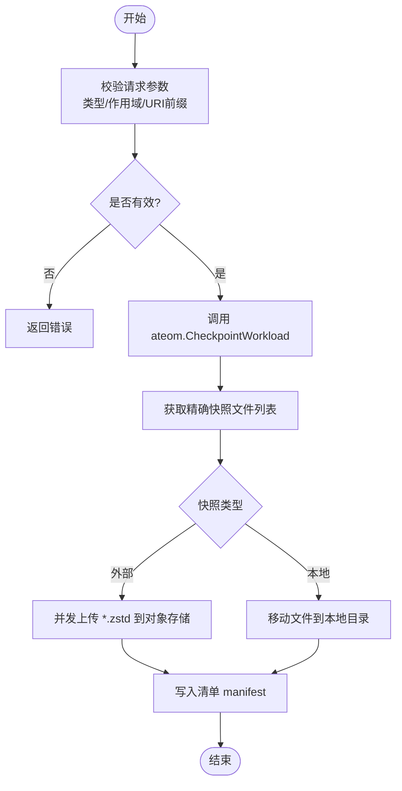
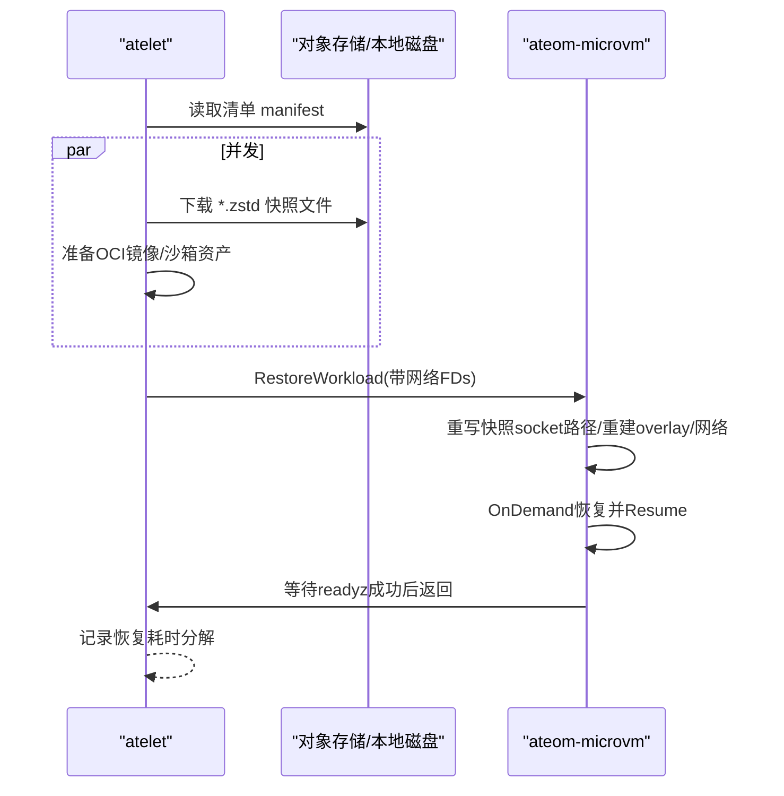
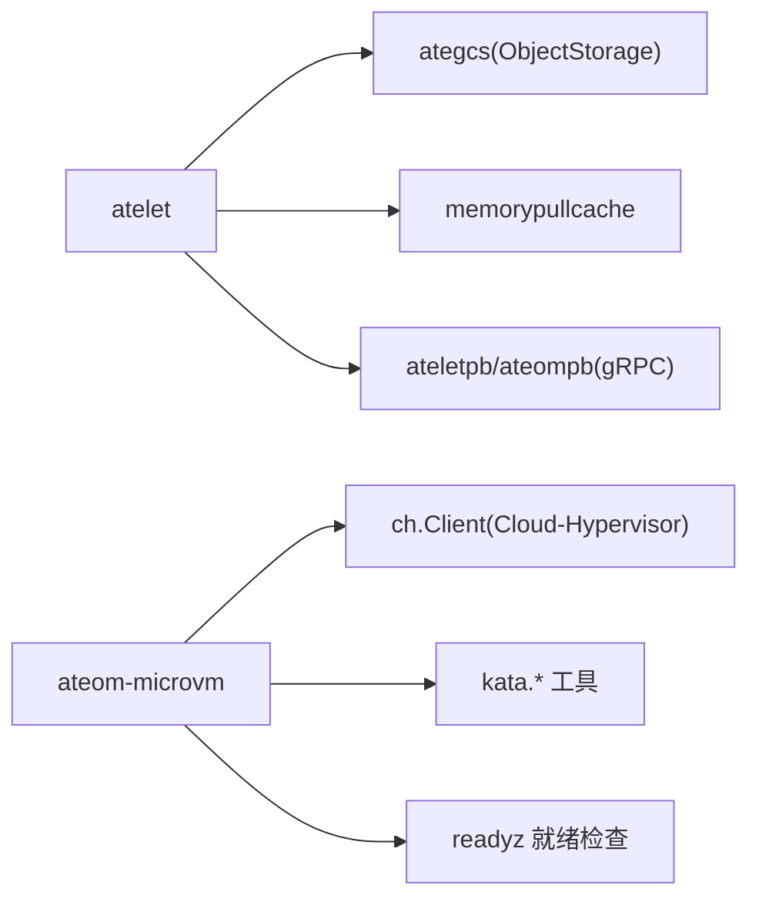

# 快照数据完整性

<cite>
**本文引用的文件**   
- [cmd/atelet/main.go](file://cmd/atelet/main.go)
- [cmd/ateom-microvm/checkpoint.go](file://cmd/ateom-microvm/checkpoint.go)
- [cmd/ateom-microvm/restore.go](file://cmd/ateom-microvm/restore.go)
- [internal/resources/validate.go](file://internal/resources/validate.go)
- [docs/threat-model.md](file://docs/threat-model.md)
</cite>

## 目录
1. [引言](#引言)
2. [项目结构](#项目结构)
3. [核心组件](#核心组件)
4. [架构总览](#架构总览)
5. [详细组件分析](#详细组件分析)
6. [依赖关系分析](#依赖关系分析)
7. [性能考量](#性能考量)
8. [故障排查指南](#故障排查指南)
9. [结论](#结论)
10. [附录](#附录)

## 引言
本文件聚焦于“快照数据完整性与一致性”保障机制，围绕校验和验证、事务性操作、原子性保证、损坏检测、自动修复、备份验证流程、监控指标与告警规则，以及灾难恢复场景下的数据一致性策略与验证方法展开。文档基于仓库中 atelet（节点侧编排）与 ateom-microvm（微虚拟机运行时）的快照/恢复实现，并结合威胁模型中的安全与完整性要求进行分析。

## 项目结构
与快照完整性直接相关的代码主要分布在以下模块：
- atelet：负责协调快照生命周期、对象存储上传/下载、本地快照移动与清单写入、并发下载与准备 OCI 镜像等。
- ateom-microvm：驱动 Cloud-Hypervisor 完成暂停、快照、合并增量、重启恢复、网络重建与就绪检查。
- 资源校验：对快照 URI 前缀进行严格校验，避免路径拼接导致的错误路由或越权访问。
- 威胁模型：明确“损坏快照恢复”的安全风险与缓解策略（如可信摘要/签名校验）。

图表来源
- [cmd/atelet/main.go:309-452](file://cmd/atelet/main.go#L309-L452)
- [cmd/ateom-microvm/checkpoint.go:44-154](file://cmd/ateom-microvm/checkpoint.go#L44-L154)
- [cmd/ateom-microvm/restore.go:52-207](file://cmd/ateom-microvm/restore.go#L52-L207)

章节来源
- [cmd/atelet/main.go:309-452](file://cmd/atelet/main.go#L309-L452)
- [cmd/ateom-microvm/checkpoint.go:44-154](file://cmd/ateom-microvm/checkpoint.go#L44-L154)
- [cmd/ateom-microvm/restore.go:52-207](file://cmd/ateom-microvm/restore.go#L52-L207)
- [internal/resources/validate.go:150-174](file://internal/resources/validate.go#L150-L174)

## 核心组件
- atelet 快照编排
  - 校验请求参数（类型、作用域、URI 前缀），确保失败快速返回。
  - 调用 ateom 执行 CheckpointWorkload，获取精确的文件列表并记录大小指标。
  - 外部快照：并发上传 zstd 压缩后的快照文件，最后写入清单 manifest（包含沙箱二进制版本与快照文件清单）。
  - 本地快照：将快照文件移动到本地目录，并写入清单 manifest。
  - 恢复时先拉取清单，再并发下载快照文件与准备 OCI 镜像，最后调用 ateom 恢复。
- ateom-microvm 快照/恢复
  - 快照：等待 CH API 就绪 -> 暂停 VM -> 清理并创建快照目录 -> 写入 base-id -> 生成快照 -> 若为 OnDemand 恢复源则合并 delta 到 base 以形成完整快照 -> 列出快照文件 -> 关闭 VMM 与相关进程。
  - 恢复：重写快照配置中的 socket 路径 -> 重建 overlay RO lower -> 重建网络 tap FDs -> 启动 CH 并 OnDemand 恢复 -> 恢复后等待容器 readyz -> 重新建立日志转发。
- 资源校验
  - ValidateSnapshotURIPrefix：仅允许 scheme/bucket/path，拒绝 query/fragment/userinfo 等可能吞掉后续对象名的 URL 片段，防止静默重定向到错误对象。

章节来源
- [cmd/atelet/main.go:309-452](file://cmd/atelet/main.go#L309-L452)
- [cmd/atelet/main.go:454-583](file://cmd/atelet/main.go#L454-L583)
- [cmd/atelet/main.go:392-420](file://cmd/atelet/main.go#L392-L420)
- [cmd/ateom-microvm/checkpoint.go:44-154](file://cmd/ateom-microvm/checkpoint.go#L44-L154)
- [cmd/ateom-microvm/restore.go:52-207](file://cmd/ateom-microvm/restore.go#L52-L207)
- [internal/resources/validate.go:150-174](file://internal/resources/validate.go#L150-L174)

## 架构总览
下图展示了从快照创建到恢复的关键交互与数据流，突出清单(manifest)作为自描述元数据的角色，以及并发下载/解压与 ateom 恢复阶段的时序关系。

图表来源
- [cmd/atelet/main.go:309-452](file://cmd/atelet/main.go#L309-L452)
- [cmd/atelet/main.go:454-583](file://cmd/atelet/main.go#L454-L583)
- [cmd/ateom-microvm/checkpoint.go:44-154](file://cmd/ateom-microvm/checkpoint.go#L44-L154)
- [cmd/ateom-microvm/restore.go:52-207](file://cmd/ateom-microvm/restore.go#L52-L207)

## 详细组件分析

### 快照创建流程与完整性要点
- 参数校验与范围控制
  - 校验快照类型与作用域，非法值立即失败，避免进入深层逻辑。
  - 外部快照 URI 前缀必须为合法 scheme/bucket/path，禁止 query/fragment/userinfo，防止对象名拼接后被解析吞掉导致静默写错对象。
- 快照生成与完整性
  - ateom 通过 Cloud-Hypervisor 生成快照，输出精确文件集合；对于 OnDemand 恢复源，会将 delta 合并到 base，确保最终快照是“自包含且可再次恢复”的完整体。
  - 清单 manifest 记录沙箱二进制版本与快照文件列表，使恢复端具备自描述能力。
- 原子性与幂等
  - 外部快照：所有文件上传完成后才写入清单，确保恢复端只看到一致视图。
  - 本地快照：按清单文件逐个移动，最后写入清单，避免部分迁移导致的不一致。
- 观测性
  - 记录每个快照文件大小指标，便于容量与性能监控。

图表来源
- [cmd/atelet/main.go:309-452](file://cmd/atelet/main.go#L309-L452)
- [internal/resources/validate.go:150-174](file://internal/resources/validate.go#L150-L174)
- [cmd/ateom-microvm/checkpoint.go:44-154](file://cmd/ateom-microvm/checkpoint.go#L44-L154)

章节来源
- [cmd/atelet/main.go:309-452](file://cmd/atelet/main.go#L309-L452)
- [cmd/atelet/main.go:392-420](file://cmd/atelet/main.go#L392-L420)
- [cmd/atelet/main.go:422-452](file://cmd/atelet/main.go#L422-L452)
- [cmd/ateom-microvm/checkpoint.go:44-154](file://cmd/ateom-microvm/checkpoint.go#L44-L154)
- [internal/resources/validate.go:150-174](file://internal/resources/validate.go#L150-L174)

### 快照恢复流程与一致性保证
- 清单优先：恢复前先拉取清单，确认快照文件集合与沙箱二进制版本，避免版本不匹配。
- 并发准备：下载快照文件与准备 OCI 镜像并行执行，缩短冷启动恢复时间。
- 网络与设备重建：重建 tap FDs，OnDemand 恢复保持内存映射稀疏，减少全量拷贝开销。
- 就绪验证：恢复后等待容器 readyz 全部成功，确保应用层可用后再返回。
- 幂等与回滚：失败路径会清理已分配的网络与进程资源，避免残留状态影响后续重试。

图表来源
- [cmd/atelet/main.go:454-583](file://cmd/atelet/main.go#L454-L583)
- [cmd/ateom-microvm/restore.go:52-207](file://cmd/ateom-microvm/restore.go#L52-L207)

章节来源
- [cmd/atelet/main.go:454-583](file://cmd/atelet/main.go#L454-L583)
- [cmd/ateom-microvm/restore.go:52-207](file://cmd/ateom-microvm/restore.go#L52-L207)

### 校验和验证与损坏检测
- 当前实现未内置端到端校验和计算与验证步骤。清单仅记录文件名与沙箱二进制版本信息，用于自描述与版本对齐。
- 威胁模型明确提出“在恢复前对快照进行密码学校验（可信摘要或签名）”，这是提升完整性保障的关键增强点。

建议增强方向（概念性）
- 在清单中增加每文件的 SHA-256 摘要，并在下载后逐文件校验，失败即标记该快照不可用。
- 支持清单签名与公钥校验，确保清单本身未被篡改。
- 引入“快照版本写一次”策略，避免覆盖“黄金快照”。

章节来源
- [docs/threat-model.md:107](file://docs/threat-model.md#L107)

### 事务性操作与原子性保证
- 清单写入时机：外部快照在所有文件上传完成后才写入清单；本地快照在文件移动完成后写入清单，确保消费者看到的快照集合是一致的。
- 失败处理：上传/移动失败时返回错误，不会写入清单，从而避免不一致的快照集合被消费。
- 恢复阶段：清单优先加载，随后并发下载与准备镜像，任一环节失败均返回错误，不触发 ateom 恢复，避免半恢复状态。

章节来源
- [cmd/atelet/main.go:422-452](file://cmd/atelet/main.go#L422-L452)
- [cmd/atelet/main.go:392-420](file://cmd/atelet/main.go#L392-L420)
- [cmd/atelet/main.go:454-583](file://cmd/atelet/main.go#L454-L583)

### 自动修复与自愈策略
- 清单自描述：恢复端无需额外上下文即可定位快照文件与沙箱二进制版本，降低人为干预成本。
- 失败重试：网络或存储错误可通过上层调度器重试；清单缺失或解析失败应视为严重错误，避免使用不完整快照。
- OnDemand 合并：针对 OnDemand 恢复源，快照阶段将 delta 合并到 base，确保最终快照是自包含的，提高跨节点恢复成功率。

章节来源
- [cmd/ateom-microvm/checkpoint.go:105-123](file://cmd/ateom-microvm/checkpoint.go#L105-L123)
- [cmd/atelet/main.go:454-583](file://cmd/atelet/main.go#L454-L583)

### 备份验证流程设计（建议）
- 清单校验：校验清单 JSON 结构与必填字段。
- 文件完整性：对每个快照文件计算并比对 SHA-256。
- 版本一致性：校验沙箱二进制版本与清单一致。
- 最小恢复演练：在隔离环境尝试恢复一个样本 Actor，验证 readyz 成功。

[本节为概念性流程，不直接分析具体源码文件]

### 监控指标与告警规则（现有与扩展）
- 现有指标
  - 快照大小直方图：记录每个快照图像（去 .img 后缀）的未压缩字节数，附带 kind、actor_template_namespace、actor_template_name 标签。
- 建议扩展指标
  - 快照上传/下载成功率与延迟分布。
  - 清单读写成功率与延迟。
  - 恢复阶段各子阶段耗时（下载、OCI 解包、ateom 恢复）。
  - 快照完整性校验失败计数（未来加入校验和后）。
- 建议告警规则
  - 快照上传失败率超过阈值。
  - 清单缺失或解析失败事件。
  - 恢复 readyz 超时或失败。
  - 快照大小异常突增（潜在数据膨胀或重复写入）。

章节来源
- [cmd/atelet/main.go:273-307](file://cmd/atelet/main.go#L273-L307)

### 灾难恢复场景下的数据一致性策略
- 多副本与跨区容灾
  - 对象存储天然提供高可用与跨区域复制能力，结合清单可快速定位可用快照集合。
- 版本锁定与写一次
  - 采用“快照版本写一次”策略，避免覆盖“黄金快照”，配合清单与可选的摘要/签名，确保恢复一致性。
- 一致性窗口
  - 在恢复前强制拉取清单，确保客户端与服务器对快照集合达成一致。
- 验证方法
  - 清单校验 + 文件摘要校验 + 最小恢复演练（readyz 成功）。

章节来源
- [docs/threat-model.md:107](file://docs/threat-model.md#L107)
- [cmd/atelet/main.go:454-583](file://cmd/atelet/main.go#L454-L583)

## 依赖关系分析
- atelet 依赖
  - ategcs：对象存储客户端封装（GCS/S3），用于快照上传/下载与清单写入。
  - memorypullcache：OCI 镜像拉取缓存，加速镜像准备。
  - ateletpb/ateompb：与 ateom 的 gRPC 接口定义。
- ateom-microvm 依赖
  - ch.Client：Cloud-Hypervisor REST API 客户端，用于 Pause/Snapshot/Restore/Resume。
  - kata.*：与 Kata/KCH 相关的工具函数（如 socket 路径构造、清理等）。
  - readyz：等待容器就绪探针成功。

图表来源
- [cmd/atelet/main.go:163-170](file://cmd/atelet/main.go#L163-L170)
- [cmd/ateom-microvm/checkpoint.go:27-31](file://cmd/ateom-microvm/checkpoint.go#L27-L31)
- [cmd/ateom-microvm/restore.go:29-36](file://cmd/ateom-microvm/restore.go#L29-L36)

章节来源
- [cmd/atelet/main.go:163-170](file://cmd/atelet/main.go#L163-L170)
- [cmd/ateom-microvm/checkpoint.go:27-31](file://cmd/ateom-microvm/checkpoint.go#L27-L31)
- [cmd/ateom-microvm/restore.go:29-36](file://cmd/ateom-microvm/restore.go#L29-L36)

## 性能考量
- 并发上传/下载：利用 errgroup 并发传输快照文件，显著缩短 I/O 瓶颈期。
- OnDemand 恢复：用户态缺页恢复，内存映射保持稀疏，避免全量拷贝，恢复更快。
- 合并 delta：在快照阶段将 OnDemand 的 delta 合并到 base，确保后续恢复不再依赖原始恢复源，提升跨节点恢复效率。
- 指标采集：记录快照大小与各阶段耗时，便于定位性能热点。

章节来源
- [cmd/atelet/main.go:422-452](file://cmd/atelet/main.go#L422-L452)
- [cmd/atelet/main.go:625-643](file://cmd/atelet/main.go#L625-L643)
- [cmd/ateom-microvm/checkpoint.go:105-123](file://cmd/ateom-microvm/checkpoint.go#L105-L123)
- [cmd/ateom-microvm/restore.go:164-176](file://cmd/ateom-microvm/restore.go#L164-L176)
- [cmd/atelet/main.go:273-307](file://cmd/atelet/main.go#L273-L307)

## 故障排查指南
- 常见错误与定位
  - 快照 URI 前缀无效：检查是否包含 query/fragment/userinfo 等非法片段。
  - 清单缺失或解析失败：确认清单是否成功写入/读取，JSON 结构是否正确。
  - 快照文件缺失：核对清单中的文件列表与实际存储内容是否一致。
  - 恢复 readyz 失败：检查容器健康探针与网络连通性。
- 日志与指标
  - 查看 atelet 的快照大小指标与恢复耗时分解。
  - 查看 ateom 的 checkpoint/restore 日志，关注 pause/snapshot/merge/teardown 耗时。
- 恢复失败重试
  - 若因网络抖动导致下载失败，可在上层调度器触发重试；若清单缺失，需先补齐清单。

章节来源
- [internal/resources/validate.go:150-174](file://internal/resources/validate.go#L150-L174)
- [cmd/atelet/main.go:454-583](file://cmd/atelet/main.go#L454-L583)
- [cmd/atelet/main.go:273-307](file://cmd/atelet/main.go#L273-L307)
- [cmd/ateom-microvm/checkpoint.go:44-154](file://cmd/ateom-microvm/checkpoint.go#L44-L154)
- [cmd/ateom-microvm/restore.go:52-207](file://cmd/ateom-microvm/restore.go#L52-L207)

## 结论
当前实现通过“清单自描述 + 原子写入 + 并发 I/O + OnDemand 恢复 + readyz 就绪验证”的组合，提供了较好的快照一致性与可用性基础。为进一步提升完整性保障，建议在清单中加入每文件摘要与清单签名，并在恢复前强制执行校验；同时完善监控指标与告警规则，构建端到端的快照完整性闭环。

## 附录
- 术语
  - 清单(manifest)：记录沙箱二进制版本与快照文件列表的自描述元数据。
  - OnDemand 恢复：基于用户态缺页的内存恢复方式，初始仅恢复已缺页页面，按需从恢复源拉取其余页面。
  - 黄金快照：不可变、经过验证的基准快照，用于稳定恢复。

[本节为概念性说明，不直接分析具体源码文件]
