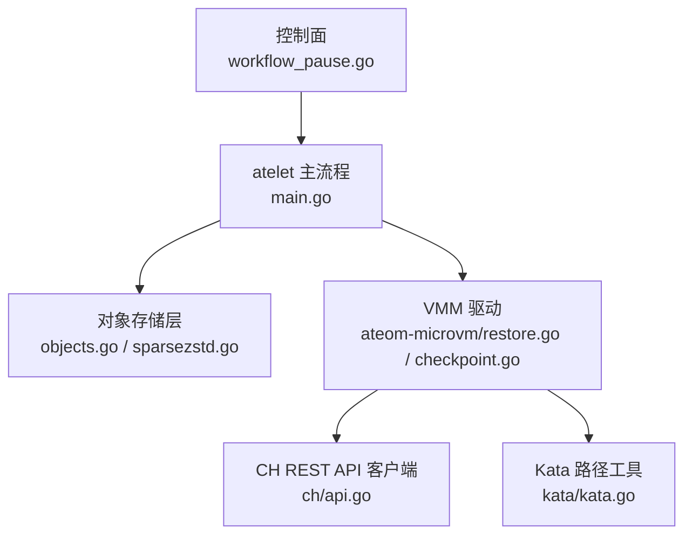
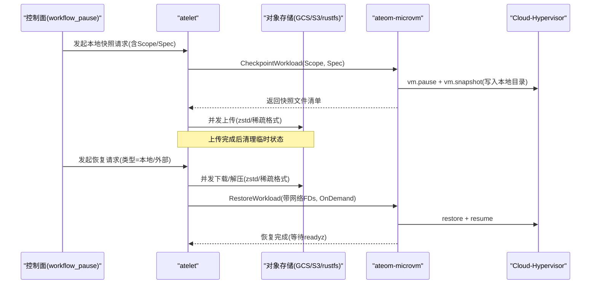
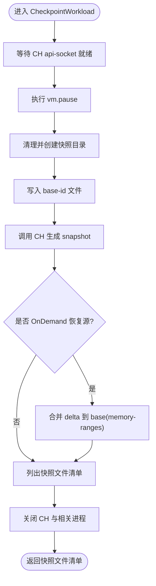
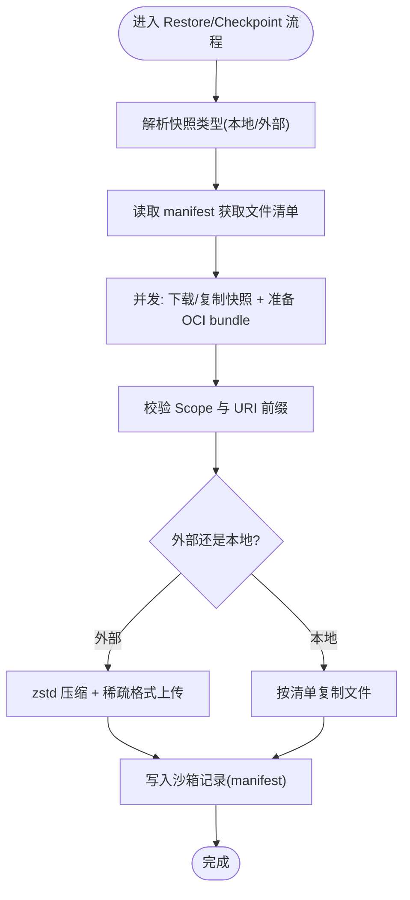
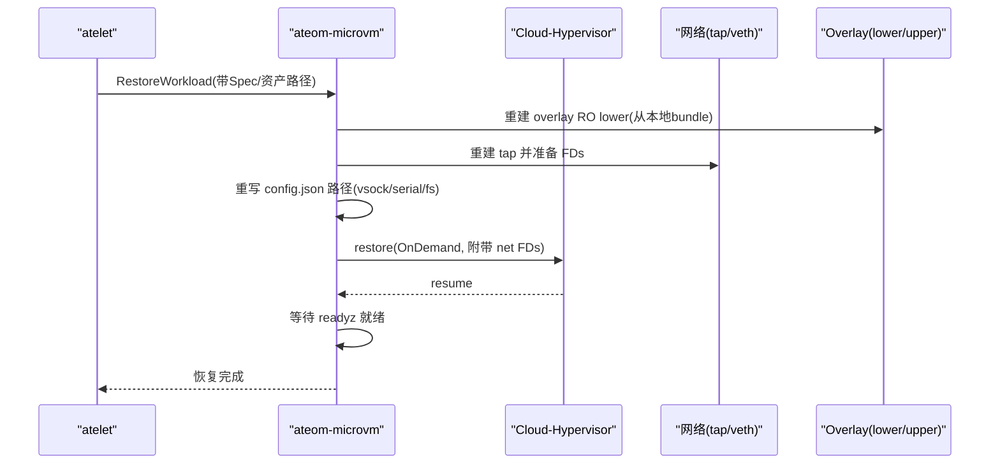
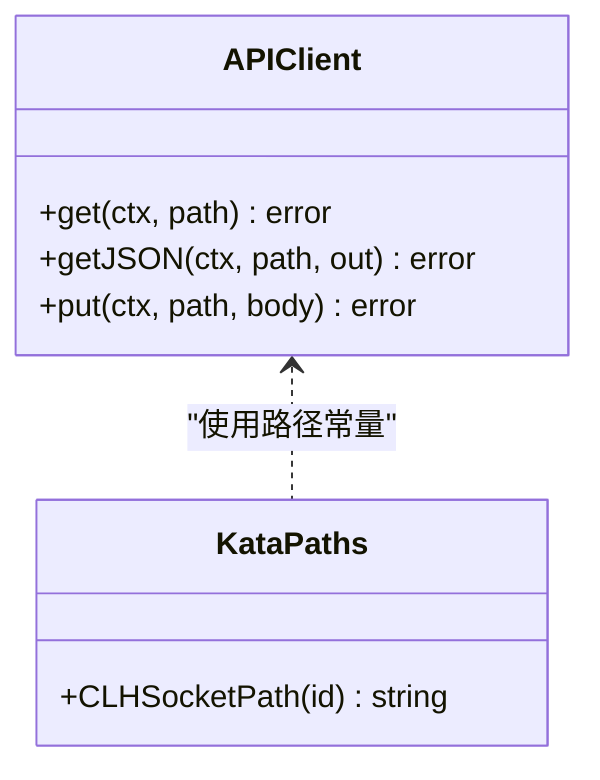
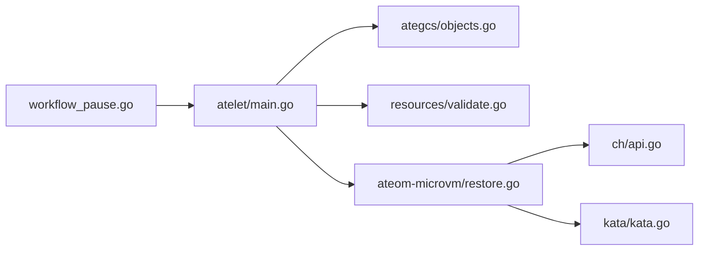

# 快照管理问题

<cite>
**本文引用的文件**   
- [cmd/ateom-microvm/checkpoint.go](file://cmd/ateom-microvm/checkpoint.go)
- [cmd/ateom-microvm/restore.go](file://cmd/ateom-microvm/restore.go)
- [cmd/atelet/main.go](file://cmd/atelet/main.go)
- [cmd/ateapi/internal/controlapi/workflow_pause.go](file://cmd/ateapi/internal/controlapi/workflow_pause.go)
- [cmd/ateom-microvm/internal/ch/api.go](file://cmd/ateom-microvm/internal/ch/api.go)
- [cmd/ateom-microvm/internal/kata/kata.go](file://cmd/ateom-microvm/internal/kata/kata.go)
- [cmd/atelet/internal/ategcs/objects.go](file://cmd/atelet/internal/ategcs/objects.go)
- [cmd/atelet/internal/ategcs/sparsezstd.go](file://cmd/atelet/internal/ategcs/sparsezstd.go)
- [internal/resources/validate.go](file://internal/resources/validate.go)
</cite>

## 目录
1. [简介](#简介)
2. [项目结构](#项目结构)
3. [核心组件](#核心组件)
4. [架构总览](#架构总览)
5. [详细组件分析](#详细组件分析)
6. [依赖关系分析](#依赖关系分析)
7. [性能考虑](#性能考虑)
8. [故障排查指南](#故障排查指南)
9. [结论](#结论)
10. [附录](#附录)

## 简介
本文件围绕“快照创建、保存、恢复”的常见问题与解决方案展开，聚焦以下主题：
- 快照格式错误、数据损坏、版本不兼容的诊断方法
- 内存快照与文件系统快照的区别及各自的问题特征
- 快照性能优化建议（压缩算法选择、增量快照配置、并发控制）
- 快照完整性验证、备份策略设计与灾难恢复流程

该仓库实现了基于 Cloud-Hypervisor 的微虚拟机快照能力，结合 atelet 进行对象存储上传下载与 OCI bundle 准备，由 ateom-microvm 驱动 VMM 完成内存与网络设备的快照/恢复。

## 项目结构
与快照相关的关键路径与职责：
- ateom-microvm：负责调用 CH API 执行 pause/snapshot/restore/resume，并处理 overlay rootfs 与网络重建
- atelet：负责本地/外部快照的下载与解压、OCI bundle 准备、与 ateom 的 gRPC 交互
- ategcs：实现 zstd 压缩与稀疏格式读写、流式上传/下载
- controlapi：编排暂停工作流，触发本地快照并记录节点信息

图表来源
- [cmd/ateapi/internal/controlapi/workflow_pause.go:130-165](file://cmd/ateapi/internal/controlapi/workflow_pause.go#L130-L165)
- [cmd/atelet/main.go:454-583](file://cmd/atelet/main.go#L454-L583)
- [cmd/atelet/internal/ategcs/objects.go:156-251](file://cmd/atelet/internal/ategcs/objects.go#L156-L251)
- [cmd/atelet/internal/ategcs/sparsezstd.go:137-196](file://cmd/atelet/internal/ategcs/sparsezstd.go#L137-L196)
- [cmd/ateom-microvm/restore.go:52-207](file://cmd/ateom-microvm/restore.go#L52-L207)
- [cmd/ateom-microvm/checkpoint.go:44-154](file://cmd/ateom-microvm/checkpoint.go#L44-L154)
- [cmd/ateom-microvm/internal/ch/api.go:35-57](file://cmd/ateom-microvm/internal/ch/api.go#L35-L57)
- [cmd/ateom-microvm/internal/kata/kata.go:30-40](file://cmd/ateom-microvm/internal/kata/kata.go#L30-L40)

章节来源
- [cmd/ateapi/internal/controlapi/workflow_pause.go:130-165](file://cmd/ateapi/internal/controlapi/workflow_pause.go#L130-L165)
- [cmd/atelet/main.go:454-583](file://cmd/atelet/main.go#L454-L583)
- [cmd/atelet/internal/ategcs/objects.go:156-251](file://cmd/atelet/internal/ategcs/objects.go#L156-L251)
- [cmd/atelet/internal/ategcs/sparsezstd.go:137-196](file://cmd/atelet/internal/ategcs/sparsezstd.go#L137-L196)
- [cmd/ateom-microvm/restore.go:52-207](file://cmd/ateom-microvm/restore.go#L52-L207)
- [cmd/ateom-microvm/checkpoint.go:44-154](file://cmd/ateom-microvm/checkpoint.go#L44-L154)
- [cmd/ateom-microvm/internal/ch/api.go:35-57](file://cmd/ateom-microvm/internal/ch/api.go#L35-L57)
- [cmd/ateom-microvm/internal/kata/kata.go:30-40](file://cmd/ateom-microvm/internal/kata/kata.go#L30-L40)

## 核心组件
- 快照创建（CheckpointWorkload）
  - 通过 CH API 对 VM 执行 pause，随后写入 snapshot 目录（包含 config.json、state.json、memory-ranges 等），并在 OnDemand 恢复场景下将 delta 合并到 base，形成完整可重入的快照
  - 清理运行时资源并上报快照文件清单供 atelet 上传
- 快照保存（atelet）
  - 读取快照清单（manifest），并发下载/复制快照文件；使用 zstd 压缩与稀疏格式传输；同时准备 OCI bundle
  - 将沙箱二进制清单持久化到本地，用于后续一致性恢复
- 快照恢复（RestoreWorkload）
  - 重写快照中的 socket 路径至当前节点，重建 overlay RO lower 与网络 tap FDs，以 OnDemand 模式恢复内存，等待 readyz 就绪后恢复日志转发

章节来源
- [cmd/ateom-microvm/checkpoint.go:44-154](file://cmd/ateom-microvm/checkpoint.go#L44-L154)
- [cmd/atelet/main.go:454-583](file://cmd/atelet/main.go#L454-L583)
- [cmd/ateom-microvm/restore.go:52-207](file://cmd/ateom-microvm/restore.go#L52-L207)

## 架构总览
下图展示了从暂停到恢复的端到端流程，包括对象存储与 VMM 交互。

图表来源
- [cmd/ateapi/internal/controlapi/workflow_pause.go:130-165](file://cmd/ateapi/internal/controlapi/workflow_pause.go#L130-L165)
- [cmd/atelet/main.go:454-583](file://cmd/atelet/main.go#L454-L583)
- [cmd/atelet/internal/ategcs/objects.go:156-251](file://cmd/atelet/internal/ategcs/objects.go#L156-L251)
- [cmd/ateom-microvm/checkpoint.go:44-154](file://cmd/ateom-microvm/checkpoint.go#L44-L154)
- [cmd/ateom-microvm/restore.go:52-207](file://cmd/ateom-microvm/restore.go#L52-L207)

## 详细组件分析

### 组件A：快照创建（CheckpointWorkload）
- 关键行为
  - 等待 CH api-socket 就绪，执行 pause
  - 清空并创建快照目录，记录 baseID（用于跨节点恢复时定位 golden image）
  - 调用 CH 生成 snapshot（config.json/state.json/memory-ranges）
  - 若为 OnDemand 恢复后的再次快照，将 delta 合并到 base，确保快照自包含
  - 列出快照文件清单并 teardown 运行时进程
- 常见问题与诊断
  - CH API 连接失败或超时：检查 unix socket 路径与权限
  - snapshot 写入失败：确认磁盘空间与目录权限
  - OnDemand delta 合并失败：确认 restoreSourceDir 存在且可写
- 性能要点
  - pause 与 snapshot 阶段耗时分别记录，便于定位瓶颈
  - teardown 阶段尽量快速释放资源，避免阻塞

图表来源
- [cmd/ateom-microvm/checkpoint.go:44-154](file://cmd/ateom-microvm/checkpoint.go#L44-L154)

章节来源
- [cmd/ateom-microvm/checkpoint.go:44-154](file://cmd/ateom-microvm/checkpoint.go#L44-L154)

### 组件B：快照保存（atelet 下载/上传与压缩）
- 关键行为
  - 解析快照类型（本地/外部），读取 manifest 获取沙箱资产与快照文件清单
  - 并发下载/复制快照文件，使用 zstd 压缩与稀疏格式；并行准备 OCI bundle
  - 将沙箱二进制清单落盘，保证后续一致性
- 常见问题与诊断
  - manifest 读取/解析失败：检查本地路径或远程 URL 有效性
  - 下载/解压失败：检查网络连通性与对象存储权限
  - 并发任务失败：errgroup 会聚合错误，需逐一排查具体文件
- 性能要点
  - 下载/解压与 OCI 准备并行执行，缩短冷启动恢复时间
  - 使用 SpeedFastest 与多核压缩，降低临界路径延迟

图表来源
- [cmd/atelet/main.go:454-583](file://cmd/atelet/main.go#L454-L583)
- [cmd/atelet/internal/ategcs/objects.go:156-251](file://cmd/atelet/internal/ategcs/objects.go#L156-L251)
- [internal/resources/validate.go:150-174](file://internal/resources/validate.go#L150-L174)

章节来源
- [cmd/atelet/main.go:454-583](file://cmd/atelet/main.go#L454-L583)
- [cmd/atelet/internal/ategcs/objects.go:156-251](file://cmd/atelet/internal/ategcs/objects.go#L156-L251)
- [internal/resources/validate.go:150-174](file://internal/resources/validate.go#L150-L174)

### 组件C：快照恢复（RestoreWorkload）
- 关键行为
  - 重写快照 config.json 中的 vsock/serial/fs 路径至当前节点
  - 重建 overlay RO lower（从本地 OCI bundle）与网络 tap FDs
  - 以 OnDemand 模式恢复内存，resume 后等待容器 readyz 就绪
  - 重新建立 kata-agent 日志转发
- 常见问题与诊断
  - 路径重写失败：检查 config.json 结构与当前节点路径
  - 网络重建失败：确认 tap 设备创建与 FD 传递
  - OnDemand 恢复失败：确认 restoreDir 完整且未被清理
- 性能要点
  - OnDemand 恢复显著降低内存恢复延迟，并保持 SPARSE 布局利于下次快照

图表来源
- [cmd/ateom-microvm/restore.go:52-207](file://cmd/ateom-microvm/restore.go#L52-L207)

章节来源
- [cmd/ateom-microvm/restore.go:52-207](file://cmd/ateom-microvm/restore.go#L52-L207)

### 组件D：CH REST API 客户端与 Kata 路径工具
- CH API 客户端
  - 通过 unix socket 访问 CH REST API，禁用 keep-alive 以避免挂起
  - 提供 get/getJSON/put 通用方法与 snapshot 配置结构
- Kata 路径工具
  - 提供默认 CLH socket 路径与 per-sandbox 目录约定

图表来源
- [cmd/ateom-microvm/internal/ch/api.go:35-57](file://cmd/ateom-microvm/internal/ch/api.go#L35-L57)
- [cmd/ateom-microvm/internal/kata/kata.go:30-40](file://cmd/ateom-microvm/internal/kata/kata.go#L30-L40)

章节来源
- [cmd/ateom-microvm/internal/ch/api.go:35-57](file://cmd/ateom-microvm/internal/ch/api.go#L35-L57)
- [cmd/ateom-microvm/internal/kata/kata.go:30-40](file://cmd/ateom-microvm/internal/kata/kata.go#L30-L40)

## 依赖关系分析
- 组件耦合
  - workflow_pause 依赖 atelet 的 Checkpoint/Restore 接口
  - atelet 依赖 ategcs 的压缩/传输与 validate 的 URI 校验
  - ateom-microvm 依赖 ch/api 与 kata 路径工具
- 外部依赖
  - 对象存储后端（GCS/S3/rustfs）通过 ObjectStorage 接口抽象
  - CH REST API 作为 VMM 控制面

图表来源
- [cmd/ateapi/internal/controlapi/workflow_pause.go:130-165](file://cmd/ateapi/internal/controlapi/workflow_pause.go#L130-L165)
- [cmd/atelet/main.go:454-583](file://cmd/atelet/main.go#L454-L583)
- [cmd/atelet/internal/ategcs/objects.go:156-251](file://cmd/atelet/internal/ategcs/objects.go#L156-L251)
- [internal/resources/validate.go:150-174](file://internal/resources/validate.go#L150-L174)
- [cmd/ateom-microvm/restore.go:52-207](file://cmd/ateom-microvm/restore.go#L52-L207)
- [cmd/ateom-microvm/internal/ch/api.go:35-57](file://cmd/ateom-microvm/internal/ch/api.go#L35-L57)
- [cmd/ateom-microvm/internal/kata/kata.go:30-40](file://cmd/ateom-microvm/internal/kata/kata.go#L30-L40)

章节来源
- [cmd/ateapi/internal/controlapi/workflow_pause.go:130-165](file://cmd/ateapi/internal/controlapi/workflow_pause.go#L130-L165)
- [cmd/atelet/main.go:454-583](file://cmd/atelet/main.go#L454-L583)
- [cmd/atelet/internal/ategcs/objects.go:156-251](file://cmd/atelet/internal/ategcs/objects.go#L156-L251)
- [internal/resources/validate.go:150-174](file://internal/resources/validate.go#L150-L174)
- [cmd/ateom-microvm/restore.go:52-207](file://cmd/ateom-microvm/restore.go#L52-L207)
- [cmd/ateom-microvm/internal/ch/api.go:35-57](file://cmd/ateom-microvm/internal/ch/api.go#L35-L57)
- [cmd/ateom-microvm/internal/kata/kata.go:30-40](file://cmd/ateom-microvm/internal/kata/kata.go#L30-L40)

## 性能考虑
- 压缩算法选择
  - 使用 zstd 的 SpeedFastest 级别与多核编码，在临界路径上优先速度而非极致压缩比
  - 针对大对象（内存镜像）采用稀疏格式，仅压缩非零区域，显著减少 I/O 与 CPU 开销
- 并发控制
  - 下载/解压与 OCI bundle 准备并行执行，隐藏较长链路延迟
  - 对象存储上传/下载按文件并发，errgroup 聚合错误
- 增量快照配置
  - OnDemand 恢复保持 SPARSE 布局，避免 eager 全量拷贝导致的下次快照放大
  - OnDemand 恢复后再做快照时，自动合并 delta 到 base，确保快照自包含
- 网络与 IO
  - CH API 禁用 keep-alive，避免连接复用导致的挂起
  - 使用 SCM_RIGHTS 传递 tap FDs，避免重复创建网络设备

章节来源
- [cmd/atelet/internal/ategcs/objects.go:156-251](file://cmd/atelet/internal/ategcs/objects.go#L156-L251)
- [cmd/atelet/internal/ategcs/sparsezstd.go:137-196](file://cmd/atelet/internal/ategcs/sparsezstd.go#L137-L196)
- [cmd/ateom-microvm/restore.go:164-176](file://cmd/ateom-microvm/restore.go#L164-L176)
- [cmd/ateom-microvm/internal/ch/api.go:35-57](file://cmd/ateom-microvm/internal/ch/api.go#L35-L57)

## 故障排查指南
- 快照格式错误
  - 现象：下载/解压时报错“不支持的稀疏格式版本”或“范围越界”
  - 诊断：检查 sparsezstd 的版本号与 extent 边界校验逻辑
  - 修复：升级构建以支持目标版本，或回滚到兼容版本
- 数据损坏
  - 现象：解压后文件逻辑大小与实际写入不一致，或出现空洞异常
  - 诊断：核对 decodeContent/copyZstdSparse 的写入与截断逻辑
  - 修复：校验对象存储完整性，必要时重新下载
- 版本不兼容
  - 现象：snapshot 清单解析失败或沙箱资产不匹配
  - 诊断：检查 manifest 中记录的沙箱二进制清单与当前节点资产
  - 修复：确保 Restore 时使用与快照一致的沙箱版本
- CH 相关错误
  - 现象：pause/snapshot/restore/resume 失败
  - 诊断：查看 CH API 响应与 unix socket 可达性
  - 修复：重启 CH 或清理残留 socket 与进程
- 网络与 overlay 问题
  - 现象：恢复后容器不可达或 rootfs 不可写
  - 诊断：检查 tap FDs 传递与 overlay lower 路径重写
  - 修复：确认 virtiofsd 与 tap 设备正常，路径一致

章节来源
- [cmd/atelet/internal/ategcs/sparsezstd.go:137-196](file://cmd/atelet/internal/ategcs/sparsezstd.go#L137-L196)
- [cmd/atelet/internal/ategcs/objects.go:347-384](file://cmd/atelet/internal/ategcs/objects.go#L347-L384)
- [cmd/ateom-microvm/restore.go:209-254](file://cmd/ateom-microvm/restore.go#L209-L254)
- [cmd/ateom-microvm/internal/ch/api.go:35-57](file://cmd/ateom-microvm/internal/ch/api.go#L35-L57)

## 结论
本系统通过 CH 微虚拟机快照与 atelet 的对象存储集成，提供了高可用、低延迟的内存与文件系统状态迁移能力。通过对压缩算法、稀疏格式、并发控制与 OnDemand 恢复的精细化设计，系统在性能与可靠性之间取得良好平衡。建议在部署中严格校验快照清单与资产版本，配合监控与告警，持续优化快照生命周期管理。

## 附录
- 快照完整性验证建议
  - 校验 manifest 与文件清单一致性
  - 校验对象存储对象的完整性（如服务端校验和）
  - 在恢复前对 memory-ranges 进行稀疏格式自检（版本与范围）
- 备份策略设计
  - 定期执行 Full 快照，结合 Data 快照降低存储成本
  - 保留最近 N 个快照，并归档到异地存储
- 灾难恢复流程
  - 从最新有效快照恢复，优先 OnDemand 模式
  - 若节点不可用，选择具备快照副本的节点进行恢复
  - 恢复后验证应用服务就绪与健康检查
