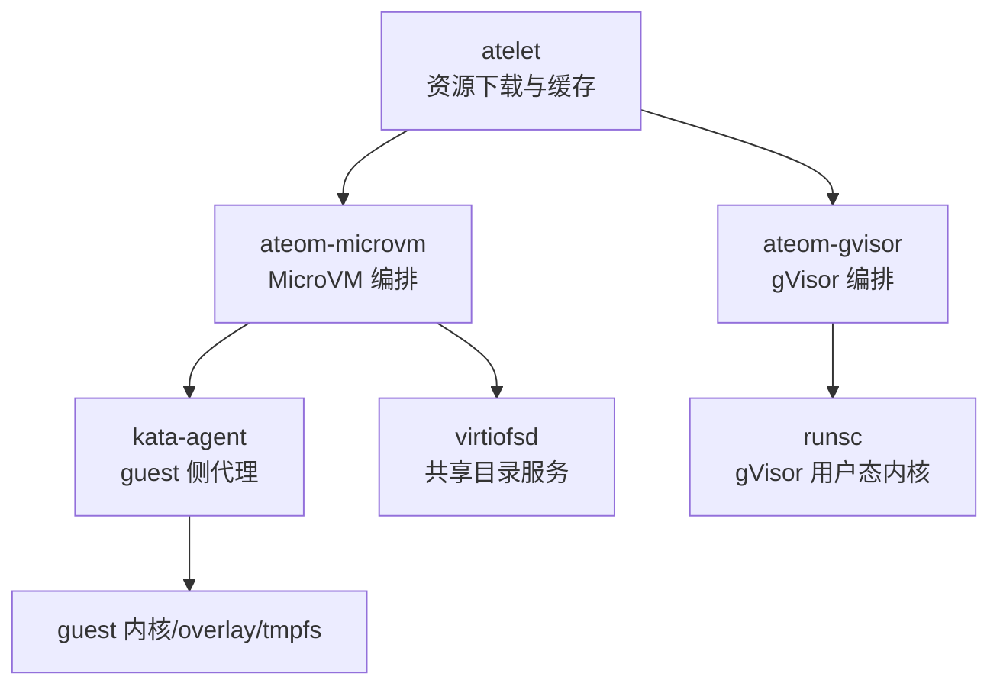
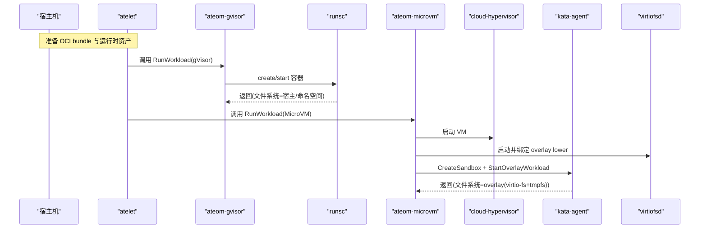
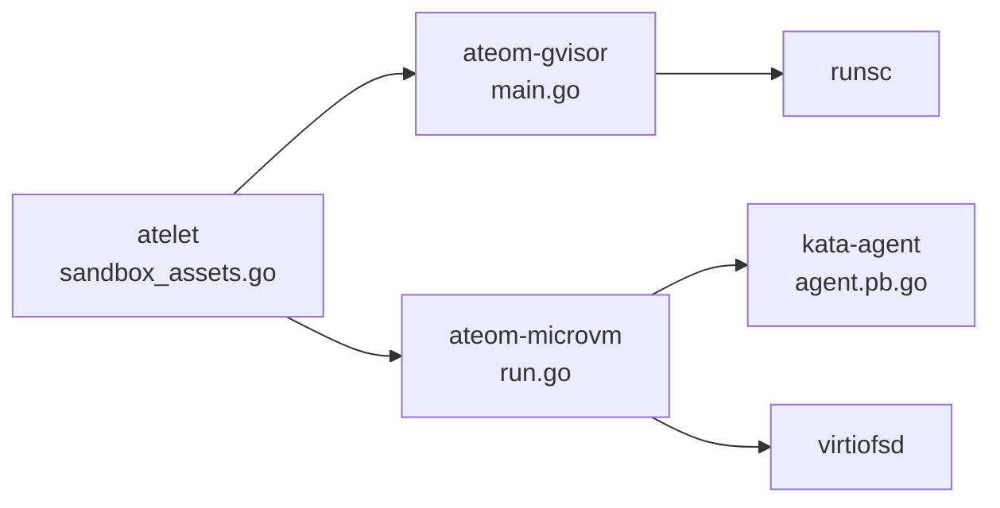
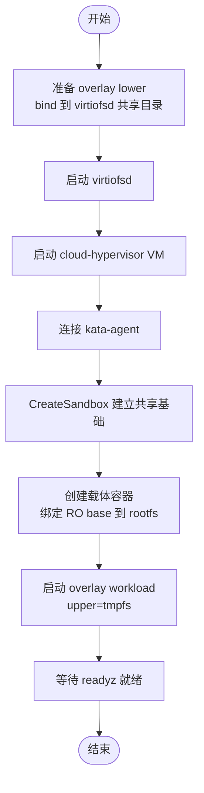

# 文件系统挂载问题

<cite>
**本文引用的文件列表**
- [cmd/atelet/sandbox_assets.go](file://cmd/atelet/sandbox_assets.go)
- [cmd/ateom-microvm/run.go](file://cmd/ateom-microvm/run.go)
- [cmd/ateom-gvisor/main.go](file://cmd/ateom-gvisor/main.go)
- [cmd/ateom-microvm/internal/kata/config.go](file://cmd/ateom-microvm/internal/kata/config.go)
- [cmd/ateom-microvm/internal/third_party/kata/agentpb/agent.pb.go](file://cmd/ateom-microvm/internal/third_party/kata/agentpb/agent.pb.go)
- [cmd/ateom-microvm/internal/third_party/kata/agentpb/oci.pb.go](file://cmd/ateom-microvm/internal/third_party/kata/agentpb/oci.pb.go)
- [cmd/ateapi/main.go](file://cmd/ateapi/main.go)
- [cmd/atelet/main.go](file://cmd/atelet/main.go)
</cite>

## 目录
1. [简介](#简介)
2. [项目结构](#项目结构)
3. [核心组件](#核心组件)
4. [架构总览](#架构总览)
5. [详细组件分析](#详细组件分析)
6. [依赖关系分析](#依赖关系分析)
7. [性能与容量管理](#性能与容量管理)
8. [故障排查指南](#故障排查指南)
9. [结论](#结论)
10. [附录](#附录)

## 简介
本文件聚焦于容器沙箱中“文件系统挂载与访问”问题的系统化排查方法，覆盖以下场景：
- 临时文件系统（如 tmpfs）
- 持久化存储卷（块设备、共享目录等）
- 只读根文件系统（overlay 的 lower 层或只读 rootfs）
- 权限拒绝、路径不存在、磁盘空间不足等常见错误
- gVisor 与 MicroVM（kata + cloud-hypervisor + virtio-fs）两种运行时在文件系统模型上的差异及处理策略
- 文件系统监控、容量管理与性能调优最佳实践

## 项目结构
仓库中与文件系统挂载和访问密切相关的代码主要分布在：
- atelet：负责拉取并缓存运行态资产（runsc、kata 镜像等），包含文件系统错误包装与终端错误分类逻辑
- ateom-gvisor：gVisor 运行时编排入口，创建/启动/恢复/检查点容器
- ateom-microvm：MicroVM 运行时编排入口，基于 kata-agent/virtio-fs 构建 overlay 根文件系统
- agentpb：kata-agent 协议定义，包含 Storage/Mount 等与挂载相关的数据结构
- 指标与可观测性：ateapi/atelet 暴露 metrics 服务，用于系统级监控

图表来源
- [cmd/atelet/sandbox_assets.go:91-184](file://cmd/atelet/sandbox_assets.go#L91-L184)
- [cmd/ateom-gvisor/main.go:180-237](file://cmd/ateom-gvisor/main.go#L180-L237)
- [cmd/ateom-microvm/run.go:174-368](file://cmd/ateom-microvm/run.go#L174-L368)
- [cmd/ateom-microvm/internal/kata/config.go:24-73](file://cmd/ateom-microvm/internal/kata/config.go#L24-L73)

章节来源
- [cmd/atelet/sandbox_assets.go:91-184](file://cmd/atelet/sandbox_assets.go#L91-L184)
- [cmd/ateom-gvisor/main.go:180-237](file://cmd/ateom-gvisor/main.go#L180-L237)
- [cmd/ateom-microvm/run.go:174-368](file://cmd/ateom-microvm/run.go#L174-L368)
- [cmd/ateom-microvm/internal/kata/config.go:24-73](file://cmd/ateom-microvm/internal/kata/config.go#L24-L73)

## 核心组件
- 文件系统错误包装与分类：将常见的“不可恢复”文件系统错误标记为终端错误，便于上层快速定位与告警
- gVisor 运行时：通过 runsc 直接管理容器进程，文件系统由宿主机/命名空间提供
- MicroVM 运行时：通过 kata-agent 在 guest 内建立 overlay 根文件系统（lower 来自 virtio-fs，upper 为 guest tmpfs）
- 挂载协议与数据结构：Storage/Mount 等字段描述源、目标、类型、选项、FSGroup、是否共享等

章节来源
- [cmd/atelet/sandbox_assets.go:243-266](file://cmd/atelet/sandbox_assets.go#L243-L266)
- [cmd/ateom-gvisor/main.go:180-237](file://cmd/ateom-gvisor/main.go#L180-L237)
- [cmd/ateom-microvm/run.go:478-538](file://cmd/ateom-microvm/run.go#L478-L538)
- [cmd/ateom-microvm/internal/third_party/kata/agentpb/agent.pb.go:3264-3370](file://cmd/ateom-microvm/internal/third_party/kata/agentpb/agent.pb.go#L3264-L3370)
- [cmd/ateom-microvm/internal/third_party/kata/agentpb/oci.pb.go:572-585](file://cmd/ateom-microvm/internal/third_party/kata/agentpb/oci.pb.go#L572-L585)

## 架构总览
下图展示了两种运行时在文件系统层面的关键差异：
- gVisor：容器进程在宿主机命名空间中执行，文件系统由宿主/OCI bundle 提供；无 guest 层
- MicroVM：guest 内核通过 virtio-fs 挂载只读 lower，overlay upper 使用 guest tmpfs，kata-agent 负责创建 sandbox 与容器

图表来源
- [cmd/ateom-gvisor/main.go:180-237](file://cmd/ateom-gvisor/main.go#L180-L237)
- [cmd/ateom-microvm/run.go:174-368](file://cmd/ateom-microvm/run.go#L174-L368)
- [cmd/ateom-microvm/run.go:478-538](file://cmd/ateom-microvm/run.go#L478-L538)

## 详细组件分析

### gVisor 运行时文件系统行为
- 容器以 runsc 方式运行，文件系统来源于宿主机与 OCI bundle，不涉及 guest 层
- 典型问题：
  - 只读根文件系统：若应用尝试写 / 或只读目录，会触发 EROFS 类错误
  - 权限拒绝：UID/GID 映射不一致导致无法写入
  - 路径不存在：bundle 未正确生成或路径拼写错误
  - 磁盘空间不足：宿主机分区满或 cgroup/quota 限制

章节来源
- [cmd/ateom-gvisor/main.go:180-237](file://cmd/ateom-gvisor/main.go#L180-L237)

### MicroVM 运行时文件系统行为
- 每个容器的 rootfs 采用 overlay：
  - lower：通过 virtio-fs 挂载的只读镜像（find-paths 子目录）
  - upper：guest 内的 tmpfs（可写，不占用宿主机磁盘）
- 关键流程：
  - 准备 overlay lower（bind 到 virtiofsd 共享目录）
  - 启动 virtiofsd 供 CH 按需页面读取
  - 通过 kata-agent 创建 sandbox 与 overlay workload
- 典型问题：
  - virtio-fs 挂载失败：tag/socket/PCI 配置不正确
  - overlay 状态异常：upper/lower 路径不存在或权限不对
  - guest tmpfs 耗尽：内存受限导致 tmpfs 写失败
  - DNS 解析失败：未注入 resolv.conf 导致应用无法解析域名

章节来源
- [cmd/ateom-microvm/run.go:399-422](file://cmd/ateom-microvm/run.go#L399-L422)
- [cmd/ateom-microvm/run.go:478-538](file://cmd/ateom-microvm/run.go#L478-L538)
- [cmd/ateom-microvm/run.go:152-172](file://cmd/ateom-microvm/run.go#L152-L172)

### 挂载协议与数据结构（kata-agent）
- Storage：描述驱动、源、目标挂载点、fstype、options、FSGroup、是否共享等
- Mount：destination/source/type/options，支持 vm:/dev/hostfs 与 tmp:/ 等特殊前缀
- FSGroup：指定组 ID 与变更策略，用于挂载后批量 chgrp

章节来源
- [cmd/ateom-microvm/internal/third_party/kata/agentpb/agent.pb.go:3264-3370](file://cmd/ateom-microvm/internal/third_party/kata/agentpb/agent.pb.go#L3264-L3370)
- [cmd/ateom-microvm/internal/third_party/kata/agentpb/oci.pb.go:572-585](file://cmd/ateom-microvm/internal/third_party/kata/agentpb/oci.pb.go#L572-L585)
- [cmd/ateom-microvm/internal/third_party/kata/agentpb/agent.pb.go:3102-3114](file://cmd/ateom-microvm/internal/third_party/kata/agentpb/agent.pb.go#L3102-L3114)

### 文件系统错误包装与终端错误分类
- 将 os.ErrNotExist、os.ErrPermission、EROFS、EISDIR、ENOTDIR、ENAMETOOLONG、ELOOP 等归类为“终端文件系统错误”，便于上层快速识别不可重试的错误
- 在静态文件目录创建、临时文件创建、重命名等操作处统一包装错误

章节来源
- [cmd/atelet/sandbox_assets.go:243-266](file://cmd/atelet/sandbox_assets.go#L243-L266)
- [cmd/atelet/sandbox_assets.go:91-111](file://cmd/atelet/sandbox_assets.go#L91-L111)
- [cmd/atelet/sandbox_assets.go:120-184](file://cmd/atelet/sandbox_assets.go#L120-L184)

## 依赖关系分析
- atelet 负责下载并校验 runsc/kata 镜像等资产，确保本地缓存可用
- ateom-gvisor 直接调用 runsc 管理容器生命周期
- ateom-microvm 协调 cloud-hypervisor、virtiofsd 与 kata-agent，完成 overlay 根文件系统装配
- agentpb 定义了跨边界（宿主机/guest）的挂载与存储语义

图表来源
- [cmd/atelet/sandbox_assets.go:91-184](file://cmd/atelet/sandbox_assets.go#L91-L184)
- [cmd/ateom-gvisor/main.go:180-237](file://cmd/ateom-gvisor/main.go#L180-L237)
- [cmd/ateom-microvm/run.go:174-368](file://cmd/ateom-microvm/run.go#L174-L368)
- [cmd/ateom-microvm/internal/third_party/kata/agentpb/agent.pb.go:3264-3370](file://cmd/ateom-microvm/internal/third_party/kata/agentpb/agent.pb.go#L3264-L3370)

## 性能与容量管理
- 监控与指标
  - 各组件均提供 metrics 监听地址，可通过 Prometheus 抓取
  - 快照大小指标可用于评估对象存储与网络吞吐压力
- 容量管理建议
  - 控制静态文件缓存目录大小，避免无限增长
  - 对下载的资产设置最大字节上限，防止恶意或损坏 URL 导致磁盘打满
  - 在 MicroVM 中使用 guest tmpfs 作为 upper，注意 guest 内存限制对 tmpfs 容量的影响
- 性能调优
  - 合理设置 virtio-fs 队列数与队列大小，降低 I/O 延迟
  - 调整 guest 内存/CPU 参数，避免频繁换页导致的 overlay 性能抖动
  - 启用调试控制台与 agent debug 日志，辅助定位复杂问题

章节来源
- [cmd/ateapi/main.go:57-101](file://cmd/ateapi/main.go#L57-L101)
- [cmd/atelet/main.go:65-101](file://cmd/atelet/main.go#L65-L101)
- [cmd/atelet/main.go:272-301](file://cmd/atelet/main.go#L272-L301)
- [cmd/ateom-microvm/internal/kata/config.go:75-91](file://cmd/ateom-microvm/internal/kata/config.go#L75-L91)
- [cmd/ateom-microvm/run.go:443-476](file://cmd/ateom-microvm/run.go#L443-L476)

## 故障排查指南

### 通用诊断步骤
- 确认错误类型是否为“终端文件系统错误”（如 EROFS、权限拒绝、路径不存在）
- 检查宿主机/命名空间/客机的文件系统状态与权限
- 查看组件日志与 serial/console 输出，必要时开启 agent debug 日志

章节来源
- [cmd/atelet/sandbox_assets.go:243-266](file://cmd/atelet/sandbox_assets.go#L243-L266)
- [cmd/ateom-microvm/run.go:324-342](file://cmd/ateom-microvm/run.go#L324-L342)
- [cmd/ateom-microvm/internal/kata/config.go:75-91](file://cmd/ateom-microvm/internal/kata/config.go#L75-L91)

### 只读文件系统（EROFS）
- 现象：应用尝试写入只读目录或只读 rootfs 报错
- 排查要点：
  - gVisor：确认应用是否误写只读路径；如需持久化，应挂载数据卷到指定目录
  - MicroVM：lower 层为只读，upper 层为 tmpfs；确认 overlay 已正确装配且 upper 可写
- 参考实现位置：
  - 终端错误包含 EROFS
  - MicroVM overlay 工作负载启动流程

章节来源
- [cmd/atelet/sandbox_assets.go:250-266](file://cmd/atelet/sandbox_assets.go#L250-L266)
- [cmd/ateom-microvm/run.go:512-538](file://cmd/ateom-microvm/run.go#L512-L538)

### 权限拒绝（Permission Denied）
- 现象：打开/写入文件报权限错误
- 排查要点：
  - 检查 UID/GID 映射与 FSGroup 策略
  - 确认挂载点与文件的 mode 位是否正确
  - 在 MicroVM 中，确认载体容器与 overlay workload 的权限一致性
- 参考实现位置：
  - 终端错误包含 os.ErrPermission
  - FSGroup 结构与 group 变更策略

章节来源
- [cmd/atelet/sandbox_assets.go:250-266](file://cmd/atelet/sandbox_assets.go#L250-L266)
- [cmd/ateom-microvm/internal/third_party/kata/agentpb/agent.pb.go:3102-3114](file://cmd/ateom-microvm/internal/third_party/kata/agentpb/agent.pb.go#L3102-L3114)

### 路径不存在（No such file or directory）
- 现象：访问文件或目录时报路径不存在
- 排查要点：
  - 确认 bundle 是否正确生成，rootfs 是否存在
  - 在 MicroVM 中，确认 find-paths 下 lower 目录存在且被 virtiofsd 正确共享
- 参考实现位置：
  - 终端错误包含 os.ErrNotExist
  - overlay lower 的 staging 流程

章节来源
- [cmd/atelet/sandbox_assets.go:250-266](file://cmd/atelet/sandbox_assets.go#L250-L266)
- [cmd/ateom-microvm/run.go:399-422](file://cmd/ateom-microvm/run.go#L399-L422)

### 磁盘空间不足（No space left on device）
- 现象：写入失败，提示磁盘空间不足
- 排查要点：
  - gVisor：检查宿主机分区使用情况与配额
  - MicroVM：检查 guest tmpfs 容量（受限于 guest 内存）与 swap 配置
- 参考实现位置：
  - 资产下载时设置最大字节上限，避免单文件过大
  - guest 配置中可调整内存/CPU 参数

章节来源
- [cmd/atelet/sandbox_assets.go:159-168](file://cmd/atelet/sandbox_assets.go#L159-L168)
- [cmd/ateom-microvm/internal/kata/config.go:56-73](file://cmd/ateom-microvm/internal/kata/config.go#L56-L73)

### gVisor vs MicroVM 差异处理
- gVisor
  - 文件系统位于宿主机/命名空间，适合需要高性能 I/O 的场景
  - 注意宿主机权限与路径可见性
- MicroVM
  - 文件系统隔离更强，但需关注 virtio-fs 与 overlay 的装配细节
  - 注意 guest 资源限制对 tmpfs 的影响
- 共同点
  - 都支持挂载选项、FSGroup、共享存储等概念
  - 都需要正确的 DNS 配置（MicroVM 需注入 resolv.conf）

章节来源
- [cmd/ateom-gvisor/main.go:180-237](file://cmd/ateom-gvisor/main.go#L180-L237)
- [cmd/ateom-microvm/run.go:152-172](file://cmd/ateom-microvm/run.go#L152-L172)
- [cmd/ateom-microvm/internal/third_party/kata/agentpb/agent.pb.go:3264-3370](file://cmd/ateom-microvm/internal/third_party/kata/agentpb/agent.pb.go#L3264-L3370)

### 监控与可观测性
- 指标采集
  - 通过 metrics 监听地址暴露 Prometheus 指标
  - 记录快照大小等关键指标，辅助容量规划
- 日志与调试
  - 启用 agent debug 日志与调试控制台，获取更详细的 guest 侧信息
  - 捕获 serial/console 输出，辅助定位 boot 阶段问题

章节来源
- [cmd/ateapi/main.go:57-101](file://cmd/ateapi/main.go#L57-L101)
- [cmd/atelet/main.go:65-101](file://cmd/atelet/main.go#L65-L101)
- [cmd/atelet/main.go:272-301](file://cmd/atelet/main.go#L272-L301)
- [cmd/ateom-microvm/internal/kata/config.go:75-91](file://cmd/ateom-microvm/internal/kata/config.go#L75-L91)

## 结论
- 针对不同的运行时（gVisor/MicroVM），文件系统模型与隔离级别不同，需分别制定排查策略
- 使用统一的“终端文件系统错误”分类，有助于快速识别不可重试的问题
- 结合指标与日志，完善监控与可观测性，是保障稳定性的关键
- 在容量与性能方面，应关注宿主机/客机的磁盘与内存限制，以及 virtio-fs 的参数调优

## 附录

### 关键流程图：MicroVM overlay 启动

图表来源
- [cmd/ateom-microvm/run.go:399-422](file://cmd/ateom-microvm/run.go#L399-L422)
- [cmd/ateom-microvm/run.go:478-538](file://cmd/ateom-microvm/run.go#L478-L538)
- [cmd/ateom-microvm/run.go:174-368](file://cmd/ateom-microvm/run.go#L174-L368)
