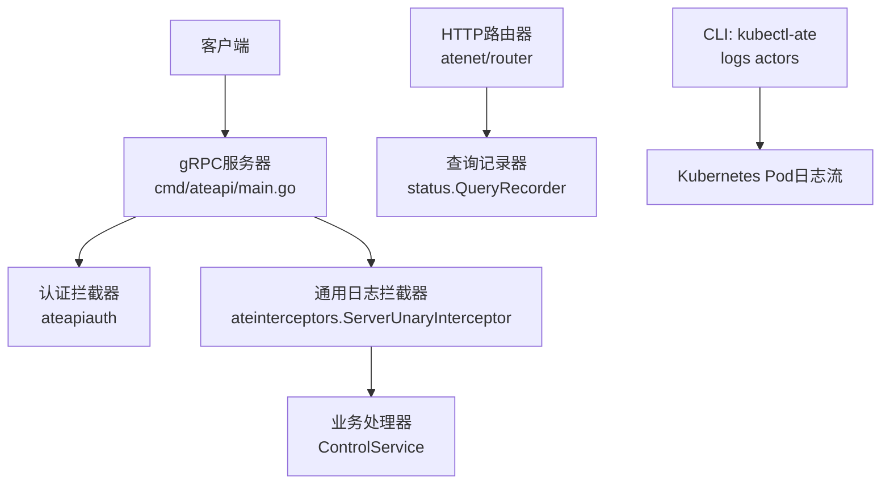
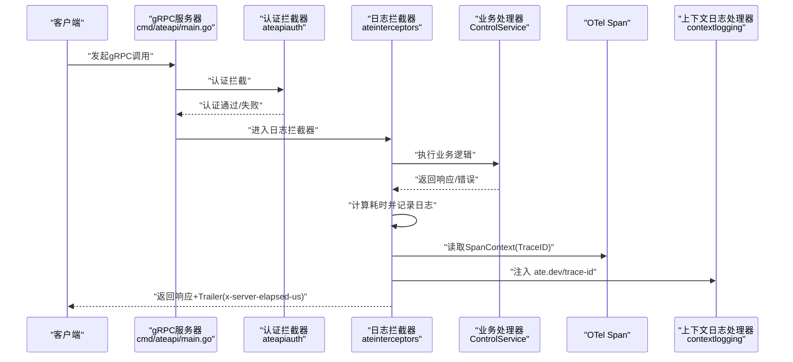
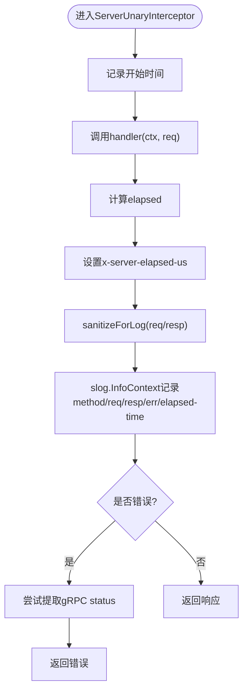
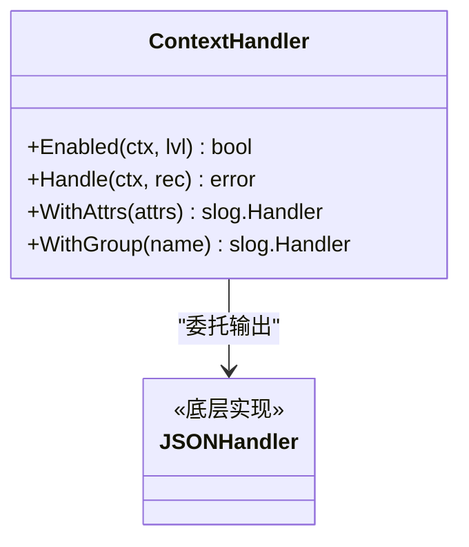
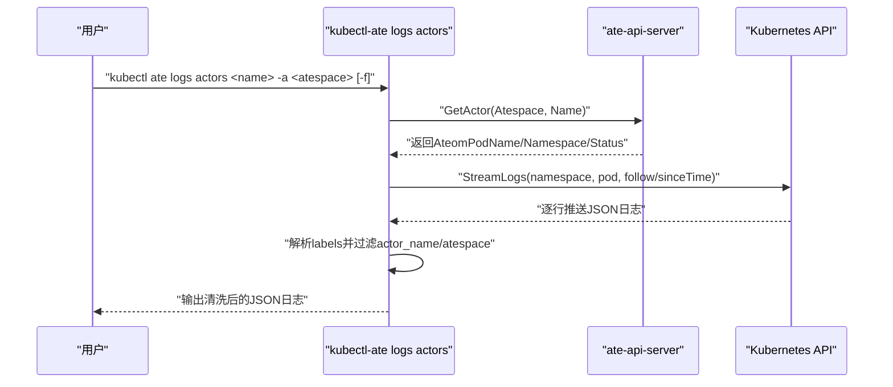
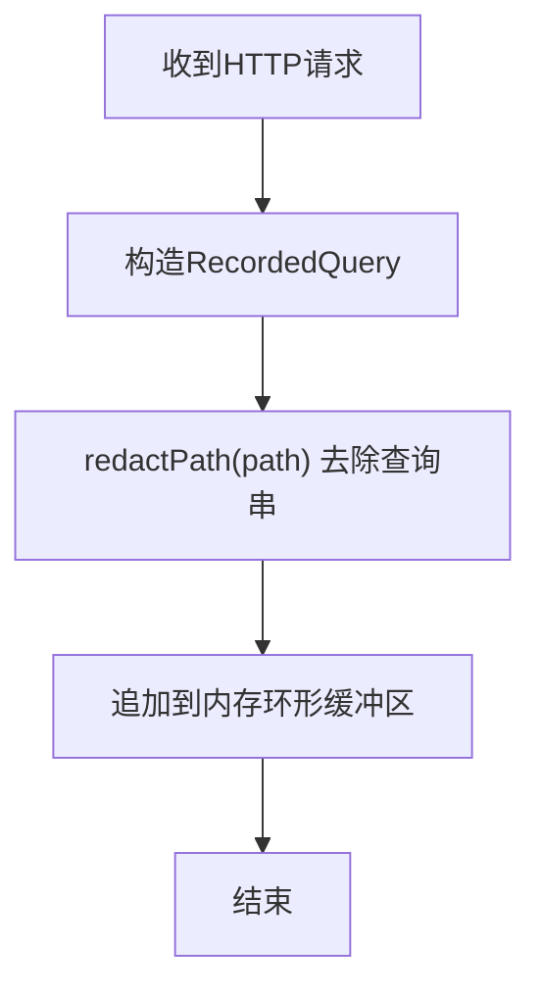
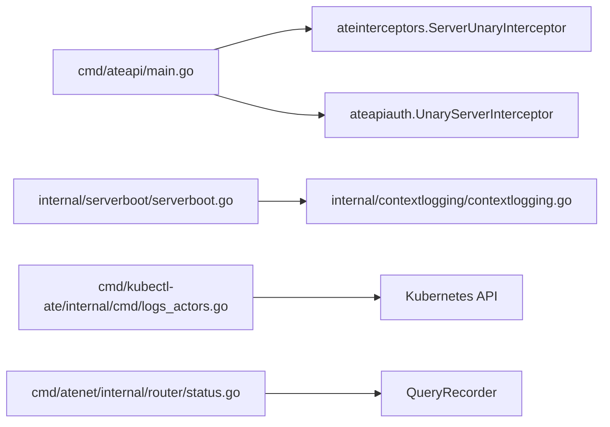

# API访问日志

<cite>
**本文引用的文件**   
- [cmd/ateapi/main.go](file://cmd/ateapi/main.go)
- [internal/ateinterceptors/ateinterceptors.go](file://internal/ateinterceptors/ateinterceptors.go)
- [internal/contextlogging/contextlogging.go](file://internal/contextlogging/contextlogging.go)
- [internal/serverboot/serverboot.go](file://internal/serverboot/serverboot.go)
- [cmd/kubectl-ate/internal/cmd/logs_actors.go](file://cmd/kubectl-ate/internal/cmd/logs_actors.go)
- [cmd/kubectl-ate/internal/cmd/logs.go](file://cmd/kubectl-ate/internal/cmd/logs.go)
- [cmd/atenet/internal/router/status.go](file://cmd/atenet/internal/router/status.go)
</cite>

## 目录
1. [简介](#简介)
2. [项目结构](#项目结构)
3. [核心组件](#核心组件)
4. [架构总览](#架构总览)
5. [详细组件分析](#详细组件分析)
6. [依赖关系分析](#依赖关系分析)
7. [性能考量](#性能考量)
8. [故障排查指南](#故障排查指南)
9. [结论](#结论)
10. [附录](#附录)

## 简介
本文件面向API访问日志，系统化说明gRPC与HTTP请求的完整记录机制，覆盖以下关键信息：
- 请求来源IP、用户身份、操作类型（创建、暂停、恢复、删除Actor）、请求参数、响应状态码、处理时间等采集点
- 结构化日志格式与字段定义
- 元数据标签注入（如 actor_name、actor_atespace、actor_uid）
- 使用 kubectl ate logs 查看实时日志的方法
- 集中式日志系统历史查询建议
- 安全敏感信息脱敏策略与日志轮转策略

## 项目结构
本项目采用多进程服务架构，API访问日志主要分布在以下位置：
- gRPC服务端拦截器：统一记录方法名、请求/响应摘要、错误、耗时，并设置可观测性Trailer
- 上下文日志处理器：自动注入TraceID到每条日志
- CLI工具：kubectl-ate 提供按Actor维度过滤和流式查看日志的能力
- HTTP路由层：对HTTP请求进行路径脱敏与基础访问记录

图表来源
- [cmd/ateapi/main.go:182-196](file://cmd/ateapi/main.go#L182-L196)
- [internal/ateinterceptors/ateinterceptors.go:36-72](file://internal/ateinterceptors/ateinterceptors.go#L36-L72)
- [cmd/atenet/internal/router/status.go:113-130](file://cmd/atenet/internal/router/status.go#L113-L130)
- [cmd/kubectl-ate/internal/cmd/logs_actors.go:279-307](file://cmd/kubectl-ate/internal/cmd/logs_actors.go#L279-L307)

章节来源
- [cmd/ateapi/main.go:182-196](file://cmd/ateapi/main.go#L182-L196)
- [internal/ateinterceptors/ateinterceptors.go:36-72](file://internal/ateinterceptors/ateinterceptors.go#L36-L72)
- [cmd/atenet/internal/router/status.go:113-130](file://cmd/atenet/internal/router/status.go#L113-L130)
- [cmd/kubectl-ate/internal/cmd/logs_actors.go:279-307](file://cmd/kubectl-ate/internal/cmd/logs_actors.go#L279-L307)

## 核心组件
- gRPC日志拦截器
  - 记录方法名、请求/响应对象（经脱敏）、错误、处理耗时
  - 通过Trailer返回服务器端处理耗时（微秒），避免客户端调度开销影响
- 上下文日志处理器
  - 从OpenTelemetry SpanContext提取TraceID，注入为 ate.dev/trace-id 字段
- CLI日志查看器
  - 支持一次性拉取或跟随模式（--follow）
  - 基于JSON日志中的 labels 或 logging.googleapis.com/labels 解析 actor_name 与 actor_atespace 进行过滤
- HTTP路由记录器
  - 记录请求时间戳、客户端、Host、Path（已脱敏查询串）、Method、Action、Target、Duration

章节来源
- [internal/ateinterceptors/ateinterceptors.go:36-72](file://internal/ateinterceptors/ateinterceptors.go#L36-L72)
- [internal/contextlogging/contextlogging.go:38-46](file://internal/contextlogging/contextlogging.go#L38-L46)
- [cmd/kubectl-ate/internal/cmd/logs_actors.go:309-391](file://cmd/kubectl-ate/internal/cmd/logs_actors.go#L309-L391)
- [cmd/atenet/internal/router/status.go:113-130](file://cmd/atenet/internal/router/status.go#L113-L130)

## 架构总览
下图展示一次gRPC控制面请求的端到端日志链路：认证拦截器 -> 日志拦截器 -> 业务处理 -> 返回结果；同时，OpenTelemetry在gRPC层注入Span，上下文处理器将TraceID写入日志。

图表来源
- [cmd/ateapi/main.go:182-196](file://cmd/ateapi/main.go#L182-L196)
- [internal/ateinterceptors/ateinterceptors.go:36-72](file://internal/ateinterceptors/ateinterceptors.go#L36-L72)
- [internal/contextlogging/contextlogging.go:38-46](file://internal/contextlogging/contextlogging.go#L38-L46)

## 详细组件分析

### gRPC访问日志拦截器
- 功能要点
  - 记录 method、req、resp、err、elapsed-time
  - 设置 x-server-elapsed-us Trailer，便于客户端统计真实服务器耗时
  - 对protobuf请求/响应执行 sanitizeForLog，递归清除 env 字段，防止敏感环境变量泄露
- 错误处理
  - 若错误包含gRPC status，则透传原状态码与消息；否则包装为 Internal 错误
- 复杂度
  - 清理env字段为深度遍历，时间复杂度O(N)，N为proto字段数；空间复杂度O(N)用于克隆消息

图表来源
- [internal/ateinterceptors/ateinterceptors.go:36-72](file://internal/ateinterceptors/ateinterceptors.go#L36-L72)
- [internal/ateinterceptors/ateinterceptors.go:104-138](file://internal/ateinterceptors/ateinterceptors.go#L104-L138)

章节来源
- [internal/ateinterceptors/ateinterceptors.go:36-72](file://internal/ateinterceptors/ateinterceptors.go#L36-L72)
- [internal/ateinterceptors/ateinterceptors.go:104-138](file://internal/ateinterceptors/ateinterceptors.go#L104-L138)

### 上下文日志处理器（TraceID注入）
- 功能要点
  - 从SpanContext提取TraceID，并以 ate.dev/trace-id 键值注入到每条日志
- 集成方式
  - 作为slog.Handler装饰器，包裹底层JSON处理器

图表来源
- [internal/contextlogging/contextlogging.go:24-55](file://internal/contextlogging/contextlogging.go#L24-L55)

章节来源
- [internal/contextlogging/contextlogging.go:38-46](file://internal/contextlogging/contextlogging.go#L38-L46)

### CLI日志查看器（kubectl-ate logs actors）
- 功能要点
  - 支持 --follow 跟随模式与单次拉取
  - 解析JSON日志中的 labels 或 logging.googleapis.com/labels，匹配 ate.dev/actor_name 与 ate.dev/actor_atespace
  - 输出时移除 ate.dev/* 标签，保留原始时间字段
- 迁移感知
  - 后台定时查询Actor状态，若发生Pod迁移或暂停，自动断开并重连

图表来源
- [cmd/kubectl-ate/internal/cmd/logs_actors.go:279-307](file://cmd/kubectl-ate/internal/cmd/logs_actors.go#L279-L307)
- [cmd/kubectl-ate/internal/cmd/logs_actors.go:309-391](file://cmd/kubectl-ate/internal/cmd/logs_actors.go#L309-L391)

章节来源
- [cmd/kubectl-ate/internal/cmd/logs_actors.go:279-307](file://cmd/kubectl-ate/internal/cmd/logs_actors.go#L279-L307)
- [cmd/kubectl-ate/internal/cmd/logs_actors.go:309-391](file://cmd/kubectl-ate/internal/cmd/logs_actors.go#L309-L391)

### HTTP路由访问记录
- 功能要点
  - 记录请求时间戳、客户端、Host、Path（已去除查询字符串）、Method、Action、Target、Duration
  - 路径脱敏以避免查询串携带凭据泄露
- 适用场景
  - 调试与审计HTTP入口流量，结合集中式日志系统进行聚合分析

图表来源
- [cmd/atenet/internal/router/status.go:113-130](file://cmd/atenet/internal/router/status.go#L113-L130)
- [cmd/atenet/internal/router/status.go:107-111](file://cmd/atenet/internal/router/status.go#L107-L111)

章节来源
- [cmd/atenet/internal/router/status.go:113-130](file://cmd/atenet/internal/router/status.go#L113-L130)
- [cmd/atenet/internal/router/status.go:107-111](file://cmd/atenet/internal/router/status.go#L107-L111)

## 依赖关系分析
- gRPC服务器启动时链式注册拦截器：认证拦截器在前，日志拦截器在后
- 全局日志默认处理器由 serverboot 初始化，使用 contextlogging 装饰器注入TraceID
- CLI通过Kubernetes API获取Pod日志，结合ate-api-server查询Actor运行位置

图表来源
- [cmd/ateapi/main.go:182-196](file://cmd/ateapi/main.go#L182-L196)
- [internal/serverboot/serverboot.go:53](file://internal/serverboot/serverboot.go#L53)
- [internal/contextlogging/contextlogging.go:38-46](file://internal/contextlogging/contextlogging.go#L38-L46)
- [cmd/kubectl-ate/internal/cmd/logs_actors.go:279-307](file://cmd/kubectl-ate/internal/cmd/logs_actors.go#L279-L307)
- [cmd/atenet/internal/router/status.go:113-130](file://cmd/atenet/internal/router/status.go#L113-L130)

章节来源
- [cmd/ateapi/main.go:182-196](file://cmd/ateapi/main.go#L182-L196)
- [internal/serverboot/serverboot.go:53](file://internal/serverboot/serverboot.go#L53)
- [internal/contextlogging/contextlogging.go:38-46](file://internal/contextlogging/contextlogging.go#L38-L46)
- [cmd/kubectl-ate/internal/cmd/logs_actors.go:279-307](file://cmd/kubectl-ate/internal/cmd/logs_actors.go#L279-L307)
- [cmd/atenet/internal/router/status.go:113-130](file://cmd/atenet/internal/router/status.go#L113-L130)

## 性能考量
- gRPC日志拦截器仅在Info级别记录必要字段，避免过度序列化大对象
- 通过Trailer上报服务器端耗时，减少客户端侧统计误差
- 路由层记录器使用内存环形缓冲，限制容量，避免无限增长
- 建议在大规模部署下配合采样策略与分级日志级别，降低I/O压力

[本节为通用指导，不直接分析具体文件]

## 故障排查指南
- 无法定位跨服务调用
  - 检查日志中是否存在 ate.dev/trace-id，确认OpenTelemetry是否正确注入
- 日志缺少actor维度信息
  - 确认日志JSON中包含 labels 或 logging.googleapis.com/labels，且存在 ate.dev/actor_name 与 ate.dev/actor_atespace
- 长时间无新日志
  - 使用 --follow 模式，注意Actor迁移后会自动重连；若仍无更新，检查Pod状态与网络连通性
- 敏感信息泄露风险
  - 确认请求/响应中的 env 字段已被清理；检查HTTP路径是否已去除查询串

章节来源
- [internal/contextlogging/contextlogging.go:38-46](file://internal/contextlogging/contextlogging.go#L38-L46)
- [cmd/kubectl-ate/internal/cmd/logs_actors.go:309-391](file://cmd/kubectl-ate/internal/cmd/logs_actors.go#L309-L391)
- [cmd/atenet/internal/router/status.go:107-111](file://cmd/atenet/internal/router/status.go#L107-L111)
- [internal/ateinterceptors/ateinterceptors.go:104-138](file://internal/ateinterceptors/ateinterceptors.go#L104-L138)

## 结论
本项目通过统一的gRPC拦截器与上下文日志处理器，实现了结构化、可追踪的API访问日志；CLI工具提供了便捷的按Actor维度过滤与流式查看能力；HTTP路由层对路径进行了必要的脱敏。结合TraceID与标准化字段，可在集中式日志系统中高效检索与分析。

[本节为总结性内容，不直接分析具体文件]

## 附录

### 结构化日志字段定义（gRPC）
- 关键字段
  - method：gRPC方法全名
  - req：请求对象（已脱敏）
  - resp：响应对象（已脱敏）
  - err：错误信息
  - elapsed-time：处理耗时（人类可读）
  - x-server-elapsed-us：Trailer中的服务器端耗时（微秒）
  - ate.dev/trace-id：TraceID（由上下文处理器注入）

章节来源
- [internal/ateinterceptors/ateinterceptors.go:36-72](file://internal/ateinterceptors/ateinterceptors.go#L36-L72)
- [internal/contextlogging/contextlogging.go:38-46](file://internal/contextlogging/contextlogging.go#L38-L46)

### 结构化日志字段定义（HTTP路由）
- 关键字段
  - timestamp：请求时间戳
  - client：客户端标识（:authority）
  - host：Host头
  - path：路径（已去除查询串）
  - method：HTTP方法
  - action：动作描述
  - target：目标资源
  - duration：处理耗时

章节来源
- [cmd/atenet/internal/router/status.go:113-130](file://cmd/atenet/internal/router/status.go#L113-L130)
- [cmd/atenet/internal/router/status.go:107-111](file://cmd/atenet/internal/router/status.go#L107-L111)

### 元数据标签注入（Actor维度）
- 标签键
  - ate.dev/actor_name：Actor名称
  - ate.dev/actor_atespace：所属Atespace
  - ate.dev/actor_uid：Actor唯一标识（在多处校验与引用）
- 注入位置
  - 日志JSON的 labels 或 logging.googleapis.com/labels 中
  - CLI根据这些标签进行过滤与显示

章节来源
- [cmd/kubectl-ate/internal/cmd/logs_actors.go:309-391](file://cmd/kubectl-ate/internal/cmd/logs_actors.go#L309-L391)

### 使用示例：kubectl ate logs
- 查看指定Actor的一次性日志
  - kubectl ate logs actors <actor-name> -a <atespace>
- 跟随模式查看实时日志
  - kubectl ate logs actors <actor-name> -a <atespace> -f
- 说明
  - 命令会先查询Actor当前运行的Pod，再拉取该Pod日志并按标签过滤
  - 跟随模式下，若Actor迁移到其他Pod，会自动重连

章节来源
- [cmd/kubectl-ate/internal/cmd/logs.go:21-28](file://cmd/kubectl-ate/internal/cmd/logs.go#L21-L28)
- [cmd/kubectl-ate/internal/cmd/logs_actors.go:279-307](file://cmd/kubectl-ate/internal/cmd/logs_actors.go#L279-L307)
- [cmd/kubectl-ate/internal/cmd/logs_actors.go:309-391](file://cmd/kubectl-ate/internal/cmd/logs_actors.go#L309-L391)

### 集中式日志系统与历史查询建议
- 推荐方案
  - 将stdout JSON日志接入Fluent Bit/Vector等采集器，转发至Elasticsearch/Loki/Cloud Logging等后端
  - 建立索引：time、level、message、labels.ate.dev/actor_name、labels.ate.dev/actor_atespace、ate.dev/trace-id
- 查询示例思路
  - 按Actor筛选：labels.ate.dev/actor_name = "xxx" AND labels.ate.dev/actor_atespace = "yyy"
  - 按TraceID关联：ate.dev/trace-id = "abc-123"
  - 按时间范围与级别过滤：time >= "2026-01-01T00:00:00Z" AND level = "error"

[本节为通用指导，不直接分析具体文件]

### 安全敏感信息脱敏处理
- gRPC请求/响应
  - 递归清理所有名为 env 的字段，避免密钥、令牌等泄露
- HTTP路径
  - 去除查询字符串，防止凭据通过URL参数泄露
- 最佳实践
  - 避免在日志中打印完整证书、私钥、密码等
  - 对长文本或二进制内容进行截断或哈希化

章节来源
- [internal/ateinterceptors/ateinterceptors.go:104-138](file://internal/ateinterceptors/ateinterceptors.go#L104-L138)
- [cmd/atenet/internal/router/status.go:107-111](file://cmd/atenet/internal/router/status.go#L107-L111)

### 日志轮转策略
- 应用内
  - 路由层使用固定大小的内存环形缓冲，避免无限增长
- 平台级
  - 建议使用容器运行时或日志采集器的轮转策略（按大小/时间切分）
  - 配置保留周期与压缩策略，平衡存储成本与可追溯性

[本节为通用指导，不直接分析具体文件]
