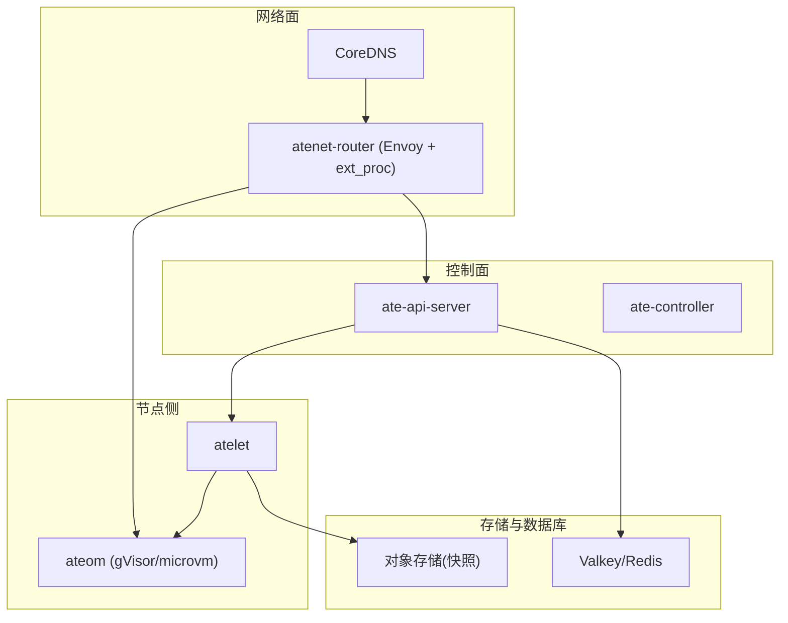
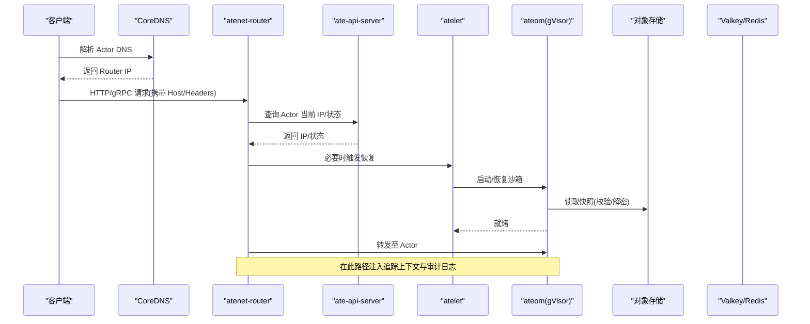
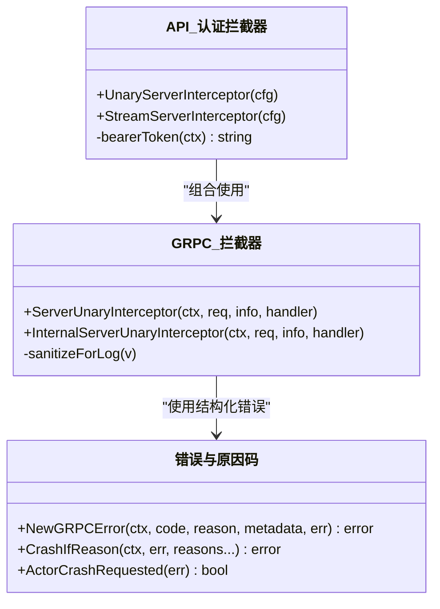
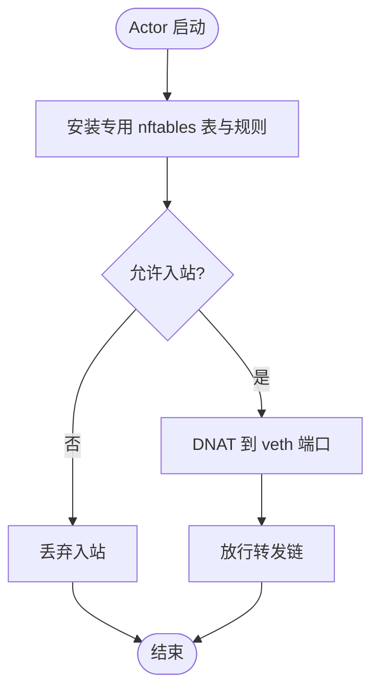
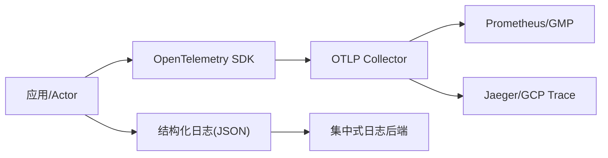
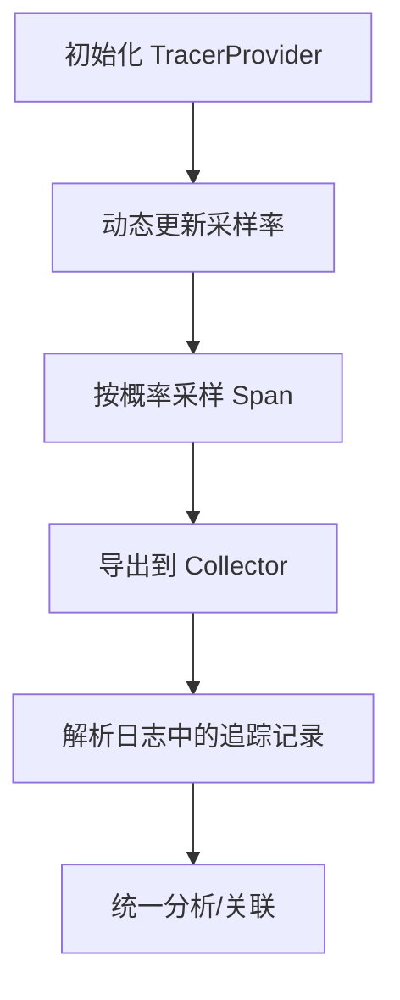
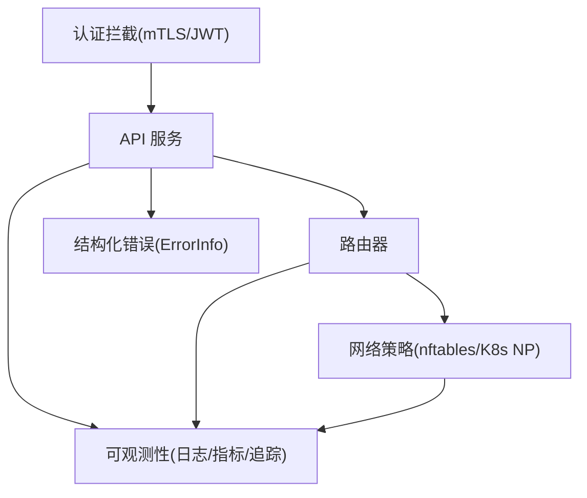

# 安全事件关联分析

<cite>
**本文引用的文件**   
- [README.md](file://README.md)
- [威胁模型.md](file://docs/threat-model.md)
- [可观测性指南.md](file://docs/observability.md)
- [架构与安全隔离.md](file://docs/architecture.md)
- [gRPC 拦截器（通用）.go](file://internal/ateinterceptors/ateinterceptors.go)
- [API 认证拦截器（mTLS/JWT）.go](file://internal/ateapiauth/server.go)
- [错误与原因码定义.go](file://internal/ateerrors/ateerrors.go)
- [gVisor 网络规则安装.go](file://cmd/ateom-gvisor/main.go)
- [nftables 规则实现.go](file://cmd/ateom-microvm/net.go)
- [Locust 追踪采样与解析.py](file://benchmarking/locust/common/trace.py)
- [Locust gRPC 追踪日志.py](file://benchmarking/locust/common/grpc_tracing.py)
- [Locust 运行器追踪记录提取.py](file://benchmarking/locust/runner.py)
- [Tracing 最佳实践.md](file://docs/dev/best-practices/tracing.md)
</cite>

## 目录
1. [引言](#引言)
2. [项目结构](#项目结构)
3. [核心组件](#核心组件)
4. [架构总览](#架构总览)
5. [详细组件分析](#详细组件分析)
6. [依赖关系分析](#依赖关系分析)
7. [性能考虑](#性能考虑)
8. [故障排查指南](#故障排查指南)
9. [结论](#结论)
10. [附录](#附录)

## 引言
本文件面向在 Agent Substrate 上构建“安全事件关联分析”能力的工程师与运维人员，聚焦以下目标：
- 跨多数据源（API 日志、文件操作日志、网络日志）进行安全事件的关联分析
- 认证失败、权限违规、异常访问模式等威胁的检测方法
- 基于时间线重建的多组件调用链追踪与关联
- 基于规则的异常检测算法与机器学习模型的应用场景
- 安全告警配置与管理，以及与外部安全系统的集成方案
- 合规报告生成的自动化流程与最佳实践

## 项目结构
Agent Substrate 提供控制面（ateapi）、节点代理（atelet）、网络路由（atenet-router）、沙箱执行环境（ateom/gVisor/microvm）以及丰富的可观测性与安全能力。这些组件为安全事件采集、关联分析与响应提供了基础。

图表来源
- [README.md:215-224](file://README.md#L215-L224)
- [威胁模型.md:33-50](file://docs/threat-model.md#L33-L50)

章节来源
- [README.md:215-224](file://README.md#L215-L224)
- [威胁模型.md:33-50](file://docs/threat-model.md#L33-L50)

## 核心组件
- ate-api-server：暴露 gRPC API，负责 Actor 生命周期管理、调度与凭据签发；支持 mTLS 与可选的 JWT 认证拦截；统一错误分类与审计友好输出。
- atenet-router：基于 Envoy 的入站网关，结合 ext_proc 过滤器完成身份感知路由、自动恢复与 IP 解析转发。
- atelet：节点守护进程，负责快照保存/恢复、状态迁移与本地资源协调。
- ateom：工作 Pod 内 sidecar，负责内部沙箱生命周期与网络策略（如 nftables）。
- CoreDNS：将 Actor DNS 解析到 router，支撑身份感知路由。
- 对象存储与数据库：用于快照持久化与运行时状态。

章节来源
- [威胁模型.md:33-50](file://docs/threat-model.md#L33-L50)
- [架构与安全隔离.md:466-494](file://docs/architecture.md#L466-L494)

## 架构总览
下图展示了从客户端请求到 Actor 执行的端到端路径，并标注了可用于安全事件采集的关键点（认证、路由、网络策略、快照、日志与追踪）。

图表来源
- [威胁模型.md:33-50](file://docs/threat-model.md#L33-L50)
- [可观测性指南.md:137-166](file://docs/observability.md#L137-L166)

## 详细组件分析

### 认证与授权拦截层
- gRPC 通用拦截器：统一记录方法名、耗时、请求/响应摘要（脱敏），并将服务端耗时写入 Trailer，便于下游统计与排障。
- API 认证拦截器：支持两种模式
  - mTLS：由传输层建立身份
  - JWT：要求每个 RPC 携带 Bearer Token，并通过可插拔验证器校验
- 错误与原因码：通过结构化 ErrorInfo 附加 Reason 与元数据，支持“需要崩溃 Actor”的指令标记，便于上层联动处置。

图表来源
- [gRPC 拦截器（通用）.go:36-102](file://internal/ateinterceptors/ateinterceptors.go#L36-L102)
- [API 认证拦截器（mTLS/JWT）.go:82-152](file://internal/ateapiauth/server.go#L82-L152)
- [错误与原因码定义.go:74-130](file://internal/ateerrors/ateerrors.go#L74-L130)

章节来源
- [gRPC 拦截器（通用）.go:36-102](file://internal/ateinterceptors/ateinterceptors.go#L36-L102)
- [API 认证拦截器（mTLS/JWT）.go:82-152](file://internal/ateapiauth/server.go#L82-L152)
- [错误与原因码定义.go:74-130](file://internal/ateerrors/ateerrors.go#L74-L130)

### 网络策略与访问控制
- 默认拒绝与最小授权：通过 Kubernetes NetworkPolicy 与 ateom 管理的 nftables 规则，限制 Actor 间通信与对外访问。
- 动态规则：在 Actor 生命周期中安装/清理专用表与规则，避免污染系统链。

图表来源
- [gVisor 网络规则安装.go:672-701](file://cmd/ateom-gvisor/main.go#L672-L701)
- [nftables 规则实现.go:396-460](file://cmd/ateom-microvm/net.go#L396-L460)

章节来源
- [架构与安全隔离.md:466-494](file://docs/architecture.md#L466-L494)
- [gVisor 网络规则安装.go:672-701](file://cmd/ateom-gvisor/main.go#L672-L701)
- [nftables 规则实现.go:396-460](file://cmd/ateom-microvm/net.go#L396-L460)

### 可观测性与追踪
- 日志：容器标准输出被包装为结构化 JSON，并注入 actor 维度标签（名称、atespace、UID、模板等），便于跨 Worker 聚合。
- 指标：OpenTelemetry 导出系统级指标（gRPC 延迟、路由延迟、快照大小等）。
- 追踪：按需开启请求级追踪，跨服务传播 trace_id/span_id，支持 Jaeger/GCP Trace 可视化。

图表来源
- [可观测性指南.md:103-166](file://docs/observability.md#L103-L166)
- [Tracing 最佳实践.md:1-26](file://docs/dev/best-practices/tracing.md#L1-L26)

章节来源
- [可观测性指南.md:103-166](file://docs/observability.md#L103-L166)
- [Tracing 最佳实践.md:1-26](file://docs/dev/best-practices/tracing.md#L1-L26)

### 基准测试中的追踪辅助
- 动态采样率：支持运行时更新采样概率，平衡开销与覆盖率。
- 标准化追踪记录：从不同来源（Go slog JSON、Python 自由文本）抽取 trace_id、耗时、错误信息，便于统一分析。

图表来源
- [Locust 追踪采样与解析.py:33-74](file://benchmarking/locust/common/trace.py#L33-L74)
- [Locust gRPC 追踪日志.py:114-122](file://benchmarking/locust/common/grpc_tracing.py#L114-L122)
- [Locust 运行器追踪记录提取.py:116-151](file://benchmarking/locust/runner.py#L116-L151)

章节来源
- [Locust 追踪采样与解析.py:33-74](file://benchmarking/locust/common/trace.py#L33-L74)
- [Locust gRPC 追踪日志.py:114-122](file://benchmarking/locust/common/grpc_tracing.py#L114-L122)
- [Locust 运行器追踪记录提取.py:116-151](file://benchmarking/locust/runner.py#L116-L151)

## 依赖关系分析
- 控制面与服务间通信：mTLS 保障机密性与完整性；可选 JWT 增强应用层身份。
- 路由与沙箱：router 每次请求前向 API 查询最新 IP，确保一致性；ateom 在沙箱边界实施网络策略。
- 快照与存储：快照需校验与加密，防止篡改与越权访问。
- 可观测性：日志、指标、追踪三者互补，形成完整的安全事件证据链。

图表来源
- [API 认证拦截器（mTLS/JWT）.go:82-152](file://internal/ateapiauth/server.go#L82-L152)
- [gRPC 拦截器（通用）.go:36-102](file://internal/ateinterceptors/ateinterceptors.go#L36-L102)
- [错误与原因码定义.go:74-130](file://internal/ateerrors/ateerrors.go#L74-L130)
- [架构与安全隔离.md:466-494](file://docs/architecture.md#L466-L494)

章节来源
- [API 认证拦截器（mTLS/JWT）.go:82-152](file://internal/ateapiauth/server.go#L82-L152)
- [gRPC 拦截器（通用）.go:36-102](file://internal/ateinterceptors/ateinterceptors.go#L36-L102)
- [错误与原因码定义.go:74-130](file://internal/ateerrors/ateerrors.go#L74-L130)
- [架构与安全隔离.md:466-494](file://docs/architecture.md#L466-L494)

## 性能考虑
- 追踪采样：在高并发下采用动态采样率，降低开销同时保留关键链路。
- 日志脱敏：对敏感字段（如 env）进行清理，避免泄露与冗余。
- 指标粒度：以方法/状态码/模板等维度聚合，兼顾可读性与查询效率。
- 网络策略：专用表与批量规则安装减少内核态切换与冲突。

[本节为通用指导，不直接分析具体文件]

## 故障排查指南
- 认证失败
  - 现象：Unauthenticated/Invalid bearer token
  - 定位：检查认证拦截器日志与上游鉴权结果
  - 参考：[API 认证拦截器（mTLS/JWT）.go:141-152](file://internal/ateapiauth/server.go#L141-L152)
- 权限违规
  - 现象：路由拒绝或网络策略丢弃
  - 定位：查看 nftables 规则与 K8s NetworkPolicy 变更历史
  - 参考：[gVisor 网络规则安装.go:672-701](file://cmd/ateom-gvisor/main.go#L672-L701)、[nftables 规则实现.go:396-460](file://cmd/ateom-microvm/net.go#L396-L460)
- 异常访问模式
  - 现象：高频失败、超时、异常地域/来源 IP
  - 定位：结合追踪与指标，识别热点方法与瓶颈
  - 参考：[gRPC 拦截器（通用）.go:36-72](file://internal/ateinterceptors/ateinterceptors.go#L36-L72)、[可观测性指南.md:103-166](file://docs/observability.md#L103-L166)
- 快照问题
  - 现象：INVALID_CHECKPOINT_RESULT/FAILED_SAVE_SNAPSHOT
  - 定位：检查对象存储访问与校验逻辑
  - 参考：[错误与原因码定义.go:44-55](file://internal/ateerrors/ateerrors.go#L44-L55)

章节来源
- [API 认证拦截器（mTLS/JWT）.go:141-152](file://internal/ateapiauth/server.go#L141-L152)
- [gVisor 网络规则安装.go:672-701](file://cmd/ateom-gvisor/main.go#L672-L701)
- [nftables 规则实现.go:396-460](file://cmd/ateom-microvm/net.go#L396-L460)
- [gRPC 拦截器（通用）.go:36-72](file://internal/ateinterceptors/ateinterceptors.go#L36-L72)
- [可观测性指南.md:103-166](file://docs/observability.md#L103-L166)
- [错误与原因码定义.go:44-55](file://internal/ateerrors/ateerrors.go#L44-L55)

## 结论
通过在控制面、网络面与节点侧部署统一的认证、授权、可观测性与错误分类机制，Agent Substrate 为跨数据源的安全事件关联分析提供了坚实基础。结合审计日志、追踪与指标，可实现认证失败、权限违规与异常访问模式的快速检测与响应，并为合规报告生成提供可靠证据链。

[本节为总结性内容，不直接分析具体文件]

## 附录

### 威胁与检测要点（来自威胁模型）
- 审计与取证：对所有服务接口启用审计日志，包括快照与对象存储访问
- 持续检测：将 API 与节点遥测接入威胁检测系统，支持可插拔安全 sidecar
- 快速隔离：检测到恶意行为后，支持动态策略更新与快照挂起/隔离

章节来源
- [威胁模型.md:134-141](file://docs/threat-model.md#L134-L141)

### 安全事件关联分析方法论
- 数据源
  - API 日志：gRPC 拦截器输出的方法、耗时、错误码与脱敏后的请求/响应摘要
  - 文件操作日志：快照拉取/写入、校验与解密过程的事件
  - 网络日志：nftables/K8s NetworkPolicy 的匹配与丢弃记录
- 关联键
  - actor_name、actor_uid、atespace、trace_id、span_id、rpc.method、status_code
- 时间线重建
  - 以 trace_id 串联请求在各组件的跨度；以 actor_uid 串联跨 Worker 迁移的生命周期事件
- 规则与模型
  - 规则：认证失败阈值、非预期来源 IP、频繁快照失败、策略不匹配
  - 模型：时序异常检测（突发失败/延迟）、图关联（跨 Actor 横向移动）

[本节为方法论说明，不直接分析具体文件]

### 告警配置与管理建议
- 指标告警：gRPC 错误率、路由延迟 P99/P95、快照大小分布
- 日志告警：Unauthenticated/Invalid bearer token、INVALID_CHECKPOINT_RESULT、FAILED_SAVE_SNAPSHOT
- 追踪告警：长尾请求、失败跨度占比上升
- 联动：当满足条件时，触发隔离动作（暂停 Actor、冻结快照、收紧网络策略）

[本节为通用建议，不直接分析具体文件]

### 与其他安全系统集成
- SIEM/SOAR：将结构化日志与指标推送至 SIEM，利用 SOAR 编排响应剧本
- WAF/零信任：在入口增加身份感知 WAF，配合 mTLS 与最小授权
- 云原生安全：结合 K8s NetworkPolicy、Pod 证书与短生命周期证书体系

[本节为通用建议，不直接分析具体文件]

### 合规报告自动化流程
- 数据采集：日志、指标、追踪与审计事件统一入库
- 规则映射：将合规条款映射为检测规则与阈值
- 报告生成：定时任务汇总证据链，输出 PDF/HTML 报告
- 版本留痕：报告与规则版本化管理，支持回溯与审计

[本节为通用建议，不直接分析具体文件]
