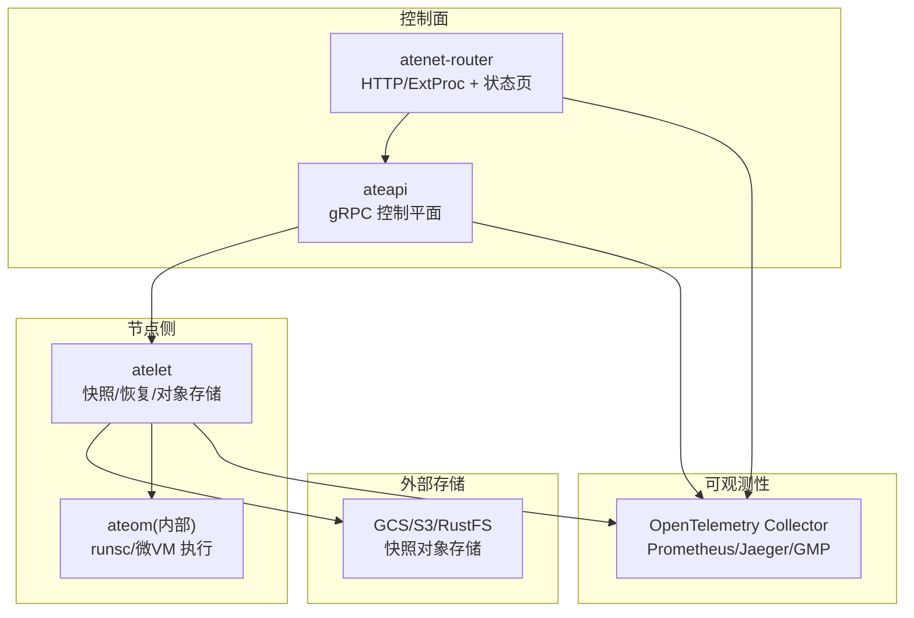
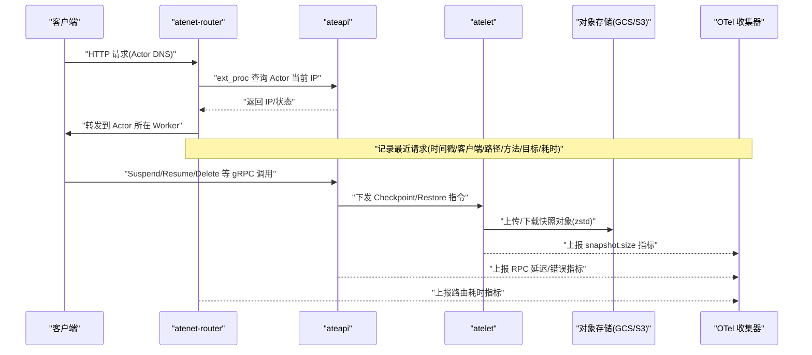
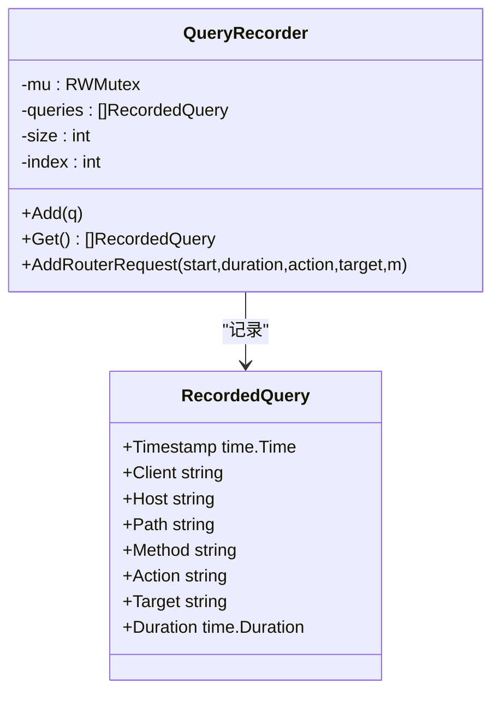
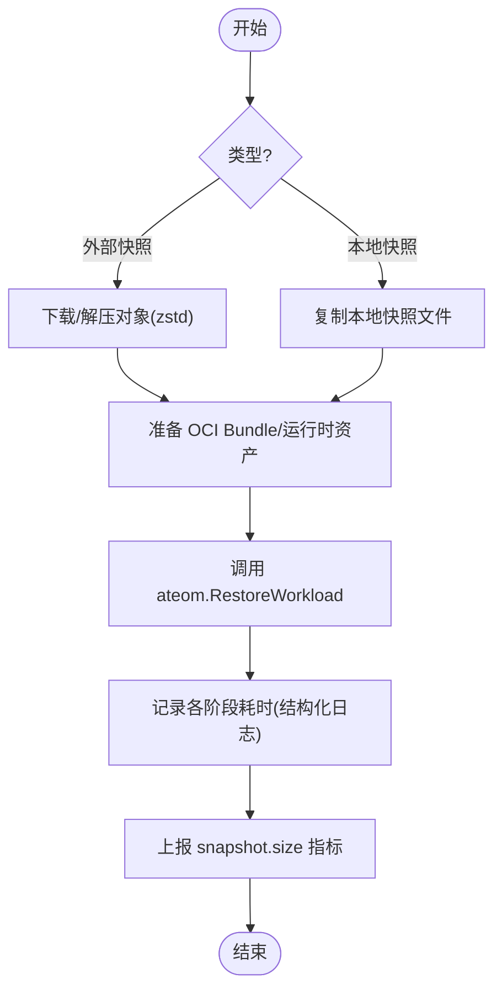
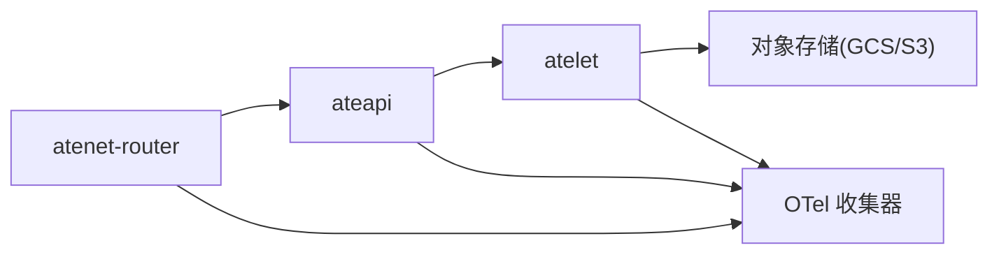

# 安全审计日志

<cite>
**本文引用的文件**   
- [README.md](file://README.md)
- [observability.md](file://docs/observability.md)
- [threat-model.md](file://docs/threat-model.md)
- [status.go](file://cmd/atenet/internal/router/status.go)
- [dashboard.html](file://cmd/atenet/internal/router/dashboard.html)
- [main.go](file://cmd/atelet/main.go)
- [objects.go](file://cmd/atelet/internal/ategcs/objects.go)
- [fspersist.go](file://demos/multi-template/fspersist/fspersist.go)
</cite>

## 目录
1. [简介](#简介)
2. [项目结构](#项目结构)
3. [核心组件](#核心组件)
4. [架构总览](#架构总览)
5. [详细组件分析](#详细组件分析)
6. [依赖关系分析](#依赖关系分析)
7. [性能考量](#性能考量)
8. [故障排查指南](#故障排查指南)
9. [结论](#结论)
10. [附录](#附录)

## 简介
本文件面向安全与运维人员，系统性梳理 Agent Substrate 在“安全审计日志”方面的现状、能力边界与落地建议。内容覆盖：
- API 访问记录的采集与分析（请求来源、操作类型、响应状态、时间戳等）
- 文件与快照操作的审计（创建、恢复、删除）
- 网络流量监控的配置与使用（入站/出站连接、数据传输量、异常检测思路）
- 安全事件关联分析方法与工具
- 日志聚合、存储与查询的最佳实践

说明：当前仓库未提供统一的“审计日志子系统”，但已在多处具备可观测性基础（结构化日志、指标、分布式追踪、路由请求记录）。本文基于现有实现进行归纳，并给出扩展建议。

## 项目结构
与安全审计相关的关键位置包括：
- 控制面与服务入口：ateapi（gRPC）、atenet-router（HTTP/Envoy ext_proc + 状态页）
- 节点侧工作负载管理：atelet（快照/恢复、对象存储上传下载、指标）
- 演示应用：fspersist（示例 HTTP 服务，输出结构化日志）
- 文档：可观测性与威胁模型

图表来源
- [README.md:215-225](file://README.md#L215-L225)
- [observability.md:103-194](file://docs/observability.md#L103-L194)

章节来源
- [README.md:215-225](file://README.md#L215-L225)
- [observability.md:103-194](file://docs/observability.md#L103-L194)

## 核心组件
- atenet-router 状态页与查询记录器：提供最近处理请求的内存环形记录，包含时间戳、客户端、主机、路径、方法、动作、目标、耗时；路径参数已脱敏。
- atelet 指标与结构化日志：暴露 snapshot.size 指标；对 Restore 关键路径打点分解（下载、OCI 解包、restore 调用），并以结构化日志输出。
- 对象存储层（ategcs）：上传/下载带 zstd 压缩的快照对象，记录逻辑大小、实际写入字节、是否稀疏、耗时等。
- 演示应用 fspersist：以 JSON 结构化日志输出请求处理结果，便于集中式日志平台解析。

章节来源
- [status.go:38-130](file://cmd/atenet/internal/router/status.go#L38-L130)
- [dashboard.html:387-420](file://cmd/atenet/internal/router/dashboard.html#L387-L420)
- [main.go:273-307](file://cmd/atelet/main.go#L273-L307)
- [main.go:577-582](file://cmd/atelet/main.go#L577-L582)
- [objects.go:207-211](file://cmd/atelet/internal/ategcs/objects.go#L207-L211)
- [objects.go:324-327](file://cmd/atelet/internal/ategcs/objects.go#L324-L327)
- [fspersist.go:58-84](file://demos/multi-template/fspersist/fspersist.go#L58-L84)

## 架构总览
下图展示从请求进入至路由、控制面、节点侧、对象存储与可观测性系统的整体链路，标注了审计与可观测性落点。

图表来源
- [observability.md:103-194](file://docs/observability.md#L103-L194)
- [main.go:273-307](file://cmd/atelet/main.go#L273-L307)
- [status.go:180-281](file://cmd/atenet/internal/router/status.go#L180-L281)

## 详细组件分析

### API 访问记录（atenet-router 状态页）
- 功能要点
  - 维护固定容量的环形缓冲区，记录最近 N 条请求。
  - 字段包含：时间戳、客户端(:authority)、Host、Path、Method、Action、Target、Duration。
  - Path 自动去除查询字符串，避免敏感信息泄露。
  - 支持 JSON 或 HTML 视图，便于快速定位问题。
- 使用方式
  - 通过状态接口获取 JSON 或渲染后的 HTML 表格，查看最近请求明细。
  - 结合 OpenTelemetry 指标与追踪，做端到端关联。
- 局限与建议
  - 仅保留最近 N 条，不适合长期审计留存。
  - 建议将请求记录导出到集中式日志系统，并增加响应状态码、鉴权主体、租户维度等字段。

图表来源
- [status.go:38-130](file://cmd/atenet/internal/router/status.go#L38-L130)

章节来源
- [status.go:56-130](file://cmd/atenet/internal/router/status.go#L56-L130)
- [dashboard.html:387-420](file://cmd/atenet/internal/router/dashboard.html#L387-L420)

### 文件与快照操作审计（atelet + ategcs）
- 功能要点
  - Checkpoint/Restore 流程中，记录关键阶段耗时（download、oci_unpack、ateom_restore），并通过结构化日志输出。
  - 对象存储上传/下载过程记录压缩/解压统计（逻辑大小、实际写入字节、是否稀疏、耗时）。
  - 暴露 snapshot.size 指标（按模板命名空间/名称打标），用于容量与性能分析。
- 使用方式
  - 通过 Prometheus 查询 atelet.snapshot.size 指标，观察不同模板的快照体积分布。
  - 通过集中式日志平台检索 atelet 的 Restore timing breakdown 日志，定位慢恢复根因。
- 局限与建议
  - 缺少“谁在何时触发了快照/恢复/删除”的审计上下文（如操作者身份、触发源）。
  - 建议在 atelet 与对象存储层统一注入审计标签（actor_uid、atespace、operator_id、trace_id），并将关键事件写入不可变审计日志。

图表来源
- [main.go:454-583](file://cmd/atelet/main.go#L454-L583)
- [objects.go:299-328](file://cmd/atelet/internal/ategcs/objects.go#L299-L328)
- [objects.go:207-211](file://cmd/atelet/internal/ategcs/objects.go#L207-L211)

章节来源
- [main.go:273-307](file://cmd/atelet/main.go#L273-L307)
- [main.go:577-582](file://cmd/atelet/main.go#L577-L582)
- [objects.go:207-211](file://cmd/atelet/internal/ategcs/objects.go#L207-L211)
- [objects.go:324-327](file://cmd/atelet/internal/ategcs/objects.go#L324-L327)

### 网络流量监控（atenet-router 与指标）
- 功能要点
  - 路由层暴露 atelet.router.route.duration 指标（E2E 视角，不含 Actor 计算时间）。
  - 状态页记录最近请求的耗时、目标、方法等，可用于异常流量初筛。
- 使用方式
  - 在 Prometheus/Jaeger/GMP 中查询路由耗时与错误率，结合状态页快速定位异常请求。
- 局限与建议
  - 当前未直接暴露入站/出站连接数、传输字节等细粒度网络指标。
  - 建议结合 Envoy 访问日志与内核/网卡指标，构建入站/出站连接、吞吐、丢包、重传等监控面板，并设置阈值告警。

章节来源
- [observability.md:103-134](file://docs/observability.md#L103-L134)
- [status.go:180-281](file://cmd/atenet/internal/router/status.go#L180-L281)

### 结构化日志与演示应用（fspersist）
- 功能要点
  - 使用标准库 slog 输出 JSON 行，便于集中式日志平台解析。
  - 示例中包含请求处理成功/失败的路径，以及响应体摘要。
- 使用方式
  - 通过 kubectl-ate logs 或集中式日志平台检索 actor 日志，结合 ate.dev 元数据标签进行多维过滤。
- 局限与建议
  - 演示应用仅为样例，生产环境应统一日志格式、级别与脱敏策略。

章节来源
- [observability.md:21-101](file://docs/observability.md#L21-L101)
- [fspersist.go:58-84](file://demos/multi-template/fspersist/fspersist.go#L58-L84)

## 依赖关系分析
- 组件耦合
  - atenet-router 依赖 ateapi 获取 Actor 当前 IP，自身负责请求记录与指标上报。
  - atelet 依赖对象存储（GCS/S3/rustfs）完成快照上传/下载，并向 OTel 上报指标。
- 外部依赖
  - OpenTelemetry（指标/追踪）
  - 对象存储（GCS/S3/rustfs）
  - Kubernetes（Pod/DNS/Service）

图表来源
- [observability.md:103-194](file://docs/observability.md#L103-L194)
- [README.md:215-225](file://README.md#L215-L225)

章节来源
- [observability.md:103-194](file://docs/observability.md#L103-L194)
- [README.md:215-225](file://README.md#L215-L225)

## 性能考量
- 快照上传/下载采用 zstd 压缩，针对大对象优先选择流式上传以减少临时文件占用。
- 恢复流程并行化：下载与 OCI 解包并行执行，降低冷启动时延。
- 指标桶边界与采样策略需结合部署规模调优，避免高基数标签导致查询缓慢。

章节来源
- [objects.go:156-181](file://cmd/atelet/internal/ategcs/objects.go#L156-L181)
- [main.go:514-544](file://cmd/atelet/main.go#L514-L544)

## 故障排查指南
- 路由层问题
  - 通过状态页查看最近请求列表，关注 Path 脱敏后仍可见的 Method/Target/Duration，筛选异常耗时或失败请求。
- 快照/恢复问题
  - 检索 atelet 的 Restore timing breakdown 日志，对比 download/oci_unpack/ateom_restore 三段耗时定位瓶颈。
  - 检查对象存储上传/下载的日志，确认逻辑大小与实际写入字节是否一致，排查稀疏/非稀疏路径差异。
- 指标异常
  - 查询 atelet.snapshot.size 指标，观察是否存在突增或长尾；结合模板维度下钻。
- 威胁与合规
  - 参考威胁模型中的“检测与响应”条目，确保所有对外 API 与节点组件启用审计日志，并与威胁检测系统集成。

章节来源
- [dashboard.html:387-420](file://cmd/atenet/internal/router/dashboard.html#L387-L420)
- [main.go:577-582](file://cmd/atelet/main.go#L577-L582)
- [objects.go:324-327](file://cmd/atelet/internal/ategcs/objects.go#L324-L327)
- [threat-model.md:134-141](file://docs/threat-model.md#L134-L141)

## 结论
- 当前系统在“可观测性”方面已有良好基础：结构化日志、指标、分布式追踪与路由请求记录。
- “安全审计日志”尚未形成统一体系，建议：
  - 为所有对外 API 与节点组件启用审计日志，统一字段规范与脱敏策略。
  - 将路由请求记录、快照/恢复事件、对象存储访问事件汇聚到不可变审计存储。
  - 建立跨组件的事件关联（trace_id、actor_uid、atespace、operator_id），支撑安全分析与取证。
  - 结合威胁模型，完善异常流量检测、动态隔离与快照标记机制。

## 附录

### 最佳实践清单（日志聚合、存储与查询）
- 统一日志格式：JSON 行，包含时间戳、级别、trace_id、actor_uid、atespace、component、event_type、result、duration、ip/client 等。
- 脱敏策略：URL 查询串、密钥、证书等敏感字段必须脱敏或丢弃。
- 存储策略：审计日志写入不可变存储（WORM），保留周期满足合规要求。
- 索引与查询：按 actor_uid、atespace、component、event_type 建索引，支持时间窗口与关键字检索。
- 告警与联动：对高危事件（非法恢复、越权访问、异常流量）实时告警，联动自动化处置（暂停/隔离）。

[本节为通用指导，不直接分析具体文件]
