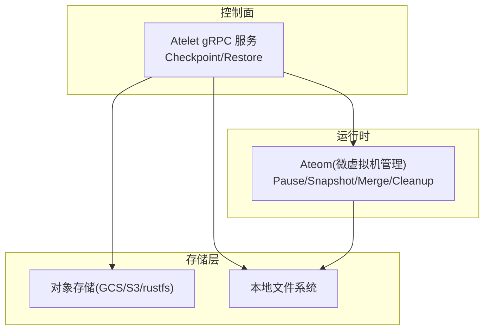
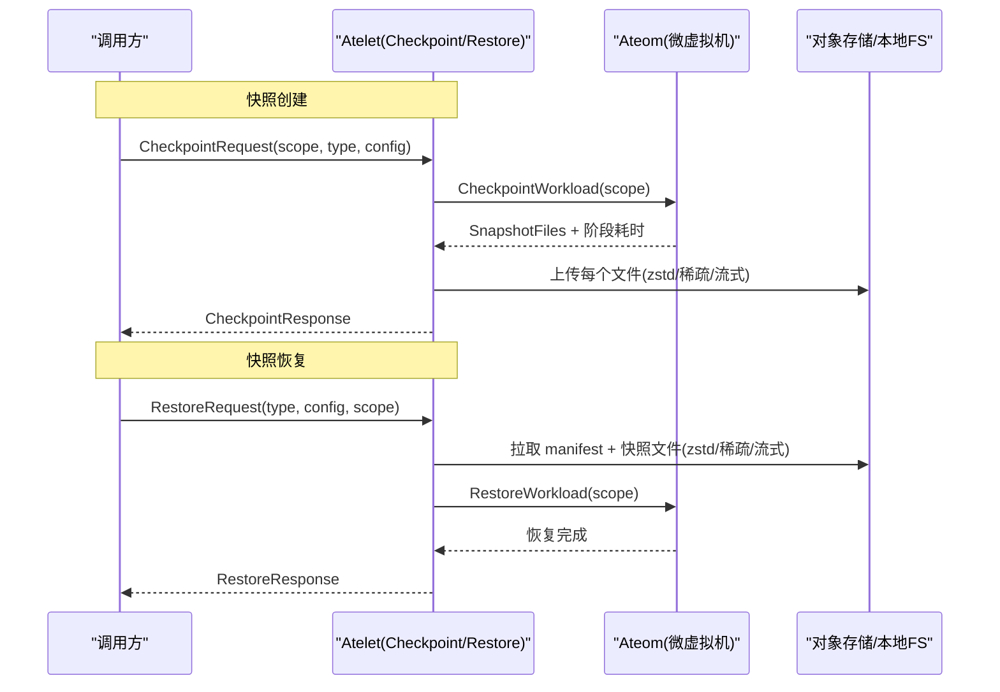
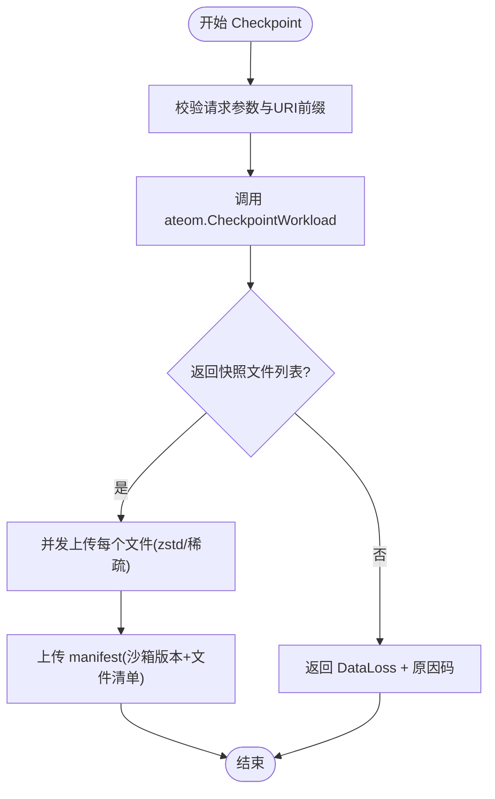
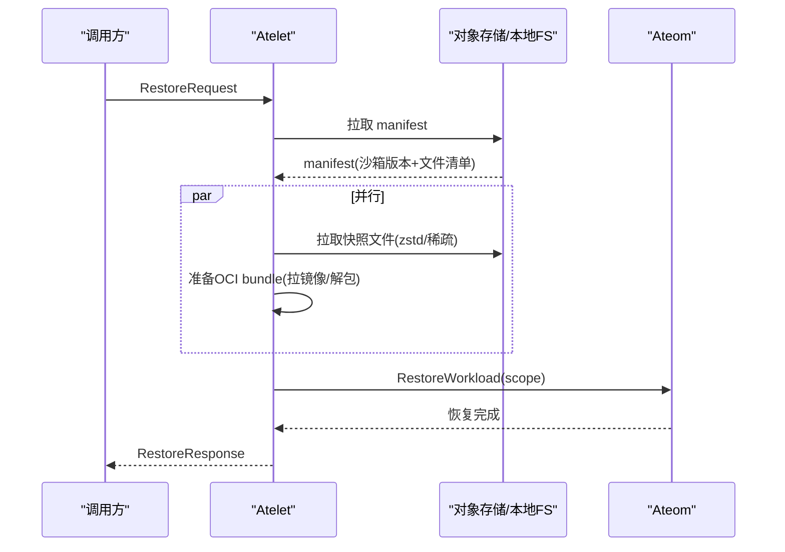
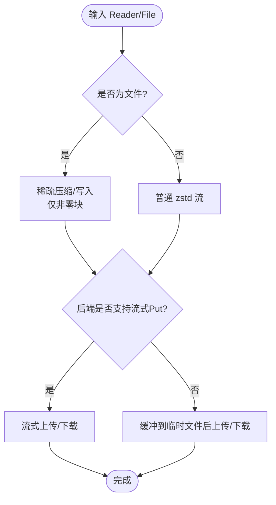
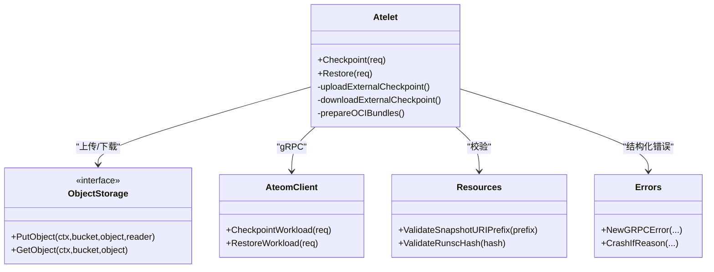

# 文件操作审计

<cite>
**本文引用的文件**   
- [atelet.proto](file://internal/proto/ateletpb/atelet.proto)
- [main.go](file://cmd/atelet/main.go)
- [objects.go](file://cmd/atelet/internal/ategcs/objects.go)
- [validate.go](file://internal/resources/validate.go)
- [checkpoint.go](file://cmd/ateom-microvm/checkpoint.go)
- [ateerrors.go](file://internal/ateerrors/ateerrors.go)
- [demo_test.go](file://internal/e2e/suites/demo/demo_test.go)
</cite>

## 目录
1. [简介](#简介)
2. [项目结构](#项目结构)
3. [核心组件](#核心组件)
4. [架构总览](#架构总览)
5. [详细组件分析](#详细组件分析)
6. [依赖关系分析](#依赖关系分析)
7. [性能与指标](#性能与指标)
8. [故障排查指南](#故障排查指南)
9. [结论](#结论)
10. [附录](#附录)

## 简介
本文件面向“文件操作审计”目标，聚焦快照（Checkpoint/Restore）全链路中的可观测性与审计记录。内容覆盖：
- 快照创建时的内存转储记录、文件系统增量备份、压缩传输过程、对象存储持久化操作的日志与指标
- 快照恢复流程的审计记录：源快照验证、状态恢复进度、错误处理
- 文件哈希计算与完整性校验的审计信息
- 快照生命周期管理的监控指标（快照大小、创建时间、存储空间使用量等）
- 异常操作检测与告警规则建议

## 项目结构
与快照审计相关的代码主要分布在以下模块：
- atelet 服务：对外提供 Checkpoint/Restore RPC，负责编排本地/远端快照上传下载、OCI 镜像准备、与 ateom 交互
- ategcs 包：对象存储抽象与 zstd 压缩/稀疏写入、流式上传、下载解压
- resources 校验：URI 前缀、资源名、容器名等输入合法性校验
- ateom-microvm：在微虚拟机侧执行暂停、快照、合并 delta、清理等
- ateerrors：结构化错误与原因码，便于上层分类与告警

图表来源
- [main.go:309-452](file://cmd/atelet/main.go#L309-L452)
- [objects.go:95-251](file://cmd/atelet/internal/ategcs/objects.go#L95-L251)
- [checkpoint.go:44-154](file://cmd/ateom-microvm/checkpoint.go#L44-L154)

章节来源
- [main.go:309-452](file://cmd/atelet/main.go#L309-L452)
- [objects.go:95-251](file://cmd/atelet/internal/ategcs/objects.go#L95-L251)
- [checkpoint.go:44-154](file://cmd/ateom-microvm/checkpoint.go#L44-L154)

## 核心组件
- Atelet 服务（AteomHerder）
  - 实现 Checkpoint/Restore 工作流，协调 ateom 与对象存储/本地磁盘
  - 记录关键阶段耗时与结果，输出结构化日志
- ategcs 对象存储封装
  - 统一 PutObject/GetObject 接口
  - 支持 zstd 压缩、稀疏格式、流式上传与下载
- Ateom 微虚拟机管理
  - 驱动底层 VMM 进行 Pause/Snapshot/Delta Merge/Cleanup
  - 输出各阶段耗时与产物清单
- 校验与错误体系
  - 输入参数严格校验，避免路径穿越与非法 URI
  - 结构化错误原因码，便于上层分类与告警

章节来源
- [main.go:309-452](file://cmd/atelet/main.go#L309-L452)
- [objects.go:37-93](file://cmd/atelet/internal/ategcs/objects.go#L37-L93)
- [checkpoint.go:44-154](file://cmd/ateom-microvm/checkpoint.go#L44-L154)
- [validate.go:150-174](file://internal/resources/validate.go#L150-L174)
- [ateerrors.go:44-99](file://internal/ateerrors/ateerrors.go#L44-L99)

## 架构总览
下图展示一次完整快照创建与恢复的调用链与数据流，并标注审计落点（日志、指标、错误原因）。

图表来源
- [main.go:309-452](file://cmd/atelet/main.go#L309-L452)
- [main.go:454-583](file://cmd/atelet/main.go#L454-L583)
- [objects.go:95-251](file://cmd/atelet/internal/ategcs/objects.go#L95-L251)
- [checkpoint.go:44-154](file://cmd/ateom-microvm/checkpoint.go#L44-L154)

## 详细组件分析

### 快照创建（Checkpoint）审计链路
- 请求校验与范围选择
  - 校验 actor 名称、模板命名空间/名称、目标 ateom UID、容器名、快照范围与类型
  - 外部存储时校验 URI 前缀仅包含 scheme/bucket/path，防止查询/片段/用户信息被吞掉导致对象名拼接错误
- 与 ateom 协作
  - 调用 ateom.CheckpointWorkload，返回实际产物的文件名列表
  - ateom 内部执行 Pause -> Snapshot -> Delta Merge(必要时) -> Teardown，并输出各阶段耗时
- 上传与持久化
  - 对每个快照文件进行 zstd 压缩；若为文件且可寻址，采用稀疏格式只写非零块
  - 根据后端能力选择流式或缓冲上传；GCS 走流式，S3/rustfs 先写到临时文件再上传
  - 最后上传 manifest（包含沙箱二进制版本与快照文件清单），使恢复自描述
- 审计落点
  - 日志：上传/下载阶段的对象名、是否稀疏、逻辑字节数、已写字节数、耗时
  - 指标：未压缩快照镜像大小直方图（按 kind、模板命名空间/名称打标签）
  - 错误：结构化原因码（如 INVALID_OBJECT_URL、FAILED_GET_EXTERNAL_OBJECT、INVALID_CHECKPOINT_RESULT 等）

图表来源
- [main.go:309-452](file://cmd/atelet/main.go#L309-L452)
- [objects.go:95-251](file://cmd/atelet/internal/ategcs/objects.go#L95-L251)
- [validate.go:150-174](file://internal/resources/validate.go#L150-L174)
- [checkpoint.go:44-154](file://cmd/ateom-microvm/checkpoint.go#L44-L154)

章节来源
- [main.go:309-452](file://cmd/atelet/main.go#L309-L452)
- [objects.go:95-251](file://cmd/atelet/internal/ategcs/objects.go#L95-L251)
- [validate.go:150-174](file://internal/resources/validate.go#L150-L174)
- [checkpoint.go:44-154](file://cmd/ateom-microvm/checkpoint.go#L44-L154)

### 快照恢复（Restore）审计链路
- 读取 manifest
  - 外部存储：从指定 URI 前缀下拉取 manifest，解析出沙箱二进制版本与快照文件清单
  - 本地存储：从本地目录读取 manifest
- 并行准备
  - 并发拉取快照文件（zstd 解压，自动识别稀疏格式）与准备 OCI bundle（拉镜像、解包）
- 恢复执行
  - 调用 ateom.RestoreWorkload，完成后记录沙箱二进制版本到本地以便后续 Checkpoint 复用
- 审计落点
  - 日志：下载/解压耗时、OCI 解包耗时、ateom 恢复耗时、总耗时
  - 错误：结构化原因码（如 INVALID_OBJECT_URL、FAILED_GET_EXTERNAL_OBJECT、TERMINAL_FILE_SYSTEM_ERROR、INVALID_SANDBOX_ASSET 等）

图表来源
- [main.go:454-583](file://cmd/atelet/main.go#L454-L583)
- [objects.go:270-384](file://cmd/atelet/internal/ategcs/objects.go#L270-L384)

章节来源
- [main.go:454-583](file://cmd/atelet/main.go#L454-L583)
- [objects.go:270-384](file://cmd/atelet/internal/ategcs/objects.go#L270-L384)

### 压缩与稀疏格式（zstd + sparse-extent）
- 上传路径
  - 若内容为文件且可寻址：优先使用稀疏格式，仅压缩/传输非零块，减少网络与存储占用
  - 非文件流：使用普通 zstd 流
  - 后端差异：GCS 支持流式 PutObject，直接管道压缩到网络；S3/rustfs 需要 seekable body，先写入临时文件再上传
- 下载路径
  - 自动识别头部 magic：稀疏格式与普通 zstd 流
  - 若目标是文件：普通流也尽量以稀疏方式写出（跳过全零块），最终 truncate 到逻辑大小
- 审计落点
  - 日志：对象名、是否稀疏、逻辑字节数、已写/已读字节数、耗时
  - 兼容性：旧快照（无 magic）仍可正常解压恢复

图表来源
- [objects.go:141-251](file://cmd/atelet/internal/ategcs/objects.go#L141-L251)
- [objects.go:299-384](file://cmd/atelet/internal/ategcs/objects.go#L299-L384)

章节来源
- [objects.go:141-251](file://cmd/atelet/internal/ategcs/objects.go#L141-L251)
- [objects.go:299-384](file://cmd/atelet/internal/ategcs/objects.go#L299-L384)

### 文件哈希与完整性校验
- 沙箱二进制完整性
  - 通过 SHA-256 小写十六进制字符串标识与校验，确保缓存命中与执行一致性
  - 校验函数限制长度与字符集，防止路径穿越
- 应用示例
  - 演示程序中对随机文件内容进行 SHA-256 计算并记录日志，可用于端到端验证
- 审计落点
  - 日志：记录哈希值，便于比对与回溯
  - 错误：当哈希不匹配或无法获取时，应触发相应原因码并告警

章节来源
- [validate.go:133-148](file://internal/resources/validate.go#L133-L148)
- [demos/counter/counter.go:141-149](file://demos/counter/counter.go#L141-L149)

### 快照范围与行为差异（FULL vs DATA）
- FULL：捕获进程内存与完整文件系统增量（包括 DurableDir 卷）
- DATA：仅捕获支持快照的卷内容（当前为 DurableDir），不包含内存与其他 rootfs
- E2E 用例覆盖了不同 onCommit/onPause 组合下的内存与文件数量预期，用于回归验证

章节来源
- [atelet.proto:168-178](file://internal/proto/ateletpb/atelet.proto#L168-L178)
- [demo_test.go:97-142](file://internal/e2e/suites/demo/demo_test.go#L97-L142)

## 依赖关系分析
- Atelet 依赖
  - ategcs.ObjectStorage 抽象（GCS/S3/rustfs）
  - ateom gRPC 客户端（Unix socket）
  - 资源校验库（resources）
  - 错误与拦截器（ateerrors、ateinterceptors）
- Ateom 依赖
  - Kata/Cloud-Hypervisor API（pause/snapshot/merge/shutdown）
  - 本地文件系统（checkpoint-state、bundle、PID 等目录）

图表来源
- [main.go:309-452](file://cmd/atelet/main.go#L309-L452)
- [objects.go:37-93](file://cmd/atelet/internal/ategcs/objects.go#L37-L93)
- [validate.go:150-174](file://internal/resources/validate.go#L150-L174)
- [ateerrors.go:68-99](file://internal/ateerrors/ateerrors.go#L68-L99)

章节来源
- [main.go:309-452](file://cmd/atelet/main.go#L309-L452)
- [objects.go:37-93](file://cmd/atelet/internal/ategcs/objects.go#L37-L93)
- [validate.go:150-174](file://internal/resources/validate.go#L150-L174)
- [ateerrors.go:68-99](file://internal/ateerrors/ateerrors.go#L68-L99)

## 性能与指标
- 快照大小指标
  - 指标名：atelet.snapshot.size（单位：By）
  - 维度：kind、actor_template_namespace、actor_template_name
  - 桶边界：1MB~10GB 多档，便于观察分布
- 恢复阶段耗时
  - 日志字段：download、oci_unpack、ateom_restore、total
- 上传/下载耗时与吞吐
  - 日志字段：compress、total、took（含是否稀疏、逻辑/实际字节数）
- 建议采集与看板
  - P95/P99 恢复延迟
  - 上传/下载吞吐（Bytes/s）
  - 稀疏比例（populated/logical）
  - 失败率与原因码分布

章节来源
- [main.go:273-307](file://cmd/atelet/main.go#L273-L307)
- [main.go:577-582](file://cmd/atelet/main.go#L577-L582)
- [objects.go:207-211](file://cmd/atelet/internal/ategcs/objects.go#L207-L211)
- [objects.go:246-250](file://cmd/atelet/internal/ategcs/objects.go#L246-L250)
- [objects.go:324-327](file://cmd/atelet/internal/ategcs/objects.go#L324-L327)

## 故障排查指南
- 常见错误与定位
  - INVALID_OBJECT_URL / FAILED_GET_EXTERNAL_OBJECT：检查 URI 前缀与权限，确认对象存在
  - TERMINAL_FILE_SYSTEM_ERROR：节点磁盘/权限问题，检查本地目录读写
  - INVALID_SANDBOX_ASSET：manifest 解析失败或沙箱二进制不一致
  - INVALID_CHECKPOINT_RESULT：ateom 未返回快照文件清单
- 结构化错误与告警
  - 使用 Reason 与 ErrorInfo 元数据（actorCrashed=true）区分可重试与需崩溃的错误
  - 建议在控制面基于 Reason 聚合告警规则，例如：
    - 失败保存快照（FAILED_SAVE_SNAPSHOT）超过阈值
    - 外部对象获取失败（FAILED_GET_EXTERNAL_OBJECT）持续出现
    - 终端文件系统错误（TERMINAL_FILE_SYSTEM_ERROR）频繁发生
- 快速自检清单
  - 校验 URI 前缀不含 query/fragment/userinfo
  - 确认对象存储可达与凭据正确
  - 核对 manifest 是否存在且可读
  - 观察日志中各阶段耗时是否异常增长

章节来源
- [validate.go:150-174](file://internal/resources/validate.go#L150-L174)
- [ateerrors.go:44-99](file://internal/ateerrors/ateerrors.go#L44-L99)
- [main.go:454-583](file://cmd/atelet/main.go#L454-L583)
- [main.go:309-452](file://cmd/atelet/main.go#L309-L452)

## 结论
本方案围绕快照创建与恢复的关键路径，提供了完整的审计与可观测性支撑：
- 在 atelet 层输出阶段耗时、对象级统计与结构化错误
- 在 ategcs 层记录压缩/稀疏/流式细节，便于容量与性能分析
- 在 ateom 层输出暂停、快照、合并、清理的阶段耗时与产物清单
- 结合 URI/资源名/容器名等强校验与结构化错误原因码，提升异常检测与告警能力

## 附录

### 关键日志字段参考
- 上传/下载
  - object、sparse、logical_bytes、populated_bytes/written_bytes、compress/total/took
- 恢复阶段
  - download、oci_unpack、ateom_restore、total
- 快照大小
  - 指标：atelet.snapshot.size（维度：kind、actor_template_namespace、actor_template_name）

章节来源
- [objects.go:207-211](file://cmd/atelet/internal/ategcs/objects.go#L207-L211)
- [objects.go:246-250](file://cmd/atelet/internal/ategcs/objects.go#L246-L250)
- [objects.go:324-327](file://cmd/atelet/internal/ategcs/objects.go#L324-L327)
- [main.go:577-582](file://cmd/atelet/main.go#L577-L582)
- [main.go:273-307](file://cmd/atelet/main.go#L273-L307)
