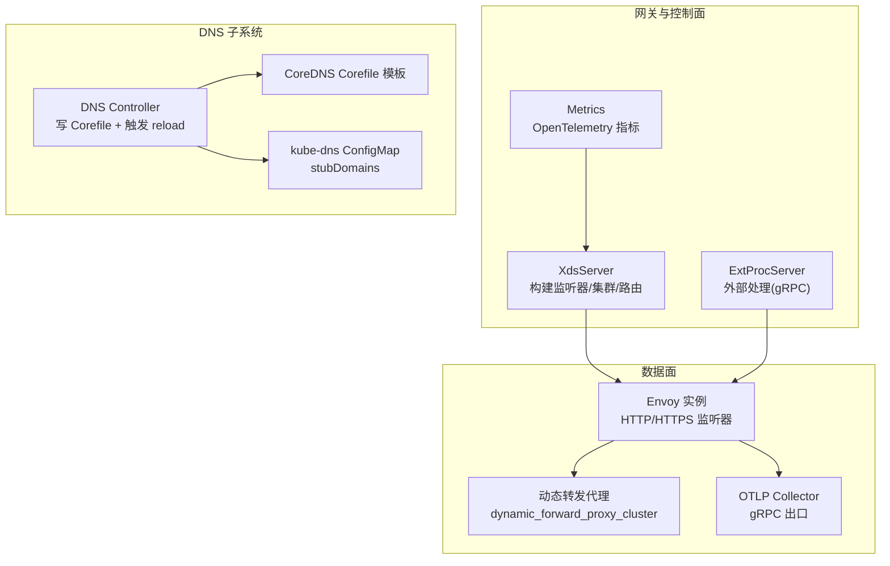
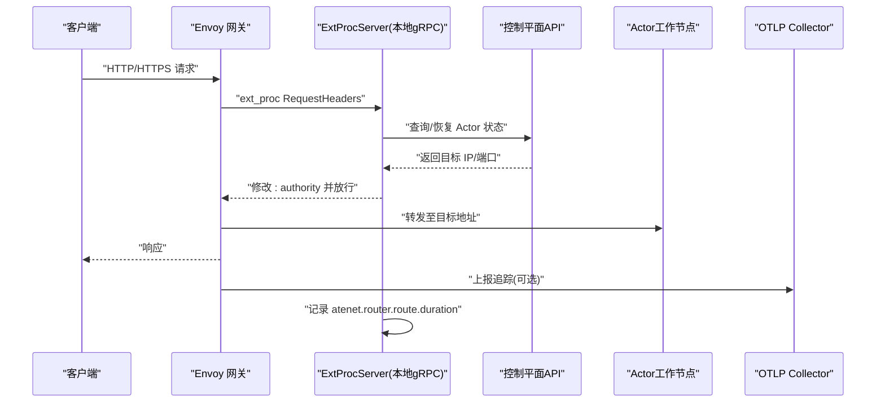
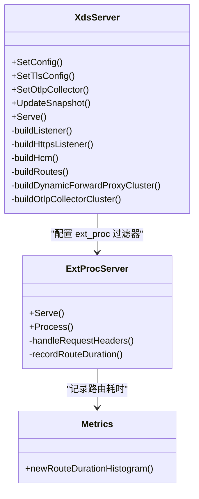
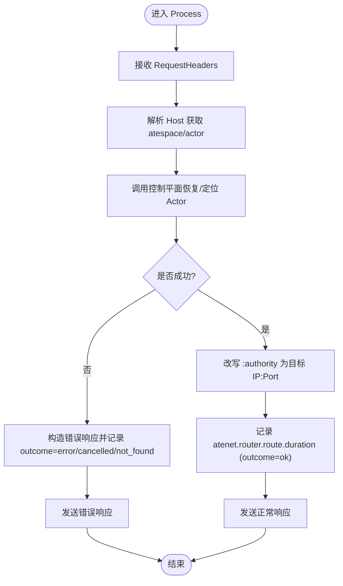
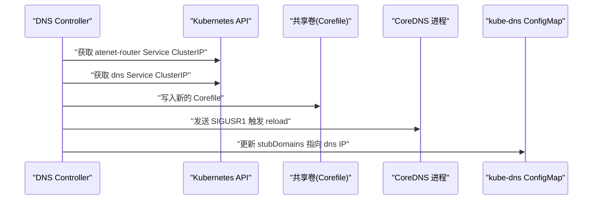
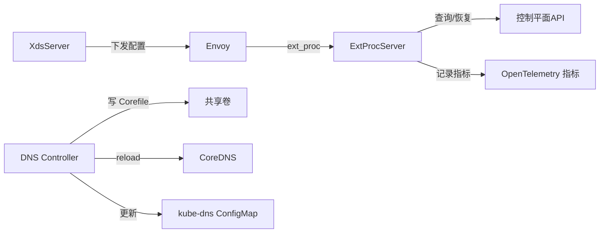

# 网络流量监控

<cite>
**本文引用的文件**   
- [xds.go](file://cmd/atenet/internal/router/xds.go)
- [extproc.go](file://cmd/atenet/internal/router/extproc.go)
- [metrics.go](file://cmd/atenet/internal/router/metrics.go)
- [corefile.go](file://cmd/atenet/internal/dns/corefile.go)
- [dns.go](file://cmd/atenet/internal/dns/dns.go)
- [atenet-router-monitoring.yaml](file://manifests/ate-install/atenet-router-monitoring.yaml)
- [observability.md](file://docs/observability.md)
- [threat-model.md](file://docs/threat-model.md)
</cite>

## 目录
1. [简介](#简介)
2. [项目结构](#项目结构)
3. [核心组件](#核心组件)
4. [架构总览](#架构总览)
5. [详细组件分析](#详细组件分析)
6. [依赖关系分析](#依赖关系分析)
7. [性能考量](#性能考量)
8. [故障排查指南](#故障排查指南)
9. [结论](#结论)
10. [附录](#附录)

## 简介
本指南面向需要在 Agent Substrate 环境中实施“网络流量监控”的工程师与运维人员，聚焦以下目标：
- Envoy 代理侧的关键指标采集：入站/出站连接数、数据传输量、请求延迟、错误率等。
- DNS 解析服务（CoreDNS）的监控配置：域名解析成功率、解析延迟、缓存命中率等。
- 动态路由的流量统计：路由匹配次数、负载均衡分布、故障转移记录。
- 异常流量检测：DDoS 防护、恶意请求识别、带宽限制策略。
- 网络拓扑可视化与流量趋势分析的最佳实践。

本项目在网关层采用 Envoy + xDS 控制面，结合 OpenTelemetry（OTLP）导出指标与链路追踪；同时通过 CoreDNS 提供 Actor 域名的内网解析能力，并由控制器动态生成并热重载配置。

## 项目结构
与网络流量监控直接相关的代码与清单主要分布在以下位置：
- 网关与 xDS 控制面：cmd/atenet/internal/router/*
- DNS 控制器与模板：cmd/atenet/internal/dns/*
- 监控采集清单：manifests/ate-install/atenet-router-monitoring.yaml
- 观测性说明文档：docs/observability.md
- 威胁模型与安全建议：docs/threat-model.md

图表来源
- [xds.go:148-194](file://cmd/atenet/internal/router/xds.go#L148-L194)
- [extproc.go:80-128](file://cmd/atenet/internal/router/extproc.go#L80-L128)
- [metrics.go:32-51](file://cmd/atenet/internal/router/metrics.go#L32-L51)
- [corefile.go:32-64](file://cmd/atenet/internal/dns/corefile.go#L32-L64)
- [dns.go:71-117](file://cmd/atenet/internal/dns/dns.go#L71-L117)

章节来源
- [xds.go:148-194](file://cmd/atenet/internal/router/xds.go#L148-L194)
- [extproc.go:80-128](file://cmd/atenet/internal/router/extproc.go#L80-L128)
- [metrics.go:32-51](file://cmd/atenet/internal/router/metrics.go#L32-L51)
- [corefile.go:32-64](file://cmd/atenet/internal/dns/corefile.go#L32-L64)
- [dns.go:71-117](file://cmd/atenet/internal/dns/dns.go#L71-L117)

## 核心组件
- 网关与 xDS 控制面
  - 负责为 Envoy 动态下发 Listener、Cluster、Route 等资源，支持 HTTP/HTTPS 入口、动态转发代理、可选 OTLP 追踪出口。
  - 关键实现路径：[xds.go](file://cmd/atenet/internal/router/xds.go)
- 外部处理（ExtProc）
  - 基于 Envoy ext_proc gRPC 协议，在请求头阶段完成 Actor 解析与目标地址重写，并记录路由耗时指标。
  - 关键实现路径：[extproc.go](file://cmd/atenet/internal/router/extproc.go)
- 指标与追踪
  - 使用 OpenTelemetry 暴露 atenet.router.route.duration 直方图；Envoy 侧可开启 OTLP 追踪。
  - 关键实现路径：[metrics.go](file://cmd/atenet/internal/router/metrics.go)、[xds.go](file://cmd/atenet/internal/router/xds.go)
- DNS 控制器与 CoreDNS
  - 周期性拉取 Router/DNS Service ClusterIP，生成 CoreDNS Corefile 并写入共享卷，向 CoreDNS 进程发送信号以热重载；同时更新 kube-dns 的 stubDomains。
  - 关键实现路径：[dns.go](file://cmd/atenet/internal/dns/dns.go)、[corefile.go](file://cmd/atenet/internal/dns/corefile.go)
- 监控采集
  - 通过 PodMonitoring 抓取 Envoy admin /stats/prometheus，将 Envoy 原生指标纳入 Prometheus/GMP。
  - 清单路径：[atenet-router-monitoring.yaml](file://manifests/ate-install/atenet-router-monitoring.yaml)

章节来源
- [xds.go:148-194](file://cmd/atenet/internal/router/xds.go#L148-L194)
- [extproc.go:80-128](file://cmd/atenet/internal/router/extproc.go#L80-L128)
- [metrics.go:32-51](file://cmd/atenet/internal/router/metrics.go#L32-L51)
- [dns.go:71-117](file://cmd/atenet/internal/dns/dns.go#L71-L117)
- [corefile.go:32-64](file://cmd/atenet/internal/dns/corefile.go#L32-L64)
- [atenet-router-monitoring.yaml:15-35](file://manifests/ate-install/atenet-router-monitoring.yaml#L15-L35)

## 架构总览
下图展示了从客户端到 Actor 工作节点的端到端流程，以及指标与追踪的采集点。

图表来源
- [xds.go:386-466](file://cmd/atenet/internal/router/xds.go#L386-L466)
- [extproc.go:80-128](file://cmd/atenet/internal/router/extproc.go#L80-L128)
- [metrics.go:32-51](file://cmd/atenet/internal/router/metrics.go#L32-L51)

## 详细组件分析

### Envoy 网关与 xDS 控制面
- 监听器与过滤器链
  - 构建 HTTP/HTTPS 监听器，启用 HttpConnectionManager，挂载 ext_proc、dynamic_forward_proxy、router 过滤器。
  - 参考路径：[xds.go:386-466](file://cmd/atenet/internal/router/xds.go#L386-L466)
- 集群与动态转发
  - 定义指向本地 ExtProc 的静态集群；定义 dynamic_forward_proxy_cluster 用于按 Host 动态解析并转发。
  - 参考路径：[xds.go:227-272](file://cmd/atenet/internal/router/xds.go#L227-L272)、[xds.go:336-355](file://cmd/atenet/internal/router/xds.go#L336-L355)
- 路由规则
  - 默认虚拟主机匹配所有域名，前缀匹配“/”，统一转发到动态转发代理集群。
  - 参考路径：[xds.go:357-384](file://cmd/atenet/internal/router/xds.go#L357-L384)
- 追踪与访问日志
  - 可选开启 OTLP 追踪；启用 stdout 访问日志便于排障。
  - 参考路径：[xds.go:468-501](file://cmd/atenet/internal/router/xds.go#L468-L501)、[xds.go:417-432](file://cmd/atenet/internal/router/xds.go#L417-L432)

图表来源
- [xds.go:148-194](file://cmd/atenet/internal/router/xds.go#L148-L194)
- [extproc.go:48-78](file://cmd/atenet/internal/router/extproc.go#L48-L78)
- [metrics.go:32-51](file://cmd/atenet/internal/router/metrics.go#L32-L51)

章节来源
- [xds.go:227-272](file://cmd/atenet/internal/router/xds.go#L227-L272)
- [xds.go:336-355](file://cmd/atenet/internal/router/xds.go#L336-L355)
- [xds.go:357-384](file://cmd/atenet/internal/router/xds.go#L357-L384)
- [xds.go:386-466](file://cmd/atenet/internal/router/xds.go#L386-L466)
- [xds.go:468-501](file://cmd/atenet/internal/router/xds.go#L468-L501)
- [extproc.go:48-78](file://cmd/atenet/internal/router/extproc.go#L48-L78)
- [extproc.go:80-128](file://cmd/atenet/internal/router/extproc.go#L80-L128)
- [metrics.go:32-51](file://cmd/atenet/internal/router/metrics.go#L32-L51)

### 外部处理（ExtProc）与指标采集
- 处理流程
  - 在 RequestHeaders 阶段解析 Host，调用控制平面恢复/定位 Actor，得到目标 IP:Port，改写 :authority 后放行。
  - 参考路径：[extproc.go:80-128](file://cmd/atenet/internal/router/extproc.go#L80-L128)、[extproc.go:130-188](file://cmd/atenet/internal/router/extproc.go#L130-L188)
- 指标与分类
  - 记录 atenet.router.route.duration 直方图，标签包含 actor_template_namespace、actor_template_name、outcome（ok/not_found/error/cancelled）。
  - 参考路径：[extproc.go:190-212](file://cmd/atenet/internal/router/extproc.go#L190-L212)、[metrics.go:32-51](file://cmd/atenet/internal/router/metrics.go#L32-L51)

图表来源
- [extproc.go:80-128](file://cmd/atenet/internal/router/extproc.go#L80-L128)
- [extproc.go:130-188](file://cmd/atenet/internal/router/extproc.go#L130-L188)
- [extproc.go:190-212](file://cmd/atenet/internal/router/extproc.go#L190-L212)
- [metrics.go:32-51](file://cmd/atenet/internal/router/metrics.go#L32-L51)

章节来源
- [extproc.go:80-128](file://cmd/atenet/internal/router/extproc.go#L80-L128)
- [extproc.go:130-188](file://cmd/atenet/internal/router/extproc.go#L130-L188)
- [extproc.go:190-212](file://cmd/atenet/internal/router/extproc.go#L190-L212)
- [metrics.go:32-51](file://cmd/atenet/internal/router/metrics.go#L32-L51)

### DNS 解析服务监控与配置
- 控制器职责
  - 周期拉取 atenet-router 与 dns Service 的 ClusterIP，生成 CoreDNS Corefile 并写入共享卷，向 coredns 进程发送信号触发热重载；同时更新 kube-dns 的 stubDomains，使自定义域名解析到内部 DNS。
  - 参考路径：[dns.go:71-117](file://cmd/atenet/internal/dns/dns.go#L71-L117)、[dns.go:119-141](file://cmd/atenet/internal/dns/dns.go#L119-L141)、[dns.go:143-189](file://cmd/atenet/internal/dns/dns.go#L143-L189)
- CoreDNS 模板
  - 模板启用 log/errors/health/ready/reload 插件，并为 actors.resources.substrate.ate.dev 子域配置 template IN A 规则，将所有匹配的 FQDN 解析为 Router 的 ClusterIP。
  - 参考路径：[corefile.go:32-64](file://cmd/atenet/internal/dns/corefile.go#L32-L64)

图表来源
- [dns.go:71-117](file://cmd/atenet/internal/dns/dns.go#L71-L117)
- [dns.go:119-141](file://cmd/atenet/internal/dns/dns.go#L119-L141)
- [dns.go:143-189](file://cmd/atenet/internal/dns/dns.go#L143-L189)
- [corefile.go:32-64](file://cmd/atenet/internal/dns/corefile.go#L32-L64)

章节来源
- [dns.go:71-117](file://cmd/atenet/internal/dns/dns.go#L71-L117)
- [dns.go:119-141](file://cmd/atenet/internal/dns/dns.go#L119-L141)
- [dns.go:143-189](file://cmd/atenet/internal/dns/dns.go#L143-L189)
- [corefile.go:32-64](file://cmd/atenet/internal/dns/corefile.go#L32-L64)

### 监控采集与可视化
- Envoy 原生指标
  - 通过 PodMonitoring 抓取 Envoy admin /stats/prometheus，获得如下游请求时延等指标，作为端到端上下文补充。
  - 参考路径：[atenet-router-monitoring.yaml:15-35](file://manifests/ate-install/atenet-router-monitoring.yaml#L15-L35)
- 应用级指标与追踪
  - 应用层通过 OTLP 上报 atenet.router.route.duration 等指标；Envoy 侧可开启 OTLP 追踪，由 Collector 汇聚。
  - 参考路径：[metrics.go:32-51](file://cmd/atenet/internal/router/metrics.go#L32-L51)、[xds.go:468-501](file://cmd/atenet/internal/router/xds.go#L468-L501)
- 观测性文档
  - 系统级指标、追踪与仪表盘说明参见观测性文档。
  - 参考路径：[observability.md:103-194](file://docs/observability.md#L103-L194)

章节来源
- [atenet-router-monitoring.yaml:15-35](file://manifests/ate-install/atenet-router-monitoring.yaml#L15-L35)
- [metrics.go:32-51](file://cmd/atenet/internal/router/metrics.go#L32-L51)
- [xds.go:468-501](file://cmd/atenet/internal/router/xds.go#L468-L501)
- [observability.md:103-194](file://docs/observability.md#L103-L194)

## 依赖关系分析
- 组件耦合
  - XdsServer 负责为 Envoy 下发配置，并在 HCM 中挂载 ext_proc 过滤器，指向本地 ExtProcServer。
  - ExtProcServer 依赖控制平面 API 进行 Actor 定位，并记录路由耗时指标。
  - DNS Controller 依赖 Kubernetes API 获取 Service 信息，并操作共享卷与 kube-dns ConfigMap。
- 外部依赖
  - Envoy 原生指标通过 Prometheus 抓取；追踪通过 OTLP 上报。
  - CoreDNS 通过 SIGUSR1 热重载配置。

图表来源
- [xds.go:386-466](file://cmd/atenet/internal/router/xds.go#L386-L466)
- [extproc.go:80-128](file://cmd/atenet/internal/router/extproc.go#L80-L128)
- [dns.go:71-117](file://cmd/atenet/internal/dns/dns.go#L71-L117)

章节来源
- [xds.go:386-466](file://cmd/atenet/internal/router/xds.go#L386-L466)
- [extproc.go:80-128](file://cmd/atenet/internal/router/extproc.go#L80-L128)
- [dns.go:71-117](file://cmd/atenet/internal/dns/dns.go#L71-L117)

## 性能考量
- 指标粒度与开销
  - atenet.router.route.duration 直方图桶边界覆盖毫秒到秒级，适合评估网关与路由阶段的延迟分布。
  - 参考路径：[metrics.go:32-51](file://cmd/atenet/internal/router/metrics.go#L32-L51)
- 追踪采样
  - Envoy 侧可按需开启 OTLP 追踪，注意上游采样策略以避免过度采样带来的开销。
  - 参考路径：[xds.go:468-501](file://cmd/atenet/internal/router/xds.go#L468-L501)
- DNS 解析与缓存
  - dynamic_forward_proxy 内置 DNS 缓存，可减少重复解析开销；CoreDNS 模板启用了健康检查与日志插件，便于定位解析问题。
  - 参考路径：[xds.go:274-284](file://cmd/atenet/internal/router/xds.go#L274-L284)、[corefile.go:32-64](file://cmd/atenet/internal/dns/corefile.go#L32-L64)

章节来源
- [metrics.go:32-51](file://cmd/atenet/internal/router/metrics.go#L32-L51)
- [xds.go:468-501](file://cmd/atenet/internal/router/xds.go#L468-L501)
- [xds.go:274-284](file://cmd/atenet/internal/router/xds.go#L274-L284)
- [corefile.go:32-64](file://cmd/atenet/internal/dns/corefile.go#L32-L64)

## 故障排查指南
- 常见问题定位
  - 路由失败或超时：检查 ExtProc 的错误分类与 outcome 标签，确认控制平面可达性与 Actor 状态。
    - 参考路径：[extproc.go:190-212](file://cmd/atenet/internal/router/extproc.go#L190-L212)
  - DNS 解析异常：核对 CoreDNS 模板是否生效、kube-dns stubDomains 是否正确指向内部 DNS。
    - 参考路径：[dns.go:119-141](file://cmd/atenet/internal/dns/dns.go#L119-L141)、[dns.go:143-189](file://cmd/atenet/internal/dns/dns.go#L143-L189)、[corefile.go:32-64](file://cmd/atenet/internal/dns/corefile.go#L32-L64)
  - Envoy 指标缺失：确认 PodMonitoring 是否已创建且端口/路径正确。
    - 参考路径：[atenet-router-monitoring.yaml:15-35](file://manifests/ate-install/atenet-router-monitoring.yaml#L15-L35)
- 安全与限流建议
  - 威胁模型建议对 API、路由器等组件实施配额与速率限制，避免 DoS 攻击；必要时引入身份感知 WAF 与网络策略隔离。
  - 参考路径：[threat-model.md:72-82](file://docs/threat-model.md#L72-L82)

章节来源
- [extproc.go:190-212](file://cmd/atenet/internal/router/extproc.go#L190-L212)
- [dns.go:119-141](file://cmd/atenet/internal/dns/dns.go#L119-L141)
- [dns.go:143-189](file://cmd/atenet/internal/dns/dns.go#L143-L189)
- [corefile.go:32-64](file://cmd/atenet/internal/dns/corefile.go#L32-L64)
- [atenet-router-monitoring.yaml:15-35](file://manifests/ate-install/atenet-router-monitoring.yaml#L15-L35)
- [threat-model.md:72-82](file://docs/threat-model.md#L72-L82)

## 结论
- 通过 Envoy + xDS 的动态配置能力与 ExtProc 的外部处理机制，系统可在请求头阶段完成 Actor 定位与路由，并以 OTLP 上报关键指标与追踪。
- DNS 控制器确保自定义域名解析稳定可用，并通过 CoreDNS 模板与 kube-dns 的 stubDomains 协同工作。
- 结合 Envoy 原生指标与应用级指标，可实现端到端的网络流量监控与可视化；配合威胁模型中的限流与隔离建议，可有效提升系统的抗风险能力。

## 附录
- 指标与追踪参考
  - 观测性文档提供了系统级指标、追踪与仪表盘的使用说明。
  - 参考路径：[observability.md:103-194](file://docs/observability.md#L103-L194)
