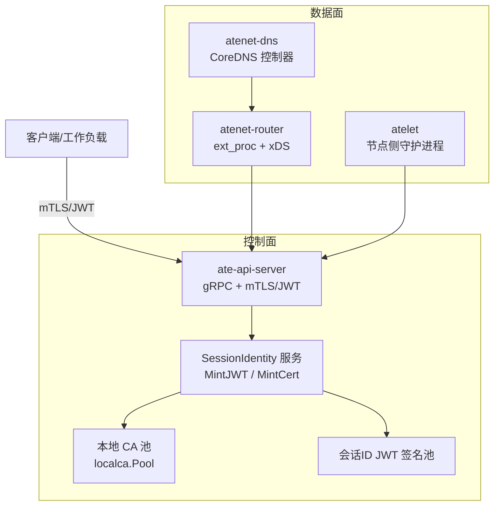
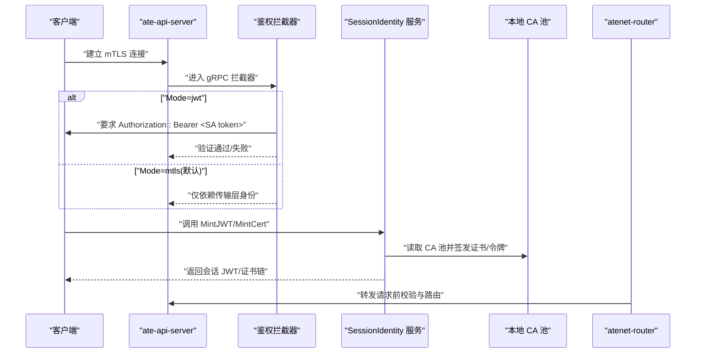
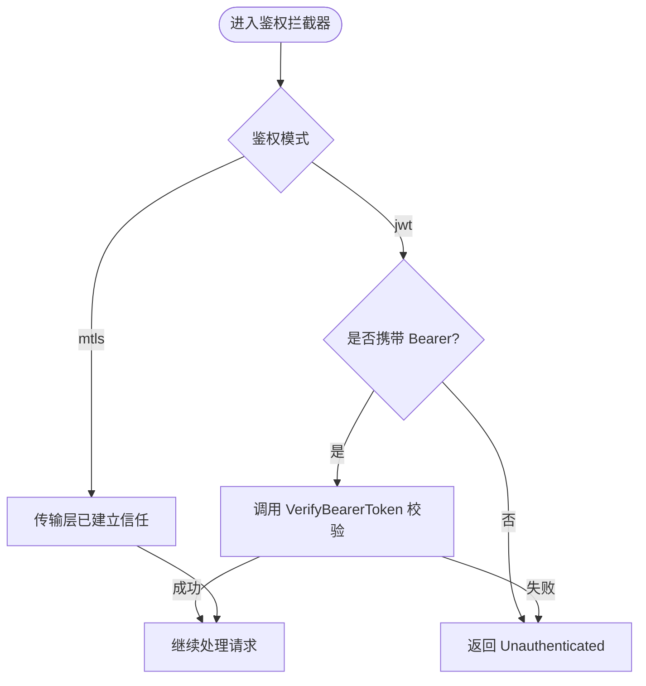
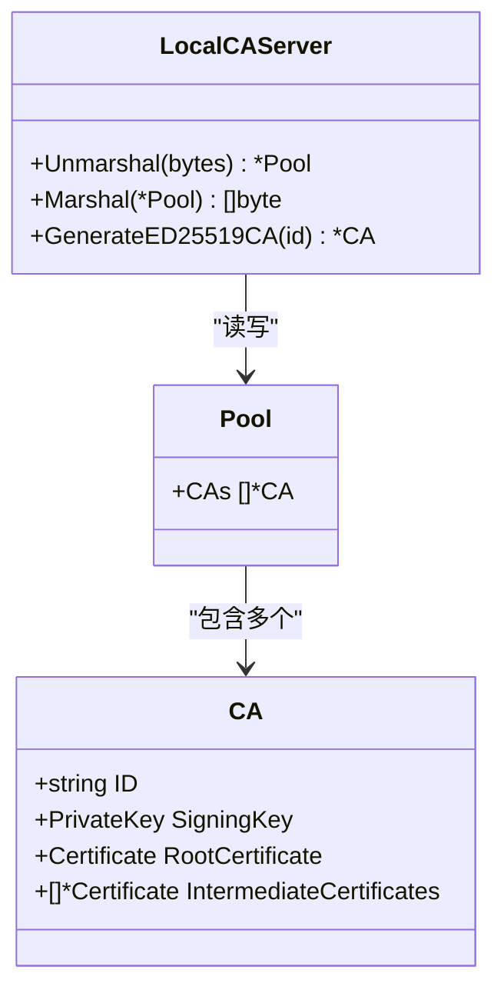
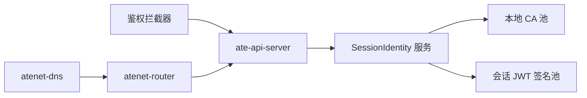

# 安全问题排查

<cite>
**本文引用的文件**   
- [internal/ateapiauth/server.go](file://internal/ateapiauth/server.go)
- [cmd/ateapi/internal/sessionidentity/sessionidentity.go](file://cmd/ateapi/internal/sessionidentity/sessionidentity.go)
- [pkg/proto/ateapipb/ateapi_grpc.pb.go](file://pkg/proto/ateapipb/ateapi_grpc.pb.go)
- [internal/localca/localca.go](file://internal/localca/localca.go)
- [cmd/atenet/internal/router/status.go](file://cmd/atenet/internal/router/status.go)
- [manifests/ate-install/ate-api-server.yaml](file://manifests/ate-install/ate-api-server.yaml)
- [manifests/ate-install/atelet.yaml](file://manifests/ate-install/atelet.yaml)
- [manifests/ate-install/atenet-dns.yaml](file://manifests/ate-install/atenet-dns.yaml)
- [docs/threat-model.md](file://docs/threat-model.md)
</cite>

## 目录
1. [引言](#引言)
2. [项目结构](#项目结构)
3. [核心组件](#核心组件)
4. [架构总览](#架构总览)
5. [详细组件分析](#详细组件分析)
6. [依赖关系分析](#依赖关系分析)
7. [性能与可用性考量](#性能与可用性考量)
8. [故障排查指南](#故障排查指南)
9. [结论](#结论)
10. [附录](#附录)

## 引言
本指南聚焦于安全相关问题的全面排查，覆盖认证失败（JWT、mTLS、身份提供商集成）、权限不足（RBAC、网络策略、存储权限）、证书过期与更新（CA管理、自动轮换）、安全审计日志分析（API访问、文件操作、网络流量监控），以及潜在漏洞检测与防护、事件响应与取证分析。文档以代码级实现为依据，提供可操作的步骤和可视化图示，帮助读者快速定位并解决问题。

## 项目结构
与安全相关的核心代码与配置主要分布在以下位置：
- gRPC 服务端鉴权拦截器：internal/ateapiauth/server.go
- 会话身份签发服务（MintJWT/MintCert）：cmd/ateapi/internal/sessionidentity/sessionidentity.go
- gRPC 接口定义（SessionIdentity）：pkg/proto/ateapipb/ateapi_grpc.pb.go
- 本地 CA 池序列化/反序列化与生成：internal/localca/localca.go
- 路由器状态与请求记录（含路径脱敏）：cmd/atenet/internal/router/status.go
- 部署清单（RBAC、ServiceAccount、证书卷挂载等）：manifests/ate-install/*.yaml
- 威胁模型与检测响应建议：docs/threat-model.md

图表来源
- [internal/ateapiauth/server.go:81-127](file://internal/ateapiauth/server.go#L81-L127)
- [cmd/ateapi/internal/sessionidentity/sessionidentity.go:71-142](file://cmd/ateapi/internal/sessionidentity/sessionidentity.go#L71-L142)
- [internal/localca/localca.go:30-120](file://internal/localca/localca.go#L30-L120)
- [cmd/atenet/internal/router/status.go:113-130](file://cmd/atenet/internal/router/status.go#L113-L130)
- [manifests/ate-install/ate-api-server.yaml:81-133](file://manifests/ate-install/ate-api-server.yaml#L81-L133)

章节来源
- [internal/ateapiauth/server.go:1-182](file://internal/ateapiauth/server.go#L1-L182)
- [cmd/ateapi/internal/sessionidentity/sessionidentity.go:1-226](file://cmd/ateapi/internal/sessionidentity/sessionidentity.go#L1-L226)
- [internal/localca/localca.go:1-193](file://internal/localca/localca.go#L1-L193)
- [cmd/atenet/internal/router/status.go:1-285](file://cmd/atenet/internal/router/status.go#L1-L285)
- [manifests/ate-install/ate-api-server.yaml:1-201](file://manifests/ate-install/ate-api-server.yaml#L1-L201)
- [manifests/ate-install/atelet.yaml:1-126](file://manifests/ate-install/atelet.yaml#L1-L126)
- [manifests/ate-install/atenet-dns.yaml:1-176](file://manifests/ate-install/atenet-dns.yaml#L1-L176)
- [docs/threat-model.md:1-141](file://docs/threat-model.md#L1-L141)

## 核心组件
- gRPC 鉴权拦截器：支持 mTLS 与 JWT 两种模式；在 JWT 模式下要求每个 RPC 携带 Bearer Token，并在未提供或校验失败时返回 Unauthenticated。
- 会话身份签发服务：提供 MintJWT（基于客户端 SA JWT 签发会话 JWT）与 MintCert（基于 mTLS 与 CSR 签发会话证书）。
- 本地 CA 池：用于签发会话证书，支持序列化和反序列化，便于持久化与轮换。
- 路由器状态与审计：记录最近请求（包含时间戳、客户端、Host、Path、Method、Action、Target、Duration），并对查询字符串进行脱敏。
- 部署清单：定义 RBAC、ServiceAccount、证书卷挂载、端口暴露等，确保最小权限与必要的安全能力。

章节来源
- [internal/ateapiauth/server.go:35-70](file://internal/ateapiauth/server.go#L35-L70)
- [cmd/ateapi/internal/sessionidentity/sessionidentity.go:71-142](file://cmd/ateapi/internal/sessionidentity/sessionidentity.go#L71-L142)
- [internal/localca/localca.go:30-120](file://internal/localca/localca.go#L30-L120)
- [cmd/atenet/internal/router/status.go:113-130](file://cmd/atenet/internal/router/status.go#L113-L130)
- [manifests/ate-install/ate-api-server.yaml:16-56](file://manifests/ate-install/ate-api-server.yaml#L16-L56)

## 架构总览
下图展示了从客户端到 API 服务器、会话身份服务、CA 池及路由器的交互流程，涵盖认证、授权与凭证签发的关键路径。

图表来源
- [internal/ateapiauth/server.go:81-127](file://internal/ateapiauth/server.go#L81-L127)
- [cmd/ateapi/internal/sessionidentity/sessionidentity.go:71-142](file://cmd/ateapi/internal/sessionidentity/sessionidentity.go#L71-L142)
- [internal/localca/localca.go:30-120](file://internal/localca/localca.go#L30-L120)
- [pkg/proto/ateapipb/ateapi_grpc.pb.go:762-881](file://pkg/proto/ateapipb/ateapi_grpc.pb.go#L762-L881)

## 详细组件分析

### 认证失败诊断（JWT、mTLS、身份提供商集成）
- 鉴权模式选择与校验
  - 支持 ModeMTLS（默认）与 ModeJWT；当 Mode=jwt 时必须提供 VerifyBearerToken 回调，否则启动即报错。
  - 未携带 Bearer 或格式不正确将直接返回 Unauthenticated。
- JWT 签发流程（MintJWT）
  - 需要有效的客户端 SA JWT（Authorization: Bearer），并通过 k8sjwt.Verify 校验 Issuer/Audience。
  - 签发会话 JWT 时需指定至少一个 Audience，并使用会话 ID JWT 签名池中的密钥进行签名。
- mTLS 证书签发流程（MintCert）
  - 必须通过 mTLS 连接，且对端证书存在；解析并校验 CSR 后使用本地 CA 池签发短期会话证书。
  - 返回的证书链包含会话证书与中间证书，供后续通信使用。

图表来源
- [internal/ateapiauth/server.go:81-127](file://internal/ateapiauth/server.go#L81-L127)
- [cmd/ateapi/internal/sessionidentity/sessionidentity.go:71-142](file://cmd/ateapi/internal/sessionidentity/sessionidentity.go#L71-L142)

章节来源
- [internal/ateapiauth/server.go:35-70](file://internal/ateapiauth/server.go#L35-L70)
- [internal/ateapiauth/server.go:141-152](file://internal/ateapiauth/server.go#L141-L152)
- [cmd/ateapi/internal/sessionidentity/sessionidentity.go:71-142](file://cmd/ateapi/internal/sessionidentity/sessionidentity.go#L71-L142)
- [cmd/ateapi/internal/sessionidentity/sessionidentity.go:144-225](file://cmd/ateapi/internal/sessionidentity/sessionidentity.go#L144-L225)
- [pkg/proto/ateapipb/ateapi_grpc.pb.go:762-881](file://pkg/proto/ateapipb/ateapi_grpc.pb.go#L762-L881)

### 权限不足问题排查（RBAC、网络策略、存储权限）
- RBAC 权限
  - ate-api-server 与 atelet 均定义了 ServiceAccount 与 ClusterRole/ClusterRoleBinding，遵循最小权限原则。
  - Secret 读取权限有意不授予集群范围，需按命名空间与资源名精确绑定。
- 网络策略
  - 威胁模型建议使用 Kubernetes NetworkPolicy 限制外部与内部访问，默认拒绝入站，按需放行。
- 存储权限
  - 快照与对象存储访问应基于身份派生凭据，避免工作负载直接访问敏感桶；必要时采用信封加密与条件 IAM。

章节来源
- [manifests/ate-install/ate-api-server.yaml:16-56](file://manifests/ate-install/ate-api-server.yaml#L16-L56)
- [manifests/ate-install/atelet.yaml:22-44](file://manifests/ate-install/atelet.yaml#L22-L44)
- [docs/threat-model.md:67-91](file://docs/threat-model.md#L67-L91)
- [docs/threat-model.md:79-114](file://docs/threat-model.md#L79-L114)

### 证书过期与更新（CA 管理、自动轮换）
- 本地 CA 池
  - localca.Pool 支持多 CA，包含根证书与中间证书，并提供 Marshal/Unmarshal 用于持久化。
  - GenerateED25519CA 可用于生成新的 ED25519 CA（有效期默认一年）。
- 会话证书签发
  - MintCert 使用 CA 池签发短期会话证书，并附带中间证书链；证书有效期较短，适合频繁轮换。
- 部署与卷挂载
  - ate-api-server 通过 projected secret/clusterTrustBundle 挂载会话 CA 池与 workerpool CA 证书，便于动态更新。

图表来源
- [internal/localca/localca.go:30-120](file://internal/localca/localca.go#L30-L120)
- [internal/localca/localca.go:159-192](file://internal/localca/localca.go#L159-L192)
- [cmd/ateapi/internal/sessionidentity/sessionidentity.go:168-225](file://cmd/ateapi/internal/sessionidentity/sessionidentity.go#L168-L225)
- [manifests/ate-install/ate-api-server.yaml:152-184](file://manifests/ate-install/ate-api-server.yaml#L152-L184)

章节来源
- [internal/localca/localca.go:30-120](file://internal/localca/localca.go#L30-L120)
- [internal/localca/localca.go:159-192](file://internal/localca/localca.go#L159-L192)
- [cmd/ateapi/internal/sessionidentity/sessionidentity.go:168-225](file://cmd/ateapi/internal/sessionidentity/sessionidentity.go#L168-L225)
- [manifests/ate-install/ate-api-server.yaml:152-184](file://manifests/ate-install/ate-api-server.yaml#L152-L184)

### 安全审计日志分析（API 访问、文件操作、网络流量）
- API 访问记录
  - atenet-router 的状态端点会记录最近的请求（时间戳、客户端、Host、Path、Method、Action、Target、Duration），并对查询字符串进行脱敏，避免泄露凭据。
- 文件操作审计
  - 威胁模型建议启用所有对外提供 API 的组件的审计日志，包括快照与对象存储访问。
- 网络流量监控
  - 结合 OpenTelemetry 与 Prometheus 指标，配合 NetworkPolicy 与防火墙规则，形成端到端可见性。

章节来源
- [cmd/atenet/internal/router/status.go:113-130](file://cmd/atenet/internal/router/status.go#L113-L130)
- [docs/threat-model.md:134-141](file://docs/threat-model.md#L134-L141)

### 潜在安全漏洞的检测与防护
- 最小权限与隔离
  - 控制面与数据面隔离，避免共置；默认拒绝跨域访问，按需放行。
- 凭据与证书管理
  - 会话凭据短期有效，强制 mTLS；避免在沙箱内暴露敏感凭据，优先使用代理注入或信封加密。
- 防重放与防篡改
  - 会话 JWT 包含受众绑定与短有效期；证书链包含中间证书，便于验证与轮换。
- 威胁检测与响应
  - 接入威胁检测系统，支持动态策略更新与快速隔离（如暂停/快照标记）。

章节来源
- [docs/threat-model.md:75-114](file://docs/threat-model.md#L75-L114)
- [docs/threat-model.md:134-141](file://docs/threat-model.md#L134-L141)

### 安全事件响应与取证分析
- 取证要点
  - 收集 API 访问记录、路由请求明细、证书签发与 CA 池变更历史、Kubernetes 审计日志。
- 响应措施
  - 动态更新策略，暂停可疑 Actor，触发快照并标记不可恢复；关联节点与调度结果，防止横向移动。
- 持续改进
  - 将威胁模型转化为自动化审查技能与回归测试，持续评估风险。

章节来源
- [docs/threat-model.md:134-141](file://docs/threat-model.md#L134-L141)

## 依赖关系分析
- 组件耦合
  - SessionIdentity 服务依赖本地 CA 池与会话 JWT 签名池；鉴权拦截器依赖 gRPC metadata 与自定义验签回调。
- 外部依赖
  - Kubernetes RBAC、Secret/ConfigMap、ClusterTrustBundle；OpenTelemetry/Prometheus 用于遥测与指标。
- 潜在循环依赖
  - 当前实现未见明显循环依赖；鉴权拦截器为单向入口，会话签发服务为独立 gRPC 服务。

图表来源
- [internal/ateapiauth/server.go:81-127](file://internal/ateapiauth/server.go#L81-L127)
- [cmd/ateapi/internal/sessionidentity/sessionidentity.go:71-142](file://cmd/ateapi/internal/sessionidentity/sessionidentity.go#L71-L142)
- [internal/localca/localca.go:30-120](file://internal/localca/localca.go#L30-L120)
- [cmd/atenet/internal/router/status.go:113-130](file://cmd/atenet/internal/router/status.go#L113-L130)

章节来源
- [internal/ateapiauth/server.go:81-127](file://internal/ateapiauth/server.go#L81-L127)
- [cmd/ateapi/internal/sessionidentity/sessionidentity.go:71-142](file://cmd/ateapi/internal/sessionidentity/sessionidentity.go#L71-L142)
- [internal/localca/localca.go:30-120](file://internal/localca/localca.go#L30-L120)
- [cmd/atenet/internal/router/status.go:113-130](file://cmd/atenet/internal/router/status.go#L113-L130)

## 性能与可用性考量
- 鉴权开销
  - JWT 校验与 mTLS 握手均有额外开销；建议在高频路径上缓存必要的公钥/证书信息，减少磁盘 I/O。
- 证书签发
  - 会话证书有效期短，适合频繁轮换；注意 CA 池加载与解析的性能影响。
- 路由记录
  - 请求记录采用环形缓冲区，避免无限增长；但需注意在高并发下的锁竞争。

[本节为通用指导，无需特定文件引用]

## 故障排查指南
- 认证失败（JWT）
  - 检查是否启用 Mode=jwt 并正确配置 VerifyBearerToken。
  - 确认客户端携带 Authorization: Bearer <SA token>，且 Issuer/Audience 匹配。
  - 查看会话 JWT 签发是否满足 Audience 非空与签名池可用。
- 认证失败（mTLS）
  - 确认对端证书存在且链路完整；检查 CSR 签名校验是否通过。
  - 核查 CA 池文件是否可读、是否包含根与中间证书。
- 权限不足（RBAC）
  - 核对 ServiceAccount 与 Role/ClusterRole 绑定是否正确；Secret 读取是否按命名空间与资源名限定。
- 网络策略
  - 使用 NetworkPolicy 默认拒绝入站，逐步放开必要端口；结合威胁模型建议进行加固。
- 存储权限
  - 确保快照访问基于身份派生凭据；避免工作负载直接访问敏感桶；考虑信封加密与条件 IAM。
- 证书过期
  - 检查 CA 池有效期与轮换策略；更新 projected secret/clusterTrustBundle 并确保服务重启或热加载。
- 审计与取证
  - 拉取 atenet-router 状态端点的最近请求记录；开启并收集 API 与存储审计日志；结合 OTel/Prometheus 指标进行分析。

章节来源
- [internal/ateapiauth/server.go:35-70](file://internal/ateapiauth/server.go#L35-L70)
- [cmd/ateapi/internal/sessionidentity/sessionidentity.go:71-142](file://cmd/ateapi/internal/sessionidentity/sessionidentity.go#L71-L142)
- [cmd/ateapi/internal/sessionidentity/sessionidentity.go:168-225](file://cmd/ateapi/internal/sessionidentity/sessionidentity.go#L168-L225)
- [manifests/ate-install/ate-api-server.yaml:16-56](file://manifests/ate-install/ate-api-server.yaml#L16-L56)
- [manifests/ate-install/ate-api-server.yaml:152-184](file://manifests/ate-install/ate-api-server.yaml#L152-L184)
- [cmd/atenet/internal/router/status.go:113-130](file://cmd/atenet/internal/router/status.go#L113-L130)
- [docs/threat-model.md:67-91](file://docs/threat-model.md#L67-L91)
- [docs/threat-model.md:134-141](file://docs/threat-model.md#L134-L141)

## 结论
通过明确鉴权模式、严格校验凭据、最小权限 RBAC、默认拒绝的网络策略、短期会话证书与 CA 池轮换、以及完善的审计与取证机制，可以显著提升系统的安全性。建议将威胁模型转化为自动化审查与回归测试，持续评估与改进安全风险。

[本节为总结，无需特定文件引用]

## 附录
- 部署清单参考
  - ate-api-server：RBAC、ServiceAccount、证书卷挂载、端口暴露
  - atelet：DaemonSet、最小权限、hostPath 挂载
  - atenet-dns：CoreDNS 控制器与角色绑定

章节来源
- [manifests/ate-install/ate-api-server.yaml:58-201](file://manifests/ate-install/ate-api-server.yaml#L58-L201)
- [manifests/ate-install/atelet.yaml:46-126](file://manifests/ate-install/atelet.yaml#L46-L126)
- [manifests/ate-install/atenet-dns.yaml:74-176](file://manifests/ate-install/atenet-dns.yaml#L74-L176)
