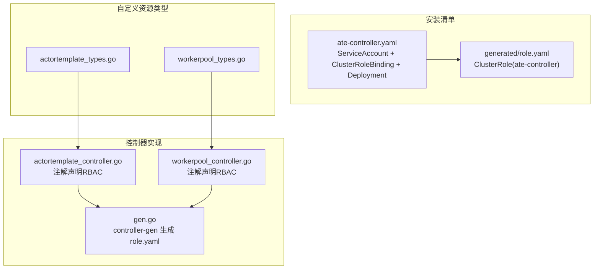
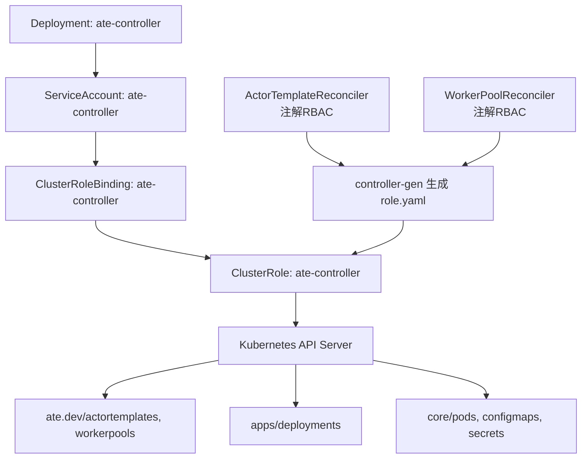
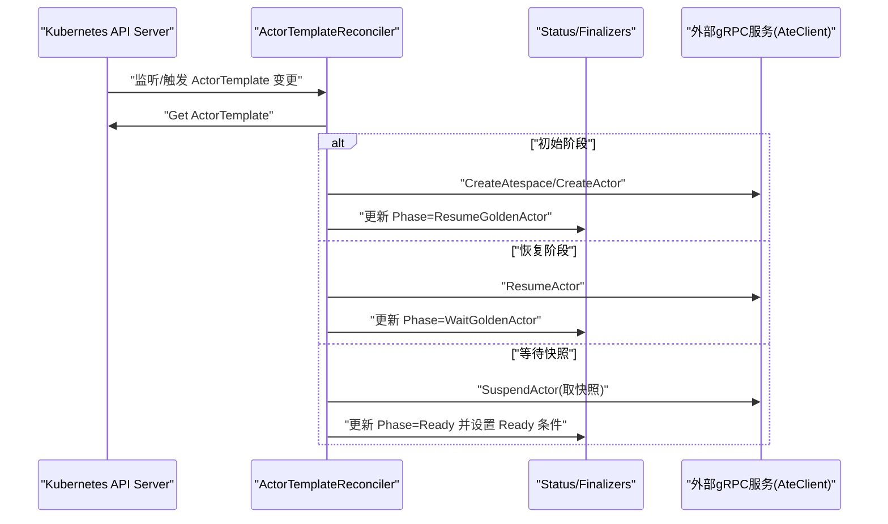
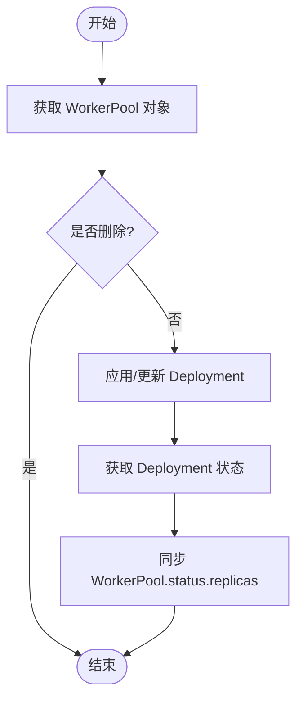
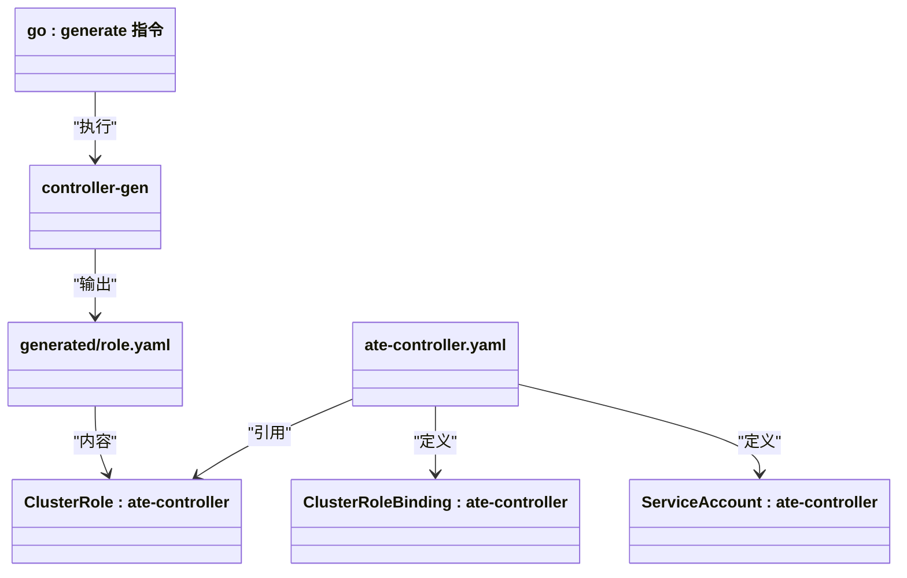
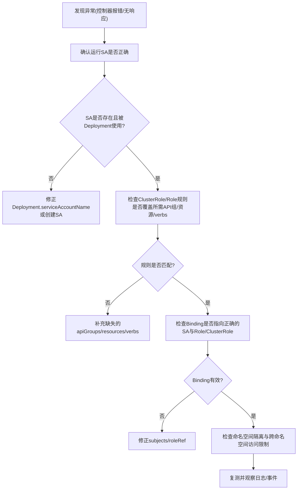
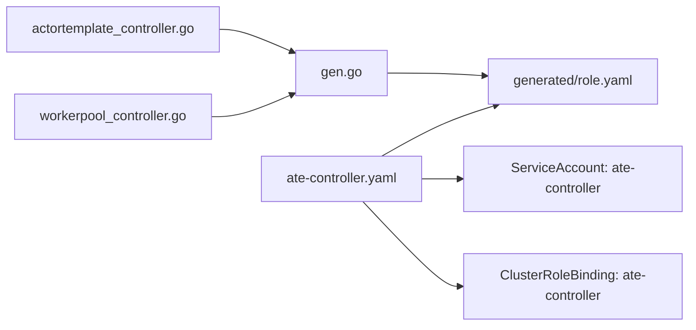

# RBAC权限配置问题

<cite>
**本文引用的文件**
- [manifests/ate-install/generated/role.yaml](file://manifests/ate-install/generated/role.yaml)
- [manifests/ate-install/ate-controller.yaml](file://manifests/ate-install/ate-controller.yaml)
- [cmd/atecontroller/internal/controllers/gen.go](file://cmd/atecontroller/internal/controllers/gen.go)
- [cmd/atecontroller/internal/controllers/actortemplate_controller.go](file://cmd/atecontroller/internal/controllers/actortemplate_controller.go)
- [cmd/atecontroller/internal/controllers/workerpool_controller.go](file://cmd/atecontroller/internal/controllers/workerpool_controller.go)
- [pkg/api/v1alpha1/actortemplate_types.go](file://pkg/api/v1alpha1/actortemplate_types.go)
- [pkg/api/v1alpha1/workerpool_types.go](file://pkg/api/v1alpha1/workerpool_types.go)
- [internal/ateapiauth/client.go](file://internal/ateapiauth/client.go)
- [cmd/kubectl-ate/internal/cmd/root.go](file://cmd/kubectl-ate/internal/cmd/root.go)
</cite>

## 目录
1. [简介](#简介)
2. [项目结构](#项目结构)
3. [核心组件](#核心组件)
4. [架构总览](#架构总览)
5. [详细组件分析](#详细组件分析)
6. [依赖关系分析](#依赖关系分析)
7. [性能与可扩展性考虑](#性能与可扩展性考虑)
8. [故障排查指南](#故障排查指南)
9. [结论](#结论)
10. [附录](#附录)

## 简介
本文聚焦于 Kubernetes RBAC 权限配置问题的排查与解决，围绕本仓库中自定义资源 WorkerPool、ActorTemplate 的控制器权限模型展开。内容涵盖：
- 如何诊断 Role/ClusterRole 配置错误（规则定义、资源访问控制、命名空间隔离）
- ServiceAccount 绑定错误的常见原因与修复方法
- 结合源码与清单文件的 RBAC 权限示例说明
- 权限验证工具与调试命令的使用方法

## 项目结构
本项目通过控制器模式管理自定义资源 ActorTemplate 与 WorkerPool，并将它们映射到标准资源（如 Deployment、Pod、ConfigMap、Secret）。RBAC 权限由控制器代码中的注解生成，并打包为 ClusterRole 与 ClusterRoleBinding 部署到集群。

图表来源
- [manifests/ate-install/ate-controller.yaml:1-100](file://manifests/ate-install/ate-controller.yaml#L1-L100)
- [manifests/ate-install/generated/role.yaml:1-83](file://manifests/ate-install/generated/role.yaml#L1-L83)
- [cmd/atecontroller/internal/controllers/gen.go:1-18](file://cmd/atecontroller/internal/controllers/gen.go#L1-L18)
- [cmd/atecontroller/internal/controllers/actortemplate_controller.go:1-211](file://cmd/atecontroller/internal/controllers/actortemplate_controller.go#L1-L211)
- [cmd/atecontroller/internal/controllers/workerpool_controller.go:1-121](file://cmd/atecontroller/internal/controllers/workerpool_controller.go#L1-L121)
- [pkg/api/v1alpha1/actortemplate_types.go:1-390](file://pkg/api/v1alpha1/actortemplate_types.go#L1-L390)
- [pkg/api/v1alpha1/workerpool_types.go:1-136](file://pkg/api/v1alpha1/workerpool_types.go#L1-L136)

章节来源
- [manifests/ate-install/ate-controller.yaml:1-100](file://manifests/ate-install/ate-controller.yaml#L1-L100)
- [manifests/ate-install/generated/role.yaml:1-83](file://manifests/ate-install/generated/role.yaml#L1-L83)
- [cmd/atecontroller/internal/controllers/gen.go:1-18](file://cmd/atecontroller/internal/controllers/gen.go#L1-L18)
- [cmd/atecontroller/internal/controllers/actortemplate_controller.go:1-211](file://cmd/atecontroller/internal/controllers/actortemplate_controller.go#L1-L211)
- [cmd/atecontroller/internal/controllers/workerpool_controller.go:1-121](file://cmd/atecontroller/internal/controllers/workerpool_controller.go#L1-L121)
- [pkg/api/v1alpha1/actortemplate_types.go:1-390](file://pkg/api/v1alpha1/actortemplate_types.go#L1-L390)
- [pkg/api/v1alpha1/workerpool_types.go:1-136](file://pkg/api/v1alpha1/workerpool_types.go#L1-L136)

## 核心组件
- 控制器与 RBAC 注解
  - ActorTemplate 控制器需要读写 ate.dev/actortemplates、ate.dev/workerpools、apps/deployments、core/pods、core/configmaps、core/secrets 等资源的权限。
  - WorkerPool 控制器需要读写 ate.dev/workerpools、apps/deployments 等资源的权限。
- 生成的 ClusterRole
  - 由 controller-gen 根据注解生成 manifests/ate-install/generated/role.yaml，包含上述资源的 verbs 集合。
- 绑定与运行身份
  - manifests/ate-install/ate-controller.yaml 定义了 ServiceAccount、ClusterRoleBinding 以及 Controller 的 Deployment，确保以 ate-controller SA 的身份运行并拥有 ClusterRole 权限。

章节来源
- [cmd/atecontroller/internal/controllers/actortemplate_controller.go:55-62](file://cmd/atecontroller/internal/controllers/actortemplate_controller.go#L55-L62)
- [cmd/atecontroller/internal/controllers/workerpool_controller.go:40-43](file://cmd/atecontroller/internal/controllers/workerpool_controller.go#L40-L43)
- [manifests/ate-install/generated/role.yaml:1-83](file://manifests/ate-install/generated/role.yaml#L1-L83)
- [manifests/ate-install/ate-controller.yaml:20-50](file://manifests/ate-install/ate-controller.yaml#L20-L50)

## 架构总览
下图展示了控制器、RBAC 与自定义资源之间的关系，以及运行时身份与权限的绑定路径。

图表来源
- [manifests/ate-install/ate-controller.yaml:20-50](file://manifests/ate-install/ate-controller.yaml#L20-L50)
- [manifests/ate-install/generated/role.yaml:1-83](file://manifests/ate-install/generated/role.yaml#L1-L83)
- [cmd/atecontroller/internal/controllers/actortemplate_controller.go:55-62](file://cmd/atecontroller/internal/controllers/actortemplate_controller.go#L55-L62)
- [cmd/atecontroller/internal/controllers/workerpool_controller.go:40-43](file://cmd/atecontroller/internal/controllers/workerpool_controller.go#L40-L43)
- [cmd/atecontroller/internal/controllers/gen.go:1-18](file://cmd/atecontroller/internal/controllers/gen.go#L1-L18)

## 详细组件分析

### 组件A：ActorTemplate 控制器权限与流程
- 权限需求
  - 读取/写入 ate.dev/actortemplates、ate.dev/workerpools
  - 管理 apps/deployments、core/pods、core/configmaps、core/secrets
  - 更新 status 与 finalizers
- 关键流程
  - Reconcile 循环获取 ActorTemplate，按状态机推进（创建/恢复/等待快照/就绪），期间调用外部 gRPC 服务完成工作负载生命周期操作。
  - 使用 Status 子资源记录阶段与条件。

图表来源
- [cmd/atecontroller/internal/controllers/actortemplate_controller.go:66-187](file://cmd/atecontroller/internal/controllers/actortemplate_controller.go#L66-L187)
- [cmd/atecontroller/internal/controllers/actortemplate_controller.go:55-62](file://cmd/atecontroller/internal/controllers/actortemplate_controller.go#L55-L62)

章节来源
- [cmd/atecontroller/internal/controllers/actortemplate_controller.go:55-62](file://cmd/atecontroller/internal/controllers/actortemplate_controller.go#L55-L62)
- [cmd/atecontroller/internal/controllers/actortemplate_controller.go:66-187](file://cmd/atecontroller/internal/controllers/actortemplate_controller.go#L66-L187)

### 组件B：WorkerPool 控制器权限与流程
- 权限需求
  - 读取/写入 ate.dev/workerpools
  - 管理 apps/deployments
  - 更新 status
- 关键流程
  - Reconcile 循环将 WorkerPool 的期望副本数与应用至 Deployment，并同步状态。

图表来源
- [cmd/atecontroller/internal/controllers/workerpool_controller.go:47-112](file://cmd/atecontroller/internal/controllers/workerpool_controller.go#L47-L112)
- [cmd/atecontroller/internal/controllers/workerpool_controller.go:40-43](file://cmd/atecontroller/internal/controllers/workerpool_controller.go#L40-L43)

章节来源
- [cmd/atecontroller/internal/controllers/workerpool_controller.go:40-43](file://cmd/atecontroller/internal/controllers/workerpool_controller.go#L40-L43)
- [cmd/atecontroller/internal/controllers/workerpool_controller.go:47-112](file://cmd/atecontroller/internal/controllers/workerpool_controller.go#L47-L112)

### 组件C：RBAC 生成与清单装配
- 生成机制
  - 控制器源码中使用 kubebuilder RBAC 注解声明所需权限。
  - 通过 go generate 调用 controller-gen 生成 manifests/ate-install/generated/role.yaml。
- 装配方式
  - ate-controller.yaml 中定义 ate-controller ServiceAccount、ClusterRoleBinding 与 Deployment，使控制器以 ate-controller SA 运行并绑定 ClusterRole。

图表来源
- [cmd/atecontroller/internal/controllers/gen.go:1-18](file://cmd/atecontroller/internal/controllers/gen.go#L1-L18)
- [manifests/ate-install/generated/role.yaml:1-83](file://manifests/ate-install/generated/role.yaml#L1-L83)
- [manifests/ate-install/ate-controller.yaml:20-50](file://manifests/ate-install/ate-controller.yaml#L20-L50)

章节来源
- [cmd/atecontroller/internal/controllers/gen.go:1-18](file://cmd/atecontroller/internal/controllers/gen.go#L1-L18)
- [manifests/ate-install/generated/role.yaml:1-83](file://manifests/ate-install/generated/role.yaml#L1-L83)
- [manifests/ate-install/ate-controller.yaml:20-50](file://manifests/ate-install/ate-controller.yaml#L20-L50)

### 概念性概览
以下流程图展示“权限不足”的典型定位路径，适用于 Role/ClusterRole、ServiceAccount、Binding 三类问题。

[此图为概念性流程，不直接映射具体源文件]

## 依赖关系分析
- 控制器对 Kubernetes 资源的依赖
  - ActorTemplate 控制器：ate.dev/actortemplates、ate.dev/workerpools、apps/deployments、core/pods、core/configmaps、core/secrets
  - WorkerPool 控制器：ate.dev/workerpools、apps/deployments
- 生成与部署依赖
  - gen.go 驱动 controller-gen 生成 role.yaml
  - ate-controller.yaml 装配 SA、CRB、Deployment，并以 ate-controller SA 运行

图表来源
- [cmd/atecontroller/internal/controllers/actortemplate_controller.go:55-62](file://cmd/atecontroller/internal/controllers/actortemplate_controller.go#L55-L62)
- [cmd/atecontroller/internal/controllers/workerpool_controller.go:40-43](file://cmd/atecontroller/internal/controllers/workerpool_controller.go#L40-L43)
- [cmd/atecontroller/internal/controllers/gen.go:1-18](file://cmd/atecontroller/internal/controllers/gen.go#L1-L18)
- [manifests/ate-install/generated/role.yaml:1-83](file://manifests/ate-install/generated/role.yaml#L1-L83)
- [manifests/ate-install/ate-controller.yaml:20-50](file://manifests/ate-install/ate-controller.yaml#L20-L50)

章节来源
- [cmd/atecontroller/internal/controllers/actortemplate_controller.go:55-62](file://cmd/atecontroller/internal/controllers/actortemplate_controller.go#L55-L62)
- [cmd/atecontroller/internal/controllers/workerpool_controller.go:40-43](file://cmd/atecontroller/internal/controllers/workerpool_controller.go#L40-L43)
- [cmd/atecontroller/internal/controllers/gen.go:1-18](file://cmd/atecontroller/internal/controllers/gen.go#L1-L18)
- [manifests/ate-install/generated/role.yaml:1-83](file://manifests/ate-install/generated/role.yaml#L1-L83)
- [manifests/ate-install/ate-controller.yaml:20-50](file://manifests/ate-install/ate-controller.yaml#L20-L50)

## 性能与可扩展性考虑
- 最小权限原则：仅授予控制器实际需要的 verbs 与资源，避免过度授权。
- 分模块权限：若未来拆分为多个控制器，建议按职责拆分 Role/ClusterRole，降低耦合面。
- 状态更新频率：减少不必要的 Status 更新，避免频繁写 API Server。
- 缓存与 Informer：合理使用 informer 列表/监听，避免轮询导致的 API 压力。

[本节提供通用指导，无需特定文件引用]

## 故障排查指南
- 常见问题与定位要点
  - 未生效的 RBAC 规则
    - 核对注解是否完整，重新生成 role.yaml 并部署。
    - 检查 ClusterRole 中 apiGroups、resources、verbs 是否覆盖控制器实际调用。
  - ServiceAccount 绑定错误
    - 确认 Deployment 的 serviceAccountName 指向 ate-controller。
    - 确认 ClusterRoleBinding 的 subjects.namespace/name 与 roleRef.name 正确。
  - 命名空间隔离
    - 若需跨命名空间访问，应使用 ClusterRole 而非 Role；否则需在目标命名空间内单独授权。
  - 自定义资源状态/终态器
    - 确认已包含 actortemplates/status、workerpools/status 与 finalizers 的 update/patch 权限。
- 实用命令与工具
  - kubectl-ate 客户端
    - 支持 --kubeconfig、--context、--endpoint 等参数，便于本地调试与直连 gRPC 端点。
  - 查看控制器日志
    - 在 ate-system 命名空间下查看 ate-controller Pod 日志，关注权限拒绝相关错误信息。
  - 校验 RBAC
    - 使用 kubectl auth can-i --as=system:serviceaccount:ate-system:ate-controller --all-namespaces 进行快速自检。
  - 查看绑定与角色
    - kubectl get clusterrolebinding ate-controller -o yaml
    - kubectl get clusterrole ate-controller -o yaml
- 认证与令牌
  - 控制器在 Pod 内默认挂载 ServiceAccount Token 与 CA，用于与 API Server 通信。
  - 参考常量定义位置以了解默认路径与行为。

章节来源
- [manifests/ate-install/ate-controller.yaml:72-100](file://manifests/ate-install/ate-controller.yaml#L72-L100)
- [manifests/ate-install/ate-controller.yaml:20-50](file://manifests/ate-install/ate-controller.yaml#L20-L50)
- [manifests/ate-install/generated/role.yaml:1-83](file://manifests/ate-install/generated/role.yaml#L1-L83)
- [cmd/kubectl-ate/internal/cmd/root.go:48-61](file://cmd/kubectl-ate/internal/cmd/root.go#L48-L61)
- [internal/ateapiauth/client.go:29-30](file://internal/ateapiauth/client.go#L29-L30)

## 结论
- 本项目的 RBAC 权限通过控制器注解自动生成，集中维护在 generated/role.yaml，并由 ate-controller.yaml 装配到集群。
- 排查 RBAC 问题时，优先从“运行身份(SA) → 绑定(CRB) → 角色规则(CR/Role)”三层逐层核对。
- 对于自定义资源 WorkerPool、ActorTemplate，务必确保其 status/finalizers 的读写权限均已覆盖。
- 借助 kubectl-ate 与 kubectl 内置鉴权检查命令，可快速定位与验证权限问题。

[本节为总结性内容，无需特定文件引用]

## 附录
- 自定义资源类型参考
  - ActorTemplate：包含容器、卷、快照策略、沙箱类与工作池选择器等字段。
  - WorkerPool：包含副本数、镜像、调度模板、沙箱类等字段。
- 清单与生成链路
  - 控制器注解 → controller-gen → role.yaml → 安装清单装配

章节来源
- [pkg/api/v1alpha1/actortemplate_types.go:1-390](file://pkg/api/v1alpha1/actortemplate_types.go#L1-L390)
- [pkg/api/v1alpha1/workerpool_types.go:1-136](file://pkg/api/v1alpha1/workerpool_types.go#L1-L136)
- [cmd/atecontroller/internal/controllers/gen.go:1-18](file://cmd/atecontroller/internal/controllers/gen.go#L1-L18)
- [manifests/ate-install/generated/role.yaml:1-83](file://manifests/ate-install/generated/role.yaml#L1-L83)
- [manifests/ate-install/ate-controller.yaml:20-50](file://manifests/ate-install/ate-controller.yaml#L20-L50)
