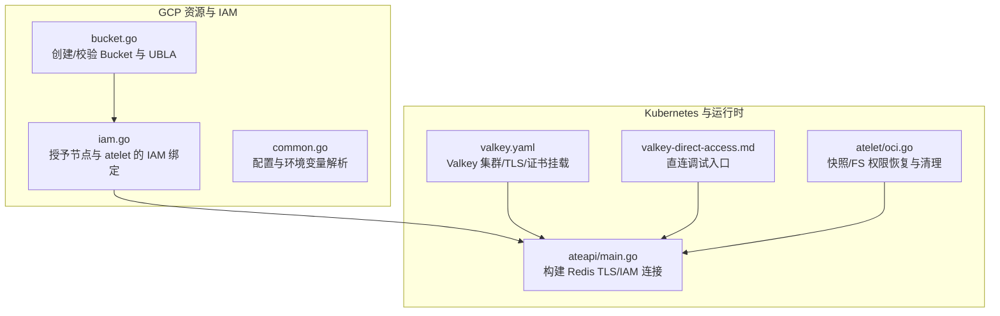
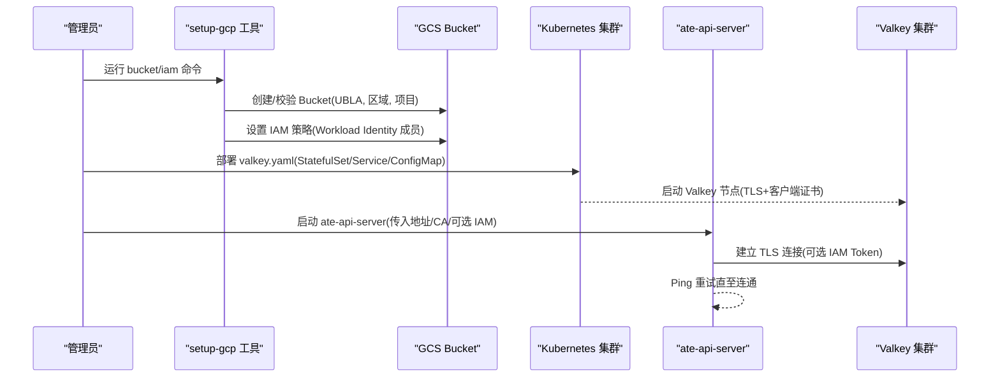
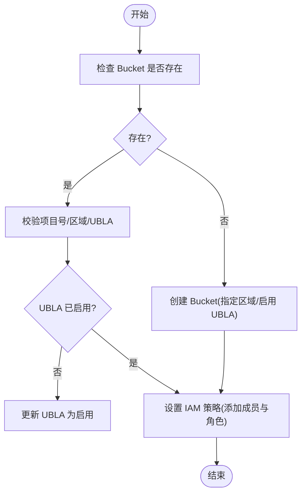
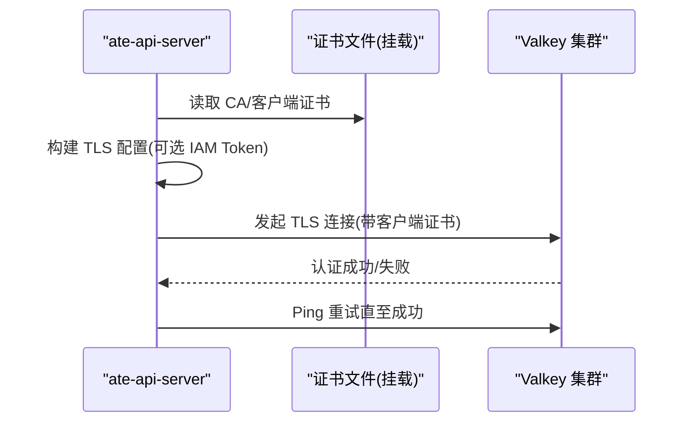
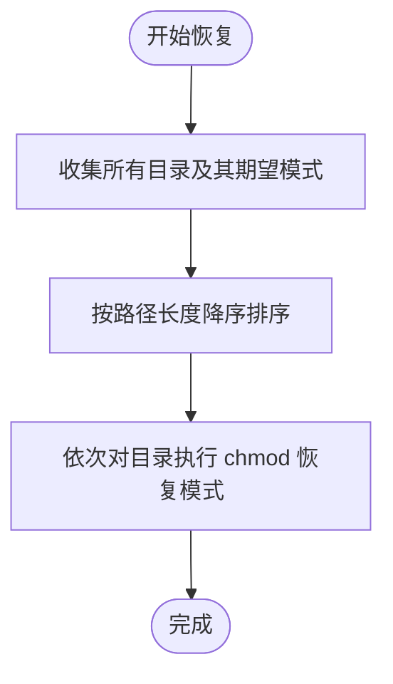
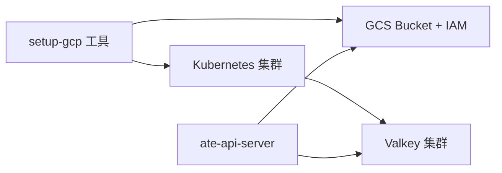

# 存储权限问题

<cite>
**本文引用的文件**   
- [tools/setup-gcp/cmd/bucket.go](file://tools/setup-gcp/cmd/bucket.go)
- [tools/setup-gcp/cmd/iam.go](file://tools/setup-gcp/cmd/iam.go)
- [tools/setup-gcp/cmd/common.go](file://tools/setup-gcp/cmd/common.go)
- [cmd/ateapi/main.go](file://cmd/ateapi/main.go)
- [manifests/ate-install/valkey.yaml](file://manifests/ate-install/valkey.yaml)
- [docs/dev/valkey-direct-access.md](file://docs/dev/valkey-direct-access.md)
- [cmd/atelet/oci.go](file://cmd/atelet/oci.go)
- [cmd/atelet/main_test.go](file://cmd/atelet/main_test.go)
</cite>

## 目录
1. [简介](#简介)
2. [项目结构](#项目结构)
3. [核心组件](#核心组件)
4. [架构总览](#架构总览)
5. [详细组件分析](#详细组件分析)
6. [依赖关系分析](#依赖关系分析)
7. [性能与可用性考虑](#性能与可用性考虑)
8. [故障排除指南](#故障排除指南)
9. [结论](#结论)
10. [附录](#附录)

## 简介
本文件聚焦于存储系统权限问题的排查与解决，覆盖以下关键领域：
- 对象存储（GCS/S3）访问控制配置错误的诊断步骤，包括 IAM 角色、Bucket 权限、访问密钥配置等。
- Redis/Valkey 集群的认证与授权配置，包括 TLS、客户端证书、IAM 鉴权、连接池行为等。
- 文件系统权限与快照读写权限的配置指导。
- 提供存储权限验证工具与故障排除命令的使用方法。

## 项目结构
与存储权限相关的代码与清单主要分布在如下位置：
- GCP 资源与 IAM 初始化：tools/setup-gcp/cmd/*
- API 服务对 Valkey/Redis 的连接与鉴权：cmd/ateapi/main.go
- Valkey 集群部署与 TLS 配置：manifests/ate-install/valkey.yaml
- 直接访问 Valkey 的调试文档：docs/dev/valkey-direct-access.md
- 快照与文件系统权限处理：cmd/atelet/oci.go 及相关测试

图表来源
- [tools/setup-gcp/cmd/bucket.go:31-140](file://tools/setup-gcp/cmd/bucket.go#L31-L140)
- [tools/setup-gcp/cmd/iam.go:51-133](file://tools/setup-gcp/cmd/iam.go#L51-L133)
- [tools/setup-gcp/cmd/common.go:22-42](file://tools/setup-gcp/cmd/common.go#L22-L42)
- [cmd/ateapi/main.go:248-314](file://cmd/ateapi/main.go#L248-L314)
- [manifests/ate-install/valkey.yaml:15-148](file://manifests/ate-install/valkey.yaml#L15-L148)
- [docs/dev/valkey-direct-access.md:1-11](file://docs/dev/valkey-direct-access.md#L1-L11)
- [cmd/atelet/oci.go:474-511](file://cmd/atelet/oci.go#L474-L511)

章节来源
- [tools/setup-gcp/cmd/bucket.go:31-140](file://tools/setup-gcp/cmd/bucket.go#L31-L140)
- [tools/setup-gcp/cmd/iam.go:51-133](file://tools/setup-gcp/cmd/iam.go#L51-L133)
- [tools/setup-gcp/cmd/common.go:22-42](file://tools/setup-gcp/cmd/common.go#L22-L42)
- [cmd/ateapi/main.go:248-314](file://cmd/ateapi/main.go#L248-L314)
- [manifests/ate-install/valkey.yaml:15-148](file://manifests/ate-install/valkey.yaml#L15-L148)
- [docs/dev/valkey-direct-access.md:1-11](file://docs/dev/valkey-direct-access.md#L1-L11)
- [cmd/atelet/oci.go:474-511](file://cmd/atelet/oci.go#L474-L511)

## 核心组件
- GCS Bucket 与 IAM 管理
  - 自动创建或校验 Bucket，确保统一桶级访问控制（UBLA）开启，并校验所属项目与区域。
  - 为工作负载身份（Workload Identity）添加最小化必要的存储角色。
- Valkey/Redis 集群
  - 通过 TLS 强制加密通信，启用客户端证书认证；支持 Google IAM 令牌作为 Redis 鉴权。
  - 使用 Service 暴露端口，StatefulSet 提供稳定网络标识与持久卷。
- 文件系统与快照权限
  - 在恢复镜像时按深度倒序恢复目录模式，避免父目录不可遍历导致子目录无法写入。
  - 清理不可写目录前先 chmod，确保可递归删除。

章节来源
- [tools/setup-gcp/cmd/bucket.go:31-140](file://tools/setup-gcp/cmd/bucket.go#L31-L140)
- [tools/setup-gcp/cmd/iam.go:51-133](file://tools/setup-gcp/cmd/iam.go#L51-L133)
- [manifests/ate-install/valkey.yaml:15-148](file://manifests/ate-install/valkey.yaml#L15-L148)
- [cmd/ateapi/main.go:248-314](file://cmd/ateapi/main.go#L248-L314)
- [cmd/atelet/oci.go:474-511](file://cmd/atelet/oci.go#L474-L511)

## 架构总览
下图展示了从启动到连接 Valkey 的关键流程，以及 GCS Bucket 与 IAM 的关系。

图表来源
- [tools/setup-gcp/cmd/bucket.go:31-140](file://tools/setup-gcp/cmd/bucket.go#L31-L140)
- [tools/setup-gcp/cmd/iam.go:51-133](file://tools/setup-gcp/cmd/iam.go#L51-L133)
- [manifests/ate-install/valkey.yaml:15-148](file://manifests/ate-install/valkey.yaml#L15-L148)
- [cmd/ateapi/main.go:248-314](file://cmd/ateapi/main.go#L248-L314)

## 详细组件分析

### 对象存储（GCS）权限配置与诊断
- 关键实现要点
  - 创建或校验 Bucket：检查是否存在、是否属于目标项目、是否在正确区域、是否启用 UBLA。
  - IAM 绑定：为 Workload Identity 成员添加 storage.objectAdmin 与 storage.bucketViewer 角色。
  - 项目级权限：为 GKE 节点服务账号授予读取对象与制品仓库的最小权限。
- 常见错误与定位
  - Bucket 不属于当前项目或区域不一致：会返回明确错误提示。
  - UBLA 未启用：会自动更新，若失败需检查调用者权限。
  - IAM 策略未包含所需成员：需重新执行 iam 命令或手动补全。
- 建议操作
  - 使用 setup-gcp 工具完成 bucket 与 iam 的幂等初始化。
  - 确认 Workload Identity 映射正确，且成员字符串与命名空间/服务账号一致。

图表来源
- [tools/setup-gcp/cmd/bucket.go:31-140](file://tools/setup-gcp/cmd/bucket.go#L31-L140)
- [tools/setup-gcp/cmd/iam.go:51-133](file://tools/setup-gcp/cmd/iam.go#L51-L133)

章节来源
- [tools/setup-gcp/cmd/bucket.go:31-140](file://tools/setup-gcp/cmd/bucket.go#L31-L140)
- [tools/setup-gcp/cmd/iam.go:51-133](file://tools/setup-gcp/cmd/iam.go#L51-L133)
- [tools/setup-gcp/cmd/common.go:22-42](file://tools/setup-gcp/cmd/common.go#L22-L42)

### Redis/Valkey 集群认证与授权
- 关键实现要点
  - TLS 强制：关闭明文端口，仅启用 tls-port，启用 tls-cluster/tls-replication。
  - 客户端证书认证：tls-auth-clients yes，证书与 CA 通过 projected volume 注入。
  - 连接侧：ate-api-server 支持自定义 CA、ServerName、客户端证书；默认启用 Google IAM 鉴权。
  - 集群初始化：Job 等待 Pod DNS 解析后，使用 valkey-cli 以 TLS 与证书初始化集群。
- 常见问题与定位
  - 证书路径或内容不正确：TLS 握手失败或客户端证书不被信任。
  - ServerName 不匹配：hostname 验证失败。
  - IAM 令牌获取失败：需要正确的 Workload Identity 或默认凭据。
- 建议操作
  - 使用提供的 valkey.yaml 部署，确保 Secret 与 PodCertificate 正常挂载。
  - 参考“直接访问 Valkey”文档进行端到端连通性验证。

图表来源
- [manifests/ate-install/valkey.yaml:15-148](file://manifests/ate-install/valkey.yaml#L15-L148)
- [cmd/ateapi/main.go:248-314](file://cmd/ateapi/main.go#L248-L314)
- [docs/dev/valkey-direct-access.md:1-11](file://docs/dev/valkey-direct-access.md#L1-L11)

章节来源
- [manifests/ate-install/valkey.yaml:15-148](file://manifests/ate-install/valkey.yaml#L15-L148)
- [cmd/ateapi/main.go:248-314](file://cmd/ateapi/main.go#L248-L314)
- [docs/dev/valkey-direct-access.md:1-11](file://docs/dev/valkey-direct-access.md#L1-L11)

### 文件系统权限与快照读写权限
- 关键实现要点
  - 恢复目录模式：按路径长度降序恢复，确保先恢复深层目录再恢复祖先目录，避免父目录不可遍历导致子目录无法写入。
  - 清理不可写目录：先递归将目录设为可写，再进行递归删除，避免 EACCES。
- 常见问题与定位
  - 恢复后某些目录仍为只读：检查恢复顺序与最终 chmod 是否生效。
  - 删除失败：确认是否已先行 chmod 为可写。
- 建议操作
  - 遵循现有恢复逻辑，不要跳过目录模式恢复阶段。
  - 在自定义扩展中保持相同顺序与幂等性。

图表来源
- [cmd/atelet/oci.go:474-511](file://cmd/atelet/oci.go#L474-L511)

章节来源
- [cmd/atelet/oci.go:474-511](file://cmd/atelet/oci.go#L474-L511)
- [cmd/atelet/main_test.go:40-87](file://cmd/atelet/main_test.go#L40-L87)

## 依赖关系分析
- 组件耦合
  - setup-gcp 工具负责基础设施准备（Bucket、IAM），为后续运行期组件提供必要权限。
  - ate-api-server 依赖 Valkey 集群的 TLS 与可选 IAM 鉴权，用于状态持久化与会话管理。
  - Valkey 集群通过 StatefulSet 与 Service 提供稳定网络与持久化存储。
- 外部依赖
  - GCP IAM/Storage API、Google 默认凭据（用于 IAM 令牌）。
  - Kubernetes 证书签发与 Secret 机制（PodCertificate、Secret 挂载）。

图表来源
- [tools/setup-gcp/cmd/bucket.go:31-140](file://tools/setup-gcp/cmd/bucket.go#L31-L140)
- [tools/setup-gcp/cmd/iam.go:51-133](file://tools/setup-gcp/cmd/iam.go#L51-L133)
- [manifests/ate-install/valkey.yaml:15-148](file://manifests/ate-install/valkey.yaml#L15-L148)
- [cmd/ateapi/main.go:248-314](file://cmd/ateapi/main.go#L248-L314)

章节来源
- [tools/setup-gcp/cmd/bucket.go:31-140](file://tools/setup-gcp/cmd/bucket.go#L31-L140)
- [tools/setup-gcp/cmd/iam.go:51-133](file://tools/setup-gcp/cmd/iam.go#L51-L133)
- [manifests/ate-install/valkey.yaml:15-148](file://manifests/ate-install/valkey.yaml#L15-L148)
- [cmd/ateapi/main.go:248-314](file://cmd/ateapi/main.go#L248-L314)

## 性能与可用性考虑
- 连接重试：ate-api-server 在启动时对 Valkey 进行多次 Ping 重试，提升容错能力。
- TLS 开销：启用 TLS 与客户端证书会带来额外握手成本，但显著提升安全性。
- 集群初始化：Valkey 集群初始化 Job 会等待所有 Pod DNS 解析后再执行，保证稳定性。

[本节为通用指导，无需特定文件引用]

## 故障排除指南
- GCS 相关
  - 现象：创建/更新 Bucket 失败或报错项目号/区域不一致。
    - 排查：确认使用的 ProjectID/ProjectNumber/Region 与实际一致；检查 UBLA 是否启用。
    - 修复：重新运行 bucket 与 iam 命令，或手动修正 Bucket 属性与 IAM 策略。
  - 现象：运行时访问对象存储无权限。
    - 排查：确认 Workload Identity 成员是否正确添加到 Bucket IAM 策略；确认角色包含 objectAdmin 与 bucketViewer。
- Valkey/Redis 相关
  - 现象：ate-api-server 启动时报 TLS 错误或认证失败。
    - 排查：检查 redis-ca-certs、redis-tls-server-name、redis-client-cert 配置；确认 Valkey 侧证书与 CA 一致。
    - 修复：修正证书路径与内容；必要时调整 ServerName 以匹配证书 CN/SAN。
  - 现象：无法直连 Valkey 调试。
    - 排查：确认 PodCertificate 与 Secret 已正确挂载；使用提供的 valkey-cli 命令模板。
    - 修复：重新部署 valkey.yaml，确保 Job 完成集群初始化。
- 文件系统与快照
  - 现象：恢复后目录不可写或删除失败。
    - 排查：检查目录模式恢复顺序与最终 chmod 结果；确认清理前已递归 chmod。
    - 修复：遵循现有恢复逻辑，避免跳过目录模式恢复阶段。

章节来源
- [tools/setup-gcp/cmd/bucket.go:31-140](file://tools/setup-gcp/cmd/bucket.go#L31-L140)
- [tools/setup-gcp/cmd/iam.go:51-133](file://tools/setup-gcp/cmd/iam.go#L51-L133)
- [cmd/ateapi/main.go:248-314](file://cmd/ateapi/main.go#L248-L314)
- [manifests/ate-install/valkey.yaml:15-148](file://manifests/ate-install/valkey.yaml#L15-L148)
- [docs/dev/valkey-direct-access.md:1-11](file://docs/dev/valkey-direct-access.md#L1-L11)
- [cmd/atelet/oci.go:474-511](file://cmd/atelet/oci.go#L474-L511)

## 结论
- 对象存储与 Valkey 的权限与安全配置是系统稳定运行的基础。
- 推荐使用 setup-gcp 工具完成幂等的 Bucket 与 IAM 初始化。
- 严格遵循 TLS 与客户端证书配置，结合 IAM 令牌实现最小权限原则。
- 文件系统与快照权限恢复需遵循既定顺序与幂等策略，避免只读目录导致的连锁失败。

[本节为总结性内容，无需特定文件引用]

## 附录
- 常用验证命令与入口
  - 直连 Valkey 调试：参考“直接访问 Valkey”文档中的 kubectl exec 与 valkey-cli 参数。
  - 检查 ate-api-server 日志：关注 Redis 连接与 TLS 相关日志输出。
  - 检查 Valkey 集群状态：通过 valkey-cli cluster info 查看集群健康。

章节来源
- [docs/dev/valkey-direct-access.md:1-11](file://docs/dev/valkey-direct-access.md#L1-L11)
- [cmd/ateapi/main.go:248-314](file://cmd/ateapi/main.go#L248-L314)
